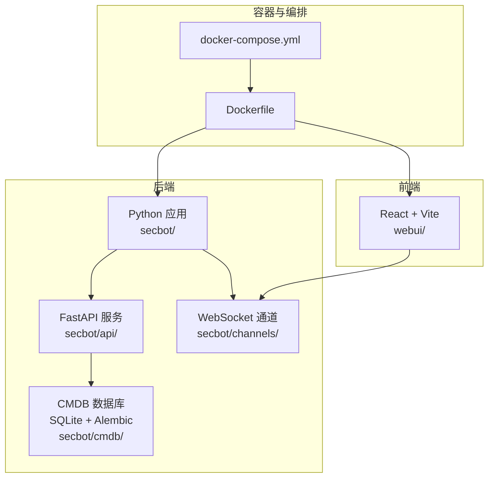
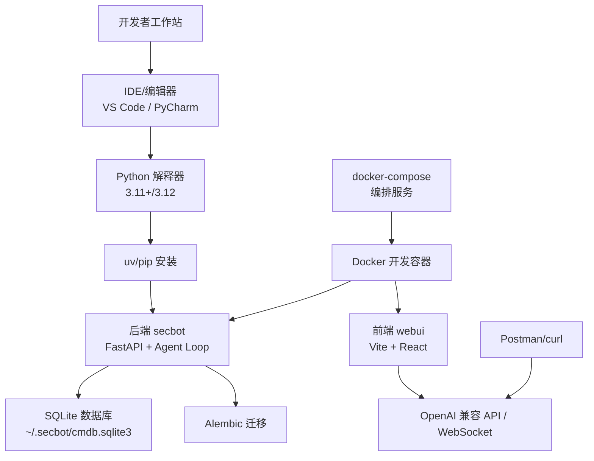
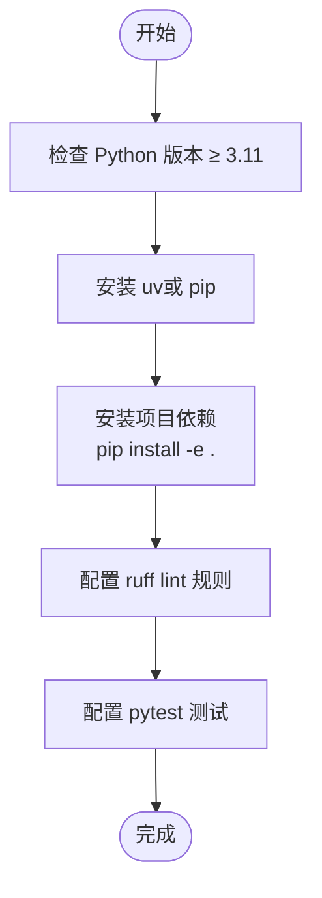
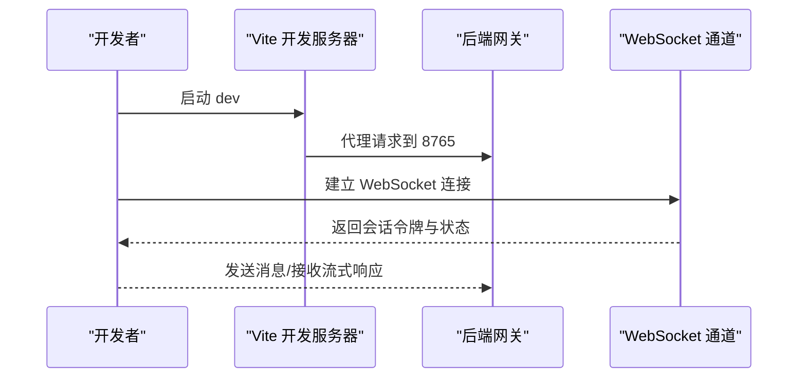
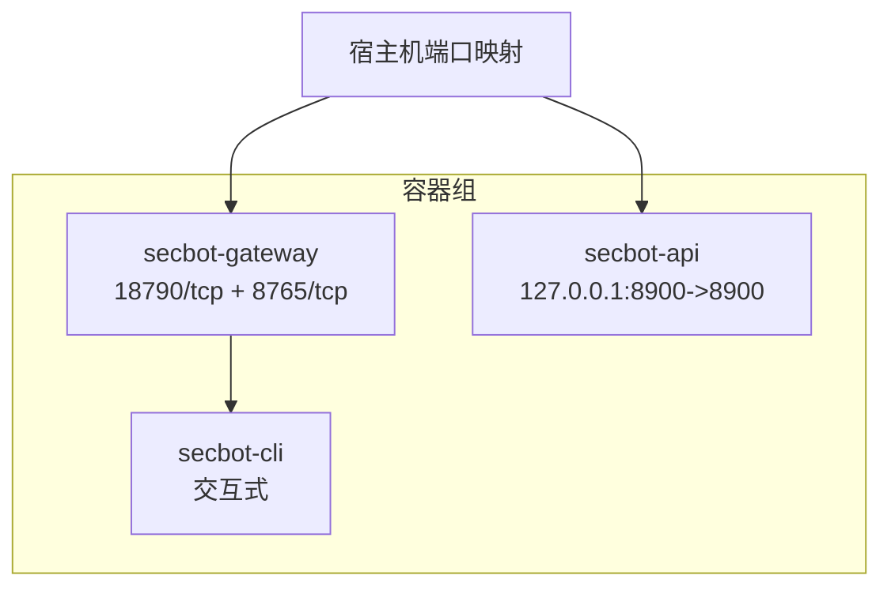
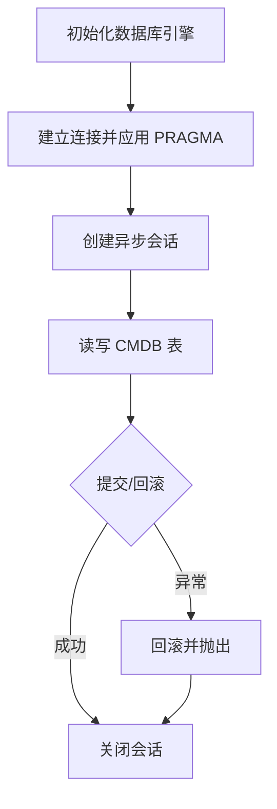
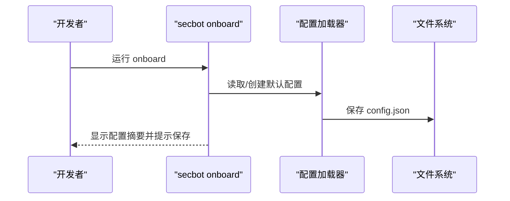
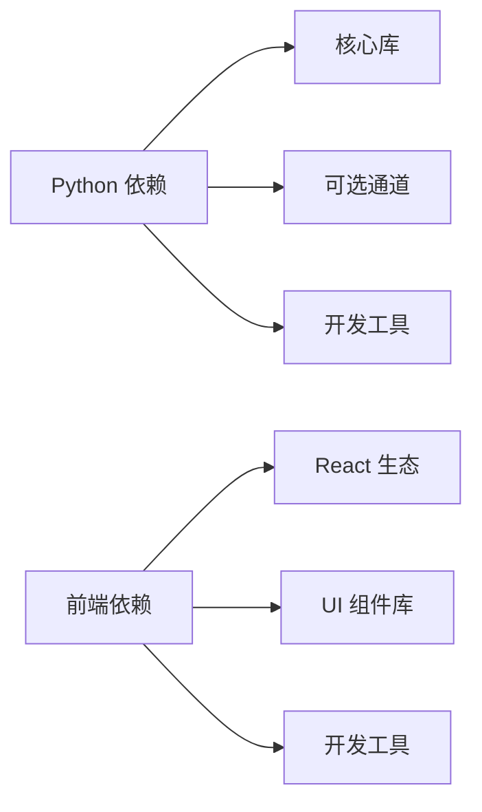

# 开发环境搭建

<cite>
**本文引用的文件**   
- [README.md](file://README.md)
- [pyproject.toml](file://pyproject.toml)
- [Dockerfile](file://Dockerfile)
- [docker-compose.yml](file://docker-compose.yml)
- [webui/package.json](file://webui/package.json)
- [webui/README.md](file://webui/README.md)
- [secbot/config/loader.py](file://secbot/config/loader.py)
- [secbot/config/schema.py](file://secbot/config/schema.py)
- [secbot/cmdb/db.py](file://secbot/cmdb/db.py)
- [secbot/cli/onboard.py](file://secbot/cli/onboard.py)
- [entrypoint.sh](file://entrypoint.sh)
</cite>

## 目录
1. [简介](#简介)
2. [项目结构](#项目结构)
3. [核心组件](#核心组件)
4. [架构总览](#架构总览)
5. [详细组件分析](#详细组件分析)
6. [依赖分析](#依赖分析)
7. [性能考虑](#性能考虑)
8. [故障排除指南](#故障排除指南)
9. [结论](#结论)
10. [附录](#附录)

## 简介
本文件面向 VAPT3/secbot 项目的开发者，提供从零开始搭建本地开发环境的完整指南。内容覆盖：
- Python 版本与系统依赖
- IDE 配置与常用插件
- 开发工具链（lint、格式化、调试）
- Docker 容器化开发与服务编排
- 数据库开发环境（SQLite + Alembic）
- API 测试工具（Postman、curl）
- 常见问题与故障排除

## 项目结构
该项目采用“后端 Python + 前端 React/Vite”的双栈架构，配合 Docker 进行容器化与服务编排。关键目录与职责如下：
- secbot/：后端核心代码（Agent、API、通道、CMDB、技能等）
- webui/：前端源码（React + Vite + Tailwind），通过 WebSocket 与后端通信
- tests/：单元与集成测试
- docs/：项目文档
- Dockerfile、docker-compose.yml：容器化与服务编排
- pyproject.toml：Python 项目元数据、依赖与开发工具配置

**图表来源**
- [Dockerfile:1-51](file://Dockerfile#L1-L51)
- [docker-compose.yml:1-56](file://docker-compose.yml#L1-L56)
- [README.md:29-75](file://README.md#L29-L75)

**章节来源**
- [README.md:259-276](file://README.md#L259-L276)
- [Dockerfile:1-51](file://Dockerfile#L1-L51)
- [docker-compose.yml:1-56](file://docker-compose.yml#L1-L56)

## 核心组件
- Python 版本与依赖
  - Python 版本要求：≥ 3.11（推荐 3.12）
  - 项目使用 uv 作为包管理与安装工具，构建系统为 hatchling
  - 开发依赖包含 pytest、ruff、vite 等
- 前端依赖
  - 使用 Vite + React + TypeScript + Tailwind 构建
  - 开发脚本包含 dev/build/test/lint
- 容器镜像
  - 基于 astral-sh/uv 的 Python 3.12 slim 镜像
  - 预装 Node.js 20 以支持 WhatsApp 桥接
- 配置系统
  - 基于 Pydantic 的配置模型，支持环境变量前缀 SECBOT_
  - 支持配置热迁移与 SSRF 白名单应用
- 数据库
  - SQLite + SQLAlchemy Async + Alembic 迁移
  - 默认数据库路径位于 ~/.secbot/cmdb.sqlite3

**章节来源**
- [pyproject.toml:1-169](file://pyproject.toml#L1-L169)
- [webui/package.json:1-67](file://webui/package.json#L1-L67)
- [Dockerfile:1-51](file://Dockerfile#L1-L51)
- [secbot/config/schema.py:267-376](file://secbot/config/schema.py#L267-L376)
- [secbot/config/loader.py:32-81](file://secbot/config/loader.py#L32-L81)
- [secbot/cmdb/db.py:29-93](file://secbot/cmdb/db.py#L29-L93)

## 架构总览
下图展示开发环境中的主要组件与交互关系，涵盖本地开发、容器化开发与 API/数据库访问。

**图表来源**
- [pyproject.toml:1-169](file://pyproject.toml#L1-L169)
- [Dockerfile:1-51](file://Dockerfile#L1-L51)
- [docker-compose.yml:1-56](file://docker-compose.yml#L1-L56)
- [README.md:113-179](file://README.md#L113-L179)

## 详细组件分析

### Python 开发环境
- 版本要求
  - Python ≥ 3.11；项目元数据声明支持 3.11/3.12
- 包管理与安装
  - 使用 uv 进行安装，支持缓存与系统安装
  - 通过 pip install -e . 进行可编辑安装
- 开发工具
  - ruff：lint 与格式化（line-length=100，target-version=py311）
  - pytest：测试框架（asyncio_mode=auto，testpaths=tests）

**图表来源**
- [pyproject.toml:6-169](file://pyproject.toml#L6-L169)

**章节来源**
- [pyproject.toml:6-169](file://pyproject.toml#L6-L169)

### IDE 配置指南
- VS Code
  - 插件推荐
    - Python（Microsoft）：语法、调试、测试
    - Pylance：类型检查与智能感知
    - Ruff：lint 与格式化
    - Python Docstring Generator：自动生成 docstring
    - EditorConfig：统一缩进与换行
    - GitLens：Git 历史与差异
    - Bracket Pair Colorizer：括号匹配
  - 设置要点
    - 使用工作区 Python 解释器（3.11+/3.12）
    - 启用 Pylance 类型检查
    - ruff.lint.args 与 ruff.format.args 对齐 pyproject.toml
- PyCharm
  - 插件推荐
    - Ruff：lint
    - .ignore：忽略规则
    - String Manipulation：字符串处理
  - 设置要点
    - 项目解释器选择 3.11+/3.12
    - 代码风格与 PEP8 对齐
    - 使用 pytest 运行器执行测试

**章节来源**
- [pyproject.toml:145-151](file://pyproject.toml#L145-L151)

### 前端开发环境（webui）
- Node.js 版本
  - 容器镜像预装 Node.js 20（用于 WhatsApp 桥接）
  - 本地开发可使用 bun 或 npm
- 依赖安装与开发
  - 安装依赖：bun install 或 npm install
  - 启动开发服务器：bun run dev
  - 默认代理将 /api、/webui、/auth 与 WebSocket 转发至 8765
- 构建与测试
  - 构建：bun run build
  - 测试：bun run test

**图表来源**
- [webui/README.md:72-90](file://webui/README.md#L72-L90)
- [README.md:159-167](file://README.md#L159-L167)

**章节来源**
- [webui/package.json:1-67](file://webui/package.json#L1-L67)
- [webui/README.md:28-90](file://webui/README.md#L28-L90)

### Docker 开发环境
- 镜像基础
  - 基于 Python 3.12 slim，预装 Node.js 20
  - 非 root 用户运行，映射 ~/.secbot 到 /home/secbot/.secbot
- 服务编排
  - secbot-gateway：对外暴露 18790（健康检查）+ WebSocket 8765
  - secbot-api：OpenAI 兼容 API，监听 8900（仅本机）
  - secbot-cli：交互式 CLI（容器内）
- 使用方式
  - docker-compose up -d 启动所需服务
  - 通过宿主机端口访问网关与 API

**图表来源**
- [docker-compose.yml:15-56](file://docker-compose.yml#L15-L56)
- [Dockerfile:35-50](file://Dockerfile#L35-L50)

**章节来源**
- [Dockerfile:1-51](file://Dockerfile#L1-L51)
- [docker-compose.yml:1-56](file://docker-compose.yml#L1-L56)

### 数据库开发环境（CMDB）
- 默认数据库
  - SQLite 文件：~/.secbot/cmdb.sqlite3
  - 可通过环境变量 SECBOT_CMDB_URL 覆盖
- 连接与会话
  - 使用 SQLAlchemy AsyncEngine + async_sessionmaker
  - 每个新连接启用 WAL、foreign_keys、busy_timeout 等参数
- 迁移
  - 使用 Alembic 进行迁移管理
  - 常用命令：查看路径、执行迁移、查询资产/漏洞/任务

**图表来源**
- [secbot/cmdb/db.py:64-123](file://secbot/cmdb/db.py#L64-L123)

**章节来源**
- [secbot/cmdb/db.py:1-133](file://secbot/cmdb/db.py#L1-L133)
- [README.md:223-237](file://README.md#L223-L237)

### 配置系统与初始化
- 配置文件
  - 默认路径：~/.secbot/config.json
  - 支持环境变量替换 ${VAR}
  - 支持配置迁移（兼容旧字段）
- 初始化向导
  - secbot onboard 提供交互式引导，自动填充模型、上下文窗口等
  - 支持敏感字段掩码显示
- 关键配置项
  - providers：各 LLM 提供商的 apiKey/base
  - agents.defaults：默认模型、温度、最大工具调用次数等
  - channels.websocket：启用 WebSocket 并设置 host/port/token

**图表来源**
- [secbot/cli/onboard.py:1-120](file://secbot/cli/onboard.py#L1-L120)
- [secbot/config/loader.py:32-81](file://secbot/config/loader.py#L32-L81)
- [secbot/config/schema.py:267-376](file://secbot/config/schema.py#L267-L376)

**章节来源**
- [secbot/cli/onboard.py:1-120](file://secbot/cli/onboard.py#L1-L120)
- [secbot/config/loader.py:32-81](file://secbot/config/loader.py#L32-L81)
- [secbot/config/schema.py:18-113](file://secbot/config/schema.py#L18-L113)

### API 测试工具
- OpenAI 兼容 API
  - 启动：secbot serve -p 8000
  - 端点：/v1/chat/completions
  - 需要配置默认提供商的 apiKey
- WebSocket 通道
  - 启动：secbot gateway
  - 端口：18790（健康检查）+ 8765（WebSocket）
  - WebUI 通过 /webui/bootstrap 获取会话令牌
- Postman/curl
  - 使用 curl 验证健康检查与会话引导
  - 在 Postman 中导入 OpenAI 兼容接口规范进行测试

**章节来源**
- [README.md:113-179](file://README.md#L113-L179)

## 依赖分析
- Python 依赖
  - 核心：typer、anthropic、pydantic、websockets、httpx、sqlalchemy[asyncio]、aiosqlite、alembic 等
  - 可选通道：aiohttp、wecom、weixin、msteams、matrix、discord、langsmith、pdf 等
  - 开发：pytest、pytest-asyncio、pytest-cov、ruff、pymupdf
- 前端依赖
  - React 生态、Tailwind、assistant-ui、@tanstack/react-query、echarts 等
  - 开发：vite、typescript、vitest、tailwindcss、eslint

**图表来源**
- [pyproject.toml:25-110](file://pyproject.toml#L25-L110)
- [webui/package.json:14-65](file://webui/package.json#L14-L65)

**章节来源**
- [pyproject.toml:25-110](file://pyproject.toml#L25-L110)
- [webui/package.json:14-65](file://webui/package.json#L14-L65)

## 性能考虑
- 数据库并发
  - WAL 模式 + foreign_keys + busy_timeout 减少“database is locked”风险
  - 连接池 pre_ping 保障连接可用性
- Lint 与格式化
  - ruff 配置合理行宽与目标版本，提升一致性与性能
- 前端构建
  - Vite 快速冷启动与热更新，生产构建优化打包体积
- 容器资源限制
  - docker-compose 为各服务设置 CPU/内存上限与预留，避免资源争用

**章节来源**
- [secbot/cmdb/db.py:51-93](file://secbot/cmdb/db.py#L51-L93)
- [pyproject.toml:145-151](file://pyproject.toml#L145-L151)
- [docker-compose.yml:23-47](file://docker-compose.yml#L23-L47)

## 故障排除指南
- 启动后端失败（API Key 未配置）
  - 现象：启动时报错提示未配置提供商 apiKey
  - 处理：在 ~/.secbot/config.json 中为默认提供商填写 apiKey
- WebSocket 连接失败（ECONNREFUSED）
  - 现象：浏览器提示无法连接到 nanobot，Vite 日志 ECONNREFUSED 127.0.0.1:8765
  - 处理：确认 channels.websocket.enabled=true；确保启动的是 secbot gateway 而非 secbot serve
- WebUI 无法加载
  - 现象：页面空白或报错
  - 处理：先安装 webui 依赖（bun install/npm install），再启动 dev；确认代理指向 8765
- 数据库被锁定
  - 现象：短写入频繁报“database is locked”
  - 处理：确认已启用 WAL 模式与 foreign_keys；避免长时间事务
- 端口冲突
  - 现象：18790/8765/8900 端口占用
  - 处理：修改 docker-compose 映射或释放端口；或在宿主机调整端口

**章节来源**
- [README.md:169-179](file://README.md#L169-L179)
- [secbot/config/loader.py:51-56](file://secbot/config/loader.py#L51-L56)
- [secbot/cmdb/db.py:51-62](file://secbot/cmdb/db.py#L51-L62)

## 结论
通过以上步骤，您可以完成 VAPT3/secbot 的本地开发环境搭建与日常开发工作流。建议优先使用容器化开发以获得一致的运行环境，同时结合 IDE 插件与 ruff/pytest 提升代码质量与效率。遇到问题时，可依据故障排除章节逐项排查。

## 附录
- 快速命令清单
  - 安装依赖：pip install -e .
  - 启动网关：secbot gateway -v
  - 启动 API：secbot serve -v -p 8000
  - WebUI 开发：cd webui && bun run dev
  - 数据库迁移：secbot cmdb migrate
  - 初始化配置：secbot onboard