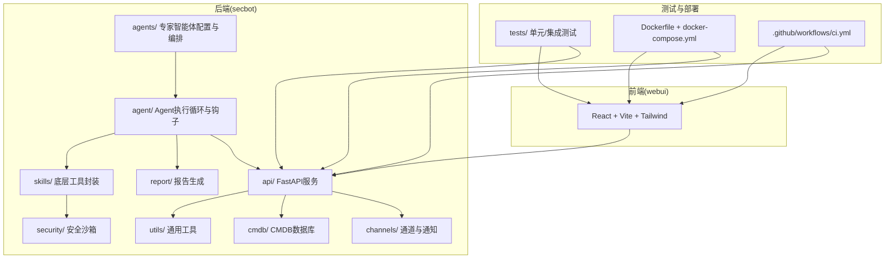
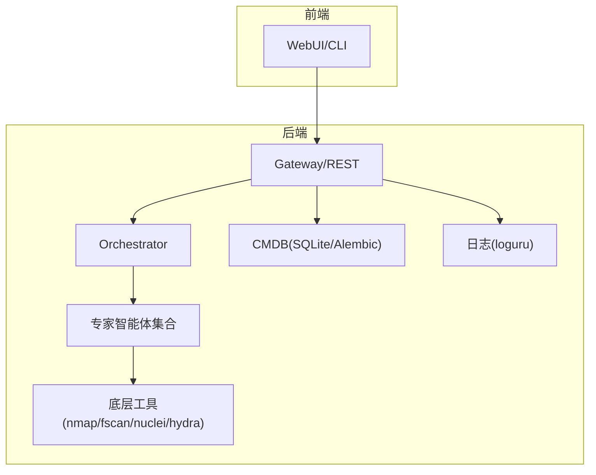
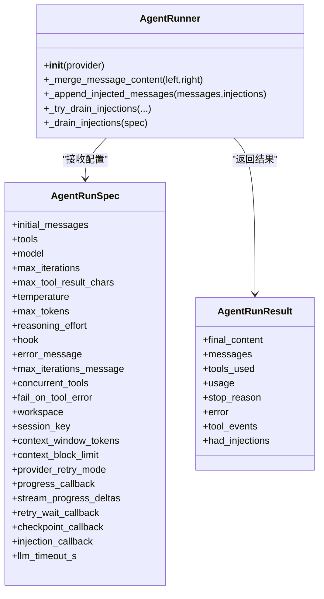
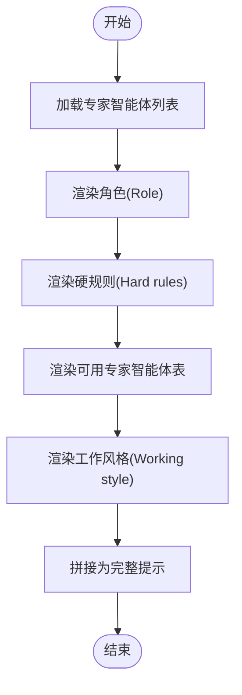
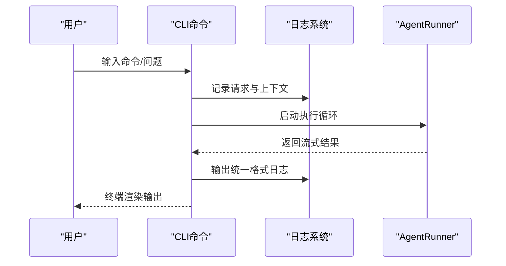
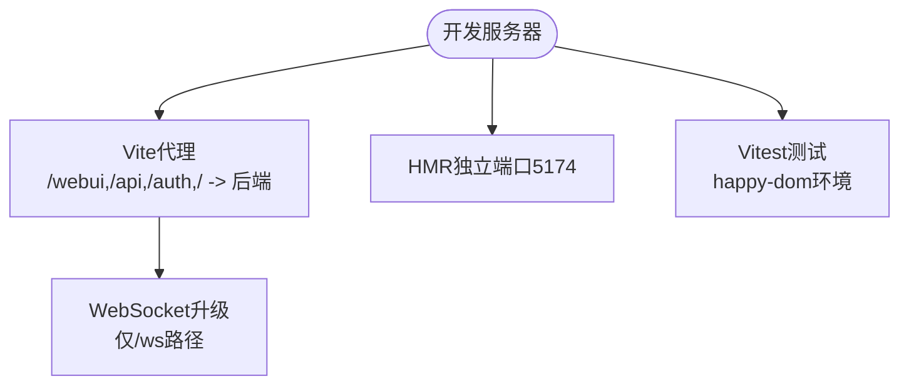
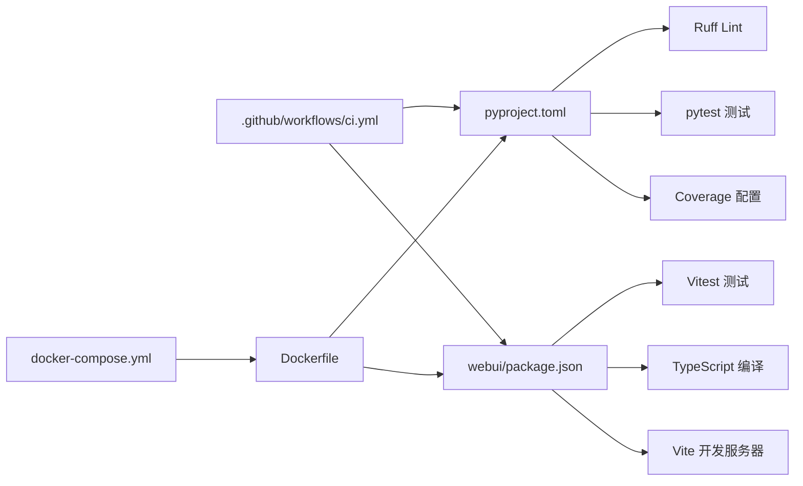

# 开发者指南

<cite>
**本文引用的文件**
- [README.md](file://README.md)
- [pyproject.toml](file://pyproject.toml)
- [Dockerfile](file://Dockerfile)
- [.github/workflows/ci.yml](file://.github/workflows/ci.yml)
- [docker-compose.yml](file://docker-compose.yml)
- [secbot/__init__.py](file://secbot/__init__.py)
- [secbot/cli/commands.py](file://secbot/cli/commands.py)
- [secbot/agent/runner.py](file://secbot/agent/runner.py)
- [secbot/agents/orchestrator.py](file://secbot/agents/orchestrator.py)
- [webui/package.json](file://webui/package.json)
- [webui/tsconfig.json](file://webui/tsconfig.json)
- [webui/vite.config.ts](file://webui/vite.config.ts)
- [webui/src/tests/setup.ts](file://webui/src/tests/setup.ts)
- [secbot/utils/logging_bridge.py](file://secbot/utils/logging_bridge.py)
- [tests/test_package_version.py](file://tests/test_package_version.py)
- [tests/test_secbot_facade.py](file://tests/test_secbot_facade.py)
- [tests/api/test_prompts.py](file://tests/api/test_prompts.py)
- [tests/channels/test_websocket_channel.py](file://tests/channels/test_websocket_channel.py)
- [tests/providers/test_openai_responses.py](file://tests/providers/test_openai_responses.py)
- [tests/tools/test_tool_registry.py](file://tests/tools/test_tool_registry.py)
- [tests/skills/test_handlers.py](file://tests/skills/test_handlers.py)
- [tests/agent/test_agent_registry.py](file://tests/agent/test_agent_registry.py)
- [tests/config/test_config_migration.py](file://tests/config/test_config_migration.py)
- [tests/cmdb/conftest.py](file://tests/cmdb/conftest.py)
- [tests/skills/conftest.py](file://tests/skills/conftest.py)
</cite>

## 目录
1. [简介](#简介)
2. [项目结构](#项目结构)
3. [核心组件](#核心组件)
4. [架构总览](#架构总览)
5. [详细组件分析](#详细组件分析)
6. [依赖关系分析](#依赖关系分析)
7. [性能考量](#性能考量)
8. [故障排除指南](#故障排除指南)
9. [结论](#结论)
10. [附录](#附录)

## 简介
本指南面向 VAPT3/secbot 的开发者，覆盖代码规范与开发约定、测试策略与框架、贡献流程、开发环境搭建、调试与故障排除、性能分析与优化、文档与API维护、CI/CD 最佳实践，以及新功能开发的完整工作流程与检查清单。项目采用 Python 与 TypeScript 双栈：后端基于 FastAPI 与自研 Agent Loop，前端采用 React + Vite + Tailwind。

## 项目结构
- 后端核心：secbot/ 下包含 agents、agent、api、channels、cmdb、report、skills、security、utils 等子模块，分别负责专家智能体编排、Agent 执行循环、API 服务、通道与通知、CMDB 数据库、报告生成、底层工具封装、安全沙箱与工具安全、通用工具函数。
- 前端：webui/ 使用 React + Vite 构建，包含组件、页面、国际化、类型与测试等。
- 测试：tests/ 覆盖 agent、api、channels、cli、cmdb、command、config、cron、heartbeat、providers、report、security、session、skills、tools、utils 等模块。
- 部署：Dockerfile 与 docker-compose.yml 提供容器化与多服务编排；GitHub Actions CI 配置确保跨平台与多 Python 版本测试。
- 文档：docs/ 与根目录 README.md 提供使用与开发参考。

图表来源
- [README.md:29-75](file://README.md#L29-L75)
- [Dockerfile:1-51](file://Dockerfile#L1-L51)
- [docker-compose.yml:1-56](file://docker-compose.yml#L1-L56)
- [pyproject.toml:1-169](file://pyproject.toml#L1-L169)

章节来源
- [README.md:259-276](file://README.md#L259-L276)
- [pyproject.toml:1-169](file://pyproject.toml#L1-L169)

## 核心组件
- Agent 执行循环：统一的工具调用循环，支持消息注入、令牌估算、错误恢复、进度回调、检查点等，保证长对话与复杂工具调用的稳定性。
- Orchestrator 系统提示：固定角色、规则与工作风格，动态注入可用专家智能体表，确保全局一致性与可审计性。
- CLI 命令行：基于 Typer 的命令入口，统一日志格式、历史记录、终端兼容处理，支持交互式问答与流式输出。
- 日志桥接：将标准库 logging 重定向至 loguru，统一格式与层级，便于集中观测与排查。
- 前端测试环境：Vitest + happy-dom，提供 i18n 初始化、localStorage 与 window.alert 的最小化补丁，确保组件测试稳定。

章节来源
- [secbot/agent/runner.py:100-200](file://secbot/agent/runner.py#L100-L200)
- [secbot/agents/orchestrator.py:52-70](file://secbot/agents/orchestrator.py#L52-L70)
- [secbot/cli/commands.py:74-82](file://secbot/cli/commands.py#L74-L82)
- [secbot/utils/logging_bridge.py:34-47](file://secbot/utils/logging_bridge.py#L34-L47)
- [webui/src/tests/setup.ts:1-83](file://webui/src/tests/setup.ts#L1-L83)

## 架构总览
系统分为四层：对话交互层、调度编排层、专家智能体层、工具执行层。后端通过 FastAPI 提供 REST 与 WebSocket，前端通过 Vite 开发代理与后端联调，测试覆盖后端与前端。

图表来源
- [README.md:29-75](file://README.md#L29-L75)
- [secbot/agents/orchestrator.py:17-40](file://secbot/agents/orchestrator.py#L17-L40)

## 详细组件分析

### Agent 执行循环（AgentRunner）
- 职责：统一的 LLM 工具调用循环，负责消息拼接、注入、错误恢复、令牌估算、并发工具、进度回调与检查点。
- 关键点：限制最大注入轮次与单轮注入数量，避免无限注入；支持“空响应”与“长度恢复”重试；提供“回填占位内容”保障中断后的可追踪性。
- 并发与安全：通过并发工具开关与工具白名单，控制潜在风险；结合安全沙箱与命令注入防护。

图表来源
- [secbot/agent/runner.py:56-98](file://secbot/agent/runner.py#L56-L98)
- [secbot/agent/runner.py:100-200](file://secbot/agent/runner.py#L100-L200)

章节来源
- [secbot/agent/runner.py:100-200](file://secbot/agent/runner.py#L100-L200)

### Orchestrator 系统提示渲染
- 职责：渲染固定角色、硬规则、工作风格与动态专家智能体表，保证全局一致的编排策略。
- 输出：字节稳定的提示文本，便于快照与回归测试。

图表来源
- [secbot/agents/orchestrator.py:52-70](file://secbot/agents/orchestrator.py#L52-L70)

章节来源
- [secbot/agents/orchestrator.py:17-40](file://secbot/agents/orchestrator.py#L17-L40)

### CLI 命令行与日志
- CLI：Typer 命令入口，统一日志格式、历史记录、Windows 终端编码处理、交互式渲染与流式输出。
- 日志：loguru 替代默认 handler，统一时间、级别、通道与消息格式，便于问题定位。

图表来源
- [secbot/cli/commands.py:25-38](file://secbot/cli/commands.py#L25-L38)
- [secbot/agent/runner.py:100-200](file://secbot/agent/runner.py#L100-L200)

章节来源
- [secbot/cli/commands.py:74-82](file://secbot/cli/commands.py#L74-L82)
- [secbot/utils/logging_bridge.py:34-47](file://secbot/utils/logging_bridge.py#L34-L47)

### 前端开发与测试
- 技术栈：React + Vite + Tailwind + Vitest + happy-dom。
- 开发代理：将 /webui、/api、/auth、/（WebSocket 升级）转发到后端；HMR 独立端口避免冲突。
- 测试初始化：i18n 切换、localStorage 与 window.alert 补丁，确保测试环境稳定。

图表来源
- [webui/vite.config.ts:41-58](file://webui/vite.config.ts#L41-L58)
- [webui/package.json:6-13](file://webui/package.json#L6-L13)
- [webui/tsconfig.json:17-24](file://webui/tsconfig.json#L17-L24)
- [webui/src/tests/setup.ts:1-83](file://webui/src/tests/setup.ts#L1-L83)

章节来源
- [webui/package.json:1-67](file://webui/package.json#L1-L67)
- [webui/tsconfig.json:1-33](file://webui/tsconfig.json#L1-L33)
- [webui/vite.config.ts:1-66](file://webui/vite.config.ts#L1-L66)
- [webui/src/tests/setup.ts:1-83](file://webui/src/tests/setup.ts#L1-L83)

## 依赖关系分析
- 后端依赖：pyproject.toml 定义核心依赖与可选渠道、PDF、LangSmith 等扩展；Ruff 作为 Linter；pytest 与覆盖率配置。
- 前端依赖：package.json 定义 React 生态与测试工具；tsconfig.json 严格模式与路径别名；vite.config.ts 代理与 HMR。
- CI：GitHub Actions 跨平台矩阵测试，安装系统依赖与 uv，执行 ruff 与 pytest。
- 容器化：Dockerfile 基于 uv，安装 Node.js 与 Python 依赖，非 root 用户运行，暴露网关端口。

图表来源
- [pyproject.toml:145-168](file://pyproject.toml#L145-L168)
- [webui/package.json:1-67](file://webui/package.json#L1-67)
- [webui/tsconfig.json:17-24](file://webui/tsconfig.json#L17-L24)
- [.github/workflows/ci.yml:1-40](file://.github/workflows/ci.yml#L1-L40)
- [Dockerfile:1-51](file://Dockerfile#L1-L51)
- [docker-compose.yml:1-56](file://docker-compose.yml#L1-L56)

章节来源
- [pyproject.toml:145-168](file://pyproject.toml#L145-L168)
- [webui/package.json:1-67](file://webui/package.json#L1-67)
- [.github/workflows/ci.yml:1-40](file://.github/workflows/ci.yml#L1-L40)
- [Dockerfile:1-51](file://Dockerfile#L1-L51)
- [docker-compose.yml:1-56](file://docker-compose.yml#L1-L56)

## 性能考量
- 代码规范与静态检查：Ruff 配置统一行宽与选择规则，CI 中强制执行，减少风格分歧带来的维护成本。
- 测试覆盖率：覆盖率配置仅统计 secbot 包，忽略 tests 目录，确保指标聚焦业务代码。
- 日志与可观测性：统一 loguru 格式，便于日志聚合与检索；前端测试使用 happy-dom，降低测试开销。
- 前端开发体验：Vite HMR 独立端口避免冲突；代理仅对 WebSocket 升级生效，保证 SPA 正常访问。

章节来源
- [pyproject.toml:145-168](file://pyproject.toml#L145-L168)
- [webui/vite.config.ts:33-58](file://webui/vite.config.ts#L33-L58)
- [webui/src/tests/setup.ts:1-83](file://webui/src/tests/setup.ts#L1-L83)

## 故障排除指南
- 常见问题
  - WebSocket 连接失败：确认 channels.websocket.enabled 已启用，且启动的是 gateway 而非 serve。
  - OpenAI 兼容 API 启动报错：默认模型对应的 Provider 未配置 apiKey。
  - 前端无法连接后端：检查 NANOBOT_API_URL 与 Vite 代理配置，确保 / 仅对 WebSocket 升级转发。
- 日志分析
  - 使用统一的日志格式，按 channel 分类过滤；必要时临时提升日志级别定位问题。
  - 标准库日志可通过 logging_bridge 重定向至 loguru，避免重复与格式不一致。
- 性能与内存
  - 优先使用异步与并发工具开关，避免阻塞；关注工具调用结果大小与令牌估算，防止上下文膨胀。
  - 前端测试使用 happy-dom，减少 DOM 与浏览器环境开销。

章节来源
- [README.md:169-179](file://README.md#L169-L179)
- [webui/vite.config.ts:41-58](file://webui/vite.config.ts#L41-L58)
- [secbot/utils/logging_bridge.py:34-47](file://secbot/utils/logging_bridge.py#L34-L47)

## 结论
本指南从代码规范、测试策略、贡献流程、开发环境、调试与故障排除、性能优化、文档与CI/CD到新功能开发流程，提供了面向 VAPT3/secbot 的系统化开发者指引。建议在开发过程中遵循统一的编码与测试规范，利用 CI 保障质量，并通过日志与测试工具快速定位问题。

## 附录

### 代码规范与开发约定
- Python
  - 使用 Ruff 进行 Lint，统一行宽与规则；避免 E501（行长）等常见问题。
  - pytest 异步模式自动开启，测试路径指向 tests/。
  - 覆盖率仅统计 secbot 包，忽略 tests 目录。
- TypeScript
  - 严格模式、无未使用变量/参数、无switch贯穿；路径别名 @/* 指向 src。
  - Vite 测试环境使用 happy-dom，测试脚本在 package.json 中定义。

章节来源
- [pyproject.toml:145-168](file://pyproject.toml#L145-L168)
- [webui/tsconfig.json:17-24](file://webui/tsconfig.json#L17-L24)
- [webui/package.json:6-13](file://webui/package.json#L6-L13)

### 测试策略与框架
- 单元测试
  - 后端：pytest 覆盖 agent、api、channels、cli、cmdb、command、config、cron、heartbeat、providers、report、security、session、skills、tools、utils 等模块。
  - 前端：Vitest + happy-dom，组件测试与工具测试分离，setup.ts 提供 i18n 与环境补丁。
- 集成测试
  - 通过 conftest.py 注入共享配置，如 tests/skills/conftest.py 与 tests/cmdb/conftest.py。
- 端到端测试
  - 建议在网关与前端联调阶段增加 E2E 测试，覆盖关键用户路径（如 WebSocket 通道、通知面板、会话搜索）。

章节来源
- [tests/test_package_version.py](file://tests/test_package_version.py)
- [tests/test_secbot_facade.py](file://tests/test_secbot_facade.py)
- [tests/api/test_prompts.py](file://tests/api/test_prompts.py)
- [tests/channels/test_websocket_channel.py](file://tests/channels/test_websocket_channel.py)
- [tests/providers/test_openai_responses.py](file://tests/providers/test_openai_responses.py)
- [tests/tools/test_tool_registry.py](file://tests/tools/test_tool_registry.py)
- [tests/skills/test_handlers.py](file://tests/skills/test_handlers.py)
- [tests/agent/test_agent_registry.py](file://tests/agent/test_agent_registry.py)
- [tests/config/test_config_migration.py](file://tests/config/test_config_migration.py)
- [tests/skills/conftest.py](file://tests/skills/conftest.py)
- [tests/cmdb/conftest.py](file://tests/cmdb/conftest.py)

### 贡献流程指南
- 分支管理：主分支 main 面向稳定迭代，重构与破坏性变更另开分支 PR。
- 提交规范：涉及新的专家智能体或底层工具时，补充相应测试。
- 代码审查：遵循统一规范，确保测试覆盖与日志一致性。
- 合并策略：上游 nanobot 已配置为 upstream，定期同步以保持 Agent Loop 改进。

章节来源
- [README.md:284-289](file://README.md#L284-L289)

### 开发环境搭建
- 后端
  - Python 3.11+，安装项目为可编辑模式；依赖通过 uv 或 pip 安装。
  - Docker：使用 docker-compose 启动 gateway、serve、cli 服务，映射 ~/.secbot 配置目录。
- 前端
  - webui 目录下安装依赖并启动 dev；Vite 默认代理到 127.0.0.1:8765，可通过 NANOBOT_API_URL 覆盖。
- IDE 与调试
  - Python：建议启用 Ruff Lint 与 pytest 集成；使用 loguru 统一日志输出。
  - TypeScript：VS Code + ESLint 插件，Vitest 调试配置；happy-dom 环境下进行组件测试。

章节来源
- [README.md:76-179](file://README.md#L76-L179)
- [Dockerfile:1-51](file://Dockerfile#L1-L51)
- [docker-compose.yml:15-56](file://docker-compose.yml#L15-L56)
- [webui/vite.config.ts:7-8](file://webui/vite.config.ts#L7-L8)
- [webui/package.json:6-13](file://webui/package.json#L6-L13)

### 调试技巧与故障排除
- 后端
  - 使用统一日志格式与通道分类；必要时临时调整日志级别。
  - 通过 AgentRunner 的注入与检查点机制，定位工具调用异常。
- 前端
  - HMR 独立端口避免冲突；代理仅对 WebSocket 升级生效。
  - 测试环境补丁确保 i18n、localStorage、window.alert 的可用性。

章节来源
- [secbot/utils/logging_bridge.py:34-47](file://secbot/utils/logging_bridge.py#L34-L47)
- [secbot/agent/runner.py:145-187](file://secbot/agent/runner.py#L145-L187)
- [webui/vite.config.ts:33-58](file://webui/vite.config.ts#L33-L58)
- [webui/src/tests/setup.ts:1-83](file://webui/src/tests/setup.ts#L1-L83)

### 性能分析与优化指南
- 代码剖析
  - 后端：结合 loguru 的耗时日志与工具调用统计，定位慢调用与高频错误。
  - 前端：Vitest 与 happy-dom 降低测试成本，关注组件渲染与事件处理。
- 瓶颈识别
  - LLM 调用与工具执行是主要瓶颈；通过并发工具开关与上下文压缩策略缓解。
- 优化策略
  - 控制工具调用结果大小与令牌估算；合理设置最大注入轮次与恢复次数；使用缓存与增量更新。

章节来源
- [pyproject.toml:145-168](file://pyproject.toml#L145-L168)
- [webui/src/tests/setup.ts:1-83](file://webui/src/tests/setup.ts#L1-L83)

### 文档编写规范与API维护
- 文档结构：README.md 提供高层概览与架构；docs/ 提供更细粒度的使用与配置文档。
- API 维护：后端 API 通过 FastAPI 定义，测试覆盖关键路由与行为；前端通过 Vite 代理与后端联调。

章节来源
- [README.md:277-283](file://README.md#L277-L283)

### 持续集成与持续部署
- CI：GitHub Actions 跨平台矩阵测试，安装系统依赖与 uv，执行 ruff 与 pytest。
- CD：Dockerfile 与 docker-compose.yml 提供容器化部署；建议在 CI 成功后推送镜像并部署。

章节来源
- [.github/workflows/ci.yml:1-40](file://.github/workflows/ci.yml#L1-L40)
- [Dockerfile:1-51](file://Dockerfile#L1-L51)
- [docker-compose.yml:1-56](file://docker-compose.yml#L1-L56)

### 新功能开发工作流程与检查清单
- 设计与规划
  - 明确专家智能体能力与工具依赖；设计输入/输出 Schema。
- 实现
  - 后端：实现 Agent 配置与工具封装；添加单元测试与集成测试。
  - 前端：实现页面与组件；补充 Vitest 测试与国际化。
- 验证
  - 本地启动 gateway 与前端，验证 WebSocket 通道与交互流程。
- 文档与发布
  - 更新 README 与相关文档；确保 CI 通过；准备版本发布。

章节来源
- [README.md:193-222](file://README.md#L193-L222)
- [tests/test_package_version.py](file://tests/test_package_version.py)
- [tests/test_secbot_facade.py](file://tests/test_secbot_facade.py)