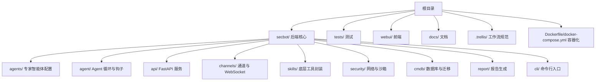
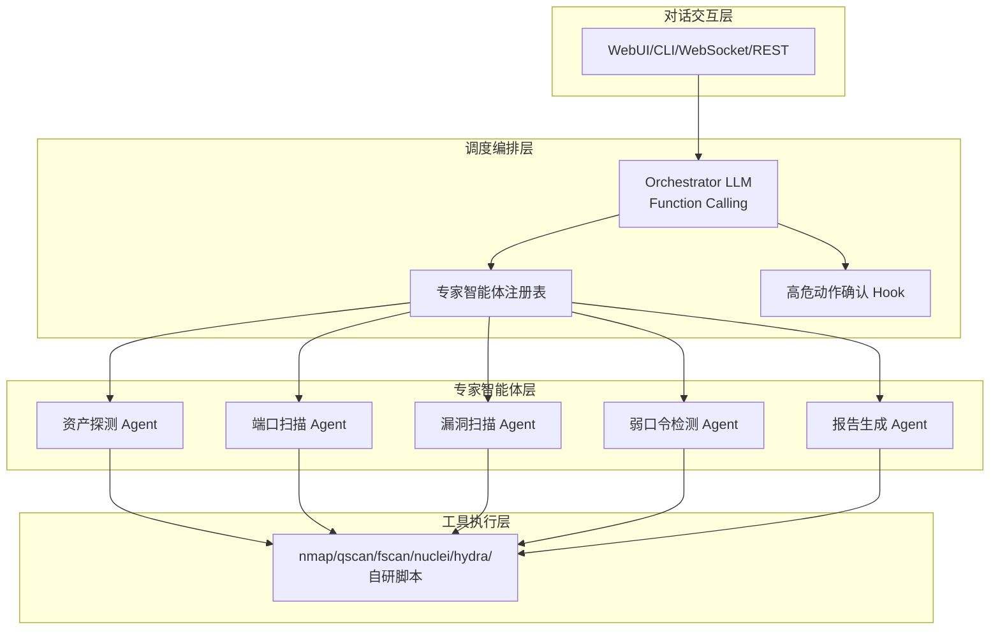
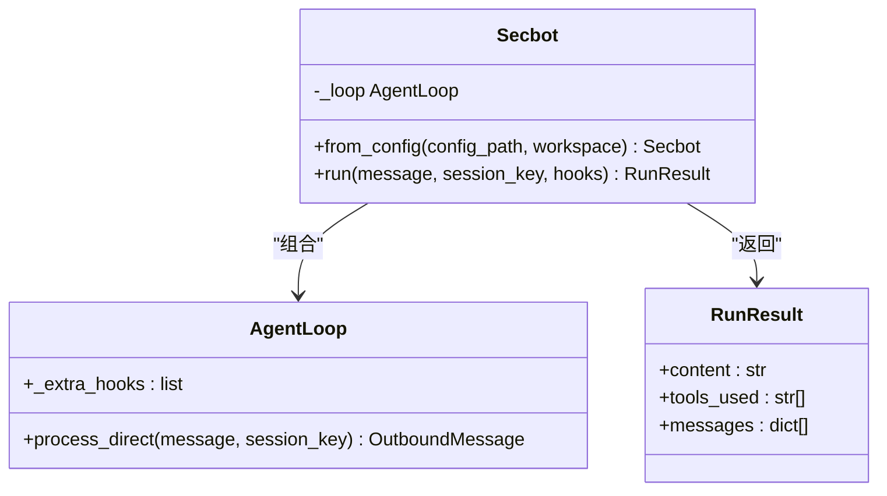
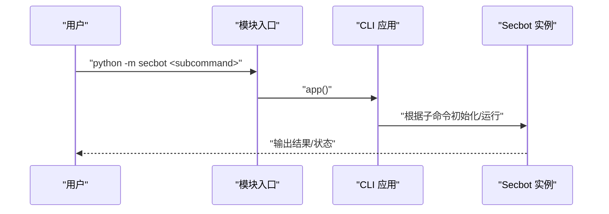
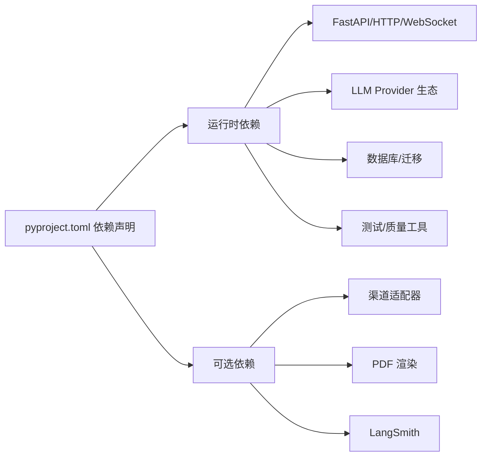

# 开发者指南

<cite>
**本文引用的文件**
- [README.md](file://README.md)
- [pyproject.toml](file://pyproject.toml)
- [Dockerfile](file://Dockerfile)
- [docker-compose.yml](file://docker-compose.yml)
- [entrypoint.sh](file://entrypoint.sh)
- [.trellis/workflow.md](file://.trellis/workflow.md)
- [docs/quick-start.md](file://docs/quick-start.md)
- [docs/configuration.md](file://docs/configuration.md)
- [webui/README.md](file://webui/README.md)
- [secbot/__main__.py](file://secbot/__main__.py)
- [secbot/secbot.py](file://secbot/secbot.py)
- [tests/test_secbot_facade.py](file://tests/test_secbot_facade.py)
</cite>

## 目录
1. [简介](#简介)
2. [项目结构](#项目结构)
3. [核心组件](#核心组件)
4. [架构总览](#架构总览)
5. [详细组件分析](#详细组件分析)
6. [依赖关系分析](#依赖关系分析)
7. [性能考虑](#性能考虑)
8. [故障排除指南](#故障排除指南)
9. [结论](#结论)
10. [附录](#附录)

## 简介
本指南面向开发者，提供代码贡献规范、测试策略与覆盖率要求、开发环境搭建、性能优化、调试与故障排除、扩展开发以及开发工具与工作流程优化建议。项目基于 nanobot 的轻量 Agent Loop，构建“主控 Orchestrator + 可插拔专家智能体池”的网络安全协作系统，支持对话式任务编排、高危动作护栏、CMDB 资产库与报告生成。

## 项目结构
仓库采用分层与功能混合组织方式：
- secbot/：后端核心，包含 Agent 循环、通道、API、技能、安全、报告、CLI 等
- tests/：单测与集成测试
- webui/：React + Vite 前端
- docs/：通用文档
- .trellis/：Trellis 工作流与规范
- .claude/.codex/.github/：平台集成与模板
- Dockerfile/docker-compose.yml：容器化部署

章节来源
- [README.md:259-275](file://README.md#L259-L275)

## 核心组件
- 程序入口与 CLI：通过命令入口启动后端服务、网关或 CLI 交互；支持模块化运行。
- 程序化接口：Secbot Facade 提供从配置创建实例、运行一次对话并返回结果的能力。
- 测试框架：pytest + pytest-asyncio，覆盖核心行为与异常路径。

章节来源
- [secbot/__main__.py:1-9](file://secbot/__main__.py#L1-L9)
- [secbot/secbot.py:23-132](file://secbot/secbot.py#L23-L132)
- [pyproject.toml:103-110](file://pyproject.toml#L103-L110)
- [tests/test_secbot_facade.py:1-302](file://tests/test_secbot_facade.py#L1-L302)

## 架构总览
系统分为四层：对话交互层、调度编排层、专家智能体层、工具执行层。主控 Orchestrator 使用 LLM Function Calling 动态规划任务 DAG，专家智能体以提示词 + 工具 + I/O Schema 封装，工具层对接 nmap/fscan/nuclei/hydra 等安全工具。

章节来源
- [README.md:29-74](file://README.md#L29-L74)

## 详细组件分析

### 程序化接口（SDK）分析
Secbot Facade 提供从配置创建 AgentLoop 实例、运行一次对话并收集工具调用与消息的能力。其关键点：
- 从配置加载与环境变量解析
- 构造 MessageBus 与 AgentLoop 并注入工具与安全配置
- 运行时注入 SDK 捕获 Hook，确保工具使用与消息历史可回溯
- 返回 RunResult，包含内容、工具列表与最终消息

图表来源
- [secbot/secbot.py:14-132](file://secbot/secbot.py#L14-L132)

章节来源
- [secbot/secbot.py:23-132](file://secbot/secbot.py#L23-L132)
- [tests/test_secbot_facade.py:51-302](file://tests/test_secbot_facade.py#L51-L302)

### CLI 与入口分析
- 模块入口：python -m secbot 直接调用 CLI 应用
- 常用命令：gateway（WebUI/网关）、serve（OpenAI 兼容 API）、agent（CLI 交互）、onboard（初始化）

图表来源
- [secbot/__main__.py:1-9](file://secbot/__main__.py#L1-L9)
- [README.md:113-120](file://README.md#L113-L120)

章节来源
- [secbot/__main__.py:1-9](file://secbot/__main__.py#L1-L9)
- [README.md:113-120](file://README.md#L113-L120)

### 测试策略与覆盖率
- 测试框架：pytest + pytest-asyncio
- 覆盖率配置：覆盖率源目录包含 secbot，忽略 tests/* 与 **/tests/*
- 单测示例：程序化接口的构造、运行、Hook 行为、错误恢复等均有针对性测试

建议的测试层次与要求
- 单元测试：覆盖核心类与函数逻辑，重点保障 Secbot Facade、AgentLoop、Provider、Channel 等关键路径
- 集成测试：跨组件协作（消息总线、工具调用、高危动作确认）
- 端到端测试：WebUI 与后端交互、WebSocket 通道、完整对话流程
- 覆盖率：建议整体覆盖率不低于 80%，关键路径不低于 90%

章节来源
- [pyproject.toml:153-169](file://pyproject.toml#L153-L169)
- [tests/test_secbot_facade.py:1-302](file://tests/test_secbot_facade.py#L1-L302)

### 开发环境搭建
- 安装与初始化
  - 从源码安装：pip install -e .
  - 初始化配置：secbot onboard
  - 配置默认模型与 Provider 的 apiKey
- 启动方式
  - CLI 直连：secbot agent
  - OpenAI 兼容 API：secbot serve -p 8000
  - WebUI 网关：secbot gateway（前端通过 /webui/bootstrap 获取 token）
- 前端开发
  - 安装依赖：bun install 或 npm install
  - 启动：bun run dev，代理默认转发到 8765
- 容器化
  - Dockerfile 基于 uv + Python 3.12，安装依赖与构建
  - docker-compose 提供 gateway/api/cli 服务编排

章节来源
- [README.md:76-179](file://README.md#L76-L179)
- [docs/quick-start.md:10-105](file://docs/quick-start.md#L10-L105)
- [webui/README.md:28-136](file://webui/README.md#L28-L136)
- [Dockerfile:1-51](file://Dockerfile#L1-L51)
- [docker-compose.yml:1-56](file://docker-compose.yml#L1-L56)

### 代码贡献规范
- 分支与 PR
  - 主分支 main 面向稳定迭代，重构与破坏性变更请另开分支 PR
  - 涉及新的专家智能体/底层工具时，补充 tests/agent 与 tests/skills 下的测试
- Trellis 工作流
  - 严格遵循 Plan-Execute-Finish 三阶段，使用 .trellis/spec 与 .trellis/tasks 管理任务与规范
  - 使用 trellis-implement / trellis-check 子智能体辅助实现与质量检查
- 提交与审查
  - 提交信息遵循约定式前缀（feat/fix/docs/chore 等），保持简洁明确
  - PR 需通过 CI 与覆盖率检查

章节来源
- [README.md:284-289](file://README.md#L284-L289)
- [.trellis/workflow.md:150-213](file://.trellis/workflow.md#L150-L213)
- [.trellis/workflow.md:428-516](file://.trellis/workflow.md#L428-L516)

### 扩展开发指南
- 新增专家智能体
  - 新建 YAML 配置，声明触发词、输入输出 Schema、系统提示与工具
  - 如需新底层工具，在 skills/ 注册对应 Skill
  - 重启后 Orchestrator 自动纳入候选池
- 插件系统与通道
  - 通道通过 channels/ 管理，WebSocket 通道用于 WebUI
  - 可扩展新通道并在 channels/manager/registry 中注册
- API 扩展
  - 新增路由在 api/ 下实现，遵循 FastAPI 约定
  - 注意鉴权、限流与审计日志

章节来源
- [README.md:193-222](file://README.md#L193-L222)
- [README.md:60-62](file://README.md#L60-L62)

## 依赖关系分析
- 语言与版本：Python >= 3.11
- 关键依赖：FastAPI、websockets、httpx、pydantic、SQLAlchemy/Alembic、pytest、ruff 等
- 可选依赖：各渠道适配器（Telegram、Slack、Discord 等）、PDF 渲染、LangSmith 等
- 容器镜像：基于 uv + Python 3.12，预装 Node.js 20 用于 WhatsApp 桥接

图表来源
- [pyproject.toml:25-110](file://pyproject.toml#L25-L110)

章节来源
- [pyproject.toml:1-169](file://pyproject.toml#L1-L169)

## 性能考虑
- 内存管理
  - 使用上下文压缩与历史合并（consolidation_ratio），减少上下文占用
  - 控制最大工具结果长度与消息条数，避免内存膨胀
- 并发处理
  - 使用 asyncio 与异步 HTTP 客户端，提高 I/O 密集型任务吞吐
  - WebSocket 通道支持多会话并发
- 资源优化
  - Docker 限制 CPU/内存，合理设置 reservations/limits
  - 工具执行层通过沙箱与白名单控制命令注入与网络访问
- 日志与可观测性
  - 使用 loguru 输出结构化日志，结合通道层重试策略与错误元数据

章节来源
- [pyproject.toml:157-169](file://pyproject.toml#L157-L169)
- [README.md:239-246](file://README.md#L239-L246)
- [docker-compose.yml:23-47](file://docker-compose.yml#L23-L47)

## 故障排除指南
- WebUI 无法连接
  - 确认 channels.websocket.enabled=true，且启动的是 gateway 而非 serve
  - 前端代理默认指向 8765，必要时通过 NANOBOT_API_URL 指定
- 容器权限问题
  - ~/.secbot 不可写时，entrypoint.sh 会提示修复方案（chown 或 --user）
- Provider 未配置 API Key
  - 启动即报错提示缺少 API Key，按配置指引添加
- 测试失败
  - 使用 pytest-asyncio 运行，关注覆盖率与排除规则

章节来源
- [README.md:127-179](file://README.md#L127-L179)
- [entrypoint.sh:1-16](file://entrypoint.sh#L1-L16)
- [docs/configuration.md:10-27](file://docs/configuration.md#L10-L27)
- [pyproject.toml:157-169](file://pyproject.toml#L157-L169)

## 结论
本指南提供了从开发环境、测试策略、性能优化到扩展开发与故障排除的完整路径。建议在贡献代码前熟悉 Trellis 工作流与测试规范，确保新增功能具备充分的单元与集成测试覆盖，并在容器化与多平台环境下验证稳定性。

## 附录
- 快速开始与配置参考：见 docs/quick-start.md 与 docs/configuration.md
- WebUI 开发与部署：见 webui/README.md
- 容器化与入口：见 Dockerfile 与 docker-compose.yml、entrypoint.sh