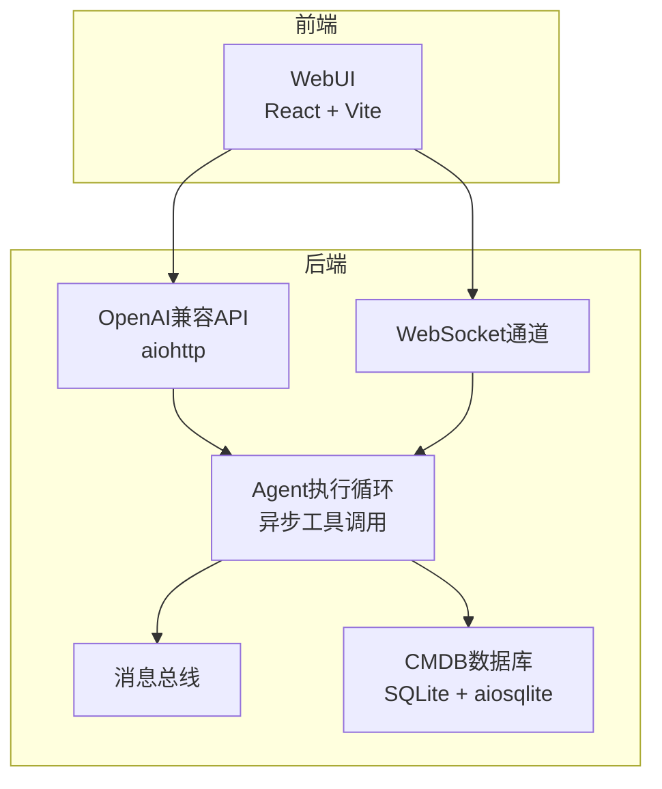
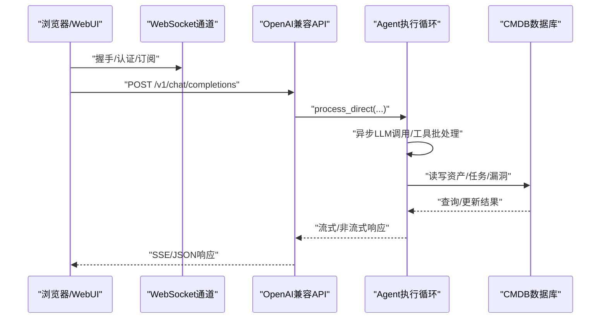
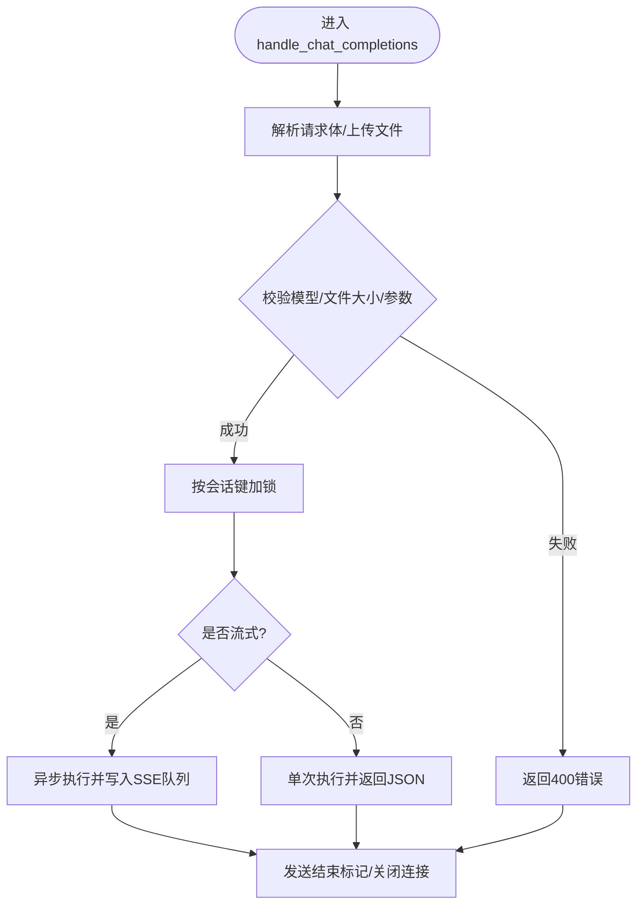
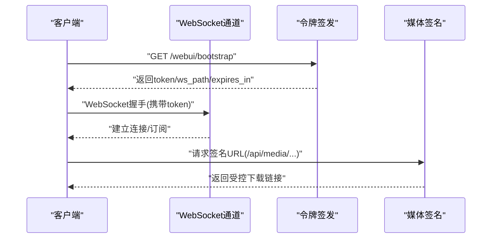
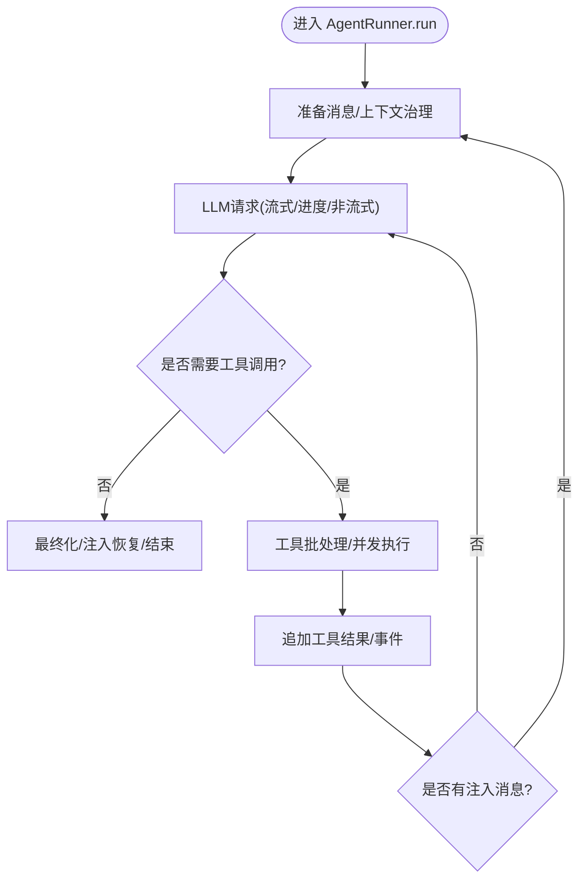
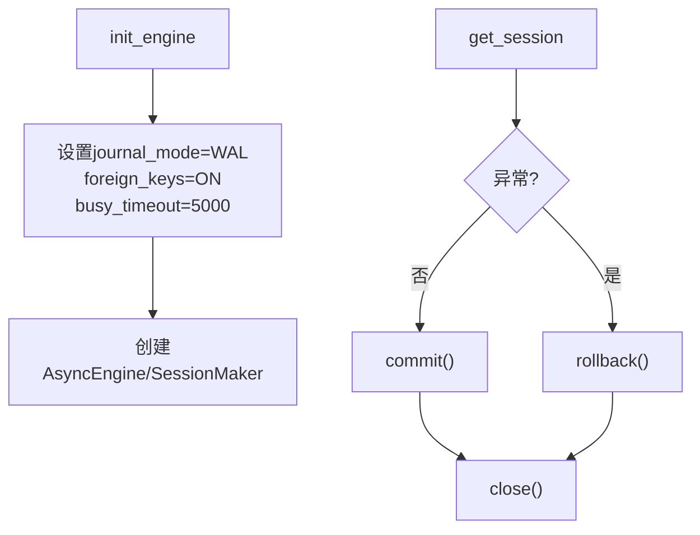
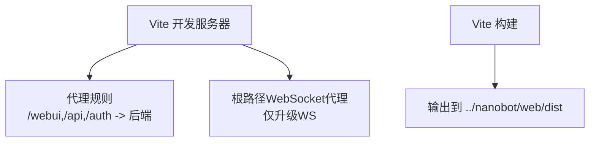
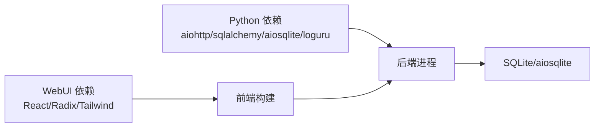

# 性能优化指南

<cite>
**本文引用的文件**
- [README.md](file://README.md)
- [pyproject.toml](file://pyproject.toml)
- [Dockerfile](file://Dockerfile)
- [docker-compose.yml](file://docker-compose.yml)
- [secbot/secbot.py](file://secbot/secbot.py)
- [secbot/api/server.py](file://secbot/api/server.py)
- [secbot/channels/websocket.py](file://secbot/channels/websocket.py)
- [secbot/cmdb/db.py](file://secbot/cmdb/db.py)
- [secbot/agent/runner.py](file://secbot/agent/runner.py)
- [secbot/utils/runtime.py](file://secbot/utils/runtime.py)
- [webui/package.json](file://webui/package.json)
- [webui/vite.config.ts](file://webui/vite.config.ts)
</cite>

## 目录
1. [简介](#简介)
2. [项目结构](#项目结构)
3. [核心组件](#核心组件)
4. [架构总览](#架构总览)
5. [详细组件分析](#详细组件分析)
6. [依赖关系分析](#依赖关系分析)
7. [性能考量](#性能考量)
8. [故障排查指南](#故障排查指南)
9. [结论](#结论)
10. [附录](#附录)

## 简介
本指南围绕该项目的性能优化实践展开，覆盖后端Python（异步并发、内存管理、数据库与缓存）、前端React（组件与状态优化、打包体积优化）、以及整体系统（监控、基准测试、负载与压力测试、CDN与部署）。内容基于仓库中的实际实现与配置文件，提供可落地的优化建议与最佳实践。

## 项目结构
项目采用分层架构：前端WebUI（React/Vite）、后端API（aiohttp）、WebSocket通道、消息总线、异步数据库（SQLAlchemy + aiosqlite）、以及Agent执行循环（LLM + 工具调用）。容器化部署通过Docker与Compose实现。

图表来源
- [README.md:29-53](file://README.md#L29-L53)
- [secbot/api/server.py:381-401](file://secbot/api/server.py#L381-L401)
- [secbot/channels/websocket.py:414-488](file://secbot/channels/websocket.py#L414-L488)
- [secbot/cmdb/db.py:64-93](file://secbot/cmdb/db.py#L64-L93)
- [secbot/agent/runner.py:234-567](file://secbot/agent/runner.py#L234-L567)

章节来源
- [README.md:29-53](file://README.md#L29-L53)
- [pyproject.toml:25-68](file://pyproject.toml#L25-L68)
- [Dockerfile:1-51](file://Dockerfile#L1-L51)
- [docker-compose.yml:15-56](file://docker-compose.yml#L15-L56)

## 核心组件
- 后端API（aiohttp）：提供OpenAI兼容接口与健康检查，支持SSE流式响应与请求超时控制。
- WebSocket通道：提供WebUI与后端的双向通信，含令牌签发、媒体签名URL、订阅管理。
- Agent执行循环：异步LLM调用、工具批处理与并发执行、上下文治理与重试机制。
- CMDB数据库：SQLite + aiosqlite，WAL模式、连接池预检、事务封装。
- 前端WebUI：React + Vite，开发代理与构建配置，依赖管理。

章节来源
- [secbot/api/server.py:194-351](file://secbot/api/server.py#L194-L351)
- [secbot/channels/websocket.py:414-764](file://secbot/channels/websocket.py#L414-L764)
- [secbot/agent/runner.py:234-740](file://secbot/agent/runner.py#L234-L740)
- [secbot/cmdb/db.py:64-133](file://secbot/cmdb/db.py#L64-L133)
- [webui/package.json:14-41](file://webui/package.json#L14-L41)
- [webui/vite.config.ts:10-64](file://webui/vite.config.ts#L10-L64)

## 架构总览
后端通过aiohttp提供REST接口，WebSocket通道承载WebUI交互；Agent执行循环负责LLM推理与工具调用；数据库采用SQLite异步访问；前端通过Vite开发服务器与后端代理联调。

图表来源
- [secbot/api/server.py:194-351](file://secbot/api/server.py#L194-L351)
- [secbot/channels/websocket.py:556-624](file://secbot/channels/websocket.py#L556-L624)
- [secbot/agent/runner.py:234-567](file://secbot/agent/runner.py#L234-L567)
- [secbot/cmdb/db.py:103-122](file://secbot/cmdb/db.py#L103-L122)

## 详细组件分析

### 后端API（异步与并发）
- 请求处理：支持JSON与multipart/form-data，SSE流式返回，带超时保护与锁控制。
- 并发与限流：按会话键加锁，避免并发竞态；请求超时参数可配置。
- 错误处理：统一错误响应与异常捕获，空响应二次尝试与降级提示。

图表来源
- [secbot/api/server.py:194-351](file://secbot/api/server.py#L194-L351)

章节来源
- [secbot/api/server.py:194-351](file://secbot/api/server.py#L194-L351)

### WebSocket通道（连接与令牌）
- 握手与鉴权：支持静态令牌与签发路由，限定最大未到期令牌数，防止滥用。
- 令牌签发：签发短期令牌并绑定会话，REST与WS共享令牌池。
- 媒体签名URL：对媒体文件生成HMAC签名URL，限制MIME类型，避免XSS风险。
- 静态资源：可选SPA静态目录，区分HTTP与WS升级路径。

图表来源
- [secbot/channels/websocket.py:530-683](file://secbot/channels/websocket.py#L530-L683)
- [secbot/channels/websocket.py:685-700](file://secbot/channels/websocket.py#L685-L700)
- [secbot/channels/websocket.py:596-603](file://secbot/channels/websocket.py#L596-L603)

章节来源
- [secbot/channels/websocket.py:66-142](file://secbot/channels/websocket.py#L66-L142)
- [secbot/channels/websocket.py:530-683](file://secbot/channels/websocket.py#L530-L683)
- [secbot/channels/websocket.py:685-700](file://secbot/channels/websocket.py#L685-L700)
- [secbot/channels/websocket.py:596-603](file://secbot/channels/websocket.py#L596-L603)

### Agent执行循环（异步工具调用与上下文治理）
- 工具批处理与并发：根据配置决定串行或并发执行，使用gather提升吞吐。
- 上下文治理：微压缩、预算裁剪、历史截断、缺失结果回填，保障模型输入可控。
- 重试与恢复：空响应重试、长度截断恢复、错误分类与注入恢复。
- LLM超时：支持环境变量配置超时，避免会话阻塞。

图表来源
- [secbot/agent/runner.py:234-567](file://secbot/agent/runner.py#L234-L567)
- [secbot/agent/runner.py:701-740](file://secbot/agent/runner.py#L701-L740)
- [secbot/utils/runtime.py:81-103](file://secbot/utils/runtime.py#L81-L103)

章节来源
- [secbot/agent/runner.py:234-567](file://secbot/agent/runner.py#L234-L567)
- [secbot/agent/runner.py:701-740](file://secbot/agent/runner.py#L701-L740)
- [secbot/utils/runtime.py:13-171](file://secbot/utils/runtime.py#L13-L171)

### 数据库（SQLite + aiosqlite）
- 引擎初始化：WAL模式、同步级别、外键约束、忙等待超时。
- 会话管理：上下文管理器确保提交/回滚/关闭，避免资源泄漏。
- 连接池：pre_ping保持活跃，减少连接失效导致的错误。

图表来源
- [secbot/cmdb/db.py:64-133](file://secbot/cmdb/db.py#L64-L133)

章节来源
- [secbot/cmdb/db.py:64-133](file://secbot/cmdb/db.py#L64-L133)

### 前端WebUI（React/Vite）
- 依赖与构建：React、Radix UI、Tailwind、Recharts等；构建输出至后端静态目录。
- 开发代理：将/webui、/api、/auth与根路径WebSocket代理到后端，避免HMR与WS冲突。
- 优化建议：按需引入组件、拆分路由、启用生产sourcemap、合理缓存策略。

图表来源
- [webui/vite.config.ts:41-58](file://webui/vite.config.ts#L41-L58)
- [webui/package.json:14-41](file://webui/package.json#L14-L41)

章节来源
- [webui/vite.config.ts:10-64](file://webui/vite.config.ts#L10-L64)
- [webui/package.json:14-41](file://webui/package.json#L14-L41)

## 依赖关系分析
- 后端依赖：aiohttp、websockets、SQLAlchemy[asyncio]、aiosqlite、Alembic、loguru、tiktoken等。
- 前端依赖：React、@assistant-ui/react、Radix UI、Tailwind、Recharts等。
- 容器与部署：uv基础镜像、Node.js、非root用户、资源限制。

图表来源
- [pyproject.toml:25-68](file://pyproject.toml#L25-L68)
- [webui/package.json:14-41](file://webui/package.json#L14-L41)
- [Dockerfile:1-51](file://Dockerfile#L1-L51)

章节来源
- [pyproject.toml:25-68](file://pyproject.toml#L25-L68)
- [webui/package.json:14-41](file://webui/package.json#L14-L41)
- [Dockerfile:1-51](file://Dockerfile#L1-L51)

## 性能考量

### Python后端性能优化
- 异步与并发
  - 使用异步工具批处理与gather提升吞吐，避免阻塞。
  - 通过会话级锁保证幂等，避免竞态。
  - LLM请求支持超时，防止长时间占用事件循环。
- 内存管理
  - 上下文治理：微压缩、预算裁剪、历史截断，降低消息体积。
  - 空响应与长输出恢复：减少重复计算与无效往返。
  - 严格异常处理与资源释放：确保会话结束后及时关闭数据库连接。
- 数据库优化
  - WAL模式与合理的busy_timeout，提升并发读写稳定性。
  - 连接池pre_ping，减少连接失效。
  - 事务封装，避免遗漏提交/回滚。
- 缓存策略
  - LLM侧可利用缓存控制标记，减少重复内容传输。
  - 前端可结合HTTP缓存与CDN缓存静态资源。
- 监控与基准
  - 基于日志与响应usage统计，建立延迟与吞吐基线。
  - 使用aiohttp中间件记录请求耗时与错误率。
- 负载与压力测试
  - 使用locust或wrk模拟并发请求，观察数据库锁与WS连接上限。
  - 重点压测工具调用密集场景与长输出恢复路径。

章节来源
- [secbot/agent/runner.py:234-567](file://secbot/agent/runner.py#L234-L567)
- [secbot/agent/runner.py:701-740](file://secbot/agent/runner.py#L701-L740)
- [secbot/utils/runtime.py:81-103](file://secbot/utils/runtime.py#L81-L103)
- [secbot/cmdb/db.py:51-61](file://secbot/cmdb/db.py#L51-L61)
- [secbot/api/server.py:262-304](file://secbot/api/server.py#L262-L304)
- [pyproject.toml:25-68](file://pyproject.toml#L25-L68)

### 前端性能优化
- 组件与状态
  - 使用React.memo、useMemo、useCallback避免不必要重渲染。
  - 状态下沉与局部化，减少全局状态波动。
- Bundle大小
  - 按需加载路由与页面，拆分vendor包。
  - 移除未使用依赖，精简Tailwind样式。
- 交互体验
  - 利用Suspense与React.lazy实现渐进式加载。
  - 优化WebSocket连接与重连策略，避免频繁重建。

章节来源
- [webui/package.json:14-41](file://webui/package.json#L14-L41)
- [webui/vite.config.ts:10-64](file://webui/vite.config.ts#L10-L64)

### 数据库查询与索引策略
- 查询模式
  - 使用批量写入与事务合并，减少磁盘写放大。
  - 读多写少场景开启WAL，避免“database is locked”。
- 索引建议
  - 对高频过滤字段（如资产表的ip、任务表的status/created_at）建立索引。
  - 复合索引覆盖常见查询条件组合。
- 迁移与命名
  - 统一迁移脚本与命名约定，便于维护与回滚。

章节来源
- [secbot/cmdb/db.py:51-61](file://secbot/cmdb/db.py#L51-L61)

### 缓存与CDN
- LLM缓存
  - 对系统提示与工具描述使用缓存标记，减少重复token消耗。
- 静态资源
  - 前端构建产物交由CDN缓存，配合版本化文件名。
- 媒体资源
  - WebSocket通道提供签名URL，限制MIME类型，避免XSS。

章节来源
- [secbot/providers/anthropic_provider.py:378-410](file://secbot/providers/anthropic_provider.py#L378-L410)
- [secbot/channels/websocket.py:596-603](file://secbot/channels/websocket.py#L596-L603)

### 监控指标与基准测试
- 指标
  - 请求延迟（p50/p95/p99）、错误率、并发会话数、数据库锁等待、WS连接数。
  - LLM调用次数与token用量、工具执行耗时分布。
- 基准
  - 固定输入与工具调用序列，测量端到端时延与资源占用。
- 工具
  - 后端：aiohttp中间件、loguru结构化日志、Prometheus导出。
  - 前端：React DevTools Profiler、Chrome Performance面板。

章节来源
- [secbot/api/server.py:353-374](file://secbot/api/server.py#L353-L374)
- [secbot/agent/runner.py:654-666](file://secbot/agent/runner.py#L654-L666)

### 负载与压力测试
- 场景
  - 并发聊天、长输出恢复、工具密集型任务、媒体上传。
- 工具
  - locust/wrk（后端）、Chrome DevTools Network/Performance（前端）。
- 关注点
  - 数据库锁竞争、WS连接上限、内存增长、CPU占用。

章节来源
- [docker-compose.yml:23-47](file://docker-compose.yml#L23-L47)

### 生产环境调优建议
- 容器与资源
  - 设置CPU/内存限制与预留，避免资源争抢。
  - 非root运行，最小权限原则。
- 网络与安全
  - WebSocket强制令牌，限制最大未到期令牌数。
  - 媒体签名URL仅允许白名单MIME类型。
- 配置
  - LLM超时、请求超时、工具重试策略按环境调整。
  - 数据库busy_timeout与连接池参数根据负载调优。

章节来源
- [Dockerfile:35-44](file://Dockerfile#L35-L44)
- [docker-compose.yml:23-47](file://docker-compose.yml#L23-L47)
- [secbot/channels/websocket.py:506-549](file://secbot/channels/websocket.py#L506-L549)
- [secbot/agent/runner.py:598-666](file://secbot/agent/runner.py#L598-L666)

## 故障排查指南
- WebSocket无法连接
  - 检查channels.websocket.enabled与端口映射，确认代理仅升级WS。
- 空响应或超时
  - 检查LLM超时配置、工具执行耗时、数据库锁等待。
- 数据库锁定
  - 确认WAL模式生效、busy_timeout设置、事务粒度。
- 媒体下载失败
  - 校验签名URL与MIME白名单，确认文件存在且未过期。

章节来源
- [README.md:129-170](file://README.md#L129-L170)
- [secbot/api/server.py:341-349](file://secbot/api/server.py#L341-L349)
- [secbot/cmdb/db.py:51-61](file://secbot/cmdb/db.py#L51-L61)
- [secbot/channels/websocket.py:596-603](file://secbot/channels/websocket.py#L596-L603)

## 结论
通过异步并发、上下文治理、数据库WAL与连接池优化、前端按需加载与Bundle瘦身、以及完善的监控与压测体系，可在保证功能完整性的同时显著提升系统性能与稳定性。建议在生产环境中结合业务负载持续迭代调优。

## 附录
- 性能分析工具
  - 后端：cProfile（同步路径）、aiohttp中间件（异步路径）、loguru结构化日志。
  - 前端：Chrome DevTools Performance/Network、React DevTools Profiler。
- 部署与容器
  - Dockerfile使用uv基础镜像，非root用户运行，暴露健康检查端口。
  - docker-compose设置CPU/内存限制与预留，便于资源隔离。

章节来源
- [Dockerfile:1-51](file://Dockerfile#L1-L51)
- [docker-compose.yml:15-56](file://docker-compose.yml#L15-L56)