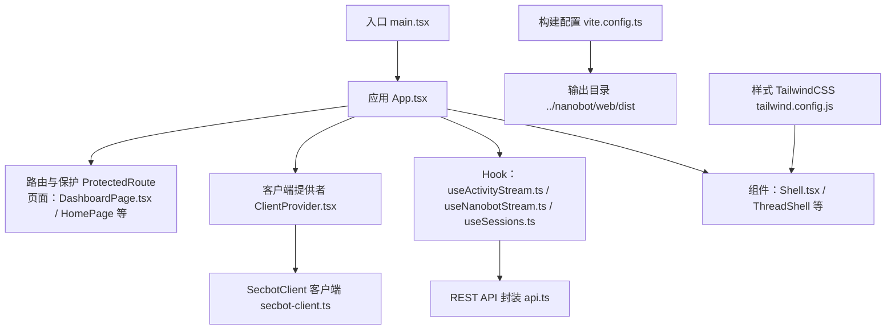
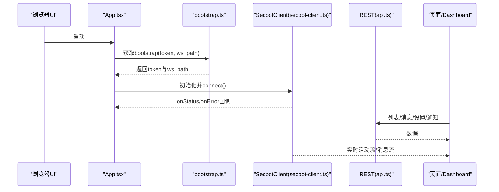
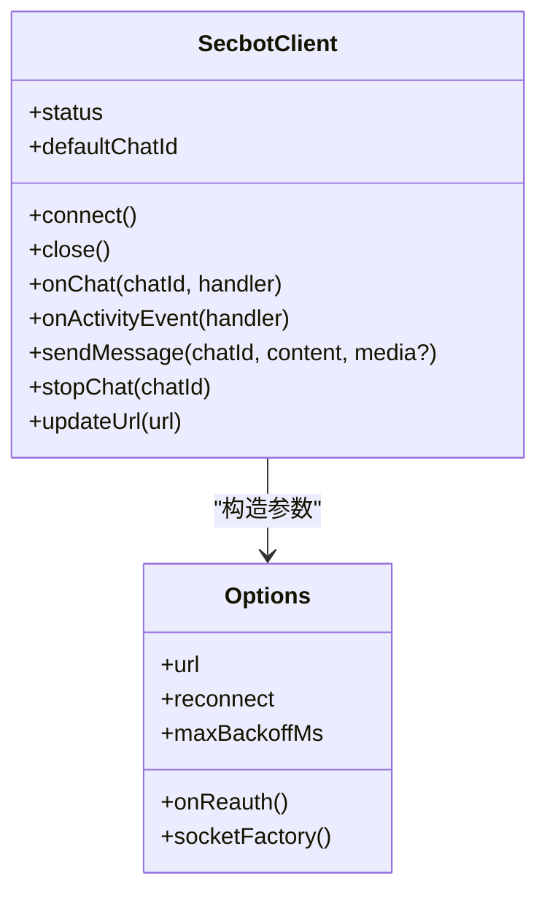
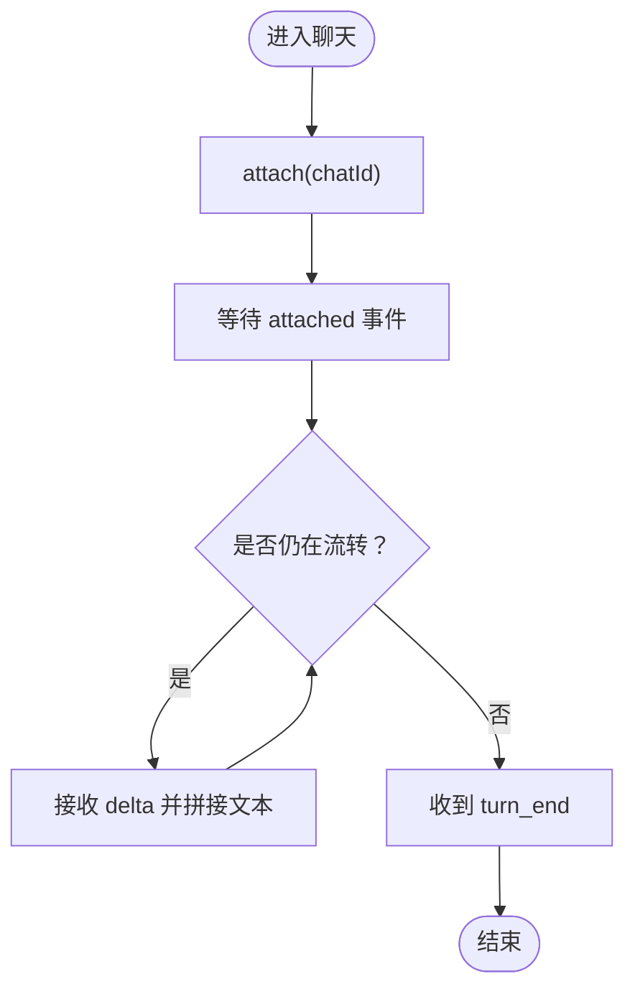
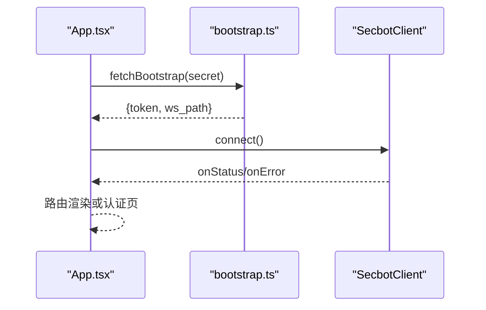
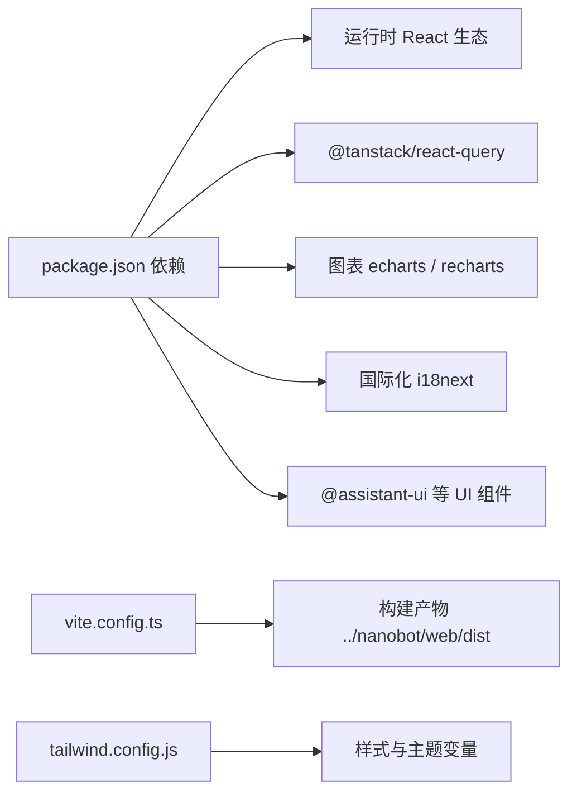

# 前端性能优化

<cite>
**本文引用的文件**
- [package.json](file://webui/package.json)
- [vite.config.ts](file://webui/vite.config.ts)
- [main.tsx](file://webui/src/main.tsx)
- [App.tsx](file://webui/src/App.tsx)
- [bootstrap.ts](file://webui/src/lib/bootstrap.ts)
- [secbot-client.ts](file://webui/src/lib/secbot-client.ts)
- [ClientProvider.tsx](file://webui/src/providers/ClientProvider.tsx)
- [useActivityStream.ts](file://webui/src/hooks/useActivityStream.ts)
- [Shell.tsx](file://webui/src/components/Shell.tsx)
- [useNanobotStream.ts](file://webui/src/hooks/useNanobotStream.ts)
- [api.ts](file://webui/src/lib/api.ts)
- [DashboardPage.tsx](file://webui/src/pages/DashboardPage.tsx)
- [useSessions.ts](file://webui/src/hooks/useSessions.ts)
- [types.ts](file://webui/src/lib/types.ts)
- [tailwind.config.js](file://webui/tailwind.config.js)
</cite>

## 目录
1. [简介](#简介)
2. [项目结构](#项目结构)
3. [核心组件](#核心组件)
4. [架构总览](#架构总览)
5. [详细组件分析](#详细组件分析)
6. [依赖关系分析](#依赖关系分析)
7. [性能考量与优化建议](#性能考量与优化建议)
8. [故障排查指南](#故障排查指南)
9. [结论](#结论)
10. [附录：性能监控与工具使用](#附录性能监控与工具使用)

## 简介
本文件面向VAPT3前端（webui）的性能优化，聚焦于React应用的渲染与状态管理优化、按需加载与懒加载、构建产物分析与优化（代码分割、Tree Shaking、资源压缩）、网络层优化（请求合并与缓存、CDN策略）、WebSocket通信优化（连接池、消息压缩、断线重连）、以及性能监控与用户体验优化（首屏加载、交互响应）。文档在不直接展示源码的前提下，通过“章节来源”定位到具体文件与行号，帮助读者快速定位实现细节。

## 项目结构
webui采用Vite+React18+TypeScript+TailwindCSS的现代前端栈，路由基于react-router-dom，状态与数据流结合React Query（@tanstack/react-query）与自研的SecbotClient进行WebSocket长连接管理。构建配置集中于vite.config.ts，包管理与依赖声明位于package.json，样式由TailwindCSS提供。

图示来源
- [main.tsx:1-16](file://webui/src/main.tsx#L1-L16)
- [App.tsx:1-233](file://webui/src/App.tsx#L1-L233)
- [ClientProvider.tsx:1-58](file://webui/src/providers/ClientProvider.tsx#L1-L58)
- [secbot-client.ts:1-377](file://webui/src/lib/secbot-client.ts#L1-L377)
- [useActivityStream.ts:1-198](file://webui/src/hooks/useActivityStream.ts#L1-L198)
- [useNanobotStream.ts:1-319](file://webui/src/hooks/useNanobotStream.ts#L1-L319)
- [useSessions.ts:1-314](file://webui/src/hooks/useSessions.ts#L1-L314)
- [api.ts:1-272](file://webui/src/lib/api.ts#L1-L272)
- [DashboardPage.tsx:1-519](file://webui/src/pages/DashboardPage.tsx#L1-L519)
- [Shell.tsx:1-374](file://webui/src/components/Shell.tsx#L1-L374)
- [vite.config.ts:1-66](file://webui/vite.config.ts#L1-L66)
- [tailwind.config.js:1-166](file://webui/tailwind.config.js#L1-L166)

章节来源
- [package.json:1-67](file://webui/package.json#L1-L67)
- [vite.config.ts:1-66](file://webui/vite.config.ts#L1-L66)
- [tailwind.config.js:1-166](file://webui/tailwind.config.js#L1-L166)

## 核心组件
- 应用入口与引导：main.tsx负责挂载根节点；App.tsx承担引导流程（获取bootstrap令牌、建立WebSocket、路由与登录态管理），并提供全局加载态与错误兜底。
- 客户端与状态：SecbotClient封装WebSocket连接、自动重连、事件分发与队列；ClientProvider将客户端与未读计数等上下文注入子树；useNanobotStream/useActivityStream/useSessions等Hook分别处理消息流、活动流与会话列表。
- 页面与组件：DashboardPage整合图表与活动流；Shell组织侧边栏、主面板与设置区；各页面通过路由切换实现按需渲染。

章节来源
- [main.tsx:1-16](file://webui/src/main.tsx#L1-L16)
- [App.tsx:1-233](file://webui/src/App.tsx#L1-L233)
- [secbot-client.ts:1-377](file://webui/src/lib/secbot-client.ts#L1-L377)
- [ClientProvider.tsx:1-58](file://webui/src/providers/ClientProvider.tsx#L1-L58)
- [useNanobotStream.ts:1-319](file://webui/src/hooks/useNanobotStream.ts#L1-L319)
- [useActivityStream.ts:1-198](file://webui/src/hooks/useActivityStream.ts#L1-L198)
- [useSessions.ts:1-314](file://webui/src/hooks/useSessions.ts#L1-L314)
- [DashboardPage.tsx:1-519](file://webui/src/pages/DashboardPage.tsx#L1-L519)
- [Shell.tsx:1-374](file://webui/src/components/Shell.tsx#L1-L374)

## 架构总览
下图展示前端与后端的交互路径：App.tsx通过bootstrap获取WebSocket地址与令牌，SecbotClient负责长连接与事件分发；REST接口用于会话列表、消息回放、设置与通知等；页面组件通过Hooks订阅数据与状态变化。

图示来源
- [App.tsx:54-107](file://webui/src/App.tsx#L54-L107)
- [bootstrap.ts:37-76](file://webui/src/lib/bootstrap.ts#L37-L76)
- [secbot-client.ts:155-181](file://webui/src/lib/secbot-client.ts#L155-L181)
- [api.ts:44-166](file://webui/src/lib/api.ts#L44-L166)
- [DashboardPage.tsx:294-516](file://webui/src/pages/DashboardPage.tsx#L294-L516)

## 详细组件分析

### 组件A：WebSocket客户端与重连机制（SecbotClient）
- 连接生命周期：connect/close，状态机包含idle/connecting/open/reconnecting/closed/error。
- 自动重连：指数退避（上限可配置），支持onReauth刷新URL。
- 事件分发：按chat_id分发消息；全局活动事件广播；发送队列保障离线消息可靠投递。
- 错误上报：对特定关闭码（如1009）映射为结构化错误，UI可见化提示。

图示来源
- [secbot-client.ts:59-93](file://webui/src/lib/secbot-client.ts#L59-L93)
- [secbot-client.ts:155-181](file://webui/src/lib/secbot-client.ts#L155-L181)
- [secbot-client.ts:340-357](file://webui/src/lib/secbot-client.ts#L340-L357)

章节来源
- [secbot-client.ts:1-377](file://webui/src/lib/secbot-client.ts#L1-L377)

### 组件B：消息流与活动流（useNanobotStream / useActivityStream）
- useNanobotStream：订阅指定chatId的消息事件，维护流式缓冲与isStreaming状态，处理delta/message/turn_end等事件，支持图片预览与真实上传分离。
- useActivityStream：REST种子数据+WS实时事件合并，去重与排序，限制环形缓冲大小，避免内存膨胀。

图示来源
- [useNanobotStream.ts:119-280](file://webui/src/hooks/useNanobotStream.ts#L119-L280)

章节来源
- [useNanobotStream.ts:1-319](file://webui/src/hooks/useNanobotStream.ts#L1-L319)
- [useActivityStream.ts:1-198](file://webui/src/hooks/useActivityStream.ts#L1-L198)

### 组件C：应用引导与路由（App.tsx）
- 引导流程：加载本地密钥，调用bootstrap获取token与ws_path，初始化SecbotClient并connect；401/403走认证页，其他错误弹窗提示。
- 路由策略：支持模板模式与遗留模式；全局加载态确保路由切换前完成引导；ProtectedRoute包裹受保护路由。
- 性能细节：requestIdleCallback预热Markdown渲染；useMemo稳定上下文值。

图示来源
- [App.tsx:54-107](file://webui/src/App.tsx#L54-L107)
- [bootstrap.ts:37-76](file://webui/src/lib/bootstrap.ts#L37-L76)
- [secbot-client.ts:155-181](file://webui/src/lib/secbot-client.ts#L155-L181)

章节来源
- [App.tsx:1-233](file://webui/src/App.tsx#L1-L233)
- [bootstrap.ts:1-77](file://webui/src/lib/bootstrap.ts#L1-L77)

### 组件D：页面与布局（DashboardPage / Shell）
- DashboardPage：KPI网格、ECharts图表、最近报告表格与实时活动流；使用useMemo生成图表option，减少重算。
- Shell：侧边栏/右rail的展开折叠逻辑，移动端Sheet交互，持久化用户偏好。

章节来源
- [DashboardPage.tsx:1-519](file://webui/src/pages/DashboardPage.tsx#L1-L519)
- [Shell.tsx:1-374](file://webui/src/components/Shell.tsx#L1-L374)

## 依赖关系分析
- 构建与开发：Vite插件链（react、alias别名、dev依赖排除、HMR端口分离、代理规则）。
- 运行时依赖：React生态、路由、国际化、图表库、查询库、UI组件库等。
- 样式：TailwindCSS扩展主题、动画与阴影，统一视觉与交互反馈。

图示来源
- [package.json:14-44](file://webui/package.json#L14-L44)
- [vite.config.ts:10-28](file://webui/vite.config.ts#L10-L28)
- [tailwind.config.js:5-165](file://webui/tailwind.config.js#L5-L165)

章节来源
- [package.json:1-67](file://webui/package.json#L1-L67)
- [vite.config.ts:1-66](file://webui/vite.config.ts#L1-L66)
- [tailwind.config.js:1-166](file://webui/tailwind.config.js#L1-L166)

## 性能考量与优化建议

### React 渲染优化
- 稳定性与记忆化
  - 使用useMemo/useCallback稳定子树与回调，避免无谓重渲染（例如ClientProvider的value计算、Shell的宽度常量、Dashboard图表option）。
  - 在App.tsx中，将handleModelNameChange与handleLogout以useCallback包裹，并通过ref持有最新状态，确保事件处理器依赖稳定。
- 组件拆分与懒加载
  - 将大型页面（如Dashboard）按区域拆分，结合React.lazy与Suspense实现按需加载；对右侧工作台（右rail）在小屏隐藏，减少桌面端冗余渲染。
  - 图表组件（ECharts）可延迟引入，仅在需要时动态import，降低首屏JS体积。
- 列表虚拟化
  - 对活动流与消息列表，采用虚拟滚动（例如react-window或react-virtualized）以控制DOM节点数量，提升滚动性能。

章节来源
- [ClientProvider.tsx:36-42](file://webui/src/providers/ClientProvider.tsx#L36-L42)
- [Shell.tsx:14-18](file://webui/src/components/Shell.tsx#L14-L18)
- [DashboardPage.tsx:67-133](file://webui/src/pages/DashboardPage.tsx#L67-L133)
- [App.tsx:128-144](file://webui/src/App.tsx#L128-L144)

### 状态管理优化
- 单一数据源与最小化更新
  - SecbotClient内部维护chatHandlers/activityHandlers与knownChats，避免跨组件重复订阅；通过context注入，减少多处状态分散。
  - useActivityStream与useNanobotStream各自管理局部状态，避免全局风暴式重渲染。
- 缓存与去重
  - useActivityStream对WS帧与REST种子进行去重与排序，限制环形缓冲长度，防止内存泄漏。
  - useSessions对新建会话采用乐观插入，随后由refresh替换为权威数据，减少闪烁与重复请求。

章节来源
- [secbot-client.ts:63-71](file://webui/src/lib/secbot-client.ts#L63-L71)
- [useActivityStream.ts:106-121](file://webui/src/hooks/useActivityStream.ts#L106-L121)
- [useSessions.ts:173-200](file://webui/src/hooks/useSessions.ts#L173-L200)

### 懒加载与代码分割
- 动态导入
  - 将重型页面或图表组件通过动态import实现按需加载，结合骨架屏与占位符提升感知性能。
- Vite内置分割
  - 保持默认的模块解析与依赖预优化策略；对第三方依赖（如@radix-ui/react-dialog）在开发期排除预打包，避免HMR冲突与chunk路径变更导致的不稳定。

章节来源
- [vite.config.ts:17-23](file://webui/vite.config.ts#L17-L23)

### Bundle 分析与优化
- 分析工具
  - 使用rollup-plugin-visualizer或vite-bundle-analyzer生成依赖图谱，识别超大依赖与重复模块。
- Tree Shaking
  - 优先使用ESM模块，避免打包CommonJS；移除未使用的导出与类型-only依赖。
- 资源压缩
  - 生产构建开启压缩（terser或esbuild），启用gzip/br压缩；静态资源使用现代编码（如AVIF/WebP）与合理尺寸裁剪。
- 第三方库治理
  - 对体积较大的库（如echarts、recharts）按需引入子模块，避免全量打包。

章节来源
- [package.json:14-44](file://webui/package.json#L14-L44)
- [vite.config.ts:24-28](file://webui/vite.config.ts#L24-L28)

### 网络优化策略
- 请求合并与批处理
  - 将多个小请求合并为批量请求（如一次性拉取活动流种子与会话列表），减少RTT。
- 缓存策略
  - REST接口利用HTTP缓存头（ETag/Cache-Control）与本地存储（localStorage）缓存轻量数据；对WebSocket广播事件做去重与限流。
- CDN与静态资源
  - 将公共静态资源（字体、图标、媒体）置于CDN，缩短首字节时间；对可缓存资源设置长期缓存与版本化命名。
- 代理与端口隔离
  - Vite HMR与WebSocket升级在同一根路径时存在冲突，通过分离HMR端口与代理规则避免写入竞争与错误关闭。

章节来源
- [vite.config.ts:37-57](file://webui/vite.config.ts#L37-L57)
- [api.ts:19-36](file://webui/src/lib/api.ts#L19-L36)

### WebSocket 通信优化
- 连接池与复用
  - SecbotClient单例复用同一WebSocket，按chat_id attach，断线自动重连并恢复订阅。
- 断线重连
  - 指数退避（上限可配置），支持onReauth刷新令牌；对特定关闭码（如1009）向UI上报结构化错误。
- 消息压缩与帧聚合
  - 在协议层面避免超大消息（服务端有最大帧限制），前端对图片等二进制采用base64预览与服务端落盘分离，减少传输体积。
- 事件去抖与防抖
  - 对频繁的tool_hint/progress事件，前端合并渲染，避免UI抖动与重排。

章节来源
- [secbot-client.ts:340-357](file://webui/src/lib/secbot-client.ts#L340-L357)
- [secbot-client.ts:314-324](file://webui/src/lib/secbot-client.ts#L314-L324)
- [useNanobotStream.ts:136-153](file://webui/src/hooks/useNanobotStream.ts#L136-L153)

### 用户体验优化
- 首屏加载
  - 使用骨架屏与渐进式渲染，优先保证关键路径（导航、消息容器）可用；对非关键内容（图表、右rail）延迟加载。
- 交互响应
  - 对按钮与输入采用防抖/节流，避免高频操作触发过多请求；对滚动与缩放事件使用requestAnimationFrame。
- 可访问性与反馈
  - 提供明确的加载指示与错误提示；对长任务使用后台优先级（requestIdleCallback）执行预热。

章节来源
- [App.tsx:37-52](file://webui/src/App.tsx#L37-L52)
- [DashboardPage.tsx:304-378](file://webui/src/pages/DashboardPage.tsx#L304-L378)
- [Shell.tsx:302-335](file://webui/src/components/Shell.tsx#L302-L335)

## 故障排查指南
- WebSocket错误
  - 关闭码1009：消息过大，检查图片尺寸与base64长度；UI应显示结构化错误并允许用户调整。
  - 重连失败：确认onReauth返回新URL；检查代理与端口配置（HMR与WS升级冲突）。
- 引导失败
  - 401/403：正常未登录流程，引导至认证页；其他错误弹窗提示并回退到认证页。
- 活动流异常
  - WS与REST合并去重失效：检查事件ID派生规则与时间戳字段；确认环形缓冲上限生效。
- 图表渲染卡顿
  - 减少series数量与点数；启用SVG渲染；对大数据集采用采样或分页。

章节来源
- [secbot-client.ts:314-338](file://webui/src/lib/secbot-client.ts#L314-L338)
- [App.tsx:84-97](file://webui/src/App.tsx#L84-L97)
- [useActivityStream.ts:106-121](file://webui/src/hooks/useActivityStream.ts#L106-L121)
- [DashboardPage.tsx:374-378](file://webui/src/pages/DashboardPage.tsx#L374-L378)

## 结论
通过对SecbotClient的连接与重连策略、消息与活动流的去重与限流、页面与组件的懒加载与虚拟化、构建与网络的优化实践，VAPT3前端可在复杂场景下保持流畅的用户体验。建议持续使用性能监控工具进行回归测试，并根据实际流量特征迭代优化策略。

## 附录：性能监控与工具使用
- Lighthouse
  - 分析首屏加载（FCP/LCP）、交互能力（FID/INP）、视觉稳定性（CLS）与可访问性；定期在CI中集成自动化报告。
- Chrome DevTools
  - Performance面板记录渲染与脚本执行；Memory面板检测内存泄漏；Network面板观察资源与缓存命中；Coverage统计未使用代码。
- React DevTools
  - 分析组件渲染次数与原因，定位过度渲染的根因；结合Profiler测量渲染耗时。
- Vite/构建分析
  - 使用bundle可视化工具识别大依赖与重复模块；对比不同构建配置的产物体积与加载时间。

[本节为通用指导，无需特定文件引用]