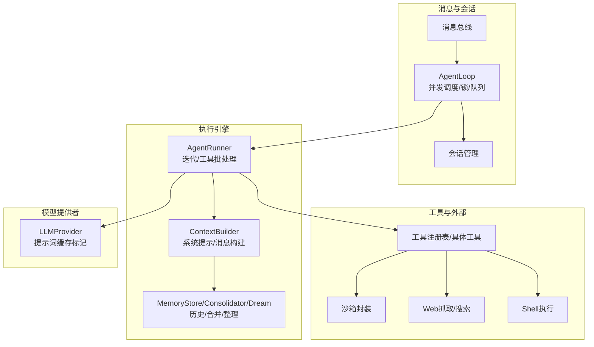
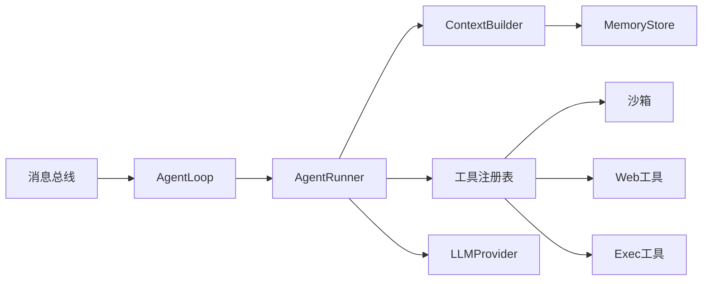

# 后端性能优化

<cite>
**本文引用的文件**
- [secbot/agent/loop.py](file://secbot/agent/loop.py)
- [secbot/agent/runner.py](file://secbot/agent/runner.py)
- [secbot/agent/tools/sandbox.py](file://secbot/agent/tools/sandbox.py)
- [secbot/utils/runtime.py](file://secbot/utils/runtime.py)
- [secbot/utils/helpers.py](file://secbot/utils/helpers.py)
- [secbot/agent/memory.py](file://secbot/agent/memory.py)
- [secbot/agent/context.py](file://secbot/agent/context.py)
- [secbot/providers/anthropic_provider.py](file://secbot/providers/anthropic_provider.py)
- [secbot/providers/openai_compat_provider.py](file://secbot/providers/openai_compat_provider.py)
- [tests/agent/test_runner.py](file://tests/agent/test_runner.py)
- [tests/utils/test_workspace_violation_throttle.py](file://tests/utils/test_workspace_violation_throttle.py)
</cite>

## 目录
1. [简介](#简介)
2. [项目结构](#项目结构)
3. [核心组件](#核心组件)
4. [架构总览](#架构总览)
5. [详细组件分析](#详细组件分析)
6. [依赖分析](#依赖分析)
7. [性能考量与优化建议](#性能考量与优化建议)
8. [故障排查指南](#故障排查指南)
9. [结论](#结论)
10. [附录：性能监控与基准测试](#附录性能监控与基准测试)

## 简介
本文件面向VAPT3后端的性能优化目标，系统性梳理Python性能分析技术（cProfile使用、内存分析、I/O优化）、并发优化（异步编程模式、线程池管理、锁竞争规避）、工具执行优化（沙箱机制、外部工具调用、重复请求节流）、AgentLoop瓶颈识别与优化、缓存策略（内存缓存、结果缓存、查询缓存），以及性能监控指标与基准测试方法。内容基于仓库现有代码实现进行提炼，并给出可操作的优化建议。

## 项目结构
VAPT3后端围绕“消息总线-会话-上下文-运行器-工具-提供者”的主干链路组织，关键性能点分布在以下模块：
- AgentLoop：消息分发、会话并发控制、工具执行调度、后台任务管理
- AgentRunner：迭代循环、工具批处理、上下文治理、重试与恢复
- 工具层：文件系统、Web抓取/搜索、Shell执行、MCP等
- 上下文与记忆：历史记录、令牌预算、轻量合并、梦境式深度整理
- 提供者：LLM调用、提示词缓存标记注入
- 运行时辅助：重复外部请求节流、工具结果持久化、令牌估算



图示来源
- [secbot/agent/loop.py](file://secbot/agent/loop.py)
- [secbot/agent/runner.py](file://secbot/agent/runner.py)
- [secbot/agent/context.py](file://secbot/agent/context.py)
- [secbot/agent/memory.py](file://secbot/agent/memory.py)
- [secbot/providers/anthropic_provider.py](file://secbot/providers/anthropic_provider.py)

章节来源
- [secbot/agent/loop.py](file://secbot/agent/loop.py)
- [secbot/agent/runner.py](file://secbot/agent/runner.py)
- [secbot/agent/context.py](file://secbot/agent/context.py)
- [secbot/agent/memory.py](file://secbot/agent/memory.py)

## 核心组件
- AgentLoop：负责消息接收、会话级并发锁、工具执行并发门限、后台任务跟踪与清理、MCP连接与关闭、消息注入队列等。关键性能点在于会话锁粒度、并发门限、队列容量与后台任务清理。
- AgentRunner：负责单次执行的迭代循环、工具批处理与并发执行、上下文治理（截断/压缩/回填）、错误恢复与重试、最终响应生成与检查点。
- 工具层：文件系统、Web、Shell、MCP等工具，支持只读并发、独占执行、参数校验与类型转换、结果持久化与预览。
- 上下文与记忆：系统提示构建、最近历史注入、历史写入与压缩、轻量合并（Consolidator）与深度整理（Dream），涉及I/O与令牌估算。
- 提供者：LLM调用封装，支持流式/进度增量、超时控制、提示词缓存标记注入（Anthropic/OpenAI兼容）。

章节来源
- [secbot/agent/loop.py](file://secbot/agent/loop.py)
- [secbot/agent/runner.py](file://secbot/agent/runner.py)
- [secbot/agent/context.py](file://secbot/agent/context.py)
- [secbot/agent/memory.py](file://secbot/agent/memory.py)
- [secbot/providers/anthropic_provider.py](file://secbot/providers/anthropic_provider.py)
- [secbot/providers/openai_compat_provider.py](file://secbot/providers/openai_compat_provider.py)

## 架构总览
AgentLoop作为核心调度器，通过会话键隔离不同对话的执行状态；在每次迭代中，Runner构建消息并调用Provider；工具执行采用批处理与并发策略，结合只读工具的并行与独占工具的串行；上下文与记忆模块负责历史与令牌预算的治理，防止LLM请求越界或过长。

```mermaid
sequenceDiagram
participant Bus as "消息总线"
participant Loop as "AgentLoop"
participant Runner as "AgentRunner"
participant Ctx as "ContextBuilder"
participant Mem as "MemoryStore/Consolidator"
participant Tools as "工具注册表"
participant Prov as "LLMProvider"
Bus->>Loop : 入站消息(InboundMessage)
Loop->>Loop : 获取/创建会话锁/并发门限
Loop->>Runner : run(AgentRunSpec)
Runner->>Ctx : 构建系统提示/消息
Runner->>Mem : 估计/治理历史令牌预算
Runner->>Prov : 请求模型(带超时/流式)
Prov-->>Runner : 响应(含工具调用/文本)
Runner->>Tools : 并发/批处理执行工具
Tools-->>Runner : 工具结果/事件
Runner-->>Loop : 最终内容/工具使用/用量
Loop-->>Bus : 出站消息/活动事件广播
```

图示来源
- [secbot/agent/loop.py](file://secbot/agent/loop.py)
- [secbot/agent/runner.py](file://secbot/agent/runner.py)
- [secbot/agent/context.py](file://secbot/agent/context.py)
- [secbot/agent/memory.py](file://secbot/agent/memory.py)

## 详细组件分析

### AgentLoop 性能瓶颈与优化
- 会话并发与锁竞争
  - 每个会话维护独立锁，确保同一会话内串行执行，避免竞态；但跨会话并发由全局并发门限控制。建议：根据实例资源设置环境变量限制并发数，避免过多并发导致CPU争抢与上下文切换开销。
  - 待注入消息队列用于同会话内消息合并与有序注入，避免频繁创建任务。
- 后台任务与清理
  - 跟踪后台任务并在关闭时汇聚等待，减少资源泄漏。
- MCP连接与清理
  - 延迟连接与失败重试，退出时清理栈与连接，降低异常对后续的影响。

优化要点
- 使用环境变量控制最大并发请求数，避免无界并发。
- 对热点会话的锁粒度进行评估，必要时拆分更细的子任务。
- 合理设置待注入队列容量，避免阻塞与内存膨胀。

章节来源
- [secbot/agent/loop.py](file://secbot/agent/loop.py)

### AgentRunner 迭代与工具执行
- 迭代治理
  - 在每轮迭代前对历史消息进行回填缺失结果、微压缩、裁剪，保证LLM输入在令牌预算内。
  - 支持空响应重试、长度截断恢复、错误注入恢复等稳健性策略。
- 工具批处理与并发
  - 将工具调用按批处理，支持并发执行；只读工具可并行，独占工具串行。
  - 测试覆盖了并发只读工具与独占工具的顺序约束，验证并发正确性。

优化要点
- 严格控制每轮注入上限，避免一次性注入过多消息导致上下文膨胀。
- 对工具批处理的并发度与独占策略进行灰度调整，观察吞吐与延迟变化。
- 针对工具执行的错误分类，区分可恢复与致命错误，减少不必要的重试。

章节来源
- [secbot/agent/runner.py](file://secbot/agent/runner.py)
- [tests/agent/test_runner.py](file://tests/agent/test_runner.py)

### 工具执行与外部调用优化
- 重复外部请求节流
  - 对web_fetch/web_search等外部调用建立稳定签名，超过阈值后阻断并提示使用已有结果。
- 工作区边界违规节流
  - 对跨工作区访问尝试进行签名归一化与计数，超过阈值后升级为拒绝。
- 沙箱机制
  - Shell命令在bubblewrap沙箱中执行，限定挂载路径与只读媒体目录，提升安全性与稳定性。

优化要点
- 外部调用签名尽量包含关键参数，避免误判；阈值可根据业务场景动态调整。
- 沙箱参数最小化，仅暴露必要路径，减少启动与绑定开销。
- 对外部调用增加超时与重试策略，避免阻塞影响整体吞吐。

章节来源
- [secbot/utils/runtime.py](file://secbot/utils/runtime.py)
- [secbot/agent/tools/sandbox.py](file://secbot/agent/tools/sandbox.py)
- [tests/utils/test_workspace_violation_throttle.py](file://tests/utils/test_workspace_violation_throttle.py)

### 上下文与记忆 I/O 优化
- 历史写入与压缩
  - 历史以JSONL追加写入，原子替换并同步目录元数据，保证持久化可靠性。
  - 写入前进行模板泄漏清洗，避免污染上下文。
- 令牌预算与截断
  - 通过tiktoken估算消息令牌，按预算截断或压缩，防止越界。
- 轻量合并与深度整理
  - Consolidator按比例触发合并，避免历史无限增长；Dream在定时任务中进行深度整理，减少大文件对LLM输入的影响。

优化要点
- 控制历史条目上限与单条历史大小，避免单次写入过大。
- 合理设置令牌安全缓冲，平衡上下文长度与可用预算。
- 合并频率与比例需结合业务负载调优，避免频繁合并带来的额外开销。

章节来源
- [secbot/agent/memory.py](file://secbot/agent/memory.py)
- [secbot/utils/helpers.py](file://secbot/utils/helpers.py)

### 提示词缓存与性能
- 提示词缓存标记
  - Anthropic与OpenAI兼容提供者在系统提示、消息与工具定义上注入“临时缓存”标记，减少重复计算成本。
- 令牌估算
  - 提供者侧优先使用自身计数器，回退到tiktoken估算，提高估算准确性与性能。

优化要点
- 在系统提示与工具定义稳定不变时启用缓存标记，显著降低重复请求成本。
- 结合业务场景选择合适的估算策略，减少估算误差导致的上下文截断。

章节来源
- [secbot/providers/anthropic_provider.py](file://secbot/providers/anthropic_provider.py)
- [secbot/providers/openai_compat_provider.py](file://secbot/providers/openai_compat_provider.py)
- [secbot/utils/helpers.py](file://secbot/utils/helpers.py)

## 依赖分析
- 组件耦合
  - AgentLoop依赖AgentRunner、工具注册表、会话管理、消息总线；Runner依赖Provider、上下文构建、记忆存储。
  - 工具层与沙箱、Web、Exec等外部能力解耦，便于替换与扩展。
- 关键依赖链
  - 消息总线 -> AgentLoop -> AgentRunner -> Provider
  - AgentRunner -> ContextBuilder -> MemoryStore
  - 工具执行 -> 沙箱/外部调用 -> 结果持久化



图示来源
- [secbot/agent/loop.py](file://secbot/agent/loop.py)
- [secbot/agent/runner.py](file://secbot/agent/runner.py)
- [secbot/agent/context.py](file://secbot/agent/context.py)
- [secbot/agent/memory.py](file://secbot/agent/memory.py)

## 性能考量与优化建议

### Python性能分析技术
- cProfile使用
  - 建议在AgentLoop入口与Runner关键路径（如工具批处理、上下文估算）插入性能探针，采集函数调用次数、总耗时与自耗时，定位热点。
  - 对外部调用（Web/Exec）单独打点，统计平均耗时与失败率。
- 内存分析
  - 使用内存分析工具关注历史文件写入、工具结果持久化、上下文拼接过程中的对象生命周期，避免长生命周期缓存导致内存膨胀。
- I/O优化策略
  - 历史写入采用原子替换与目录fsync，确保可靠性；建议批量写入与合理缓冲，减少系统调用次数。
  - 对工具输出过大时的持久化采用预览与引用，避免将大文本直接拼接到上下文中。

章节来源
- [secbot/agent/memory.py](file://secbot/agent/memory.py)
- [secbot/utils/helpers.py](file://secbot/utils/helpers.py)

### 并发优化
- 异步编程模式
  - AgentLoop与Runner已基于asyncio；建议在工具执行与Provider调用处保持异步，避免阻塞事件循环。
- 线程池管理
  - 当需要执行CPU密集型任务时，谨慎引入线程池；优先使用异步IO与进程池替代。
- 锁竞争避免
  - 会话级锁粒度合理；建议对只读工具尽量并行，独占工具串行；对热点会话考虑拆分子任务或引入更细粒度的锁。

章节来源
- [secbot/agent/loop.py](file://secbot/agent/loop.py)
- [secbot/agent/runner.py](file://secbot/agent/runner.py)

### 工具执行性能优化
- 沙箱机制优化
  - 沙箱参数最小化，仅挂载必要路径；对常用命令进行预热，减少首次启动开销。
- 外部工具调用优化
  - 设置合理的超时与重试；对外部调用结果进行缓存（针对稳定接口）。
- 重复请求节流机制
  - 外部调用与工作区边界违规均采用签名+计数的节流策略，建议结合业务阈值动态调整。

章节来源
- [secbot/agent/tools/sandbox.py](file://secbot/agent/tools/sandbox.py)
- [secbot/utils/runtime.py](file://secbot/utils/runtime.py)

### AgentLoop 瓶颈识别与优化
- 瓶颈识别
  - 通过日志与探针定位：Provider调用超时、工具执行阻塞、历史写入慢、上下文估算耗时。
- 优化手段
  - 调整并发门限与会话锁策略；优化历史写入与令牌估算；对长轮询与注入队列设置合理上限。

章节来源
- [secbot/agent/loop.py](file://secbot/agent/loop.py)

### 缓存策略实现
- 内存缓存
  - 工具层的文件状态跟踪与工具结果预览引用，减少重复读取与上下文拼接。
- 结果缓存
  - 工具输出过大时持久化为文件并返回引用，避免上下文膨胀。
- 查询缓存
  - 外部Web搜索/抓取结果通过签名去重，超过阈值阻断重复请求。

章节来源
- [secbot/utils/helpers.py](file://secbot/utils/helpers.py)
- [secbot/utils/runtime.py](file://secbot/utils/runtime.py)

## 故障排查指南
- LLM调用超时
  - Runner内置超时控制与错误响应；可通过环境变量调整超时阈值。
- 工具执行错误
  - 区分可恢复与致命错误；对可恢复错误进行有限重试，避免无限循环。
- 工作区边界违规
  - 通过签名归一化与计数，超过阈值后升级为拒绝；建议在日志中记录违规目标以便审计。
- 历史写入异常
  - 历史写入采用原子替换与目录fsync；若出现异常，检查磁盘空间与权限。

章节来源
- [secbot/agent/runner.py](file://secbot/agent/runner.py)
- [secbot/utils/runtime.py](file://secbot/utils/runtime.py)
- [secbot/agent/memory.py](file://secbot/agent/memory.py)

## 结论
通过对AgentLoop、AgentRunner、工具层、上下文与记忆模块的系统性分析，VAPT3后端在并发、外部调用、上下文治理与I/O方面已具备较为完善的性能基础。建议在生产环境中结合cProfile与内存分析工具进行持续观测，配合合理的并发门限、外部调用节流与缓存策略，进一步提升吞吐与稳定性。

## 附录：性能监控与基准测试

### 性能监控指标
- LLM用量
  - 输入/输出令牌数、缓存命中比例、完成令牌数。
- 会话与任务
  - 活跃会话数、任务队列长度、后台任务数量。
- 工具执行
  - 工具调用次数、平均耗时、错误率、重复外部请求阻断次数。
- 上下文与I/O
  - 历史写入速率、历史条目数、令牌估算准确率、磁盘fsync频率。

章节来源
- [secbot/agent/loop.py](file://secbot/agent/loop.py)
- [secbot/agent/runner.py](file://secbot/agent/runner.py)
- [secbot/utils/helpers.py](file://secbot/utils/helpers.py)

### 基准测试方法
- 单工具基准
  - 固定输入，测量工具执行时间与内存占用，对比不同实现（如只读工具并行 vs 独占串行）。
- 多工具并发基准
  - 构造混合工具调用序列，测量吞吐与尾延迟，评估并发门限与批处理效果。
- 外部调用节流基准
  - 重复请求场景下测量阻断生效比例与平均响应时间，评估阈值合理性。
- 上下文治理基准
  - 不同历史长度与令牌预算下，测量上下文估算与截断耗时，评估合并策略对延迟的影响。

章节来源
- [tests/agent/test_runner.py](file://tests/agent/test_runner.py)
- [tests/utils/test_workspace_violation_throttle.py](file://tests/utils/test_workspace_violation_throttle.py)