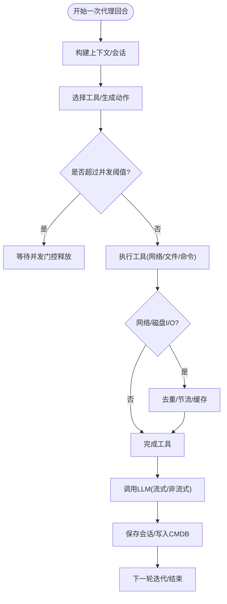
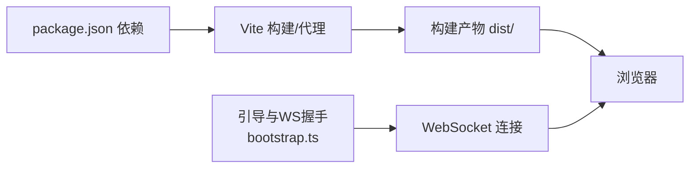
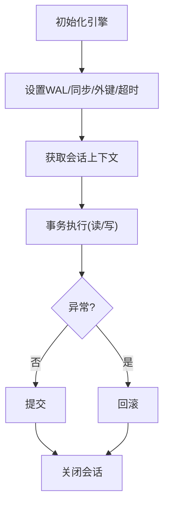
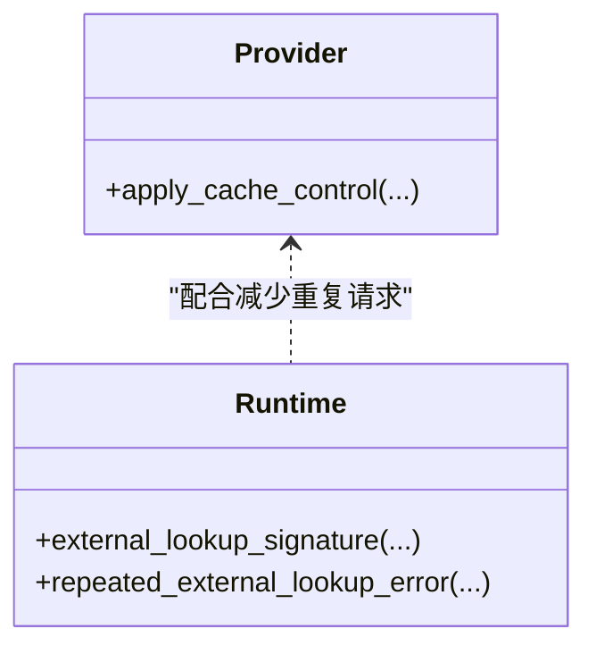
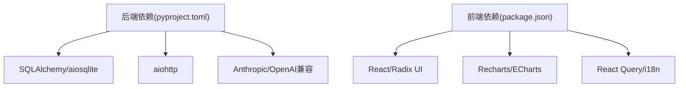

# 性能分析与优化

<cite>
**本文引用的文件**
- [secbot/__main__.py](file://secbot/__main__.py)
- [secbot/secbot.py](file://secbot/secbot.py)
- [secbot/agent/loop.py](file://secbot/agent/loop.py)
- [secbot/bus/queue.py](file://secbot/bus/queue.py)
- [secbot/api/server.py](file://secbot/api/server.py)
- [secbot/cmdb/db.py](file://secbot/cmdb/db.py)
- [secbot/utils/runtime.py](file://secbot/utils/runtime.py)
- [secbot/providers/anthropic_provider.py](file://secbot/providers/anthropic_provider.py)
- [secbot/providers/openai_compat_provider.py](file://secbot/providers/openai_compat_provider.py)
- [webui/package.json](file://webui/package.json)
- [webui/vite.config.ts](file://webui/vite.config.ts)
- [webui/src/lib/bootstrap.ts](file://webui/src/lib/bootstrap.ts)
- [.trellis/spec/backend/database-guidelines.md](file://.trellis/spec/backend/database-guidelines.md)
- [.trellis/spec/frontend/visualization-libraries.md](file://.trellis/spec/frontend/visualization-libelines.md)
- [.trellis/tasks/05-07-ocean-tech-frontend/prd.md](file://.trellis/tasks/05-07-ocean-tech-frontend/prd.md)
- [.trellis/tasks/05-08-ocean-tech-frontend-gap-fix/prd.md](file://.trellis/tasks/05-08-ocean-tech-frontend-gap-fix/prd.md)
- [pyproject.toml](file://pyproject.toml)
</cite>

## 目录
1. [简介](#简介)
2. [项目结构](#项目结构)
3. [核心组件](#核心组件)
4. [架构总览](#架构总览)
5. [详细组件分析](#详细组件分析)
6. [依赖分析](#依赖分析)
7. [性能考虑](#性能考虑)
8. [故障排查指南](#故障排查指南)
9. [结论](#结论)
10. [附录](#附录)

## 简介
本文件面向VAPT3/secbot项目，提供系统化的性能分析与优化指南，覆盖后端Python性能分析（CPU/内存/I/O/并发）、前端React性能优化（包体积/构建/渲染/网络）、数据库查询优化（索引/查询/连接池）、系统级监控与调优、缓存策略设计与实现、性能基准与回归测试方法，以及生产环境监控与告警配置建议。内容基于仓库中实际代码与规范文件进行提炼，并辅以可视化图示帮助理解。

## 项目结构
- 后端核心位于 secbot 包，包含代理循环、消息总线、API服务器、CMDB数据库、工具与技能等模块。
- 前端位于 webui 目录，采用Vite+React+TypeScript，通过代理与后端网关对接。
- 顶层配置与脚本由 pyproject.toml 与入口脚本管理。

```mermaid
graph TB
subgraph "后端(secbot)"
A["入口脚本<br/>__main__.py"]
B["主接口 Facade<br/>secbot.py"]
C["代理循环<br/>agent/loop.py"]
D["消息总线<br/>bus/queue.py"]
E["HTTP API服务器<br/>api/server.py"]
F["CMDB数据库<br/>cmdb/db.py"]
end
subgraph "前端(webui)"
G["Vite配置<br/>vite.config.ts"]
H["依赖清单<br/>package.json"]
I["引导与WebSocket<br/>src/lib/bootstrap.ts"]
end
A --> B --> C
C <- --> D
C --> E
E --> C
C --> F
G --> I
H --> G
```

图表来源
- [secbot/__main__.py:1-9](file://secbot/__main__.py#L1-L9)
- [secbot/secbot.py:1-132](file://secbot/secbot.py#L1-L132)
- [secbot/agent/loop.py:1-800](file://secbot/agent/loop.py#L1-L800)
- [secbot/bus/queue.py:1-45](file://secbot/bus/queue.py#L1-L45)
- [secbot/api/server.py:1-401](file://secbot/api/server.py#L1-L401)
- [secbot/cmdb/db.py:1-133](file://secbot/cmdb/db.py#L1-L133)
- [webui/vite.config.ts:1-66](file://webui/vite.config.ts#L1-L66)
- [webui/package.json:1-67](file://webui/package.json#L1-L67)
- [webui/src/lib/bootstrap.ts:1-77](file://webui/src/lib/bootstrap.ts#L1-L77)

章节来源
- [secbot/__main__.py:1-9](file://secbot/__main__.py#L1-L9)
- [secbot/secbot.py:1-132](file://secbot/secbot.py#L1-L132)
- [webui/package.json:1-67](file://webui/package.json#L1-L67)

## 核心组件
- 代理循环与钩子：负责消息处理、上下文构建、工具调用、流式输出与活动事件广播，具备并发控制与会话隔离能力。
- 消息总线：异步队列解耦通道与核心，支持入站/出站消息与尺寸统计。
- HTTP API服务器：兼容OpenAI格式，支持SSE流式响应与多格式请求解析。
- CMDB数据库：基于SQLAlchemy异步引擎，启用WAL与连接预热，提供会话管理与事务封装。
- 前端引导与代理：本地开发代理、WebSocket握手、构建产物目录与源码映射策略。

章节来源
- [secbot/agent/loop.py:1-800](file://secbot/agent/loop.py#L1-L800)
- [secbot/bus/queue.py:1-45](file://secbot/bus/queue.py#L1-L45)
- [secbot/api/server.py:1-401](file://secbot/api/server.py#L1-L401)
- [secbot/cmdb/db.py:1-133](file://secbot/cmdb/db.py#L1-L133)
- [webui/vite.config.ts:1-66](file://webui/vite.config.ts#L1-L66)
- [webui/src/lib/bootstrap.ts:1-77](file://webui/src/lib/bootstrap.ts#L1-L77)

## 架构总览
后端通过消息总线解耦不同渠道输入，代理循环统一调度LLM推理与工具执行；HTTP API作为外部接入面，前端通过Vite代理访问后端服务并建立WebSocket长连。

```mermaid
sequenceDiagram
participant Client as "客户端"
participant API as "HTTP API服务器"
participant Bus as "消息总线"
participant Loop as "代理循环"
participant Provider as "LLM提供方"
participant DB as "CMDB"
Client->>API : "POST /v1/chat/completions"
API->>API : "解析请求/校验/限流"
API->>Loop : "process_direct(...)"
Loop->>Bus : "入站消息入队"
Loop->>Loop : "构建上下文/选择工具"
Loop->>Provider : "调用模型(可流式)"
Provider-->>Loop : "返回增量/最终结果"
Loop->>DB : "读写会话/报告数据"
Loop-->>API : "结果/流片段"
API-->>Client : "SSE/JSON响应"
```

图表来源
- [secbot/api/server.py:194-351](file://secbot/api/server.py#L194-L351)
- [secbot/agent/loop.py:644-787](file://secbot/agent/loop.py#L644-L787)
- [secbot/bus/queue.py:20-34](file://secbot/bus/queue.py#L20-L34)
- [secbot/cmdb/db.py:103-123](file://secbot/cmdb/db.py#L103-L123)

## 详细组件分析

### 后端性能分析与优化（Python）
- CPU与I/O热点定位
  - 使用 cProfile/Py-Spy/FlameGraph 定位代理循环中的工具调用、LLM调用与文件I/O路径。
  - 关注点：工具执行计时、消息队列等待、网络请求重试与超时。
- 内存与GC
  - 监控会话历史长度、消息拼接与工具结果累积；避免大对象重复构造。
  - 优化建议：复用字符串缓冲、延迟加载文档、及时释放临时对象。
- 并发与限流
  - 代理循环内置并发门控（环境变量限制并发任务数），避免资源争用。
  - API层对每个会话加锁，防止竞态；同时支持SSE流式输出。
- 缓存与提示词复用
  - LLM提供方支持提示词缓存标记，减少重复token消耗。
- I/O优化
  - 文件系统工具受工作区限制，避免越界扫描；对外部请求进行去重与节流。



图表来源
- [secbot/agent/loop.py:392-396](file://secbot/agent/loop.py#L392-L396)
- [secbot/api/server.py:236-304](file://secbot/api/server.py#L236-L304)
- [secbot/utils/runtime.py:68-102](file://secbot/utils/runtime.py#L68-L102)
- [secbot/providers/anthropic_provider.py:378-410](file://secbot/providers/anthropic_provider.py#L378-L410)
- [secbot/providers/openai_compat_provider.py:332-364](file://secbot/providers/openai_compat_provider.py#L332-L364)

章节来源
- [secbot/agent/loop.py:392-396](file://secbot/agent/loop.py#L392-L396)
- [secbot/api/server.py:236-304](file://secbot/api/server.py#L236-L304)
- [secbot/utils/runtime.py:68-102](file://secbot/utils/runtime.py#L68-L102)
- [secbot/providers/anthropic_provider.py:378-410](file://secbot/providers/anthropic_provider.py#L378-L410)
- [secbot/providers/openai_compat_provider.py:332-364](file://secbot/providers/openai_compat_provider.py#L332-L364)

### 前端性能优化（React/Vite）
- 包体积与Tree-shaking
  - 严格白名单依赖，禁止通配导入；对动画库与图表库进行按需引入，避免打包冗余。
- 构建与开发体验
  - Vite代理区分静态SPA与WebSocket升级，避免HMR与WS握手冲突；关闭生产源码映射以减小包体。
- 渲染与交互
  - 使用React Query进行数据获取与缓存；减少不必要的重渲染，合理拆分组件。
- 网络与WebSocket
  - 本地引导流程从网关获取短期令牌与WS路径，自动根据协议选择ws/wss；确保移动端与无障碍场景下的降级策略。



图表来源
- [webui/package.json:14-44](file://webui/package.json#L14-L44)
- [webui/vite.config.ts:17-58](file://webui/vite.config.ts#L17-L58)
- [webui/src/lib/bootstrap.ts:37-77](file://webui/src/lib/bootstrap.ts#L37-L77)
- [.trellis/spec/frontend/visualization-libraries.md:33-58](file://.trellis/spec/frontend/visualization-libraries.md#L33-L58)
- [.trellis/tasks/05-07-ocean-tech-frontend/prd.md:89-96](file://.trellis/tasks/05-07-ocean-tech-frontend/prd.md#L89-L96)

章节来源
- [webui/package.json:14-44](file://webui/package.json#L14-L44)
- [webui/vite.config.ts:17-58](file://webui/vite.config.ts#L17-L58)
- [webui/src/lib/bootstrap.ts:37-77](file://webui/src/lib/bootstrap.ts#L37-L77)
- [.trellis/spec/frontend/visualization-libraries.md:33-58](file://.trellis/spec/frontend/visualization-libraries.md#L33-L58)
- [.trellis/tasks/05-07-ocean-tech-frontend/prd.md:89-96](file://.trellis/tasks/05-07-ocean-tech-frontend/prd.md#L89-L96)

### 数据库查询优化（CMDB）
- 引擎与连接池
  - 使用异步SQLAlchemy引擎，默认启用WAL模式、连接预热与超时设置，提升并发读写稳定性。
- 查询与事务
  - 提供会话上下文管理器，自动提交/回滚；建议在高频写入场景使用批量插入与事务包裹。
- 索引与命名规范
  - 规范文件中预留索引与命名约定区域，建议结合查询模式补充必要索引并统一命名风格。



图表来源
- [secbot/cmdb/db.py:64-93](file://secbot/cmdb/db.py#L64-L93)
- [secbot/cmdb/db.py:103-123](file://secbot/cmdb/db.py#L103-L123)
- [.trellis/spec/backend/database-guidelines.md:19-51](file://.trellis/spec/backend/database-guidelines.md#L19-L51)

章节来源
- [secbot/cmdb/db.py:64-93](file://secbot/cmdb/db.py#L64-L93)
- [secbot/cmdb/db.py:103-123](file://secbot/cmdb/db.py#L103-L123)
- [.trellis/spec/backend/database-guidelines.md:19-51](file://.trellis/spec/backend/database-guidelines.md#L19-L51)

### 缓存策略设计与实现
- 提示词缓存
  - LLM提供方在系统消息与工具定义上注入“短暂缓存”标记，降低重复token消耗。
- 外部请求去重
  - 对相同URL/查询进行签名与计数，超过阈值则阻断重复请求，避免浪费带宽与算力。
- 会话与历史压缩
  - 代理循环内置合并与压缩逻辑，结合上下文窗口预算，动态裁剪历史以维持稳定吞吐。



图表来源
- [secbot/providers/anthropic_provider.py:378-410](file://secbot/providers/anthropic_provider.py#L378-L410)
- [secbot/providers/openai_compat_provider.py:332-364](file://secbot/providers/openai_compat_provider.py#L332-L364)
- [secbot/utils/runtime.py:68-102](file://secbot/utils/runtime.py#L68-L102)

章节来源
- [secbot/providers/anthropic_provider.py:378-410](file://secbot/providers/anthropic_provider.py#L378-L410)
- [secbot/providers/openai_compat_provider.py:332-364](file://secbot/providers/openai_compat_provider.py#L332-L364)
- [secbot/utils/runtime.py:68-102](file://secbot/utils/runtime.py#L68-L102)

### 系统级性能监控与调优
- 日志与指标
  - 使用loguru记录关键阶段耗时与用量；建议集成指标导出（如Prometheus）与APM（如OpenTelemetry）。
- 资源限制
  - 通过环境变量控制并发门控与请求超时；API层对会话加锁避免竞争。
- 诊断工具
  - 后端可结合cProfile/Py-Spy抓取火焰图；前端可用Lighthouse与Bundle Analyzer评估性能基线。

章节来源
- [secbot/agent/loop.py:392-396](file://secbot/agent/loop.py#L392-L396)
- [secbot/api/server.py:236-304](file://secbot/api/server.py#L236-L304)
- [.trellis/tasks/05-08-ocean-tech-frontend-gap-fix/prd.md:122-123](file://.trellis/tasks/05-08-ocean-tech-frontend-gap-fix/prd.md#L122-L123)

## 依赖分析
- 后端依赖
  - 异步HTTP：aiohttp
  - 数据库：SQLAlchemy[asyncio] + aiosqlite + alembic
  - LLM提供方：Anthropic/OpenAI兼容等
  - 工具与网络：httpx/websockets/requests生态
- 前端依赖
  - React 18、Radix UI、Recharts/ECharts、React Query、i18n等



图表来源
- [pyproject.toml:25-67](file://pyproject.toml#L25-L67)
- [webui/package.json:14-44](file://webui/package.json#L14-L44)

章节来源
- [pyproject.toml:25-67](file://pyproject.toml#L25-L67)
- [webui/package.json:14-44](file://webui/package.json#L14-L44)

## 性能考虑
- 后端
  - 控制并发与会话粒度，避免全局锁争用；对工具调用进行去重与节流。
  - 利用提示词缓存与上下文压缩，降低token与延迟。
- 前端
  - 严格依赖白名单与按需导入，避免动画与图表库全量打包；生产关闭源码映射。
- 数据库
  - 启用WAL与连接预热；对高频查询补充索引；使用批量写入与事务包裹。
- 监控
  - 建立端到端链路追踪与关键指标面板；设定告警阈值与回归基线。

## 故障排查指南
- 代理循环卡顿
  - 检查并发门控与会话锁状态；确认工具执行时间与网络I/O瓶颈。
- API超时/空响应
  - 校验请求超时配置与会话锁；必要时二次回退至最终化提示。
- WebSocket握手失败
  - 确认代理仅转发WS升级请求；检查协议与路径一致性。
- 数据库写入阻塞
  - 检查WAL与busy_timeout设置；避免长事务与热点表写入。

章节来源
- [secbot/agent/loop.py:392-396](file://secbot/agent/loop.py#L392-L396)
- [secbot/api/server.py:341-348](file://secbot/api/server.py#L341-L348)
- [webui/vite.config.ts:41-57](file://webui/vite.config.ts#L41-L57)
- [secbot/cmdb/db.py:51-61](file://secbot/cmdb/db.py#L51-L61)

## 结论
通过在后端引入并发门控与提示词缓存、在前端实施依赖白名单与按需打包、在数据库启用WAL与连接预热，并辅以系统级监控与告警，可显著提升secbot在高负载场景下的稳定性与响应速度。建议持续维护性能基线，结合回归测试保障变更质量。

## 附录
- 性能基准与回归测试
  - 后端：使用cProfile/Py-Spy生成火焰图，对比不同配置下的吞吐与延迟；在CI中固定并发与超时参数。
  - 前端：使用Lighthouse与Bundle Analyzer产出基线，限定gzip增量上限与Lighthouse分数阈值。
- 生产监控与告警
  - 建议采集关键指标（请求时延、并发数、错误率、数据库锁等待、前端包大小）并设置阈值告警。