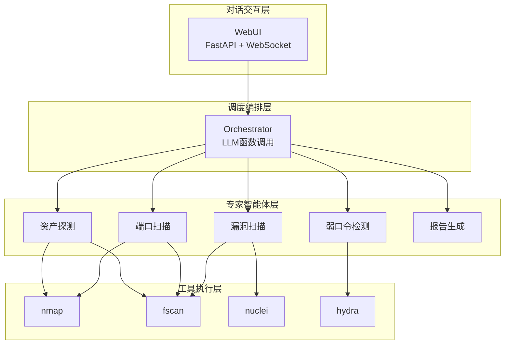
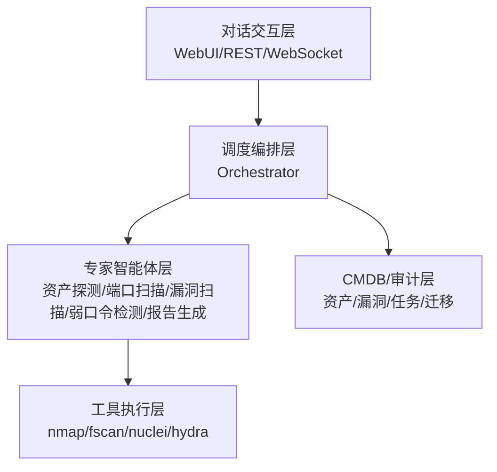
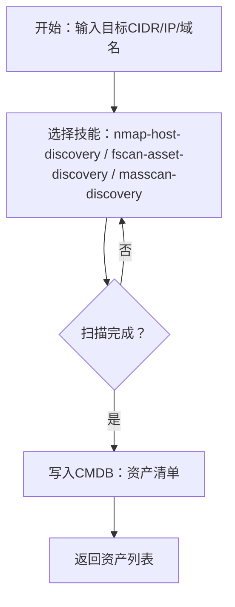
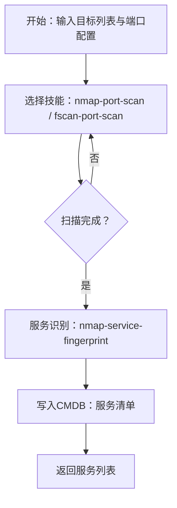
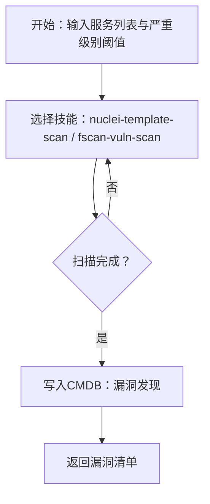
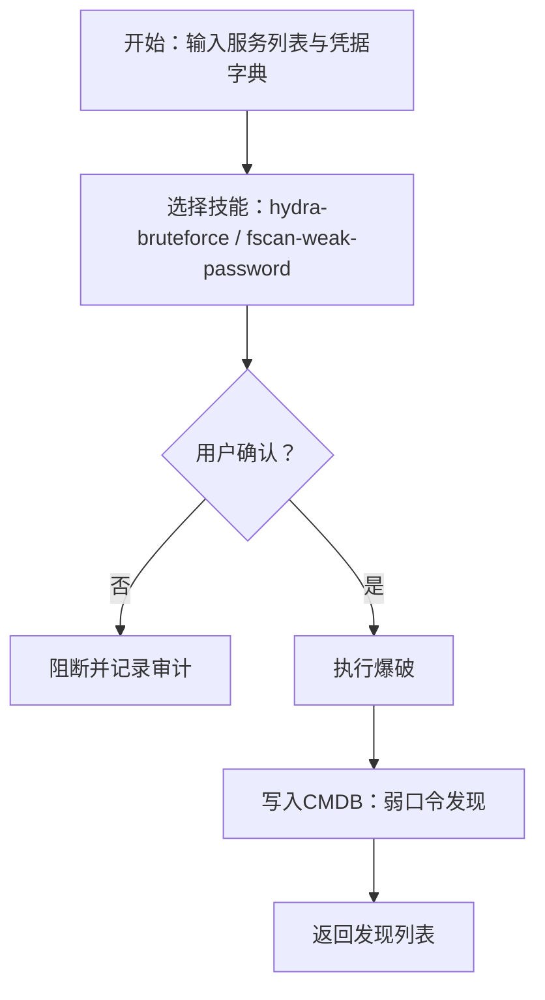
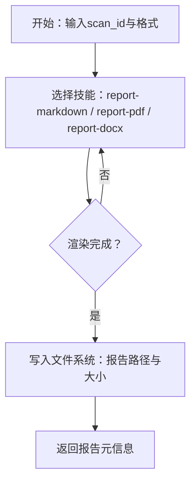
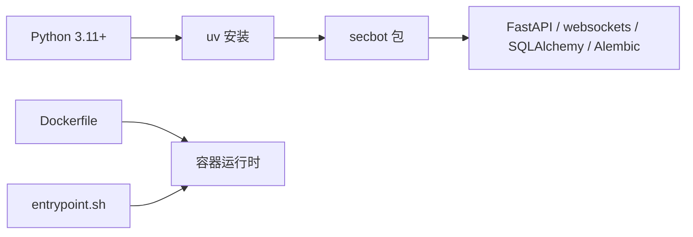

# 性能测试与基准

<cite>
**本文引用的文件**
- [README.md](file://README.md)
- [pyproject.toml](file://pyproject.toml)
- [Dockerfile](file://Dockerfile)
- [entrypoint.sh](file://entrypoint.sh)
- [core_agent_lines.sh](file://core_agent_lines.sh)
- [secbot/agents/asset_discovery.yaml](file://secbot/agents/asset_discovery.yaml)
- [secbot/agents/port_scan.yaml](file://secbot/agents/port_scan.yaml)
- [secbot/agents/vuln_scan.yaml](file://secbot/agents/vuln_scan.yaml)
- [secbot/agents/weak_password.yaml](file://secbot/agents/weak_password.yaml)
- [secbot/agents/report.yaml](file://secbot/agents/report.yaml)
- [tests/test_docker.sh](file://tests/test_docker.sh)
</cite>

## 目录
1. [引言](#引言)
2. [项目结构](#项目结构)
3. [核心组件](#核心组件)
4. [架构总览](#架构总览)
5. [详细组件分析](#详细组件分析)
6. [依赖关系分析](#依赖关系分析)
7. [性能考量](#性能考量)
8. [故障排查指南](#故障排查指南)
9. [结论](#结论)
10. [附录](#附录)

## 引言
本文件面向VAPT3（安全运营中的漏洞评估与渗透测试）场景，系统化阐述性能测试与基准设计方法，覆盖以下方面：
- 测试类型：负载测试、压力测试、稳定性测试的实施要点
- 基准设计：测试场景、测试数据、测试环境的准备与搭建
- 指标体系：响应时间、吞吐量、资源利用率等关键指标的定义与测量
- 自动化框架：pytest性能测试、JMeter集成、自定义测试工具的使用
- 回归策略：用例设计、基线建立、趋势分析
- 报告与优化：测试报告分析与优化建议制定

本项目为“对话式多智能体网络安全协作系统”，采用“主控编排 + 专家智能体池 + 工具执行层”的分层架构，结合FastAPI/WebSocket提供交互入口，底层以nmap/fscan/nuclei/hydra等工具执行实际扫描任务。性能测试应围绕“对话交互层”“调度编排层”“专家智能体层”“工具执行层”四个层次展开。

## 项目结构
- 后端服务与入口
  - FastAPI服务与WebSocket通道：提供WebUI与OpenAI兼容API入口
  - 网关模式（gateway）：同时承载健康检查与WebSocket通道，便于WebUI联调
- 智能体与编排
  - Orchestrator负责意图解析、DAG规划与任务分发
  - 专家智能体（资产探测、端口扫描、漏洞扫描、弱口令检测、报告生成）以YAML配置声明能力边界与工具集合
- 工具执行层
  - 通过技能（skills）封装nmap/fscan/nuclei/hydra等外部工具，统一输入输出Schema
- 数据与持久化
  - CMDB（SQLite + Alembic）记录资产、端口、漏洞、任务等，支撑报告与审计
- 测试与部署
  - pytest测试套件覆盖各模块；Dockerfile与entrypoint提供容器化运行与权限控制

**图表来源**
- [README.md:29-75](file://README.md#L29-L75)
- [secbot/agents/asset_discovery.yaml:1-46](file://secbot/agents/asset_discovery.yaml#L1-L46)
- [secbot/agents/port_scan.yaml:1-50](file://secbot/agents/port_scan.yaml#L1-L50)
- [secbot/agents/vuln_scan.yaml:1-53](file://secbot/agents/vuln_scan.yaml#L1-L53)
- [secbot/agents/weak_password.yaml:1-53](file://secbot/agents/weak_password.yaml#L1-L53)
- [secbot/agents/report.yaml:1-39](file://secbot/agents/report.yaml#L1-L39)

**章节来源**
- [README.md:29-75](file://README.md#L29-L75)

## 核心组件
- 对话交互层
  - WebUI：React前端，通过WebSocket与后端交互
  - API：OpenAI兼容接口与健康检查端点
- 调度编排层
  - Orchestrator：基于LLM函数调用的动态规划与任务编排
- 专家智能体层
  - 资产探测、端口扫描、漏洞扫描、弱口令检测、报告生成
- 工具执行层
  - nmap/fscan/nuclei/hydra等外部工具，经技能封装统一调用
- 数据与持久化
  - CMDB（SQLite + Alembic）记录扫描结果与任务历史

**章节来源**
- [README.md:29-75](file://README.md#L29-L75)
- [pyproject.toml:1-169](file://pyproject.toml#L1-L169)

## 架构总览
VAPT3采用四层架构，从上至下职责清晰：
- 对话交互层：接收指令、呈现过程与结果
- 调度编排层：意图解析、DAG规划、调度分发、上下文接力
- 专家智能体层：封装角色提示词 + 工具 + I/O Schema
- 工具执行层：真正执行安全操作的原子能力

**图表来源**
- [README.md:29-75](file://README.md#L29-L75)

## 详细组件分析

### 资产探测智能体（负载与压力场景）
- 能力边界
  - 在目标CIDR/IP/域名范围内发现存活主机与基础资产清单
  - 支持nmap-host-discovery、fscan-asset-discovery、masscan-discovery等技能
- 性能关注点
  - 并发扫描策略与速率控制
  - CMDB写入与查询的事务开销
  - 大规模网段下的内存占用与超时处理
- 基准场景建议
  - 小型网段（/24）、中型网段（/22）、大型网段（/16）三档
  - 不同并发度（低/中/高）与不同工具组合（nmap/fscan/masscan）

**图表来源**
- [secbot/agents/asset_discovery.yaml:1-46](file://secbot/agents/asset_discovery.yaml#L1-L46)

**章节来源**
- [secbot/agents/asset_discovery.yaml:1-46](file://secbot/agents/asset_discovery.yaml#L1-L46)

### 端口扫描智能体（高吞吐场景）
- 能力边界
  - 对资产探测产出的目标进行端口枚举与服务识别
  - 支持nmap-port-scan、nmap-service-fingerprint、fscan-port-scan
- 性能关注点
  - 端口范围与速率参数（slow/normal/fast）对吞吐量与误报率的影响
  - 多目标并发扫描的资源竞争与超时重试
- 基准场景建议
  - 单目标/多目标（10/100/1000）并发
  - 端口范围（top-1000/all）与速率（slow/normal/fast）

**图表来源**
- [secbot/agents/port_scan.yaml:1-50](file://secbot/agents/port_scan.yaml#L1-L50)

**章节来源**
- [secbot/agents/port_scan.yaml:1-50](file://secbot/agents/port_scan.yaml#L1-L50)

### 漏洞扫描智能体（高延迟场景）
- 能力边界
  - 基于模板（nuclei）或指纹（fscan）进行漏洞检测
  - 支持severity_floor过滤
- 性能关注点
  - 模板数量与复杂度对响应时间的影响
  - 并发模板执行与外部工具超时
- 基准场景建议
  - 不同严重级别阈值（low/medium/high/critical）
  - 模板集大小（小/中/大）与目标数量组合

**图表来源**
- [secbot/agents/vuln_scan.yaml:1-53](file://secbot/agents/vuln_scan.yaml#L1-L53)

**章节来源**
- [secbot/agents/vuln_scan.yaml:1-53](file://secbot/agents/vuln_scan.yaml#L1-L53)

### 弱口令检测智能体（高风险与高波动场景）
- 能力边界
  - 针对指定服务执行口令爆破（hydra-bruteforce、fscan-weak-password）
  - 高危动作需人工确认
- 性能关注点
  - 爆破并发与速率限制对成功率与资源消耗的影响
  - 用户确认环节对整体吞吐量的抑制
- 基准场景建议
  - 单目标/多目标并发
  - 用户确认策略（自动/手动）对比

**图表来源**
- [secbot/agents/weak_password.yaml:1-53](file://secbot/agents/weak_password.yaml#L1-L53)

**章节来源**
- [secbot/agents/weak_password.yaml:1-53](file://secbot/agents/weak_password.yaml#L1-L53)

### 报告生成智能体（高I/O与CPU场景）
- 能力边界
  - 基于CMDB数据生成Markdown/DOCX/PDF报告
  - 支持模板定制
- 性能关注点
  - 大体量报告渲染的CPU与内存占用
  - 多格式导出的I/O瓶颈
- 基准场景建议
  - 不同漏洞规模（小/中/大）与报告格式（markdown/pdf/docx）组合

**图表来源**
- [secbot/agents/report.yaml:1-39](file://secbot/agents/report.yaml#L1-L39)

**章节来源**
- [secbot/agents/report.yaml:1-39](file://secbot/agents/report.yaml#L1-L39)

## 依赖关系分析
- 语言与运行时
  - Python 3.11+，uv作为包管理与安装工具
- 依赖与可选功能
  - FastAPI、websockets、SQLAlchemy、Alembic等
  - 可选渠道与PDF导出等依赖
- 容器化与入口
  - Dockerfile基于python3.12镜像，entrypoint确保配置目录可写

**图表来源**
- [pyproject.toml:25-68](file://pyproject.toml#L25-L68)
- [Dockerfile:1-51](file://Dockerfile#L1-L51)
- [entrypoint.sh:1-16](file://entrypoint.sh#L1-L16)

**章节来源**
- [pyproject.toml:1-169](file://pyproject.toml#L1-L169)
- [Dockerfile:1-51](file://Dockerfile#L1-L51)
- [entrypoint.sh:1-16](file://entrypoint.sh#L1-L16)

## 性能考量
- 指标定义
  - 响应时间：从用户提交到返回完整结果的端到端时间
  - 吞吐量：单位时间内完成的任务数（如扫描目标数/报告生成数）
  - 资源利用率：CPU、内存、磁盘I/O、网络I/O
  - 错误率：超时、失败、人工确认阻断比例
- 测量方法
  - 使用容器化环境（Docker）保证测试一致性
  - 通过WebSocket或OpenAI兼容API进行端到端压测
  - 使用系统监控（如cAdvisor/Docker stats）采集资源指标
- 关键优化方向
  - 并发与限流：根据工具能力与网络带宽设定合理并发
  - 缓存与预热：提示词缓存、工具进程复用、CMDB批量写入
  - I/O优化：异步写入、压缩传输、分块渲染
  - 超时与重试：针对外部工具设置合理的超时与退避策略

[本节为通用性能指导，不直接分析具体文件，故无“章节来源”]

## 故障排查指南
- 容器权限问题
  - 若配置目录不可写，entrypoint会打印错误并退出，需修正宿主机权限或容器用户映射
- 网络与工具依赖
  - 确保nmap/fscan/nuclei/hydra等工具在容器内可用，或在宿主机安装后挂载到容器
- 测试脚本与环境
  - tests/test_docker.sh可用于验证容器化部署的可用性

**章节来源**
- [entrypoint.sh:1-16](file://entrypoint.sh#L1-L16)
- [tests/test_docker.sh](file://tests/test_docker.sh)

## 结论
VAPT3的性能测试应以“专家智能体”为核心对象，围绕“资产探测—端口扫描—漏洞扫描—弱口令检测—报告生成”的完整链路设计基准场景，结合负载、压力、稳定性三类测试，建立响应时间、吞吐量、资源利用率等指标体系，并通过pytest与容器化环境实现自动化回归。建议优先优化工具执行层的并发与超时策略，配合CMDB批量写入与报告渲染的异步化，持续监控并迭代性能基线。

[本节为总结性内容，不直接分析具体文件，故无“章节来源”]

## 附录

### A. 测试场景设计与数据准备
- 场景分层
  - 资产探测：小型/中型/大型网段，不同并发与工具组合
  - 端口扫描：单/多目标，不同端口范围与速率
  - 漏洞扫描：不同严重级别阈值与模板集大小
  - 弱口令检测：单/多目标，不同凭据字典规模
  - 报告生成：不同漏洞规模与格式
- 数据准备
  - 生成标准化目标清单与凭据字典
  - 准备不同体量的CMDB快照以模拟历史扫描

[本节为概念性内容，不直接分析具体文件，故无“章节来源”]

### B. 自动化测试框架与工具
- pytest
  - 利用现有测试组织结构，编写性能测试用例（如端到端请求、工具调用耗时）
  - 使用标记（markers）区分负载/压力/稳定性场景
- JMeter
  - 通过OpenAI兼容API端点录制与回放性能脚本
  - 配合WebSocket端点进行长连接场景压测
- 自定义工具
  - 基于Dockerfile与entrypoint构建一致的测试环境
  - 使用core_agent_lines.sh统计代码规模，辅助容量规划

**章节来源**
- [pyproject.toml:153-156](file://pyproject.toml#L153-L156)
- [Dockerfile:1-51](file://Dockerfile#L1-L51)
- [entrypoint.sh:1-16](file://entrypoint.sh#L1-L16)
- [core_agent_lines.sh:1-93](file://core_agent_lines.sh#L1-L93)

### C. 性能回归策略
- 用例设计
  - 覆盖关键路径（资产探测→端口扫描→漏洞扫描→报告生成）
  - 引入异常与边界条件（超大规模目标、弱信号服务、网络抖动）
- 基线建立
  - 在标准硬件与网络条件下采集基准值（P50/P95/P99）
  - 分层基线：每层智能体与工具执行的独立基线
- 趋势分析
  - 持续监控关键指标变化，识别回归与优化机会
  - 结合CI流水线自动触发性能回归测试

[本节为概念性内容，不直接分析具体文件，故无“章节来源”]