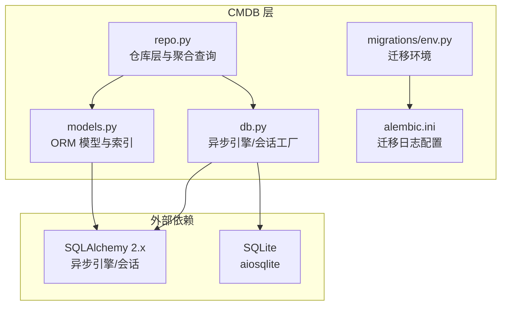
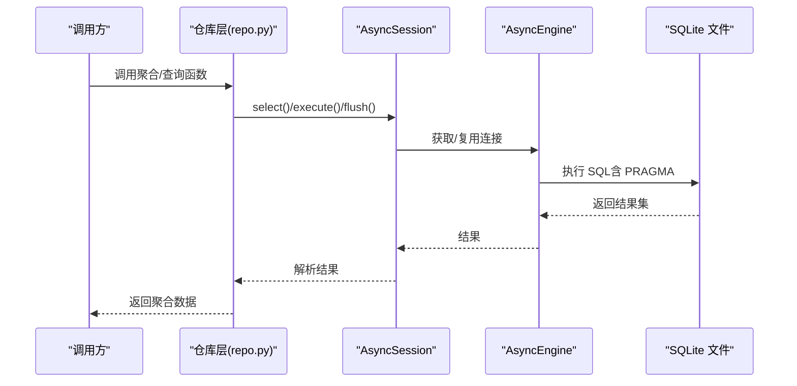
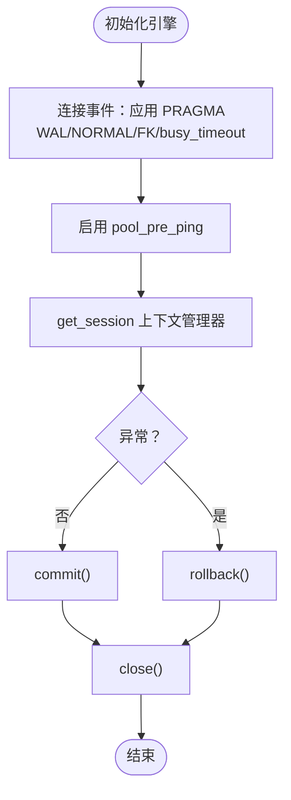
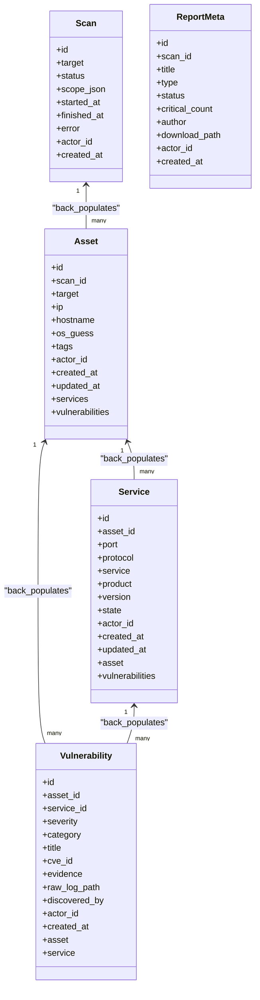
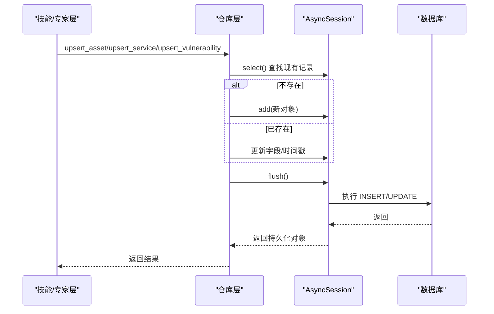
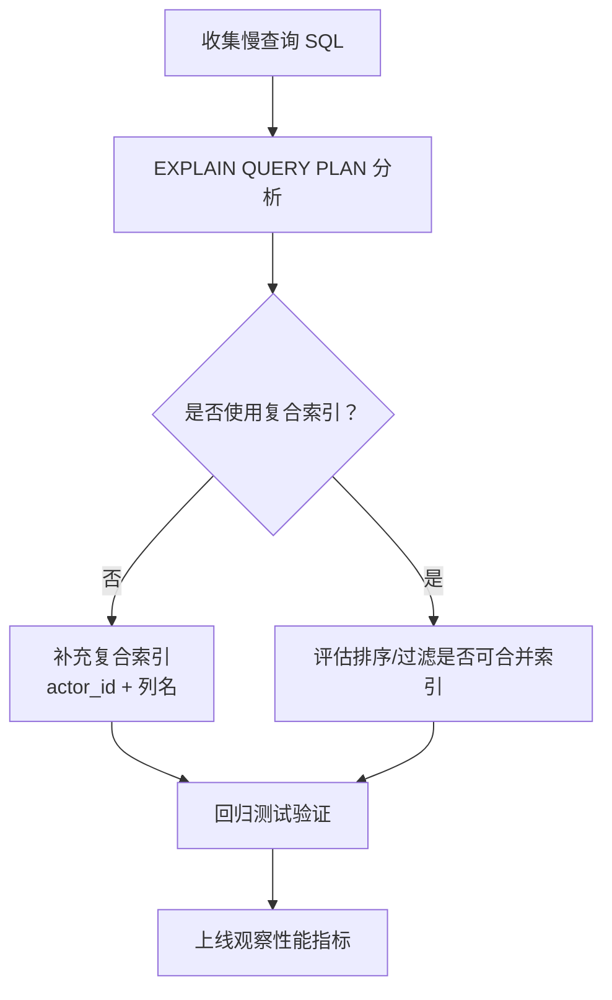
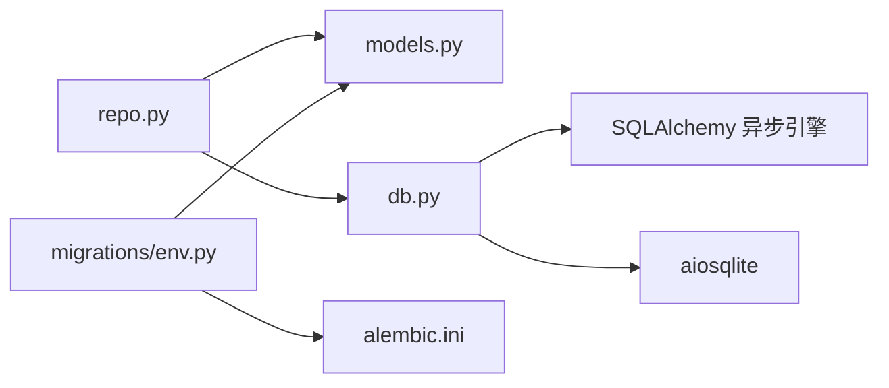

# 数据库性能优化

<cite>
**本文引用的文件**
- [secbot/cmdb/db.py](file://secbot/cmdb/db.py)
- [secbot/cmdb/models.py](file://secbot/cmdb/models.py)
- [secbot/cmdb/repo.py](file://secbot/cmdb/repo.py)
- [secbot/cmdb/migrations/env.py](file://secbot/cmdb/migrations/env.py)
- [secbot/cmdb/alembic.ini](file://secbot/cmdb/alembic.ini)
- [.trellis/spec/backend/cmdb-schema.md](file://.trellis/spec/backend/cmdb-schema.md)
- [.trellis/spec/backend/dashboard-aggregation.md](file://.trellis/spec/backend/dashboard-aggregation.md)
- [pyproject.toml](file://pyproject.toml)
</cite>

## 目录
1. [简介](#简介)
2. [项目结构](#项目结构)
3. [核心组件](#核心组件)
4. [架构总览](#架构总览)
5. [详细组件分析](#详细组件分析)
6. [依赖分析](#依赖分析)
7. [性能考虑](#性能考虑)
8. [故障排查指南](#故障排查指南)
9. [结论](#结论)
10. [附录](#附录)

## 简介
本文件面向 VAPT3 的数据库层（CMDB）进行系统性性能优化说明，聚焦于 SQLAlchemy ORM 性能优化、查询与关系映射优化、批量写入优化、数据库查询分析与慢查询识别、连接池与 WAL 模式优化、数据模型与索引设计、缓存策略以及监控与性能指标分析方法。内容基于实际代码与规范文件，结合 SQLite + SQLAlchemy 异步引擎的工程实践，提供可落地的优化建议与可视化图示。

## 项目结构
CMDB 相关代码集中在 secbot/cmdb 子目录，采用“异步引擎 + 会话工厂 + ORM 模型 + 仓库层”的分层组织：
- 引擎与会话：db.py 提供异步引擎初始化、连接事件、会话上下文管理
- 数据模型：models.py 定义表结构、索引与关系
- 业务仓库：repo.py 提供读写聚合与仪表盘统计查询
- 迁移与配置：migrations/env.py、alembic.ini 管理迁移与日志级别
- 规范与契约：cmdb-schema.md、dashboard-aggregation.md 明确表结构、索引与查询契约

图表来源
- [secbot/cmdb/db.py:64-93](file://secbot/cmdb/db.py#L64-L93)
- [secbot/cmdb/models.py:34-174](file://secbot/cmdb/models.py#L34-L174)
- [secbot/cmdb/repo.py:1-130](file://secbot/cmdb/repo.py#L1-L130)
- [secbot/cmdb/migrations/env.py:33-71](file://secbot/cmdb/migrations/env.py#L33-L71)
- [secbot/cmdb/alembic.ini:1-44](file://secbot/cmdb/alembic.ini#L1-L44)

章节来源
- [secbot/cmdb/db.py:1-133](file://secbot/cmdb/db.py#L1-L133)
- [.trellis/spec/backend/cmdb-schema.md:1-185](file://.trellis/spec/backend/cmdb-schema.md#L1-L185)

## 核心组件
- 异步引擎与连接事件
  - 初始化异步引擎，启用 pool_pre_ping，注册连接事件以应用 SQLite PRAGMA（WAL、同步模式、外键、busy_timeout）
  - 提供进程级单例引擎与会话工厂，保证并发安全与资源复用
- ORM 模型与索引
  - 扫描、资产、服务、漏洞、报告元数据五张表，定义主键、外键、JSON 字段、时间戳字段
  - 为高频过滤与排序列建立复合索引，如 actor_id + status、actor_id + created_at、actor_id + severity + created_at 等
- 仓库层与聚合查询
  - 提供 upsert、列表查询、统计聚合（仪表盘 KPI、趋势、分布、集群）等读取接口
  - 聚合查询使用 group_by、case when、json_extract 等，确保在 SQLite 上高效执行

章节来源
- [secbot/cmdb/db.py:64-93](file://secbot/cmdb/db.py#L64-L93)
- [secbot/cmdb/models.py:38-174](file://secbot/cmdb/models.py#L38-L174)
- [secbot/cmdb/repo.py:456-758](file://secbot/cmdb/repo.py#L456-L758)

## 架构总览
下图展示从调用方到数据库的典型路径：调用方通过仓库层发起查询，仓库层使用 AsyncSession 执行 SQL；引擎层负责连接池与 PRAGMA 设置，最终落到 SQLite 文件。

图表来源
- [secbot/cmdb/repo.py:456-552](file://secbot/cmdb/repo.py#L456-L552)
- [secbot/cmdb/db.py:103-122](file://secbot/cmdb/db.py#L103-L122)

## 详细组件分析

### 组件一：异步引擎与连接池优化
- 关键点
  - 使用 create_async_engine 创建异步引擎，启用 pool_pre_ping 以自动探测并重建失效连接
  - 通过 event.listen 在每次新连接建立时应用 PRAGMA：WAL 模式、synchronous NORMAL、外键开启、busy_timeout
  - 提供 get_session 上下文管理器，统一提交/回滚/关闭，避免泄漏
- 优化建议
  - 可根据并发峰值调整连接池大小（当前未显式配置，依赖默认值），在高并发场景下可考虑设置 pool_size、max_overflow、pool_recycle 等参数
  - 对于长事务或批处理，建议显式控制会话生命周期，避免长时间占用连接
  - 在生产部署中，结合数据库监控观察连接池命中率与等待时间

图表来源
- [secbot/cmdb/db.py:64-93](file://secbot/cmdb/db.py#L64-L93)
- [secbot/cmdb/db.py:103-122](file://secbot/cmdb/db.py#L103-L122)

章节来源
- [secbot/cmdb/db.py:64-93](file://secbot/cmdb/db.py#L64-L93)
- [secbot/cmdb/db.py:103-122](file://secbot/cmdb/db.py#L103-L122)

### 组件二：ORM 查询与关系映射优化
- 关系映射
  - 资产与服务：一对多，删除资产时级联删除服务
  - 资产与漏洞：一对多，删除资产时级联删除漏洞
  - 服务与漏洞：一对多，删除服务时可置空 service_id
- 查询优化要点
  - 使用 select() + where() + order_by() + limit()，避免 N+1 查询
  - 复合索引覆盖常见过滤条件（如 actor_id、状态、时间）
  - 聚合查询使用 group_by + func.count()，避免在 Python 层做二次聚合
- 建议
  - 对于复杂 JOIN，优先在 SQL 层完成，减少 ORM 层对象化成本
  - 对热点查询引入只读会话与连接（仅限只读场景）

图表来源
- [secbot/cmdb/models.py:38-174](file://secbot/cmdb/models.py#L38-L174)

章节来源
- [secbot/cmdb/models.py:38-174](file://secbot/cmdb/models.py#L38-L174)

### 组件三：批量写入与幂等 upsert 优化
- upsert 设计
  - 资产：按 (actor_id, scan_id, target) 幂等更新
  - 服务：按 (asset_id, port, protocol) 幂等更新
  - 漏洞：按 (asset_id, service_id, title, cve_id) 幂等更新
- 写入流程
  - 仓库层在单个事务内执行 flush，避免跨事务状态不一致
  - 写入前校验枚举值，确保数据一致性
- 优化建议
  - 对于大规模导入，建议分批 flush，控制单事务大小
  - 对热点键（如资产 target）建立复合索引，加速 upsert 查找

图表来源
- [secbot/cmdb/repo.py:149-205](file://secbot/cmdb/repo.py#L149-L205)
- [secbot/cmdb/repo.py:227-275](file://secbot/cmdb/repo.py#L227-L275)
- [secbot/cmdb/repo.py:297-384](file://secbot/cmdb/repo.py#L297-L384)

章节来源
- [secbot/cmdb/repo.py:149-205](file://secbot/cmdb/repo.py#L149-L205)
- [secbot/cmdb/repo.py:227-275](file://secbot/cmdb/repo.py#L227-L275)
- [secbot/cmdb/repo.py:297-384](file://secbot/cmdb/repo.py#L297-L384)

### 组件四：查询分析与慢查询识别
- 慢查询识别
  - 使用 SQLAlchemy 的 echo 参数在开发阶段输出 SQL 语句，定位潜在全表扫描
  - 对高频聚合查询（仪表盘）增加 EXPLAIN QUERY PLAN（SQLite 支持 PRAGMA）辅助分析
- 执行计划分析
  - 关注复合索引是否被使用（如 actor_id + status、actor_id + created_at）
  - 对 group_by + case when 的查询，确认索引覆盖 created_at 与 severity
- 索引优化策略
  - 为过滤列与排序列建立复合索引
  - 避免在 WHERE 中对列进行函数计算，导致索引失效
  - 对 JSON 字段的提取（json_extract）配合索引可提升查询效率

图表来源
- [.trellis/spec/backend/cmdb-schema.md:37-93](file://.trellis/spec/backend/cmdb-schema.md#L37-L93)
- [.trellis/spec/backend/dashboard-aggregation.md:41-76](file://.trellis/spec/backend/dashboard-aggregation.md#L41-L76)

章节来源
- [.trellis/spec/backend/cmdb-schema.md:37-93](file://.trellis/spec/backend/cmdb-schema.md#L37-L93)
- [.trellis/spec/backend/dashboard-aggregation.md:41-76](file://.trellis/spec/backend/dashboard-aggregation.md#L41-L76)

### 组件五：数据模型与索引设计
- 表结构与字段类型
  - 时间字段使用带时区的 DateTime，便于跨时区展示与排序
  - JSON 字段用于灵活扩展，但需注意查询时的索引与函数开销
- 约束与唯一性
  - 服务表使用 (asset_id, port, protocol) 唯一约束，避免重复端口
  - 报告元数据表使用复合索引覆盖 actor_id、status、created_at
- 建议
  - 对高频查询列（如 created_at、severity）建立复合索引
  - 对 JSON 字段的常用提取键（如 tags.system、tags.type）考虑物化列或二级索引

章节来源
- [secbot/cmdb/models.py:38-174](file://secbot/cmdb/models.py#L38-L174)
- [.trellis/spec/backend/cmdb-schema.md:37-151](file://.trellis/spec/backend/cmdb-schema.md#L37-L151)

### 组件六：缓存策略实现
- 查询结果缓存
  - 对只读仪表盘聚合数据（如 summary_counts、vuln_trend、asset_cluster）可引入短期内存缓存（TTL 依据刷新频率设定）
  - 缓存键包含 actor_id 与时间窗口参数，避免跨用户污染
- 热点数据缓存
  - 对最近 N 条资产/漏洞列表的查询结果进行 LRU 缓存
  - 对于频繁访问的报告元数据列表，可按日期/类型/状态分片缓存
- 注意事项
  - 缓存失效策略与数据变更解耦，避免脏读
  - 对于强一致要求的写后读场景，应禁用或绕过缓存

[本节为通用策略说明，不直接分析具体文件]

### 组件七：数据库监控与性能指标
- 日志与审计
  - 迁移配置中已设置 sqlalchemy.engine 与 alembic 日志级别，可在开发阶段启用更详细的 SQL 输出
  - 建议在生产环境开启慢查询阈值日志（SQLite PRAGMA 正则表达式或外部代理）
- 指标采集
  - 连接池指标：活跃连接数、等待队列长度、回收次数
  - 查询指标：慢查询数量、平均/95 分位响应时间、错误率
  - 业务指标：仪表盘聚合查询耗时、upsert 吞吐量
- 建议
  - 将关键查询耗时埋点到监控系统，结合业务时段进行容量规划
  - 对 WAL 模式下的写放大与读锁竞争进行周期性观测

章节来源
- [secbot/cmdb/alembic.ini:26-34](file://secbot/cmdb/alembic.ini#L26-L34)
- [secbot/cmdb/db.py:51-61](file://secbot/cmdb/db.py#L51-L61)

## 依赖分析
- 外部依赖
  - SQLAlchemy 2.x 异步引擎与会话
  - aiosqlite 驱动
  - Alembic 迁移工具
- 内部依赖
  - repo.py 依赖 models.py 的 ORM 类型与索引
  - db.py 为 repo.py 提供 AsyncSession
  - migrations/env.py 依赖 models.Base.metadata 进行迁移

图表来源
- [secbot/cmdb/repo.py:26-40](file://secbot/cmdb/repo.py#L26-L40)
- [secbot/cmdb/db.py:17-23](file://secbot/cmdb/db.py#L17-L23)
- [secbot/cmdb/migrations/env.py:20-30](file://secbot/cmdb/migrations/env.py#L20-L30)
- [pyproject.toml:65-67](file://pyproject.toml#L65-L67)

章节来源
- [pyproject.toml:65-67](file://pyproject.toml#L65-L67)
- [secbot/cmdb/repo.py:26-40](file://secbot/cmdb/repo.py#L26-L40)
- [secbot/cmdb/migrations/env.py:20-30](file://secbot/cmdb/migrations/env.py#L20-L30)

## 性能考虑
- 异步与并发
  - 使用异步引擎与上下文管理器，避免阻塞 IO；合理划分事务边界，降低锁竞争
- 索引与查询
  - 为高频过滤与排序列建立复合索引；避免在 WHERE 中对列应用函数
- 批处理与幂等
  - upsert 逻辑保证重扫幂等；批处理时控制单事务大小，定期 flush
- WAL 与同步
  - WAL 模式提升并发读取能力；synchronous NORMAL 平衡性能与可靠性
- 监控与容量
  - 建立慢查询与连接池指标监控，结合业务高峰进行容量规划

[本节为通用指导，不直接分析具体文件]

## 故障排查指南
- 常见问题
  - “database is locked”：检查 WAL 是否生效、busy_timeout 是否足够、是否存在长时间事务
  - 查询缓慢：确认复合索引是否被使用，避免函数计算导致索引失效
  - 连接池耗尽：检查 pool_pre_ping 生效情况与连接复用策略
- 排查步骤
  - 开启 SQLAlchemy echo 输出 SQL
  - 使用 EXPLAIN QUERY PLAN 分析执行计划
  - 观察连接池指标与慢查询日志
  - 对热点查询引入短期缓存或分页限制

章节来源
- [secbot/cmdb/db.py:51-61](file://secbot/cmdb/db.py#L51-L61)
- [secbot/cmdb/db.py:103-122](file://secbot/cmdb/db.py#L103-L122)

## 结论
VAPT3 的 CMDB 已在 SQLite + SQLAlchemy 异步引擎上实现了较为完善的性能基线：WAL 模式、PRAGMA 优化、复合索引与幂等 upsert。在此基础上，建议进一步完善连接池参数、引入查询缓存、加强监控与慢查询治理，并持续通过规范与契约保障查询与索引设计的一致性，从而在单机 SQLite 场景下获得稳定且可扩展的数据库性能。

## 附录
- 相关规范
  - CMDB 表结构与索引契约：参见 cmdb-schema.md
  - 仪表盘聚合查询契约：参见 dashboard-aggregation.md
- 迁移与日志
  - 迁移环境与 URL 解析：参见 migrations/env.py
  - 迁移日志配置：参见 alembic.ini
- 依赖版本
  - SQLAlchemy 2.x 异步引擎与 aiosqlite：参见 pyproject.toml

章节来源
- [.trellis/spec/backend/cmdb-schema.md:1-185](file://.trellis/spec/backend/cmdb-schema.md#L1-L185)
- [.trellis/spec/backend/dashboard-aggregation.md:41-76](file://.trellis/spec/backend/dashboard-aggregation.md#L41-L76)
- [secbot/cmdb/migrations/env.py:33-71](file://secbot/cmdb/migrations/env.py#L33-L71)
- [secbot/cmdb/alembic.ini:26-34](file://secbot/cmdb/alembic.ini#L26-L34)
- [pyproject.toml:65-67](file://pyproject.toml#L65-L67)