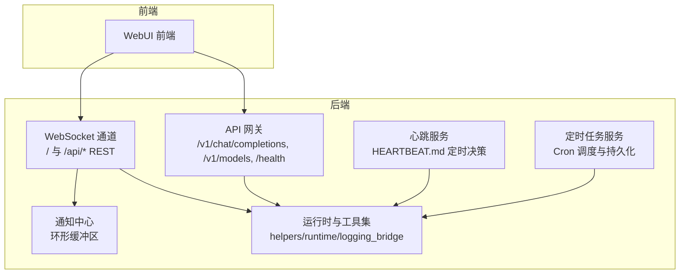
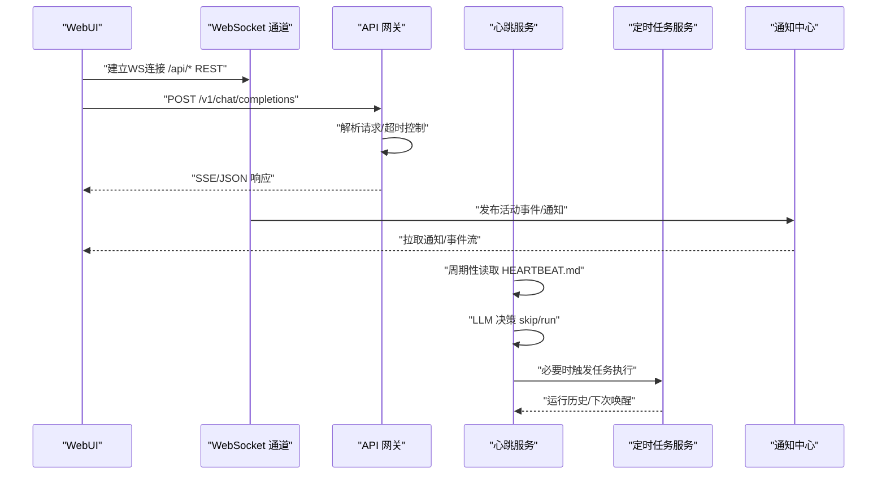
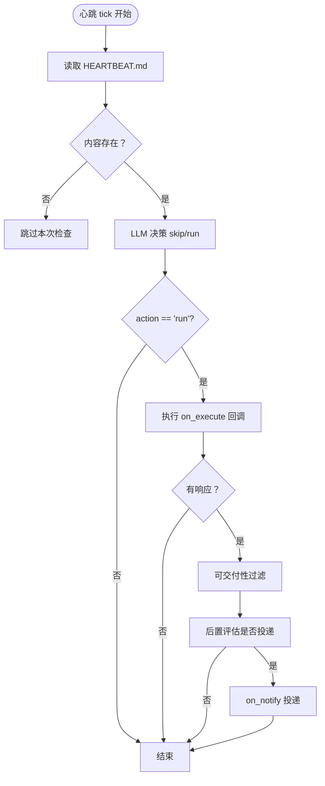
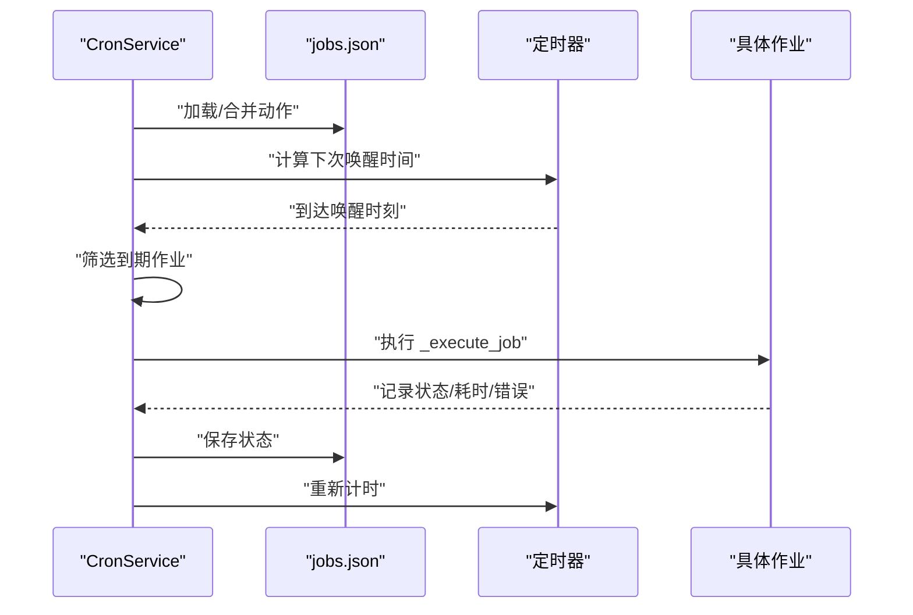
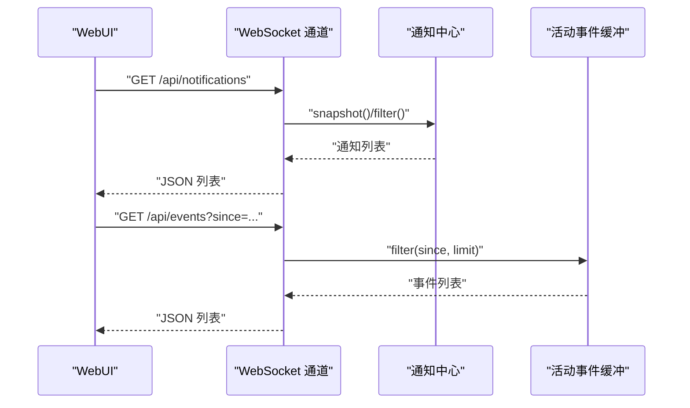
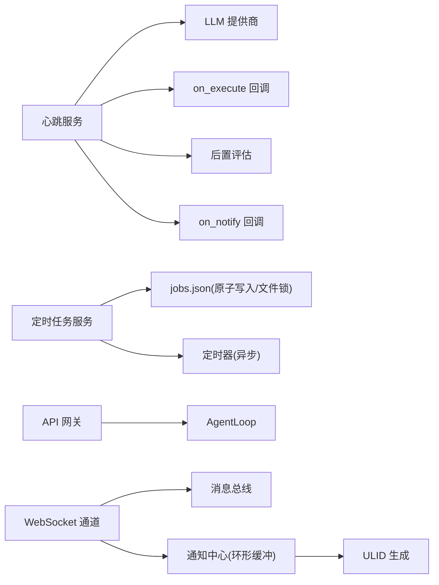

# 系统监控与调优

<cite>
**本文引用的文件**
- [secbot/heartbeat/service.py](file://secbot/heartbeat/service.py)
- [secbot/cron/service.py](file://secbot/cron/service.py)
- [secbot/api/server.py](file://secbot/api/server.py)
- [secbot/channels/websocket.py](file://secbot/channels/websocket.py)
- [secbot/channels/notifications.py](file://secbot/channels/notifications.py)
- [secbot/utils/helpers.py](file://secbot/utils/helpers.py)
- [secbot/utils/runtime.py](file://secbot/utils/runtime.py)
- [secbot/utils/logging_bridge.py](file://secbot/utils/logging_bridge.py)
- [secbot/templates/HEARTBEAT.md](file://secbot/templates/HEARTBEAT.md)
- [webui/src/lib/api.ts](file://webui/src/lib/api.ts)
- [webui/src/data/mock/dashboard.ts](file://webui/src/data/mock/dashboard.ts)
- [docs/README.md](file://docs/README.md)
- [docs/configuration.md](file://docs/configuration.md)
- [docs/deployment.md](file://docs/deployment.md)
</cite>

## 目录
1. [简介](#简介)
2. [项目结构](#项目结构)
3. [核心组件](#核心组件)
4. [架构总览](#架构总览)
5. [详细组件分析](#详细组件分析)
6. [依赖分析](#依赖分析)
7. [性能考虑](#性能考虑)
8. [故障排查指南](#故障排查指南)
9. [结论](#结论)
10. [附录](#附录)

## 简介
本文件面向VAPT3系统的“监控与调优”，围绕以下目标展开：系统健康检查（心跳服务）、服务可用性监控、故障检测策略；性能指标采集与分析（CPU/内存/网络/磁盘）；告警机制配置（阈值、规则、通知策略）；负载均衡与扩展策略（水平/垂直/自动伸缩）；系统调优指南（内核参数、文件描述符、网络参数等）；监控工具集成与仪表板配置。

## 项目结构
VAPT3后端采用模块化设计，核心能力由“心跳服务”“定时任务调度”“API网关”“WebSocket通道”“通知中心”“运行时工具集”等组成，并通过WebUI提供可视化界面与REST/WS接口。部署支持Docker与系统服务两种方式。



图表来源
- [secbot/api/server.py:381-401](file://secbot/api/server.py#L381-L401)
- [secbot/channels/websocket.py:657-795](file://secbot/channels/websocket.py#L657-L795)
- [secbot/heartbeat/service.py:40-74](file://secbot/heartbeat/service.py#L40-L74)
- [secbot/cron/service.py:74-94](file://secbot/cron/service.py#L74-L94)
- [secbot/channels/notifications.py:127-140](file://secbot/channels/notifications.py#L127-L140)
- [secbot/utils/helpers.py:440-494](file://secbot/utils/helpers.py#L440-L494)

章节来源
- [docs/README.md:1-35](file://docs/README.md#L1-L35)
- [docs/configuration.md:1-120](file://docs/configuration.md#L1-L120)
- [docs/deployment.md:1-171](file://docs/deployment.md#L1-L171)

## 核心组件
- 心跳服务：周期性读取HEARTBEAT.md，通过LLM判断是否存在可执行任务，必要时触发执行并按评估结果决定是否对外投递。
- 定时任务服务：基于文件锁与原子写入的作业存储，支持at/every/cron三种调度模式，具备运行历史记录与下次唤醒时间计算。
- API网关：提供OpenAI兼容的聊天补全与模型列表接口，内置健康检查端点，支持流式与非流式响应。
- WebSocket通道：作为WebSocket服务器，提供REST子集、会话管理、活动事件流、通知中心、媒体签名URL等能力。
- 通知中心：环形缓冲队列，支持类型化通知与活动事件流，具备线程安全与环境变量容量控制。
- 运行时工具集：包含状态快照构建、令牌估算、空输出占位、工作区越界防护等辅助能力。

章节来源
- [secbot/heartbeat/service.py:40-237](file://secbot/heartbeat/service.py#L40-L237)
- [secbot/cron/service.py:74-665](file://secbot/cron/service.py#L74-L665)
- [secbot/api/server.py:194-401](file://secbot/api/server.py#L194-L401)
- [secbot/channels/websocket.py:474-795](file://secbot/channels/websocket.py#L474-L795)
- [secbot/channels/notifications.py:127-385](file://secbot/channels/notifications.py#L127-L385)
- [secbot/utils/helpers.py:440-494](file://secbot/utils/helpers.py#L440-L494)

## 架构总览
下图展示从WebUI到后端各组件的交互路径，以及健康检查与通知的关键节点。



图表来源
- [secbot/api/server.py:194-351](file://secbot/api/server.py#L194-L351)
- [secbot/channels/websocket.py:657-795](file://secbot/channels/websocket.py#L657-L795)
- [secbot/heartbeat/service.py:184-227](file://secbot/heartbeat/service.py#L184-L227)
- [secbot/cron/service.py:394-460](file://secbot/cron/service.py#L394-L460)
- [secbot/channels/notifications.py:258-385](file://secbot/channels/notifications.py#L258-L385)

## 详细组件分析

### 心跳服务（健康检查与可用性）
- 触发机制：每间隔固定秒数（默认30分钟），读取HEARTBEAT.md，交由LLM通过虚拟工具函数进行“skip/run”决策。
- 执行策略：当决策为“run”时，调用on_execute回调执行任务，随后对响应进行可交付性过滤与后置评估，再决定是否通过on_notify对外投递。
- 可靠性：异常捕获与日志记录，避免单次失败导致循环中断；支持手动触发以快速验证。



图表来源
- [secbot/heartbeat/service.py:184-227](file://secbot/heartbeat/service.py#L184-L227)

章节来源
- [secbot/heartbeat/service.py:40-237](file://secbot/heartbeat/service.py#L40-L237)
- [secbot/templates/HEARTBEAT.md:1-17](file://secbot/templates/HEARTBEAT.md#L1-L17)

### 定时任务服务（可用性与稳定性保障）
- 存储与一致性：基于jobs.json的原子写入与文件锁，确保多实例并发修改不丢失；损坏文件自动备份并保留上次有效快照。
- 调度算法：支持at（一次性）、every（固定间隔）、cron（表达式+时区）三种模式，动态重算下次运行时间。
- 运行记录：维护最近若干次运行历史，含状态、耗时、错误信息；一次性任务在完成后可删除或禁用。
- 线程与异步：定时器为异步任务，避免阻塞；加载/保存操作在必要时合并外部变更。



图表来源
- [secbot/cron/service.py:328-460](file://secbot/cron/service.py#L328-L460)

章节来源
- [secbot/cron/service.py:74-665](file://secbot/cron/service.py#L74-L665)

### API网关（健康检查与可用性）
- 健康检查：/health返回“ok”，便于探活与编排层探测。
- 请求处理：支持JSON与multipart/form-data；流式与非流式两种路径；带超时保护与空响应兜底。
- 并发控制：按会话键加锁，避免并发竞态；超时错误统一映射为HTTP 504。

```mermaid
sequenceDiagram
participant CLIENT as "客户端"
participant API as "API 网关"
participant LOOP as "AgentLoop"
CLIENT->>API : "POST /v1/chat/completions"
API->>API : "解析/校验/限流"
API->>LOOP : "process_direct(...)"
alt 流式
LOOP-->>API : "分片 token"
API-->>CLIENT : "SSE 数据块"
else 非流式
LOOP-->>API : "最终文本"
API-->>CLIENT : "JSON 响应"
end
```

图表来源
- [secbot/api/server.py:194-351](file://secbot/api/server.py#L194-L351)

章节来源
- [secbot/api/server.py:371-374](file://secbot/api/server.py#L371-L374)

### WebSocket通道（实时监控与通知）
- 协议与鉴权：支持WS升级与HTTP路由，可配置静态令牌、签发令牌、有效期与白名单；广播节流防止抖动。
- REST子集：提供会话列表、命令、设置、报告元数据、活动事件、通知中心等只读接口。
- 通知与事件：通知中心为环形缓冲队列，支持按类型/级别/来源过滤；活动事件窗口默认5分钟。



图表来源
- [secbot/channels/websocket.py:657-795](file://secbot/channels/websocket.py#L657-L795)
- [secbot/channels/notifications.py:258-385](file://secbot/channels/notifications.py#L258-L385)

章节来源
- [secbot/channels/websocket.py:474-795](file://secbot/channels/websocket.py#L474-L795)
- [secbot/channels/notifications.py:127-385](file://secbot/channels/notifications.py#L127-L385)

### 运行时与工具集（性能与稳定性）
- 状态快照：构建人类可读的运行时状态摘要，包含版本、模型、令牌用量、上下文占比、会话消息数、运行时长、任务数等。
- 令牌估算：优先使用提供商计数器，回退至tiktoken估算，用于预算控制与告警阈值设定。
- 空输出占位：对无输出工具结果进行稳定占位，避免空响应干扰。
- 工作区越界防护：对重复越界访问进行节流与升级提示，防止滥用。

章节来源
- [secbot/utils/helpers.py:440-494](file://secbot/utils/helpers.py#L440-L494)
- [secbot/utils/runtime.py:18-171](file://secbot/utils/runtime.py#L18-L171)

## 依赖分析
- 组件内聚：心跳与定时任务均依赖LLM与回调接口，形成“决策-执行-评估-投递”的闭环。
- 外部依赖：API网关依赖AgentLoop；WebSocket通道依赖消息总线与通知中心；通知中心依赖ULID生成与线程锁。
- 并发与锁：CronService使用文件锁与原子写入；WebSocket通道使用连接订阅与广播节流；通知中心使用线程锁。



图表来源
- [secbot/heartbeat/service.py:53-74](file://secbot/heartbeat/service.py#L53-L74)
- [secbot/cron/service.py:84-94](file://secbot/cron/service.py#L84-L94)
- [secbot/api/server.py:200-202](file://secbot/api/server.py#L200-L202)
- [secbot/channels/websocket.py:494-500](file://secbot/channels/websocket.py#L494-L500)
- [secbot/channels/notifications.py:30-31](file://secbot/channels/notifications.py#L30-L31)

## 性能考虑
- CPU/内存
  - 异步与锁：心跳与定时任务均采用异步与细粒度锁，避免阻塞；WebSocket广播节流降低抖动。
  - 令牌估算与预算：通过状态快照与估算函数控制上下文占用，避免OOM。
- 网络I/O
  - API网关支持SSE流式输出，减少大响应的内存峰值；WebSocket通道支持分帧传输。
  - 通知与事件采用环形缓冲，限制内存占用。
- 磁盘I/O
  - CronStore使用原子写入与目录fsync，保证崩溃后不损坏；工具结果过大时落盘并返回引用，避免内存膨胀。
- 超时与重试
  - API请求超时保护与空响应兜底；通知中心支持环境变量容量控制，避免无限增长。

章节来源
- [secbot/cron/service.py:295-327](file://secbot/cron/service.py#L295-L327)
- [secbot/api/server.py:306-351](file://secbot/api/server.py#L306-L351)
- [secbot/utils/helpers.py:440-494](file://secbot/utils/helpers.py#L440-L494)

## 故障排查指南
- 健康检查
  - 使用/health端点确认服务存活；若返回非“ok”，检查日志与上游依赖。
- 心跳服务
  - 确认HEARTBEAT.md存在且非空；查看心跳日志中的决策与执行阶段；如出现“忽略工具调用”警告，检查LLM输出格式。
- 定时任务
  - 若作业未执行，检查jobs.json是否损坏；关注“corrupt-<ts>”备份文件；确认下次唤醒时间与调度类型。
- API网关
  - 遇到504超时，检查请求超时配置与AgentLoop处理耗时；空响应时启用兜底逻辑。
- WebSocket与通知
  - 通知/事件为空时，确认缓冲容量与窗口参数；检查广播节流与订阅关系。

章节来源
- [secbot/api/server.py:371-374](file://secbot/api/server.py#L371-L374)
- [secbot/heartbeat/service.py:107-113](file://secbot/heartbeat/service.py#L107-L113)
- [secbot/cron/service.py:160-174](file://secbot/cron/service.py#L160-L174)
- [secbot/channels/notifications.py:63-95](file://secbot/channels/notifications.py#L63-L95)

## 结论
VAPT3通过心跳服务与定时任务实现了稳健的周期性任务治理，结合API网关与WebSocket通道提供了统一的健康检查与实时监控入口。通知中心与活动事件流为告警与可观测性提供了基础。建议在生产环境中配合容器编排与日志聚合平台，完善阈值与告警策略，并根据业务规模选择合适的扩展与调优方案。

## 附录

### 健康检查与可用性监控
- /health：服务存活探测。
- 心跳文件：HEARTBEAT.md用于周期性任务决策。
- 日志桥接：stdlogging到loguru的桥接器，统一日志格式。

章节来源
- [secbot/api/server.py:371-374](file://secbot/api/server.py#L371-L374)
- [secbot/heartbeat/service.py:76-85](file://secbot/heartbeat/service.py#L76-L85)
- [secbot/utils/logging_bridge.py:1-48](file://secbot/utils/logging_bridge.py#L1-L48)

### 告警机制配置（阈值、规则、通知策略）
- 通知类型：critical_vuln、scan_failed、scan_completed、high_risk_confirm。
- 事件级别与来源：critical/warning/info/ok；weak_password/port_scan/asset_discovery等。
- 缓冲与窗口：通知缓冲大小与事件窗口可通过环境变量配置，默认分别为500与300秒。
- 通知策略：通过WebSocket通道的REST接口拉取通知与事件，前端按需展示与标记已读。

章节来源
- [secbot/channels/notifications.py:43-61](file://secbot/channels/notifications.py#L43-L61)
- [secbot/channels/notifications.py:63-120](file://secbot/channels/notifications.py#L63-L120)
- [webui/src/lib/api.ts:213-271](file://webui/src/lib/api.ts#L213-L271)

### 负载均衡与扩展策略
- 水平扩展：通过Docker Compose或系统服务多实例部署，结合反向代理实现流量分发。
- 垂直扩展：提升单实例资源配额（CPU/内存/磁盘），优化LLM提供商与模型参数。
- 自动伸缩：结合容器编排平台的HPA策略，依据CPU/内存或自定义指标进行弹性扩缩容。

章节来源
- [docs/deployment.md:13-45](file://docs/deployment.md#L13-L45)

### 系统调优指南（内核参数、文件描述符、网络参数）
- 文件描述符：提高ulimit-n，确保高并发场景下的连接与文件句柄充足。
- 网络参数：调整TCP缓冲区、TIME_WAIT回收与复用、连接跟踪上限等，降低高并发下的丢包与延迟。
- 内核参数：根据业务特征调优脏页比例、页面回收策略、vm.swappiness等，平衡吞吐与延迟。
- 容器与系统服务：使用systemd或LaunchAgent守护进程，开启自动重启与日志轮转。

章节来源
- [docs/deployment.md:47-98](file://docs/deployment.md#L47-L98)

### 监控工具集成与仪表板配置
- 仪表板数据：WebUI提供仪表板Mock数据，涵盖KPI卡片、风险趋势、漏洞分布、资产分布与报表列表。
- 接口契约：WebUI通过REST接口与WebSocket通道交互，获取会话、通知、事件与媒体签名URL。
- 集成建议：将日志与指标接入集中式监控平台，结合告警规则与通知策略实现闭环。

章节来源
- [webui/src/data/mock/dashboard.ts:1-224](file://webui/src/data/mock/dashboard.ts#L1-L224)
- [webui/src/lib/api.ts:1-272](file://webui/src/lib/api.ts#L1-L272)
- [secbot/channels/websocket.py:657-795](file://secbot/channels/websocket.py#L657-L795)