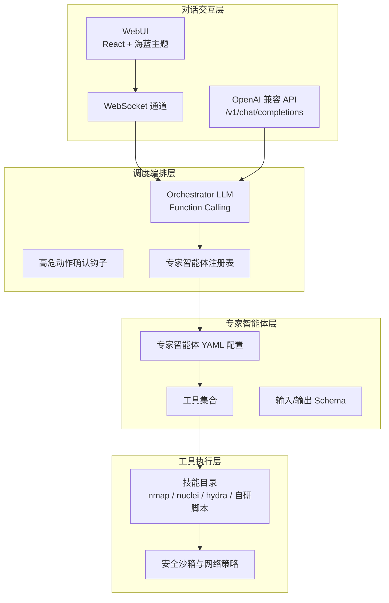
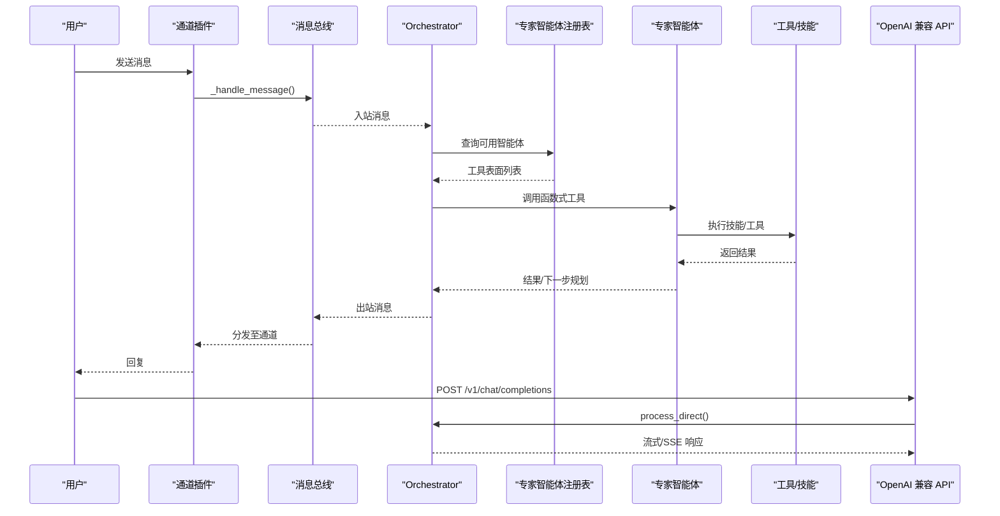
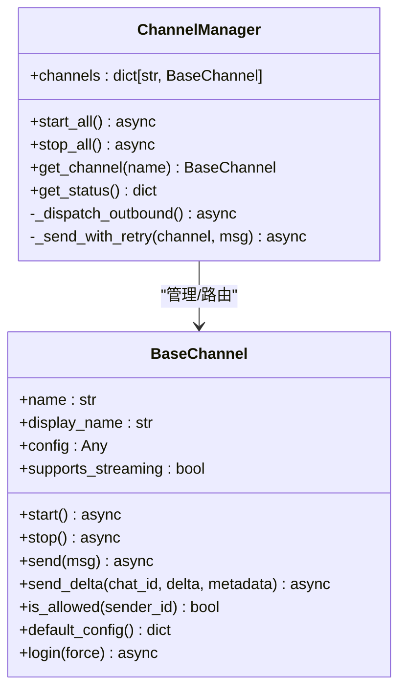
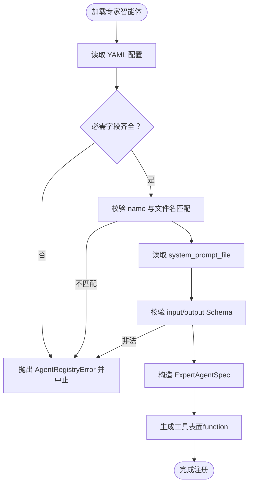
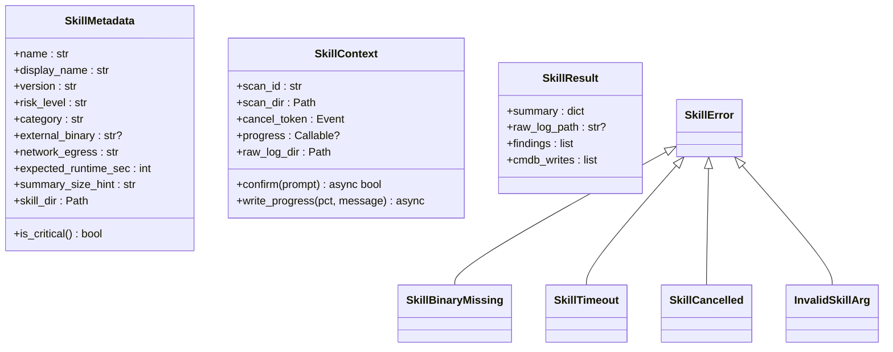
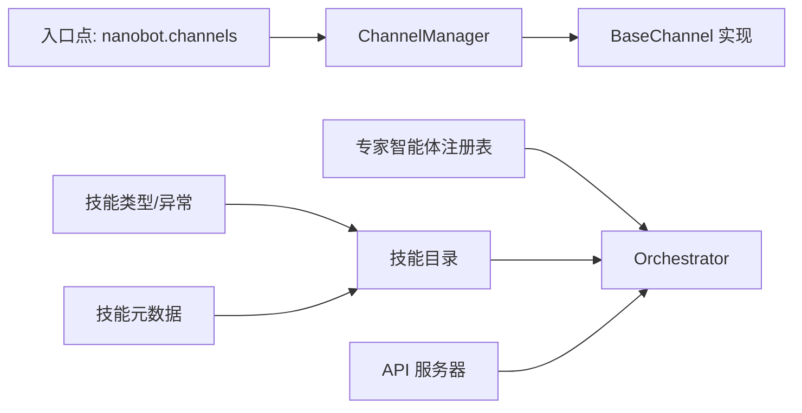

# 扩展开发指南

<cite>
**本文引用的文件**
- [README.md](file://README.md)
- [docs/channel-plugin-guide.md](file://docs/channel-plugin-guide.md)
- [docs/cli-reference.md](file://docs/cli-reference.md)
- [secbot/channels/base.py](file://secbot/channels/base.py)
- [secbot/channels/manager.py](file://secbot/channels/manager.py)
- [secbot/skills/types.py](file://secbot/skills/types.py)
- [secbot/skills/metadata.py](file://secbot/skills/metadata.py)
- [secbot/agents/registry.py](file://secbot/agents/registry.py)
- [secbot/api/server.py](file://secbot/api/server.py)
- [.trellis/spec/backend/agent-registry-contract.md](file://.trellis/spec/backend/agent-registry-contract.md)
- [.trellis/spec/backend/skill-contract.md](file://.trellis/spec/backend/skill-contract.md)
</cite>

## 目录
1. [简介](#简介)
2. [项目结构](#项目结构)
3. [核心组件](#核心组件)
4. [架构总览](#架构总览)
5. [详细组件分析](#详细组件分析)
6. [依赖关系分析](#依赖关系分析)
7. [性能考量](#性能考量)
8. [故障排查指南](#故障排查指南)
9. [结论](#结论)
10. [附录](#附录)

## 简介
本指南面向希望在 secbot 平台上进行扩展开发的工程师，覆盖从需求分析、设计文档到实现与测试部署的全流程。内容包括：
- 插件系统架构与技能注册机制
- 工具扩展点与智能体扩展方式
- 自定义工具开发规范（类继承、参数校验、错误处理）
- 专家智能体开发方法（YAML 配置、提示词设计、工作流编排）
- API 扩展开发（新增 HTTP 端点、WebSocket 事件、CLI 命令）
- 第三方集成指南（外部服务对接与 SDK 集成）
- 扩展测试与部署最佳实践

## 项目结构
secbot 采用“对话交互层—调度编排层—专家智能体层—工具执行层”的四层架构，围绕 nanobot 的轻量 Agent Loop 构建主控 Orchestrator 与可插拔专家智能体池，支持多通道接入与 OpenAI 兼容 API。



图表来源
- [README.md:29-62](file://README.md#L29-L62)

章节来源
- [README.md:29-62](file://README.md#L29-L62)

## 核心组件
- 通道插件体系：通过入口点发现外部通道插件，统一管理启停与消息路由。
- 专家智能体注册表：加载 YAML 配置，校验字段与 Schema，生成工具表面供 LLM 使用。
- 技能元数据与类型：标准化技能异常、上下文与结果结构，保障工具调用一致性。
- API 服务器：提供 OpenAI 兼容接口与健康检查端点，支持 SSE 流式响应。
- CLI 参考：提供启动、状态查询、频道登录等常用命令。

章节来源
- [docs/channel-plugin-guide.md:1-442](file://docs/channel-plugin-guide.md#L1-L442)
- [secbot/agents/registry.py:1-248](file://secbot/agents/registry.py#L1-L248)
- [secbot/skills/types.py:1-87](file://secbot/skills/types.py#L1-L87)
- [secbot/skills/metadata.py:1-147](file://secbot/skills/metadata.py#L1-L147)
- [secbot/api/server.py:1-401](file://secbot/api/server.py#L1-L401)
- [docs/cli-reference.md:1-22](file://docs/cli-reference.md#L1-L22)

## 架构总览
下图展示扩展开发的关键交互路径：通道插件发现与初始化、消息总线分发、专家智能体注册与工具表面生成、技能执行与安全策略、以及 API 与 WebSocket 的扩展入口。



图表来源
- [secbot/channels/manager.py:67-112](file://secbot/channels/manager.py#L67-L112)
- [secbot/agents/registry.py:99-144](file://secbot/agents/registry.py#L99-L144)
- [secbot/api/server.py:194-350](file://secbot/api/server.py#L194-L350)

## 详细组件分析

### 通道插件系统与扩展点
- 发现机制：通过入口点组“nanobot.channels”扫描外部通道插件；内置通道与插件共同参与初始化。
- 生命周期：ChannelManager 统一启动/停止各通道，负责出站消息分发、去重与重试。
- 消息模型：通道通过 _handle_message() 将入站消息封装为 InboundMessage 并发布到总线；出站消息由 ChannelManager 路由到具体通道。
- 配置与权限：通道配置采用 Pydantic 模型，支持 camelCase 别名；允许空列表将拒绝所有访问，需显式配置 allowFrom。
- 流式支持：通道可选择实现 send_delta() 以支持增量文本推送；ChannelManager 会对连续 _stream_delta 进行合并优化。



图表来源
- [secbot/channels/base.py:15-201](file://secbot/channels/base.py#L15-L201)
- [secbot/channels/manager.py:41-428](file://secbot/channels/manager.py#L41-L428)

章节来源
- [docs/channel-plugin-guide.md:1-442](file://docs/channel-plugin-guide.md#L1-L442)
- [secbot/channels/base.py:15-201](file://secbot/channels/base.py#L15-L201)
- [secbot/channels/manager.py:67-112](file://secbot/channels/manager.py#L67-L112)

### 专家智能体注册与工具表面
- 加载与校验：读取 agents 目录下的 YAML 文件，校验必需字段、命名规范、Schema 合法性与 scoped_skills 唯一性。
- 工具表面：将每个专家智能体转换为 LLM 可用的 function 工具定义，包含名称、描述与参数 Schema。
- 失败策略：任一校验失败将导致启动中断，避免部分注册。



图表来源
- [secbot/agents/registry.py:99-248](file://secbot/agents/registry.py#L99-L248)
- [.trellis/spec/backend/agent-registry-contract.md](file://.trellis/spec/backend/agent-registry-contract.md)

章节来源
- [secbot/agents/registry.py:99-248](file://secbot/agents/registry.py#L99-L248)

### 技能注册机制与类型约束
- 元数据加载：解析 SKILL.md 前言块，校验字段类型与枚举值，确保风险等级、网络策略、运行时长与摘要大小提示合法。
- 类型与异常：统一 SkillContext/SkillResult/SkillError 家族，便于在 Agent Loop 中可靠地表示进度、确认与错误。
- 目录扫描：遍历技能根目录，收集有效技能元数据，支持严格模式跳过不合规项。



图表来源
- [secbot/skills/metadata.py:23-147](file://secbot/skills/metadata.py#L23-L147)
- [secbot/skills/types.py:44-87](file://secbot/skills/types.py#L44-L87)

章节来源
- [secbot/skills/metadata.py:56-147](file://secbot/skills/metadata.py#L56-L147)
- [secbot/skills/types.py:19-87](file://secbot/skills/types.py#L19-L87)
- [.trellis/spec/backend/skill-contract.md](file://.trellis/spec/backend/skill-contract.md)

### API 扩展开发（HTTP 端点、WebSocket 事件、CLI 命令）
- OpenAI 兼容 API：提供 /v1/chat/completions 与 /v1/models，支持 JSON 与 multipart/form-data；支持 SSE 流式输出。
- 健康检查：/health 返回服务状态。
- WebSocket 通道：作为 WebUI 与网关通信的基础，通道插件通过入口点注册。
- CLI 命令：提供 onboard、agent、serve、gateway、status、channels login 等常用命令。

```mermaid
sequenceDiagram
participant Client as "客户端"
participant API as "API 服务器"
participant Loop as "AgentLoop"
participant Bus as "消息总线"
Client->>API : POST /v1/chat/completions (JSON 或 multipart)
API->>API : 解析请求体/媒体文件
API->>Loop : process_direct(text, media, session_key, channel, chat_id)
Loop-->>API : 返回响应或流式回调
API-->>Client : JSON 响应或 SSE 流
Note over API,Client : 支持请求超时与空响应回退
```

图表来源
- [secbot/api/server.py:194-350](file://secbot/api/server.py#L194-L350)

章节来源
- [secbot/api/server.py:194-401](file://secbot/api/server.py#L194-L401)
- [docs/cli-reference.md:1-22](file://docs/cli-reference.md#L1-L22)

### 自定义工具开发指南
- 继承与实现：参考现有工具类，实现 run(ctx, params) 方法，返回标准化 SkillResult。
- 参数验证：使用 JSON Schema 校验输入参数，必要时在工具内部做额外正则/范围校验。
- 错误处理：抛出 SkillError 家族异常，确保 Agent Loop 能正确识别并转译为工具错误。
- 进度与确认：通过 ctx.write_progress() 上报进度，通过 ctx.confirm(prompt) 请求人工确认（高危动作）。
- 安全与沙箱：遵循网络策略与命令注入防护，必要时限制外部二进制与网络出口。

章节来源
- [secbot/skills/types.py:44-87](file://secbot/skills/types.py#L44-L87)
- [secbot/skills/metadata.py:56-147](file://secbot/skills/metadata.py#L56-L147)

### 专家智能体开发方法
- YAML 配置：定义 name/display_name/description/system_prompt_file/scoped_skills/input_schema/output_schema 等字段，确保命名规范与文件存在。
- 提示词设计：system_prompt_file 指向模板文件，结合模板片段与上下文生成系统提示。
- 工作流编排：通过 scoped_skills 将多个技能组合为端到端工作流；Orchestrator 基于工具表面进行动态规划与调用。

章节来源
- [secbot/agents/registry.py:99-248](file://secbot/agents/registry.py#L99-L248)
- [.trellis/spec/backend/agent-registry-contract.md](file://.trellis/spec/backend/agent-registry-contract.md)

### 第三方集成指南
- 外部服务对接：通过通道插件实现，遵循 BaseChannel 接口；在配置中启用相应通道并设置 allowFrom 白名单。
- SDK 集成：OpenAI 兼容 API 可直接对接第三方平台；WebSocket 通道用于 WebUI 实时交互。
- 配置与密钥：在配置文件中设置 providers 与 channels，确保密钥与端点正确。

章节来源
- [docs/channel-plugin-guide.md:1-442](file://docs/channel-plugin-guide.md#L1-L442)
- [README.md:113-179](file://README.md#L113-L179)

## 依赖关系分析
- 通道插件依赖入口点组“nanobot.channels”，由 ChannelManager 发现并实例化。
- 专家智能体依赖技能注册表提供的技能名称集合，确保 scoped_skills 唯一且存在。
- API 服务器依赖 AgentLoop 的 process_direct 能力，实现单一会话的持久化交互。
- 技能元数据与类型为工具执行提供一致的契约，降低耦合度。



图表来源
- [secbot/channels/manager.py:67-112](file://secbot/channels/manager.py#L67-L112)
- [secbot/agents/registry.py:99-144](file://secbot/agents/registry.py#L99-L144)
- [secbot/api/server.py:381-401](file://secbot/api/server.py#L381-L401)
- [secbot/skills/types.py:44-87](file://secbot/skills/types.py#L44-L87)
- [secbot/skills/metadata.py:117-147](file://secbot/skills/metadata.py#L117-L147)

章节来源
- [secbot/channels/manager.py:67-112](file://secbot/channels/manager.py#L67-L112)
- [secbot/agents/registry.py:99-144](file://secbot/agents/registry.py#L99-L144)
- [secbot/api/server.py:381-401](file://secbot/api/server.py#L381-L401)

## 性能考量
- 消息去重与合并：ChannelManager 对连续 _stream_delta 进行合并，减少 API 调用频率，改善延迟。
- 重试策略：发送失败采用指数退避重试，提升稳定性。
- 超时控制：API 请求支持 per-request 超时，避免长时间占用资源。
- 进度上报：工具侧通过 ctx.write_progress() 提升可观测性，便于前端反馈。

章节来源
- [secbot/channels/manager.py:263-409](file://secbot/channels/manager.py#L263-L409)
- [secbot/api/server.py:341-349](file://secbot/api/server.py#L341-L349)

## 故障排查指南
- 通道未启用或配置错误
  - 现象：无消息接收或无法启动。
  - 排查：确认 channels.<name>.enabled=true；allowFrom 不为空列表；Pydantic 配置模型字段拼写（camelCase/under_score）。
- API 端口冲突或模型不匹配
  - 现象：/v1/chat/completions 返回错误或无法启动。
  - 排查：检查端口占用；确认请求中的 model 与服务配置一致；关注超时与空响应回退逻辑。
- 专家智能体加载失败
  - 现象：启动时报 AgentRegistryError。
  - 排查：检查 YAML 字段完整性、命名规范、system_prompt_file 路径、Schema 合法性与 scoped_skills 唯一性。
- 技能执行异常
  - 现象：工具调用失败或超时。
  - 排查：捕获 SkillError 家族异常；核对外部二进制是否存在、网络策略与命令注入防护；必要时增加 confirm() 人工确认。

章节来源
- [docs/channel-plugin-guide.md:353-412](file://docs/channel-plugin-guide.md#L353-L412)
- [secbot/api/server.py:194-350](file://secbot/api/server.py#L194-L350)
- [secbot/agents/registry.py:138-144](file://secbot/agents/registry.py#L138-L144)
- [secbot/skills/types.py:19-37](file://secbot/skills/types.py#L19-L37)

## 结论
通过通道插件、专家智能体注册表、技能元数据与类型、API 服务器与 CLI 的协同，secbot 提供了清晰的扩展边界与一致的契约。遵循本文档的开发流程与最佳实践，可在保证安全性与可维护性的前提下，快速实现新功能与第三方集成。

## 附录
- 快速开始与安装：参考项目根 README 的安装与启动步骤。
- CLI 参考：列出常用命令及其用途。
- 通道插件指南：从子类化、打包、安装到配置与测试的完整流程。

章节来源
- [README.md:76-179](file://README.md#L76-L179)
- [docs/cli-reference.md:1-22](file://docs/cli-reference.md#L1-L22)
- [docs/channel-plugin-guide.md:16-190](file://docs/channel-plugin-guide.md#L16-L190)