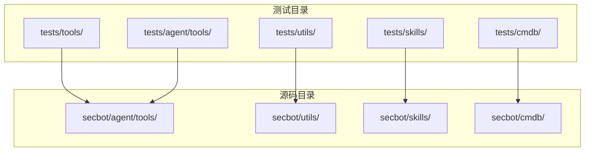
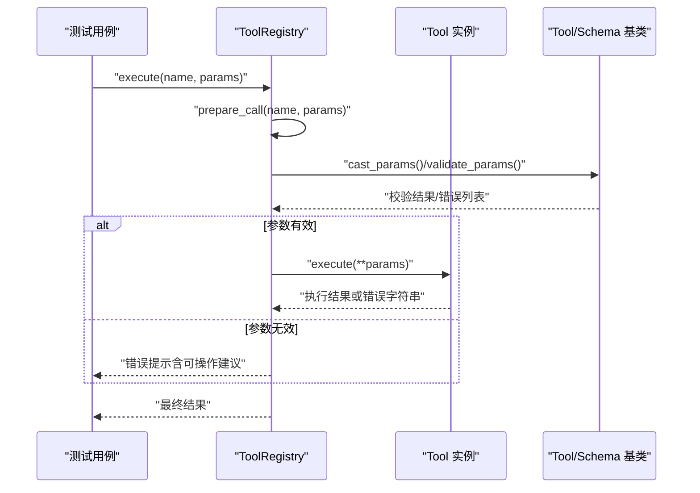
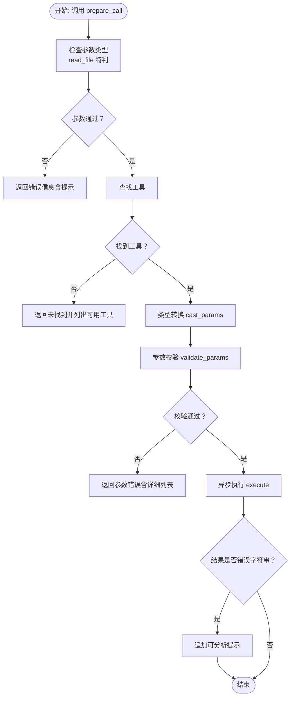
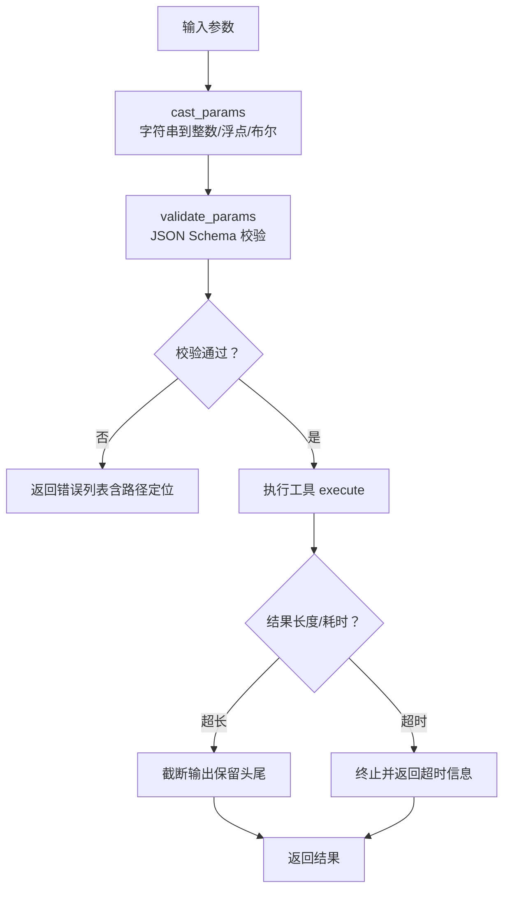
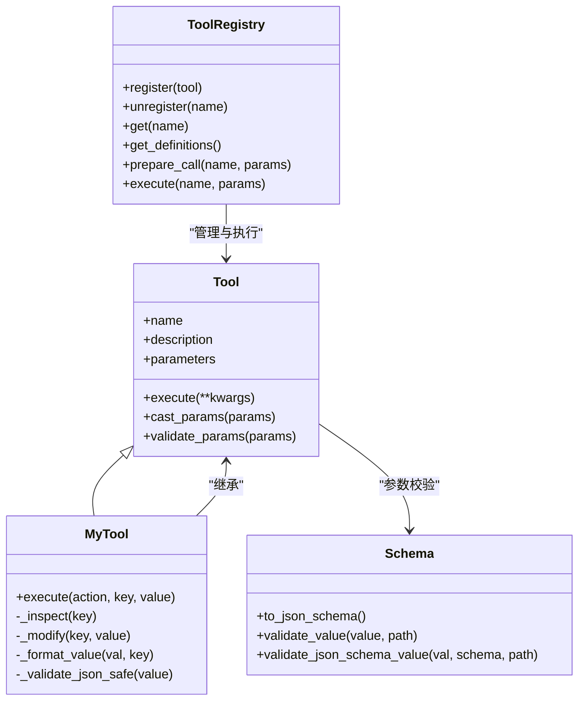
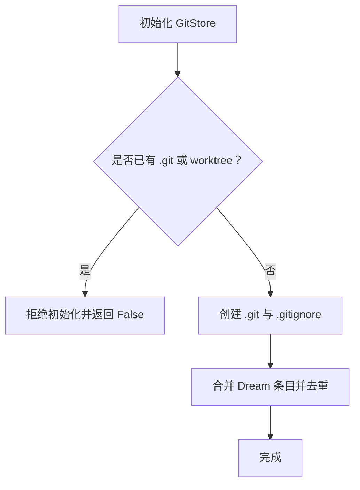
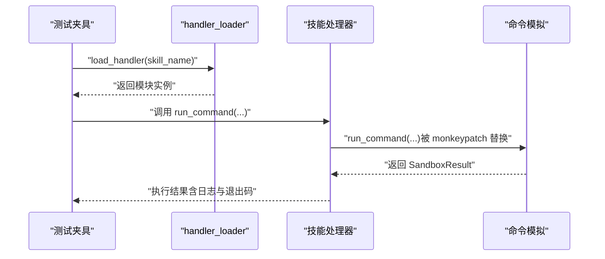
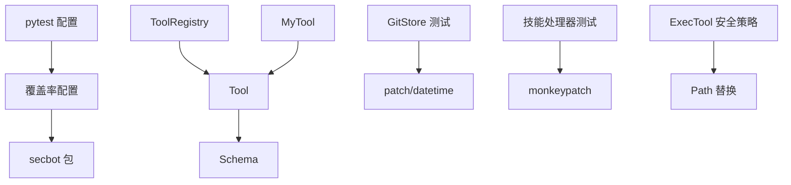

# 单元测试实践

<cite>
**本文引用的文件**
- [pyproject.toml](file://pyproject.toml)
- [secbot/agent/tools/base.py](file://secbot/agent/tools/base.py)
- [secbot/agent/tools/registry.py](file://secbot/agent/tools/registry.py)
- [secbot/agent/tools/self.py](file://secbot/agent/tools/self.py)
- [tests/tools/test_tool_registry.py](file://tests/tools/test_tool_registry.py)
- [tests/tools/test_tool_validation.py](file://tests/tools/test_tool_validation.py)
- [tests/agent/tools/test_self_tool.py](file://tests/agent/tools/test_self_tool.py)
- [tests/utils/test_gitstore.py](file://tests/utils/test_gitstore.py)
- [tests/skills/conftest.py](file://tests/skills/conftest.py)
- [tests/cmdb/conftest.py](file://tests/cmdb/conftest.py)
</cite>

## 目录
1. [引言](#引言)
2. [项目结构](#项目结构)
3. [核心组件](#核心组件)
4. [架构总览](#架构总览)
5. [详细组件分析](#详细组件分析)
6. [依赖分析](#依赖分析)
7. [性能考虑](#性能考虑)
8. [故障排查指南](#故障排查指南)
9. [结论](#结论)
10. [附录](#附录)

## 引言
本文件面向 VAPT3/secbot 的开发者与测试工程师，系统化总结 Python 单元测试的编写实践，覆盖以下主题：
- 测试用例组织与命名规范
- 断言使用与异常测试策略
- mock 与 patch 的实战技巧（外部依赖、API 调用、文件系统）
- 工具类与辅助函数的测试策略（边界条件、错误处理）
- 技能处理器与工具注册器的测试示例
- 测试覆盖率统计与报告生成

目标是帮助团队在不牺牲可维护性的情况下，快速构建高质量、可扩展的测试体系。

## 项目结构
本项目采用“按功能域分层 + 按模块分包”的组织方式，测试代码位于 tests 目录下，与源码 secbot 对应的功能域一一映射。关键测试目录与文件如下：
- 工具与工具注册：tests/tools/test_tool_registry.py、tests/tools/test_tool_validation.py
- 自检工具 MyTool：tests/agent/tools/test_self_tool.py
- 工具类与辅助函数：tests/utils/test_gitstore.py
- 技能处理器与上下文：tests/skills/conftest.py
- 数据库与会话：tests/cmdb/conftest.py
- 项目配置与测试运行：pyproject.toml

**图表来源**
- [pyproject.toml:153-156](file://pyproject.toml#L153-L156)

**章节来源**
- [pyproject.toml:153-156](file://pyproject.toml#L153-L156)

## 核心组件
本节聚焦与测试密切相关的三个核心模块：工具基类与参数校验、工具注册器、自检工具 MyTool。

- 工具基类与参数校验
  - 提供 Schema 与 Tool 抽象，支持 JSON Schema 驱动的参数校验、类型转换与 OpenAI 函数 schema 导出。
  - 关键能力：参数类型与范围校验、枚举校验、嵌套对象/数组校验、可空类型解析、字符串到数值/布尔的智能转换等。
- 工具注册器
  - 动态注册/注销工具，缓存工具定义，执行前进行参数类型转换与校验，并对异常进行统一包装返回。
  - 关键能力：稳定排序（内置工具优先、MCP 工具后置）、准备调用阶段的错误提示、执行阶段异常兜底。
- 自检工具 MyTool
  - 支持“检查”和“设置”两类动作；严格的安全白名单/黑名单与敏感字段过滤；丰富的格式化输出；运行时变量存储限制。

**章节来源**
- [secbot/agent/tools/base.py:21-280](file://secbot/agent/tools/base.py#L21-L280)
- [secbot/agent/tools/registry.py:8-126](file://secbot/agent/tools/registry.py#L8-L126)
- [secbot/agent/tools/self.py:30-452](file://secbot/agent/tools/self.py#L30-L452)

## 架构总览
从测试视角看，系统的关键交互链路如下：
- 工具注册器接收名称与参数，解析并验证参数，随后异步调用具体工具的 execute 方法。
- 工具基类负责参数校验与类型转换，确保输入符合 JSON Schema 约束。
- MyTool 在 AgentLoop 上执行检查与设置，涉及安全边界判定、敏感字段过滤与格式化输出。

**图表来源**
- [secbot/agent/tools/registry.py:73-114](file://secbot/agent/tools/registry.py#L73-L114)
- [secbot/agent/tools/base.py:180-233](file://secbot/agent/tools/base.py#L180-L233)

## 详细组件分析

### 工具注册器测试（技能处理器与工具注册）
本节以 ToolRegistry 为核心，展示如何测试工具注册、参数准备与执行流程，以及缓存失效与错误提示。

- 测试要点
  - 注册顺序与排序：内置工具优先、MCP 工具后置，且排序稳定。
  - 参数准备：针对特定工具（如 read_file）拒绝非对象参数并给出可操作提示；其他工具走通用对象校验。
  - 缓存机制：注册/注销会失效缓存，后续获取定义应返回新实例。
  - 执行兜底：工具抛出异常或返回错误字符串时，统一追加可分析提示。

**图表来源**
- [secbot/agent/tools/registry.py:73-114](file://secbot/agent/tools/registry.py#L73-L114)

**章节来源**
- [tests/tools/test_tool_registry.py:37-104](file://tests/tools/test_tool_registry.py#L37-L104)
- [secbot/agent/tools/registry.py:48-126](file://secbot/agent/tools/registry.py#L48-L126)

### 工具参数校验与类型转换测试（技能处理器）
本节以工具参数校验为主题，覆盖 JSON Schema 各类约束、类型转换与执行安全策略。

- 测试要点
  - Schema 类与 Tool.validate_params 的一致性：对象、整数、字符串、枚举、嵌套对象与数组的校验。
  - 类装饰器注入参数 Schema：确保每次访问返回深拷贝，避免共享状态导致的副作用。
  - 可空类型解析：联合类型中去除 null，保留真实类型。
  - 安全边界：ExecTool 的路径提取与工作区保护、设备文件放行规则、Windows 绝对路径处理。
  - 输出截断与超时控制：长输出保留首尾、超时参数覆盖默认值并上限控制。

**图表来源**
- [secbot/agent/tools/base.py:180-233](file://secbot/agent/tools/base.py#L180-L233)
- [tests/tools/test_tool_validation.py:142-151](file://tests/tools/test_tool_validation.py#L142-L151)

**章节来源**
- [tests/tools/test_tool_validation.py:76-151](file://tests/tools/test_tool_validation.py#L76-L151)
- [tests/tools/test_tool_validation.py:201-338](file://tests/tools/test_tool_validation.py#L201-L338)
- [tests/tools/test_tool_validation.py:580-628](file://tests/tools/test_tool_validation.py#L580-L628)
- [secbot/agent/tools/base.py:21-115](file://secbot/agent/tools/base.py#L21-L115)

### 自检工具 MyTool 测试（运行时状态检查与设置）
MyTool 是 AgentLoop 的自检与配置工具，测试覆盖检查、设置、敏感字段过滤、运行时变量限制与格式化输出。

- 测试要点
  - 检查动作：无键全览、单键直取、点路径导航；对受限属性与敏感字段直接阻断；对运行时变量提供别名支持。
  - 设置动作：受限字段（整数范围/最小长度）、自由字段（类型匹配、深度限制、键数量限制）、只读/受保护字段拒绝替换。
  - 敏感字段过滤：对包含敏感关键词的字段进行脱敏显示；对对象模型进行字段级过滤。
  - 运行时变量限制：达到最大键数时拒绝新增，但允许更新已存在键。
  - 格式化输出：对子代理状态、工具事件、令牌用量等进行富文本格式化。

**图表来源**
- [secbot/agent/tools/base.py:117-280](file://secbot/agent/tools/base.py#L117-L280)
- [secbot/agent/tools/registry.py:8-126](file://secbot/agent/tools/registry.py#L8-L126)
- [secbot/agent/tools/self.py:30-452](file://secbot/agent/tools/self.py#L30-L452)

**章节来源**
- [tests/agent/tools/test_self_tool.py:72-543](file://tests/agent/tools/test_self_tool.py#L72-L543)
- [tests/agent/tools/test_self_tool.py:545-800](file://tests/agent/tools/test_self_tool.py#L545-L800)
- [secbot/agent/tools/self.py:167-344](file://secbot/agent/tools/self.py#L167-L344)

### 工具类与辅助函数测试（文件系统与 Git 操作）
GitStore 的测试展示了如何在不破坏真实环境的前提下，对文件系统与 Git 操作进行稳健测试。

- 测试要点
  - 未初始化仓库：line_ages 返回空列表。
  - 缺失文件与空文件：line_ages 返回空列表。
  - 时间偏移：通过 patch 替换时间函数，验证年龄计算正确。
  - 嵌套仓库保护：检测现有 .git 或 worktree，拒绝在其中初始化。
  - .gitignore 合并与去重：保留既有条目并追加 Dream 内容，避免重复。

**图表来源**
- [tests/utils/test_gitstore.py:95-217](file://tests/utils/test_gitstore.py#L95-L217)

**章节来源**
- [tests/utils/test_gitstore.py:21-94](file://tests/utils/test_gitstore.py#L21-L94)
- [tests/utils/test_gitstore.py:95-217](file://tests/utils/test_gitstore.py#L95-L217)

### 技能处理器测试（动态加载与命令模拟）
技能处理器测试通过自定义加载器与命令模拟，实现对技能执行逻辑的端到端验证。

- 测试要点
  - handler 加载：按技能目录动态导入 handler.py，避免重复加载。
  - 上下文构造：基于临时目录构建扫描上下文，隔离 IO。
  - 命令模拟：通过 monkeypatch 注入假实现，记录日志并返回标准化结果，便于断言。

**图表来源**
- [tests/skills/conftest.py:20-87](file://tests/skills/conftest.py#L20-L87)

**章节来源**
- [tests/skills/conftest.py:20-87](file://tests/skills/conftest.py#L20-L87)

### 数据库与会话测试（隔离引擎与事务）
CMDB 测试夹具演示了如何在每个测试中创建独立的 SQLite 引擎与会话，保证多连接共享状态的一致性。

- 测试要点
  - 每个测试结束后释放引擎，避免连接泄漏。
  - 使用 tmp_path 作为数据库文件位置，避免内存数据库导致的连接隔离问题。
  - 初始化所有表结构，确保测试数据一致性。

**章节来源**
- [tests/cmdb/conftest.py:23-37](file://tests/cmdb/conftest.py#L23-L37)

## 依赖分析
- 测试运行配置
  - pytest 配置：自动发现 tests 目录，支持 asyncio 模式。
  - 覆盖率配置：仅统计 secbot 包内代码，排除 tests 目录与注释行。
- 工具与注册器
  - ToolRegistry 依赖 Tool 抽象与 Schema 校验；MyTool 继承 Tool 并扩展安全与格式化能力。
- 外部依赖与模拟
  - GitStore 通过 patch 替换时间函数；技能处理器通过 monkeypatch 注入命令执行实现；ExecTool 通过 Path 替换与环境变量模拟特殊路径。

**图表来源**
- [pyproject.toml:153-169](file://pyproject.toml#L153-L169)
- [secbot/agent/tools/registry.py:8-126](file://secbot/agent/tools/registry.py#L8-L126)
- [secbot/agent/tools/base.py:117-280](file://secbot/agent/tools/base.py#L117-L280)
- [tests/utils/test_gitstore.py:58-61](file://tests/utils/test_gitstore.py#L58-L61)
- [tests/skills/conftest.py:61-84](file://tests/skills/conftest.py#L61-L84)
- [tests/tools/test_tool_validation.py:275-316](file://tests/tools/test_tool_validation.py#L275-L316)

**章节来源**
- [pyproject.toml:153-169](file://pyproject.toml#L153-L169)

## 性能考虑
- 测试并发与隔离
  - 使用 tmp_path 为每个测试提供独立工作空间，避免 IO 竞态。
  - 在数据库测试中，每测一库，减少锁竞争与连接复用带来的副作用。
- 覆盖率与性能平衡
  - 通过覆盖率排除规则（如注释行、主入口）降低统计噪音，聚焦业务逻辑。
  - 将昂贵的外部调用（网络、文件系统）通过 mock/patch 替换，缩短测试时长。
- 执行策略
  - 对长输出与超时场景进行截断与上限控制，避免测试卡顿。

## 故障排查指南
- 常见问题与定位
  - 参数校验失败：检查 JSON Schema 中的类型、范围、枚举与必填项；确认 cast_params 是否正确转换。
  - 工具未找到：确认 ToolRegistry 中是否已注册，名称拼写是否一致。
  - 执行异常：查看注册器返回的错误字符串是否包含可分析提示；必要时捕获异常并记录上下文。
  - 文件系统相关失败：确认是否处于嵌套仓库或受限路径；检查 .gitignore 合并与去重逻辑。
- 排障步骤
  - 逐步缩小范围：先断言 prepare_call 的返回值，再断言 execute 的结果。
  - 使用最小可复现样例：构造最简参数与上下文，排除无关干扰。
  - 记录关键中间状态：如运行时变量、工具事件、令牌用量等。

**章节来源**
- [tests/tools/test_tool_registry.py:52-74](file://tests/tools/test_tool_registry.py#L52-L74)
- [tests/utils/test_gitstore.py:98-112](file://tests/utils/test_gitstore.py#L98-L112)
- [tests/agent/tools/test_self_tool.py:576-595](file://tests/agent/tools/test_self_tool.py#L576-L595)

## 结论
通过以上实践，可以建立一套覆盖工具参数校验、工具注册与执行、运行时状态检查与设置、文件系统与 Git 操作、技能处理器与上下文的完整测试体系。建议在日常开发中坚持：
- 先断言后实现，围绕边界条件与错误路径设计用例
- 广泛使用 mock/patch 与夹具，提升测试稳定性与可维护性
- 保持覆盖率与质量门禁，持续优化测试矩阵

## 附录

### 测试用例组织与命名规范
- 目录与文件命名：与源码功能域一一对应，如 tests/tools/test_tool_registry.py。
- 类命名：以 TestXxx 前缀区分不同场景，如 TestInspectSummary、TestModifyRestricted。
- 方法命名：清晰表达意图，如 test_prepare_call_read_file_rejects_non_object_params_with_actionable_hint。

### 断言使用与异常测试
- 断言类型：使用 pytest 内置断言，结合字符串包含与集合成员判断。
- 异常测试：通过 monkeypatch 注入异常，验证错误路径与兜底提示。

### mock 与 patch 的使用技巧
- 外部依赖：使用 monkeypatch.setattr 替换模块函数或类方法。
- API 调用：对第三方 SDK 进行轻量替身，返回预设响应。
- 文件系统：通过 patch 替换时间函数或路径解析，避免真实磁盘与 Git 状态影响。

### 工具类与辅助函数的测试策略
- 边界条件：空输入、极值、越界、空集合、None 值。
- 错误处理：异常抛出、错误字符串返回、日志审计。
- 格式化输出：对复杂对象进行结构化断言，关注关键字段与格式。

### 技能处理器测试示例
- 动态加载：使用 importlib.util.spec_from_file_location 导入 handler.py。
- 命令模拟：注入 run_command，写入日志并返回标准化结果。
- 上下文构造：基于临时目录构建扫描上下文，隔离 IO。

### 测试覆盖率统计与报告生成
- 配置项
  - 源码目录：仅统计 secbot 包内代码
  - 排除规则：注释行、主入口、类型检查分支
- 运行方式：pytest --cov=secbot --cov-report=term-missing
- 报告解读：关注未覆盖路径与热点路径，补充关键分支用例

**章节来源**
- [pyproject.toml:157-169](file://pyproject.toml#L157-L169)