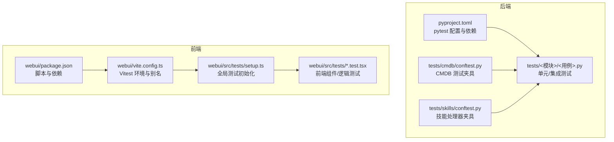
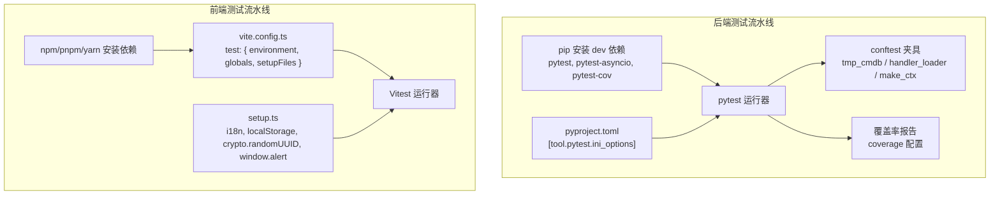
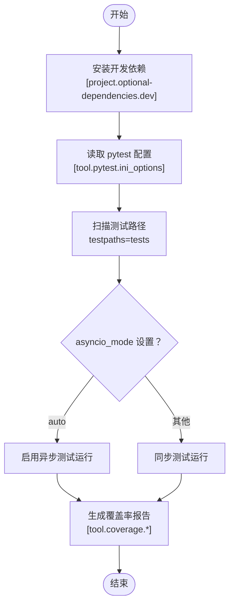
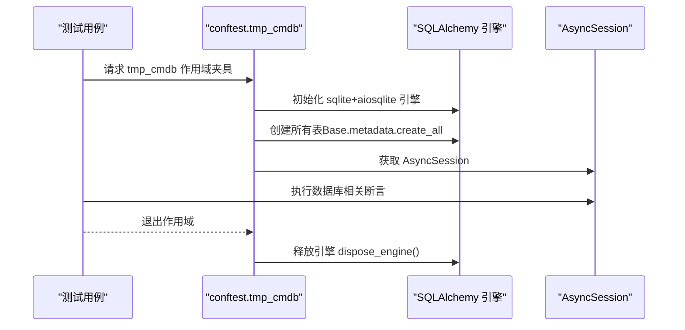
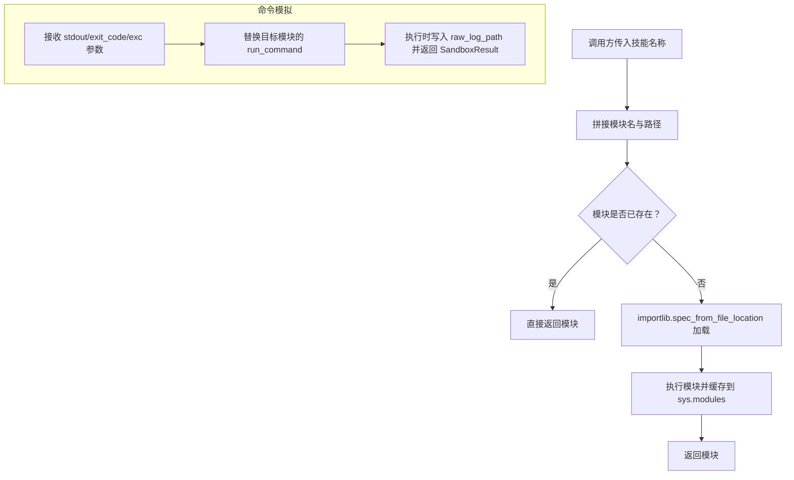
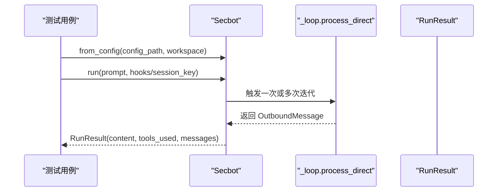
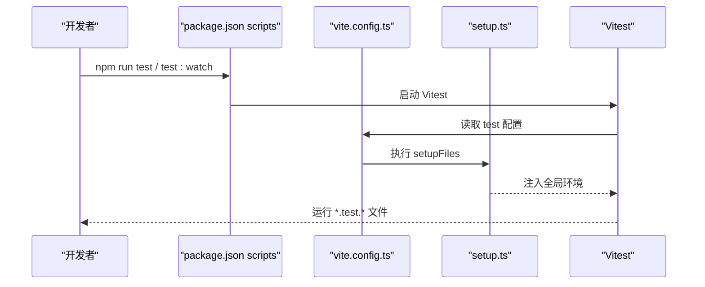
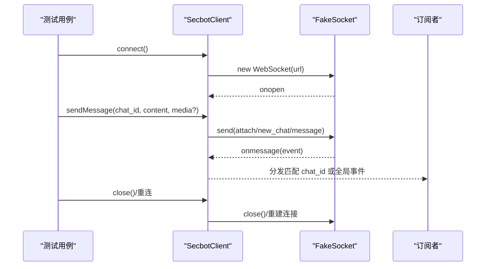
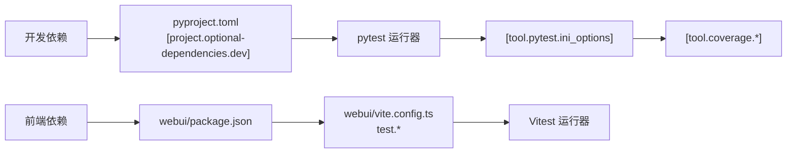

# 测试框架搭建

<cite>
**本文引用的文件**
- [pyproject.toml](file://pyproject.toml)
- [tests/cmdb/conftest.py](file://tests/cmdb/conftest.py)
- [tests/skills/conftest.py](file://tests/skills/conftest.py)
- [tests/test_secbot_facade.py](file://tests/test_secbot_facade.py)
- [tests/test_package_version.py](file://tests/test_package_version.py)
- [webui/package.json](file://webui/package.json)
- [webui/vite.config.ts](file://webui/vite.config.ts)
- [webui/src/tests/setup.ts](file://webui/src/tests/setup.ts)
- [webui/src/tests/api.test.ts](file://webui/src/tests/api.test.ts)
- [webui/src/tests/secbot-client.test.ts](file://webui/src/tests/secbot-client.test.ts)
</cite>

## 目录
1. [简介](#简介)
2. [项目结构](#项目结构)
3. [核心组件](#核心组件)
4. [架构总览](#架构总览)
5. [详细组件分析](#详细组件分析)
6. [依赖关系分析](#依赖关系分析)
7. [性能考虑](#性能考虑)
8. [故障排查指南](#故障排查指南)
9. [结论](#结论)
10. [附录](#附录)

## 简介
本文件面向 VAPT3/secbot 项目的测试框架搭建，系统性说明后端与前端测试体系的配置与最佳实践，涵盖：
- 后端 pytest 测试框架的安装、依赖管理、插件配置与测试发现机制
- 测试配置文件（pyproject.toml 中的 pytest 配置）结构与参数说明
- 前端 Vitest + React Testing Library 的配置与使用
- 测试环境隔离与虚拟环境管理建议
- 测试数据准备与测试资源管理方法

## 项目结构
本项目采用“根仓库 + 前端子目录”的双层结构：
- 后端：Python 包与测试位于仓库根目录，测试代码按功能模块组织在 tests/ 下
- 前端：WebUI 位于 webui/，使用 Vite + Vitest 进行开发与测试

图表来源
- [pyproject.toml:153-169](file://pyproject.toml#L153-L169)
- [webui/package.json:1-67](file://webui/package.json#L1-L67)
- [webui/vite.config.ts:59-65](file://webui/vite.config.ts#L59-L65)
- [webui/src/tests/setup.ts:1-83](file://webui/src/tests/setup.ts#L1-L83)

章节来源
- [pyproject.toml:153-169](file://pyproject.toml#L153-L169)
- [webui/package.json:1-67](file://webui/package.json#L1-L67)
- [webui/vite.config.ts:59-65](file://webui/vite.config.ts#L59-L65)
- [webui/src/tests/setup.ts:1-83](file://webui/src/tests/setup.ts#L1-L83)

## 核心组件
- 后端测试框架
  - 使用 pytest 作为测试运行器，支持 asyncio 异步测试
  - 通过 pyproject.toml 的 [tool.pytest.ini_options] 统一配置测试路径与异步模式
  - 通过 conftest.py 提供跨模块共享的夹具（fixtures），如 CMDB 临时数据库、技能处理器加载等
- 前端测试框架
  - 使用 Vitest 作为测试运行器，happy-dom 作为 DOM 环境
  - 通过 vite.config.ts 的 test 字段配置环境、全局变量与 setupFiles
  - 通过 src/tests/setup.ts 注入国际化、本地存储与浏览器兼容性补丁

章节来源
- [pyproject.toml:153-169](file://pyproject.toml#L153-L169)
- [tests/cmdb/conftest.py:1-37](file://tests/cmdb/conftest.py#L1-L37)
- [tests/skills/conftest.py:1-87](file://tests/skills/conftest.py#L1-L87)
- [webui/package.json:1-67](file://webui/package.json#L1-L67)
- [webui/vite.config.ts:59-65](file://webui/vite.config.ts#L59-L65)
- [webui/src/tests/setup.ts:1-83](file://webui/src/tests/setup.ts#L1-L83)

## 架构总览
后端与前端测试分别独立运行，互不干扰；两者均强调“可重复、可隔离、可维护”的测试设计。

图表来源
- [pyproject.toml:103-110](file://pyproject.toml#L103-L110)
- [pyproject.toml:153-169](file://pyproject.toml#L153-L169)
- [webui/package.json:6, 46-65:6-13](file://webui/package.json#L6-L13)
- [webui/vite.config.ts:59-65](file://webui/vite.config.ts#L59-L65)
- [webui/src/tests/setup.ts:1-83](file://webui/src/tests/setup.ts#L1-L83)

## 详细组件分析

### 后端：pytest 配置与测试发现
- 安装与依赖
  - 开发依赖集中在 [project.optional-dependencies.dev]，包含 pytest、pytest-asyncio、pytest-cov 等
- 测试发现与运行
  - 通过 [tool.pytest.ini_options] 指定 testpaths 与 asyncio_mode，确保自动识别 tests/ 并正确处理异步测试
- 覆盖率
  - 通过 [tool.coverage.run] 与 [tool.coverage.report] 控制覆盖率源码范围与排除规则

图表来源
- [pyproject.toml:103-110](file://pyproject.toml#L103-L110)
- [pyproject.toml:153-169](file://pyproject.toml#L153-L169)

章节来源
- [pyproject.toml:103-110](file://pyproject.toml#L103-L110)
- [pyproject.toml:153-169](file://pyproject.toml#L153-L169)

### 后端：CMDB 测试夹具（隔离数据库）
- 设计目标
  - 每个测试使用独立的 SQLite 文件，避免内存数据库导致的连接隔离问题
- 关键点
  - 使用 tmp_path 生成临时路径，初始化引擎并创建所有表
  - 在会话生命周期内提供 AsyncSession，结束后释放引擎

图表来源
- [tests/cmdb/conftest.py:23-37](file://tests/cmdb/conftest.py#L23-L37)

章节来源
- [tests/cmdb/conftest.py:1-37](file://tests/cmdb/conftest.py#L1-L37)

### 后端：技能处理器测试夹具（动态加载与命令模拟）
- 设计目标
  - 动态加载技能 handler.py，便于对不同技能进行单元测试
  - 提供 fake_run_command，将 stdout 写入 raw_log_path 并返回标准化结果
- 关键点
  - handler_loader 固定模块命名规则，避免重复导入
  - make_ctx 生成带唯一 scan_id 与临时目录的上下文对象
  - fake_run_command 支持异常注入与退出码控制

图表来源
- [tests/skills/conftest.py:20-31](file://tests/skills/conftest.py#L20-L31)
- [tests/skills/conftest.py:54-87](file://tests/skills/conftest.py#L54-L87)

章节来源
- [tests/skills/conftest.py:1-87](file://tests/skills/conftest.py#L1-L87)

### 后端：SDK 外观测试（SecbotFacade）
- 覆盖场景
  - 配置文件加载、工作空间覆盖、运行结果封装、钩子注入与恢复、工具调用与消息收集等
- 关键断言
  - 从配置创建实例、异步运行返回 RunResult、错误时钩子状态恢复、工具使用列表与最终消息序列

图表来源
- [tests/test_secbot_facade.py:31-68](file://tests/test_secbot_facade.py#L31-L68)
- [tests/test_secbot_facade.py:176-208](file://tests/test_secbot_facade.py#L176-L208)

章节来源
- [tests/test_secbot_facade.py:1-302](file://tests/test_secbot_facade.py#L1-L302)

### 后端：版本一致性测试
- 目标
  - 验证源码检出场景下，__version__ 与 pyproject.toml 中的 version 一致
- 方法
  - 通过 subprocess 在隔离环境中导入 secbot 并打印 __version__
  - 对比 pyproject.toml 中的 version 字段

章节来源
- [tests/test_package_version.py:1-42](file://tests/test_package_version.py#L1-L42)

### 前端：Vitest 配置与使用
- 依赖与脚本
  - package.json 提供 test 与 test:watch 脚本，依赖 vitest、@testing-library/react、happy-dom 等
- Vite 配置
  - test.environment 指向 happy-dom，globals 启用全局测试 API，setupFiles 指向 src/tests/setup.ts
- 全局初始化
  - setup.ts 注入 i18n、localStorage、crypto.randomUUID、window.alert 等，保证组件测试稳定

图表来源
- [webui/package.json:6, 46-65:6-13](file://webui/package.json#L6-L13)
- [webui/vite.config.ts:59-65](file://webui/vite.config.ts#L59-L65)
- [webui/src/tests/setup.ts:1-83](file://webui/src/tests/setup.ts#L1-L83)

章节来源
- [webui/package.json:1-67](file://webui/package.json#L1-L67)
- [webui/vite.config.ts:59-65](file://webui/vite.config.ts#L59-L65)
- [webui/src/tests/setup.ts:1-83](file://webui/src/tests/setup.ts#L1-L83)

### 前端：API 辅助函数测试
- 覆盖要点
  - URL 编码、授权头、响应映射（会话标题、斜杠命令元数据）
- 断言策略
  - 使用 vi.fn() 模拟 fetch，断言请求 URL 与查询字符串编码

章节来源
- [webui/src/tests/api.test.ts:1-115](file://webui/src/tests/api.test.ts#L1-L115)

### 前端：WebSocket 客户端测试（SecbotClient）
- 覆盖要点
  - 事件路由、新聊天 ID 解析、连接队列与重连、媒体附件、活动事件广播、错误处理与状态机
- 测试技巧
  - 自定义 FakeSocket，记录 sent、onopen/onmessage/onclose 生命周期
  - 使用 vi.useFakeTimers/vi.advanceTimersByTimeAsync 控制重连退避

图表来源
- [webui/src/tests/secbot-client.test.ts:10-54](file://webui/src/tests/secbot-client.test.ts#L10-L54)
- [webui/src/tests/secbot-client.test.ts:106-121](file://webui/src/tests/secbot-client.test.ts#L106-L121)
- [webui/src/tests/secbot-client.test.ts:222-235](file://webui/src/tests/secbot-client.test.ts#L222-L235)

章节来源
- [webui/src/tests/secbot-client.test.ts:1-363](file://webui/src/tests/secbot-client.test.ts#L1-L363)

## 依赖关系分析
- 后端
  - pytest 与 pytest-asyncio 由 [project.optional-dependencies.dev] 提供
  - pytest 配置来自 [tool.pytest.ini_options]，覆盖率来自 [tool.coverage.*]
- 前端
  - Vitest、Testing Library、happy-dom 由 package.json 提供
  - Vite 将 test 配置与 setupFiles 注入 Vitest

图表来源
- [pyproject.toml:103-110](file://pyproject.toml#L103-L110)
- [pyproject.toml:153-169](file://pyproject.toml#L153-L169)
- [webui/package.json:46-65](file://webui/package.json#L46-L65)
- [webui/vite.config.ts:59-65](file://webui/vite.config.ts#L59-L65)

章节来源
- [pyproject.toml:103-110](file://pyproject.toml#L103-L110)
- [pyproject.toml:153-169](file://pyproject.toml#L153-L169)
- [webui/package.json:46-65](file://webui/package.json#L46-L65)
- [webui/vite.config.ts:59-65](file://webui/vite.config.ts#L59-L65)

## 性能考虑
- 后端
  - 使用 tmp_cmdb 为每个测试提供独立数据库文件，避免内存数据库导致的连接隔离问题，提升并发稳定性
  - 利用 pytest-asyncio 的 auto 模式减少异步样板代码
- 前端
  - happy-dom 作为轻量 DOM 环境，避免启动真实浏览器带来的开销
  - 通过 setup.ts 注入必要 polyfill，减少重复初始化成本
- 覆盖率
  - 通过 coverage omit 排除 tests/*，聚焦业务代码覆盖率，提高报告可读性

## 故障排查指南
- 后端
  - 若出现异步测试未被识别：检查 [tool.pytest.ini_options].asyncio_mode 与 testpaths 是否正确
  - 若 CMDB 测试失败：确认 tmp_cmdb 夹具是否在每个测试前正确初始化与释放
  - 若技能处理器测试报模块导入错误：检查 handler_loader 的模块命名规则与路径
- 前端
  - 若测试中缺少 localStorage 或 crypto.randomUUID：检查 setup.ts 是否被正确加载（setupFiles）
  - 若 WebSocket 测试不稳定：确认 vi.useFakeTimers 与 advanceTimersByTimeAsync 的使用是否覆盖了重连逻辑
  - 若 fetch 行为异常：确认 vi.stubGlobal("fetch") 是否在 beforeEach 中正确设置

章节来源
- [pyproject.toml:153-169](file://pyproject.toml#L153-L169)
- [tests/cmdb/conftest.py:23-37](file://tests/cmdb/conftest.py#L23-L37)
- [tests/skills/conftest.py:20-31](file://tests/skills/conftest.py#L20-L31)
- [webui/src/tests/setup.ts:1-83](file://webui/src/tests/setup.ts#L1-L83)
- [webui/src/tests/secbot-client.test.ts:62-69](file://webui/src/tests/secbot-client.test.ts#L62-L69)

## 结论
本项目在后端与前端分别建立了完善的测试基础设施：后端以 pytest 为核心，结合自定义夹具实现高隔离度与可维护性；前端以 Vitest + happy-dom 为基础，配合全局初始化脚本保障组件测试稳定性。通过统一的配置与最佳实践，测试体系具备良好的扩展性与可重复性。

## 附录
- 测试环境隔离与虚拟环境管理建议
  - 后端：使用虚拟环境隔离依赖，仅在开发阶段安装 [project.optional-dependencies.dev]，CI 中通过 pip install -e ".[dev]" 安装
  - 前端：使用 pnpm/npm/yarn 安装 webui/package.json 中的依赖，开发与 CI 分离环境变量
- 测试数据准备与资源管理
  - 后端：优先使用 tmp_path 生成临时文件与目录，配合 tmp_cmdb 提供隔离数据库
  - 技能测试：通过 handler_loader 动态加载 handler.py，避免硬编码路径；使用 fake_run_command 控制外部命令行为
  - 前端：在 setup.ts 中集中注入 i18n、localStorage、polyfills，减少重复设置