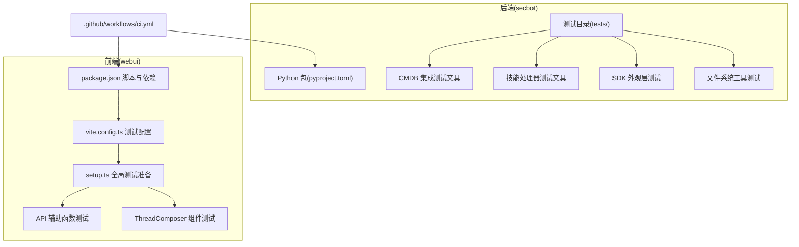
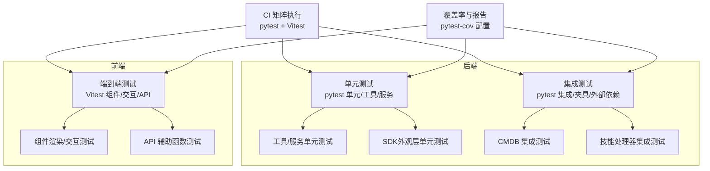
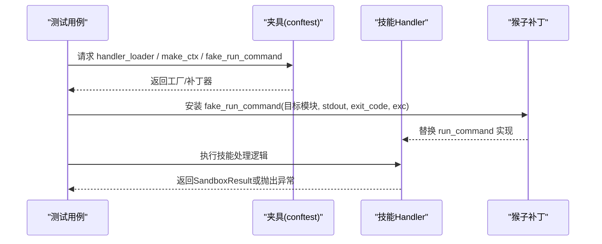
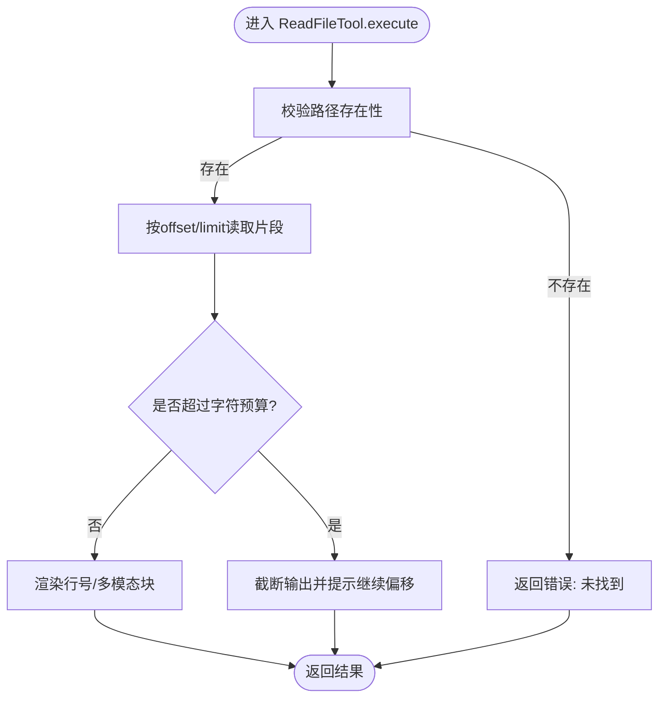
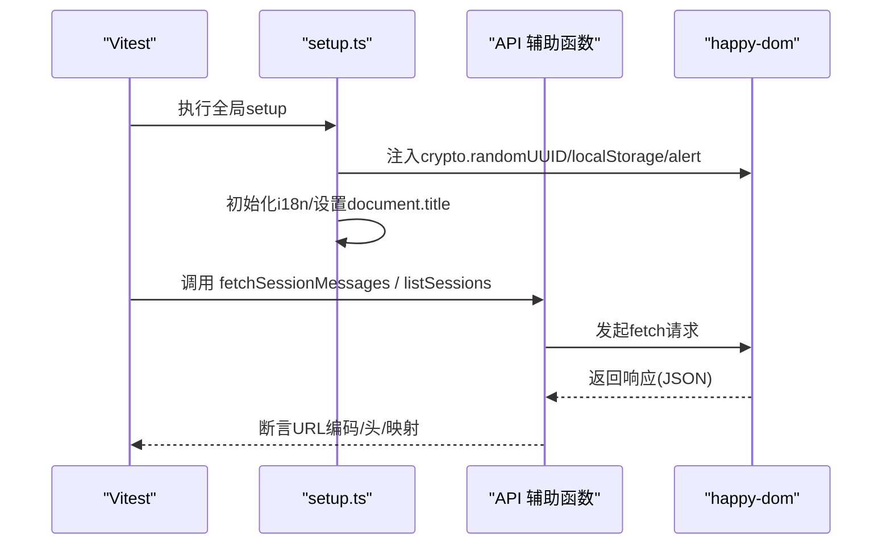
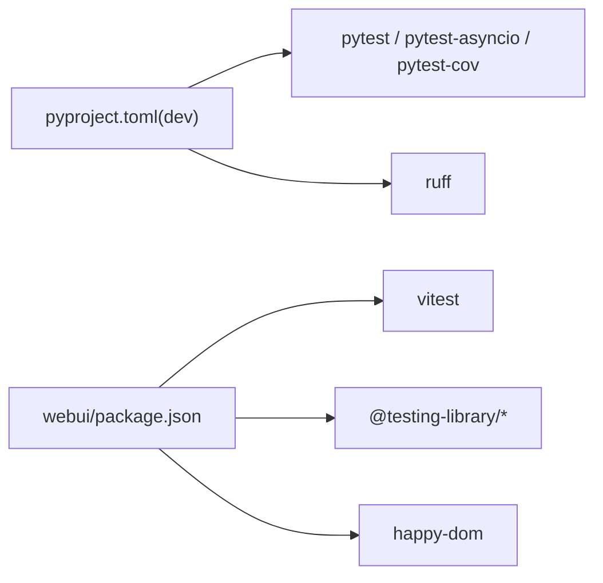

# 测试策略与实践

<cite>
**本文引用的文件**
- [pyproject.toml](file://pyproject.toml)
- [.github/workflows/ci.yml](file://.github/workflows/ci.yml)
- [tests/cmdb/conftest.py](file://tests/cmdb/conftest.py)
- [tests/skills/conftest.py](file://tests/skills/conftest.py)
- [tests/test_secbot_facade.py](file://tests/test_secbot_facade.py)
- [tests/tools/test_filesystem_tools.py](file://tests/tools/test_filesystem_tools.py)
- [webui/package.json](file://webui/package.json)
- [webui/vite.config.ts](file://webui/vite.config.ts)
- [webui/src/tests/setup.ts](file://webui/src/tests/setup.ts)
- [webui/src/tests/api.test.ts](file://webui/src/tests/api.test.ts)
- [webui/src/tests/thread-composer.test.tsx](file://webui/src/tests/thread-composer.test.tsx)
</cite>

## 目录
1. [引言](#引言)
2. [项目结构](#项目结构)
3. [核心组件](#核心组件)
4. [架构总览](#架构总览)
5. [详细组件分析](#详细组件分析)
6. [依赖分析](#依赖分析)
7. [性能考虑](#性能考虑)
8. [故障排查指南](#故障排查指南)
9. [结论](#结论)
10. [附录](#附录)

## 引言
本文件面向VAPT3/secbot项目，提供一套系统化的测试策略与实践指南，覆盖测试金字塔（单元测试、集成测试、端到端测试）、Python测试框架（pytest）与前端测试（React/Vitest）的使用方法、测试数据与模拟策略（数据库、外部API、文件系统）、覆盖率与监控、性能与压力测试、以及测试自动化与CI/CD集成最佳实践。目标是帮助开发者在保证质量的同时提升交付效率。

## 项目结构
secbot采用“后端Python + 前端React”的双栈架构，测试体系分别覆盖：
- 后端：pytest组织的单元与集成测试，覆盖工具、技能处理器、通道、命令路由、配置、提供者、会话、心跳、报告、安全沙箱等模块。
- 前端：Vitest + Testing Library进行组件与交互测试，配合Vite代理与环境配置，支持Happy DOM运行时与国际化设置。



图表来源
- [pyproject.toml:153-169](file://pyproject.toml#L153-L169)
- [.github/workflows/ci.yml:1-40](file://.github/workflows/ci.yml#L1-40)
- [webui/package.json:1-67](file://webui/package.json#L1-L67)
- [webui/vite.config.ts:59-65](file://webui/vite.config.ts#L59-L65)
- [webui/src/tests/setup.ts:1-83](file://webui/src/tests/setup.ts#L1-L83)

章节来源
- [pyproject.toml:153-169](file://pyproject.toml#L153-L169)
- [.github/workflows/ci.yml:1-40](file://.github/workflows/ci.yml#L1-L40)
- [webui/package.json:1-67](file://webui/package.json#L1-L67)
- [webui/vite.config.ts:59-65](file://webui/vite.config.ts#L59-L65)
- [webui/src/tests/setup.ts:1-83](file://webui/src/tests/setup.ts#L1-L83)

## 核心组件
- 后端测试框架与配置
  - pytest配置：异步模式、测试路径、覆盖率源与排除规则。
  - CI流水线：多操作系统与多Python版本矩阵执行，安装系统依赖与依赖，Ruff检查，pytest执行。
- 前端测试框架与配置
  - Vitest + Testing Library，Happy DOM运行时，全局setup文件注入i18n与polyfill。
  - Vite代理与WebSocket升级分离，保障SPA与后端API/WebSocket的开发联调。
- 测试夹具与模拟
  - CMDB：每个测试隔离SQLite，Schema全量应用，连接池按需清理。
  - 技能处理器：动态加载handler.py，构造SkillContext，伪造run_command返回。
  - SDK外观层：通过patch替换配置加载与模型提供者，验证运行结果与钩子行为。
  - 文件系统工具：针对读取、编辑、列表等工具的边界条件、权限限制、字符预算、换行符处理等进行详尽测试。

章节来源
- [pyproject.toml:153-169](file://pyproject.toml#L153-L169)
- [.github/workflows/ci.yml:17-40](file://.github/workflows/ci.yml#L17-L40)
- [tests/cmdb/conftest.py:1-37](file://tests/cmdb/conftest.py#L1-L37)
- [tests/skills/conftest.py:1-87](file://tests/skills/conftest.py#L1-L87)
- [tests/test_secbot_facade.py:1-302](file://tests/test_secbot_facade.py#L1-L302)
- [tests/tools/test_filesystem_tools.py:1-411](file://tests/tools/test_filesystem_tools.py#L1-L411)
- [webui/package.json:6-13](file://webui/package.json#L6-L13)
- [webui/vite.config.ts:59-65](file://webui/vite.config.ts#L59-L65)
- [webui/src/tests/setup.ts:1-83](file://webui/src/tests/setup.ts#L1-L83)

## 架构总览
下图展示测试金字塔在本项目的落地方式与控制流：



图表来源
- [pyproject.toml:153-169](file://pyproject.toml#L153-L169)
- [.github/workflows/ci.yml:17-40](file://.github/workflows/ci.yml#L17-L40)
- [webui/package.json:6-13](file://webui/package.json#L6-L13)
- [webui/vite.config.ts:59-65](file://webui/vite.config.ts#L59-L65)

## 详细组件分析

### 后端测试：pytest配置与夹具
- pytest配置要点
  - 异步模式：自动启用，便于测试异步代码。
  - 测试路径：tests目录。
  - 覆盖率：源码范围仅限secbot，排除tests与内部测试目录。
- CMDB夹具
  - 每个测试使用独立临时SQLite文件，避免内存数据库导致的连接隔离问题。
  - 在事务中创建所有表，确保Schema一致性；测试结束后释放引擎。
- 技能处理器夹具
  - 动态导入handler.py，避免重复加载与命名冲突。
  - 构造SkillContext，支持扫描ID、扫描目录、取消令牌等上下文参数。
  - fake_run_command：可批量patch多个模块的run_command，按需写入raw_log、返回SandboxResult或抛出异常。



图表来源
- [tests/skills/conftest.py:20-87](file://tests/skills/conftest.py#L20-L87)

章节来源
- [pyproject.toml:153-169](file://pyproject.toml#L153-L169)
- [tests/cmdb/conftest.py:1-37](file://tests/cmdb/conftest.py#L1-L37)
- [tests/skills/conftest.py:1-87](file://tests/skills/conftest.py#L1-L87)

### 后端测试：SDK外观层测试
- 关注点
  - 配置加载失败、默认路径解析、实例创建、工作空间覆盖。
  - 异步运行流程：process_direct调用、返回RunResult、消息与工具使用记录。
  - 钩子生命周期：before_iteration/after_iteration、异常时钩子恢复。
- 测试方法
  - 使用patch替换配置加载与提供者工厂，断言调用链与返回值。
  - 使用AsyncMock模拟异步处理流程，验证消息与工具使用序列。

```mermaid
sequenceDiagram
participant UT as "单元测试"
participant SB as "Secbot"
participant LOOP as "_loop(process_direct)"
participant EVT as "OutboundMessage"
UT->>SB : from_config(...)
UT->>LOOP : AsyncMock(process_direct)
UT->>SB : run(query, hooks?, session_key?)
SB->>LOOP : process_direct(query, session_key)
LOOP-->>SB : EVT
SB-->>UT : RunResult(tools_used, messages, content)
```

图表来源
- [tests/test_secbot_facade.py:26-170](file://tests/test_secbot_facade.py#L26-L170)
- [tests/test_secbot_facade.py:176-302](file://tests/test_secbot_facade.py#L176-L302)

章节来源
- [tests/test_secbot_facade.py:1-302](file://tests/test_secbot_facade.py#L1-L302)

### 后端测试：文件系统工具测试
- 覆盖范围
  - ReadFileTool：行号显示、偏移与限制、越界提示、空文件、图片多模态块、路径不存在、字符预算截断。
  - EditFileTool：精确匹配、CRLF归一化、缩进回退、歧义匹配警告、全部替换、未找到、缺失参数。
  - ListDirTool：基本列出、递归、最大条目截断、空目录、路径不存在、缺失参数。
  - 工作区限制与额外允许目录：只读/只写权限边界、媒体目录读取、扩展目录写入防护。
- 测试策略
  - 使用tmp_path构造隔离文件系统，覆盖跨平台路径分隔符。
  - 对敏感操作（写入、编辑）进行权限边界测试，确保不越权访问。



图表来源
- [tests/tools/test_filesystem_tools.py:17-94](file://tests/tools/test_filesystem_tools.py#L17-L94)

章节来源
- [tests/tools/test_filesystem_tools.py:1-411](file://tests/tools/test_filesystem_tools.py#L1-L411)

### 前端测试：Vitest配置与全局准备
- Vitest配置
  - 运行环境：happy-dom，提供DOM API与WebSocket支持。
  - 全局变量：为crypto.randomUUID、localStorage、window.alert提供最小化polyfill，确保组件错误分支可测试。
  - 设置文件：统一语言与标题，保证i18n与本地存储一致性。
- API辅助函数测试
  - 断言URL编码（如websocket键值）、Authorization头、查询字符串序列化。
  - 断言响应映射：会话标题预览、斜杠命令元数据字段转换。
- 组件交互测试
  - 断言渲染样式与占位符文本。
  - 断言Slash命令面板打开、键盘导航与插入行为。



图表来源
- [webui/src/tests/setup.ts:1-83](file://webui/src/tests/setup.ts#L1-L83)
- [webui/src/tests/api.test.ts:1-115](file://webui/src/tests/api.test.ts#L1-L115)

章节来源
- [webui/package.json:6-13](file://webui/package.json#L6-L13)
- [webui/vite.config.ts:59-65](file://webui/vite.config.ts#L59-L65)
- [webui/src/tests/setup.ts:1-83](file://webui/src/tests/setup.ts#L1-L83)
- [webui/src/tests/api.test.ts:1-115](file://webui/src/tests/api.test.ts#L1-L115)
- [webui/src/tests/thread-composer.test.tsx:1-95](file://webui/src/tests/thread-composer.test.tsx#L1-L95)

## 依赖分析
- 后端依赖
  - pytest、pytest-asyncio、pytest-cov用于测试与覆盖率。
  - Ruff用于静态检查。
- 前端依赖
  - Vitest、Testing Library、happy-dom用于组件与交互测试。
  - React Query、i18n等库的测试适配通过setup文件完成。



图表来源
- [pyproject.toml:103-110](file://pyproject.toml#L103-L110)
- [webui/package.json:46-65](file://webui/package.json#L46-L65)

章节来源
- [pyproject.toml:103-110](file://pyproject.toml#L103-L110)
- [webui/package.json:46-65](file://webui/package.json#L46-L65)

## 性能考虑
- 单元测试优先：通过夹具与mock隔离外部依赖，减少IO与网络开销。
- 集成测试聚焦关键路径：例如CMDB Schema初始化与技能处理器的典型流程，避免冗长等待。
- 前端测试避免真实网络请求：通过happy-dom与fetch stub，确保测试稳定且快速。
- 覆盖率关注热点路径：结合pytest-cov的排除规则，集中提升关键模块覆盖率。
- CI矩阵：多Python版本与操作系统并行，尽早暴露兼容性问题。

[本节为通用指导，无需特定文件引用]

## 故障排查指南
- pytest无法启动或异步测试报错
  - 确认pytest.ini中的asyncio_mode已启用。
  - 章节来源
    - [pyproject.toml:153-155](file://pyproject.toml#L153-L155)
- CMDB测试失败或Schema不一致
  - 确保使用tmp_cmdb夹具，每个测试独立SQLite文件，Schema在事务中创建。
  - 章节来源
    - [tests/cmdb/conftest.py:23-37](file://tests/cmdb/conftest.py#L23-L37)
- 技能处理器测试不稳定
  - 使用fake_run_command统一patch，确保stdout写入raw_log与exit_code一致。
  - 章节来源
    - [tests/skills/conftest.py:54-87](file://tests/skills/conftest.py#L54-L87)
- 前端测试缺少DOM API
  - 检查setup.ts是否正确注入crypto.randomUUID、localStorage、window.alert。
  - 章节来源
    - [webui/src/tests/setup.ts:6-75](file://webui/src/tests/setup.ts#L6-L75)
- API测试URL编码或Authorization头缺失
  - 检查API测试用例对百分号编码与Authorization头的断言。
  - 章节来源
    - [webui/src/tests/api.test.ts:22-56](file://webui/src/tests/api.test.ts#L22-L56)
- 组件交互测试失败
  - 使用Testing Library的可访问性选择器，确认事件触发顺序与状态更新。
  - 章节来源
    - [webui/src/tests/thread-composer.test.tsx:64-93](file://webui/src/tests/thread-composer.test.tsx#L64-L93)

## 结论
本测试策略以pytest与Vitest为核心，结合夹具与mock实现高内聚低耦合的测试体系；通过CMDB与技能处理器的集成夹具，确保关键业务路径的稳定性；前端测试通过happy-dom与setup文件补齐缺失能力，保障组件与交互质量。配合CI矩阵与覆盖率配置，形成从单元到端到端的完整质量闭环。

[本节为总结，无需特定文件引用]

## 附录
- 测试金字塔建议
  - 单元测试：占比约70%，重点覆盖工具、服务、数据模型与纯函数。
  - 集成测试：占比约20%，重点覆盖数据库、外部API、文件系统、技能处理器。
  - 端到端测试：占比约10%，重点覆盖关键用户路径与WebUI交互。
- 覆盖率与监控
  - 后端：pytest-cov配置已指定source与排除规则，建议设定阈值并持续改进。
  - 前端：Vitest内置覆盖率，结合jest-dom与Testing Library断言，确保覆盖率与质量双达标。
- 性能与压力测试
  - 后端：对关键异步流程（如process_direct）进行基准测试，识别瓶颈。
  - 前端：对组件渲染与交互事件进行基准测试，关注首屏与滚动性能。
- CI/CD集成最佳实践
  - 并行矩阵：操作系统与Python版本并行，缩短反馈周期。
  - 缓存依赖：缓存uv/pnpm缓存，减少安装时间。
  - 失败快照：对失败用例生成日志与截图，便于定位问题。

[本节为通用指导，无需特定文件引用]