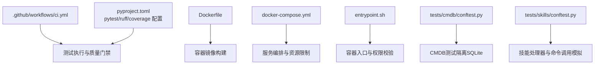
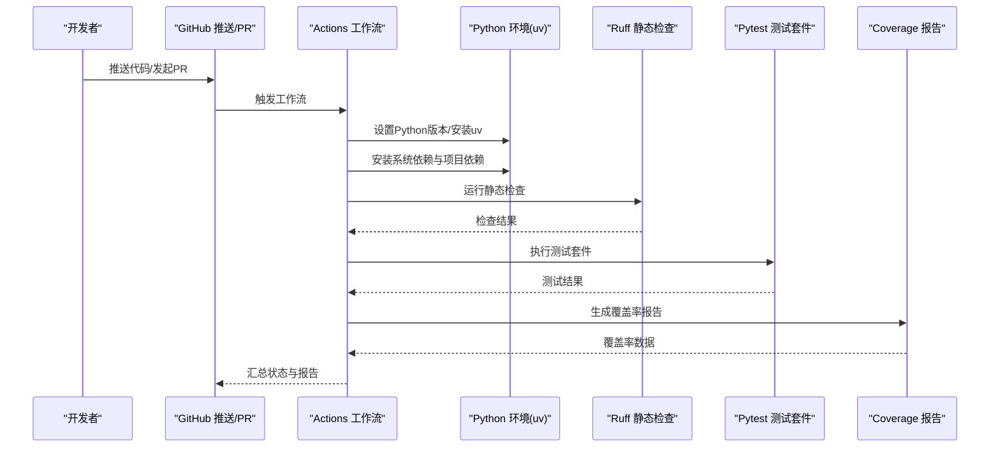
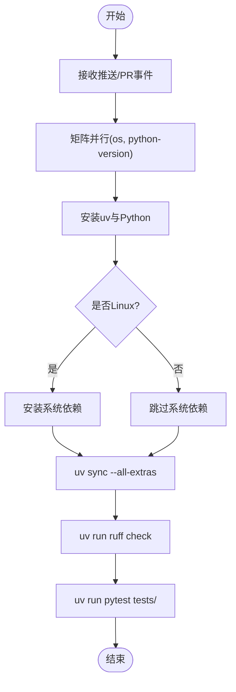
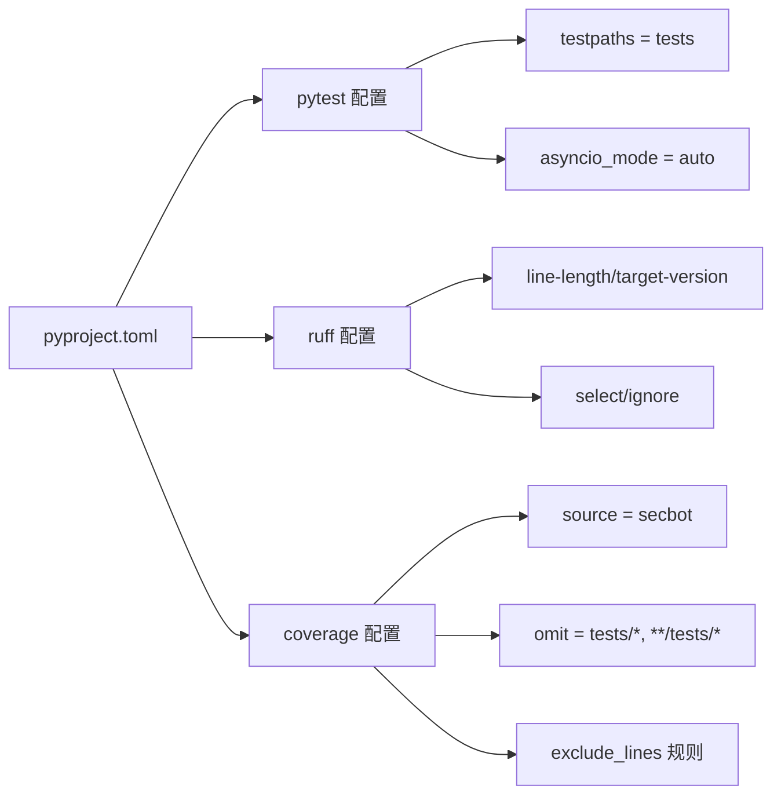
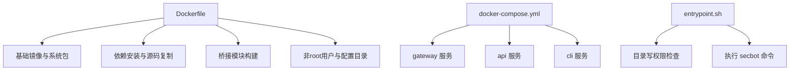
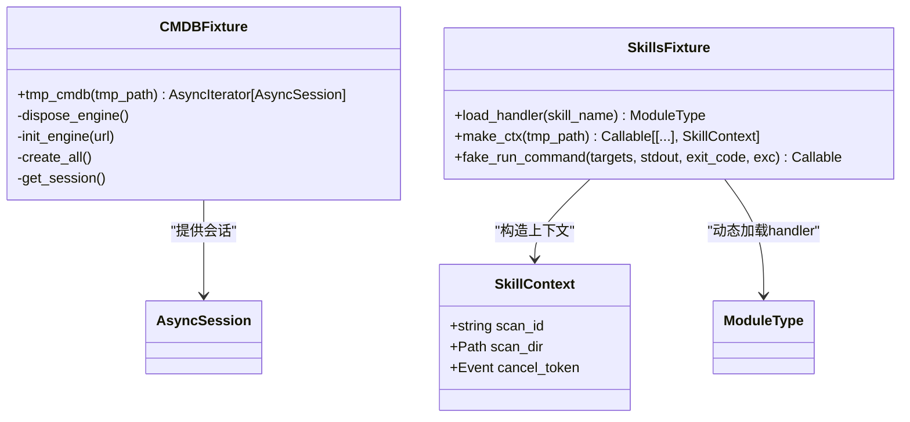
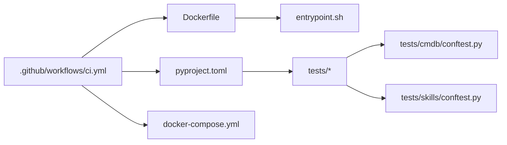

# 测试自动化与CI/CD

<cite>
**本文引用的文件**
- [.github/workflows/ci.yml](file://.github/workflows/ci.yml)
- [pyproject.toml](file://pyproject.toml)
- [docker-compose.yml](file://docker-compose.yml)
- [Dockerfile](file://Dockerfile)
- [entrypoint.sh](file://entrypoint.sh)
- [tests/cmdb/conftest.py](file://tests/cmdb/conftest.py)
- [tests/skills/conftest.py](file://tests/skills/conftest.py)
</cite>

## 目录
1. [简介](#简介)
2. [项目结构](#项目结构)
3. [核心组件](#核心组件)
4. [架构总览](#架构总览)
5. [详细组件分析](#详细组件分析)
6. [依赖关系分析](#依赖关系分析)
7. [性能考虑](#性能考虑)
8. [故障排查指南](#故障排查指南)
9. [结论](#结论)
10. [附录](#附录)

## 简介
本文件面向VAPT3/secbot项目，系统化阐述测试自动化与CI/CD集成方案，覆盖以下主题：
- GitHub Actions工作流配置与使用：测试自动触发、跨平台/多Python版本并行执行、代码质量检查、测试覆盖率与报告生成建议
- 持续集成流水线设计：代码质量门禁、测试覆盖率阈值、自动化部署前的测试验证策略
- 测试环境管理：测试数据库准备（SQLite隔离）、外部服务模拟（技能处理器与命令调用）、环境变量与容器运行时配置
- 失败处理与通知：错误检测、失败重试、通知渠道接入建议
- 性能回归测试与安全测试在CI中的集成策略

## 项目结构
围绕测试与CI的关键目录与文件如下：
- CI工作流：.github/workflows/ci.yml
- 测试配置与工具：pyproject.toml（pytest、ruff、coverage）
- 容器与运行时：Dockerfile、docker-compose.yml、entrypoint.sh
- 测试夹具与隔离：tests/cmdb/conftest.py、tests/skills/conftest.py

**图表来源**
- [.github/workflows/ci.yml:1-40](file://.github/workflows/ci.yml#L1-L40)
- [pyproject.toml:153-169](file://pyproject.toml#L153-L169)
- [Dockerfile:1-51](file://Dockerfile#L1-L51)
- [docker-compose.yml:15-56](file://docker-compose.yml#L15-L56)
- [entrypoint.sh:1-16](file://entrypoint.sh#L1-L16)
- [tests/cmdb/conftest.py:1-37](file://tests/cmdb/conftest.py#L1-L37)
- [tests/skills/conftest.py:1-87](file://tests/skills/conftest.py#L1-L87)

**章节来源**
- [.github/workflows/ci.yml:1-40](file://.github/workflows/ci.yml#L1-L40)
- [pyproject.toml:153-169](file://pyproject.toml#L153-L169)
- [Dockerfile:1-51](file://Dockerfile#L1-L51)
- [docker-compose.yml:15-56](file://docker-compose.yml#L15-L56)
- [entrypoint.sh:1-16](file://entrypoint.sh#L1-L16)
- [tests/cmdb/conftest.py:1-37](file://tests/cmdb/conftest.py#L1-L37)
- [tests/skills/conftest.py:1-87](file://tests/skills/conftest.py#L1-L87)

## 核心组件
- GitHub Actions工作流：定义触发条件（push/pull_request至main/nightly）、矩阵并行（操作系统×Python版本）、安装uv、系统依赖、lint与测试执行
- 测试框架与工具链：pytest（异步模式、测试路径）、ruff（静态检查）、coverage（源码与排除规则）
- 容器化运行时：基于uv官方镜像，安装Node.js与必要系统包；entrypoint进行目录写入权限校验
- 测试夹具：CMDB测试隔离（每个测试独立SQLite文件，应用完整schema），技能处理器测试夹具（动态加载handler、构造SkillContext、模拟命令执行）

**章节来源**
- [.github/workflows/ci.yml:1-40](file://.github/workflows/ci.yml#L1-L40)
- [pyproject.toml:153-169](file://pyproject.toml#L153-L169)
- [Dockerfile:1-51](file://Dockerfile#L1-L51)
- [entrypoint.sh:1-16](file://entrypoint.sh#L1-L16)
- [tests/cmdb/conftest.py:23-37](file://tests/cmdb/conftest.py#L23-L37)
- [tests/skills/conftest.py:20-87](file://tests/skills/conftest.py#L20-L87)

## 架构总览
下图展示从代码提交到测试执行与质量门禁的整体流程。

**图表来源**
- [.github/workflows/ci.yml:3-40](file://.github/workflows/ci.yml#L3-L40)
- [pyproject.toml:145-169](file://pyproject.toml#L145-L169)

## 详细组件分析

### GitHub Actions 工作流（ci.yml）
- 触发条件：对main与nightly分支的push与pull_request事件
- 并行策略：矩阵组合ubuntu/windows与Python 3.11~3.14，实现跨平台与多版本并行
- 步骤要点：
  - checkout仓库
  - setup-python设置版本
  - 安装uv（加速依赖解析与安装）
  - Linux系统依赖安装（libolm-dev、build-essential）
  - uv sync --all-extras安装所有可选依赖
  - uv run ruff检查指定规则集
  - uv run pytest执行tests目录下的测试

**图表来源**
- [.github/workflows/ci.yml:3-40](file://.github/workflows/ci.yml#L3-L40)

**章节来源**
- [.github/workflows/ci.yml:1-40](file://.github/workflows/ci.yml#L1-L40)

### 测试配置与工具（pyproject.toml）
- pytest配置：
  - 异步模式：auto
  - 测试路径：tests
- ruff配置：
  - 行长度与目标版本
  - 选择性规则与忽略规则
- coverage配置：
  - 源码目录：secbot
  - 排除路径：tests与子tests
  - 排除行规则（如未实现、类型检查等）

**图表来源**
- [pyproject.toml:153-169](file://pyproject.toml#L153-L169)

**章节来源**
- [pyproject.toml:153-169](file://pyproject.toml#L153-L169)

### 容器化与运行时（Dockerfile、docker-compose.yml、entrypoint.sh）
- Dockerfile：
  - 基于uv官方镜像，预装Node.js与必要系统包
  - 分层缓存安装Python依赖，再复制源码并安装
  - 构建WhatsApp桥接模块，创建非root用户与配置目录
  - 暴露网关端口，设置入口脚本
- docker-compose.yml：
  - 定义通用配置（镜像、卷、能力、安全选项）
  - 服务：gateway、api、cli，含资源限制与端口映射
- entrypoint.sh：
  - 校验宿主机配置目录写权限，提示修复方式并退出
  - 以secbot用户执行命令

**图表来源**
- [Dockerfile:1-51](file://Dockerfile#L1-L51)
- [docker-compose.yml:15-56](file://docker-compose.yml#L15-L56)
- [entrypoint.sh:1-16](file://entrypoint.sh#L1-L16)

**章节来源**
- [Dockerfile:1-51](file://Dockerfile#L1-L51)
- [docker-compose.yml:15-56](file://docker-compose.yml#L15-L56)
- [entrypoint.sh:1-16](file://entrypoint.sh#L1-L16)

### 测试夹具与隔离（tests/cmdb/conftest.py、tests/skills/conftest.py）
- CMDB测试隔离：
  - 每个测试使用临时路径生成独立SQLite文件
  - 初始化引擎并应用完整schema
  - 使用异步session贯穿测试生命周期
- 技能处理器测试夹具：
  - 动态加载技能handler.py模块
  - 构造SkillContext（scan_id、scan_dir、cancel_token）
  - 提供fake_run_command用于模拟命令执行（写日志、返回SandboxResult或抛出异常）

**图表来源**
- [tests/cmdb/conftest.py:23-37](file://tests/cmdb/conftest.py#L23-L37)
- [tests/skills/conftest.py:20-87](file://tests/skills/conftest.py#L20-L87)

**章节来源**
- [tests/cmdb/conftest.py:1-37](file://tests/cmdb/conftest.py#L1-L37)
- [tests/skills/conftest.py:1-87](file://tests/skills/conftest.py#L1-L87)

## 依赖关系分析
- CI工作流依赖pyproject.toml中的pytest与ruff配置，确保测试与静态检查一致
- 容器镜像与compose文件为测试提供稳定运行环境，entrypoint负责权限与入口行为
- 测试夹具通过SQLAlchemy与异步IO实现数据库隔离，避免跨测试污染

**图表来源**
- [.github/workflows/ci.yml:1-40](file://.github/workflows/ci.yml#L1-L40)
- [pyproject.toml:153-169](file://pyproject.toml#L153-L169)
- [Dockerfile:1-51](file://Dockerfile#L1-L51)
- [docker-compose.yml:15-56](file://docker-compose.yml#L15-L56)
- [entrypoint.sh:1-16](file://entrypoint.sh#L1-L16)
- [tests/cmdb/conftest.py:1-37](file://tests/cmdb/conftest.py#L1-L37)
- [tests/skills/conftest.py:1-87](file://tests/skills/conftest.py#L1-L87)

**章节来源**
- [.github/workflows/ci.yml:1-40](file://.github/workflows/ci.yml#L1-L40)
- [pyproject.toml:153-169](file://pyproject.toml#L153-L169)
- [Dockerfile:1-51](file://Dockerfile#L1-L51)
- [docker-compose.yml:15-56](file://docker-compose.yml#L15-L56)
- [entrypoint.sh:1-16](file://entrypoint.sh#L1-L16)
- [tests/cmdb/conftest.py:1-37](file://tests/cmdb/conftest.py#L1-L37)
- [tests/skills/conftest.py:1-87](file://tests/skills/conftest.py#L1-L87)

## 性能考虑
- 并行策略：利用GitHub Actions矩阵并行（操作系统×Python版本），缩短整体流水线时间
- 依赖安装：使用uv进行快速依赖解析与安装，减少重复下载与构建时间
- 测试隔离：CMDB使用每测试独立SQLite文件，避免内存数据库导致的连接隔离问题
- 资源限制：容器编排中为各服务设置CPU与内存上限，防止资源争用影响测试稳定性

[本节为通用指导，无需具体文件引用]

## 故障排查指南
- 权限问题（容器内）：entrypoint.sh会在配置目录不可写时输出错误信息并退出，需根据提示修正宿主机目录属主或容器运行用户
- 测试失败定位：结合pytest输出与ruff检查结果，优先修复静态检查问题；针对CMDB测试，确认临时数据库文件与schema初始化逻辑
- 技能测试模拟：使用skills夹具提供的fake_run_command注入期望的stdout、exit_code或异常，便于隔离外部依赖

**章节来源**
- [entrypoint.sh:1-16](file://entrypoint.sh#L1-L16)
- [tests/cmdb/conftest.py:23-37](file://tests/cmdb/conftest.py#L23-L37)
- [tests/skills/conftest.py:54-87](file://tests/skills/conftest.py#L54-L87)

## 结论
本方案通过GitHub Actions矩阵并行、uv加速安装、ruff静态检查与pytest测试套件，构建了跨平台、多版本的测试自动化流水线。配合容器化运行时与测试夹具，实现了数据库隔离与外部服务模拟，满足自动化部署前的测试验证需求。建议后续扩展覆盖率报告与通知机制，以完善CI闭环。

[本节为总结，无需具体文件引用]

## 附录

### CI/CD最佳实践清单
- 代码质量门禁：强制ruff检查通过后才允许合并
- 覆盖率门槛：在pyproject.toml中设置最小覆盖率阈值，失败即阻断
- 测试报告：将pytest junitxml输出上传为Artifacts，便于回溯
- 通知机制：在工作流末尾集成Slack/邮件通知，失败时发送摘要
- 性能回归：引入基准测试（如pytest-benchmark）并对比历史结果
- 安全扫描：在CI中集成安全扫描（如bandit、semgrep），在PR中显示结果

[本节为通用指导，无需具体文件引用]