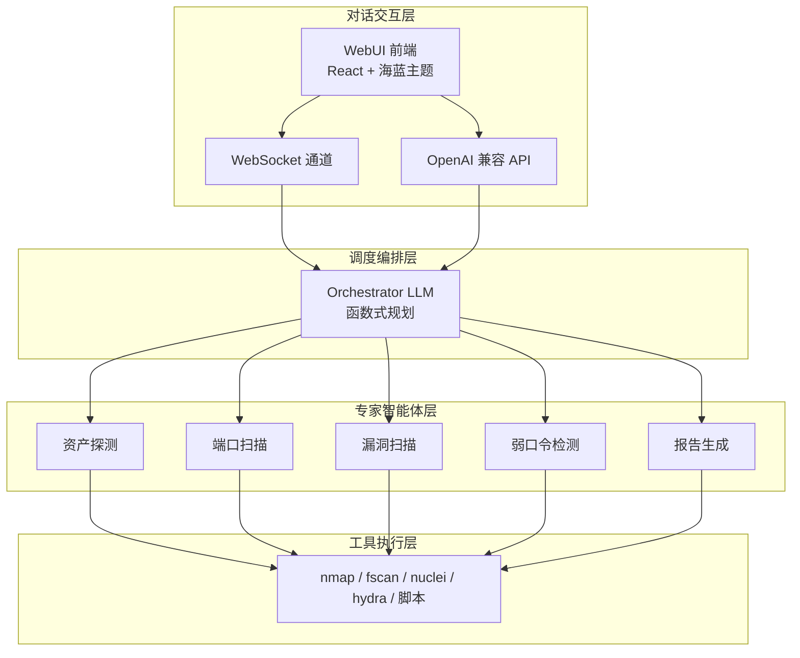
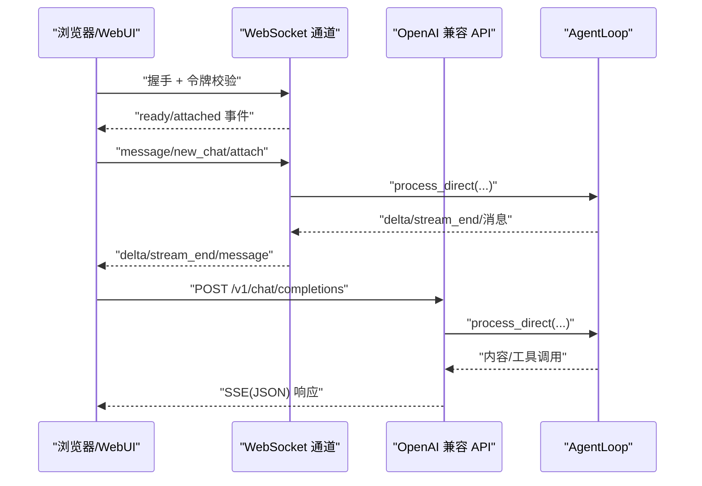
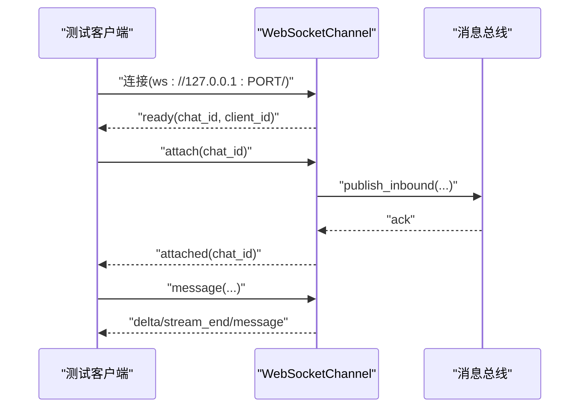
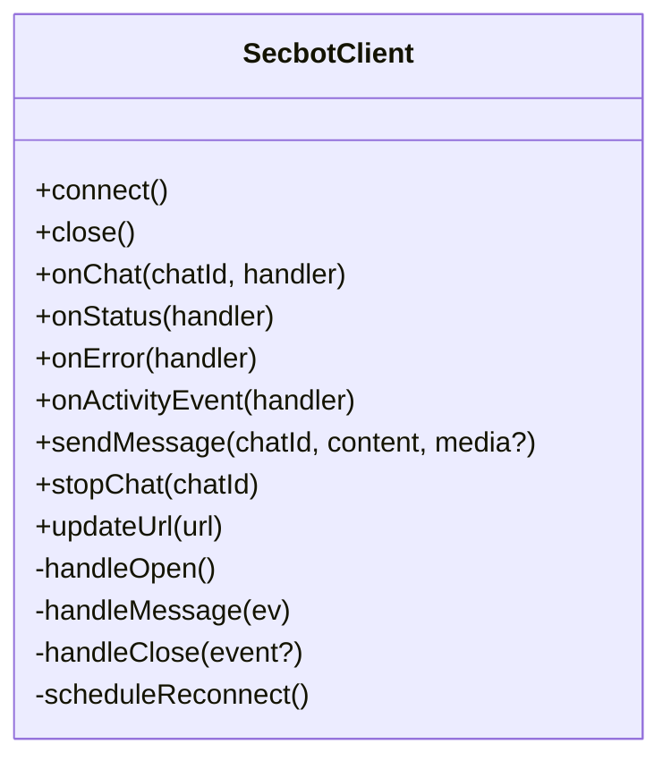
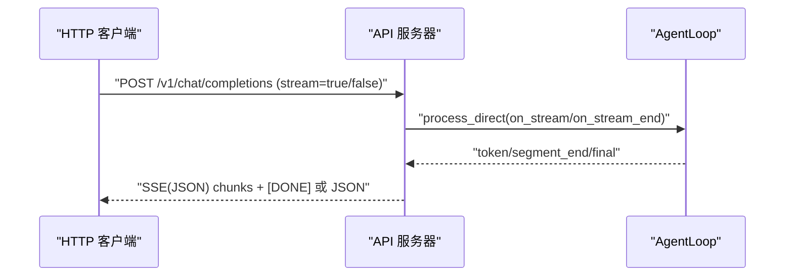
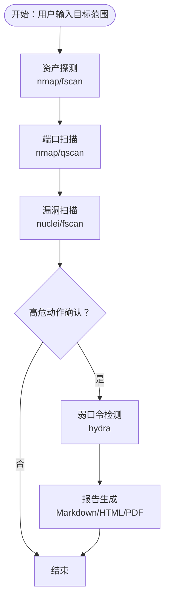
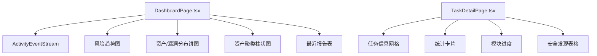
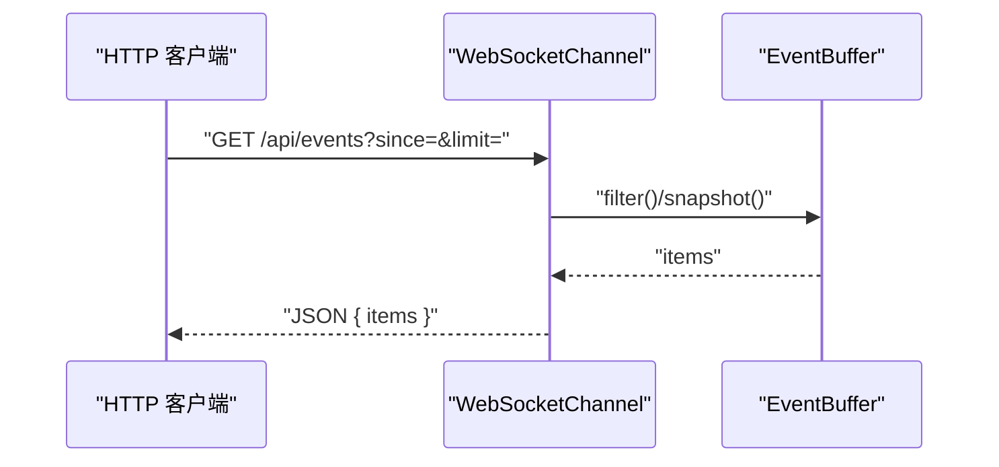
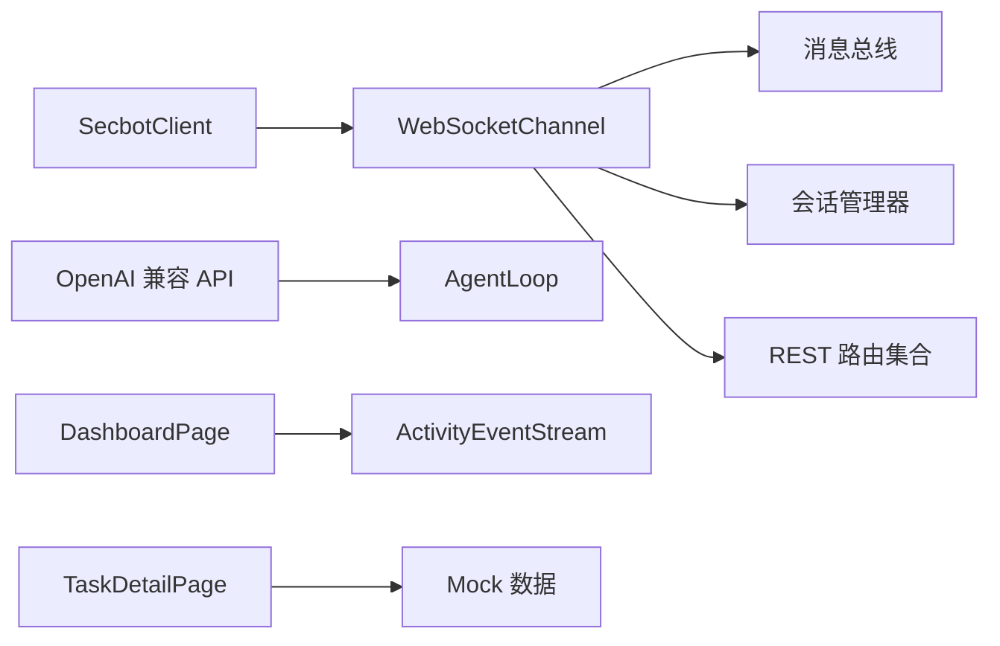

# 端到端测试

<cite>
**本文引用的文件**
- [README.md](file://README.md)
- [secbot/__main__.py](file://secbot/__main__.py)
- [webui/src/lib/secbot-client.ts](file://webui/src/lib/secbot-client.ts)
- [secbot/api/server.py](file://secbot/api/server.py)
- [secbot/channels/websocket.py](file://secbot/channels/websocket.py)
- [tests/channels/test_websocket_integration.py](file://tests/channels/test_websocket_integration.py)
- [tests/channels/ws_test_client.py](file://tests/channels/ws_test_client.py)
- [webui/src/tests/secbot-client.test.ts](file://webui/src/tests/secbot-client.test.ts)
- [tests/api/test_events.py](file://tests/api/test_events.py)
- [tests/test_api_stream.py](file://tests/test_api_stream.py)
- [webui/src/pages/DashboardPage.tsx](file://webui/src/pages/DashboardPage.tsx)
- [webui/src/pages/TaskDetailPage.tsx](file://webui/src/pages/TaskDetailPage.tsx)
- [tests/test_secbot_facade.py](file://tests/test_secbot_facade.py)
</cite>

## 目录
1. [简介](#简介)
2. [项目结构](#项目结构)
3. [核心组件](#核心组件)
4. [架构总览](#架构总览)
5. [详细组件分析](#详细组件分析)
6. [依赖关系分析](#依赖关系分析)
7. [性能考虑](#性能考虑)
8. [故障排查指南](#故障排查指南)
9. [结论](#结论)
10. [附录](#附录)

## 简介
本文件为 VAPT3/secbot 的端到端测试文档，覆盖以下目标：
- WebUI 与后端的端到端验证：从前端页面到 WebSocket 通道与 API 的完整链路。
- WebSocket 实时通信测试：消息传递、连接状态、错误恢复。
- 安全评估流程测试：从资产发现到报告生成的完整链路验证。
- 用户交互测试：前端组件与用户操作流程测试方法。
- 性能与负载测试：实施指南与关注点。

## 项目结构
secbot 采用“对话交互层（WebUI/WS/API）—调度编排层（Orchestrator）—专家智能体层（资产探测/端口扫描/漏洞扫描/弱口令/报告）—工具执行层（nmap/fscan/nuclei/hydra/自研脚本）”的分层设计。WebUI 通过 WebSocket 通道与后端交互；OpenAI 兼容 API 提供 HTTP 流式响应；专家智能体通过函数式调用（Function Calling）编排执行。

图表来源
- [README.md:29-53](file://README.md#L29-L53)
- [README.md:113-179](file://README.md#L113-L179)

章节来源
- [README.md:13-179](file://README.md#L13-L179)

## 核心组件
- WebSocket 通道：负责 WebSocket 握手、令牌签发、消息路由、广播节流、媒体签名链接等。
- OpenAI 兼容 API：提供 /v1/chat/completions 与 /v1/models，支持流式与非流式响应。
- WebUI 客户端：封装 WebSocket 连接、重连、事件订阅、活动流广播等。
- 专家智能体：资产探测、端口扫描、漏洞扫描、弱口令检测、报告生成。
- 测试套件：集成 WebSocket 通道测试、前端客户端测试、API 流式测试、事件流测试等。

章节来源
- [README.md:29-74](file://README.md#L29-L74)
- [secbot/channels/websocket.py:474-548](file://secbot/channels/websocket.py#L474-L548)
- [secbot/api/server.py:194-401](file://secbot/api/server.py#L194-L401)
- [webui/src/lib/secbot-client.ts:59-377](file://webui/src/lib/secbot-client.ts#L59-L377)

## 架构总览
WebSocket 通道与 OpenAI 兼容 API 共享同一 AgentLoop，前者面向浏览器实时交互，后者面向第三方平台嵌入。前端通过 SecbotClient 与 WebSocket 通道建立长连接，接收实时消息与活动事件流；API 服务器处理 HTTP 请求并返回流式或非流式响应。

图表来源
- [secbot/channels/websocket.py:657-795](file://secbot/channels/websocket.py#L657-L795)
- [secbot/api/server.py:194-351](file://secbot/api/server.py#L194-L351)
- [webui/src/lib/secbot-client.ts:155-377](file://webui/src/lib/secbot-client.ts#L155-L377)

## 详细组件分析

### WebSocket 通道端到端测试
- 连接与握手：支持静态令牌、令牌签发路径、自定义升级路径、SSL/TLS、广播节流等。
- 消息路由：支持 attach/ready/attached/message/delta/stream_end 等事件。
- 广播与节流：仪表盘聚合事件按 1 次/秒节流，避免过度推送。
- 媒体与令牌：媒体文件签名访问，令牌一次性消费或多用途校验。
- 集成测试覆盖：多客户端会话、消息顺序、流式传输、鉴权路径、边缘情况（超大消息、Unicode、快速发送）。

图表来源
- [tests/channels/test_websocket_integration.py:46-170](file://tests/channels/test_websocket_integration.py#L46-L170)
- [tests/channels/test_websocket_integration.py:175-297](file://tests/channels/test_websocket_integration.py#L175-L297)
- [tests/channels/test_websocket_integration.py:299-443](file://tests/channels/test_websocket_integration.py#L299-L443)
- [secbot/channels/websocket.py:657-795](file://secbot/channels/websocket.py#L657-L795)

章节来源
- [tests/channels/test_websocket_integration.py:1-519](file://tests/channels/test_websocket_integration.py#L1-L519)
- [secbot/channels/websocket.py:119-196](file://secbot/channels/websocket.py#L119-L196)
- [secbot/channels/websocket.py:818-854](file://secbot/channels/websocket.py#L818-L854)

### WebSocket 客户端（WebUI）测试
- 事件路由：按 chat_id 分发消息，全局活动事件广播。
- 连接管理：连接状态变化、自动重连、指数退避、最大退避时间。
- 错误上报：传输层错误（如消息过大）结构化上报，不影响重连逻辑。
- 媒体透传：消息携带媒体数组时正确序列化。
- 行为隔离：订阅者抛错不影响其他订阅者与重连状态机。

图表来源
- [webui/src/lib/secbot-client.ts:59-377](file://webui/src/lib/secbot-client.ts#L59-L377)

章节来源
- [webui/src/tests/secbot-client.test.ts:1-363](file://webui/src/tests/secbot-client.test.ts#L1-L363)
- [webui/src/lib/secbot-client.ts:155-377](file://webui/src/lib/secbot-client.ts#L155-L377)

### OpenAI 兼容 API 端到端测试
- 流式与非流式：支持 stream=true 返回 SSE，末尾 [DONE]；stream=false 返回标准 JSON。
- 会话隔离：支持 session_id 路由到不同会话键空间。
- 文件上传：multipart/form-data 与 base64 data URL 解析，大小限制与文件名安全处理。
- 超时与回退：请求超时返回 504；空响应自动重试并回退消息。
- 模型查询：/v1/models 返回可用模型列表。

图表来源
- [secbot/api/server.py:194-351](file://secbot/api/server.py#L194-L351)
- [tests/test_api_stream.py:100-364](file://tests/test_api_stream.py#L100-L364)

章节来源
- [secbot/api/server.py:194-401](file://secbot/api/server.py#L194-L401)
- [tests/test_api_stream.py:1-364](file://tests/test_api_stream.py#L1-364)

### 安全评估流程端到端验证（资产发现→报告生成）
- 典型流程：资产探测 → 端口扫描 → 漏洞扫描 → 弱口令检测 → 报告生成。
- 高危动作护栏：扫描/爆破/PoC 执行前的人工确认钩子。
- CMDB 资产库：SQLite + Alembic 迁移，统一建模资产、端口、漏洞、任务。
- WebUI 仪表盘：实时展示风险趋势、漏洞分布、资产聚类与最近报告。

图表来源
- [README.md:64-74](file://README.md#L64-L74)
- [README.md:180-191](file://README.md#L180-L191)

章节来源
- [README.md:13-74](file://README.md#L13-L74)

### 用户交互测试（前端组件与操作流程）
- 仪表盘页面：KPI 卡片、风险趋势图、资产/漏洞分布饼图、资产聚类柱状图、最近报告表。
- 任务详情页：任务信息网格、统计卡片、模块进度、安全发现表格。
- 活动事件流：全局活动事件广播，支持过滤与限流。
- Mock 数据：使用 mock 数据驱动前端组件渲染与交互。

图表来源
- [webui/src/pages/DashboardPage.tsx:294-519](file://webui/src/pages/DashboardPage.tsx#L294-L519)
- [webui/src/pages/TaskDetailPage.tsx:103-246](file://webui/src/pages/TaskDetailPage.tsx#L103-L246)

章节来源
- [webui/src/pages/DashboardPage.tsx:1-519](file://webui/src/pages/DashboardPage.tsx#L1-L519)
- [webui/src/pages/TaskDetailPage.tsx:1-246](file://webui/src/pages/TaskDetailPage.tsx#L1-L246)

### API 事件流与仪表盘聚合测试
- 事件缓冲：环形缓冲区，支持窗口过滤、数量限制、UTC 时间戳。
- HTTP 路由：/api/events 返回活动事件列表，支持 since/limit 参数。
- 仪表盘聚合：按类别/类型聚合，支持折叠阈值与显示标签映射。

图表来源
- [tests/api/test_events.py:236-371](file://tests/api/test_events.py#L236-L371)
- [secbot/channels/websocket.py:1103-1133](file://secbot/channels/websocket.py#L1103-L1133)

章节来源
- [tests/api/test_events.py:1-371](file://tests/api/test_events.py#L1-L371)
- [secbot/channels/websocket.py:119-196](file://secbot/channels/websocket.py#L119-L196)

## 依赖关系分析
- WebSocket 通道依赖消息总线与会话管理器，提供 HTTP REST 表面（会话列表、设置、命令、仪表盘聚合、通知中心、事件流、媒体签名）。
- OpenAI 兼容 API 依赖 AgentLoop，提供流式与非流式响应。
- WebUI 客户端依赖 WebSocket 通道，提供连接状态、重连、事件订阅、活动流广播。
- 前端页面依赖 mock 数据与组件库，渲染仪表盘与任务详情。

图表来源
- [secbot/channels/websocket.py:657-795](file://secbot/channels/websocket.py#L657-L795)
- [secbot/api/server.py:381-401](file://secbot/api/server.py#L381-L401)
- [webui/src/lib/secbot-client.ts:59-158](file://webui/src/lib/secbot-client.ts#L59-L158)

章节来源
- [secbot/channels/websocket.py:474-548](file://secbot/channels/websocket.py#L474-L548)
- [secbot/api/server.py:381-401](file://secbot/api/server.py#L381-L401)
- [webui/src/lib/secbot-client.ts:59-158](file://webui/src/lib/secbot-client.ts#L59-L158)

## 性能考虑
- WebSocket 连接与重连：指数退避上限可配置，避免雪崩效应；连接队列与重连后自动 attach，保证消息不丢失。
- 流式传输：SSE/WS delta 流在工具调用与多轮对话中保持低延迟；流结束回调不提前关闭 HTTP 连接。
- 广播节流：仪表盘聚合事件按 1 次/秒节流，减少前端压力。
- 媒体处理：服务端对媒体 MIME 白名单与大小限制，防止滥用与内存膨胀。
- API 限流与超时：请求超时与并发锁，避免阻塞；空响应自动重试与回退消息，提升鲁棒性。

章节来源
- [webui/src/lib/secbot-client.ts:340-377](file://webui/src/lib/secbot-client.ts#L340-L377)
- [secbot/api/server.py:237-304](file://secbot/api/server.py#L237-L304)
- [secbot/channels/websocket.py:114-117](file://secbot/channels/websocket.py#L114-L117)

## 故障排查指南
- WebSocket 无法连接
  - 检查通道配置（host/port/path/token）与 token 是否过期。
  - 确认 WebUI 使用的 ws_path 与后端配置一致。
  - 若使用反向代理，确保 token_issue_secret 已配置。
- 消息过大被拒绝
  - 客户端侧收到“消息过大”错误，需降低媒体尺寸或数量。
- 连接意外断开
  - 客户端会自动重连，检查 onStatus 与 onError 回调是否触发。
- API 超时或空响应
  - 检查请求超时配置与 AgentLoop 负载；必要时增加超时或降级策略。
- 事件流为空
  - 确认 API 令牌有效；检查 since/limit 参数与事件缓冲长度。

章节来源
- [secbot/channels/websocket.py:818-854](file://secbot/channels/websocket.py#L818-L854)
- [webui/src/lib/secbot-client.ts:222-235](file://webui/src/lib/secbot-client.ts#L222-L235)
- [secbot/api/server.py:341-349](file://secbot/api/server.py#L341-L349)
- [tests/api/test_events.py:236-371](file://tests/api/test_events.py#L236-L371)

## 结论
本文提供了 secbot 从 WebUI 到后端的端到端测试方法，涵盖 WebSocket 实时通信、API 流式响应、安全评估流程、前端交互与性能优化要点。结合现有测试用例与组件行为，可系统性验证系统在真实场景下的稳定性与一致性。

## 附录
- 入口与启动
  - CLI 直连：secbot agent
  - OpenAI 兼容 API：secbot serve -p 8000
  - WebUI 网关：secbot gateway（含健康检查与 WebSocket 通道）
- 配置要点
  - channels.websocket.enabled=true
  - WebUI 通过 /webui/bootstrap 获取 token 与 ws_path
  - API 模型名称与超时可通过 create_app 注入

章节来源
- [README.md:113-179](file://README.md#L113-L179)
- [secbot/__main__.py:1-9](file://secbot/__main__.py#L1-L9)
- [secbot/api/server.py:381-401](file://secbot/api/server.py#L381-L401)