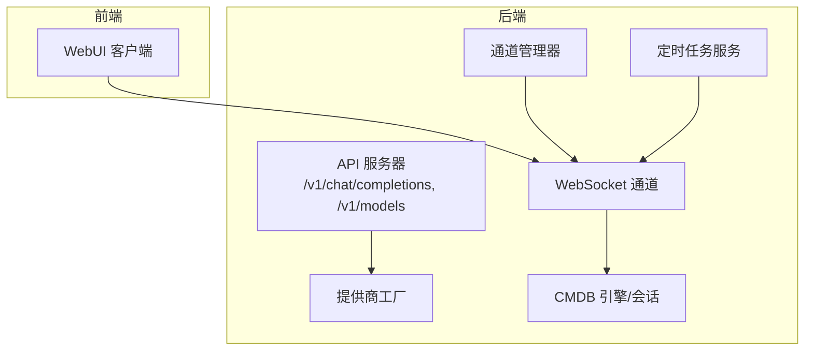
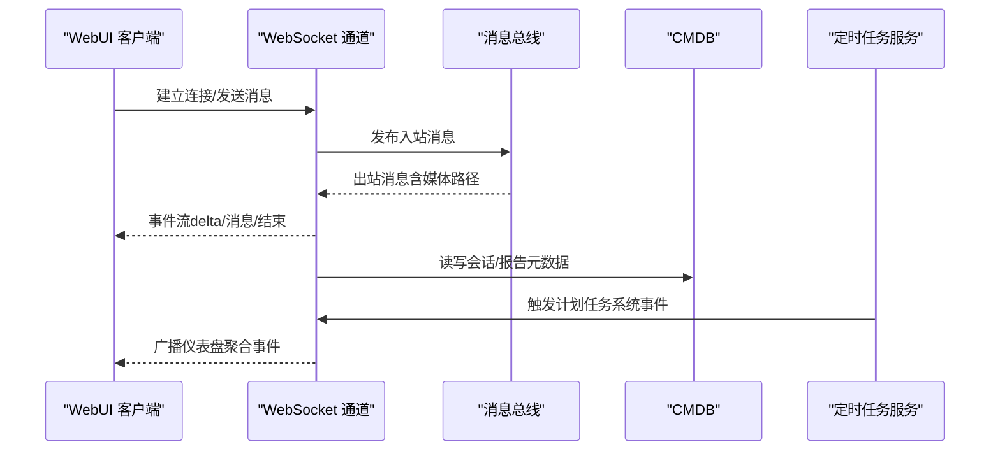
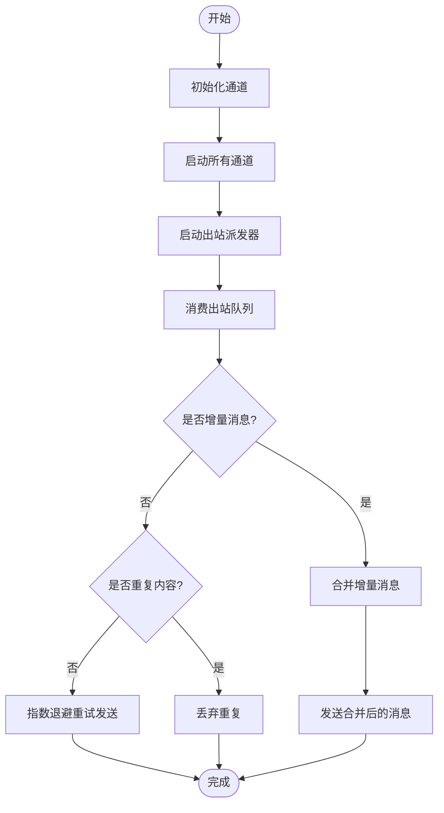
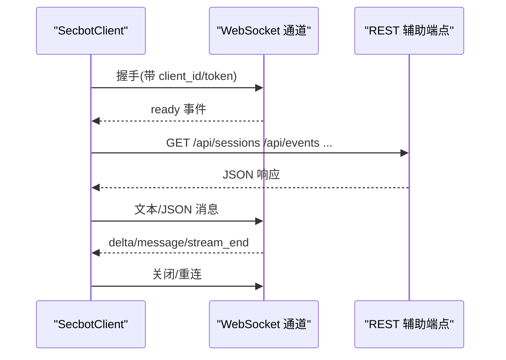
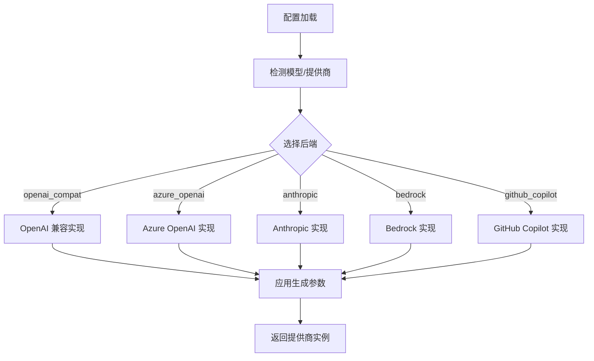
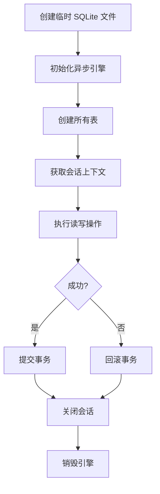
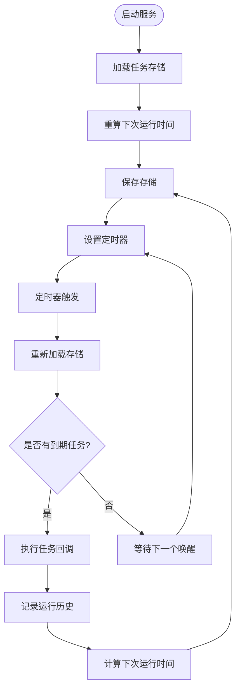
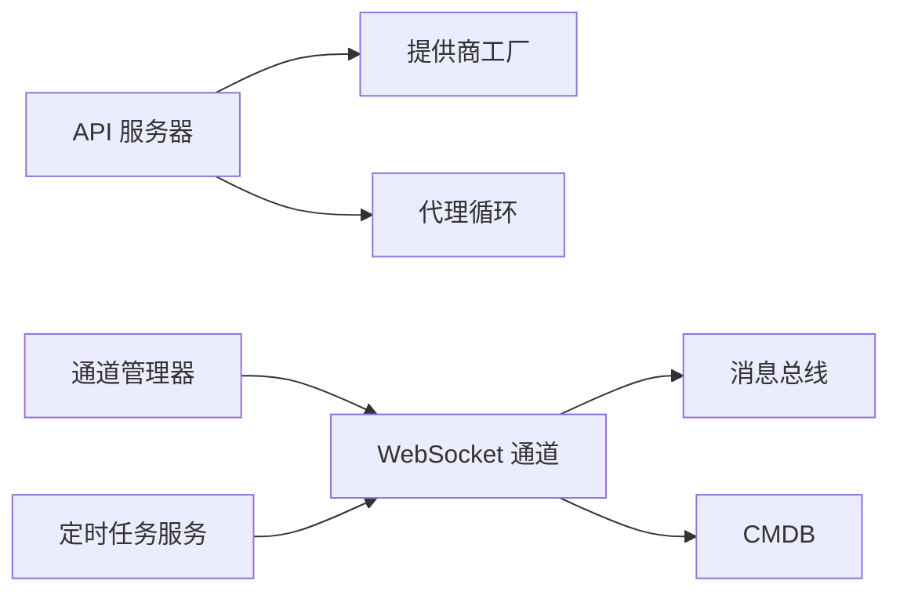

# 集成测试策略

<cite>
**本文引用的文件**
- [secbot/__init__.py](file://secbot/__init__.py)
- [secbot/api/server.py](file://secbot/api/server.py)
- [secbot/channels/manager.py](file://secbot/channels/manager.py)
- [secbot/channels/websocket.py](file://secbot/channels/websocket.py)
- [secbot/providers/factory.py](file://secbot/providers/factory.py)
- [secbot/cmdb/db.py](file://secbot/cmdb/db.py)
- [secbot/cron/service.py](file://secbot/cron/service.py)
- [tests/channels/ws_test_client.py](file://tests/channels/ws_test_client.py)
- [tests/api/test_events.py](file://tests/api/test_events.py)
- [tests/providers/test_providers_init.py](file://tests/providers/test_providers_init.py)
- [tests/cmdb/conftest.py](file://tests/cmdb/conftest.py)
- [webui/src/lib/secbot-client.ts](file://webui/src/lib/secbot-client.ts)
- [webui/src/lib/bootstrap.ts](file://webui/src/lib/bootstrap.ts)
</cite>

## 目录
1. [引言](#引言)
2. [项目结构](#项目结构)
3. [核心组件](#核心组件)
4. [架构总览](#架构总览)
5. [详细组件分析](#详细组件分析)
6. [依赖分析](#依赖分析)
7. [性能考虑](#性能考虑)
8. [故障排查指南](#故障排查指南)
9. [结论](#结论)
10. [附录](#附录)

## 引言
本策略面向 VAPT3/secbot 的模块间集成测试，覆盖以下方面：
- API 接口测试：OpenAI 兼容 API 的聊天补全与模型查询端点
- 通道系统测试：WebSocket 通道的握手、鉴权、路径路由、媒体分发与事件流
- 提供商集成测试：多提供商工厂与热重载行为
- 数据库集成测试：CMDB 初始化、迁移、事务与一致性
- WebSocket 通信测试：客户端-服务端交互、令牌签发与订阅管理
- 定时任务测试：Cron 服务的调度、持久化与运行历史
- 外部系统集成测试：第三方 API 模拟与网络通信
- 测试数据清理与状态重置：隔离性与幂等性保障

## 项目结构
secbot 采用“按功能域分层”的组织方式：
- secbot/api：HTTP API 服务器（aiohttp），提供 /v1/chat/completions 与 /v1/models
- secbot/channels：通道管理与具体通道实现（如 WebSocket）
- secbot/providers：LLM 提供商工厂与注册表
- secbot/cmdb：本地 CMDB（SQLite + SQLAlchemy Async）
- secbot/cron：定时任务服务（基于文件锁与 JSON 存储）
- tests：各子系统的单元与集成测试
- webui：前端客户端，通过 WebSocket 与后端交互



图示来源
- [secbot/api/server.py](file://secbot/api/server.py)
- [secbot/channels/manager.py](file://secbot/channels/manager.py)
- [secbot/channels/websocket.py](file://secbot/channels/websocket.py)
- [secbot/providers/factory.py](file://secbot/providers/factory.py)
- [secbot/cmdb/db.py](file://secbot/cmdb/db.py)
- [secbot/cron/service.py](file://secbot/cron/service.py)

章节来源
- [secbot/__init__.py](file://secbot/__init__.py)
- [secbot/api/server.py](file://secbot/api/server.py)
- [secbot/channels/manager.py](file://secbot/channels/manager.py)
- [secbot/channels/websocket.py](file://secbot/channels/websocket.py)
- [secbot/providers/factory.py](file://secbot/providers/factory.py)
- [secbot/cmdb/db.py](file://secbot/cmdb/db.py)
- [secbot/cron/service.py](file://secbot/cron/service.py)

## 核心组件
- API 服务器：负责解析请求、路由到代理循环、支持流式与非流式响应
- 通道管理器：统一启动/停止通道、出站消息派发、去重与重试
- WebSocket 通道：作为 WebSocket 服务器，提供 HTTP REST 辅助端点与事件流
- 提供商工厂：根据配置选择具体提供商实现，并应用生成参数
- CMDB：异步引擎与会话上下文管理，确保事务安全
- 定时任务服务：基于 JSON 文件存储的任务清单，带原子写入与运行历史

章节来源
- [secbot/api/server.py](file://secbot/api/server.py)
- [secbot/channels/manager.py](file://secbot/channels/manager.py)
- [secbot/channels/websocket.py](file://secbot/channels/websocket.py)
- [secbot/providers/factory.py](file://secbot/providers/factory.py)
- [secbot/cmdb/db.py](file://secbot/cmdb/db.py)
- [secbot/cron/service.py](file://secbot/cron/service.py)

## 架构总览
下图展示从 WebUI 到后端各组件的调用链路与数据流。



图示来源
- [secbot/channels/websocket.py](file://secbot/channels/websocket.py)
- [secbot/channels/manager.py](file://secbot/channels/manager.py)
- [secbot/cmdb/db.py](file://secbot/cmdb/db.py)
- [secbot/cron/service.py](file://secbot/cron/service.py)

## 详细组件分析

### API 接口测试策略
目标
- 验证 /v1/chat/completions 的 JSON 与 multipart 表单两种输入格式
- 验证 /v1/models 返回模型列表
- 验证健康检查 /health
- 验证超时、空响应回退与错误码

设计要点
- 使用 aiohttp 创建应用实例，注入代理循环与会话锁
- 流式模式使用 SSE，非流式返回标准 JSON
- 会话级互斥锁避免并发冲突
- 统一错误响应格式

```mermaid
sequenceDiagram
participant Client as "客户端"
participant API as "API 服务器"
participant Loop as "代理循环"
participant Lock as "会话锁"
Client->>API : POST /v1/chat/completions(JSON)
API->>API : 解析请求/校验模型
API->>Lock : 获取会话锁
API->>Loop : process_direct(content, media, session_key)
alt 流式
Loop-->>API : 分片回调
API-->>Client : SSE 数据流
else 非流式
Loop-->>API : 最终响应
API-->>Client : JSON 响应
end
API-->>Client : 错误码/超时处理
```

图示来源
- [secbot/api/server.py](file://secbot/api/server.py)

章节来源
- [secbot/api/server.py](file://secbot/api/server.py)

### 通道系统测试策略
目标
- 验证通道初始化、启动/停止与出站派发
- 验证消息去重、增量合并与指数退避重试
- 验证允许来源白名单与空列表保护

设计要点
- ChannelManager 负责发现与初始化通道，维护运行状态
- 出站派发器消费消息总线，按通道类型发送
- 增量消息合并减少 API 调用频率
- 重试策略与超时控制保证可靠性



图示来源
- [secbot/channels/manager.py](file://secbot/channels/manager.py)

章节来源
- [secbot/channels/manager.py](file://secbot/channels/manager.py)

### WebSocket 通信测试策略
目标
- 验证握手、鉴权（静态令牌/签发令牌）、路径规范化与 404
- 验证媒体签名 URL、REST 辅助端点与事件流
- 验证客户端 SDK 的连接、断开与重连逻辑

设计要点
- WebSocketChannel 支持静态令牌与签发令牌两种鉴权模式
- 提供 /api/* REST 辅助端点（会话、通知、事件、报告等）
- 客户端通过 SecbotClient 连接，支持 newChat、消息收发与事件监听



图示来源
- [secbot/channels/websocket.py](file://secbot/channels/websocket.py)
- [webui/src/lib/secbot-client.ts](file://webui/src/lib/secbot-client.ts)
- [webui/src/lib/bootstrap.ts](file://webui/src/lib/bootstrap.ts)

章节来源
- [secbot/channels/websocket.py](file://secbot/channels/websocket.py)
- [tests/channels/ws_test_client.py](file://tests/channels/ws_test_client.py)
- [webui/src/lib/secbot-client.ts](file://webui/src/lib/secbot-client.ts)
- [webui/src/lib/bootstrap.ts](file://webui/src/lib/bootstrap.ts)

### 提供商集成测试策略
目标
- 验证提供商工厂按配置选择正确实现
- 验证热重载（配置变更触发）与签名对比
- 验证懒加载与显式导入行为

设计要点
- make_provider 根据模型与提供商名称选择实现
- 签名覆盖 api_key、api_base、extra_headers、extra_body 等
- 单测验证 __all__ 导出与支持进度增量



图示来源
- [secbot/providers/factory.py](file://secbot/providers/factory.py)

章节来源
- [secbot/providers/factory.py](file://secbot/providers/factory.py)
- [tests/providers/test_providers_init.py](file://tests/providers/test_providers_init.py)

### 数据库集成测试策略（CMDB）
目标
- 验证引擎初始化、会话生命周期与事务提交/回滚
- 验证迁移与模式一致性
- 验证隔离性与并发安全（WAL）

设计要点
- 使用 per-test 临时 SQLite 文件，避免内存数据库导致的连接隔离问题
- 显式创建所有表，确保完整模式
- 通过 get_session 上下文管理事务，异常自动回滚
- dispose_engine 清理资源



图示来源
- [secbot/cmdb/db.py](file://secbot/cmdb/db.py)
- [tests/cmdb/conftest.py](file://tests/cmdb/conftest.py)

章节来源
- [secbot/cmdb/db.py](file://secbot/cmdb/db.py)
- [tests/cmdb/conftest.py](file://tests/cmdb/conftest.py)

### 定时任务测试策略（Cron）
目标
- 验证 at/every/cron 三种调度类型的计算
- 验证任务持久化（JSON 文件）、原子写入与 fsync
- 验证运行历史、禁用/启用、手动执行与状态查询

设计要点
- 基于文件锁的并发控制，避免竞态
- 定时器最小唤醒间隔与最大睡眠时间限制
- 一次性任务在完成后删除或禁用
- 运行历史保留最近 N 条



图示来源
- [secbot/cron/service.py](file://secbot/cron/service.py)

章节来源
- [secbot/cron/service.py](file://secbot/cron/service.py)

### 外部系统集成测试最佳实践
- 第三方 API 模拟：使用 HTTP 客户端（如 httpx）对 WebSocket 的签发端点进行请求，断言状态码与响应结构
- 网络通信测试：通过 WsTestClient 验证握手、鉴权失败、路径错误与大消息处理
- 事件流测试：利用活动事件缓冲区（EventBuffer）发布事件，断言窗口过滤与限制

章节来源
- [tests/channels/ws_test_client.py](file://tests/channels/ws_test_client.py)
- [tests/api/test_events.py](file://tests/api/test_events.py)

## 依赖分析
- API 服务器依赖提供商工厂与会话锁，输出到代理循环
- 通道管理器依赖消息总线与通道插件发现机制
- WebSocket 通道依赖会话管理器与媒体签名能力
- CMDB 依赖 SQLAlchemy 异步引擎与会话上下文
- 定时任务服务依赖文件锁与 JSON 存储



图示来源
- [secbot/api/server.py](file://secbot/api/server.py)
- [secbot/providers/factory.py](file://secbot/providers/factory.py)
- [secbot/channels/manager.py](file://secbot/channels/manager.py)
- [secbot/channels/websocket.py](file://secbot/channels/websocket.py)
- [secbot/cmdb/db.py](file://secbot/cmdb/db.py)
- [secbot/cron/service.py](file://secbot/cron/service.py)

章节来源
- [secbot/api/server.py](file://secbot/api/server.py)
- [secbot/providers/factory.py](file://secbot/providers/factory.py)
- [secbot/channels/manager.py](file://secbot/channels/manager.py)
- [secbot/channels/websocket.py](file://secbot/channels/websocket.py)
- [secbot/cmdb/db.py](file://secbot/cmdb/db.py)
- [secbot/cron/service.py](file://secbot/cron/service.py)

## 性能考虑
- 流式传输：SSE 分片与增量合并降低 API 调用频率，提升延迟表现
- 会话锁：避免并发写入冲突，但需注意锁粒度与超时设置
- 定时器节流：最小唤醒间隔与最大睡眠时间限制，平衡实时性与 CPU 占用
- 数据库 WAL：开启 WAL 模式支持多读单写，减少“数据库被锁定”错误
- 重试退避：指数退避减少对下游的压力，配合超时与取消处理

## 故障排查指南
- API 服务器
  - 超时：检查请求超时配置与代理循环阻塞点
  - 空响应：验证回退逻辑与重试策略
  - 文件大小限制：确认上传文件大小与媒体目录权限
- 通道系统
  - 重复消息：检查指纹去重与 origin_reply_fingerprints
  - 重试失败：查看日志与退避延迟
  - 允许来源为空：系统启动时会拒绝空列表配置
- WebSocket
  - 鉴权失败：核对静态令牌与签发令牌密钥
  - 路径错误：确认路径规范化与升级请求识别
  - 媒体签名：校验 HMAC 签名与媒体目录访问
- CMDB
  - 事务未提交：确认 get_session 上下文管理器使用
  - 并发冲突：检查 WAL 与 busy_timeout 设置
- 定时任务
  - 存储损坏：服务启动时会保留损坏文件并拒绝覆盖
  - 运行历史溢出：确认历史条数上限

章节来源
- [secbot/api/server.py](file://secbot/api/server.py)
- [secbot/channels/manager.py](file://secbot/channels/manager.py)
- [secbot/channels/websocket.py](file://secbot/channels/websocket.py)
- [secbot/cmdb/db.py](file://secbot/cmdb/db.py)
- [secbot/cron/service.py](file://secbot/cron/service.py)

## 结论
本策略以“边界契约清晰、跨层验证到位、隔离与幂等优先”为核心原则，结合现有代码实现与测试工具，构建了覆盖 API、通道、提供商、数据库、定时任务与外部系统的关键集成测试方案。通过统一的测试夹具与客户端工具，确保测试可重复、可观测且易于维护。

## 附录
- 测试数据清理与状态重置
  - CMDB：使用 per-test 临时文件与显式 dispose_engine
  - WebSocket：重置活动实例引用，清理令牌池
  - 定时任务：文件锁与原子写入，避免竞态与损坏
  - 事件流：重置全局事件缓冲区，确保测试隔离

章节来源
- [tests/cmdb/conftest.py](file://tests/cmdb/conftest.py)
- [secbot/channels/websocket.py](file://secbot/channels/websocket.py)
- [secbot/cron/service.py](file://secbot/cron/service.py)
- [tests/api/test_events.py](file://tests/api/test_events.py)