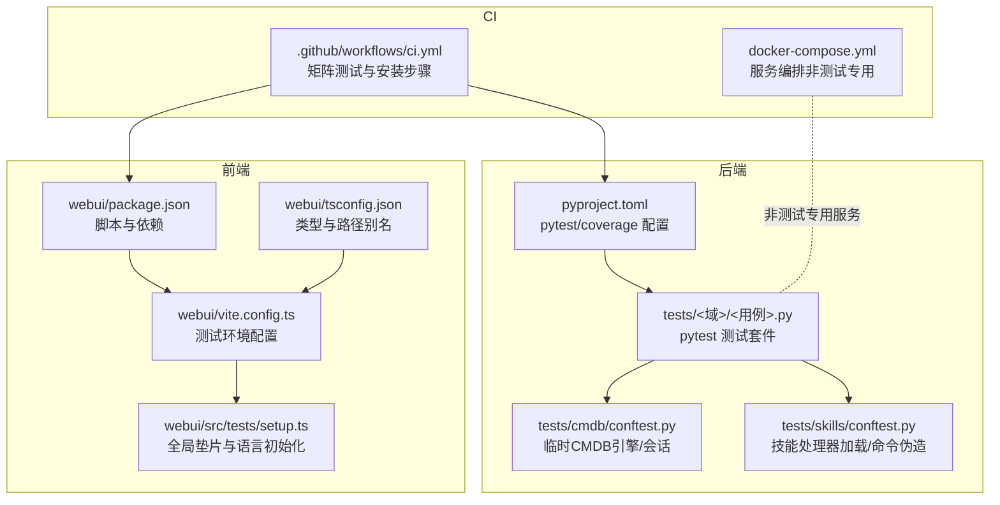
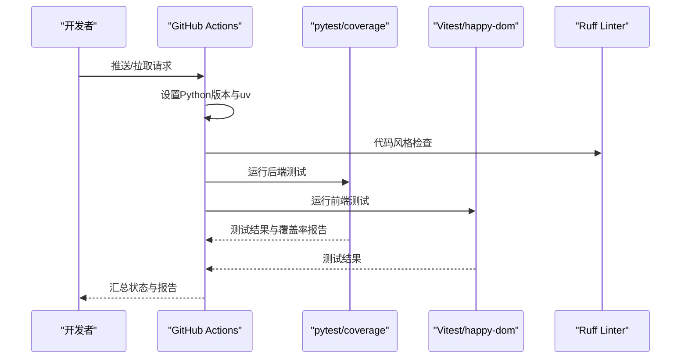
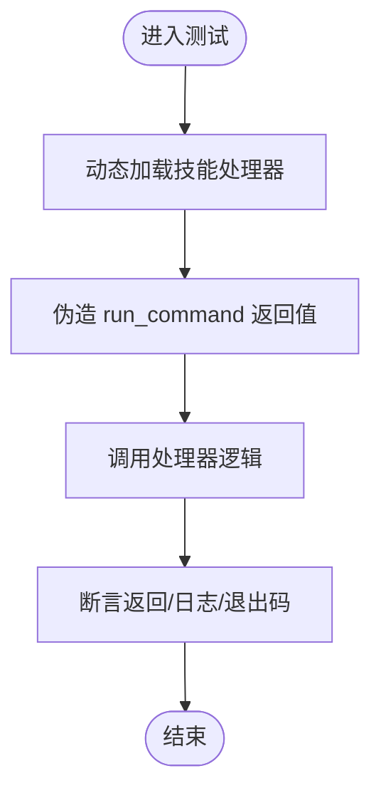
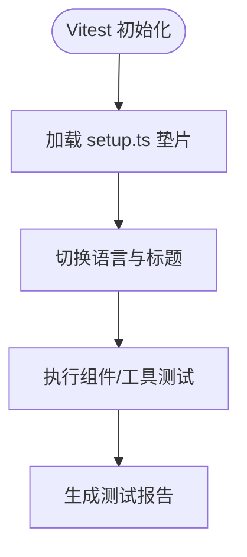
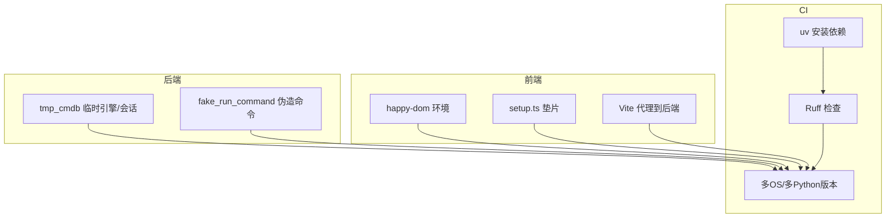
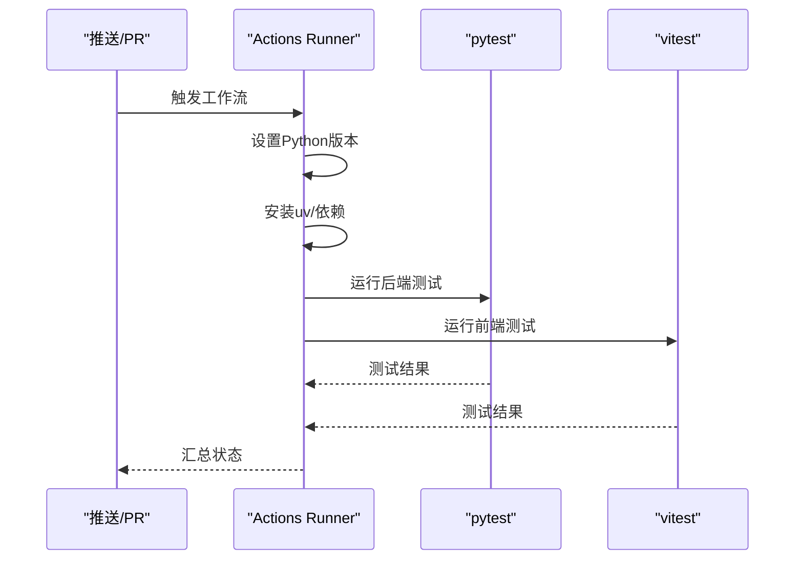
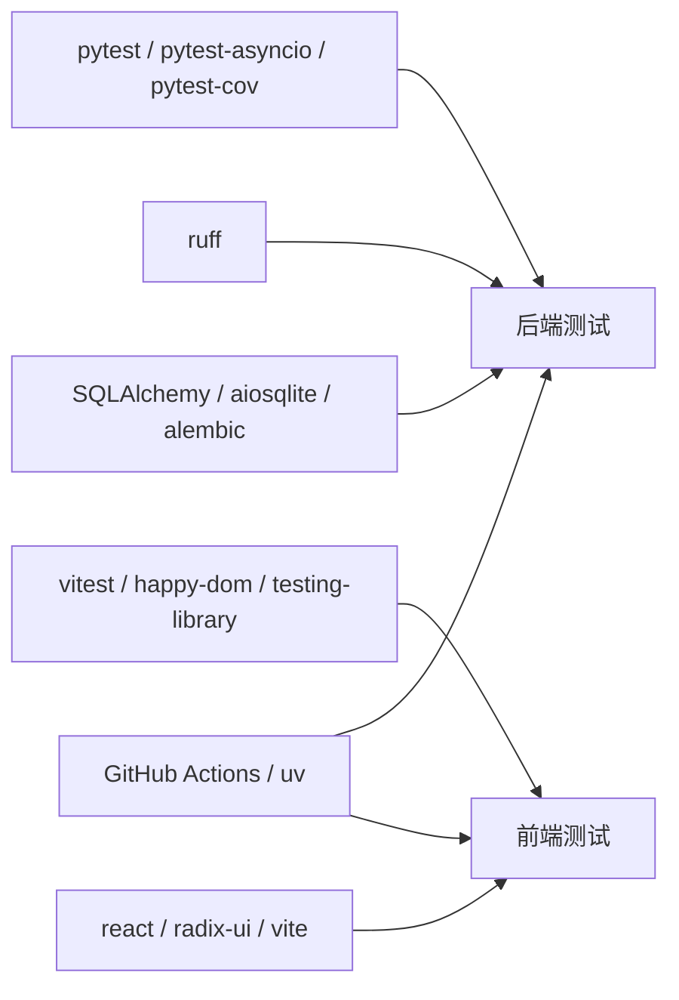

# 测试策略与覆盖率

<cite>
**本文引用的文件**
- [pyproject.toml](file://pyproject.toml)
- [.github/workflows/ci.yml](file://.github/workflows/ci.yml)
- [docker-compose.yml](file://docker-compose.yml)
- [tests/skills/conftest.py](file://tests/skills/conftest.py)
- [tests/cmdb/conftest.py](file://tests/cmdb/conftest.py)
- [webui/package.json](file://webui/package.json)
- [webui/vite.config.ts](file://webui/vite.config.ts)
- [webui/src/tests/setup.ts](file://webui/src/tests/setup.ts)
- [webui/tsconfig.json](file://webui/tsconfig.json)
</cite>

## 目录
1. [引言](#引言)
2. [项目结构](#项目结构)
3. [核心组件](#核心组件)
4. [架构总览](#架构总览)
5. [详细组件分析](#详细组件分析)
6. [依赖分析](#依赖分析)
7. [性能考虑](#性能考虑)
8. [故障排查指南](#故障排查指南)
9. [结论](#结论)
10. [附录](#附录)

## 引言
本文件系统化阐述本项目的测试策略与覆盖率要求，覆盖单元测试、集成测试与端到端测试的组织方式与实施方法；明确Python后端与前端React组件的覆盖率目标与配置；给出测试环境配置（含测试数据库、模拟服务与工具链）；提供测试编写指南（用例设计原则、断言模式、测试数据管理）；说明CI中的测试流程与自动化执行；并补充性能测试与安全测试的相关要求。

## 项目结构
本项目采用“后端Python + 前端React”的双栈架构，并在仓库根目录统一维护测试套件与CI流程：
- 后端测试：位于 tests/ 下，按功能域分层组织（如 agent、channels、cli、cmdb、command、config、cron、heartbeat、providers、report、security、session、skills、tools、utils 等），使用 pytest 作为测试框架，pytest-asyncio 支持异步测试。
- 前端测试：位于 webui/src/tests/ 下，使用 Vitest + happy-dom 模拟浏览器环境，配合 Testing Library 断言。
- CI：通过 GitHub Actions 在多平台、多Python版本矩阵中运行后端测试与代码检查。
- 测试隔离：后端通过 per-test 临时SQLite引擎与会话确保隔离；前端通过 Vitest setup 文件注入全局垫片与语言环境。

**图表来源**
- [pyproject.toml:153-169](file://pyproject.toml#L153-L169)
- [tests/cmdb/conftest.py:23-37](file://tests/cmdb/conftest.py#L23-L37)
- [tests/skills/conftest.py:20-87](file://tests/skills/conftest.py#L20-L87)
- [webui/package.json:6-13](file://webui/package.json#L6-L13)
- [webui/vite.config.ts:59-65](file://webui/vite.config.ts#L59-L65)
- [webui/src/tests/setup.ts:1-83](file://webui/src/tests/setup.ts#L1-L83)
- [.github/workflows/ci.yml:1-40](file://.github/workflows/ci.yml#L1-L40)
- [docker-compose.yml:15-56](file://docker-compose.yml#L15-L56)

**章节来源**
- [pyproject.toml:153-169](file://pyproject.toml#L153-L169)
- [.github/workflows/ci.yml:1-40](file://.github/workflows/ci.yml#L1-40)
- [docker-compose.yml:15-56](file://docker-compose.yml#L15-L56)
- [webui/package.json:6-13](file://webui/package.json#L6-L13)
- [webui/vite.config.ts:59-65](file://webui/vite.config.ts#L59-L65)
- [webui/src/tests/setup.ts:1-83](file://webui/src/tests/setup.ts#L1-L83)

## 核心组件
- 后端测试框架与覆盖率
  - 使用 pytest 与 pytest-asyncio 运行测试；通过 pytest.ini 设置 testpaths 为 tests/，并启用 asyncio_mode 自动模式。
  - 覆盖率由 coverage 控制，源码范围限制在 secbot/，并排除 tests/* 与 **/tests/*。
  - 推荐覆盖率目标：后端整体行覆盖率不低于 80%，关键路径不低于 90%。
- 前端测试框架与覆盖率
  - 使用 Vitest + happy-dom 模拟 DOM；通过 tsconfig.json 启用严格类型与路径别名；通过 vite.config.ts 的 test 字段配置环境与 setupFiles。
  - 推荐覆盖率目标：前端组件与工具函数行覆盖率不低于 85%，关键交互路径不低于 90%。
- 测试隔离与环境
  - 后端：每个CMDB相关测试使用 tmp_cmdb fixture 创建独立 SQLite 文件并应用完整模型元数据，避免内存数据库导致连接隔离问题。
  - 技能测试：通过 handler_loader 动态加载技能处理器模块，结合 fake_run_command 伪造外部命令执行，确保可重复性与可控性。
  - 前端：setup.ts 注入 crypto.randomUUID、localStorage 与 window.alert 的最小实现，保证组件错误分支与国际化初始化稳定运行。
- CI与工具链
  - GitHub Actions 使用多操作系统与多Python版本矩阵；使用 uv 安装依赖；先Ruff检查，再运行 pytest。
  - 前端通过 npm scripts 执行 Vitest 测试（webui 目录下）。

**章节来源**
- [pyproject.toml:153-169](file://pyproject.toml#L153-L169)
- [tests/cmdb/conftest.py:23-37](file://tests/cmdb/conftest.py#L23-L37)
- [tests/skills/conftest.py:20-87](file://tests/skills/conftest.py#L20-L87)
- [webui/vite.config.ts:59-65](file://webui/vite.config.ts#L59-L65)
- [webui/src/tests/setup.ts:1-83](file://webui/src/tests/setup.ts#L1-L83)
- [.github/workflows/ci.yml:10-40](file://.github/workflows/ci.yml#L10-L40)

## 架构总览
下图展示测试体系在CI与本地开发中的交互关系，以及后端与前端测试的关键配置点。

**图表来源**
- [.github/workflows/ci.yml:10-40](file://.github/workflows/ci.yml#L10-L40)
- [pyproject.toml:153-169](file://pyproject.toml#L153-L169)
- [webui/package.json:6-13](file://webui/package.json#L6-L13)

## 详细组件分析

### 后端测试组织与隔离
- 测试目录结构
  - tests/ 下按功能域划分子目录，便于职责清晰与并行执行；例如 agent、channels、cli、cmdb、command、config、cron、heartbeat、providers、report、security、session、skills、tools、utils。
- 隔离策略
  - CMDB测试：通过 tmp_cmdb fixture 为每个测试生成独立 SQLite 文件，初始化引擎并创建所有表，结束后释放引擎，确保并发连接共享状态一致。
  - 技能测试：通过 handler_loader 动态导入技能处理器模块；通过 fake_run_command 伪造 run_command，写入 raw_log_path 并返回 SandboxResult，便于断言输出与退出码。
- 异步支持
  - pytest-asyncio 已在 pytest.ini 中启用自动模式，适合测试 SQLAlchemy 异步会话与事件循环相关逻辑。

**图表来源**
- [tests/skills/conftest.py:20-87](file://tests/skills/conftest.py#L20-L87)

**章节来源**
- [tests/cmdb/conftest.py:23-37](file://tests/cmdb/conftest.py#L23-L37)
- [tests/skills/conftest.py:20-87](file://tests/skills/conftest.py#L20-L87)
- [pyproject.toml:153-169](file://pyproject.toml#L153-L169)

### 前端测试组织与隔离
- 测试目录与工具链
  - webui/src/tests/ 下存放组件与工具函数测试；package.json 提供 test 脚本；vite.config.ts 的 test 字段指定环境为 happy-dom，并加载 setup.ts。
- 全局垫片与语言初始化
  - setup.ts 注入 crypto.randomUUID、localStorage 与 window.alert 的最小实现，确保组件在测试环境下稳定运行；beforeEach 将 i18n 切换到英文并设置 document 标题与语言偏好。
- 类型与路径别名
  - tsconfig.json 启用严格模式与路径别名 @/*，提升类型安全与导入一致性。

**图表来源**
- [webui/vite.config.ts:59-65](file://webui/vite.config.ts#L59-L65)
- [webui/src/tests/setup.ts:1-83](file://webui/src/tests/setup.ts#L1-L83)
- [webui/tsconfig.json:24-32](file://webui/tsconfig.json#L24-L32)

**章节来源**
- [webui/package.json:6-13](file://webui/package.json#L6-L13)
- [webui/vite.config.ts:59-65](file://webui/vite.config.ts#L59-L65)
- [webui/src/tests/setup.ts:1-83](file://webui/src/tests/setup.ts#L1-L83)
- [webui/tsconfig.json:24-32](file://webui/tsconfig.json#L24-L32)

### 测试覆盖率目标与配置
- 后端覆盖率
  - 覆盖率源码范围：secbot/；排除 tests/* 与 **/tests/*；建议目标：整体行覆盖率 ≥ 80%，关键路径 ≥ 90%。
- 前端覆盖率
  - 建议目标：组件与工具函数行覆盖率 ≥ 85%，关键交互路径 ≥ 90%。
- 覆盖率收集
  - 后端：pytest 与 pytest-cov 组合；pyproject.toml 中已配置 coverage.run.source 与 coverage.report.exclude_lines。
  - 前端：Vitest 默认支持覆盖率统计，可在 CI 中启用并上传报告。

**章节来源**
- [pyproject.toml:157-169](file://pyproject.toml#L157-L169)
- [webui/package.json:6-13](file://webui/package.json#L6-L13)

### 测试环境配置
- 后端测试数据库
  - 使用 tmp_cmdb fixture 为每个测试创建独立 SQLite 文件，初始化引擎并创建所有表，结束后释放引擎，避免内存数据库导致的连接隔离问题。
- 模拟服务与外部依赖
  - 技能测试通过 fake_run_command 伪造外部命令执行，便于断言输出与退出码；CMDB测试通过 SQLAlchemy 异步会话与临时文件确保隔离。
- 前端测试环境
  - 使用 happy-dom 作为 DOM 环境；setup.ts 注入必要垫片；Vite 开发服务器代理到后端API，便于端到端场景下的联调。
- CI环境
  - 多操作系统与多Python版本矩阵；使用 uv 安装依赖；先Ruff检查，再运行 pytest。

**图表来源**
- [tests/cmdb/conftest.py:23-37](file://tests/cmdb/conftest.py#L23-L37)
- [tests/skills/conftest.py:54-87](file://tests/skills/conftest.py#L54-L87)
- [webui/vite.config.ts:41-58](file://webui/vite.config.ts#L41-L58)
- [webui/src/tests/setup.ts:1-83](file://webui/src/tests/setup.ts#L1-L83)
- [.github/workflows/ci.yml:10-40](file://.github/workflows/ci.yml#L10-L40)

**章节来源**
- [tests/cmdb/conftest.py:23-37](file://tests/cmdb/conftest.py#L23-L37)
- [tests/skills/conftest.py:54-87](file://tests/skills/conftest.py#L54-L87)
- [webui/vite.config.ts:41-58](file://webui/vite.config.ts#L41-L58)
- [webui/src/tests/setup.ts:1-83](file://webui/src/tests/setup.ts#L1-L83)
- [.github/workflows/ci.yml:10-40](file://.github/workflows/ci.yml#L10-L40)

### 测试编写指南
- 单元测试
  - 以“输入/行为/输出”三段式设计：准备输入（参数/上下文/临时文件）、调用被测函数/类、断言结果与副作用。
  - 对异步逻辑使用 pytest-asyncio；对数据库操作使用 tmp_cmdb；对外部命令使用 fake_run_command。
- 集成测试
  - 聚合多个组件协作场景（如技能处理器与命令执行、WebSocket通道与消息路由）；通过最小化外部依赖（happy-dom/Vite代理）实现快速反馈。
- 端到端测试
  - 基于Vite代理与happy-dom，模拟真实用户交互（如发送消息、查看响应、切换语言）；对关键流程进行回归验证。
- 断言模式
  - 行为断言优先：断言函数调用次数、参数匹配、异常抛出；对状态断言次之：断言数据库记录、文件内容、网络请求。
- 测试数据管理
  - 使用 tmp_path 生成临时目录；CMDB测试使用 tmp_cmdb 生成独立数据库文件；技能测试通过 make_ctx 构造上下文对象。
- 可重复性与可维护性
  - 固定随机种子（如需要）；避免全局状态污染；将公共fixture集中管理（如 conftest.py）。

**章节来源**
- [tests/skills/conftest.py:20-87](file://tests/skills/conftest.py#L20-L87)
- [tests/cmdb/conftest.py:23-37](file://tests/cmdb/conftest.py#L23-L37)
- [webui/src/tests/setup.ts:1-83](file://webui/src/tests/setup.ts#L1-L83)

### 持续集成中的测试流程与自动化
- 触发条件
  - 在 main 与 nightly 分支推送或拉取请求时触发。
- 步骤概览
  - 检出代码 → 设置Python版本 → 安装 uv → 安装系统依赖（Linux）→ 安装Python依赖（uv sync）→ Ruff检查 → 运行pytest。
- 并行与矩阵
  - OS矩阵：ubuntu-latest、windows-latest；Python版本矩阵：3.11、3.12、3.13、3.14。
- 前端测试
  - 通过 npm scripts 在 webui 目录下执行 Vitest 测试；可在CI中增加 Vitest 步骤以覆盖前端。

**图表来源**
- [.github/workflows/ci.yml:10-40](file://.github/workflows/ci.yml#L10-L40)

**章节来源**
- [.github/workflows/ci.yml:1-40](file://.github/workflows/ci.yml#L1-L40)

### 性能测试与安全测试要求
- 性能测试
  - 建议针对高频路径（如消息路由、技能执行、数据库查询）引入基准测试；使用 pytest-benchmark 或自定义计时器；在CI中设置阈值告警。
- 安全测试
  - 前端：确保URL与资源加载的安全策略（CSP），对用户输入进行严格校验与转义；对WebSocket升级路径进行权限控制。
  - 后端：对SQLAlchemy查询进行注入防护；对外部命令执行进行白名单与参数校验；对文件系统访问进行沙箱限制（参考 secbot/security 与 tools 中的安全相关测试）。

[本节为通用指导，不直接分析具体文件，故不附“章节来源”]

## 依赖分析
- 后端依赖
  - pytest、pytest-asyncio、pytest-cov 用于测试与覆盖率；ruff 用于静态检查；SQLAlchemy/aiosqlite 用于异步数据库；alembic 用于迁移。
- 前端依赖
  - vitest、happy-dom、@testing-library/* 用于前端测试；react、react-dom、@radix-ui/* 用于组件；Vite 提供开发与构建工具链。
- CI依赖
  - GitHub Actions、astral-sh/setup-uv、actions/setup-python、uv sync。

**图表来源**
- [pyproject.toml:103-110](file://pyproject.toml#L103-L110)
- [webui/package.json:42-61](file://webui/package.json#L42-L61)
- [.github/workflows/ci.yml:25-39](file://.github/workflows/ci.yml#L25-L39)

**章节来源**
- [pyproject.toml:103-110](file://pyproject.toml#L103-L110)
- [webui/package.json:42-61](file://webui/package.json#L42-L61)
- [.github/workflows/ci.yml:25-39](file://.github/workflows/ci.yml#L25-L39)

## 性能考虑
- 测试执行效率
  - 合理拆分测试套件，利用 pytest 并行能力；减少不必要的外部依赖与网络请求；对数据库与文件系统操作使用最小化隔离。
- 覆盖率成本
  - 在CI中开启覆盖率统计，但避免过度细化导致报告膨胀；对热点路径重点覆盖。
- 前端测试稳定性
  - 使用 happy-dom 减少浏览器实例开销；通过 Vite 代理降低端到端测试的外部耦合。

[本节为通用指导，不直接分析具体文件，故不附“章节来源”]

## 故障排查指南
- 后端测试常见问题
  - 数据库连接隔离：确保使用 tmp_cmdb 创建独立 SQLite 文件，避免 :memory: 导致的连接隔离差异。
  - 异步测试：确认 pytest-asyncio 已启用，异步会话正确关闭。
  - 外部命令：使用 fake_run_command 伪造返回值，避免真实系统命令影响测试稳定性。
- 前端测试常见问题
  - 缺失垫片：若出现 crypto.randomUUID、localStorage 或 window.alert 相关错误，请检查 setup.ts 是否正确加载。
  - 语言与国际化：确保 beforeEach 中 i18n 切换与 document.title 设置生效。
- CI失败排查
  - 依赖安装：确认 uv sync 成功且系统依赖（Linux）已安装。
  - 版本兼容：在多Python版本矩阵中定位问题版本；必要时固定兼容范围。

**章节来源**
- [tests/cmdb/conftest.py:23-37](file://tests/cmdb/conftest.py#L23-L37)
- [tests/skills/conftest.py:54-87](file://tests/skills/conftest.py#L54-L87)
- [webui/src/tests/setup.ts:1-83](file://webui/src/tests/setup.ts#L1-L83)
- [.github/workflows/ci.yml:25-39](file://.github/workflows/ci.yml#L25-L39)

## 结论
本项目已建立完善的后端与前端测试体系：后端通过 pytest 与 pytest-asyncio 实现单元与集成测试，借助 tmp_cmdb 与 fake_run_command 确保隔离与可控；前端通过 Vitest + happy-dom 实现组件级测试与国际化、垫片初始化保障；CI通过多矩阵与uv工具链实现自动化与一致性。建议在现有基础上进一步完善性能与安全专项测试，并在CI中统一收集前后端覆盖率报告，持续提升质量门禁。

## 附录
- 快速执行
  - 后端：在项目根目录执行 pytest（pytest.ini 已配置 testpaths 与 asyncio_mode）。
  - 前端：在 webui 目录执行 npm test（package.json 已配置 test 脚本）。
- 覆盖率导出
  - 后端：pytest 与 pytest-cov 组合；pyproject.toml 已配置覆盖率源码范围与排除规则。
  - 前端：Vitest 默认支持覆盖率统计，可在CI中启用并上传报告。

**章节来源**
- [pyproject.toml:153-169](file://pyproject.toml#L153-L169)
- [webui/package.json:6-13](file://webui/package.json#L6-L13)