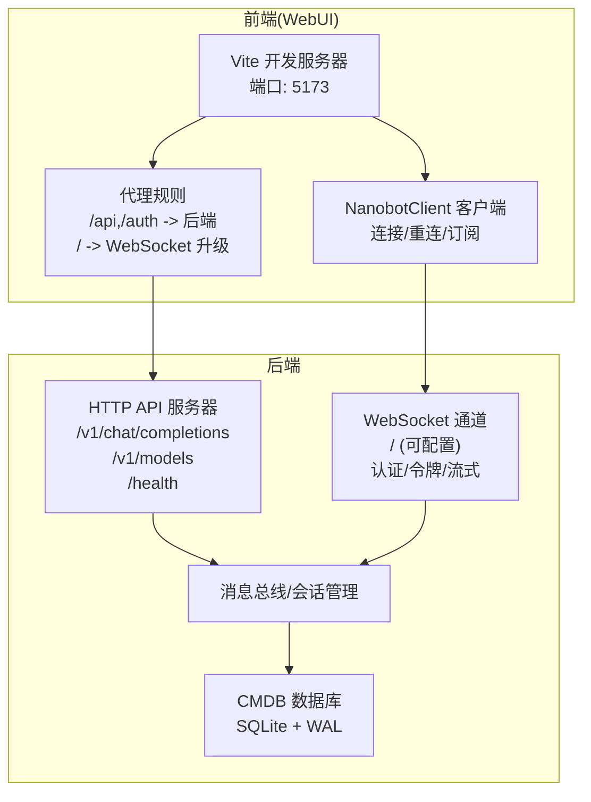
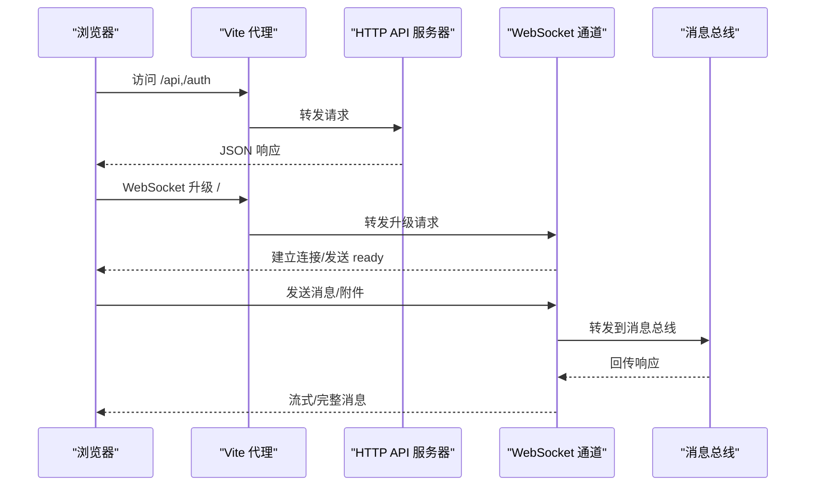
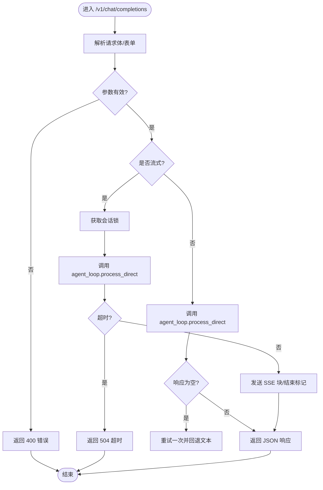
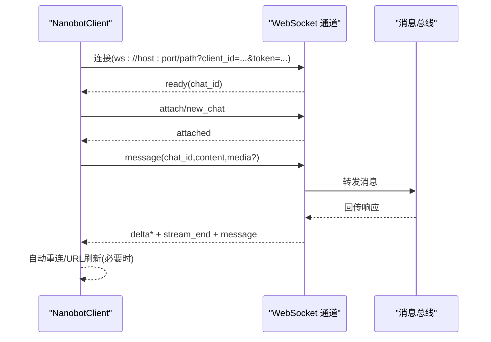
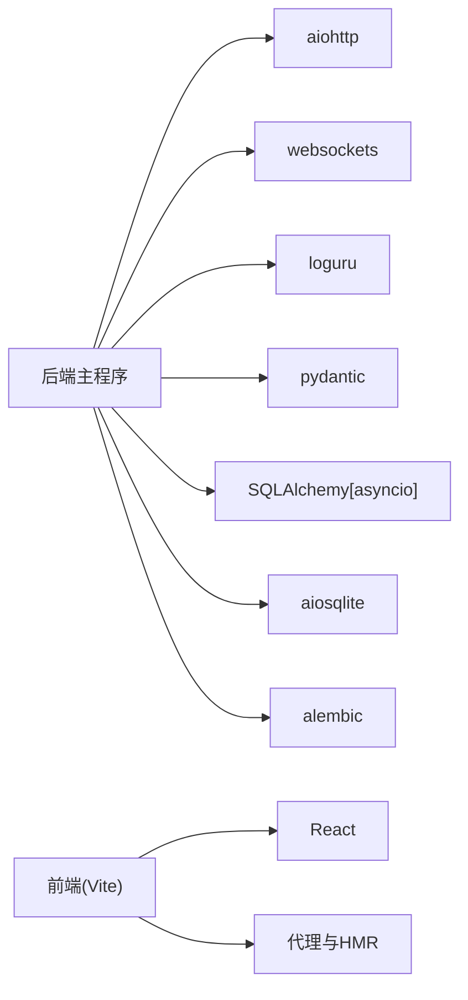

# 调试与故障排除

<cite>
**本文引用的文件**
- [secbot/api/server.py](file://secbot/api/server.py)
- [secbot/channels/websocket.py](file://secbot/channels/websocket.py)
- [webui/src/lib/nanobot-client.ts](file://webui/src/lib/nanobot-client.ts)
- [docs/websocket.md](file://docs/websocket.md)
- [secbot/utils/logging_bridge.py](file://secbot/utils/logging_bridge.py)
- [pyproject.toml](file://pyproject.toml)
- [Dockerfile](file://Dockerfile)
- [secbot/config/loader.py](file://secbot/config/loader.py)
- [webui/vite.config.ts](file://webui/vite.config.ts)
- [tests/channels/test_websocket_integration.py](file://tests/channels/test_websocket_integration.py)
- [webui/src/components/settings/SettingsView.tsx](file://webui/src/components/settings/SettingsView.tsx)
- [secbot/cmdb/db.py](file://secbot/cmdb/db.py)
- [secbot/cmdb/alembic.ini](file://secbot/cmdb/alembic.ini)
- [secbot/cmdb/migrations/env.py](file://secbot/cmdb/migrations/env.py)
</cite>

## 目录
1. [简介](#简介)
2. [项目结构](#项目结构)
3. [核心组件](#核心组件)
4. [架构总览](#架构总览)
5. [详细组件分析](#详细组件分析)
6. [依赖分析](#依赖分析)
7. [性能考虑](#性能考虑)
8. [故障排除指南](#故障排除指南)
9. [结论](#结论)
10. [附录](#附录)

## 简介
本指南聚焦于该代码库的调试与故障排除实践，覆盖后端日志分析、前端控制台调试、WebSocket 连接调试、调试工具使用、常见问题诊断流程、性能定位方法、错误监控与告警配置、生产环境排查最佳实践与应急处理方案，并提供调试技巧与开发效率提升建议。文档以实际源码为依据，确保可操作性与准确性。

## 项目结构
该项目采用前后端分离与多通道交互的架构：
- 后端服务通过 HTTP API 提供 OpenAI 兼容接口与健康检查，同时支持作为 WebSocket 服务器承载实时会话。
- 前端基于 React/Vite 构建，通过代理将 /api、/auth 与 / 路径转发至后端，WebSocket 升级在 / 根路径由后端处理。
- 配置系统采用 Pydantic 模型加载与校验，支持环境变量解析与迁移。
- 数据层使用 SQLAlchemy 异步引擎与 Alembic 迁移，SQLite 作为本地默认存储。

图表来源
- [webui/vite.config.ts:29-58](file://webui/vite.config.ts#L29-L58)
- [secbot/api/server.py:381-401](file://secbot/api/server.py#L381-L401)
- [secbot/channels/websocket.py:414-488](file://secbot/channels/websocket.py#L414-L488)
- [secbot/cmdb/db.py:64-93](file://secbot/cmdb/db.py#L64-L93)

章节来源
- [webui/vite.config.ts:1-66](file://webui/vite.config.ts#L1-L66)
- [secbot/api/server.py:381-401](file://secbot/api/server.py#L381-L401)
- [secbot/channels/websocket.py:414-488](file://secbot/channels/websocket.py#L414-L488)
- [secbot/cmdb/db.py:64-93](file://secbot/cmdb/db.py#L64-L93)

## 核心组件
- HTTP API 服务器：提供 OpenAI 兼容的聊天补全与模型列表接口，支持 JSON 与 multipart/form-data，内置超时与错误处理。
- WebSocket 通道：作为服务器向客户端推送事件，支持令牌鉴权、多会话复用、流式输出与媒体文件能力。
- 前端 NanobotClient：封装 WebSocket 连接、自动重连、按 chat_id 分发事件、错误上报与 URL 刷新。
- 日志桥接：将标准库日志桥接到 loguru，统一日志格式与级别。
- 配置加载：从用户目录加载配置，支持迁移、SSRF 白名单应用与环境变量解析。
- 数据库与迁移：异步 SQLAlchemy 引擎、WAL 模式、外键与忙等待优化，Alembic 离线/在线迁移。

章节来源
- [secbot/api/server.py:194-351](file://secbot/api/server.py#L194-L351)
- [secbot/channels/websocket.py:414-780](file://secbot/channels/websocket.py#L414-L780)
- [webui/src/lib/nanobot-client.ts:57-320](file://webui/src/lib/nanobot-client.ts#L57-L320)
- [secbot/utils/logging_bridge.py:1-48](file://secbot/utils/logging_bridge.py#L1-L48)
- [secbot/config/loader.py:32-81](file://secbot/config/loader.py#L32-L81)
- [secbot/cmdb/db.py:64-132](file://secbot/cmdb/db.py#L64-L132)

## 架构总览
后端通过 aiohttp 提供 HTTP API，通过 websockets 作为 WebSocket 服务器。前端通过 Vite 代理将 / 与 /api 路径转发到后端，WebSocket 升级在根路径由后端处理。配置与数据库分别负责运行参数与持久化数据。

图表来源
- [webui/vite.config.ts:41-57](file://webui/vite.config.ts#L41-L57)
- [secbot/api/server.py:397-399](file://secbot/api/server.py#L397-L399)
- [secbot/channels/websocket.py:604-624](file://secbot/channels/websocket.py#L604-L624)

## 详细组件分析

### HTTP API 服务器调试要点
- 关键路由与行为
  - /v1/chat/completions：支持 JSON 与 multipart/form-data；流式与非流式两种路径；超时控制与空响应回退。
  - /v1/models：返回可用模型信息。
  - /health：健康检查。
- 错误处理与日志
  - 对无效 JSON、文件过大、解析异常等进行结构化错误返回与日志记录。
  - 请求超时与内部错误统一映射为 HTTP 5xx。
- 调试建议
  - 使用 curl 或 HTTP 客户端验证路由与参数。
  - 观察后端日志中请求摘要与异常堆栈，结合会话锁与超时配置定位并发与阻塞问题。

图表来源
- [secbot/api/server.py:194-351](file://secbot/api/server.py#L194-L351)

章节来源
- [secbot/api/server.py:194-351](file://secbot/api/server.py#L194-L351)

### WebSocket 通道调试要点
- 连接与认证
  - 支持静态令牌与短期签发令牌；可配置允许来源与路径；支持 WSS 并强制最低 TLS 版本。
  - 令牌签发路径与鉴权头策略需与前端保持一致。
- 多会话与流式
  - 一个连接可承载多个 chat_id；支持 delta/stream_end 流式事件；错误事件不中断连接。
- 前端交互
  - NanobotClient 负责连接、重连、订阅与 URL 刷新；对“消息过大”等传输级错误进行结构化上报。

图表来源
- [webui/src/lib/nanobot-client.ts:134-300](file://webui/src/lib/nanobot-client.ts#L134-L300)
- [secbot/channels/websocket.py:604-624](file://secbot/channels/websocket.py#L604-L624)

章节来源
- [docs/websocket.md:1-397](file://docs/websocket.md#L1-L397)
- [webui/src/lib/nanobot-client.ts:57-320](file://webui/src/lib/nanobot-client.ts#L57-L320)
- [secbot/channels/websocket.py:414-780](file://secbot/channels/websocket.py#L414-L780)

### 前端调试要点
- NanobotClient 行为
  - 状态机：idle/connecting/open/reconnecting/closed；错误事件结构化上报。
  - 自动重连与指数退避；队列发送与断线重发。
- 设置页面与错误反馈
  - 加载失败通过 alert 提示并在界面显示重试入口；避免在测试环境中抛出未捕获异常。

章节来源
- [webui/src/lib/nanobot-client.ts:57-320](file://webui/src/lib/nanobot-client.ts#L57-L320)
- [webui/src/components/settings/SettingsView.tsx:81-119](file://webui/src/components/settings/SettingsView.tsx#L81-L119)

### 配置与数据库调试要点
- 配置加载
  - 从用户目录加载 config.json，支持迁移与 SSRF 白名单应用；保存时写入缩进与非 ASCII 字符集。
- 数据库
  - 默认 SQLite 路径与 URL 解析；启用 WAL、外键与忙等待；异步会话上下文管理；迁移离线/在线执行。

章节来源
- [secbot/config/loader.py:32-81](file://secbot/config/loader.py#L32-L81)
- [secbot/cmdb/db.py:64-132](file://secbot/cmdb/db.py#L64-L132)
- [secbot/cmdb/alembic.ini:1-44](file://secbot/cmdb/alembic.ini#L1-L44)
- [secbot/cmdb/migrations/env.py:33-77](file://secbot/cmdb/migrations/env.py#L33-L77)

## 依赖分析
- 运行时依赖
  - aiohttp、websockets、loguru、pydantic、SQLAlchemy[asyncio]、aiosqlite、alembic 等。
- 开发与测试
  - pytest、pytest-asyncio、ruff、happy-dom 等。
- 容器镜像
  - 基于 uv 的 Python 3.12 slim 镜像，安装 Node.js 用于特定桥接组件。

图表来源
- [pyproject.toml:25-68](file://pyproject.toml#L25-L68)
- [Dockerfile:1-51](file://Dockerfile#L1-L51)

章节来源
- [pyproject.toml:25-68](file://pyproject.toml#L25-L68)
- [Dockerfile:1-51](file://Dockerfile#L1-L51)

## 性能考虑
- 日志性能
  - 使用 loguru 统一日志；通过日志桥接将第三方库日志纳入统一输出，便于集中分析。
- WebSocket 与 HTTP 并发
  - 会话锁与超时控制避免请求堆积；合理设置 maxMessageBytes 与 ping/pong 参数。
- 数据库
  - WAL 模式减少锁竞争；连接池 pre_ping 与 pragma 设置提升稳定性；避免长事务与大查询。
- 前端
  - Vite 代理区分 WebSocket 升级与静态资源，避免 HMR 与升级冲突；生产构建关闭 sourcemap。

章节来源
- [secbot/utils/logging_bridge.py:1-48](file://secbot/utils/logging_bridge.py#L1-L48)
- [secbot/channels/websocket.py:492-504](file://secbot/channels/websocket.py#L492-L504)
- [secbot/cmdb/db.py:51-62](file://secbot/cmdb/db.py#L51-L62)
- [webui/vite.config.ts:29-58](file://webui/vite.config.ts#L29-L58)

## 故障排除指南

### 日志分析方法
- 后端日志级别设置
  - 使用 loguru 的默认级别与过滤；通过桥接将第三方库日志统一输出，便于集中检索。
- 前端控制台调试
  - 打开浏览器开发者工具 Console/Tabs，观察 NanobotClient 的状态变化与错误事件；留意“消息过大”等传输级错误。
- WebSocket 连接调试
  - 使用浏览器 Network 面板查看升级握手与帧类型；确认 ready/attached/message/delta/stream_end 事件顺序。

章节来源
- [secbot/utils/logging_bridge.py:1-48](file://secbot/utils/logging_bridge.py#L1-L48)
- [webui/src/lib/nanobot-client.ts:134-300](file://webui/src/lib/nanobot-client.ts#L134-L300)
- [docs/websocket.md:80-166](file://docs/websocket.md#L80-L166)

### 调试工具使用
- Python 调试器
  - 在本地启动后端后，使用 IDE 断点或 pdb/pudb 调试关键路径（如 API 处理、WebSocket 授权与消息分发）。
- 浏览器开发者工具
  - 使用 Network 面板观察 WebSocket 升级、SSE/JSON 请求与响应；Console 查看错误与警告。
- 网络抓包工具
  - 使用 Wireshark/Charles/Fiddler 抓取 HTTP/WebSocket 流量，核对头部、URL 与负载大小限制。

章节来源
- [webui/vite.config.ts:29-58](file://webui/vite.config.ts#L29-L58)
- [docs/websocket.md:1-397](file://docs/websocket.md#L1-L397)

### 常见问题诊断流程

- API 错误
  - 现象：返回 400/413/504/500。
  - 排查步骤：
    - 检查请求体格式与大小限制；确认 multipart/form-data 与 JSON 的字段对应。
    - 核对模型名与超时配置；关注空响应回退逻辑。
    - 查看后端日志中的请求摘要与异常堆栈。
  - 参考实现路径
    - [secbot/api/server.py:194-351](file://secbot/api/server.py#L194-L351)

- 前端渲染问题
  - 现象：设置加载失败、空白面板、按钮不可用。
  - 排查步骤：
    - 检查 SettingsView 的错误提示与重试逻辑；确认 token 与 API 路由正确。
    - 在测试环境下模拟 window.alert 的行为，避免断言被全局函数影响。
  - 参考实现路径
    - [webui/src/components/settings/SettingsView.tsx:81-119](file://webui/src/components/settings/SettingsView.tsx#L81-L119)
    - [webui/src/tests/setup.ts:51-82](file://webui/src/tests/setup.ts#L51-L82)

- 数据库连接问题
  - 现象：迁移失败、连接池异常、锁等待。
  - 排查步骤：
    - 检查 SECBOT_HOME/SECBOT_CMDB_URL 环境变量；确认 SQLite 文件存在且权限正确。
    - 应用 WAL、外键与 busy_timeout 设置；避免长时间事务。
  - 参考实现路径
    - [secbot/cmdb/db.py:29-62](file://secbot/cmdb/db.py#L29-L62)
    - [secbot/cmdb/migrations/env.py:33-44](file://secbot/cmdb/migrations/env.py#L33-L44)

- WebSocket 连接问题
  - 现象：无法升级、频繁断开、消息过大。
  - 排查步骤：
    - 确认 token 策略与路径配置；检查 allowFrom 与 host 绑定。
    - 观察客户端错误事件与自动重连行为；调整 maxMessageBytes 与 ping/pong。
  - 参考实现路径
    - [docs/websocket.md:167-268](file://docs/websocket.md#L167-L268)
    - [webui/src/lib/nanobot-client.ts:248-281](file://webui/src/lib/nanobot-client.ts#L248-L281)

### 性能问题定位方法
- 内存泄漏检测
  - 使用浏览器性能面板与内存快照，关注事件监听器与定时器；确认 NanobotClient 的订阅与清理逻辑。
- CPU 占用分析
  - 使用浏览器性能面板录制，定位主线程长任务与重排重绘；检查 WebSocket 事件处理与媒体解码。
- 后端性能
  - 结合日志与指标（如请求耗时、队列长度），定位阻塞点与并发瓶颈。

章节来源
- [webui/src/lib/nanobot-client.ts:43-86](file://webui/src/lib/nanobot-client.ts#L43-L86)
- [webui/vite.config.ts:29-58](file://webui/vite.config.ts#L29-L58)

### 错误监控与告警配置
- 建议
  - 将 loguru 输出接入集中日志系统（如 ELK/Cloud Logging），设置关键错误阈值。
  - 在 WebSocket 层面记录连接失败、消息过大、鉴权失败等事件，结合业务指标做告警。
  - 对数据库连接池与迁移过程增加健康检查与超时告警。

[本节为通用建议，无需特定文件引用]

### 生产环境排查最佳实践与应急处理
- 最佳实践
  - 明确最小权限与网络边界；启用 WSS 与严格令牌策略；限制 maxMessageBytes 与并发。
  - 使用容器编排与健康检查；配置日志轮转与保留策略。
- 应急处理
  - 快速降级：临时关闭高风险通道或降低并发；回滚配置变更。
  - 快速恢复：检查数据库 WAL/锁状态，重启后端并验证 API/WS 可用性。

[本节为通用建议，无需特定文件引用]

### 调试技巧与开发效率提升
- 前端
  - 使用 Vite HMR 专用端口避免与 WebSocket 升级冲突；在测试中模拟缺失的全局函数。
- 后端
  - 使用日志桥接统一输出；在关键路径添加结构化日志字段（如 session_key、media_count）。
- 集成测试
  - 借助 WebSocket 集成测试用例，覆盖多客户端场景与边界条件。

章节来源
- [webui/vite.config.ts:33-58](file://webui/vite.config.ts#L33-L58)
- [secbot/utils/logging_bridge.py:1-48](file://secbot/utils/logging_bridge.py#L1-L48)
- [tests/channels/test_websocket_integration.py:1-200](file://tests/channels/test_websocket_integration.py#L1-L200)

## 结论
本指南提供了从日志、前端、WebSocket 到数据库与性能的全链路调试方法与故障排除流程。通过统一的日志输出、严格的认证与限流、完善的错误监控与告警，以及生产环境的最佳实践，可以显著提升问题定位效率与系统稳定性。

[本节为总结，无需特定文件引用]

## 附录
- 关键实现路径参考
  - HTTP API：[secbot/api/server.py:194-351](file://secbot/api/server.py#L194-L351)
  - WebSocket 通道：[secbot/channels/websocket.py:414-780](file://secbot/channels/websocket.py#L414-L780)
  - 前端客户端：[webui/src/lib/nanobot-client.ts:57-320](file://webui/src/lib/nanobot-client.ts#L57-L320)
  - 配置加载：[secbot/config/loader.py:32-81](file://secbot/config/loader.py#L32-L81)
  - 数据库与迁移：[secbot/cmdb/db.py:64-132](file://secbot/cmdb/db.py#L64-L132), [secbot/cmdb/migrations/env.py:33-77](file://secbot/cmdb/migrations/env.py#L33-L77)

[本节为补充索引，无需特定文件引用]