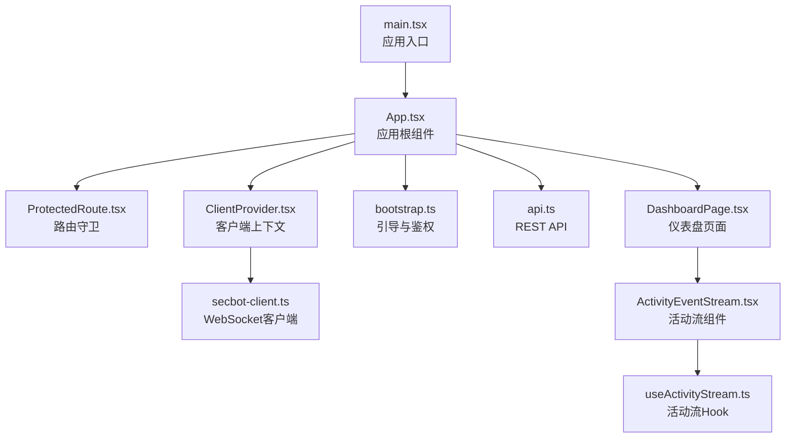
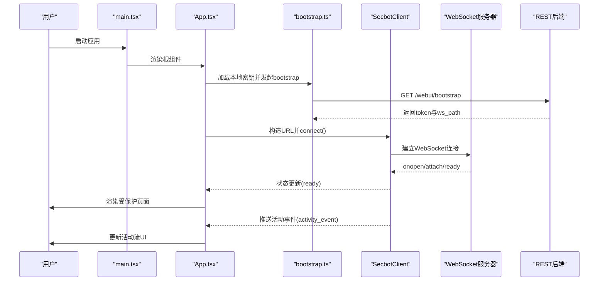
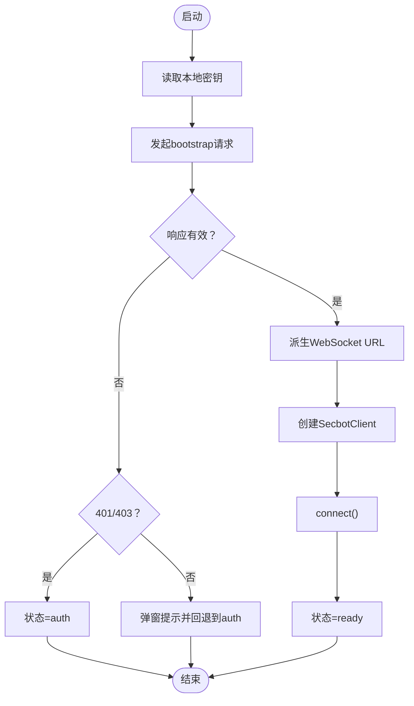
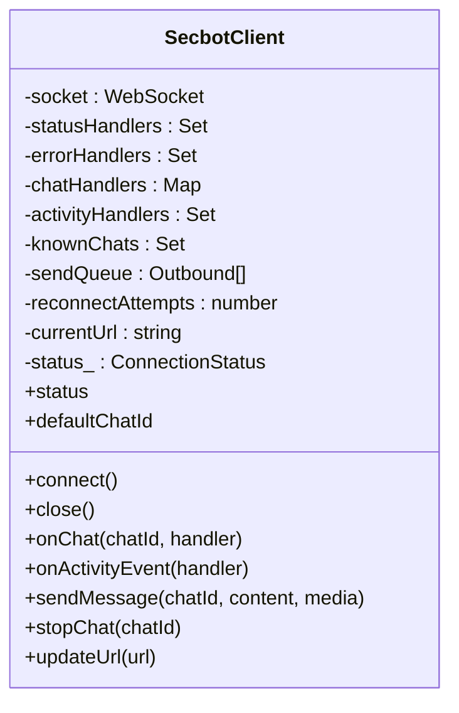
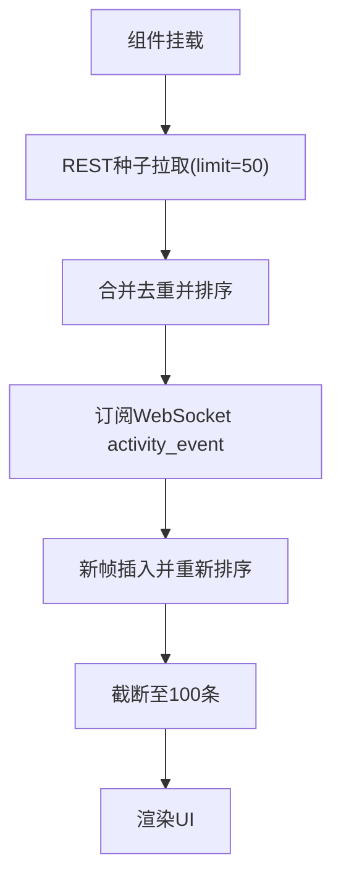
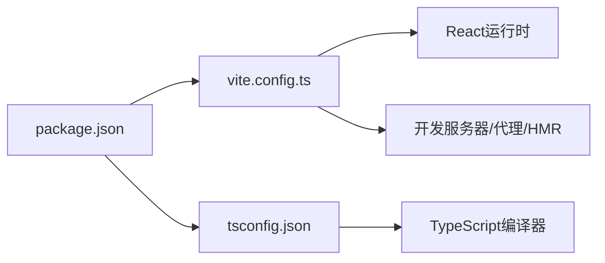

# 前端React调试

<cite>
**本文引用的文件**
- [package.json](file://webui/package.json)
- [vite.config.ts](file://webui/vite.config.ts)
- [tsconfig.json](file://webui/tsconfig.json)
- [main.tsx](file://webui/src/main.tsx)
- [App.tsx](file://webui/src/App.tsx)
- [bootstrap.ts](file://webui/src/lib/bootstrap.ts)
- [secbot-client.ts](file://webui/src/lib/secbot-client.ts)
- [ClientProvider.tsx](file://webui/src/providers/ClientProvider.tsx)
- [ProtectedRoute.tsx](file://webui/src/components/ProtectedRoute.tsx)
- [useActivityStream.ts](file://webui/src/hooks/useActivityStream.ts)
- [ActivityEventStream.tsx](file://webui/src/components/ActivityEventStream.tsx)
- [api.ts](file://webui/src/lib/api.ts)
- [DashboardPage.tsx](file://webui/src/pages/DashboardPage.tsx)
- [setup.ts](file://webui/src/tests/setup.ts)
</cite>

## 目录
1. [简介](#简介)
2. [项目结构](#项目结构)
3. [核心组件](#核心组件)
4. [架构总览](#架构总览)
5. [详细组件分析](#详细组件分析)
6. [依赖关系分析](#依赖关系分析)
7. [性能考量](#性能考量)
8. [故障排查指南](#故障排查指南)
9. [结论](#结论)
10. [附录](#附录)

## 简介
本文件面向VAPT3前端React应用（webui）提供系统化的调试指南，覆盖以下方面：
- React DevTools使用：组件树检查、状态查看、Props分析
- 浏览器开发者工具：Network面板分析、Console错误检查、Performance面板性能分析
- TypeScript调试：类型检查、编译错误定位、运行时错误追踪
- WebUI特有调试：WebSocket连接调试、实时消息检查、状态同步问题排查
- 常见前端问题：组件渲染问题、状态管理问题、API调用问题的解决方案

## 项目结构
webui采用Vite+React+TypeScript技术栈，核心入口为main.tsx，应用根组件App.tsx负责引导认证、建立WebSocket连接并路由到受保护页面；数据层通过SecbotClient封装WebSocket通信，REST API通过api.ts统一管理；DashboardPage集成ECharts图表与实时活动流。

**图示来源**
- [main.tsx:1-16](file://webui/src/main.tsx#L1-L16)
- [App.tsx:1-233](file://webui/src/App.tsx#L1-L233)
- [ProtectedRoute.tsx:1-62](file://webui/src/components/ProtectedRoute.tsx#L1-L62)
- [ClientProvider.tsx:1-58](file://webui/src/providers/ClientProvider.tsx#L1-L58)
- [bootstrap.ts:1-77](file://webui/src/lib/bootstrap.ts#L1-L77)
- [secbot-client.ts:1-377](file://webui/src/lib/secbot-client.ts#L1-L377)
- [api.ts:1-272](file://webui/src/lib/api.ts#L1-L272)
- [DashboardPage.tsx:1-519](file://webui/src/pages/DashboardPage.tsx#L1-L519)
- [ActivityEventStream.tsx:1-281](file://webui/src/components/ActivityEventStream.tsx#L1-L281)
- [useActivityStream.ts:1-198](file://webui/src/hooks/useActivityStream.ts#L1-L198)

**章节来源**
- [main.tsx:1-16](file://webui/src/main.tsx#L1-L16)
- [App.tsx:1-233](file://webui/src/App.tsx#L1-L233)
- [vite.config.ts:1-66](file://webui/vite.config.ts#L1-L66)
- [tsconfig.json:1-33](file://webui/tsconfig.json#L1-L33)

## 核心组件
- 应用入口与根组件
  - main.tsx：挂载React.StrictMode与App，确保严格模式下的副作用检测
  - App.tsx：负责引导流程（读取本地密钥、获取bootstrap令牌、构造WebSocket URL、实例化SecbotClient并连接），同时提供路由守卫与模板式路由
- 客户端与上下文
  - ClientProvider.tsx：在顶层注入SecbotClient、token、模型名与未读通知计数
  - ProtectedRoute.tsx：基于App.tsx的BootStatus进行路由守卫
- WebSocket与实时通信
  - bootstrap.ts：处理本地存储的共享密钥、发起bootstrap请求、生成WebSocket URL
  - secbot-client.ts：单例WebSocket客户端，支持多聊天ID复用、自动重连、订阅事件、错误上报
- 数据与API
  - api.ts：封装REST API调用（会话、设置、命令、通知、活动事件等）
  - useActivityStream.ts：合并REST种子与WebSocket广播，维护去重与排序
  - ActivityEventStream.tsx：展示活动事件流，含加载态、错误态与滚动区域
- 页面与图表
  - DashboardPage.tsx：整合KPI卡片、ECharts图表与活动流组件

**章节来源**
- [main.tsx:1-16](file://webui/src/main.tsx#L1-L16)
- [App.tsx:1-233](file://webui/src/App.tsx#L1-L233)
- [ClientProvider.tsx:1-58](file://webui/src/providers/ClientProvider.tsx#L1-L58)
- [ProtectedRoute.tsx:1-62](file://webui/src/components/ProtectedRoute.tsx#L1-L62)
- [bootstrap.ts:1-77](file://webui/src/lib/bootstrap.ts#L1-L77)
- [secbot-client.ts:1-377](file://webui/src/lib/secbot-client.ts#L1-L377)
- [api.ts:1-272](file://webui/src/lib/api.ts#L1-L272)
- [useActivityStream.ts:1-198](file://webui/src/hooks/useActivityStream.ts#L1-L198)
- [ActivityEventStream.tsx:1-281](file://webui/src/components/ActivityEventStream.tsx#L1-L281)
- [DashboardPage.tsx:1-519](file://webui/src/pages/DashboardPage.tsx#L1-L519)

## 架构总览
下图展示从用户交互到WebSocket与REST数据流的关键路径，以及错误与重连机制：

**图示来源**
- [main.tsx:1-16](file://webui/src/main.tsx#L1-L16)
- [App.tsx:54-107](file://webui/src/App.tsx#L54-L107)
- [bootstrap.ts:37-58](file://webui/src/lib/bootstrap.ts#L37-L58)
- [secbot-client.ts:155-181](file://webui/src/lib/secbot-client.ts#L155-L181)
- [useActivityStream.ts:180-191](file://webui/src/hooks/useActivityStream.ts#L180-L191)

## 详细组件分析

### 组件A：App.tsx（引导与路由）
- 关键职责
  - 引导流程：读取本地密钥、调用bootstrap、派生WebSocket URL、创建SecbotClient并连接
  - 错误处理：区分401/403与其它错误，分别进入登录或弹窗提示
  - 路由策略：支持模板模式与传统模式切换
  - 上下文注入：向子树提供client/token/modelName
- 调试要点
  - 在DevTools中观察状态变化（loading/auth/ready）
  - 断点于bootstrapWithSecret与handleLogout，验证密钥保存与清理
  - 切换VITE_UIUX_TEMPLATE验证两种路由路径

**图示来源**
- [App.tsx:57-102](file://webui/src/App.tsx#L57-L102)
- [bootstrap.ts:37-58](file://webui/src/lib/bootstrap.ts#L37-L58)

**章节来源**
- [App.tsx:54-107](file://webui/src/App.tsx#L54-L107)
- [bootstrap.ts:1-77](file://webui/src/lib/bootstrap.ts#L1-L77)

### 组件B：SecbotClient（WebSocket客户端）
- 关键职责
  - 单例连接、自动重连、指数退避、URL动态刷新
  - 多聊天ID订阅、队列发送、帧解析与分发
  - 传输层错误上报（如消息过大）
- 调试要点
  - 使用浏览器Network面板观察WebSocket握手与心跳
  - 在DevTools Console中监听status/error事件回调
  - 观察sendQueue与knownChats集合变化，确认重连后attach是否生效

**图示来源**
- [secbot-client.ts:59-93](file://webui/src/lib/secbot-client.ts#L59-L93)

**章节来源**
- [secbot-client.ts:155-181](file://webui/src/lib/secbot-client.ts#L155-L181)
- [secbot-client.ts:228-284](file://webui/src/lib/secbot-client.ts#L228-L284)
- [secbot-client.ts:340-357](file://webui/src/lib/secbot-client.ts#L340-L357)

### 组件C：useActivityStream（活动流Hook）
- 关键职责
  - 首次挂载拉取REST种子（默认limit=50），随后订阅WebSocket activity_event
  - 去重与按时间倒序排序，限制环形缓冲大小（100）
  - 支持刷新与错误码透传
- 调试要点
  - 在DevTools中观察events/state/errorCode变化
  - 切换seedLimit验证REST种子影响
  - 模拟网络异常，验证错误态与重试按钮

**图示来源**
- [useActivityStream.ts:139-197](file://webui/src/hooks/useActivityStream.ts#L139-L197)

**章节来源**
- [useActivityStream.ts:139-197](file://webui/src/hooks/useActivityStream.ts#L139-L197)

### 组件D：ActivityEventStream（活动流展示）
- 关键职责
  - 展示加载、错误、空状态与事件列表
  - 提供刷新按钮与实时指示灯
- 调试要点
  - 在测试环境下注入events/state/errorCode，验证各分支渲染
  - 观察滚动区域高度与事件项属性（level/source）

**章节来源**
- [ActivityEventStream.tsx:69-234](file://webui/src/components/ActivityEventStream.tsx#L69-L234)

### 组件E：DashboardPage（仪表盘）
- 关键职责
  - 展示KPI卡片、风险趋势、资产/漏洞分布、资产聚类与历史报告
  - 内嵌ActivityEventStream用于实时观测
- 调试要点
  - 切换趋势天数与饼图模式，验证图表选项计算
  - 观察图表渲染性能与内存占用

**章节来源**
- [DashboardPage.tsx:294-516](file://webui/src/pages/DashboardPage.tsx#L294-L516)

## 依赖关系分析
- 构建与开发
  - Vite配置启用React插件、路径别名、代理与HMR端口分离，避免WebSocket与HMR冲突
  - TypeScript严格模式开启，启用noUnusedLocals/noUnusedParameters等规则
- 运行时依赖
  - React生态组件库与图表库（Radix UI、ECharts、Recharts等）
  - 国际化与路由（react-i18next、react-router-dom）
  - 状态查询（@tanstack/react-query）
- 测试环境
  - Vitest + happy-dom，测试前初始化i18n与localStorage等全局能力

**图示来源**
- [package.json:1-67](file://webui/package.json#L1-L67)
- [vite.config.ts:1-66](file://webui/vite.config.ts#L1-L66)
- [tsconfig.json:1-33](file://webui/tsconfig.json#L1-L33)

**章节来源**
- [package.json:1-67](file://webui/package.json#L1-L67)
- [vite.config.ts:1-66](file://webui/vite.config.ts#L1-L66)
- [tsconfig.json:1-33](file://webui/tsconfig.json#L1-L33)

## 性能考量
- 图表渲染
  - ECharts通过SVG渲染器减少Canvas重绘开销；建议在大数据量时启用懒加载与虚拟滚动
- 状态与订阅
  - SecbotClient内部使用队列与集合管理订阅，避免重复attach；注意在组件卸载时及时取消订阅
- 网络与缓存
  - REST种子limit控制初始数据量；WebSocket广播按需订阅，避免全量推送
- 开发体验
  - Vite优化exclude特定包以稳定热更新；生产构建关闭sourcemap提升性能

[本节为通用指导，无需列出具体文件来源]

## 故障排查指南

### React DevTools调试
- 组件树检查
  - 打开React DevTools，定位App.tsx与ClientProvider.tsx，观察子树是否正确注入client/token
  - 在ProtectedRoute.tsx处验证路由守卫逻辑是否按预期切换
- 状态查看
  - 在App.tsx中观察BootStatus变化（loading/auth/ready），确认引导流程
  - 在useActivityStream.ts中观察events/state/errorCode，验证REST与WS数据合并
- Props分析
  - 在ActivityEventStream.tsx中检查传入的events/state/errorCode，确保渲染分支正确

**章节来源**
- [App.tsx:54-107](file://webui/src/App.tsx#L54-L107)
- [ClientProvider.tsx:24-43](file://webui/src/providers/ClientProvider.tsx#L24-L43)
- [ProtectedRoute.tsx:42-58](file://webui/src/components/ProtectedRoute.tsx#L42-L58)
- [useActivityStream.ts:139-197](file://webui/src/hooks/useActivityStream.ts#L139-L197)
- [ActivityEventStream.tsx:69-234](file://webui/src/components/ActivityEventStream.tsx#L69-L234)

### 浏览器开发者工具
- Network面板
  - 观察WebSocket握手与升级过程，确认路径与token参数
  - 检查REST请求（/api/events、/api/sessions等）的状态码与响应体
- Console错误
  - 关注SecbotClient的onerror与emitError回调，定位传输层错误（如消息过大）
  - 检查fetchBootstrap与api.ts中的ApiError抛出位置
- Performance面板
  - 录制图表渲染与滚动操作，识别主线程阻塞点
  - 结合React Profiler定位过度重渲染组件

**章节来源**
- [secbot-client.ts:314-324](file://webui/src/lib/secbot-client.ts#L314-L324)
- [api.ts:10-17](file://webui/src/lib/api.ts#L10-L17)
- [vite.config.ts:41-57](file://webui/vite.config.ts#L41-L57)

### TypeScript调试
- 类型检查
  - 严格模式下利用noUnusedLocals/noUnusedParameters快速发现未使用变量
  - 使用类型守卫与解构增强可读性，减少any使用
- 编译错误定位
  - 依据tsconfig.json的路径映射与模块解析策略，快速定位导入路径问题
- 运行时错误追踪
  - 在SecbotClient与api.ts中捕获JSON解析与网络异常，结合错误码定位问题

**章节来源**
- [tsconfig.json:17-24](file://webui/tsconfig.json#L17-L24)
- [secbot-client.ts:246-252](file://webui/src/lib/secbot-client.ts#L246-L252)
- [api.ts:19-36](file://webui/src/lib/api.ts#L19-L36)

### WebUI特有调试
- WebSocket连接调试
  - 在vite.config.ts中确认代理与WebSocket升级配置，避免HMR与WS冲突
  - 使用SecbotClient的status与error回调，观察连接状态与错误原因
- 实时消息检查
  - 在useActivityStream.ts中验证帧到事件的转换与去重逻辑
  - 在ActivityEventStream.tsx中检查渲染分支与滚动区域
- 状态同步问题排查
  - 确认ClientProvider.tsx上下文值的memo化，避免无关重渲染
  - 在App.tsx中验证handleModelNameChange与handleLogout的引用稳定性

**章节来源**
- [vite.config.ts:37-57](file://webui/vite.config.ts#L37-L57)
- [secbot-client.ts:108-122](file://webui/src/lib/secbot-client.ts#L108-L122)
- [useActivityStream.ts:89-121](file://webui/src/hooks/useActivityStream.ts#L89-L121)
- [ActivityEventStream.tsx:69-234](file://webui/src/components/ActivityEventStream.tsx#L69-L234)
- [ClientProvider.tsx:35-42](file://webui/src/providers/ClientProvider.tsx#L35-L42)
- [App.tsx:128-144](file://webui/src/App.tsx#L128-L144)

### 常见前端问题与解决
- 组件渲染问题
  - 使用React DevTools检查props与state变化，定位不必要的重渲染
  - 在DashboardPage.tsx中验证图表选项的memo化与懒加载
- 状态管理问题
  - 在ClientProvider.tsx中确保上下文值稳定，避免子组件重复订阅
  - 在App.tsx中保持回调函数引用稳定（useCallback/ref）
- API调用问题
  - 在api.ts中统一处理错误并抛出自定义ApiError，便于上层捕获
  - 在useActivityStream.ts中使用请求ID与提交标记，避免竞态导致的数据错乱

**章节来源**
- [ClientProvider.tsx:35-42](file://webui/src/providers/ClientProvider.tsx#L35-L42)
- [App.tsx:128-144](file://webui/src/App.tsx#L128-L144)
- [api.ts:10-17](file://webui/src/lib/api.ts#L10-L17)
- [useActivityStream.ts:154-178](file://webui/src/hooks/useActivityStream.ts#L154-L178)

## 结论
通过结合React DevTools、浏览器开发者工具与TypeScript严格模式，配合SecbotClient与REST API的可观测性设计，可以高效定位并解决VAPT3前端React应用中的各类问题。建议在开发与测试阶段持续关注引导流程、WebSocket连接、实时消息与状态同步，并利用图表与Hook的去重/排序机制保障用户体验。

## 附录
- 测试环境初始化
  - setup.ts为Vitest准备了i18n、localStorage与window.alert的兼容实现，确保测试稳定性

**章节来源**
- [setup.ts:1-83](file://webui/src/tests/setup.ts#L1-L83)