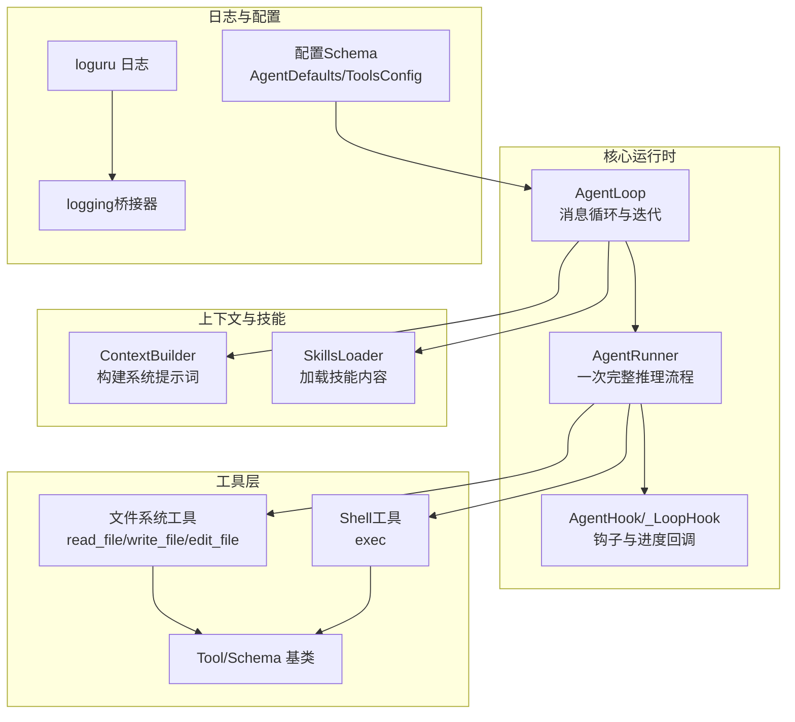
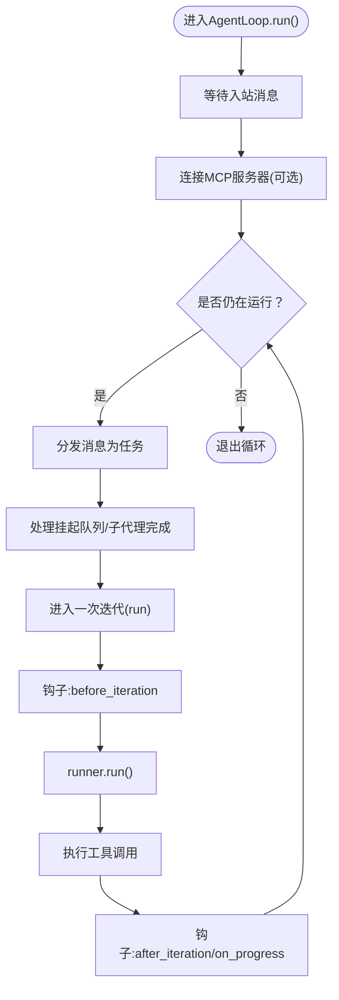
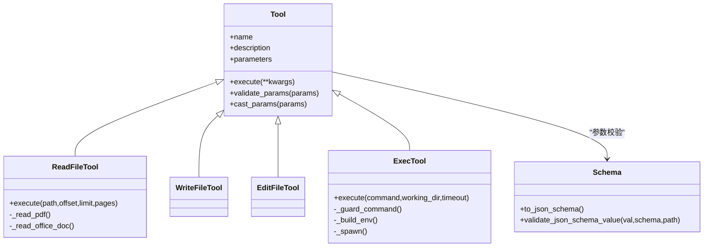
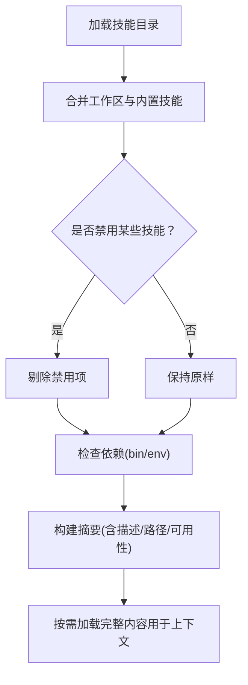
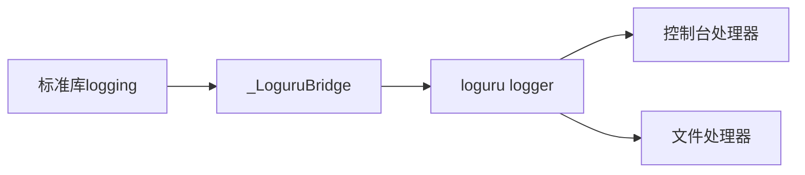
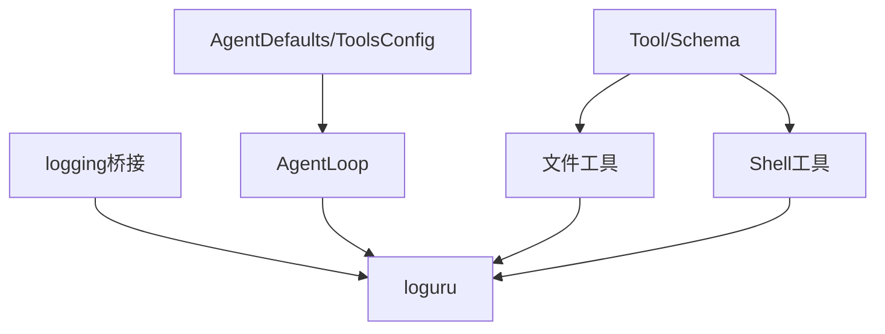

# 后端Python调试

<cite>
**本文引用的文件**
- [secbot/agent/loop.py](file://secbot/agent/loop.py)
- [secbot/agent/tools/base.py](file://secbot/agent/tools/base.py)
- [secbot/agent/tools/shell.py](file://secbot/agent/tools/shell.py)
- [secbot/agent/tools/filesystem.py](file://secbot/agent/tools/filesystem.py)
- [secbot/agent/skills.py](file://secbot/agent/skills.py)
- [secbot/utils/logging_bridge.py](file://secbot/utils/logging_bridge.py)
- [secbot/config/schema.py](file://secbot/config/schema.py)
- [pyproject.toml](file://pyproject.toml)
- [tests/tools/test_exec_env.py](file://tests/tools/test_exec_env.py)
- [tests/tools/test_exec_platform.py](file://tests/tools/test_exec_platform.py)
- [tests/agent/test_context_prompt_cache.py](file://tests/agent/test_context_prompt_cache.py)
- [tests/agent/test_memory_store.py](file://tests/agent/test_memory_store.py)
- [docs/websocket.md](file://docs/websocket.md)
</cite>

## 目录
1. [简介](#简介)
2. [项目结构](#项目结构)
3. [核心组件](#核心组件)
4. [架构总览](#架构总览)
5. [详细组件分析](#详细组件分析)
6. [依赖分析](#依赖分析)
7. [性能考虑](#性能考虑)
8. [故障排查指南](#故障排查指南)
9. [结论](#结论)
10. [附录](#附录)

## 简介
本文件面向VAPT3后端Python调试，聚焦以下目标：
- 使用pdb进行断点调试、变量检查与调用栈分析
- 集成与配置loguru日志系统，统一标准库logging输出
- 性能分析：cProfile使用、内存分析、CPU热点识别
- 错误追踪与异常处理最佳实践：try-catch模式、错误传播、日志记录
- 具体调试场景：AgentLoop调试、工具执行调试（文件系统、shell）、技能系统调试

## 项目结构
后端以“代理循环-工具-上下文-技能”为核心组织方式，日志通过loguru集中管理，并在启动时桥接标准库logging。



图示来源
- [secbot/agent/loop.py:276-425](file://secbot/agent/loop.py#L276-L425)
- [secbot/agent/tools/base.py:117-244](file://secbot/agent/tools/base.py#L117-L244)
- [secbot/agent/tools/filesystem.py:148-287](file://secbot/agent/tools/filesystem.py#L148-L287)
- [secbot/agent/tools/shell.py:48-216](file://secbot/agent/tools/shell.py#L48-L216)
- [secbot/agent/skills.py:21-110](file://secbot/agent/skills.py#L21-L110)
- [secbot/utils/logging_bridge.py:9-47](file://secbot/utils/logging_bridge.py#L9-L47)
- [secbot/config/schema.py:68-113](file://secbot/config/schema.py#L68-L113)

章节来源
- [secbot/agent/loop.py:276-425](file://secbot/agent/loop.py#L276-L425)
- [secbot/agent/tools/base.py:117-244](file://secbot/agent/tools/base.py#L117-L244)
- [secbot/agent/tools/filesystem.py:148-287](file://secbot/agent/tools/filesystem.py#L148-L287)
- [secbot/agent/tools/shell.py:48-216](file://secbot/agent/tools/shell.py#L48-L216)
- [secbot/agent/skills.py:21-110](file://secbot/agent/skills.py#L21-L110)
- [secbot/utils/logging_bridge.py:9-47](file://secbot/utils/logging_bridge.py#L9-L47)
- [secbot/config/schema.py:68-113](file://secbot/config/schema.py#L68-L113)

## 核心组件
- AgentLoop：代理主循环，负责接收消息、构建上下文、调用LLM、执行工具、发送响应；内置钩子用于进度与流式输出
- 工具体系：Tool/Schema抽象，提供参数校验、类型转换、并发安全标记；文件系统与shell工具实现具体能力
- 技能系统：从工作区与内置目录加载SKILL.md，构建技能摘要与上下文
- 日志系统：loguru作为统一日志入口，logging桥接器将第三方库输出汇聚到loguru

章节来源
- [secbot/agent/loop.py:276-425](file://secbot/agent/loop.py#L276-L425)
- [secbot/agent/tools/base.py:117-244](file://secbot/agent/tools/base.py#L117-L244)
- [secbot/agent/skills.py:21-110](file://secbot/agent/skills.py#L21-L110)
- [secbot/utils/logging_bridge.py:9-47](file://secbot/utils/logging_bridge.py#L9-L47)

## 架构总览
下图展示一次消息从入站到工具执行的关键路径，以及日志落盘位置。

```mermaid
sequenceDiagram
participant Bus as "消息总线"
participant Loop as "AgentLoop"
participant Hook as "_LoopHook"
participant Runner as "AgentRunner"
participant Tool as "工具(文件/Shell)"
participant Log as "loguru"
Bus->>Loop : 入站消息(InboundMessage)
Loop->>Hook : before_iteration()
Loop->>Runner : run(AgentRunSpec)
Runner->>Runner : 构建上下文/调用LLM
Runner->>Tool : 执行工具调用
Tool->>Log : 记录工具调用/结果
Runner-->>Loop : 返回最终内容/工具列表
Loop->>Hook : after_iteration()/on_progress
Loop-->>Bus : 出站消息(OutboundMessage)
```

图示来源
- [secbot/agent/loop.py:644-786](file://secbot/agent/loop.py#L644-L786)
- [secbot/agent/tools/filesystem.py:174-287](file://secbot/agent/tools/filesystem.py#L174-L287)
- [secbot/agent/tools/shell.py:123-216](file://secbot/agent/tools/shell.py#L123-L216)

## 详细组件分析

### 组件A：AgentLoop调试要点
- 断点设置建议
  - 在循环开始处设置断点，观察会话键、通道、消息ID等上下文
  - 在工具调用前断点，检查工具名、参数、会话上下文是否正确
  - 在迭代结束处断点，查看LLM用量、工具事件、进度回调
- 变量检查
  - 当前迭代号、会话状态、工具事件payload、消息历史长度
  - 运行时配置：最大迭代数、工具结果字符限制、上下文窗口
- 调用栈分析
  - 关注钩子链路（CompositeHook）与runner.run()之间的调用关系
  - 工具注册与解析：工具定义、参数schema、并发策略
- 场景化调试
  - AgentLoop.run()中监听消息队列，验证停止信号与任务取消
  - 工具事件广播：WebSocket通道活动事件的起止时间戳计算



图示来源
- [secbot/agent/loop.py:788-800](file://secbot/agent/loop.py#L788-L800)
- [secbot/agent/loop.py:644-786](file://secbot/agent/loop.py#L644-L786)

章节来源
- [secbot/agent/loop.py:276-425](file://secbot/agent/loop.py#L276-L425)
- [secbot/agent/loop.py:644-786](file://secbot/agent/loop.py#L644-L786)

### 组件B：工具执行调试（文件系统与Shell）
- 文件系统工具
  - 断点：读取前、写入前、编辑前（检查路径解析、权限、设备路径黑名单）
  - 变量：路径解析结果、文件大小、页码范围、媒体目录、只读/去重策略
  - 场景：PDF/Office文档读取、图片内容块生成、行号编号输出
- Shell工具
  - 断点：命令守卫、沙箱包装、环境变量构建、超时与僵尸进程清理
  - 变量：deny/allow模式、工作目录限制、PATH追加、超时上限
  - 场景：跨平台spawn、Windows路径转义、安全边界检测



图示来源
- [secbot/agent/tools/base.py:117-244](file://secbot/agent/tools/base.py#L117-L244)
- [secbot/agent/tools/filesystem.py:148-287](file://secbot/agent/tools/filesystem.py#L148-L287)
- [secbot/agent/tools/shell.py:48-216](file://secbot/agent/tools/shell.py#L48-L216)

章节来源
- [secbot/agent/tools/base.py:117-244](file://secbot/agent/tools/base.py#L117-L244)
- [secbot/agent/tools/filesystem.py:148-287](file://secbot/agent/tools/filesystem.py#L148-L287)
- [secbot/agent/tools/shell.py:48-216](file://secbot/agent/tools/shell.py#L48-L216)

### 组件C：技能系统调试
- 断点：技能列表枚举、元数据解析、可用性检查、摘要构建
- 变量：禁用技能集合、工作区与内置技能目录、frontmatter解析
- 场景：技能过滤（按依赖二进制/环境变量）、摘要格式化、上下文拼装



图示来源
- [secbot/agent/skills.py:51-142](file://secbot/agent/skills.py#L51-L142)

章节来源
- [secbot/agent/skills.py:21-110](file://secbot/agent/skills.py#L21-L110)

### 组件D：日志系统与桥接
- loguru作为统一日志入口，支持多处理器、格式化、层级过滤
- logging桥接器将第三方库输出汇聚到loguru，避免重复与格式不一致
- 配置建议：在应用启动阶段添加控制台与文件处理器，设置合适级别



图示来源
- [secbot/utils/logging_bridge.py:9-47](file://secbot/utils/logging_bridge.py#L9-L47)

章节来源
- [secbot/utils/logging_bridge.py:9-47](file://secbot/utils/logging_bridge.py#L9-L47)

## 依赖分析
- 配置层：AgentDefaults/ToolsConfig等定义了AgentLoop运行期关键参数（如最大迭代、工具结果长度、上下文窗口等），直接影响调试时的资源占用与行为边界
- 工具层：Tool/Schema提供参数校验与类型转换，减少调试时因输入异常导致的崩溃
- 日志层：loguru与logging桥接器确保第三方库与业务日志统一输出



图示来源
- [secbot/config/schema.py:68-113](file://secbot/config/schema.py#L68-L113)
- [secbot/agent/loop.py:291-425](file://secbot/agent/loop.py#L291-L425)
- [secbot/agent/tools/base.py:117-244](file://secbot/agent/tools/base.py#L117-L244)
- [secbot/utils/logging_bridge.py:9-47](file://secbot/utils/logging_bridge.py#L9-L47)

章节来源
- [secbot/config/schema.py:68-113](file://secbot/config/schema.py#L68-L113)
- [secbot/agent/loop.py:291-425](file://secbot/agent/loop.py#L291-L425)
- [secbot/agent/tools/base.py:117-244](file://secbot/agent/tools/base.py#L117-L244)
- [secbot/utils/logging_bridge.py:9-47](file://secbot/utils/logging_bridge.py#L9-L47)

## 性能考虑
- CPU热点识别
  - 使用cProfile对AgentLoop单次run进行采样，关注工具调用耗时、runner.run内部开销、钩子回调
  - 对文件系统工具：重点观察PDF/Office文档解析、大文件读取与去重逻辑
  - 对Shell工具：关注spawn、环境构建、超时与清理
- 内存分析
  - 关注消息历史长度、上下文窗口预算、工具结果截断阈值
  - 检查文件状态缓存（FileStates）与去重命中率
- 并发与限流
  - 工具并发安全标记（read_only/concurrency_safe/exclusive）影响调度策略
  - 会话级锁与并发门控（Semaphore）避免竞态

[本节为通用指导，无需列出章节来源]

## 故障排查指南
- 常见问题定位
  - 工具执行失败：检查deny/allow模式、工作目录限制、设备路径黑名单、超时与返回码
  - 文件系统异常：确认路径解析、媒体目录、只读/去重策略、文件大小限制
  - 日志缺失：确认logging桥接器已注册、级别过滤、处理器配置
- 异常处理最佳实践
  - try-catch包裹工具执行，捕获并记录异常，返回用户可读错误信息
  - 对外部调用（网络/文件/进程）设置超时与清理，避免僵尸进程
  - 使用钩子在迭代前后记录关键指标（用量、工具事件、进度）

章节来源
- [secbot/agent/tools/shell.py:123-216](file://secbot/agent/tools/shell.py#L123-L216)
- [secbot/agent/tools/filesystem.py:174-287](file://secbot/agent/tools/filesystem.py#L174-L287)
- [secbot/utils/logging_bridge.py:34-47](file://secbot/utils/logging_bridge.py#L34-L47)

## 结论
通过在AgentLoop、工具执行、技能系统三个层面结合pdb断点、loguru统一日志与cProfile性能分析，可以高效定位问题、优化性能并提升稳定性。建议在开发与测试环境中固定日志级别与处理器，确保问题复现与回归测试的一致性。

[本节为总结性内容，无需列出章节来源]

## 附录

### 调试场景清单与建议
- AgentLoop调试
  - 断点：入站消息消费、迭代开始/结束、工具调用前、进度回调
  - 变量：会话键、通道、消息ID、工具事件、LLM用量
  - 场景：停止信号、任务取消、挂起队列注入
- 工具执行调试
  - 文件系统：路径解析、设备路径黑名单、PDF/Office解析、行号编号、去重
  - Shell：命令守卫、沙箱包装、环境变量、超时与清理
- 技能系统调试
  - 断点：技能枚举、元数据解析、可用性检查、摘要构建
  - 变量：禁用集合、frontmatter、依赖二进制/环境变量
- 日志系统调试
  - 断点：logging桥接器emit、处理器输出
  - 变量：级别映射、深度修正、异常打印

章节来源
- [secbot/agent/loop.py:120-273](file://secbot/agent/loop.py#L120-L273)
- [secbot/agent/tools/filesystem.py:174-287](file://secbot/agent/tools/filesystem.py#L174-L287)
- [secbot/agent/tools/shell.py:123-216](file://secbot/agent/tools/shell.py#L123-L216)
- [secbot/agent/skills.py:51-142](file://secbot/agent/skills.py#L51-L142)
- [secbot/utils/logging_bridge.py:24-31](file://secbot/utils/logging_bridge.py#L24-L31)

### 配置与环境要点
- 配置Schema中的AgentDefaults/ToolsConfig直接影响调试行为与资源占用
- 环境变量SECBOT_MAX_CONCURRENT_REQUESTS控制并发门控
- WebSocket配置影响流式输出与心跳参数

章节来源
- [secbot/config/schema.py:68-113](file://secbot/config/schema.py#L68-L113)
- [pyproject.toml:103-110](file://pyproject.toml#L103-L110)
- [docs/websocket.md:197-208](file://docs/websocket.md#L197-L208)