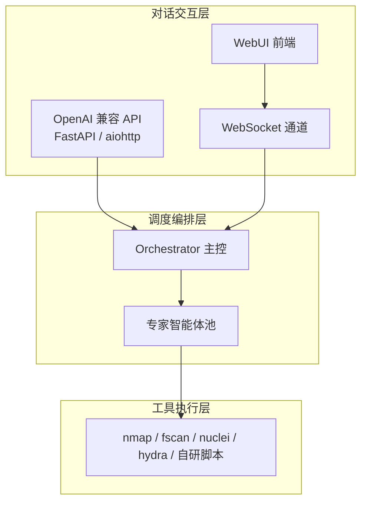
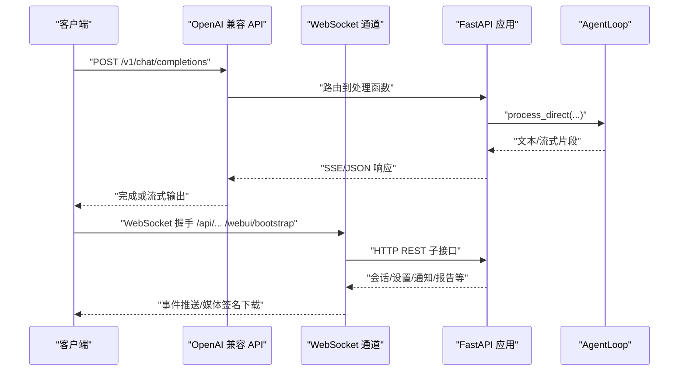
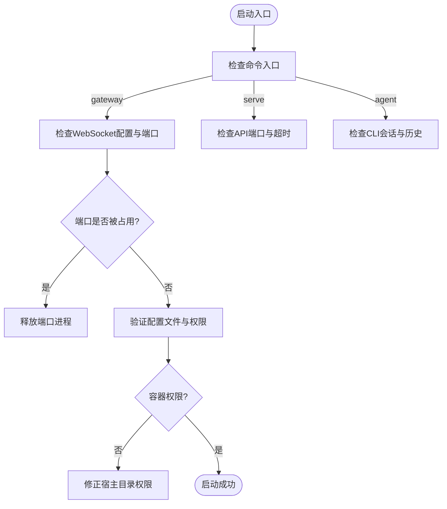
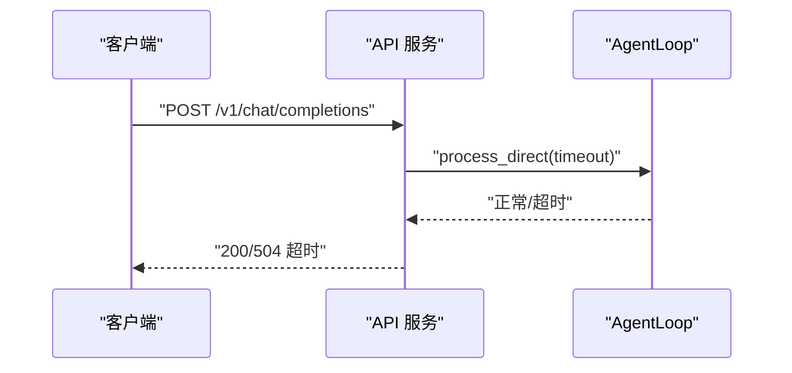
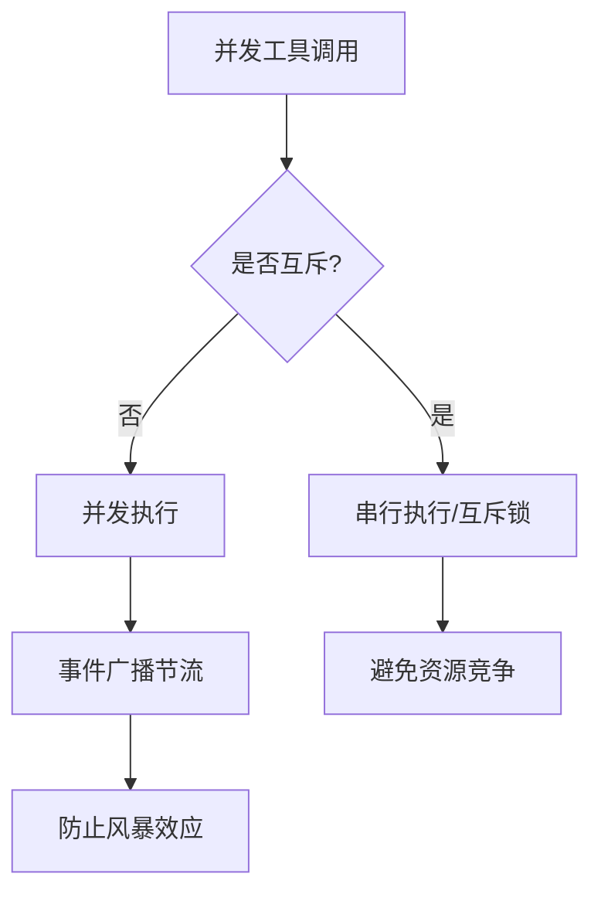
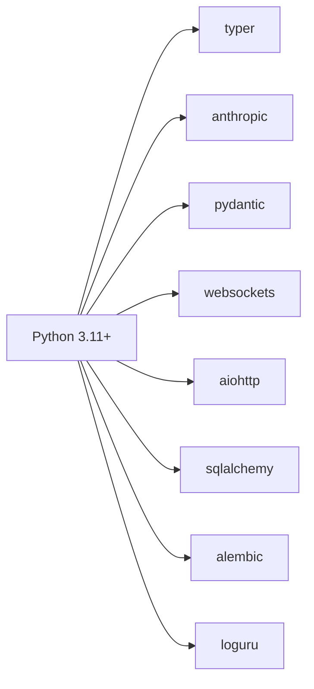

# 常见问题诊断

<cite>
**本文引用的文件**
- [README.md](file://README.md)
- [configuration.md](file://docs/configuration.md)
- [quick-start.md](file://docs/quick-start.md)
- [pyproject.toml](file://pyproject.toml)
- [Dockerfile](file://Dockerfile)
- [entrypoint.sh](file://entrypoint.sh)
- [secbot/__main__.py](file://secbot/__main__.py)
- [secbot/cli/commands.py](file://secbot/cli/commands.py)
- [secbot/api/server.py](file://secbot/api/server.py)
- [secbot/channels/websocket.py](file://secbot/channels/websocket.py)
- [secbot/agent/tools/self.py](file://secbot/agent/tools/self.py)
- [secbot/agent/tools/mcp.py](file://secbot/agent/tools/mcp.py)
- [tests/config/test_config_migration.py](file://tests/config/test_config_migration.py)
- [tests/agent/test_runner.py](file://tests/agent/test_runner.py)
</cite>

## 目录
1. [简介](#简介)
2. [项目结构](#项目结构)
3. [核心组件](#核心组件)
4. [架构总览](#架构总览)
5. [详细组件分析](#详细组件分析)
6. [依赖关系分析](#依赖关系分析)
7. [性能考虑](#性能考虑)
8. [故障排除指南](#故障排除指南)
9. [结论](#结论)
10. [附录](#附录)

## 简介
本指南聚焦于VAPT3（secbot）在实际部署与使用中的常见问题诊断与解决，覆盖启动失败、连接超时、权限错误、配置问题、性能瓶颈、并发与线程问题、以及配置相关问题（含环境变量、配置文件验证、依赖版本冲突）。文档提供系统化的问题诊断流程：症状收集、原因分析、解决方案实施；并给出性能问题识别与优化建议、并发与线程问题排查技巧、错误代码与异常信息解读。

## 项目结构
VAPT3采用分层架构：对话交互层（WebUI/REST/WebSocket）、调度编排层（Orchestrator/专家智能体）、工具执行层（nmap/fscan/nuclei/hydra等），并通过FastAPI提供OpenAI兼容API，通过WebSocket提供WebUI通道，通过CLI提供本地交互。

图表来源
- [README.md:29-53](file://README.md#L29-L53)
- [README.md:113-179](file://README.md#L113-L179)

章节来源
- [README.md:29-53](file://README.md#L29-L53)
- [README.md:113-179](file://README.md#L113-L179)

## 核心组件
- CLI命令入口与运行时：Typer应用、日志格式化、会话管理、命令路由（agent/serve/gateway）。
- OpenAI兼容API服务：基于aiohttp的FastAPI应用，支持SSE流式返回、请求超时控制、媒体文件上传。
- WebSocket通道：作为WebUI后端，负责握手鉴权、消息广播、媒体签名下载、REST子接口。
- 配置系统：支持环境变量占位符、提供者（Provider）注册、通道（Channel）配置、工具配置。
- 安全与沙箱：网络白名单、命令注入防护、SSRF白名单、MCP资源访问限制与超时重试。
- 并发与线程：异步锁保护会话、工具并发执行、事件广播节流、心跳与定时任务。

章节来源
- [secbot/cli/commands.py:74-800](file://secbot/cli/commands.py#L74-L800)
- [secbot/api/server.py:1-401](file://secbot/api/server.py#L1-L401)
- [secbot/channels/websocket.py:1-800](file://secbot/channels/websocket.py#L1-L800)
- [configuration.md:1-800](file://docs/configuration.md#L1-L800)

## 架构总览
下图展示从客户端到后端组件的关键交互路径，包括启动入口、API服务、WebSocket通道与AgentLoop之间的关系。

图表来源
- [secbot/api/server.py:194-401](file://secbot/api/server.py#L194-L401)
- [secbot/channels/websocket.py:657-795](file://secbot/channels/websocket.py#L657-L795)
- [secbot/cli/commands.py:514-601](file://secbot/cli/commands.py#L514-L601)

章节来源
- [secbot/api/server.py:194-401](file://secbot/api/server.py#L194-L401)
- [secbot/channels/websocket.py:657-795](file://secbot/channels/websocket.py#L657-L795)
- [secbot/cli/commands.py:514-601](file://secbot/cli/commands.py#L514-L601)

## 详细组件分析

### 启动与入口诊断
- 现象
  - 启动后无响应或立即退出
  - 端口未监听或被占用
  - WebUI无法连接WebSocket
- 诊断步骤
  - 确认命令入口：CLI直连、OpenAI兼容API、WebUI网关
  - 检查配置文件是否存在且启用WebSocket
  - 使用详细日志模式启动，观察通道初始化与端口绑定
- 解决方案
  - 使用正确的命令入口：gateway用于WebUI，serve用于API，agent用于CLI
  - 确保WebSocket通道启用并监听正确地址与端口
  - 若容器运行，检查用户与目录写权限

图表来源
- [README.md:113-179](file://README.md#L113-L179)
- [entrypoint.sh:1-16](file://entrypoint.sh#L1-L16)
- [secbot/cli/commands.py:608-632](file://secbot/cli/commands.py#L608-L632)

章节来源
- [README.md:113-179](file://README.md#L113-L179)
- [entrypoint.sh:1-16](file://entrypoint.sh#L1-L16)
- [secbot/cli/commands.py:608-632](file://secbot/cli/commands.py#L608-L632)

### 连接超时与网络问题
- 现象
  - API请求超时（504）
  - WebSocket握手失败或连接被拒绝
  - 媒体上传过大导致413
- 诊断步骤
  - 检查请求超时参数与后端等待时间
  - 校验WebSocket鉴权参数与token有效期
  - 确认媒体大小限制与MIME类型
- 解决方案
  - 调整请求超时阈值
  - 重新签发短期token或配置静态token
  - 降低上传文件大小或使用允许的MIME类型

图表来源
- [secbot/api/server.py:341-348](file://secbot/api/server.py#L341-L348)
- [secbot/api/server.py:262-304](file://secbot/api/server.py#L262-L304)

章节来源
- [secbot/api/server.py:341-348](file://secbot/api/server.py#L341-L348)
- [secbot/api/server.py:262-304](file://secbot/api/server.py#L262-L304)

### 权限与鉴权问题
- 现象
  - WebSocket握手403/401
  - 容器内配置目录不可写
  - 令牌签发受限或过期
- 诊断步骤
  - 检查allow_from与client_id策略
  - 校验token与token_issue_secret配置
  - 确认容器用户UID与宿主目录归属
- 解决方案
  - 配置允许的来源列表或使用静态token
  - 设置token_issue_secret并限制签发数量
  - 修正宿主目录属主与权限

章节来源
- [secbot/channels/websocket.py:139-195](file://secbot/channels/websocket.py#L139-L195)
- [entrypoint.sh:1-16](file://entrypoint.sh#L1-L16)

### 配置问题与环境变量
- 现象
  - 启动时报“未配置API密钥”
  - 提供者模型不匹配或缺失
  - 通道配置未生效
- 诊断步骤
  - 使用onboard刷新配置，保留旧值并合并新字段
  - 检查环境变量占位符解析
  - 验证通道与工具配置项
- 解决方案
  - 使用onboard并选择“刷新配置”以保留现有设置
  - 在环境文件中设置密钥并确保服务单元加载
  - 确保通道启用且字段合法

章节来源
- [secbot/cli/commands.py:304-400](file://secbot/cli/commands.py#L304-L400)
- [configuration.md:10-44](file://docs/configuration.md#L10-L44)
- [configuration.md:667-731](file://docs/configuration.md#L667-L731)

### 并发与线程问题
- 现象
  - 工具并发执行导致资源竞争
  - 会话锁竞争导致响应延迟
  - MCP资源读取超时或取消
- 诊断步骤
  - 观察工具并发执行顺序与事件序列
  - 检查会话锁粒度与超时
  - 监控MCP资源访问的重试与取消
- 解决方案
  - 合理设置工具并发与互斥
  - 为关键会话加锁并缩短超时
  - 为MCP资源增加重试与超时上限

图表来源
- [tests/agent/test_runner.py:1002-1034](file://tests/agent/test_runner.py#L1002-L1034)
- [secbot/api/server.py:395](file://secbot/api/server.py#L395)
- [secbot/agent/tools/mcp.py:262-291](file://secbot/agent/tools/mcp.py#L262-L291)

章节来源
- [tests/agent/test_runner.py:1002-1034](file://tests/agent/test_runner.py#L1002-L1034)
- [secbot/api/server.py:395](file://secbot/api/server.py#L395)
- [secbot/agent/tools/mcp.py:262-291](file://secbot/agent/tools/mcp.py#L262-L291)

### 错误代码与异常信息解读
- 400/413/504/500
  - 400：请求体格式错误或模型不匹配
  - 413：上传文件过大或内容无效
  - 504：请求超时
  - 500：内部服务器错误
- WebSocket鉴权
  - 401/403：令牌无效、来源不在allow_from、未满足全接口绑定要求
- 配置迁移
  - SSRF白名单清空：当新配置为空时，旧白名单会被重置

章节来源
- [secbot/api/server.py:217-224](file://secbot/api/server.py#L217-L224)
- [secbot/api/server.py:341-348](file://secbot/api/server.py#L341-L348)
- [secbot/channels/websocket.py:186-195](file://secbot/channels/websocket.py#L186-L195)
- [tests/config/test_config_migration.py:208-225](file://tests/config/test_config_migration.py#L208-L225)

## 依赖关系分析
- Python版本与依赖
  - Python >= 3.11
  - 关键依赖：typer、anthropic、pydantic、websockets、aiohttp、sqlalchemy、alembic、loguru等
- 容器镜像
  - 基于python3.12-slim，预装Node.js用于桥接，暴露网关端口
- 依赖版本冲突
  - 建议使用uv或pip-tools锁定版本，避免不同包对同一库的不兼容版本

图表来源
- [pyproject.toml:25-68](file://pyproject.toml#L25-L68)
- [Dockerfile:1-51](file://Dockerfile#L1-L51)

章节来源
- [pyproject.toml:25-68](file://pyproject.toml#L25-L68)
- [Dockerfile:1-51](file://Dockerfile#L1-L51)

## 性能考虑
- 响应缓慢
  - 检查LLM提供者速率限制与重试策略
  - 优化工具调用链，减少不必要的外部请求
  - 启用流式输出（SSE）提升感知速度
- 内存占用过高
  - 控制会话消息长度与媒体附件数量
  - 合理设置工具结果字符上限
  - 定期清理临时文件与媒体缓存
- CPU负载过重
  - 限制并发工具数量与会话锁粒度
  - 为MCP资源与外部工具设置超时与重试
  - 使用容器资源限制与监控

## 故障排除指南
- 启动失败
  - 确认配置文件存在且可读
  - 检查通道配置（特别是WebSocket）与端口占用
  - 容器内目录权限：确保~/.secbot可写
- 连接超时
  - 调整请求超时参数
  - 检查网络策略与防火墙
  - 验证媒体上传大小与MIME类型
- 权限错误
  - 配置allow_from与client_id
  - 设置token_issue_secret并限制签发
  - 修正容器用户UID与宿主目录属主
- 配置问题
  - 使用onboard刷新配置，保留旧值
  - 检查环境变量占位符解析
  - 验证通道与工具配置项
- 并发与线程
  - 观察工具并发顺序与事件序列
  - 为关键会话加锁并缩短超时
  - 为MCP资源增加重试与超时上限
- 错误码与异常
  - 400/413/504/500：根据具体错误定位请求体、超时、媒体大小
  - WebSocket鉴权：检查令牌与来源策略
  - 配置迁移：关注SSRF白名单变化

章节来源
- [entrypoint.sh:1-16](file://entrypoint.sh#L1-L16)
- [secbot/channels/websocket.py:139-195](file://secbot/channels/websocket.py#L139-L195)
- [secbot/api/server.py:217-224](file://secbot/api/server.py#L217-L224)
- [tests/config/test_config_migration.py:208-225](file://tests/config/test_config_migration.py#L208-L225)

## 结论
通过系统化的症状收集、原因分析与解决方案实施，大多数VAPT3运行时问题均可快速定位与修复。建议在生产环境中：
- 使用onboard维护配置，结合环境变量管理密钥
- 启用WebSocket鉴权与来源白名单
- 合理设置超时、并发与媒体限制
- 建立监控与日志体系，持续优化性能与稳定性

## 附录
- 快速开始与安装参考：[quick-start.md:1-105](file://docs/quick-start.md#L1-L105)
- 配置与提供者参考：[configuration.md:1-800](file://docs/configuration.md#L1-L800)
- 启动命令与端口参考：[README.md:113-179](file://README.md#L113-L179)