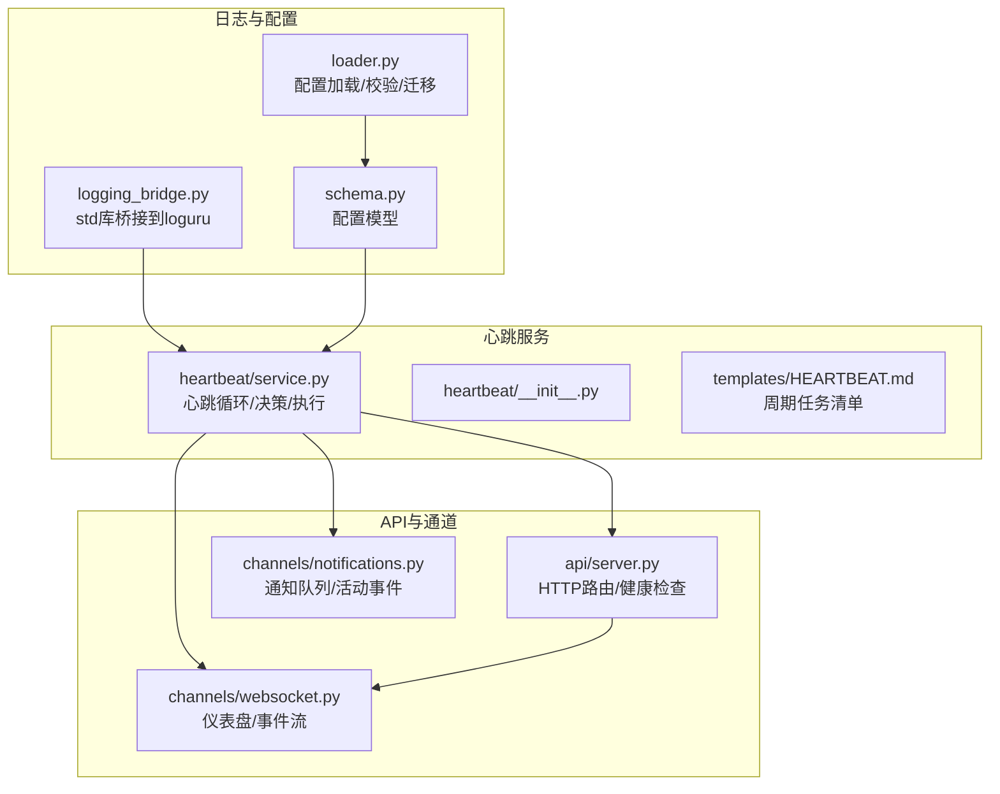
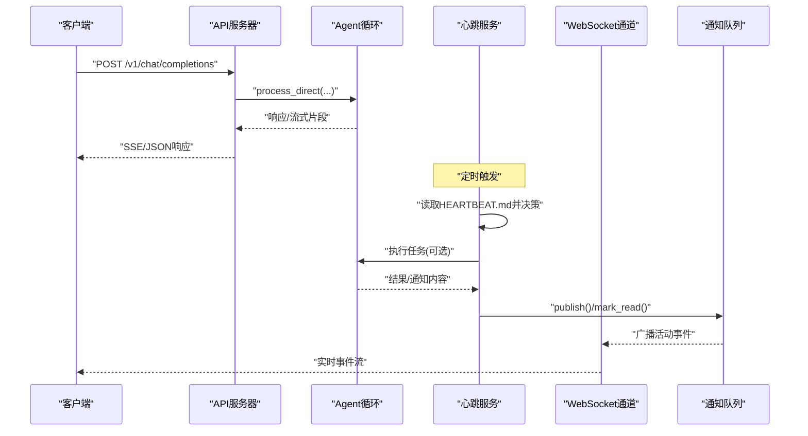
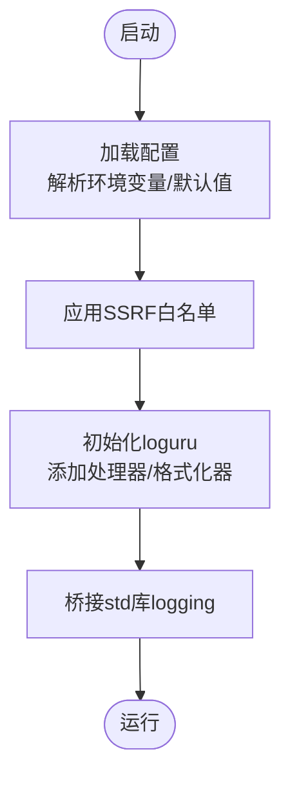
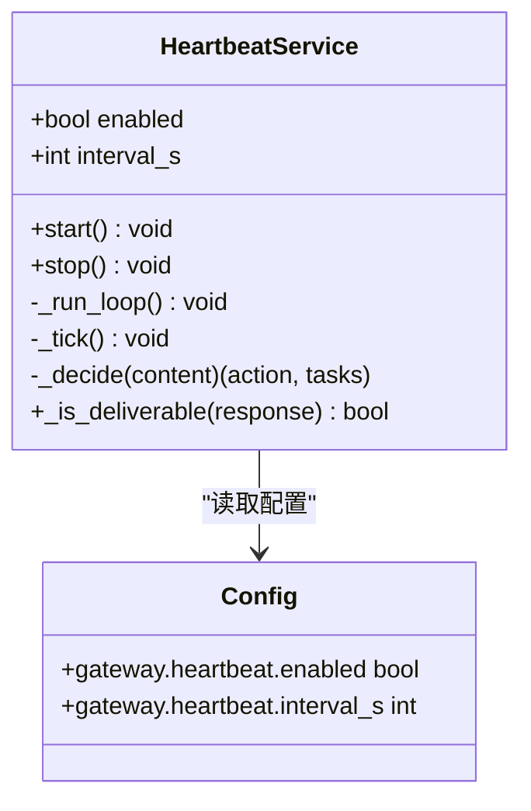
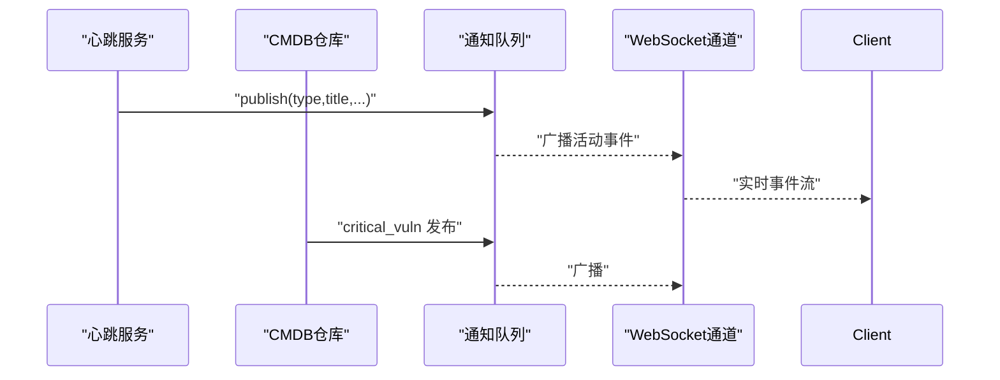
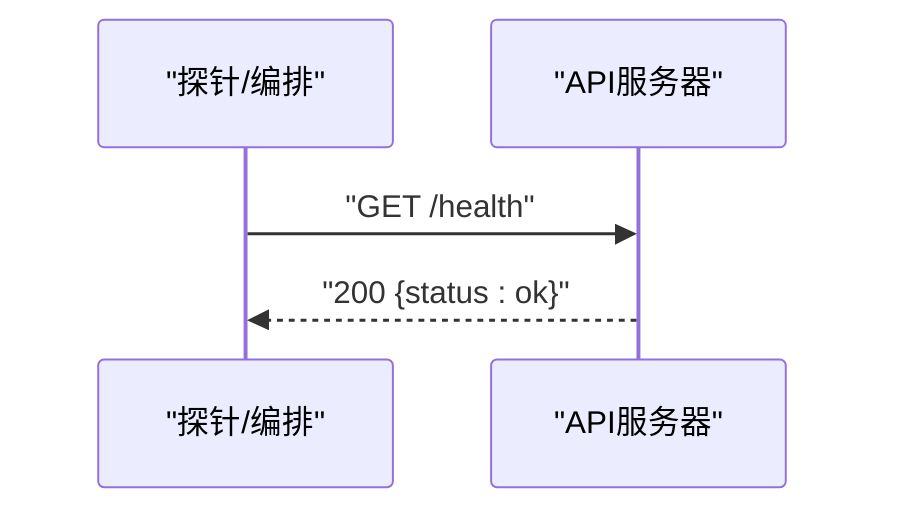
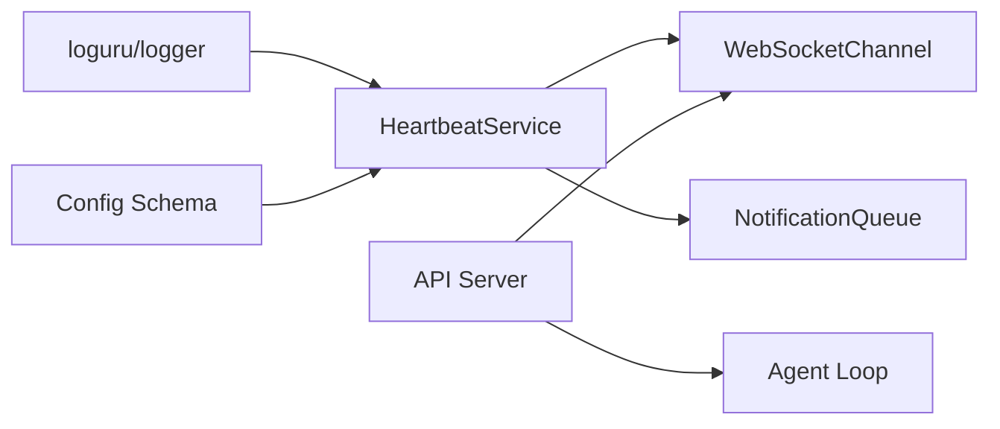

# 日志与监控

<cite>
**本文引用的文件**
- [secbot/heartbeat/service.py](file://secbot/heartbeat/service.py)
- [secbot/heartbeat/__init__.py](file://secbot/heartbeat/__init__.py)
- [secbot/utils/logging_bridge.py](file://secbot/utils/logging_bridge.py)
- [secbot/config/schema.py](file://secbot/config/schema.py)
- [secbot/config/loader.py](file://secbot/config/loader.py)
- [secbot/api/server.py](file://secbot/api/server.py)
- [secbot/channels/notifications.py](file://secbot/channels/notifications.py)
- [secbot/channels/websocket.py](file://secbot/channels/websocket.py)
- [secbot/cli/commands.py](file://secbot/cli/commands.py)
- [tests/agent/test_heartbeat_service.py](file://tests/agent/test_heartbeat_service.py)
- [tests/heartbeat/test_heartbeat_deliverability.py](file://tests/heartbeat/test_heartbeat_deliverability.py)
- [docs/configuration.md](file://docs/configuration.md)
- [secbot/templates/HEARTBEAT.md](file://secbot/templates/HEARTBEAT.md)
</cite>

## 目录
1. [简介](#简介)
2. [项目结构](#项目结构)
3. [核心组件](#核心组件)
4. [架构总览](#架构总览)
5. [详细组件分析](#详细组件分析)
6. [依赖关系分析](#依赖关系分析)
7. [性能考量](#性能考量)
8. [故障排查指南](#故障排查指南)
9. [结论](#结论)
10. [附录](#附录)

## 简介
本指南面向VAPT3项目的日志系统与监控配置，围绕以下目标展开：
- 基于loguru的日志体系：框架使用、级别控制、输出格式与桥接std库
- 日志分析方法：聚合、关键词检索、时间序列分析
- 心跳服务监控：健康检查、服务状态、故障检测
- 错误监控与告警：异常捕获、错误上报、通知机制
- 性能监控指标：响应时间、吞吐量、资源使用
- 生产环境最佳实践与工具推荐

## 项目结构
与日志与监控密切相关的模块分布如下：
- 日志与桥接：secbot/utils/logging_bridge.py
- 配置模型：secbot/config/schema.py、secbot/config/loader.py
- 心跳服务：secbot/heartbeat/service.py、secbot/heartbeat/__init__.py、secbot/templates/HEARTBEAT.md
- API与健康检查：secbot/api/server.py
- 通知与活动事件流：secbot/channels/notifications.py、secbot/channels/websocket.py
- CLI集成：secbot/cli/commands.py
- 测试用例：tests/agent/test_heartbeat_service.py、tests/heartbeat/test_heartbeat_deliverability.py

图表来源
- [secbot/utils/logging_bridge.py:1-47](file://secbot/utils/logging_bridge.py#L1-L47)
- [secbot/config/schema.py:174-180](file://secbot/config/schema.py#L174-L180)
- [secbot/config/loader.py:32-56](file://secbot/config/loader.py#L32-L56)
- [secbot/heartbeat/service.py:40-154](file://secbot/heartbeat/service.py#L40-L154)
- [secbot/heartbeat/__init__.py:1-5](file://secbot/heartbeat/__init__.py#L1-L5)
- [secbot/templates/HEARTBEAT.md:1-17](file://secbot/templates/HEARTBEAT.md#L1-L17)
- [secbot/api/server.py:371-373](file://secbot/api/server.py#L371-L373)
- [secbot/channels/websocket.py:1117-1133](file://secbot/channels/websocket.py#L1117-L1133)
- [secbot/channels/notifications.py:1-385](file://secbot/channels/notifications.py#L1-L385)

章节来源
- [secbot/utils/logging_bridge.py:1-47](file://secbot/utils/logging_bridge.py#L1-L47)
- [secbot/config/schema.py:174-180](file://secbot/config/schema.py#L174-L180)
- [secbot/config/loader.py:32-56](file://secbot/config/loader.py#L32-L56)
- [secbot/heartbeat/service.py:40-154](file://secbot/heartbeat/service.py#L40-L154)
- [secbot/heartbeat/__init__.py:1-5](file://secbot/heartbeat/__init__.py#L1-L5)
- [secbot/templates/HEARTBEAT.md:1-17](file://secbot/templates/HEARTBEAT.md#L1-L17)
- [secbot/api/server.py:371-373](file://secbot/api/server.py#L371-L373)
- [secbot/channels/websocket.py:1117-1133](file://secbot/channels/websocket.py#L1117-L1133)
- [secbot/channels/notifications.py:1-385](file://secbot/channels/notifications.py#L1-L385)

## 核心组件
- 日志桥接器：将标准库logging消息桥接至loguru，统一格式与级别映射，避免重复输出
- 配置系统：集中定义心跳、网关、工具等配置项，支持环境变量解析与默认值
- 心跳服务：周期性检查任务清单，通过LLM决策是否执行，并进行通知与评估
- API健康检查：提供轻量HTTP健康端点，便于外部探活
- 通知与活动事件：内存环形缓冲队列，支持通知列表、标记已读、活动事件流

章节来源
- [secbot/utils/logging_bridge.py:9-47](file://secbot/utils/logging_bridge.py#L9-L47)
- [secbot/config/schema.py:174-180](file://secbot/config/schema.py#L174-L180)
- [secbot/config/loader.py:86-147](file://secbot/config/loader.py#L86-L147)
- [secbot/heartbeat/service.py:40-154](file://secbot/heartbeat/service.py#L40-L154)
- [secbot/api/server.py:371-373](file://secbot/api/server.py#L371-L373)
- [secbot/channels/notifications.py:127-225](file://secbot/channels/notifications.py#L127-L225)

## 架构总览
下图展示从请求到心跳、通知与仪表盘的整体流程。

图表来源
- [secbot/api/server.py:194-350](file://secbot/api/server.py#L194-L350)
- [secbot/heartbeat/service.py:118-149](file://secbot/heartbeat/service.py#L118-L149)
- [secbot/channels/notifications.py:143-171](file://secbot/channels/notifications.py#L143-L171)
- [secbot/channels/websocket.py:1117-1133](file://secbot/channels/websocket.py#L1117-L1133)

## 详细组件分析

### 日志系统与配置
- loguru使用与桥接
  - 使用方式：在各模块导入loguru的logger并直接记录
  - 桥接策略：通过自定义Handler将logging.Logger的消息转换为loguru格式，避免重复与层级混乱
  - 级别映射：DEBUG/INFO/WARNING/ERROR/CRITICAL 映射为loguru级别
  - 异常处理：桥接器自动透传exc_info，确保堆栈信息保留
- 配置加载与验证
  - 支持从文件加载、环境变量替换、字段迁移与SSRF白名单应用
  - 配置对象基于Pydantic，提供类型安全与默认值
- 输出格式与级别
  - 建议在生产中统一格式化器，结合上下文字段（如lib、level、message）
  - 通过CLI或环境变量调整全局级别，避免在业务代码中硬编码

图表来源
- [secbot/config/loader.py:32-81](file://secbot/config/loader.py#L32-L81)
- [secbot/utils/logging_bridge.py:34-47](file://secbot/utils/logging_bridge.py#L34-L47)

章节来源
- [secbot/utils/logging_bridge.py:9-47](file://secbot/utils/logging_bridge.py#L9-L47)
- [secbot/config/loader.py:32-81](file://secbot/config/loader.py#L32-L81)
- [secbot/config/schema.py:267-376](file://secbot/config/schema.py#L267-L376)

### 心跳服务监控
- 服务职责
  - 周期性读取HEARTBEAT.md，通过LLM判断是否有待办任务
  - 决策阶段返回action与tasks摘要；执行阶段可触发完整Agent流程
  - 评估阶段决定是否对外通知；支持瞬时错误重试
- 健康检查与状态
  - CLI启动时打印心跳间隔与通道状态
  - API提供轻量健康端点用于探活
- 故障检测
  - 循环内捕获异常并记录；支持取消与停止
  - deliverability过滤器避免泄露内部提示词或逻辑

图表来源
- [secbot/heartbeat/service.py:40-154](file://secbot/heartbeat/service.py#L40-L154)
- [secbot/config/schema.py:174-180](file://secbot/config/schema.py#L174-L180)

章节来源
- [secbot/heartbeat/service.py:118-149](file://secbot/heartbeat/service.py#L118-L149)
- [secbot/heartbeat/service.py:40-117](file://secbot/heartbeat/service.py#L40-L117)
- [secbot/templates/HEARTBEAT.md:1-17](file://secbot/templates/HEARTBEAT.md#L1-L17)
- [secbot/cli/commands.py:956-965](file://secbot/cli/commands.py#L956-L965)
- [tests/agent/test_heartbeat_service.py:25-45](file://tests/agent/test_heartbeat_service.py#L25-L45)
- [tests/heartbeat/test_heartbeat_deliverability.py:13-79](file://tests/heartbeat/test_heartbeat_deliverability.py#L13-L79)

### 通知与活动事件流
- 通知队列
  - 内存环形缓冲，支持发布、标记已读、批量已读、快照与未读计数
  - 支持通过环境变量调整缓冲大小与窗口
- 活动事件流
  - 事件缓冲支持按时间窗口过滤与限制数量
  - 与WebSocket通道集成，提供HTTP接口与实时推送
- 与心跳联动
  - 关键事件（如高危漏洞新增）可直接发布通知，无需额外钩子层

图表来源
- [secbot/channels/notifications.py:143-171](file://secbot/channels/notifications.py#L143-L171)
- [secbot/channels/notifications.py:280-314](file://secbot/channels/notifications.py#L280-L314)
- [secbot/channels/websocket.py:1117-1133](file://secbot/channels/websocket.py#L1117-L1133)

章节来源
- [secbot/channels/notifications.py:1-385](file://secbot/channels/notifications.py#L1-L385)
- [secbot/channels/websocket.py:1117-1133](file://secbot/channels/websocket.py#L1117-L1133)

### API健康检查与错误处理
- 健康端点
  - 提供轻量HTTP健康检查接口，便于负载均衡与编排系统探测
- 错误处理
  - 统一异常捕获与日志记录，返回标准化错误响应
  - 对空响应进行重试与降级处理

图表来源
- [secbot/api/server.py:371-373](file://secbot/api/server.py#L371-L373)

章节来源
- [secbot/api/server.py:371-373](file://secbot/api/server.py#L371-L373)
- [secbot/api/server.py:232-348](file://secbot/api/server.py#L232-L348)

## 依赖关系分析
- 心跳服务依赖配置模型与日志；与通知/WebSocket存在运行时耦合
- API层依赖Agent循环与会话锁；与通知/事件流解耦
- 通知与事件流为纯内存实现，通过WebSocket暴露HTTP接口

图表来源
- [secbot/heartbeat/service.py:40-154](file://secbot/heartbeat/service.py#L40-L154)
- [secbot/config/schema.py:174-180](file://secbot/config/schema.py#L174-L180)
- [secbot/channels/websocket.py:1117-1133](file://secbot/channels/websocket.py#L1117-L1133)
- [secbot/channels/notifications.py:1-385](file://secbot/channels/notifications.py#L1-L385)
- [secbot/api/server.py:381-401](file://secbot/api/server.py#L381-L401)

章节来源
- [secbot/heartbeat/service.py:40-154](file://secbot/heartbeat/service.py#L40-L154)
- [secbot/config/schema.py:174-180](file://secbot/config/schema.py#L174-L180)
- [secbot/channels/websocket.py:1117-1133](file://secbot/channels/websocket.py#L1117-L1133)
- [secbot/channels/notifications.py:1-385](file://secbot/channels/notifications.py#L1-L385)
- [secbot/api/server.py:381-401](file://secbot/api/server.py#L381-L401)

## 性能考量
- 响应时间
  - API层对超时进行显式控制，建议结合上游LLM与工具调用耗时设定合理阈值
  - 心跳循环采用非阻塞睡眠与异常隔离，避免长尾影响
- 吞吐量
  - 会话锁按session_key粒度管理，减少并发冲突
  - 通知与事件缓冲为内存实现，适合短期观测；大规模场景建议持久化与限流
- 资源使用
  - 建议在容器中限制CPU/内存并开启进程外日志采集
  - 对工具调用结果进行预览与落盘策略，避免内存膨胀

## 故障排查指南
- 心跳服务问题
  - 检查HEARTBEAT.md是否存在且有有效任务
  - 查看心跳循环异常日志与取消状态
  - 验证deliverability过滤是否导致消息被抑制
- API错误
  - 关注请求解析、文件大小限制、超时与空响应重试路径
  - 使用健康端点确认服务可用性
- 通知与事件流
  - 检查缓冲容量与窗口设置，确认未读计数与列表接口行为
  - 核对WebSocket连接与事件广播链路

章节来源
- [tests/agent/test_heartbeat_service.py:172-216](file://tests/agent/test_heartbeat_service.py#L172-L216)
- [tests/heartbeat/test_heartbeat_deliverability.py:13-79](file://tests/heartbeat/test_heartbeat_deliverability.py#L13-L79)
- [secbot/api/server.py:217-348](file://secbot/api/server.py#L217-L348)
- [secbot/channels/notifications.py:200-225](file://secbot/channels/notifications.py#L200-L225)

## 结论
VAPT3的日志与监控体系以loguru为核心，配合配置驱动的心跳服务、通知与事件流，以及简洁的健康检查端点，形成了可观测、可扩展的基础能力。建议在生产中统一日志格式与级别、完善告警规则与仪表盘，并结合容器与日志采集方案实现持续监控。

## 附录
- 配置参考与环境变量
  - 参考配置文档了解环境变量占位符与解析流程
- 心跳任务模板
  - 使用HEARTBEAT.md维护周期任务，避免空文件导致跳过

章节来源
- [docs/configuration.md:10-27](file://docs/configuration.md#L10-L27)
- [secbot/templates/HEARTBEAT.md:1-17](file://secbot/templates/HEARTBEAT.md#L1-L17)