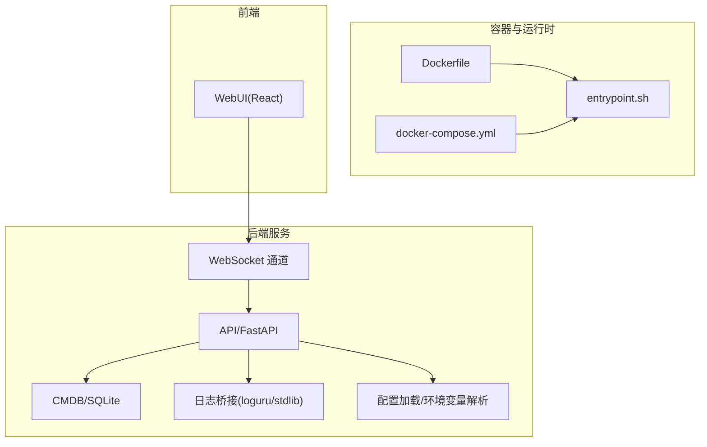
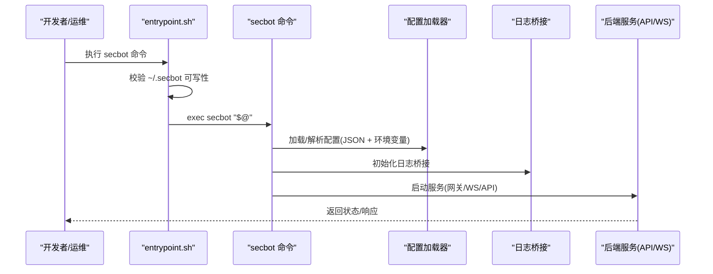
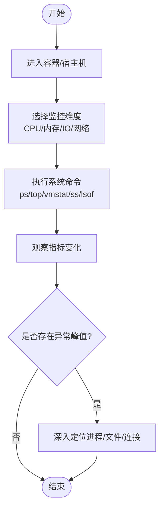
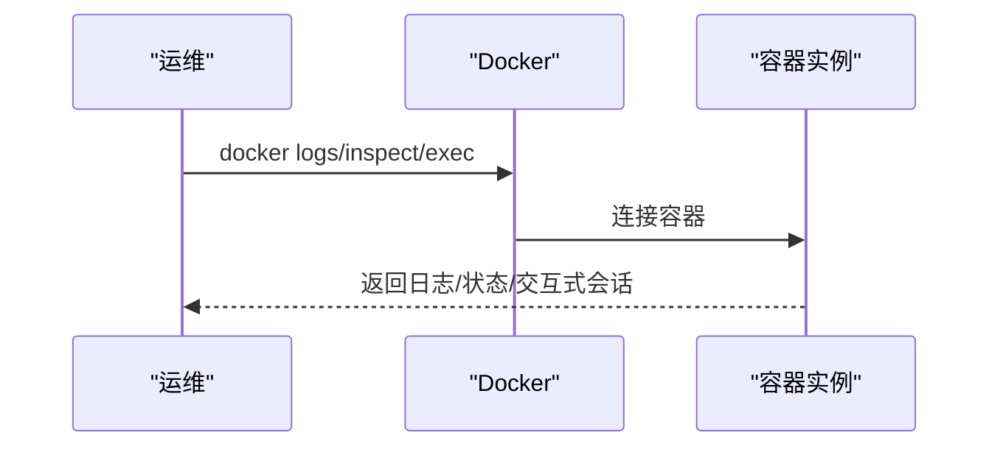
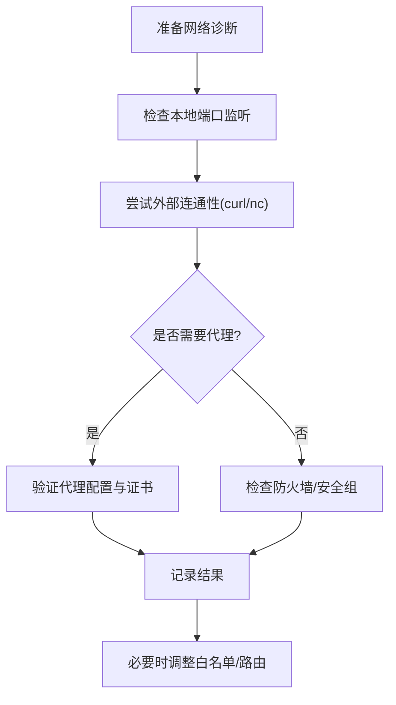
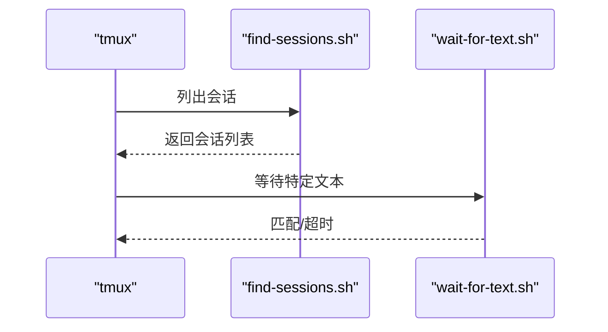
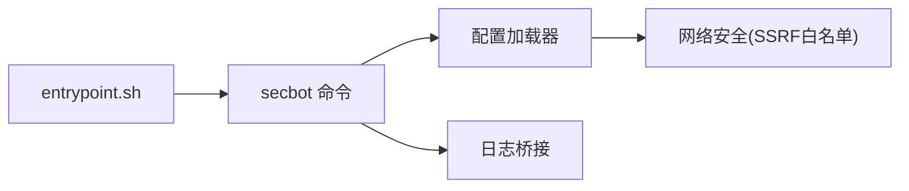
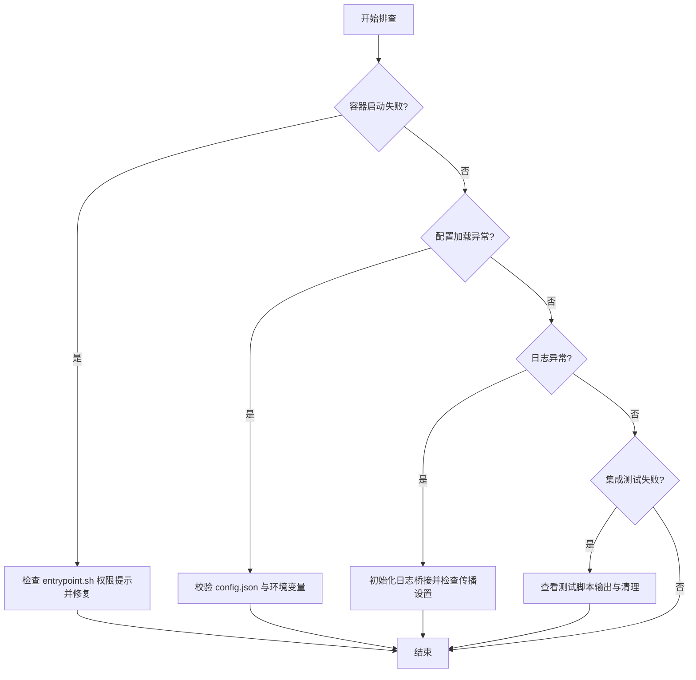

# 系统级调试

<cite>
**本文引用的文件**
- [README.md](file://README.md)
- [Dockerfile](file://Dockerfile)
- [docker-compose.yml](file://docker-compose.yml)
- [entrypoint.sh](file://entrypoint.sh)
- [core_agent_lines.sh](file://core_agent_lines.sh)
- [tests/test_docker.sh](file://tests/test_docker.sh)
- [secbot/skills/tmux/scripts/find-sessions.sh](file://secbot/skills/tmux/scripts/find-sessions.sh)
- [secbot/skills/tmux/scripts/wait-for-text.sh](file://secbot/skills/tmux/scripts/wait-for-text.sh)
- [secbot/utils/logging_bridge.py](file://secbot/utils/logging_bridge.py)
- [secbot/config/loader.py](file://secbot/config/loader.py)
</cite>

## 目录
1. [简介](#简介)
2. [项目结构](#项目结构)
3. [核心组件](#核心组件)
4. [架构总览](#架构总览)
5. [详细组件分析](#详细组件分析)
6. [依赖关系分析](#依赖关系分析)
7. [性能考量](#性能考量)
8. [故障排查指南](#故障排查指南)
9. [结论](#结论)
10. [附录](#附录)

## 简介
本指南面向VAPT3系统级调试与运维，围绕进程监控、Docker容器调试、系统资源分析、网络调试、并发问题定位以及生产环境实用工具与命令集合展开。内容结合仓库中的实际实现与脚本，帮助读者在真实环境中快速定位问题并恢复服务。

## 项目结构
VAPT3采用多层架构：对话交互层、调度编排层、专家智能体层、工具执行层。同时提供Docker镜像与编排文件，便于在容器环境中部署与调试。

图表来源
- [Dockerfile:1-51](file://Dockerfile#L1-L51)
- [docker-compose.yml:1-56](file://docker-compose.yml#L1-L56)
- [entrypoint.sh:1-16](file://entrypoint.sh#L1-L16)
- [secbot/utils/logging_bridge.py:1-48](file://secbot/utils/logging_bridge.py#L1-L48)
- [secbot/config/loader.py:1-173](file://secbot/config/loader.py#L1-L173)

章节来源
- [README.md:29-75](file://README.md#L29-L75)
- [Dockerfile:1-51](file://Dockerfile#L1-L51)
- [docker-compose.yml:1-56](file://docker-compose.yml#L1-L56)

## 核心组件
- 容器与入口
  - Dockerfile定义基础镜像、依赖安装、非root用户与暴露端口。
  - docker-compose定义服务、资源限制、卷挂载与安全选项。
  - entrypoint.sh负责宿主机目录写权限检查与执行secbot命令。
- 日志与配置
  - 日志桥接：将标准库logging重定向至loguru，统一格式与层级。
  - 配置加载：支持JSON配置、环境变量占位符解析、SSRF白名单应用与配置迁移。
- 调试辅助脚本
  - tmux会话查找与文本等待脚本，便于在容器或远程会话中定位输出。
  - Docker集成测试脚本，演示镜像构建、初始化与状态检查流程。

章节来源
- [Dockerfile:1-51](file://Dockerfile#L1-L51)
- [docker-compose.yml:1-56](file://docker-compose.yml#L1-L56)
- [entrypoint.sh:1-16](file://entrypoint.sh#L1-L16)
- [secbot/utils/logging_bridge.py:1-48](file://secbot/utils/logging_bridge.py#L1-L48)
- [secbot/config/loader.py:1-173](file://secbot/config/loader.py#L1-L173)
- [secbot/skills/tmux/scripts/find-sessions.sh:1-113](file://secbot/skills/tmux/scripts/find-sessions.sh#L1-L113)
- [secbot/skills/tmux/scripts/wait-for-text.sh:1-84](file://secbot/skills/tmux/scripts/wait-for-text.sh#L1-L84)
- [tests/test_docker.sh:1-57](file://tests/test_docker.sh#L1-L57)

## 架构总览
下图展示从容器入口到后端服务的关键路径，以及日志与配置在系统中的作用。

图表来源
- [entrypoint.sh:1-16](file://entrypoint.sh#L1-L16)
- [secbot/config/loader.py:32-56](file://secbot/config/loader.py#L32-L56)
- [secbot/utils/logging_bridge.py:34-47](file://secbot/utils/logging_bridge.py#L34-L47)

## 详细组件分析

### 进程监控与资源占用分析
- 进程状态与资源占用
  - 使用容器内shell进入后，可结合系统命令观察进程与资源。例如：top、htop、ps、vmstat、iostat、iotop、ss/netstat、lsof、strace等。
  - 在容器中可通过docker exec进入交互式shell，结合上述命令进行实时观测。
- 容器资源限制与隔离
  - docker-compose为各服务设置了CPU与内存上限与预留，有助于定位资源瓶颈与异常飙升。
- 实用脚本参考
  - core_agent_lines.sh用于统计核心模块与扩展模块代码行数，便于评估系统复杂度与潜在性能热点。

章节来源
- [docker-compose.yml:23-31](file://docker-compose.yml#L23-L31)
- [docker-compose.yml:40-47](file://docker-compose.yml#L40-L47)
- [core_agent_lines.sh:1-93](file://core_agent_lines.sh#L1-L93)

### Docker容器调试技巧
- 容器日志查看
  - 使用docker logs查看容器标准输出与错误输出；结合--since/--until过滤时间段。
  - 在docker-compose中，服务日志默认输出到守护进程日志系统，可配合journalctl或容器平台日志收集。
- 容器内shell访问
  - 使用docker exec -it <container> /bin/bash进入交互式shell，便于手动复现与调试。
  - 若容器未安装bash，可使用sh或其他可用shell。
- 网络连接检查
  - 在容器内使用curl/wget/nc进行连通性测试；检查DNS解析与路由。
  - 使用docker network ls/inspect查看网络拓扑与端口映射。
- 安全与权限
  - entrypoint.sh会在宿主机配置目录不可写时给出明确错误与修复建议，避免权限问题导致的启动失败。

图表来源
- [entrypoint.sh:1-16](file://entrypoint.sh#L1-L16)
- [docker-compose.yml:15-56](file://docker-compose.yml#L15-L56)

章节来源
- [entrypoint.sh:1-16](file://entrypoint.sh#L1-L16)
- [docker-compose.yml:1-56](file://docker-compose.yml#L1-L56)

### 系统资源分析
- CPU使用率监控
  - top/htop观察负载与进程CPU占比；结合docker stats查看容器CPU使用趋势。
- 内存泄漏检测
  - 使用free、cat /proc/meminfo、smem、pmap等工具定位异常增长；关注常驻内存与缓存差异。
- 磁盘空间检查
  - df -h查看根分区与日志目录空间；du -sh /var/log/* 分析日志占用。
- 文件句柄与打开文件
  - lsof +D /var/log 查看被占用的日志文件；结合inode使用情况判断句柄泄露。

章节来源
- [docker-compose.yml:23-31](file://docker-compose.yml#L23-L31)
- [docker-compose.yml:40-47](file://docker-compose.yml#L40-L47)

### 网络调试方法
- 端口检查
  - ss -tulnp查看监听端口；netstat -tulpn同上；在容器内使用nc或nmap进行端口探测。
- 连接测试
  - curl/ wget测试HTTP/HTTPS可达性；openssl s_client -connect host:port验证TLS握手。
- 代理配置验证
  - 在容器启动参数或环境变量中设置HTTP_PROXY/HTTPS_PROXY；使用curl -v验证代理链路。
- SSRF白名单与网络策略
  - 配置加载器支持SSRF白名单应用，确保对外请求受控。

章节来源
- [secbot/config/loader.py:59-64](file://secbot/config/loader.py#L59-L64)

### 并发问题调试
- 死锁检测
  - 使用strace -p PID观察系统调用阻塞；gdb附加进程查看线程堆栈。
- 竞态条件分析
  - 通过日志时间戳与关键事件序列交叉比对；必要时开启更细粒度日志级别。
- 线程池问题排查
  - 观察线程数量与队列长度；结合CPU使用率判断是否存在饥饿或过载。
- tmux辅助
  - 使用find-sessions.sh列出会话；使用wait-for-text.sh等待特定输出，便于在长任务中定位完成信号或错误信息。

图表来源
- [secbot/skills/tmux/scripts/find-sessions.sh:51-74](file://secbot/skills/tmux/scripts/find-sessions.sh#L51-L74)
- [secbot/skills/tmux/scripts/wait-for-text.sh:66-83](file://secbot/skills/tmux/scripts/wait-for-text.sh#L66-L83)

章节来源
- [secbot/skills/tmux/scripts/find-sessions.sh:1-113](file://secbot/skills/tmux/scripts/find-sessions.sh#L1-L113)
- [secbot/skills/tmux/scripts/wait-for-text.sh:1-84](file://secbot/skills/tmux/scripts/wait-for-text.sh#L1-L84)

### 生产环境问题排查实用工具与命令集合
- 容器与镜像
  - docker images/pull/build；docker ps -a；docker inspect <id>；docker events --since 1h
- 日志与配置
  - journalctl -u <service> --since "10 min ago"；cat ~/.secbot/config.json；env | grep -E "(PROXY|HTTP_PROXY)"
- 进程与资源
  - ps aux --sort=-%cpu | head -10；top -b -n1 | head -20；docker stats --no-stream
- 网络
  - ss -tulnp；curl -Ivk https://example.com；openssl s_client -connect example.com:443
- 安全与权限
  - entrypoint.sh提供的权限错误提示与修复建议；检查SELinux/AppArmor状态

章节来源
- [entrypoint.sh:1-16](file://entrypoint.sh#L1-L16)
- [docker-compose.yml:1-56](file://docker-compose.yml#L1-L56)
- [README.md:113-179](file://README.md#L113-L179)

## 依赖关系分析
- 容器入口依赖
  - entrypoint.sh依赖宿主机配置目录可写；若不可写则直接退出并提示修复方案。
- 配置与网络
  - 配置加载器在加载时应用SSRF白名单，影响对外网络请求行为。
- 日志系统
  - 日志桥接将标准库日志统一接入loguru，减少重复与格式不一致问题。

图表来源
- [entrypoint.sh:1-16](file://entrypoint.sh#L1-L16)
- [secbot/config/loader.py:59-64](file://secbot/config/loader.py#L59-L64)
- [secbot/utils/logging_bridge.py:34-47](file://secbot/utils/logging_bridge.py#L34-L47)

章节来源
- [entrypoint.sh:1-16](file://entrypoint.sh#L1-L16)
- [secbot/config/loader.py:1-173](file://secbot/config/loader.py#L1-L173)
- [secbot/utils/logging_bridge.py:1-48](file://secbot/utils/logging_bridge.py#L1-L48)

## 性能考量
- 资源限制
  - docker-compose为服务设置了CPU与内存上限与预留，有助于防止资源争抢与雪崩效应。
- 日志级别与开销
  - 合理设置日志级别，避免过多DEBUG/INFO带来的I/O开销。
- 外部工具调用
  - 安全扫描类工具（nmap/nuclei/hydra）通常为外部二进制，注意其自身性能参数与并发控制。

章节来源
- [docker-compose.yml:23-31](file://docker-compose.yml#L23-L31)
- [docker-compose.yml:40-47](file://docker-compose.yml#L40-L47)
- [README.md:66-72](file://README.md#L66-L72)

## 故障排查指南
- 容器启动失败（权限问题）
  - 现象：entrypoint.sh提示配置目录不可写。
  - 处理：根据提示修改宿主机目录属主与权限，或以正确用户ID运行容器。
- 配置加载异常
  - 现象：配置文件损坏或字段缺失，系统回退默认配置。
  - 处理：检查~/.secbot/config.json格式与字段；确认环境变量占位符已设置。
- 日志缺失或重复
  - 现象：标准库日志未显示或重复输出。
  - 处理：确保已初始化日志桥接；检查propagate设置。
- Docker集成测试失败
  - 现象：镜像构建后状态检查未包含预期关键字。
  - 处理：查看测试脚本输出与清理步骤，确认镜像构建与初始化流程。

章节来源
- [entrypoint.sh:1-16](file://entrypoint.sh#L1-L16)
- [secbot/config/loader.py:42-56](file://secbot/config/loader.py#L42-L56)
- [secbot/utils/logging_bridge.py:34-47](file://secbot/utils/logging_bridge.py#L34-L47)
- [tests/test_docker.sh:1-57](file://tests/test_docker.sh#L1-L57)

## 结论
通过容器入口脚本、配置加载与日志桥接机制，VAPT3在生产环境中具备良好的可观测性与可控性。结合Docker资源限制、tmux辅助与系统命令，可高效完成进程监控、资源分析、网络连通性与并发问题的定位与修复。建议在日常运维中固定使用本文提供的工具与流程，形成标准化的系统级调试实践。

## 附录
- Docker常用命令
  - 构建：docker build -t secbot .
  - 运行：docker run --rm -it secbot onboard
  - 日志：docker logs -f secbot-gateway
  - 进入：docker exec -it secbot-gateway /bin/bash
- tmux辅助脚本
  - 查找会话：find-sessions.sh
  - 等待文本：wait-for-text.sh -t session:window.pane -p "pattern"

章节来源
- [tests/test_docker.sh:1-57](file://tests/test_docker.sh#L1-L57)
- [secbot/skills/tmux/scripts/find-sessions.sh:1-113](file://secbot/skills/tmux/scripts/find-sessions.sh#L1-L113)
- [secbot/skills/tmux/scripts/wait-for-text.sh:1-84](file://secbot/skills/tmux/scripts/wait-for-text.sh#L1-L84)