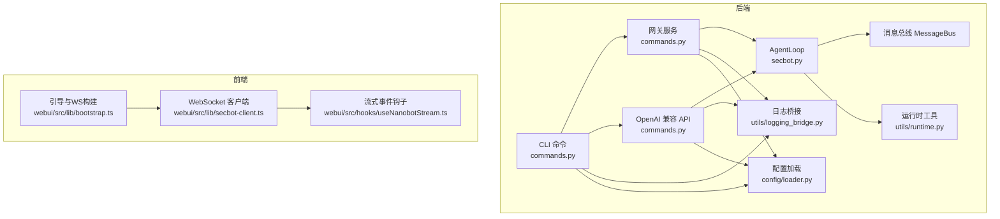
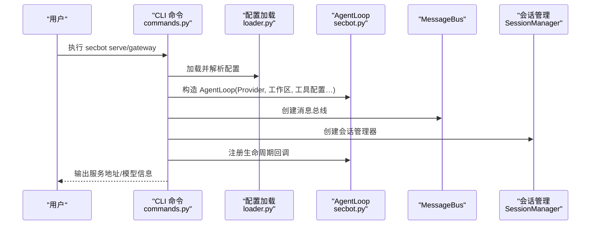
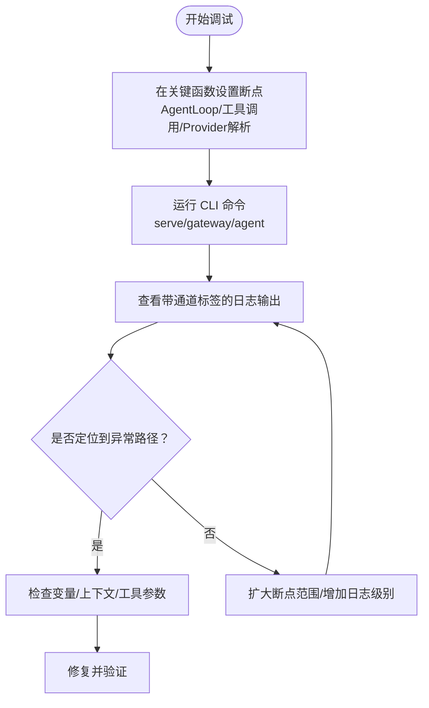
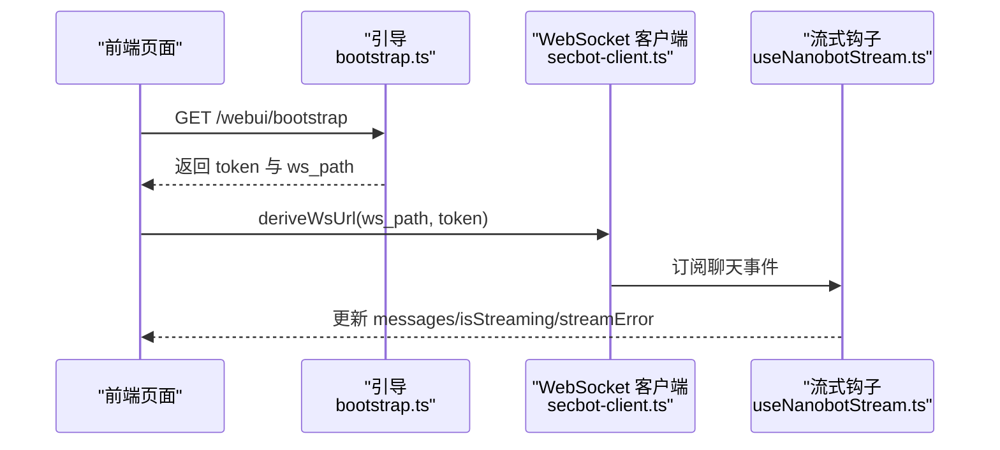
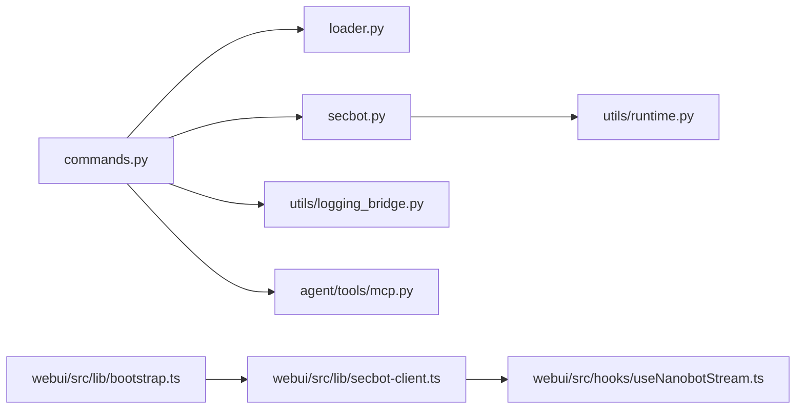

# 调试技巧与故障排除

<cite>
**本文引用的文件**
- [secbot/__main__.py](file://secbot/__main__.py)
- [secbot/secbot.py](file://secbot/secbot.py)
- [secbot/cli/commands.py](file://secbot/cli/commands.py)
- [secbot/config/loader.py](file://secbot/config/loader.py)
- [secbot/utils/logging_bridge.py](file://secbot/utils/logging_bridge.py)
- [secbot/utils/runtime.py](file://secbot/utils/runtime.py)
- [secbot/agent/runner.py](file://secbot/agent/runner.py)
- [secbot/providers/base.py](file://secbot/providers/base.py)
- [secbot/providers/openai_compat_provider.py](file://secbot/providers/openai_compat_provider.py)
- [secbot/agent/tools/mcp.py](file://secbot/agent/tools/mcp.py)
- [webui/src/lib/bootstrap.ts](file://webui/src/lib/bootstrap.ts)
- [webui/src/lib/secbot-client.ts](file://webui/src/lib/secbot-client.ts)
- [webui/src/hooks/useNanobotStream.ts](file://webui/src/hooks/useNanobotStream.ts)
- [tests/tools/test_mcp_tool.py](file://tests/tools/test_mcp_tool.py)
- [webui/src/tests/secbot-client.test.ts](file://webui/src/tests/secbot-client.test.ts)
- [.trellis/spec/backend/error-handling.md](file://.trellis/spec/backend/error-handling.md)
</cite>

## 目录
1. [简介](#简介)
2. [项目结构](#项目结构)
3. [核心组件](#核心组件)
4. [架构总览](#架构总览)
5. [详细组件分析](#详细组件分析)
6. [依赖分析](#依赖分析)
7. [性能考虑](#性能考虑)
8. [故障排除指南](#故障排除指南)
9. [结论](#结论)
10. [附录](#附录)

## 简介
本文件面向 VAPT3/secbot 的开发者与运维人员，提供系统化的调试技巧与故障排除指南。内容覆盖：
- Python 后端调试：pdb 使用、日志分析、性能分析、内存泄漏检测
- 前端调试：React DevTools 使用、网络请求分析、状态检查
- 系统级调试：进程监控、资源使用分析、错误追踪
- 常见问题诊断：性能问题、内存问题、并发问题
- 日志系统使用与分析方法
- 错误监控与告警配置建议
- 生产环境问题排查实用技巧与工具推荐

## 项目结构
secbot 采用“Python 后端 + WebUI 前端”的双层架构：
- 后端通过 CLI 提供交互式会话、网关服务与 OpenAI 兼容 API 服务；核心运行时由 AgentLoop 驱动，消息通过 MessageBus 传递，工具链（如 MCP、Web 抓取、执行）在受控沙箱中运行。
- 前端基于 React + TypeScript，通过 WebSocket 与后端网关通信，使用自定义客户端库进行连接管理、重连与事件流处理。

图表来源
- [secbot/cli/commands.py:514-601](file://secbot/cli/commands.py#L514-L601)
- [secbot/secbot.py:23-91](file://secbot/secbot.py#L23-L91)
- [secbot/utils/runtime.py:1-171](file://secbot/utils/runtime.py#L1-L171)
- [secbot/utils/logging_bridge.py:1-47](file://secbot/utils/logging_bridge.py#L1-L47)
- [secbot/config/loader.py:32-81](file://secbot/config/loader.py#L32-L81)
- [webui/src/lib/bootstrap.ts:37-76](file://webui/src/lib/bootstrap.ts#L37-L76)
- [webui/src/lib/secbot-client.ts:340-376](file://webui/src/lib/secbot-client.ts#L340-L376)
- [webui/src/hooks/useNanobotStream.ts:79-280](file://webui/src/hooks/useNanobotStream.ts#L79-L280)

章节来源
- [secbot/__main__.py:1-9](file://secbot/__main__.py#L1-L9)
- [secbot/cli/commands.py:514-601](file://secbot/cli/commands.py#L514-L601)
- [secbot/secbot.py:23-91](file://secbot/secbot.py#L23-L91)
- [webui/src/lib/bootstrap.ts:37-76](file://webui/src/lib/bootstrap.ts#L37-L76)

## 核心组件
- CLI 与命令入口：统一的日志格式化、历史记录、交互式输入、网关与 API 启动。
- AgentLoop：核心执行循环，承载工具调用、上下文窗口、会话管理、错误分类与重试策略。
- MessageBus：事件总线，负责消息分发与通道投递。
- 工具与运行时：MCP、Web 抓取、执行、沙箱等工具的超时与取消处理。
- 日志系统：loguru 统一输出，stdlogging 桥接到 loguru，支持通道标签与级别过滤。
- 配置系统：JSON Schema 校验、环境变量解析、SSRF 白名单注入。
- 前端客户端：引导获取 token 与 WS 路径、指数退避重连、事件订阅与消息缓冲。

章节来源
- [secbot/cli/commands.py:25-38](file://secbot/cli/commands.py#L25-L38)
- [secbot/secbot.py:23-132](file://secbot/secbot.py#L23-L132)
- [secbot/utils/runtime.py:1-171](file://secbot/utils/runtime.py#L1-L171)
- [secbot/utils/logging_bridge.py:1-47](file://secbot/utils/logging_bridge.py#L1-L47)
- [secbot/config/loader.py:32-81](file://secbot/config/loader.py#L32-L81)
- [webui/src/lib/bootstrap.ts:37-76](file://webui/src/lib/bootstrap.ts#L37-L76)
- [webui/src/lib/secbot-client.ts:340-376](file://webui/src/lib/secbot-client.ts#L340-L376)

## 架构总览
后端启动流程（以 serve/gateway 为例）：
- 解析配置与环境变量，启用/禁用日志通道
- 构建 Provider 与 SessionManager
- 初始化 AgentLoop 并注册生命周期回调
- 启动 API 应用或网关服务，监听端口

图表来源
- [secbot/cli/commands.py:514-601](file://secbot/cli/commands.py#L514-L601)
- [secbot/secbot.py:65-91](file://secbot/secbot.py#L65-L91)
- [secbot/config/loader.py:32-81](file://secbot/config/loader.py#L32-L81)

## 详细组件分析

### Python 后端调试：pdb 使用与日志分析
- pdb 断点建议
  - 在 AgentLoop 的处理路径关键节点设置断点，例如工具调用前后的上下文注入与结果归档处。
  - 在 Provider 的响应解析与错误提取处设置断点，便于观察不同后端返回的 payload 结构。
- 日志分析
  - CLI 启动时统一移除默认处理器并添加带通道标签的格式化输出，便于区分不同模块日志。
  - 通过 loguru 的 filter 机制按通道筛选，结合 stderr 输出定位问题来源。
  - 对第三方库日志可通过 logging_bridge 将其桥接到 loguru，避免重复与错位。

图表来源
- [secbot/cli/commands.py:25-38](file://secbot/cli/commands.py#L25-L38)
- [secbot/utils/logging_bridge.py:34-47](file://secbot/utils/logging_bridge.py#L34-L47)

章节来源
- [secbot/cli/commands.py:25-38](file://secbot/cli/commands.py#L25-L38)
- [secbot/utils/logging_bridge.py:1-47](file://secbot/utils/logging_bridge.py#L1-L47)

### 性能分析与内存泄漏检测
- 性能分析
  - 使用 cProfile 或 py-spy 对 CLI 启动的服务进行采样，关注 AgentLoop 的处理耗时、工具调用与网络请求阶段。
  - 关注工具侧的外部调用（如 web_fetch/web_search、exec/shell），这些通常是热点。
- 内存泄漏检测
  - 使用 tracemalloc 或 memory_profiler 观察长驻进程中的对象增长，重点检查会话缓存、媒体附件、工具结果缓存。
  - 对于前端 WebSocket 连接，确认断开与清理逻辑，避免内存泄漏。

章节来源
- [secbot/utils/runtime.py:68-103](file://secbot/utils/runtime.py#L68-L103)
- [webui/src/lib/secbot-client.ts:340-376](file://webui/src/lib/secbot-client.ts#L340-L376)

### 前端调试：React DevTools、网络请求与状态检查
- React DevTools
  - 使用 React DevTools 检查 useNanobotStream 的状态变化（messages、isStreaming、streamError），观察消息缓冲与去重逻辑。
- 网络请求分析
  - 通过浏览器 Network 面板观察 /webui/bootstrap 获取 token 与 WS 路径，以及后续 WebSocket 握手与事件流。
  - 关注错误关闭码与重连行为，确保指数退避与 onReauth 回调正确执行。
- 状态检查
  - 在聊天切换时，确认 isStreaming 与 streamError 是否被正确重置，避免陈旧状态污染新会话。

图表来源
- [webui/src/lib/bootstrap.ts:37-76](file://webui/src/lib/bootstrap.ts#L37-L76)
- [webui/src/lib/secbot-client.ts:340-376](file://webui/src/lib/secbot-client.ts#L340-L376)
- [webui/src/hooks/useNanobotStream.ts:79-280](file://webui/src/hooks/useNanobotStream.ts#L79-L280)

章节来源
- [webui/src/lib/bootstrap.ts:37-76](file://webui/src/lib/bootstrap.ts#L37-L76)
- [webui/src/lib/secbot-client.ts:340-376](file://webui/src/lib/secbot-client.ts#L340-L376)
- [webui/src/hooks/useNanobotStream.ts:79-280](file://webui/src/hooks/useNanobotStream.ts#L79-L280)

### 系统级调试：进程监控与资源使用
- 进程监控
  - 使用 top/htop/ps 观察后端进程 CPU、内存、FD 数量；对网关与 API 服务分别监控。
- 资源使用分析
  - 结合系统审计工具（如 auditd）与容器监控（如 cAdvisor/Prometheus），定位高占用时段与调用栈。
- 错误追踪
  - 利用后端日志通道与前端错误事件，建立端到端追踪 ID，串联 CLI、网关、API、AgentLoop、工具调用链路。

章节来源
- [secbot/cli/commands.py:616-629](file://secbot/cli/commands.py#L616-L629)
- [webui/src/tests/secbot-client.test.ts:237-271](file://webui/src/tests/secbot-client.test.ts#L237-L271)

### 常见问题诊断与解决

#### 性能问题
- 症状：响应慢、CPU 占用高、工具调用阻塞
- 排查要点：
  - 检查工具调用耗时（web_fetch/web_search/exec/shell）
  - 分析 AgentLoop 的上下文长度与压缩策略
  - 查看 Provider 的重试与超时配置
- 解决建议：
  - 缩短工具超时阈值，增加重试退避
  - 优化工具输入（减少重复搜索/抓取）
  - 合理设置上下文窗口与压缩比例

章节来源
- [secbot/utils/runtime.py:68-103](file://secbot/utils/runtime.py#L68-L103)
- [secbot/providers/base.py:324-359](file://secbot/providers/base.py#L324-L359)
- [secbot/providers/openai_compat_provider.py:634-1067](file://secbot/providers/openai_compat_provider.py#L634-L1067)

#### 内存问题
- 症状：长时间运行后内存持续增长
- 排查要点：
  - 检查会话消息累积与媒体附件持久化
  - 确认 WebSocket 断开后的资源释放
- 解决建议：
  - 控制会话 TTL 与最大消息数
  - 引入周期性内存快照与对象计数对比

章节来源
- [webui/src/lib/secbot-client.ts:340-376](file://webui/src/lib/secbot-client.ts#L340-L376)
- [secbot/cli/commands.py:694-701](file://secbot/cli/commands.py#L694-L701)

#### 并发问题
- 症状：多会话并发时消息错乱、重连异常
- 排查要点：
  - 确认聊天 ID 与会话键隔离
  - 检查重连定时器与发送队列
- 解决建议：
  - 使用稳定的会话键生成规则
  - 在重连过程中保持发送队列与状态一致性

章节来源
- [webui/src/lib/secbot-client.ts:340-376](file://webui/src/lib/secbot-client.ts#L340-L376)
- [webui/src/tests/secbot-client.test.ts:237-271](file://webui/src/tests/secbot-client.test.ts#L237-L271)

### 日志系统使用与分析方法
- 后端日志
  - CLI 启动时统一格式化输出，包含时间、级别、通道与消息体
  - 可通过开关控制是否启用/禁用 secbot 命名空间日志
  - 第三方库日志通过 logging_bridge 桥接至 loguru，避免重复
- 前端日志
  - 通过 onError 事件收集 WebSocket 层错误，结合 streamError 显示给用户
- 分析建议
  - 使用日志聚合（如 Loki/ELK）按通道与级别检索
  - 为每个请求/会话生成唯一 trace_id，贯穿前后端

章节来源
- [secbot/cli/commands.py:25-38](file://secbot/cli/commands.py#L25-L38)
- [secbot/utils/logging_bridge.py:1-47](file://secbot/utils/logging_bridge.py#L1-L47)
- [webui/src/hooks/useNanobotStream.ts:79-81](file://webui/src/hooks/useNanobotStream.ts#L79-L81)

### 错误监控与告警配置指南
- 后端错误分类
  - 工具错误：根据返回内容与状态进行分类，必要时降级或提示用户
  - Provider 错误：从响应中提取 type/code，判断是否可重试
- 前端错误监控
  - WebSocket 关闭码与异常需转化为用户可理解的提示
  - 重连失败场景需记录并上报
- 告警建议
  - 高频 429/超时/连接失败触发告警
  - 连续重试失败与会话异常结束需告警

章节来源
- [secbot/agent/runner.py:805-845](file://secbot/agent/runner.py#L805-L845)
- [secbot/providers/base.py:324-359](file://secbot/providers/base.py#L324-L359)
- [secbot/providers/openai_compat_provider.py:1031-1067](file://secbot/providers/openai_compat_provider.py#L1031-L1067)
- [webui/src/lib/secbot-client.ts:340-376](file://webui/src/lib/secbot-client.ts#L340-L376)

### 生产环境问题排查实用技巧与工具推荐
- 工具推荐
  - 后端：py-spy（火焰图）、gdb（核心转储）、strace（系统调用）
  - 前端：React DevTools、Network 面板、Performance 面板
  - 监控：Prometheus + Grafana、APM（如 DataDog/NewRelic）
- 实用技巧
  - 快速复现：使用最小化配置与测试数据
  - 逐步降噪：临时禁用非关键通道与工具，缩小问题范围
  - 采样与回放：对关键事件进行采样与回放，验证修复

## 依赖分析

图表来源
- [secbot/cli/commands.py:514-601](file://secbot/cli/commands.py#L514-L601)
- [secbot/config/loader.py:32-81](file://secbot/config/loader.py#L32-L81)
- [secbot/secbot.py:65-91](file://secbot/secbot.py#L65-L91)
- [secbot/utils/runtime.py:1-171](file://secbot/utils/runtime.py#L1-L171)
- [secbot/utils/logging_bridge.py:1-47](file://secbot/utils/logging_bridge.py#L1-L47)
- [secbot/agent/tools/mcp.py:262-291](file://secbot/agent/tools/mcp.py#L262-L291)
- [webui/src/lib/bootstrap.ts:37-76](file://webui/src/lib/bootstrap.ts#L37-L76)
- [webui/src/lib/secbot-client.ts:340-376](file://webui/src/lib/secbot-client.ts#L340-L376)
- [webui/src/hooks/useNanobotStream.ts:79-280](file://webui/src/hooks/useNanobotStream.ts#L79-L280)

章节来源
- [secbot/cli/commands.py:514-601](file://secbot/cli/commands.py#L514-L601)
- [secbot/secbot.py:65-91](file://secbot/secbot.py#L65-L91)
- [webui/src/lib/bootstrap.ts:37-76](file://webui/src/lib/bootstrap.ts#L37-L76)

## 性能考虑
- 工具调用节流：对外部查询与文件访问设置重复调用阈值，避免抖动与资源浪费。
- 上下文压缩：合理设置上下文窗口与压缩比例，降低 Token 消耗与延迟。
- 网络与超时：为外部服务设置合理的超时与重试策略，避免阻塞主循环。
- 前端渲染：对消息列表与媒体附件进行虚拟化与懒加载，减少主线程压力。

章节来源
- [secbot/utils/runtime.py:68-103](file://secbot/utils/runtime.py#L68-L103)
- [secbot/providers/base.py:324-359](file://secbot/providers/base.py#L324-L359)

## 故障排除指南
- 配置问题
  - 环境变量未设置导致配置解析失败：检查 ${VAR} 引用是否已设置
  - 旧版配置迁移：确认迁移逻辑已应用
- 网关/API 启动失败
  - 确认端口未被占用，绑定地址安全
  - 检查 Provider 初始化与会话管理器
- 工具执行异常
  - 检查工作区边界违规与重复外部查询限制
  - 对 MCP 资源读取设置超时与取消处理
- 前端连接问题
  - 确认 /webui/bootstrap 成功获取 token 与 ws_path
  - 检查重连定时器与 onReauth 回调

章节来源
- [secbot/config/loader.py:86-147](file://secbot/config/loader.py#L86-L147)
- [secbot/cli/commands.py:514-601](file://secbot/cli/commands.py#L514-L601)
- [secbot/utils/runtime.py:105-171](file://secbot/utils/runtime.py#L105-L171)
- [secbot/agent/tools/mcp.py:262-291](file://secbot/agent/tools/mcp.py#L262-L291)
- [webui/src/lib/bootstrap.ts:37-76](file://webui/src/lib/bootstrap.ts#L37-L76)
- [webui/src/lib/secbot-client.ts:340-376](file://webui/src/lib/secbot-client.ts#L340-L376)

## 结论
本指南提供了从 Python 后端到前端 WebUI 的全链路调试与故障排除方法。通过统一的日志格式、清晰的组件职责与完善的错误处理机制，可以快速定位并解决问题。建议在开发与生产环境中持续完善监控与告警体系，并将调试经验沉淀为规范文档，提升团队整体效率。

## 附录
- 错误处理规范（待填充）
  - 当前项目在 .trellis/spec/backend/error-handling.md 中预留了错误类型、处理模式与 API 错误响应的标准，建议团队尽快补充完整。

章节来源
- [.trellis/spec/backend/error-handling.md:1-52](file://.trellis/spec/backend/error-handling.md#L1-L52)