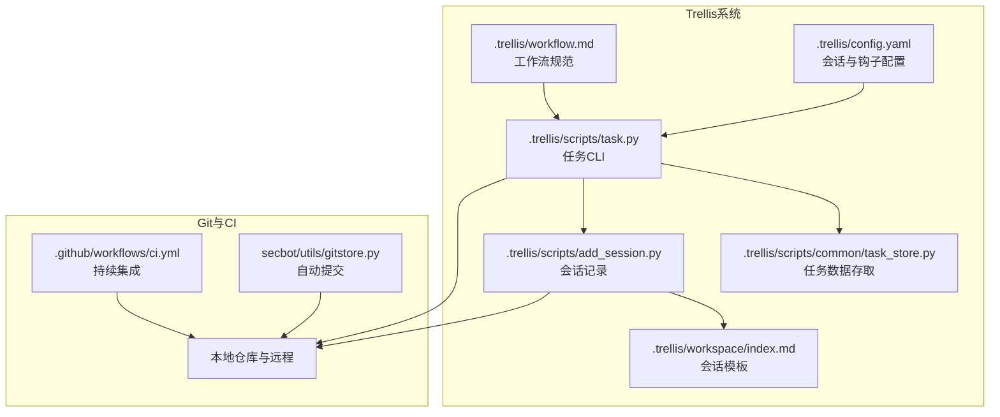
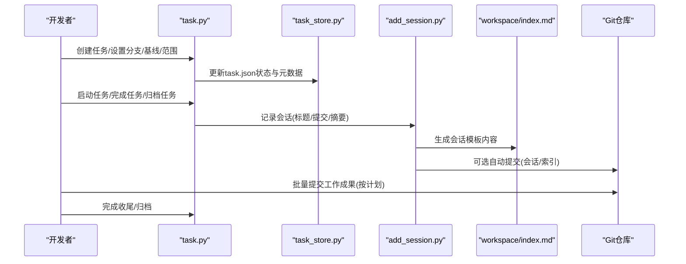
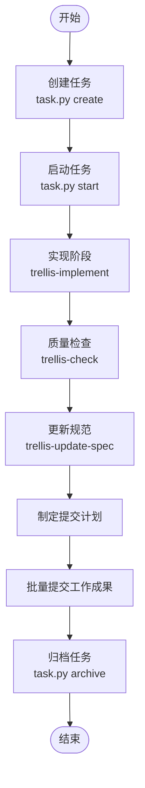
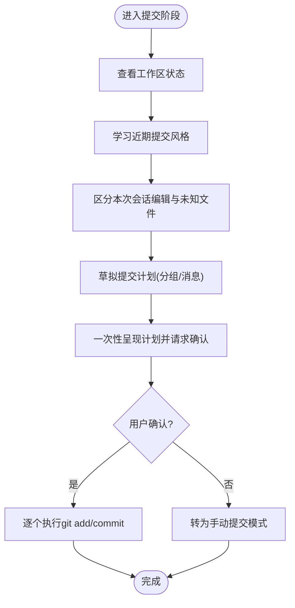
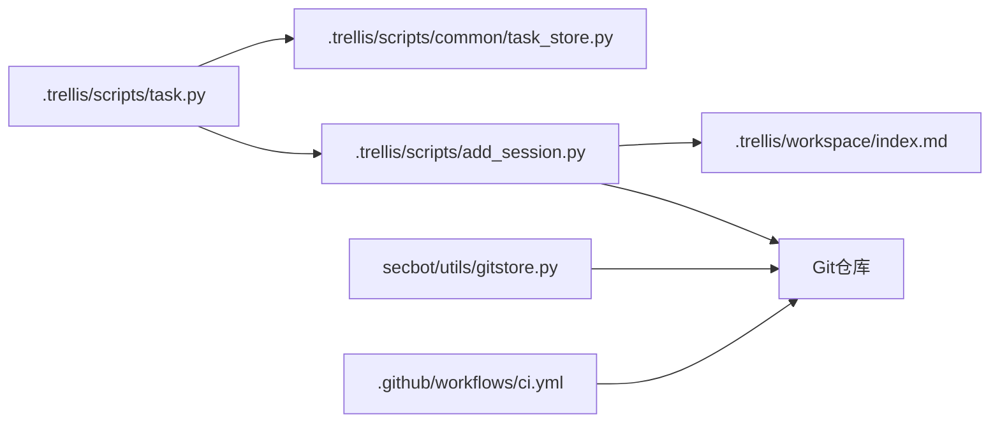

# Git工作流程

<cite>
**本文引用的文件**
- [.trellis/workflow.md](file://.trellis/workflow.md)
- [.trellis/config.yaml](file://.trellis/config.yaml)
- [.trellis/scripts/task.py](file://.trellis/scripts/task.py)
- [.trellis/scripts/common/task_store.py](file://.trellis/scripts/common/task_store.py)
- [.trellis/scripts/add_session.py](file://.trellis/scripts/add_session.py)
- [.trellis/workspace/index.md](file://.trellis/workspace/index.md)
- [.claude/skills/trellis-update-spec/SKILL.md](file://.claude/skills/trellis-update-spec/SKILL.md)
- [.agents/skills/trellis-update-spec/SKILL.md](file://.agents/skills/trellis-update-spec/SKILL.md)
- [secbot/utils/gitstore.py](file://secbot/utils/gitstore.py)
- [tests/agent/test_git_store.py](file://tests/agent/test_git_store.py)
- [.github/workflows/ci.yml](file://.github/workflows/ci.yml)
</cite>

## 目录
1. [引言](#引言)
2. [项目结构](#项目结构)
3. [核心组件](#核心组件)
4. [架构总览](#架构总览)
5. [详细组件分析](#详细组件分析)
6. [依赖关系分析](#依赖关系分析)
7. [性能考量](#性能考量)
8. [故障排查指南](#故障排查指南)
9. [结论](#结论)
10. [附录](#附录)

## 引言
本文件面向VAPT3项目团队，系统化阐述基于Trellis的任务驱动型Git工作流程：包括分支策略、提交规范、合并请求流程；以及Trellis任务系统如何与Git集成，实现任务创建、状态跟踪、变更集管理与归档记录。文档同时提供Git命令示例与最佳实践，覆盖rebase策略、冲突解决、历史修改等高级用法，并给出团队协作中的工作流变体与特殊情况处理建议。

## 项目结构
围绕Git工作流的关键目录与文件：
- .trellis：任务系统与工作流规范的核心位置，包含工作流文档、配置、脚本与工作区
- .github/workflows：CI流水线定义
- secbot/utils/gitstore.py：自动提交与差异查询能力
- 测试：验证Git存储与提交行为

图表来源
- [.trellis/workflow.md:1-663](file://.trellis/workflow.md#L1-L663)
- [.trellis/config.yaml:1-60](file://.trellis/config.yaml#L1-L60)
- [.trellis/scripts/task.py](file://.trellis/scripts/task.py)
- [.trellis/scripts/common/task_store.py:502-600](file://.trellis/scripts/common/task_store.py#L502-L600)
- [.trellis/scripts/add_session.py:134-194](file://.trellis/scripts/add_session.py#L134-L194)
- [.trellis/workspace/index.md:83-126](file://.trellis/workspace/index.md#L83-L126)
- [.github/workflows/ci.yml](file://.github/workflows/ci.yml)
- [secbot/utils/gitstore.py:138-166](file://secbot/utils/gitstore.py#L138-L166)

章节来源
- [.trellis/workflow.md:1-663](file://.trellis/workflow.md#L1-L663)
- [.trellis/config.yaml:1-60](file://.trellis/config.yaml#L1-L60)
- [.trellis/scripts/task.py](file://.trellis/scripts/task.py)
- [.trellis/scripts/common/task_store.py:502-600](file://.trellis/scripts/common/task_store.py#L502-L600)
- [.trellis/scripts/add_session.py:134-194](file://.trellis/scripts/add_session.py#L134-L194)
- [.trellis/workspace/index.md:83-126](file://.trellis/workspace/index.md#L83-L126)
- [.github/workflows/ci.yml](file://.github/workflows/ci.yml)
- [secbot/utils/gitstore.py:138-166](file://secbot/utils/gitstore.py#L138-L166)

## 核心组件
- 任务生命周期与状态机：通过任务CLI在不同阶段推进，状态写入task.json并影响工作流面包屑提示
- 会话记录与归档：add_session.py生成会话日志，配合工作区索引进行归档
- 自动提交：gitstore.py支持自动提交与差异查询，用于会话与任务的自动化记录
- 提交规范：工作流文档定义了提交计划制定、分组与批处理提交的流程

章节来源
- [.trellis/workflow.md:40-75](file://.trellis/workflow.md#L40-L75)
- [.trellis/scripts/add_session.py:134-194](file://.trellis/scripts/add_session.py#L134-L194)
- [.trellis/workspace/index.md:83-126](file://.trellis/workspace/index.md#L83-L126)
- [secbot/utils/gitstore.py:138-166](file://secbot/utils/gitstore.py#L138-L166)
- [.trellis/workflow.md:553-591](file://.trellis/workflow.md#L553-L591)

## 架构总览
下图展示从任务创建到提交归档的端到端流程，以及与Git的交互点。

图表来源
- [.trellis/scripts/task.py](file://.trellis/scripts/task.py)
- [.trellis/scripts/common/task_store.py:502-600](file://.trellis/scripts/common/task_store.py#L502-L600)
- [.trellis/scripts/add_session.py:134-194](file://.trellis/scripts/add_session.py#L134-L194)
- [.trellis/workspace/index.md:83-126](file://.trellis/workspace/index.md#L83-L126)
- [.trellis/workflow.md:553-591](file://.trellis/workflow.md#L553-L591)

## 详细组件分析

### 分支策略与命名规范
- 主分支保护：工作流未强制指定主分支名称，但建议使用受保护的默认分支（如main或master）作为发布基线
- 功能分支命名：建议采用“YYYY-MM/DD-任务名”的形式，便于与任务目录对齐与追踪
- 任务分支绑定：可通过任务元数据为任务显式绑定分支与PR目标基线，确保变更集与任务关联清晰

章节来源
- [.trellis/workflow.md:40-75](file://.trellis/workflow.md#L40-L75)
- [.trellis/scripts/common/task_store.py:502-600](file://.trellis/scripts/common/task_store.py#L502-L600)

### 提交规范
- 提交风格学习：参考最近历史，统一前缀（如feat/fix/chore/docs等）、语言与长度风格
- 变更集分组：将AI本次会话编辑的文件按逻辑单元分组，每组一个提交，避免“1文件1提交”的碎片化
- 不可识别文件处理：对非本次会话编辑的脏文件单独列出，由用户确认是否纳入
- 批处理提交：一次性呈现计划，获得确认后逐个执行git add/commit，禁止变基或修改已推送的历史

章节来源
- [.trellis/workflow.md:553-591](file://.trellis/workflow.md#L553-L591)

### 合并请求流程
- PR目标基线：通过任务元数据设置base_branch，明确PR合并目标
- PR创建：任务CLI提供创建PR的命令入口，结合任务上下文与变更集生成PR
- 审查与合并：工作流强调质量检查与规范遵循，建议在PR中附带任务摘要与会话记录链接

章节来源
- [.trellis/scripts/common/task_store.py:538-570](file://.trellis/scripts/common/task_store.py#L538-L570)
- [.trellis/scripts/task.py](file://.trellis/scripts/task.py)
- [.trellis/workflow.md:70-72](file://.trellis/workflow.md#L70-L72)

### Trellis任务管理与Git集成
- 任务生命周期：create/start/current/finish/archive，状态持久化于task.json，影响工作流提示
- 任务上下文注入：实现/检查阶段通过JSONL注入规范与研究材料，确保子代理具备一致上下文
- 会话记录：add_session.py生成会话日志，包含日期、任务、分支、提交与测试结果等字段
- 自动提交：gitstore.py支持自动提交与差异查询，用于会话与任务的自动化记录

图表来源
- [.trellis/workflow.md:40-75](file://.trellis/workflow.md#L40-L75)
- [.trellis/scripts/task.py](file://.trellis/scripts/task.py)
- [.claude/skills/trellis-update-spec/SKILL.md:1-284](file://.claude/skills/trellis-update-spec/SKILL.md#L1-L284)
- [.agents/skills/trellis-update-spec/SKILL.md:1-284](file://.agents/skills/trellis-update-spec/SKILL.md#L1-L284)

章节来源
- [.trellis/workflow.md:40-75](file://.trellis/workflow.md#L40-L75)
- [.trellis/scripts/task.py](file://.trellis/scripts/task.py)
- [.trellis/scripts/add_session.py:134-194](file://.trellis/scripts/add_session.py#L134-L194)
- [secbot/utils/gitstore.py:138-166](file://secbot/utils/gitstore.py#L138-L166)

### 提交计划制定与执行流程

图表来源
- [.trellis/workflow.md:553-591](file://.trellis/workflow.md#L553-L591)

章节来源
- [.trellis/workflow.md:553-591](file://.trellis/workflow.md#L553-L591)

### 会话记录与归档
- 模板字段：标题、日期、任务、包、分支、摘要、主要变更、提交、测试、状态、下一步
- 自动生成：add_session.py根据参数生成会话内容，支持记录一次或多条提交
- 归档与索引：会话内容写入工作区索引，配合任务归档形成完整审计线索

章节来源
- [.trellis/workspace/index.md:83-126](file://.trellis/workspace/index.md#L83-L126)
- [.trellis/scripts/add_session.py:134-194](file://.trellis/scripts/add_session.py#L134-L194)

### 自动提交与差异查询
- 自动提交：gitstore.py封装自动提交流程，返回短SHA并记录日志
- 差异查询：支持查询指定提交的diff，用于报告与回溯
- 测试验证：测试覆盖首次提交空diff、未知提交返回None等边界场景

章节来源
- [secbot/utils/gitstore.py:138-166](file://secbot/utils/gitstore.py#L138-L166)
- [tests/agent/test_git_store.py:156-189](file://tests/agent/test_git_store.py#L156-L189)

## 依赖关系分析
- 任务CLI依赖任务存储模块读写task.json，以维护状态与元数据
- 会话记录依赖任务上下文与当前分支信息，生成标准化模板
- 自动提交能力为会话与任务提供可追溯的Git记录
- CI流水线与工作流文档共同构成质量门禁与流程约束

图表来源
- [.trellis/scripts/task.py](file://.trellis/scripts/task.py)
- [.trellis/scripts/common/task_store.py:502-600](file://.trellis/scripts/common/task_store.py#L502-L600)
- [.trellis/scripts/add_session.py:134-194](file://.trellis/scripts/add_session.py#L134-L194)
- [.trellis/workspace/index.md:83-126](file://.trellis/workspace/index.md#L83-L126)
- [secbot/utils/gitstore.py:138-166](file://secbot/utils/gitstore.py#L138-L166)
- [.github/workflows/ci.yml](file://.github/workflows/ci.yml)

章节来源
- [.trellis/scripts/task.py](file://.trellis/scripts/task.py)
- [.trellis/scripts/common/task_store.py:502-600](file://.trellis/scripts/common/task_store.py#L502-L600)
- [.trellis/scripts/add_session.py:134-194](file://.trellis/scripts/add_session.py#L134-L194)
- [.trellis/workspace/index.md:83-126](file://.trellis/workspace/index.md#L83-L126)
- [secbot/utils/gitstore.py:138-166](file://secbot/utils/gitstore.py#L138-L166)
- [.github/workflows/ci.yml](file://.github/workflows/ci.yml)

## 性能考量
- 任务与会话的文件化记录避免内存膨胀，便于长期维护与检索
- 自动提交与差异查询采用轻量级接口，减少频繁IO开销
- 批处理提交降低远程往返次数，提升整体效率

## 故障排查指南
- 会话无法激活：若无会话身份，任务启动会报错并提示设置身份，需按提示完成初始化
- 提交计划被拒：用户拒绝计划时应转入手动模式，避免二次尝试相同计划
- 未知提交SHA：差异查询对未知SHA返回None，需确认提交是否存在或已推送
- 会话索引未更新：确认add_session.py执行成功且工作区索引已提交

章节来源
- [.trellis/workflow.md:76](file://.trellis/workflow.md#L76)
- [.trellis/workflow.md:589-591](file://.trellis/workflow.md#L589-L591)
- [tests/agent/test_git_store.py:156-189](file://tests/agent/test_git_store.py#L156-L189)
- [.trellis/scripts/add_session.py:134-194](file://.trellis/scripts/add_session.py#L134-L194)

## 结论
VAPT3的Git工作流以Trellis任务系统为核心，通过任务生命周期、会话记录与自动提交机制，实现了可追溯、可复用、可审计的开发过程。遵循本文的分支策略、提交规范与PR流程，可显著提升团队协作效率与代码质量。

## 附录

### 常用Git命令与最佳实践
- rebase策略：优先使用交互式rebase整理提交，保持线性历史；仅在本地未推送时修改
- 冲突解决：集中处理冲突文件，完成后逐一add并commit，必要时拆分为多个提交
- 历史修改：已推送的历史严禁修改；如需修正，采用反向提交的方式
- 提交粒度：按功能或修复单元组织提交，避免大而全的提交

### 团队协作变体与特殊情况
- 多平台子代理：部分平台需在派发子代理时显式声明活动任务路径，确保上下文注入
- 紧急修复：可临时绕过部分步骤，但应在事后补齐规范更新与会话记录
- 跨层变更：必须在规范更新中体现跨层契约变化，并补充测试断言