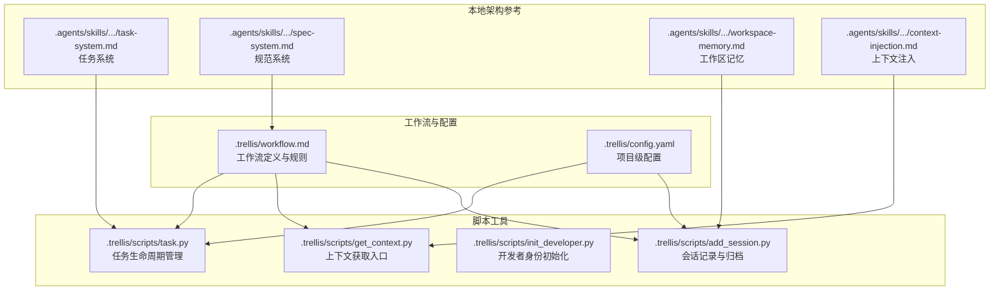
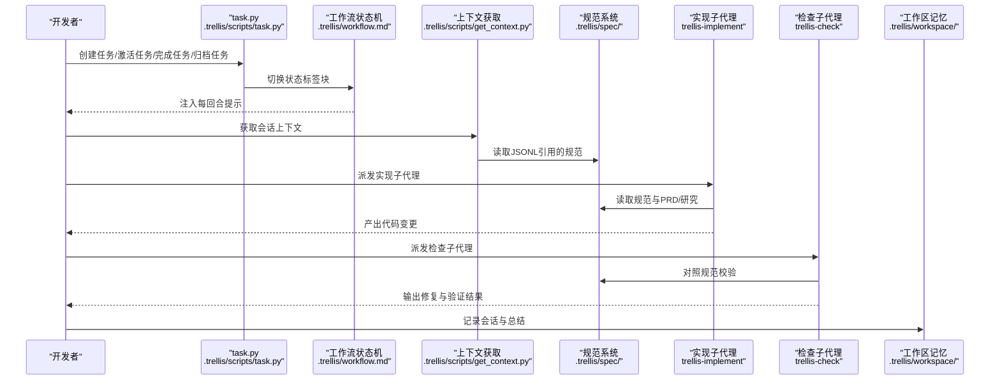
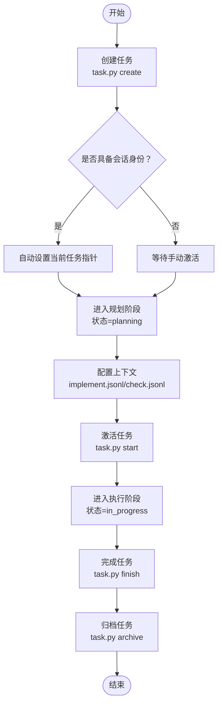
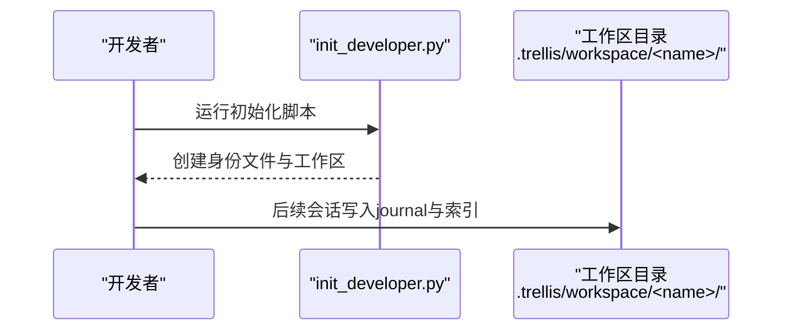
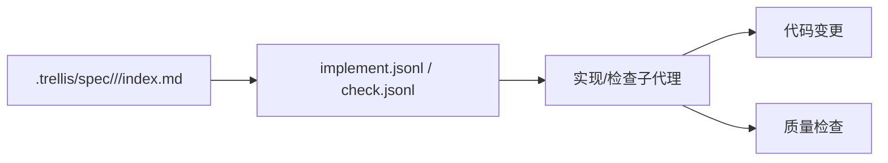
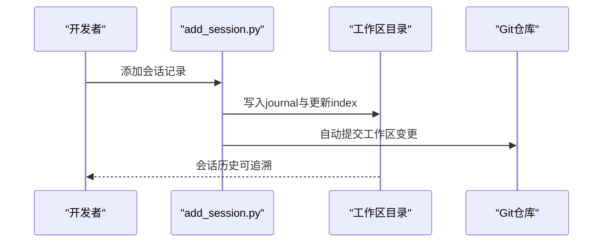
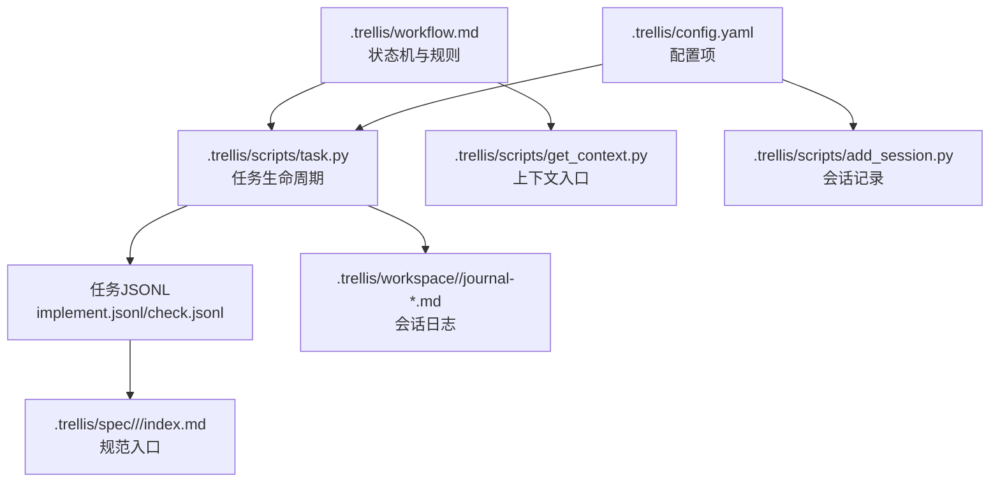

# Trellis开发工作流

<cite>
**本文引用的文件**
- [.trellis/workflow.md](file://.trellis/workflow.md)
- [.trellis/config.yaml](file://.trellis/config.yaml)
- [.trellis/scripts/task.py](file://.trellis/scripts/task.py)
- [.trellis/scripts/get_context.py](file://.trellis/scripts/get_context.py)
- [.trellis/scripts/init_developer.py](file://.trellis/scripts/init_developer.py)
- [.trellis/scripts/add_session.py](file://.trellis/scripts/add_session.py)
- [.agents/skills/trellis-meta/references/local-architecture/task-system.md](file://.agents/skills/trellis-meta/references/local-architecture/task-system.md)
- [.agents/skills/trellis-meta/references/local-architecture/spec-system.md](file://.agents/skills/trellis-meta/references/local-architecture/spec-system.md)
- [.agents/skills/trellis-meta/references/local-architecture/workspace-memory.md](file://.agents/skills/trellis-meta/references/local-architecture/workspace-memory.md)
- [.agents/skills/trellis-meta/references/local-architecture/context-injection.md](file://.agents/skills/trellis-meta/references/local-architecture/context-injection.md)
</cite>

## 目录
1. [简介](#简介)
2. [项目结构](#项目结构)
3. [核心组件](#核心组件)
4. [架构总览](#架构总览)
5. [详细组件分析](#详细组件分析)
6. [依赖关系分析](#依赖关系分析)
7. [性能考虑](#性能考虑)
8. [故障排除指南](#故障排除指南)
9. [结论](#结论)
10. [附录](#附录)

## 简介
本文件面向VAPT3项目，系统化阐述基于Trellis的五阶段开发工作流：规划阶段（需求探索、研究、上下文配置）、执行阶段（实现、质量检查、回滚）、收尾阶段（质量验证、调试回顾、规范更新、提交变更）。文档同时详解任务系统的全生命周期（创建、激活、完成、归档），开发者身份管理、规范系统与工作区系统的作用与使用方法，并提供每个阶段的操作步骤、工具使用指南与最佳实践，以及常见问题解决方案与工作流定制方法。

## 项目结构
Trellis工作流的核心由以下部分组成：
- 工作流定义与规则：.trellis/workflow.md
- 配置项：.trellis/config.yaml
- 脚本工具：
  - 任务管理：.trellis/scripts/task.py
  - 上下文获取：.trellis/scripts/get_context.py
  - 开发者初始化：.trellis/scripts/init_developer.py
  - 会话记录：.trellis/scripts/add_session.py
- 本地架构参考文档：
  - 任务系统：.agents/skills/trellis-meta/references/local-architecture/task-system.md
  - 规范系统：.agents/skills/trellis-meta/references/local-architecture/spec-system.md
  - 工作区记忆：.agents/skills/trellis-meta/references/local-architecture/workspace-memory.md
  - 上下文注入：.agents/skills/trellis-meta/references/local-architecture/context-injection.md

图表来源
- [.trellis/workflow.md:1-663](file://.trellis/workflow.md#L1-L663)
- [.trellis/config.yaml:1-60](file://.trellis/config.yaml#L1-L60)
- [.trellis/scripts/task.py:1-482](file://.trellis/scripts/task.py#L1-L482)
- [.trellis/scripts/get_context.py:1-17](file://.trellis/scripts/get_context.py#L1-L17)
- [.trellis/scripts/init_developer.py:1-52](file://.trellis/scripts/init_developer.py#L1-L52)
- [.trellis/scripts/add_session.py:1-522](file://.trellis/scripts/add_session.py#L1-L522)
- [.agents/skills/trellis-meta/references/local-architecture/task-system.md:1-102](file://.agents/skills/trellis-meta/references/local-architecture/task-system.md#L1-L102)
- [.agents/skills/trellis-meta/references/local-architecture/spec-system.md:1-103](file://.agents/skills/trellis-meta/references/local-architecture/spec-system.md#L1-L103)
- [.agents/skills/trellis-meta/references/local-architecture/workspace-memory.md:1-72](file://.agents/skills/trellis-meta/references/local-architecture/workspace-memory.md#L1-L72)
- [.agents/skills/trellis-meta/references/local-architecture/context-injection.md:1-69](file://.agents/skills/trellis-meta/references/local-architecture/context-injection.md#L1-L69)

章节来源
- [.trellis/workflow.md:142-284](file://.trellis/workflow.md#L142-L284)
- [.trellis/config.yaml:1-60](file://.trellis/config.yaml#L1-L60)

## 核心组件
- 工作流状态机与阶段规则：通过工作流文档中的状态标签块驱动每回合提示，确保AI严格遵循“规划→执行→收尾”的顺序与要求。
- 任务系统：以任务目录为核心，承载需求、设计、研究、状态与关系信息；支持父子任务、分支与PR目标分支等元数据。
- 规范系统：工程约定库，通过JSONL在实现/检查前注入到子代理或平台预设中，避免依赖模型记忆。
- 工作区系统：跨会话记忆，记录每次会话的产出与总结，配合任务系统与规范系统形成知识闭环。
- 脚本工具：提供任务生命周期、上下文注入、开发者身份与会话记录的命令行接口。

章节来源
- [.trellis/workflow.md:15-96](file://.trellis/workflow.md#L15-L96)
- [.agents/skills/trellis-meta/references/local-architecture/task-system.md:1-102](file://.agents/skills/trellis-meta/references/local-architecture/task-system.md#L1-L102)
- [.agents/skills/trellis-meta/references/local-architecture/spec-system.md:1-103](file://.agents/skills/trellis-meta/references/local-architecture/spec-system.md#L1-L103)
- [.agents/skills/trellis-meta/references/local-architecture/workspace-memory.md:1-72](file://.agents/skills/trellis-meta/references/local-architecture/workspace-memory.md#L1-L72)
- [.agents/skills/trellis-meta/references/local-architecture/context-injection.md:1-69](file://.agents/skills/trellis-meta/references/local-architecture/context-injection.md#L1-L69)

## 架构总览
Trellis工作流围绕“任务”展开，通过脚本与平台钩子实现上下文注入与状态推进。整体交互如下：

图表来源
- [.trellis/scripts/task.py:66-142](file://.trellis/scripts/task.py#L66-L142)
- [.trellis/workflow.md:150-212](file://.trellis/workflow.md#L150-L212)
- [.trellis/scripts/get_context.py:1-17](file://.trellis/scripts/get_context.py#L1-L17)
- [.agents/skills/trellis-meta/references/local-architecture/spec-system.md:66-75](file://.agents/skills/trellis-meta/references/local-architecture/spec-system.md#L66-L75)

## 详细组件分析

### 任务系统生命周期
- 创建：生成任务目录与初始文件，状态进入“规划”，自动设置当前会话的活动任务指针（若具备会话身份）。
- 激活：将状态从“规划”切换至“进行中”，触发后置钩子，开始实现阶段。
- 完成：清理当前会话的活动任务指针，保留任务状态不变。
- 归档：标记任务为“已完成”，移动到归档目录，并清理仍指向该任务的运行时会话文件。

图表来源
- [.trellis/scripts/task.py:70-121](file://.trellis/scripts/task.py#L70-L121)
- [.trellis/scripts/task.py:124-142](file://.trellis/scripts/task.py#L124-L142)
- [.trellis/scripts/task.py:249-276](file://.trellis/scripts/task.py#L249-L276)
- [.trellis/workflow.md:150-212](file://.trellis/workflow.md#L150-L212)

章节来源
- [.trellis/scripts/task.py:1-482](file://.trellis/scripts/task.py#L1-L482)
- [.agents/skills/trellis-meta/references/local-architecture/task-system.md:29-58](file://.agents/skills/trellis-meta/references/local-architecture/task-system.md#L29-L58)

### 开发者身份管理
- 初始化：首次使用需创建开发者身份与对应工作区目录，后续所有会话与任务均与该身份关联。
- 身份约束：若平台未提供稳定会话身份，激活任务可能失败，需按错误提示设置会话标识后再试。

图表来源
- [.trellis/scripts/init_developer.py:25-47](file://.trellis/scripts/init_developer.py#L25-L47)
- [.agents/skills/trellis-meta/references/local-architecture/workspace-memory.md:23-31](file://.agents/skills/trellis-meta/references/local-architecture/workspace-memory.md#L23-L31)

章节来源
- [.trellis/scripts/init_developer.py:1-52](file://.trellis/scripts/init_developer.py#L1-L52)
- [.agents/skills/trellis-meta/references/local-architecture/workspace-memory.md:16-31](file://.agents/skills/trellis-meta/references/local-architecture/workspace-memory.md#L16-L31)

### 规范系统与上下文注入
- 规范组织：按包/层划分，入口文件列出“开发前检查清单”与“质量检查”，具体规范位于同目录其他文件。
- 注入方式：实现/检查子代理在启动前读取任务目录下的JSONL，加载相应规范与研究材料；平台钩子/预设负责将JSONL内容注入到代理提示词中。

图表来源
- [.agents/skills/trellis-meta/references/local-architecture/spec-system.md:66-75](file://.agents/skills/trellis-meta/references/local-architecture/spec-system.md#L66-L75)
- [.agents/skills/trellis-meta/references/local-architecture/context-injection.md:33-40](file://.agents/skills/trellis-meta/references/local-architecture/context-injection.md#L33-L40)

章节来源
- [.agents/skills/trellis-meta/references/local-architecture/spec-system.md:1-103](file://.agents/skills/trellis-meta/references/local-architecture/spec-system.md#L1-L103)
- [.agents/skills/trellis-meta/references/local-architecture/context-injection.md:1-69](file://.agents/skills/trellis-meta/references/local-architecture/context-injection.md#L1-L69)

### 工作区系统与会话记录
- 结构：全局索引与开发者个人目录，按日志文件轮转，最大行数可配置。
- 记录：通过会话记录脚本写入journal与索引，支持自动提交工作区变更。

图表来源
- [.trellis/scripts/add_session.py:349-446](file://.trellis/scripts/add_session.py#L349-L446)
- [.agents/skills/trellis-meta/references/local-architecture/workspace-memory.md:33-46](file://.agents/skills/trellis-meta/references/local-architecture/workspace-memory.md#L33-L46)

章节来源
- [.trellis/scripts/add_session.py:1-522](file://.trellis/scripts/add_session.py#L1-L522)
- [.trellis/config.yaml:8-16](file://.trellis/config.yaml#L8-L16)
- [.agents/skills/trellis-meta/references/local-architecture/workspace-memory.md:48-72](file://.agents/skills/trellis-meta/references/local-architecture/workspace-memory.md#L48-L72)

### 五阶段开发流程详解

#### 规划阶段（需求探索、研究、上下文配置）
- 1.0 创建任务：生成任务目录，状态进入“规划”，自动设置当前任务指针（若具备会话身份）。
- 1.1 需求探索：加载“头脑风暴”技能，与用户逐条确认需求，及时更新需求文档。
- 1.2 研究：针对技术难点或外部依赖进行研究，输出到任务的研究目录，避免仅停留在对话中。
- 1.3 配置上下文：在实现/检查JSONL中填写规范与研究文件，明确“为何需要该文件”。
- 1.4 激活任务：确认需求与上下文已就绪，切换至“进行中”。

章节来源
- [.trellis/workflow.md:286-426](file://.trellis/workflow.md#L286-L426)
- [.trellis/workflow.md:158-173](file://.trellis/workflow.md#L158-L173)

#### 执行阶段（实现、质量检查、回滚）
- 2.1 实现：派发“实现”子代理，依据PRD与规范编写代码，完成后进行静态检查与类型检查。
- 2.2 质量检查：派发“检查”子代理，对照规范与PRD进行审查与自动修复，确保通过静态检查与测试。
- 2.3 回滚：若发现PRD缺陷或实现错误，返回上一阶段修正或补充研究。

章节来源
- [.trellis/workflow.md:428-516](file://.trellis/workflow.md#L428-L516)

#### 收尾阶段（质量验证、调试回顾、规范更新、提交变更）
- 3.1 质量验证：最终复核规范符合性、静态检查与测试。
- 3.2 调试回顾：对反复出现的问题进行根因分析与预防建议。
- 3.3 规范更新：将本次经验沉淀到规范库，保持长期可复用。
- 3.4 提交变更：分三步提交：工作变更→归档变更→日志变更，确保流程清晰且可追溯。

章节来源
- [.trellis/workflow.md:518-603](file://.trellis/workflow.md#L518-L603)

## 依赖关系分析
- 工作流状态机依赖于任务状态与JSONL上下文，确保AI在不同阶段遵循正确的步骤。
- 任务系统与工作区系统相互独立但互补：前者聚焦单次任务的进度与产物，后者记录跨任务的会话与经验。
- 规范系统通过JSONL与平台钩子/预设实现“注入而非记忆”的上下文加载策略。

图表来源
- [.trellis/workflow.md:150-212](file://.trellis/workflow.md#L150-L212)
- [.trellis/scripts/task.py:66-142](file://.trellis/scripts/task.py#L66-L142)
- [.trellis/scripts/get_context.py:1-17](file://.trellis/scripts/get_context.py#L1-L17)
- [.agents/skills/trellis-meta/references/local-architecture/spec-system.md:66-75](file://.agents/skills/trellis-meta/references/local-architecture/spec-system.md#L66-L75)
- [.trellis/config.yaml:8-16](file://.trellis/config.yaml#L8-L16)

章节来源
- [.trellis/workflow.md:150-212](file://.trellis/workflow.md#L150-L212)
- [.trellis/scripts/task.py:66-142](file://.trellis/scripts/task.py#L66-L142)
- [.agents/skills/trellis-meta/references/local-architecture/spec-system.md:66-75](file://.agents/skills/trellis-meta/references/local-architecture/spec-system.md#L66-L75)

## 性能考虑
- 任务与工作区采用文件持久化，避免模型压缩导致的记忆丢失，提升跨会话一致性。
- JSONL上下文仅包含必要规范与研究文件，减少无关代码文件的预注册，降低注入成本。
- 会话日志按行数轮转，控制单文件大小，便于快速检索与维护。

## 故障排除指南
- 激活任务失败：若提示缺少会话身份，请在支持会话身份的IDE/会话中运行，或设置会话标识环境变量后再试。
- 无法看到当前任务：检查平台的会话开始钩子或等效机制是否正确安装与运行。
- JSONL未生效：确认JSONL中不含待修改的代码文件，种子行不计入有效条目；实现/检查阶段分别配置对应文件。
- 会话记录未提交：若自动提交失败，按提示手动添加与提交工作区变更。

章节来源
- [.trellis/scripts/task.py:93-99](file://.trellis/scripts/task.py#L93-L99)
- [.agents/skills/trellis-meta/references/local-architecture/context-injection.md:52-56](file://.agents/skills/trellis-meta/references/local-architecture/context-injection.md#L52-L56)
- [.trellis/scripts/add_session.py:316-346](file://.trellis/scripts/add_session.py#L316-L346)

## 结论
Trellis工作流通过“任务—规范—上下文—工作区”的闭环设计，将AI的工程行为规范化、可追踪与可持续改进。遵循五阶段流程与脚本工具的使用规范，可在保证质量的同时提升协作效率与知识复用水平。

## 附录

### 操作步骤速查
- 初始化开发者身份：运行开发者初始化脚本，创建身份与工作区目录。
- 创建任务：生成任务目录，状态进入“规划”。
- 配置上下文：在实现/检查JSONL中填写规范与研究文件。
- 激活任务：切换状态至“进行中”，开始实现。
- 质量检查：派发检查子代理，确保通过静态检查与测试。
- 规范更新：将经验沉淀到规范库。
- 提交变更：按“工作变更→归档变更→日志变更”的顺序提交。
- 记录会话：使用会话记录脚本写入journal与索引。

章节来源
- [.trellis/scripts/init_developer.py:25-47](file://.trellis/scripts/init_developer.py#L25-L47)
- [.trellis/scripts/task.py:70-121](file://.trellis/scripts/task.py#L70-L121)
- [.trellis/scripts/task.py:124-142](file://.trellis/scripts/task.py#L124-L142)
- [.trellis/workflow.md:549-603](file://.trellis/workflow.md#L549-L603)
- [.trellis/scripts/add_session.py:349-446](file://.trellis/scripts/add_session.py#L349-L446)

### 最佳实践
- 在规划阶段充分研究与沉淀，避免在实现阶段频繁回退。
- 使用JSONL精确标注“为何需要该文件”，提高子代理的上下文准确性。
- 将复杂问题的发现与解决过程写入研究与工作区，形成可复用的知识资产。
- 严格遵守提交顺序，确保工作流的可审计性与可追溯性。

### 工作流定制方法
- 修改每回合提示文本：编辑对应状态块内容，保存后重启会话或运行更新命令。
- 新增自定义状态：添加新的状态块并由生命周期钩子写入任务状态。
- 增加生命周期钩子：在任务元数据中添加钩子事件，绑定到相应脚本或命令。
- 调整上下文规则：在规划阶段调整JSONL配置策略，确保实现/检查阶段的上下文准确。

章节来源
- [.trellis/workflow.md:605-663](file://.trellis/workflow.md#L605-L663)
- [.trellis/config.yaml:17-34](file://.trellis/config.yaml#L17-L34)