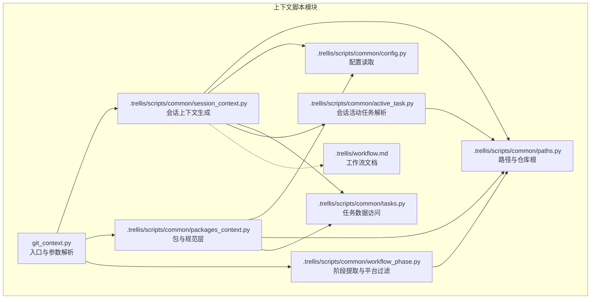
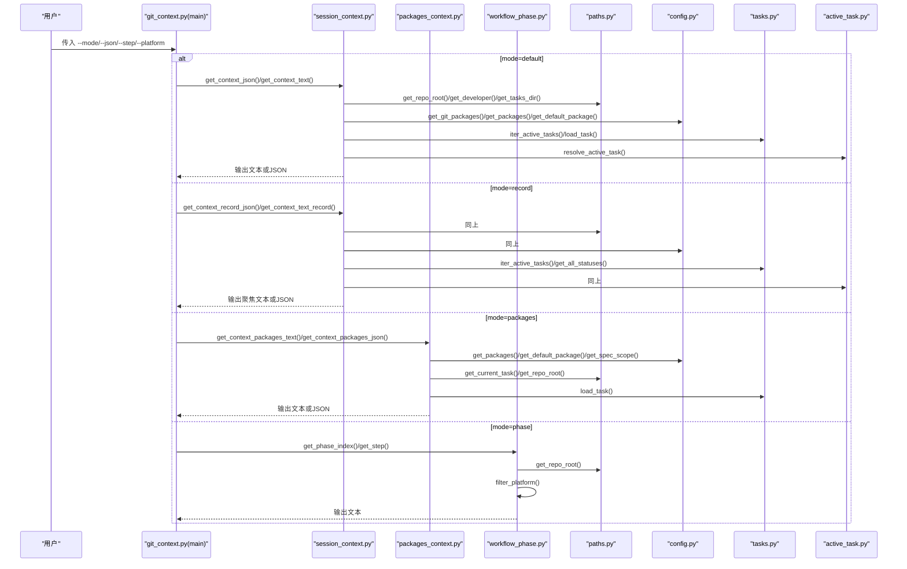
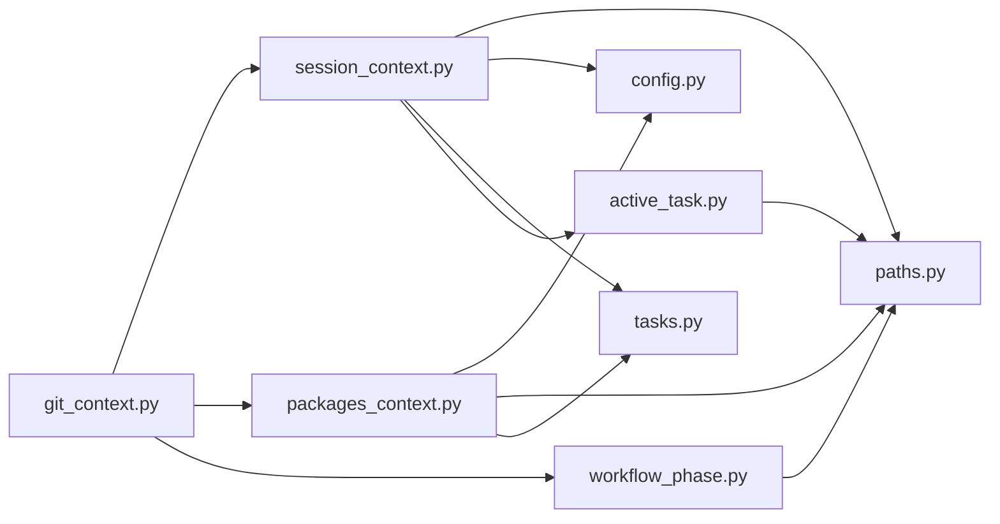

# 上下文脚本

<cite>
**本文引用的文件**
- [git_context.py](file://.trellis/scripts/common/git_context.py)
- [session_context.py](file://.trellis/scripts/common/session_context.py)
- [packages_context.py](file://.trellis/scripts/common/packages_context.py)
- [workflow_phase.py](file://.trellis/scripts/common/workflow_phase.py)
- [paths.py](file://.trellis/scripts/common/paths.py)
- [config.py](file://.trellis/scripts/common/config.py)
- [tasks.py](file://.trellis/scripts/common/tasks.py)
- [active_task.py](file://.trellis/scripts/common/active_task.py)
- [workflow.md](file://.trellis/workflow.md)
</cite>

## 目录
1. [简介](#简介)
2. [项目结构](#项目结构)
3. [核心组件](#核心组件)
4. [架构总览](#架构总览)
5. [详细组件分析](#详细组件分析)
6. [依赖分析](#依赖分析)
7. [性能考虑](#性能考虑)
8. [故障排除指南](#故障排除指南)
9. [结论](#结论)
10. [附录](#附录)

## 简介
本文件系统化阐述 VAPT3（Trellis）项目中的“上下文脚本”能力，聚焦于会话运行时上下文的获取、包级规范查询与工作流阶段步骤详情提取。该脚本以命令行形式提供四种模式：
- default 模式：完整会话上下文（默认输出）
- record 模式：用于录制会话的聚焦上下文
- packages 模式：仅输出包与规范层信息
- phase 模式：按步骤 ID 提取工作流指南内容，并可按平台过滤

通过统一入口，用户可在不同场景下快速获得所需上下文，辅助 AI 主体或子代理在正确阶段执行正确的任务。

## 项目结构
上下文脚本位于 .trellis/scripts/common 目录中，围绕以下模块协作：
- 入口与参数解析：git_context.py
- 会话上下文生成：session_context.py
- 包与规范层查询：packages_context.py
- 工作流阶段提取与平台过滤：workflow_phase.py
- 路径与仓库根定位：paths.py
- 配置读取与包扫描：config.py
- 任务数据访问：tasks.py
- 会话级活动任务解析：active_task.py
- 工作流文档：workflow.md

图表来源
- [git_context.py:44-98](file://.trellis/scripts/common/git_context.py#L44-L98)
- [session_context.py:116-196](file://.trellis/scripts/common/session_context.py#L116-L196)
- [packages_context.py:91-238](file://.trellis/scripts/common/packages_context.py#L91-L238)
- [workflow_phase.py:62-101](file://.trellis/scripts/common/workflow_phase.py#L62-L101)
- [paths.py:43-62](file://.trellis/scripts/common/paths.py#L43-L62)
- [config.py:215-390](file://.trellis/scripts/common/config.py#L215-L390)
- [tasks.py:23-113](file://.trellis/scripts/common/tasks.py#L23-L113)
- [active_task.py:468-494](file://.trellis/scripts/common/active_task.py#L468-L494)
- [workflow.md:142-212](file://.trellis/workflow.md#L142-L212)

章节来源
- [.trellis/scripts/common/git_context.py:44-98](file://.trellis/scripts/common/git_context.py#L44-L98)
- [.trellis/scripts/common/session_context.py:116-196](file://.trellis/scripts/common/session_context.py#L116-L196)
- [.trellis/scripts/common/packages_context.py:91-238](file://.trellis/scripts/common/packages_context.py#L91-L238)
- [.trellis/scripts/common/workflow_phase.py:62-101](file://.trellis/scripts/common/workflow_phase.py#L62-L101)
- [.trellis/scripts/common/paths.py:43-62](file://.trellis/scripts/common/paths.py#L43-L62)
- [.trellis/scripts/common/config.py:215-390](file://.trellis/scripts/common/config.py#L215-L390)
- [.trellis/scripts/common/tasks.py:23-113](file://.trellis/scripts/common/tasks.py#L23-L113)
- [.trellis/scripts/common/active_task.py:468-494](file://.trellis/scripts/common/active_task.py#L468-L494)
- [.trellis/workflow.md:142-212](file://.trellis/workflow.md#L142-L212)

## 核心组件
- 入口与参数解析：负责解析 --mode、--json、--step、--platform 等参数，并分发到对应模块。
- 会话上下文生成：聚合开发者、Git 状态、最近提交、当前任务、活跃任务树、我的任务、日志文件、包信息等。
- 包与规范层：支持单仓与多仓两种模式，输出包名、路径、类型、默认包、规范层、子模块与 Git 仓库标记等。
- 工作流阶段提取：从 workflow.md 中抽取“阶段索引”或指定步骤段落，并可按平台过滤块内容。
- 路径与仓库根：自动定位 .trellis 所在的仓库根目录，确保所有相对路径解析一致。
- 配置读取：解析 .trellis/config.yaml，支持 packages、default_package、session.spec_scope 等配置项。
- 任务数据访问：加载 task.json，遍历非归档任务，计算父子进度。
- 会话活动任务解析：基于平台输入与环境变量解析稳定的会话上下文键，持久化当前任务指针。

章节来源
- [.trellis/scripts/common/git_context.py:44-98](file://.trellis/scripts/common/git_context.py#L44-L98)
- [.trellis/scripts/common/session_context.py:116-196](file://.trellis/scripts/common/session_context.py#L116-L196)
- [.trellis/scripts/common/packages_context.py:91-238](file://.trellis/scripts/common/packages_context.py#L91-L238)
- [.trellis/scripts/common/workflow_phase.py:62-101](file://.trellis/scripts/common/workflow_phase.py#L62-L101)
- [.trellis/scripts/common/paths.py:43-62](file://.trellis/scripts/common/paths.py#L43-L62)
- [.trellis/scripts/common/config.py:215-390](file://.trellis/scripts/common/config.py#L215-L390)
- [.trellis/scripts/common/tasks.py:23-113](file://.trellis/scripts/common/tasks.py#L23-L113)
- [.trellis/scripts/common/active_task.py:468-494](file://.trellis/scripts/common/active_task.py#L468-L494)

## 架构总览
上下文脚本采用“入口委派”的设计：git_context.py 作为 CLI 入口，根据 --mode 将请求委派给 session_context、packages_context 或 workflow_phase 模块；同时复用 paths、config、tasks、active_task 等模块完成路径解析、配置读取、任务数据与活动任务解析。

图表来源
- [.trellis/scripts/common/git_context.py:44-98](file://.trellis/scripts/common/git_context.py#L44-L98)
- [.trellis/scripts/common/session_context.py:116-196](file://.trellis/scripts/common/session_context.py#L116-L196)
- [.trellis/scripts/common/packages_context.py:91-238](file://.trellis/scripts/common/packages_context.py#L91-L238)
- [.trellis/scripts/common/workflow_phase.py:62-101](file://.trellis/scripts/common/workflow_phase.py#L62-L101)
- [.trellis/scripts/common/paths.py:43-62](file://.trellis/scripts/common/paths.py#L43-L62)
- [.trellis/scripts/common/config.py:215-390](file://.trellis/scripts/common/config.py#L215-L390)
- [.trellis/scripts/common/tasks.py:23-113](file://.trellis/scripts/common/tasks.py#L23-L113)
- [.trellis/scripts/common/active_task.py:468-494](file://.trellis/scripts/common/active_task.py#L468-L494)

## 详细组件分析

### 组件A：入口与参数解析（git_context.py）
- 功能要点
  - 支持 --mode 选择 default、record、packages、phase 四种模式
  - 支持 --json 控制输出为 JSON 或文本
  - phase 模式支持 --step 指定步骤 ID，如 1.1、2.2；支持 --platform 进行平台过滤
  - 未找到匹配内容时返回相应退出码与错误提示
- 使用场景
  - 快速获取完整会话上下文（default）
  - 录制会话前聚焦输出（record）
  - 查询包与规范层（packages）
  - 获取工作流某一步骤的详细指导（phase）

章节来源
- [.trellis/scripts/common/git_context.py:44-98](file://.trellis/scripts/common/git_context.py#L44-L98)

### 组件B：会话上下文生成（session_context.py）
- 功能要点
  - default 模式：输出开发者、Git 分支与变更、最近提交、当前任务、活跃任务树、我的任务、日志文件、包 Git 仓库状态、包规范层等
  - record 模式：聚焦我的任务、Git 状态、最近提交、当前任务，便于录制
  - 文本与 JSON 双格式输出
  - 通过 _collect_package_git_info 与 _append_package_git_context 增强包仓库状态可见性
- 数据来源
  - 路径与仓库根：get_repo_root、get_developer、get_tasks_dir、get_active_journal_file
  - Git 命令封装：run_git
  - 任务数据：iter_active_tasks、load_task、get_all_statuses、children_progress
  - 包配置：get_packages、get_default_package、get_git_packages、get_spec_scope

章节来源
- [.trellis/scripts/common/session_context.py:116-196](file://.trellis/scripts/common/session_context.py#L116-L196)
- [.trellis/scripts/common/session_context.py:385-466](file://.trellis/scripts/common/session_context.py#L385-L466)
- [.trellis/scripts/common/session_context.py:469-565](file://.trellis/scripts/common/session_context.py#L469-L565)

### 组件C：包与规范层查询（packages_context.py）
- 功能要点
  - 单仓模式：仅列出规范层
  - 多仓模式：输出每个包的名称、路径、类型、默认标记、规范层、子模块标记、Git 仓库标记
  - 支持 spec_scope 解析，标注“超出范围”
  - 支持共享指南（guides）展示
- 关键逻辑
  - get_packages_info：扫描包配置并构建包信息列表
  - _resolve_scope_set：根据 spec_scope、当前任务包、默认包解析允许集合
  - get_packages_section：构建文本输出的 PACKAGES 部分

章节来源
- [.trellis/scripts/common/packages_context.py:91-123](file://.trellis/scripts/common/packages_context.py#L91-L123)
- [.trellis/scripts/common/packages_context.py:53-84](file://.trellis/scripts/common/packages_context.py#L53-L84)
- [.trellis/scripts/common/packages_context.py:125-154](file://.trellis/scripts/common/packages_context.py#L125-L154)
- [.trellis/scripts/common/packages_context.py:157-210](file://.trellis/scripts/common/packages_context.py#L157-L210)
- [.trellis/scripts/common/packages_context.py:213-238](file://.trellis/scripts/common/packages_context.py#L213-L238)

### 组件D：工作流阶段提取与平台过滤（workflow_phase.py）
- 功能要点
  - get_phase_index：抽取“阶段索引”至“自定义定制说明”之间的内容，并移除 workflow-state 标签块
  - get_step：按步骤 ID 抽取对应标题与正文，直到下一个标题、水平线或二级标题
  - filter_platform：保留包含目标平台的块内内容，丢弃标记行，合并空白行
- 平台标记语法
  - 支持形如 [平台A, 平台B] 的块标记与 [/平台A, 平台B] 的闭合标记
  - 不区分大小写与空字符，模糊匹配平台名

章节来源
- [.trellis/scripts/common/workflow_phase.py:62-101](file://.trellis/scripts/common/workflow_phase.py#L62-L101)
- [.trellis/scripts/common/workflow_phase.py:103-134](file://.trellis/scripts/common/workflow_phase.py#L103-L134)
- [.trellis/scripts/common/workflow_phase.py:147-188](file://.trellis/scripts/common/workflow_phase.py#L147-L188)

### 组件E：路径与仓库根定位（paths.py）
- 功能要点
  - 自动向上查找 .trellis 目录确定仓库根
  - 提供开发者、任务目录、工作区目录、日志文件、当前任务等路径解析函数
  - 规范化任务引用路径，支持绝对与相对路径转换

章节来源
- [.trellis/scripts/common/paths.py:43-62](file://.trellis/scripts/common/paths.py#L43-L62)
- [.trellis/scripts/common/paths.py:153-186](file://.trellis/scripts/common/paths.py#L153-L186)
- [.trellis/scripts/common/paths.py:254-273](file://.trellis/scripts/common/paths.py#L254-L273)
- [.trellis/scripts/common/paths.py:297-309](file://.trellis/scripts/common/paths.py#L297-L309)

### 组件F：配置读取与包扫描（config.py）
- 功能要点
  - 解析 .trellis/config.yaml，提供 packages、default_package、session.spec_scope 等配置
  - 支持布尔值解析（字符串 "true" 亦视为真）
  - 提供 get_submodule_packages、get_git_packages、is_monorepo、get_spec_base、validate_package、resolve_package、get_spec_scope 等工具

章节来源
- [.trellis/scripts/common/config.py:164-172](file://.trellis/scripts/common/config.py#L164-L172)
- [.trellis/scripts/common/config.py:215-390](file://.trellis/scripts/common/config.py#L215-L390)

### 组件G：任务数据访问（tasks.py）
- 功能要点
  - 加载单个任务：load_task
  - 遍历活跃任务：iter_active_tasks（忽略 archive 目录）
  - 计算子任务进度：children_progress

章节来源
- [.trellis/scripts/common/tasks.py:23-51](file://.trellis/scripts/common/tasks.py#L23-L51)
- [.trellis/scripts/common/tasks.py:54-74](file://.trellis/scripts/common/tasks.py#L54-L74)
- [.trellis/scripts/common/tasks.py:90-113](file://.trellis/scripts/common/tasks.py#L90-L113)

### 组件H：会话活动任务解析（active_task.py）
- 功能要点
  - 解析平台输入与环境变量，生成稳定上下文键
  - 读取/写入 .trellis/.runtime/sessions 下的会话文件，记录当前任务
  - 支持 Cursor Shell Ticket 机制，避免跨窗口污染
  - 提供 resolve_active_task、set_active_task、clear_active_task 等接口

章节来源
- [.trellis/scripts/common/active_task.py:380-416](file://.trellis/scripts/common/active_task.py#L380-L416)
- [.trellis/scripts/common/active_task.py:468-494](file://.trellis/scripts/common/active_task.py#L468-L494)
- [.trellis/scripts/common/active_task.py:548-575](file://.trellis/scripts/common/active_task.py#L548-L575)
- [.trellis/scripts/common/active_task.py:577-592](file://.trellis/scripts/common/active_task.py#L577-L592)

## 依赖分析
- 模块耦合
  - git_context.py 低耦合，仅导入 session_context、packages_context、workflow_phase 三个模块
  - session_context.py 依赖 paths、config、tasks、active_task、git 工具
  - packages_context.py 依赖 config、paths、tasks
  - workflow_phase.py 依赖 paths
  - paths.py 依赖正则与时间库，不引入外部业务逻辑
  - config.py 依赖 paths，提供配置解析
  - tasks.py 依赖 io 与 paths、types
  - active_task.py 依赖 dataclasses、json、os、time、pathlib、typing
- 外部依赖
  - git 命令调用（run_git）
  - 文件系统读写（read_json/write_json）
  - 环境变量与平台标识解析

图表来源
- [.trellis/scripts/common/git_context.py:18-34](file://.trellis/scripts/common/git_context.py#L18-L34)
- [.trellis/scripts/common/session_context.py:19-36](file://.trellis/scripts/common/session_context.py#L19-L36)
- [.trellis/scripts/common/packages_context.py:16-23](file://.trellis/scripts/common/packages_context.py#L16-L23)
- [.trellis/scripts/common/workflow_phase.py](file://.trellis/scripts/common/workflow_phase.py#L25)
- [.trellis/scripts/common/paths.py:13-18](file://.trellis/scripts/common/paths.py#L13-L18)
- [.trellis/scripts/common/config.py](file://.trellis/scripts/common/config.py#L13)
- [.trellis/scripts/common/tasks.py:18-20](file://.trellis/scripts/common/tasks.py#L18-L20)
- [.trellis/scripts/common/active_task.py:17-20](file://.trellis/scripts/common/active_task.py#L17-L20)

章节来源
- [.trellis/scripts/common/git_context.py:18-34](file://.trellis/scripts/common/git_context.py#L18-L34)
- [.trellis/scripts/common/session_context.py:19-36](file://.trellis/scripts/common/session_context.py#L19-L36)
- [.trellis/scripts/common/packages_context.py:16-23](file://.trellis/scripts/common/packages_context.py#L16-L23)
- [.trellis/scripts/common/workflow_phase.py](file://.trellis/scripts/common/workflow_phase.py#L25)
- [.trellis/scripts/common/paths.py:13-18](file://.trellis/scripts/common/paths.py#L13-L18)
- [.trellis/scripts/common/config.py](file://.trellis/scripts/common/config.py#L13)
- [.trellis/scripts/common/tasks.py:18-20](file://.trellis/scripts/common/tasks.py#L18-L20)
- [.trellis/scripts/common/active_task.py:17-20](file://.trellis/scripts/common/active_task.py#L17-L20)

## 性能考虑
- I/O 与命令开销
  - Git 命令调用（分支、状态、日志）可能成为瓶颈，建议在 CI 或批量场景中缓存结果
  - 日志文件行数统计与任务树遍历在大型项目中需注意复杂度
- 输出格式
  - JSON 输出更利于程序消费，文本输出更利于人工阅读；在自动化流水线中优先使用 JSON
- 路径解析
  - 仓库根查找为 O(depth)，通常较小；建议在循环调用中复用已解析的 repo_root
- 平台过滤
  - filter_platform 在大段文本上进行逐行扫描与匹配，建议仅对必要内容调用

[本节为通用指导，无需特定文件引用]

## 故障排除指南
- 未初始化开发者身份
  - 现象：default/record 模式输出包含初始化提示
  - 处理：先运行初始化脚本设置开发者身份
- 未找到当前任务
  - 现象：当前任务显示为空或提示需要设置会话身份
  - 处理：确保平台输入或环境变量提供会话上下文键，或显式设置 TRELLIS_CONTEXT_ID
- 未找到工作流阶段内容
  - 现象：phase 模式返回空或报错
  - 处理：确认 workflow.md 存在且包含目标步骤；检查 --step 是否正确；如使用平台过滤，请确认平台名拼写
- packages 模式无包信息
  - 现象：单仓模式仅显示规范层
  - 处理：在 config.yaml 中配置 packages；或切换到单仓模式

章节来源
- [.trellis/scripts/common/session_context.py:234-239](file://.trellis/scripts/common/session_context.py#L234-L239)
- [.trellis/scripts/common/session_context.py:485-489](file://.trellis/scripts/common/session_context.py#L485-L489)
- [.trellis/scripts/common/workflow_phase.py:87-90](file://.trellis/scripts/common/workflow_phase.py#L87-L90)
- [.trellis/scripts/common/workflow_phase.py:117-118](file://.trellis/scripts/common/workflow_phase.py#L117-L118)
- [.trellis/scripts/common/packages_context.py:165-172](file://.trellis/scripts/common/packages_context.py#L165-L172)

## 结论
上下文脚本通过统一入口与模块化设计，为 VAPT3 工作流提供了灵活、可扩展的上下文获取能力。default/record 模式满足日常开发与录制需求，packages 模式帮助快速定位规范层，phase 模式结合平台过滤精准提取步骤细节。配合会话活动任务解析与配置读取，能够在多平台、多场景下稳定输出高质量上下文，提升开发效率与一致性。

[本节为总结性内容，无需特定文件引用]

## 附录

### 使用示例与参数说明
- 完整会话模式（默认）
  - 示例：python3 ./.trellis/scripts/get_context.py
  - 输出：文本或 JSON（--json）
- 录制模式
  - 示例：python3 ./.trellis/scripts/get_context.py --mode record
  - 输出：聚焦我的任务、Git 状态、最近提交、当前任务
- 包级规范查询
  - 示例：python3 ./.trellis/scripts/get_context.py --mode packages
  - 输出：包名、路径、类型、默认标记、规范层、子模块标记、Git 仓库标记、scope 注解
- 阶段步骤详情
  - 示例：python3 ./.trellis/scripts/get_context.py --mode phase --step 1.1
  - 输出：指定步骤标题与正文
  - 平台过滤：python3 ./.trellis/scripts/get_context.py --mode phase --step 1.1 --platform cursor

章节来源
- [.trellis/workflow.md:89-96](file://.trellis/workflow.md#L89-L96)
- [.trellis/scripts/common/git_context.py:48-69](file://.trellis/scripts/common/git_context.py#L48-L69)

### 工作流中的作用
- 会话注入：在会话开始时注入阶段索引与状态提示，引导 AI 正确进入相应阶段
- 子代理上下文：通过 packages 与 phase 模式为子代理提供精确的规范与步骤指导
- 质量保障：在 Phase 2/3 中通过上下文脚本核验规范层与任务状态，减少偏差

章节来源
- [.trellis/workflow.md:142-212](file://.trellis/workflow.md#L142-L212)
- [.trellis/scripts/common/workflow_phase.py:62-101](file://.trellis/scripts/common/workflow_phase.py#L62-L101)