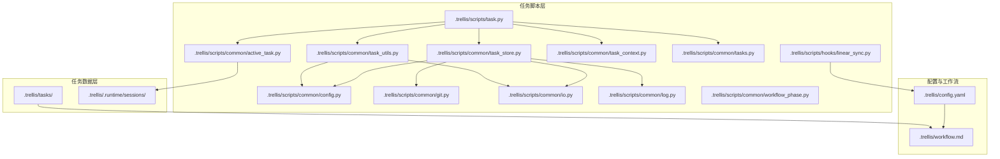
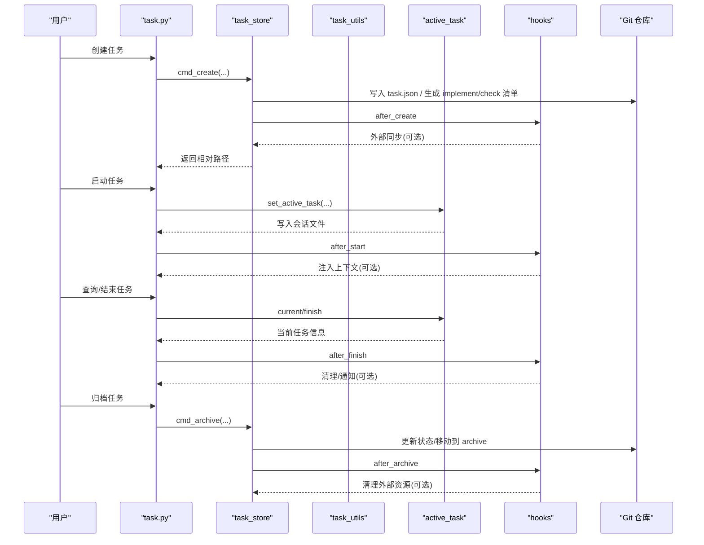
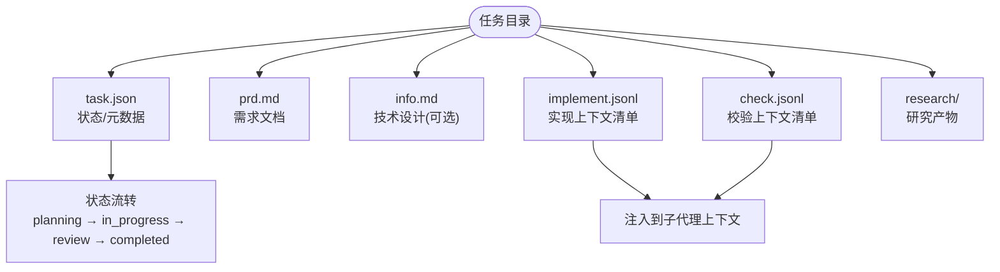
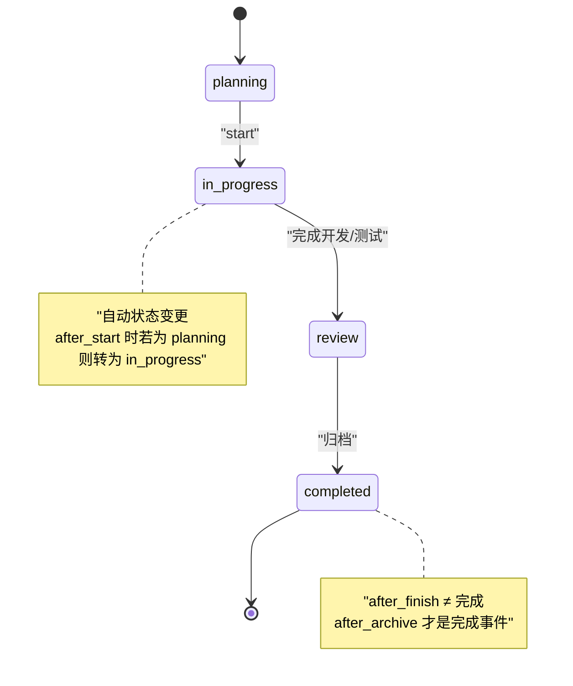
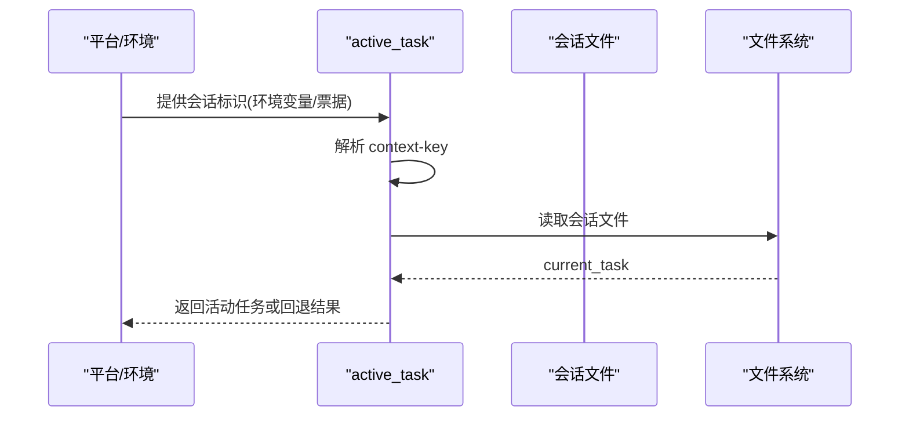
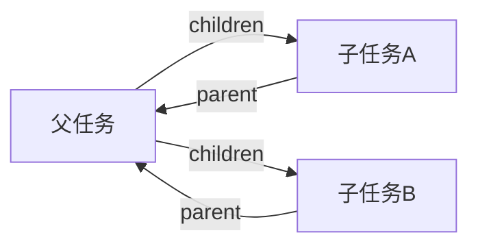
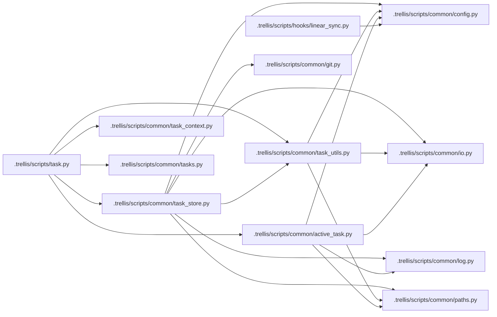

# 任务系统

<cite>
**本文引用的文件**
- [.trellis/scripts/task.py](file://.trellis/scripts/task.py)
- [.trellis/scripts/common/task_store.py](file://.trellis/scripts/common/task_store.py)
- [.trellis/scripts/common/task_utils.py](file://.trellis/scripts/common/task_utils.py)
- [.trellis/scripts/common/active_task.py](file://.trellis/scripts/common/active_task.py)
- [.trellis/scripts/common/task_context.py](file://.trellis/scripts/common/task_context.py)
- [.trellis/scripts/common/tasks.py](file://.trellis/scripts/common/tasks.py)
- [.trellis/scripts/common/paths.py](file://.trellis/scripts/common/paths.py)
- [.trellis/scripts/common/config.py](file://.trellis/scripts/common/config.py)
- [.trellis/scripts/common/git.py](file://.trellis/scripts/common/git.py)
- [.trellis/scripts/common/io.py](file://.trellis/scripts/common/io.py)
- [.trellis/scripts/common/log.py](file://.trellis/scripts/common/log.py)
- [.trellis/scripts/common/workflow_phase.py](file://.trellis/scripts/common/workflow_phase.py)
- [.trellis/scripts/hooks/linear_sync.py](file://.trellis/scripts/hooks/linear_sync.py)
- [.trellis/config.yaml](file://.trellis/config.yaml)
- [.trellis/workflow.md](file://.trellis/workflow.md)
- [.agents/skills/trellis-meta/references/local-architecture/task-system.md](file://.agents/skills/trellis-meta/references/local-architecture/task-system.md)
- [.agents/skills/trellis-meta/references/customize-local/change-task-lifecycle.md](file://.agents/skills/trellis-meta/references/customize-local/change-task-lifecycle.md)
- [.claude/skills/trellis-meta/references/customize-local/change-task-lifecycle.md](file://.claude/skills/trellis-meta/references/customize-local/change-task-lifecycle.md)
- [.trellis/tasks/05-07-ocean-tech-frontend/task.json](file://.trellis/tasks/05-07-ocean-tech-frontend/task.json)
- [.trellis/tasks/05-07-ocean-tech-frontend/prd.md](file://.trellis/tasks/05-07-ocean-tech-frontend/prd.md)
- [.trellis/tasks/05-07-ocean-tech-frontend/implement.jsonl](file://.trellis/tasks/05-07-ocean-tech-frontend/implement.jsonl)
- [.trellis/tasks/05-07-ocean-tech-frontend/check.jsonl](file://.trellis/tasks/05-07-ocean-tech-frontend/check.jsonl)
- [.trellis/tasks/05-07-ocean-tech-frontend/research/](file://.trellis/tasks/05-07-ocean-tech-frontend/research/)
- [.trellis/tasks/archive/2026-05/05-07-cybersec-agent-platform/task.json](file://.trellis/tasks/archive/2026-05/05-07-cybersec-agent-platform/task.json)
</cite>

## 目录
1. [简介](#简介)
2. [项目结构](#项目结构)
3. [核心组件](#核心组件)
4. [架构总览](#架构总览)
5. [详细组件分析](#详细组件分析)
6. [依赖关系分析](#依赖关系分析)
7. [性能考量](#性能考量)
8. [故障排除指南](#故障排除指南)
9. [结论](#结论)
10. [附录](#附录)

## 简介
本文件为 VAPT3 项目的任务系统提供全面、可操作的技术文档。内容覆盖任务生命周期（创建、激活、执行、完成、归档）、任务目录结构与元数据管理、状态跟踪与父子关系、任务脚本用法（创建、状态查询、上下文管理、分支设置）、最佳实践（命名规范、层级组织、团队协作）以及常见问题排查。读者无需深入代码即可理解并高效使用任务系统。

## 项目结构
任务系统位于仓库根目录下的 .trellis 子树中，核心由以下部分组成：
- 任务存储与脚本：.trellis/scripts 下的 task.py 及其子模块（task_store、task_utils、active_task、task_context 等）
- 配置与钩子：.trellis/config.yaml、.trellis/workflow.md、.trellis/scripts/hooks/*.py
- 任务目录：.trellis/tasks 下按日期前缀组织的任务目录，每个任务包含 task.json、prd.md、implement.jsonl、check.jsonl、research/ 等文件
- 运行时会话：.trellis/.runtime/sessions/<context-key>.json 记录当前会话的活动任务指针

图表来源
- [.trellis/scripts/task.py:1-482](file://.trellis/scripts/task.py#L1-L482)
- [.trellis/scripts/common/task_store.py:1-601](file://.trellis/scripts/common/task_store.py#L1-L601)
- [.trellis/scripts/common/task_utils.py:1-275](file://.trellis/scripts/common/task_utils.py#L1-L275)
- [.trellis/scripts/common/active_task.py:1-627](file://.trellis/scripts/common/active_task.py#L1-L627)
- [.trellis/scripts/common/task_context.py](file://.trellis/scripts/common/task_context.py)
- [.trellis/scripts/common/tasks.py](file://.trellis/scripts/common/tasks.py)
- [.trellis/scripts/common/config.py](file://.trellis/scripts/common/config.py)
- [.trellis/scripts/common/git.py](file://.trellis/scripts/common/git.py)
- [.trellis/scripts/common/io.py](file://.trellis/scripts/common/io.py)
- [.trellis/scripts/common/log.py](file://.trellis/scripts/common/log.py)
- [.trellis/scripts/common/workflow_phase.py](file://.trellis/scripts/common/workflow_phase.py)
- [.trellis/scripts/hooks/linear_sync.py:209-243](file://.trellis/scripts/hooks/linear_sync.py#L209-L243)
- [.trellis/config.yaml:1-60](file://.trellis/config.yaml#L1-L60)
- [.trellis/workflow.md:655-663](file://.trellis/workflow.md#L655-L663)

章节来源
- [.trellis/scripts/task.py:1-482](file://.trellis/scripts/task.py#L1-L482)
- [.agents/skills/trellis-meta/references/local-architecture/task-system.md:1-102](file://.agents/skills/trellis-meta/references/local-architecture/task-system.md#L1-L102)

## 核心组件
- 任务脚本入口：task.py 提供 create/start/current/finish/archive/list 等命令，统一调度各功能模块
- 任务持久化：task_store 负责创建、归档、分支/基线/范围设置、父子任务链接等 CRUD 操作
- 任务工具：task_utils 提供路径安全校验、任务查找、归档流程、生命周期钩子执行
- 会话级活动任务：active_task 基于平台环境变量/会话票据解析稳定的 context-key，维护每个会话的当前任务指针
- 上下文清单：task_context 管理 implement.jsonl 与 check.jsonl 的增删查校验
- 配置与钩子：config 提供 hooks 配置读取；workflow.md 定义状态机与事件契约；hooks/*.py 执行外部同步
- 路径与 I/O：paths、io、log 统一路径解析、文件读写与日志输出

章节来源
- [.trellis/scripts/task.py:1-482](file://.trellis/scripts/task.py#L1-L482)
- [.trellis/scripts/common/task_store.py:1-601](file://.trellis/scripts/common/task_store.py#L1-L601)
- [.trellis/scripts/common/task_utils.py:1-275](file://.trellis/scripts/common/task_utils.py#L1-L275)
- [.trellis/scripts/common/active_task.py:1-627](file://.trellis/scripts/common/active_task.py#L1-L627)
- [.trellis/scripts/common/task_context.py](file://.trellis/scripts/common/task_context.py)
- [.trellis/scripts/common/tasks.py](file://.trellis/scripts/common/tasks.py)
- [.trellis/scripts/common/config.py](file://.trellis/scripts/common/config.py)
- [.trellis/scripts/common/git.py](file://.trellis/scripts/common/git.py)
- [.trellis/scripts/common/io.py](file://.trellis/scripts/common/io.py)
- [.trellis/scripts/common/log.py](file://.trellis/scripts/common/log.py)
- [.trellis/config.yaml:17-33](file://.trellis/config.yaml#L17-L33)
- [.trellis/workflow.md:655-663](file://.trellis/workflow.md#L655-L663)

## 架构总览
任务系统采用“脚本入口 + 模块化功能 + 会话运行时”的分层设计。脚本负责命令解析与流程编排，模块负责具体业务逻辑，运行时通过会话文件实现多窗口隔离的活动任务指针。

图表来源
- [.trellis/scripts/task.py:66-142](file://.trellis/scripts/task.py#L66-L142)
- [.trellis/scripts/common/task_store.py:139-299](file://.trellis/scripts/common/task_store.py#L139-L299)
- [.trellis/scripts/common/task_store.py:306-382](file://.trellis/scripts/common/task_store.py#L306-L382)
- [.trellis/scripts/common/active_task.py:548-591](file://.trellis/scripts/common/active_task.py#L548-L591)
- [.trellis/scripts/common/task_utils.py:218-262](file://.trellis/scripts/common/task_utils.py#L218-L262)
- [.trellis/scripts/hooks/linear_sync.py:229-243](file://.trellis/scripts/hooks/linear_sync.py#L229-L243)

## 详细组件分析

### 任务目录结构与元数据
- 目录布局：.trellis/tasks/<日期前缀>-<slug>/，包含 task.json、prd.md、info.md、implement.jsonl、check.jsonl、research/ 等
- 元数据字段：id/name/title/status/priority/creator/assignee/package/branch/base_branch/children/parent/commit/pr_url/meta 等
- JSONL 上下文清单：implement.jsonl/check.jsonl 用于指导子代理优先读取规范与研究资料

图表来源
- [.agents/skills/trellis-meta/references/local-architecture/task-system.md:5-27](file://.agents/skills/trellis-meta/references/local-architecture/task-system.md#L5-L27)
- [.trellis/tasks/05-07-ocean-tech-frontend/task.json:1-226](file://.trellis/tasks/05-07-ocean-tech-frontend/task.json#L1-L226)
- [.trellis/tasks/05-07-ocean-tech-frontend/prd.md](file://.trellis/tasks/05-07-ocean-tech-frontend/prd.md)
- [.trellis/tasks/05-07-ocean-tech-frontend/implement.jsonl](file://.trellis/tasks/05-07-ocean-tech-frontend/implement.jsonl)
- [.trellis/tasks/05-07-ocean-tech-frontend/check.jsonl](file://.trellis/tasks/05-07-ocean-tech-frontend/check.jsonl)
- [.trellis/tasks/05-07-ocean-tech-frontend/research/](file://.trellis/tasks/05-07-ocean-tech-frontend/research/)

章节来源
- [.agents/skills/trellis-meta/references/local-architecture/task-system.md:1-102](file://.agents/skills/trellis-meta/references/local-architecture/task-system.md#L1-L102)
- [.trellis/tasks/05-07-ocean-tech-frontend/task.json:1-226](file://.trellis/tasks/05-07-ocean-tech-frontend/task.json#L1-L226)

### 生命周期命令与状态跟踪
- 创建：自动生成日期前缀 + slug，写入默认 task.json，必要时生成 implement.jsonl/check.jsonl 种子行
- 激活：基于会话 context-key 写入 .trellis/.runtime/sessions/<key>.json 的 current_task 字段；如状态为 planning 自动转为 in_progress
- 执行：通过 hooks.after_start 注入上下文；子代理从 JSONL 读取规范与研究资料
- 完成：finish 清除当前任务指针；after_finish 触发清理/通知
- 归档：archive 将任务移至 archive/YYYY-MM/，更新状态为 completed，after_archive 执行外部清理

图表来源
- [.trellis/scripts/task.py:109-112](file://.trellis/scripts/task.py#L109-L112)
- [.trellis/workflow.md:655-663](file://.trellis/workflow.md#L655-L663)
- [.trellis/scripts/common/task_store.py:332-339](file://.trellis/scripts/common/task_store.py#L332-L339)

章节来源
- [.trellis/scripts/task.py:66-142](file://.trellis/scripts/task.py#L66-L142)
- [.trellis/scripts/common/task_store.py:139-299](file://.trellis/scripts/common/task_store.py#L139-L299)
- [.trellis/scripts/common/task_store.py:306-382](file://.trellis/scripts/common/task_store.py#L306-L382)
- [.trellis/workflow.md:655-663](file://.trellis/workflow.md#L655-L663)

### 会话与活动任务
- 会话识别：通过平台环境变量/会话票据解析 context-key，支持 claude/cursor/codex/gemini 等
- 指针存储：每个会话独立的 <context-key>.json 记录 current_task
- 多窗口隔离：不同会话互不覆盖，避免跨窗口污染
- 回退机制：当无法解析 context-key 时，若仅存在一个会话文件则进行“单会话回退”

图表来源
- [.trellis/scripts/common/active_task.py:380-416](file://.trellis/scripts/common/active_task.py#L380-L416)
- [.trellis/scripts/common/active_task.py:468-494](file://.trellis/scripts/common/active_task.py#L468-L494)
- [.trellis/scripts/common/active_task.py:548-591](file://.trellis/scripts/common/active_task.py#L548-L591)

章节来源
- [.trellis/scripts/common/active_task.py:1-627](file://.trellis/scripts/common/active_task.py#L1-L627)

### 父子任务与层级进度
- 父子链接：通过 parent/children 字段建立双向关系；归档时保持父任务 children 列表一致性
- 层级展示：list 命令以缩进方式显示父子层级，并计算子任务进度
- 关系维护：add-subtask/remove-subtask 支持动态调整父子关系

图表来源
- [.trellis/scripts/common/task_store.py:242-263](file://.trellis/scripts/common/task_store.py#L242-L263)
- [.trellis/scripts/common/task_store.py:410-456](file://.trellis/scripts/common/task_store.py#L410-L456)
- [.trellis/scripts/common/task_store.py:463-503](file://.trellis/scripts/common/task_store.py#L463-L503)
- [.trellis/scripts/common/tasks.py](file://.trellis/scripts/common/tasks.py)

章节来源
- [.trellis/scripts/common/task_store.py:242-263](file://.trellis/scripts/common/task_store.py#L242-L263)
- [.trellis/scripts/common/task_store.py:410-456](file://.trellis/scripts/common/task_store.py#L410-L456)
- [.trellis/scripts/common/task_store.py:463-503](file://.trellis/scripts/common/task_store.py#L463-L503)

### 任务脚本用法与最佳实践
- 创建任务
  - 命令：python3 ./.trellis/scripts/task.py create "<标题>" [--slug <名称>] [--assignee <开发者>] [--priority P0|P1|P2|P3] [--parent <父目录>] [--package <包名>]
  - 行为：生成日期前缀 + slug 目录，写入 task.json；如检测到子代理平台则生成 implement.jsonl/check.jsonl 种子行
- 激活/查询/结束
  - 启动：python3 ./.trellis/scripts/task.py start <任务目录>
  - 查询：python3 ./.trellis/scripts/task.py current [--source]
  - 结束：python3 ./.trellis/scripts/task.py finish
- 上下文管理
  - 添加：python3 ./.trellis/scripts/task.py add-context <任务> implement|check <文件> <原因>
  - 校验：python3 ./.trellis/scripts/task.py validate <任务>
  - 列表：python3 ./.trellis/scripts/task.py list-context <任务>
- 分支与范围
  - 设置分支：python3 ./.trellis/scripts/task.py set-branch <任务> <分支>
  - 设置基线分支：python3 ./.trellis/scripts/task.py set-base-branch <任务> <基线分支>
  - 设置 PR 范围：python3 ./.trellis/scripts/task.py set-scope <任务> <范围>
- 归档
  - python3 ./.trellis/scripts/task.py archive <任务目录> [--no-commit]
  - 归档后自动更新状态为 completed 并移动到 archive/YYYY-MM/

最佳实践
- 命名规范：使用日期前缀 + 语义化 slug；slug 由标题经小写/连字符规则生成
- 层级组织：通过 --parent 建立父子关系；使用 --package 区分多包项目
- 团队协作：默认 assignee 来自开发者初始化；使用 --assignee 明确责任人
- 上下文清单：implement.jsonl/check.jsonl 仅放规范与研究文件，避免放入即将修改的代码文件
- 生命周期钩子：在 .trellis/config.yaml 中配置 hooks.after_* 实现外部系统同步与清理

章节来源
- [.trellis/scripts/task.py:1-482](file://.trellis/scripts/task.py#L1-L482)
- [.trellis/scripts/common/task_store.py:139-299](file://.trellis/scripts/common/task_store.py#L139-L299)
- [.trellis/scripts/common/task_store.py:306-382](file://.trellis/scripts/common/task_store.py#L306-L382)
- [.agents/skills/trellis-meta/references/local-architecture/task-system.md:77-87](file://.agents/skills/trellis-meta/references/local-architecture/task-system.md#L77-L87)
- [.agents/skills/trellis-meta/references/customize-local/change-task-lifecycle.md:14-25](file://.agents/skills/trellis-meta/references/customize-local/change-task-lifecycle.md#L14-L25)
- [.claude/skills/trellis-meta/references/customize-local/change-task-lifecycle.md:14-25](file://.claude/skills/trellis-meta/references/customize-local/change-task-lifecycle.md#L14-L25)

## 依赖关系分析
- task.py 依赖 task_store、task_utils、active_task、task_context、tasks 等模块
- task_store 依赖 config、git、io、log、paths、task_utils
- active_task 依赖 paths、io、log、config（间接）
- task_utils 依赖 paths、io、config
- hooks 通过 config 读取 hooks 配置并通过环境变量传递 TASK_JSON_PATH

图表来源
- [.trellis/scripts/task.py:49-63](file://.trellis/scripts/task.py#L49-L63)
- [.trellis/scripts/common/task_store.py:25-49](file://.trellis/scripts/common/task_store.py#L25-L49)
- [.trellis/scripts/common/task_utils.py:20-21](file://.trellis/scripts/common/task_utils.py#L20-L21)
- [.trellis/scripts/common/active_task.py:22-26](file://.trellis/scripts/common/active_task.py#L22-L26)
- [.trellis/scripts/hooks/linear_sync.py:229-243](file://.trellis/scripts/hooks/linear_sync.py#L229-L243)

章节来源
- [.trellis/scripts/task.py:49-63](file://.trellis/scripts/task.py#L49-L63)
- [.trellis/scripts/common/task_store.py:25-49](file://.trellis/scripts/common/task_store.py#L25-L49)
- [.trellis/scripts/common/task_utils.py:20-21](file://.trellis/scripts/common/task_utils.py#L20-L21)
- [.trellis/scripts/common/active_task.py:22-26](file://.trellis/scripts/common/active_task.py#L22-L26)
- [.trellis/scripts/hooks/linear_sync.py:229-243](file://.trellis/scripts/hooks/linear_sync.py#L229-L243)

## 性能考量
- 脚本调用链路短、I/O 次数少：主要操作为文件读写与 Git 提交，建议批量归档后再提交，减少频繁提交
- JSONL 上下文清单：仅包含规范与研究文件，避免加载大体量代码文件，降低子代理上下文注入成本
- 会话文件粒度：每个会话独立文件，避免全局锁竞争，提升并发场景下的稳定性

## 故障排除指南
- 无法设置活动任务
  - 现象：提示需要会话身份
  - 排查：确认在支持的 AI IDE/会话环境中运行；检查环境变量是否暴露会话标识；必要时设置 TRELLIS_CONTEXT_ID
  - 参考：[active_task 解析逻辑:380-416](file://.trellis/scripts/common/active_task.py#L380-L416)
- 任务未找到
  - 现象：报错“任务未找到”
  - 排查：使用 task.py list 查看可用任务；支持名称后缀匹配；确认路径安全（无 ..、绝对路径等）
  - 参考：[task_utils 路径解析与安全校验:174-212](file://.trellis/scripts/common/task_utils.py#L174-L212)
- 归档失败或未提交
  - 现象：归档后未自动提交
  - 排查：检查 Git 工作区是否有变更；如无变更则不会提交；可手动添加 --no-commit 跳过自动提交
  - 参考：[归档自动提交逻辑:385-404](file://.trellis/scripts/common/task_store.py#L385-L404)
- 生命周期钩子失败
  - 现象：after_* 钩子执行失败但不阻断主流程
  - 排查：查看标准错误输出中的警告；确保钩子命令可执行且能读取 TASK_JSON_PATH
  - 参考：[run_task_hooks:218-262](file://.trellis/scripts/common/task_utils.py#L218-L262)

章节来源
- [.trellis/scripts/common/active_task.py:380-416](file://.trellis/scripts/common/active_task.py#L380-L416)
- [.trellis/scripts/common/task_utils.py:174-212](file://.trellis/scripts/common/task_utils.py#L174-L212)
- [.trellis/scripts/common/task_store.py:385-404](file://.trellis/scripts/common/task_store.py#L385-L404)
- [.trellis/scripts/common/task_utils.py:218-262](file://.trellis/scripts/common/task_utils.py#L218-L262)

## 结论
VAPT3 任务系统通过清晰的目录结构、严谨的状态机与钩子机制、会话级隔离的活动任务指针，实现了可扩展、可协作、可审计的任务管理。遵循本文的命名与层级规范、上下文清单规则与钩子配置策略，可在团队内高效落地任务驱动的工作流。

## 附录
- 常用命令速查
  - 创建：python3 ./.trellis/scripts/task.py create "<标题>" [--slug <名称>] [--assignee <开发者>] [--priority P0|P1|P2|P3] [--parent <父目录>] [--package <包名>]
  - 启动：python3 ./.trellis/scripts/task.py start <任务目录>
  - 查询：python3 ./.trellis/scripts/task.py current [--source]
  - 结束：python3 ./.trellis/scripts/task.py finish
  - 上下文：python3 ./.trellis/scripts/task.py add-context <任务> implement|check <文件> <原因>
  - 校验：python3 ./.trellis/scripts/task.py validate <任务>
  - 列表：python3 ./.trellis/scripts/task.py list [--mine] [--status <状态>]
  - 归档：python3 ./.trellis/scripts/task.py archive <任务目录> [--no-commit]
- 任务示例参考
  - 活跃任务：[05-07-ocean-tech-frontend](file://.trellis/tasks/05-07-ocean-tech-frontend/task.json)
  - 归档任务：[05-07-cybersec-agent-platform](file://.trellis/tasks/archive/2026-05/05-07-cybersec-agent-platform/task.json)