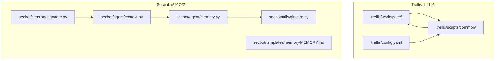
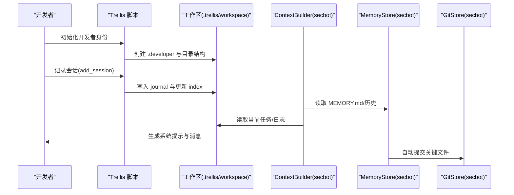
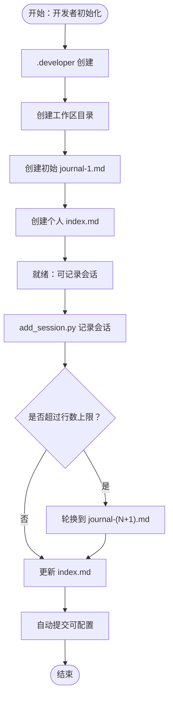
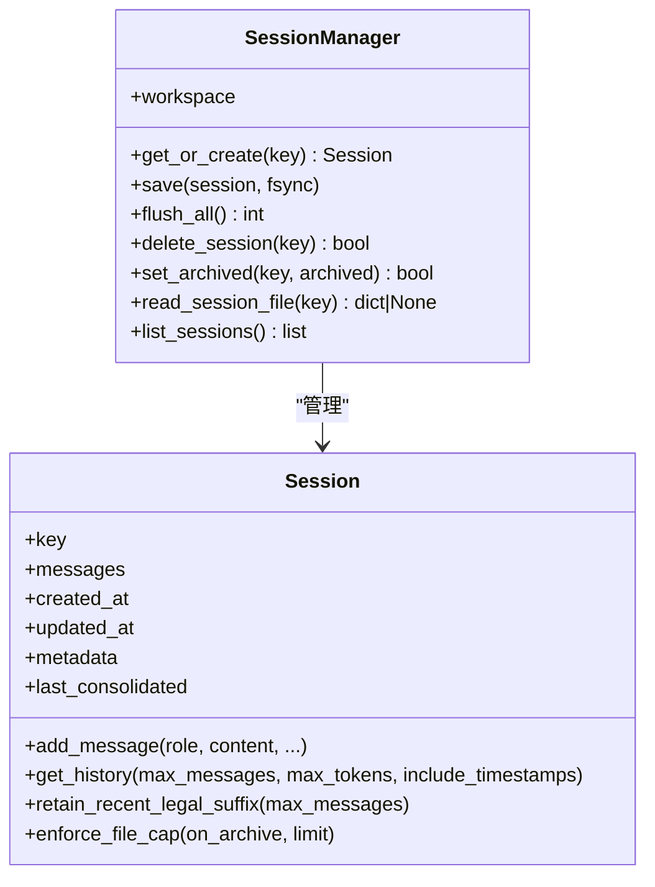
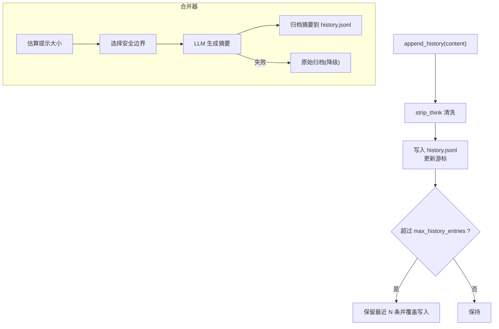
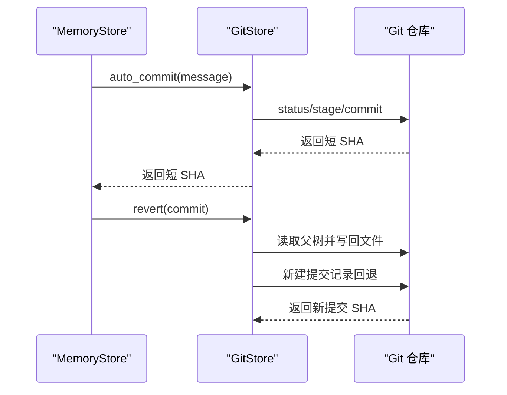
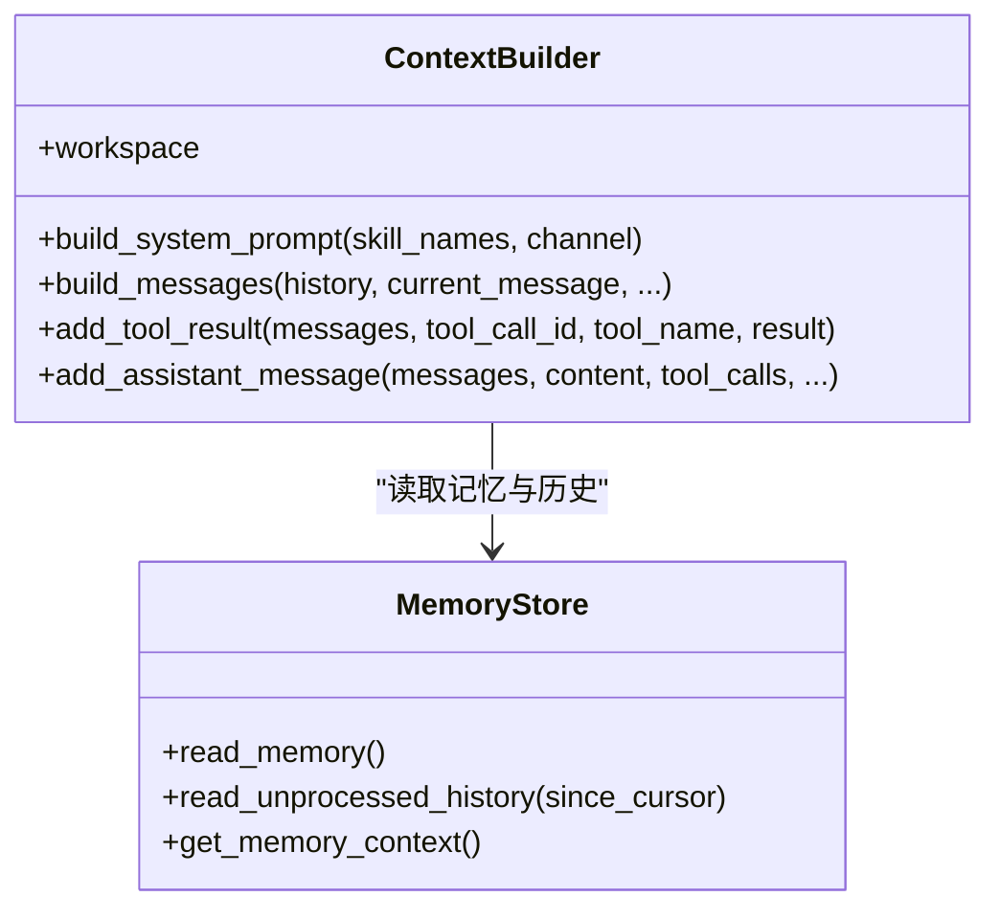
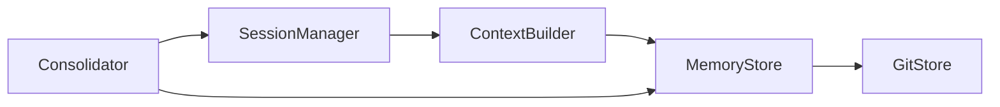

# 工作区系统

<cite>
**本文引用的文件**
- [workspace/index.md](file://.trellis/workspace/index.md)
- [workspace-memory.md（.agents）](file://.agents/skills/trellis-meta/references/local-architecture/workspace-memory.md)
- [workspace-memory.md（.claude）](file://.claude/skills/trellis-meta/references/local-architecture/workspace-memory.md)
- [config.yaml（.trellis）](file://.trellis/config.yaml)
- [session_context.py](file://.trellis/scripts/common/session_context.py)
- [developer.py](file://.trellis/scripts/common/developer.py)
- [paths.py](file://secbot/config/paths.py)
- [manager.py（会话管理）](file://secbot/session/manager.py)
- [memory.py（记忆存储与合并器）](file://secbot/agent/memory.py)
- [gitstore.py](file://secbot/utils/gitstore.py)
- [MEMORY.md（模板）](file://secbot/templates/memory/MEMORY.md)
- [context.py](file://secbot/agent/context.py)
- [helpers.py](file://secbot/utils/helpers.py)
- [memory.md（文档）](file://docs/memory.md)
</cite>

## 目录
1. [简介](#简介)
2. [项目结构](#项目结构)
3. [核心组件](#核心组件)
4. [架构总览](#架构总览)
5. [组件详解](#组件详解)
6. [依赖关系分析](#依赖关系分析)
7. [性能考量](#性能考量)
8. [故障排除指南](#故障排除指南)
9. [结论](#结论)
10. [附录](#附录)

## 简介
本文件系统性梳理 VAPT3 的“工作区系统”，聚焦于开发者身份初始化、会话记录与跨会话记忆、知识积累与索引管理、以及在多轮任务与对话中实现持续学习与改进的能力。工作区系统由两部分协同构成：
- Trellis 工作区：面向“开发者身份、会话日志、任务与规范”的本地持久化与上下文注入。
- Secbot 记忆系统：面向“短期对话会话、长期记忆文件、历史归档与智能合并”的统一存储与处理。

通过明确的文件结构、会话日志规范与索引管理机制，工作区系统在跨会话追踪中扮演“背景记忆”角色，辅助 AI 在不同窗口与日期间理解“发生了什么”。

## 项目结构
工作区系统涉及以下关键目录与文件：
- Trellis 工作区
  - .trellis/workspace：按开发者分组的会话日志与索引
  - .trellis/config.yaml：会话记录与日志上限等配置
  - .trellis/scripts/common：开发者初始化、会话上下文生成等脚本
- Secbot 记忆系统
  - secbot/session：会话管理与持久化
  - secbot/agent/memory：记忆存储、历史归档与合并器
  - secbot/utils/gitstore：基于 Git 的版本控制与自动提交
  - secbot/agent/context：上下文构建，整合记忆与技能
  - secbot/templates/memory：长期记忆模板

**图示来源**
- [.trellis/workspace/index.md:1-126](file://.trellis/workspace/index.md#L1-L126)
- [.trellis/config.yaml:1-60](file://.trellis/config.yaml#L1-L60)
- [session_context.py:116-196](file://.trellis/scripts/common/session_context.py#L116-L196)
- [developer.py:33-148](file://.trellis/scripts/common/developer.py#L33-L148)
- [manager.py（会话管理）:239-659](file://secbot/session/manager.py#L239-L659)
- [memory.py（记忆存储与合并器）:39-69](file://secbot/agent/memory.py#L39-L69)
- [gitstore.py:45-118](file://secbot/utils/gitstore.py#L45-L118)
- [context.py:17-82](file://secbot/agent/context.py#L17-L82)
- [MEMORY.md（模板）:1-24](file://secbot/templates/memory/MEMORY.md#L1-L24)

**章节来源**
- [.trellis/workspace/index.md:1-126](file://.trellis/workspace/index.md#L1-L126)
- [.trellis/config.yaml:1-60](file://.trellis/config.yaml#L1-L60)
- [session_context.py:116-196](file://.trellis/scripts/common/session_context.py#L116-L196)
- [developer.py:33-148](file://.trellis/scripts/common/developer.py#L33-L148)
- [manager.py（会话管理）:239-659](file://secbot/session/manager.py#L239-L659)
- [memory.py（记忆存储与合并器）:39-69](file://secbot/agent/memory.py#L39-L69)
- [gitstore.py:45-118](file://secbot/utils/gitstore.py#L45-L118)
- [context.py:17-82](file://secbot/agent/context.py#L17-L82)
- [MEMORY.md（模板）:1-24](file://secbot/templates/memory/MEMORY.md#L1-L24)

## 核心组件
- Trellis 开发者身份与工作区
  - 初始化：创建 .developer 文件、开发者目录、初始 journal 与 index
  - 日志：journal-N.md 按行数上限轮换；支持记录会话标题、摘要、分支、变更、提交、测试与下一步
  - 索引：全局与个人 index.md 维护活动文件、会话历史与状态
- Secbot 会话与记忆
  - 会话管理：JSONL 存储、消息边界裁剪、文件上限与归档
  - 记忆存储：MEMORY.md、SOUL.md、USER.md、history.jsonl；游标驱动的历史与压缩
  - 合并器：基于令牌预算的旧消息摘要归档，保留合法消息边界
  - 上下文：系统提示与运行时上下文注入，结合任务与工作区信息
  - Git 版本：对关键记忆文件进行自动提交与回溯

**章节来源**
- [workspace-memory.md（.agents）:1-72](file://.agents/skills/trellis-meta/references/local-architecture/workspace-memory.md#L1-L72)
- [workspace-memory.md（.claude）:1-72](file://.claude/skills/trellis-meta/references/local-architecture/workspace-memory.md#L1-L72)
- [config.yaml（.trellis）:10-15](file://.trellis/config.yaml#L10-L15)
- [session_context.py:116-196](file://.trellis/scripts/common/session_context.py#L116-L196)
- [developer.py:33-148](file://.trellis/scripts/common/developer.py#L33-L148)
- [manager.py（会话管理）:239-659](file://secbot/session/manager.py#L239-L659)
- [memory.py（记忆存储与合并器）:39-69](file://secbot/agent/memory.py#L39-L69)
- [gitstore.py:45-118](file://secbot/utils/gitstore.py#L45-L118)
- [context.py:17-82](file://secbot/agent/context.py#L17-L82)

## 架构总览
工作区系统在“开发者视角”与“AI 角色”之间建立桥梁：
- 开发者侧：通过 Trellis 脚本完成身份初始化、会话记录与上下文生成；日志与索引作为跨会话背景记忆
- AI 侧：通过 ContextBuilder 将工作区信息与任务、技能、近期历史、长期记忆融合，形成系统提示与消息序列

**图示来源**
- [developer.py:33-148](file://.trellis/scripts/common/developer.py#L33-L148)
- [session_context.py:116-196](file://.trellis/scripts/common/session_context.py#L116-L196)
- [context.py:17-82](file://secbot/agent/context.py#L17-L82)
- [memory.py（记忆存储与合并器）:39-69](file://secbot/agent/memory.py#L39-L69)
- [gitstore.py:121-153](file://secbot/utils/gitstore.py#L121-L153)

## 组件详解

### Trellis 工作区：开发者身份与会话日志
- 开发者身份初始化
  - 创建 .developer 文件与对应工作区目录
  - 生成初始 journal 与个人 index.md，包含活动文件、会话历史占位
- 日志与索引
  - journal-N.md：每文件约 2000 行，超限轮换新文件
  - index.md：维护当前状态、活动文档与会话历史表格
- 会话记录规范
  - 标题、摘要、分支、主要变更、Git 提交、测试结果、状态、下一步
  - 支持无提交的规划/复盘记录
- 配置项
  - max_journal_lines：单日志文件最大行数
  - session_commit_message：自动提交日志/索引变更的消息

**图示来源**
- [developer.py:33-148](file://.trellis/scripts/common/developer.py#L33-L148)
- [config.yaml（.trellis）:10-15](file://.trellis/config.yaml#L10-L15)
- [workspace/index.md:66-121](file://.trellis/workspace/index.md#L66-L121)

**章节来源**
- [workspace-memory.md（.agents）:23-71](file://.agents/skills/trellis-meta/references/local-architecture/workspace-memory.md#L23-L71)
- [workspace-memory.md（.claude）:23-71](file://.claude/skills/trellis-meta/references/local-architecture/workspace-memory.md#L23-L71)
- [workspace/index.md:66-121](file://.trellis/workspace/index.md#L66-L121)
- [config.yaml（.trellis）:10-15](file://.trellis/config.yaml#L10-L15)
- [developer.py:33-148](file://.trellis/scripts/common/developer.py#L33-L148)

### Secbot 会话管理：消息边界与文件上限
- 数据模型
  - Session：键、消息列表、时间戳、元数据、已归档消息计数
  - SessionManager：按键加载/保存 JSONL，迁移旧路径，错误修复，列表与预览
- 关键能力
  - 历史切片：按消息数与令牌预算切片，避免中间断层
  - 法律边界：保留合法的工具调用边界，丢弃孤立工具结果
  - 文件上限：达到阈值时归档旧前缀并触发回调
- 容错与一致性
  - 修复损坏 JSONL 文件，跳过无效行
  - 原子写入与目录 fsync，确保落盘安全

**图示来源**
- [manager.py（会话管理）:26-237](file://secbot/session/manager.py#L26-L237)
- [manager.py（会话管理）:239-659](file://secbot/session/manager.py#L239-L659)

**章节来源**
- [manager.py（会话管理）:26-237](file://secbot/session/manager.py#L26-L237)
- [manager.py（会话管理）:239-659](file://secbot/session/manager.py#L239-L659)

### Secbot 记忆系统：长期记忆、历史归档与合并
- 记忆文件
  - MEMORY.md：长期记忆（用户信息、偏好、项目上下文、重要备注）
  - SOUL.md、USER.md：身份与用户信息
  - history.jsonl：追加式历史，带游标与时间戳
- 历史管理
  - 追加历史并清洗思考内容，防止模板泄漏
  - 游标驱动的未处理历史读取与压缩
  - 历史条目硬上限与压缩清理
- 合并器（Consolidator）
  - 基于令牌预算选择安全边界，将旧消息摘要化并写入历史
  - 失败时降级为原始归档，保留线索
- Dream（周期性处理）
  - 分阶段分析与编辑，可选按行标注年龄，支持工具读写文件

**图示来源**
- [memory.py（记忆存储与合并器）:233-426](file://secbot/agent/memory.py#L233-L426)
- [memory.py（记忆存储与合并器）:442-692](file://secbot/agent/memory.py#L442-L692)
- [helpers.py:18-71](file://secbot/utils/helpers.py#L18-L71)

**章节来源**
- [memory.py（记忆存储与合并器）:39-69](file://secbot/agent/memory.py#L39-L69)
- [memory.py（记忆存储与合并器）:233-426](file://secbot/agent/memory.py#L233-L426)
- [memory.py（记忆存储与合并器）:442-692](file://secbot/agent/memory.py#L442-L692)
- [helpers.py:18-71](file://secbot/utils/helpers.py#L18-L71)
- [MEMORY.md（模板）:1-24](file://secbot/templates/memory/MEMORY.md#L1-L24)
- [memory.md（文档）:22-48](file://docs/memory.md#L22-L48)

### Git 版本控制：记忆文件的自动提交与回溯
- 跟踪文件：SOUL.md、USER.md、MEMORY.md、.dream_cursor
- 自动提交：检测变更后自动提交，支持短 SHA 解析与日志查询
- 回溯：按提交还原受影响文件，再提交一次以记录回退

**图示来源**
- [gitstore.py:121-153](file://secbot/utils/gitstore.py#L121-L153)
- [gitstore.py:323-371](file://secbot/utils/gitstore.py#L323-L371)

**章节来源**
- [gitstore.py:45-118](file://secbot/utils/gitstore.py#L45-L118)
- [gitstore.py:121-153](file://secbot/utils/gitstore.py#L121-L153)
- [gitstore.py:212-320](file://secbot/utils/gitstore.py#L212-L320)
- [gitstore.py:323-371](file://secbot/utils/gitstore.py#L323-L371)

### 上下文构建：工作区与记忆的融合
- 系统提示组成
  - 身份信息、引导文件、长期记忆、活跃技能、技能概要、近期历史
- 运行时上下文
  - 注入当前时间、通道/聊天 ID、发送者 ID、会话摘要等元数据
- 与工作区的衔接
  - 从 .trellis/workspace 读取当前任务、日志与 Git 状态，作为背景信息注入

**图示来源**
- [context.py:17-82](file://secbot/agent/context.py#L17-L82)
- [context.py:133-215](file://secbot/agent/context.py#L133-L215)
- [memory.py（记忆存储与合并器）:227-230](file://secbot/agent/memory.py#L227-L230)

**章节来源**
- [context.py:17-82](file://secbot/agent/context.py#L17-L82)
- [context.py:133-215](file://secbot/agent/context.py#L133-L215)
- [session_context.py:116-196](file://.trellis/scripts/common/session_context.py#L116-L196)

## 依赖关系分析
- 组件耦合
  - ContextBuilder 依赖 MemoryStore 读取长期记忆与近期历史
  - MemoryStore 依赖 GitStore 对关键文件进行版本控制
  - SessionManager 与 Consolidator 协同，前者负责会话持久化，后者负责历史归档
- 外部依赖
  - Git（dulwich）用于版本控制
  - tiktoken 用于令牌估算
  - loguru 用于日志记录

**图示来源**
- [context.py:17-82](file://secbot/agent/context.py#L17-L82)
- [memory.py（记忆存储与合并器）:39-69](file://secbot/agent/memory.py#L39-L69)
- [gitstore.py:45-118](file://secbot/utils/gitstore.py#L45-L118)
- [manager.py（会话管理）:239-659](file://secbot/session/manager.py#L239-L659)
- [memory.py（记忆存储与合并器）:442-692](file://secbot/agent/memory.py#L442-L692)

**章节来源**
- [context.py:17-82](file://secbot/agent/context.py#L17-L82)
- [memory.py（记忆存储与合并器）:39-69](file://secbot/agent/memory.py#L39-L69)
- [gitstore.py:45-118](file://secbot/utils/gitstore.py#L45-L118)
- [manager.py（会话管理）:239-659](file://secbot/session/manager.py#L239-L659)
- [memory.py（记忆存储与合并器）:442-692](file://secbot/agent/memory.py#L442-L692)

## 性能考量
- 令牌预算与切片
  - 会话历史按消息数与令牌预算切片，避免越界；保留合法工具调用边界
- 历史压缩
  - 基于 Consolidator 的摘要归档，降低上下文开销
- 文件上限与原子写入
  - 会话文件与历史文件采用原子写入与目录 fsync，减少碎片与丢失风险
- Git 提交批量化
  - 变更检测后批量提交，避免频繁 IO

[本节为通用指导，无需特定文件引用]

## 故障排除指南
- 会话文件损坏
  - 现象：读取失败或解析异常
  - 处理：使用 SessionManager 的修复逻辑跳过无效行，重建会话对象
- 历史文件异常
  - 现象：游标非整数、历史条目缺失
  - 处理：MemoryStore 会过滤非法游标并记录警告；必要时重建游标
- Git 初始化冲突
  - 现象：工作区已在 Git 仓库内
  - 处理：GitStore 检测并跳过嵌套仓库初始化
- 会话上限触发
  - 现象：消息过多导致文件上限
  - 处理：启用 enforce_file_cap 触发归档与裁剪；检查 on_archive 回调

**章节来源**
- [manager.py（会话管理）:338-391](file://secbot/session/manager.py#L338-L391)
- [manager.py（会话管理）:208-237](file://secbot/session/manager.py#L208-L237)
- [memory.py（记忆存储与合并器）:282-300](file://secbot/agent/memory.py#L282-L300)
- [gitstore.py:179-193](file://secbot/utils/gitstore.py#L179-L193)

## 结论
工作区系统通过 Trellis 的开发者身份与会话日志，以及 Secbot 的会话与记忆机制，实现了“跨会话可追踪、可沉淀、可改进”的知识管理闭环。开发者可以按规范记录会话，AI 则在系统提示与上下文中融合这些背景信息，实现持续学习与优化。建议严格遵循日志格式、定期归档与备份、合理设置文件上限与令牌预算，以获得稳定高效的使用体验。

[本节为总结性内容，无需特定文件引用]

## 附录

### 最佳实践
- 会话记录格式
  - 使用统一模板：标题、摘要、分支、主要变更、Git 提交、测试、状态、下一步
  - 无提交的规划/复盘场景使用 --no-commit 或空提交值
- 知识整理策略
  - 当前任务专用信息放入任务目录；会话过程记录放入工作区日志；长期规则沉淀至 spec
  - 定期回顾 MEMORY.md，提炼可复用的工程约定
- 隐私保护
  - 避免在日志与记忆文件中记录敏感信息；必要时手动清理或使用 Git 回退
  - 使用默认工作区路径时注意环境隔离

**章节来源**
- [workspace-memory.md（.agents）:48-71](file://.agents/skills/trellis-meta/references/local-architecture/workspace-memory.md#L48-L71)
- [workspace-memory.md（.claude）:48-71](file://.claude/skills/trellis-meta/references/local-architecture/workspace-memory.md#L48-L71)
- [config.yaml（.trellis）:10-15](file://.trellis/config.yaml#L10-L15)
- [gitstore.py:323-371](file://secbot/utils/gitstore.py#L323-L371)

### 操作指南
- 初始化开发者身份
  - 运行初始化脚本，创建 .developer 与工作区目录、初始 journal 与 index
- 记录会话
  - 使用 add_session.py 命令记录标题、摘要、分支、变更、提交、测试与下一步
- 查看上下文
  - 使用脚本输出 JSON/文本上下文，包含开发者、Git 状态、任务与日志信息
- 设置工作区路径
  - 通过路径配置函数解析与确保工作区目录

**章节来源**
- [developer.py:33-148](file://.trellis/scripts/common/developer.py#L33-L148)
- [session_context.py:116-196](file://.trellis/scripts/common/session_context.py#L116-L196)
- [paths.py:37-40](file://secbot/config/paths.py#L37-L40)