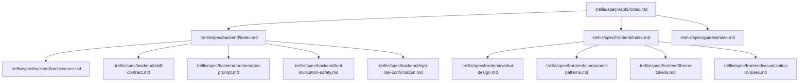
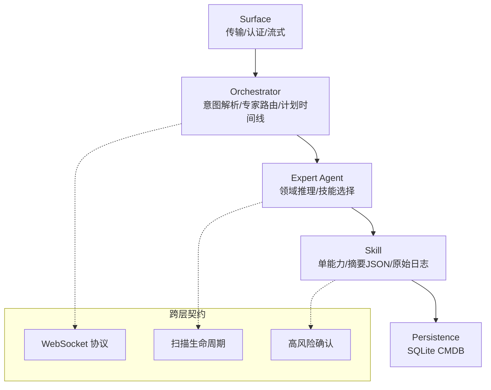
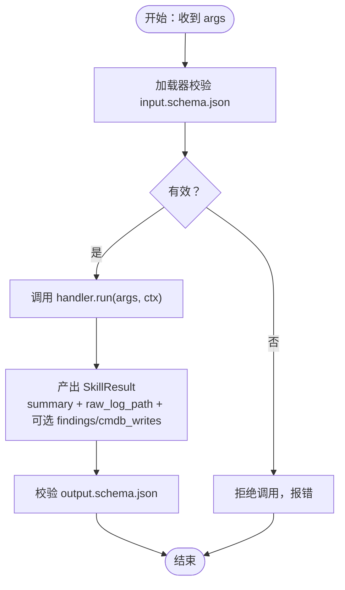
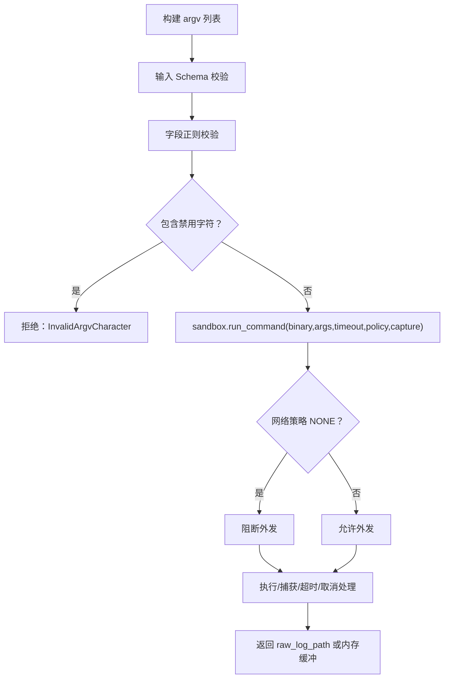
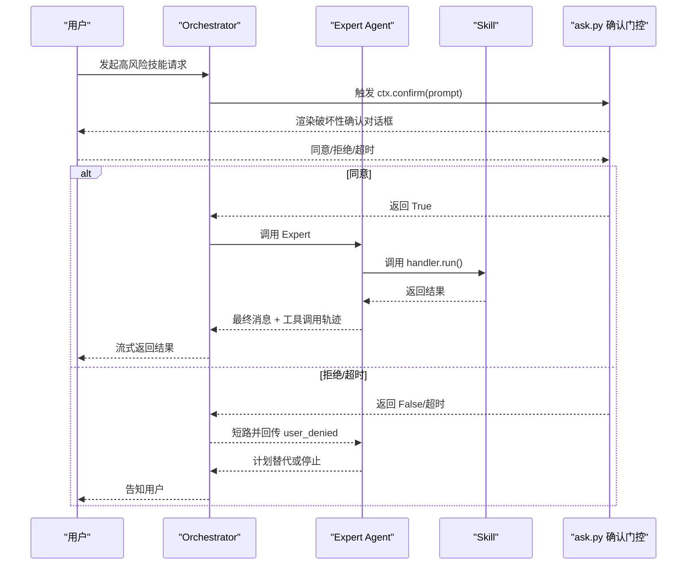
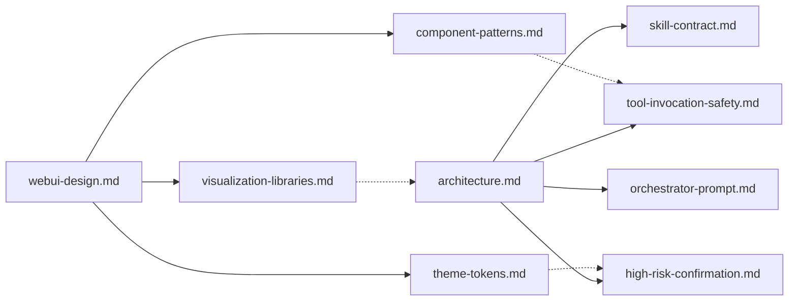

# 规范系统

<cite>
**本文引用的文件**
- [.trellis/spec/vapt3/index.md](file://.trellis/spec/vapt3/index.md)
- [.trellis/spec/backend/index.md](file://.trellis/spec/backend/index.md)
- [.trellis/spec/frontend/index.md](file://.trellis/spec/frontend/index.md)
- [.trellis/spec/guides/index.md](file://.trellis/spec/guides/index.md)
- [.trellis/spec/backend/architecture.md](file://.trellis/spec/backend/architecture.md)
- [.trellis/spec/backend/skill-contract.md](file://.trellis/spec/backend/skill-contract.md)
- [.trellis/spec/backend/orchestrator-prompt.md](file://.trellis/spec/backend/orchestrator-prompt.md)
- [.trellis/spec/backend/tool-invocation-safety.md](file://.trellis/spec/backend/tool-invocation-safety.md)
- [.trellis/spec/backend/high-risk-confirmation.md](file://.trellis/spec/backend/high-risk-confirmation.md)
- [.trellis/spec/frontend/webui-design.md](file://.trellis/spec/frontend/webui-design.md)
- [.trellis/spec/frontend/component-patterns.md](file://.trellis/spec/frontend/component-patterns.md)
- [.trellis/spec/frontend/theme-tokens.md](file://.trellis/spec/frontend/theme-tokens.md)
- [.trellis/spec/frontend/visualization-libraries.md](file://.trellis/spec/frontend/visualization-libraries.md)
</cite>

## 目录
1. [引言](#引言)
2. [项目结构](#项目结构)
3. [核心组件](#核心组件)
4. [架构总览](#架构总览)
5. [详细组件分析](#详细组件分析)
6. [依赖关系分析](#依赖关系分析)
7. [性能考量](#性能考量)
8. [故障排查指南](#故障排查指南)
9. [结论](#结论)
10. [附录](#附录)

## 引言
本文件系统化梳理 VAPT3（原 nanobot）项目的“规范系统”，聚焦于规范的组织结构、层级规范与跨包指南，阐明规范文件的创建、更新与维护流程，以及规范与任务执行的关联机制；并给出版本管理、变更追踪与质量保证的建议方案，最后总结规范编写的最佳实践与使用示例。

## 项目结构
规范系统以“.trellis/spec”为核心目录，按技术层划分为 backend/、frontend/ 与 guides/ 三大域，并通过 vapt3/index.md 提供统一导航入口。该布局将“权威契约”（backend）、“前端约束”（frontend）与“思维导引”（guides）分层管理，确保跨层变更可被清晰识别与控制。

图表来源
- [.trellis/spec/vapt3/index.md:1-139](file://.trellis/spec/vapt3/index.md#L1-L139)
- [.trellis/spec/backend/index.md:1-63](file://.trellis/spec/backend/index.md#L1-L63)
- [.trellis/spec/frontend/index.md:1-60](file://.trellis/spec/frontend/index.md#L1-L60)
- [.trellis/spec/guides/index.md:1-80](file://.trellis/spec/guides/index.md#L1-L80)

章节来源
- [.trellis/spec/vapt3/index.md:1-139](file://.trellis/spec/vapt3/index.md#L1-L139)
- [.trellis/spec/backend/index.md:1-63](file://.trellis/spec/backend/index.md#L1-L63)
- [.trellis/spec/frontend/index.md:1-60](file://.trellis/spec/frontend/index.md#L1-L60)
- [.trellis/spec/guides/index.md:1-80](file://.trellis/spec/guides/index.md#L1-L80)

## 核心组件
- 后端规范（backend/）：定义两层代理平台的架构契约、技能打包与运行时合约、编排提示词骨架、工具调用安全边界、高风险确认流程等，是系统行为的权威约束。
- 前端规范（frontend/）：定义 WebUI 的设计导航、主题令牌、组件模式与可视化库白名单，明确与后端跨层契约（如 WebSocket 协议、扫描生命周期、高风险确认），并列出硬性规则与预检清单。
- 思维导引（guides/）：提供“思考指南”，帮助在编码前识别跨层问题、重复逻辑与边缘情况，强调“先思考再修改”的习惯，降低回归与技术债。

章节来源
- [.trellis/spec/backend/index.md:1-63](file://.trellis/spec/backend/index.md#L1-L63)
- [.trellis/spec/frontend/index.md:1-60](file://.trellis/spec/frontend/index.md#L1-L60)
- [.trellis/spec/guides/index.md:1-80](file://.trellis/spec/guides/index.md#L1-L80)

## 架构总览
规范系统以“两层代理平台”为核心架构契约，自上而下由 Surface（传输/认证/流式）、Orchestrator（意图解析/专家路由/计划时间线）、Expert Agent（领域推理/技能选择）、Skill（单能力封装/摘要JSON/原始日志）、Persistence（SQLite CMDB）构成。数据流与职责边界在规范中严格锁定，任何跨层违规均需 ADR。

图表来源
- [.trellis/spec/backend/architecture.md:1-108](file://.trellis/spec/backend/architecture.md#L1-L108)
- [.trellis/spec/backend/websocket-protocol.md](file://.trellis/spec/backend/websocket-protocol.md)
- [.trellis/spec/backend/scan-lifecycle.md](file://.trellis/spec/backend/scan-lifecycle.md)
- [.trellis/spec/backend/high-risk-confirmation.md:1-94](file://.trellis/spec/backend/high-risk-confirmation.md#L1-L94)

章节来源
- [.trellis/spec/backend/architecture.md:1-108](file://.trellis/spec/backend/architecture.md#L1-L108)

## 详细组件分析

### 后端规范：技能合约与运行时契约
- 目录布局与元数据：每个技能目录包含 SKILL.md（元数据与说明）、handler.py（异步 run 签名）、输入/输出 JSON Schema、可选脚本目录。命名采用 kebab-case，目录名即技能可见名。
- 运行时契约：handler.run(args, ctx) 返回 SkillResult，要求 summary 符合输出 Schema，raw_log_path 指向绝对路径，findings/cmdb_writes 可选但需声明式写入。
- 上下文接口：ctx.scan_id、ctx.confirm(prompt)、ctx.write_progress(...)、ctx.cancel_token，用于 UI 进度、用户确认与取消信号。
- 硬性规则：禁止 print、禁止裸 subprocess、禁止在 summary 中内联原始 stdout、幂等重放、禁止技能间直接调用。
- 错误处理：参数无效不进入 run；子进程非零返回以结构化失败回传；二进制缺失抛出特定异常；用户取消/拒绝分别有明确语义。
- 测试要求：覆盖正常路径与至少一种失败路径；Schema 与测试夹具校验；高风险技能必须验证 ctx.confirm 在 subprocess 前触发。

图表来源
- [.trellis/spec/backend/skill-contract.md:55-121](file://.trellis/spec/backend/skill-contract.md#L55-L121)

章节来源
- [.trellis/spec/backend/skill-contract.md:1-121](file://.trellis/spec/backend/skill-contract.md#L1-L121)

### 后端规范：工具调用安全边界
- 单一入口：所有 subprocess 必须经 sandbox.run_command，禁止直接使用 subprocess/os.system/asyncio.create_subprocess_* 等。
- 二进制白名单：限定 nmap、fscan、nuclei、hydra、masscan、weasyprint、python3/git 等；新增需 spec PR 并同步实现。
- 参数构造：argv 必须为字符串列表，严禁拼接字符串；按字段正则与字符黑名单二次校验；禁用 shlex.quote 作为安全网。
- 网络策略：根据 skill 的 network_egress 决定 REQUIRED/OPTIONAL/NONE，NONE 将阻断外发。
- 输出捕获：默认 file 模式持久化大体量输出；内存捕获仅限小体量；丢弃模式用于无输出副作用。
- 超时与取消：强制超时；支持 ctx.cancel_token；超时/取消需正确回传错误语义。

图表来源
- [.trellis/spec/backend/tool-invocation-safety.md:1-128](file://.trellis/spec/backend/tool-invocation-safety.md#L1-L128)

章节来源
- [.trellis/spec/backend/tool-invocation-safety.md:1-128](file://.trellis/spec/backend/tool-invocation-safety.md#L1-L128)

### 后端规范：高风险确认流程
- 风险等级：low/medium/high/critical，critical 技能必须在 handler.run() 前触发用户确认。
- 触发时机：Loop 在调用 handler.run() 前调用 ctx.confirm(prompt)，prompt 由技能 prepare_confirmation() 组合，面向用户描述目标与最坏影响。
- 用户响应：同意继续、拒绝短路并回传 user_denied、超时按拒绝处理；审计日志记录 confirm_request/approve/deny/timeout。
- 禁止模式：技能自行 late confirm、通过 LLM 询问“是否确定”、CLI 下绕过确认、在同一轮次重试被拒的技能。

图表来源
- [.trellis/spec/backend/high-risk-confirmation.md:1-94](file://.trellis/spec/backend/high-risk-confirmation.md#L1-L94)

章节来源
- [.trellis/spec/backend/high-risk-confirmation.md:1-94](file://.trellis/spec/backend/high-risk-confirmation.md#L1-L94)

### 前端规范：WebUI 设计导航与跨层契约
- 视图层次：保留 nanobot 外壳（侧边栏/设置/i18n），替换聊天表面为 @assistant-ui/react，并新增资产、扫描历史、报告三个安全域视图。
- 数据源映射：AssetsView 对应 CMDB 表；ScanHistoryView 对应扫描生命周期与 CMDB；ReportsView 对应报告流水线。
- 与后端契约：ChatPane 事件由 WebSocket 协议驱动；状态标签来自扫描生命周期；破坏性动作必须通过 AlertDialog。
- 硬性规则：组件代码不得出现原始十六进制/rgb；不得引入未列入白名单的图表库；不得在单一组件内分支渲染器选择。

章节来源
- [.trellis/spec/frontend/webui-design.md:1-135](file://.trellis/spec/frontend/webui-design.md#L1-L135)
- [.trellis/spec/frontend/index.md:35-60](file://.trellis/spec/frontend/index.md#L35-L60)

### 前端规范：组件模式与主题令牌
- MessageBubble 三件套：ToolCallCard、ScanResultTable、PlanTimeline，缺一不可；技能渲染器通过 runtime.toolUI 注册，禁止在组件内分支。
- 工具调用折叠：默认折叠显示技能名/目标/状态徽标；展开展示语法高亮参数、实时进度与结构化结果。
- 破坏性确认对话框：必须使用 shadcn AlertDialog，结构包含图标/标题/风险摘要卡/操作行，拒绝时注入 synthetic tool_result 保持闭环。
- 主题令牌：深色基底、主色海蓝、严重度五级色板，CSS 以 HSL 形式发布；组件消费时通过 Tailwind 语义类或 hsl(var(--token))。
- 可视化库白名单：react-flow（拓扑）、recharts（仪表盘）、手写 ol+Tailwind（步骤时间线）；其余为禁用项。

章节来源
- [.trellis/spec/frontend/component-patterns.md:1-93](file://.trellis/spec/frontend/component-patterns.md#L1-L93)
- [.trellis/spec/frontend/theme-tokens.md:1-120](file://.trellis/spec/frontend/theme-tokens.md#L1-L120)
- [.trellis/spec/frontend/visualization-libraries.md:1-58](file://.trellis/spec/frontend/visualization-libraries.md#L1-L58)

### 思维导引：跨层与复用思考
- 跨层问题清单：功能跨越三层以上、层间数据格式变化、多消费者共享数据、逻辑放置不确定。
- 代码复用清单：相似代码多次出现、常量/配置改动、新建工具函数前先搜索。
- 修改前置规则：变更前先全局搜索，避免“忘了改某处”导致回归。
- 使用方式：编码前浏览相关指南，编码中遇重复/复杂时对照检查，出 bug 后补充新洞察。

章节来源
- [.trellis/spec/guides/index.md:1-80](file://.trellis/spec/guides/index.md#L1-L80)

## 依赖关系分析
- 层内依赖：前端规范（webui-design、component-patterns、theme-tokens、visualization-libraries）共同约束 UI 实现；后端规范（architecture、skill-contract、orchestrator-prompt、tool-invocation-safety、high-risk-confirmation）共同约束系统行为。
- 跨层契约：前端 ChatPane 依赖后端 WebSocket 协议与扫描生命周期；破坏性交互依赖高风险确认；资产/扫描/报告视图依赖 CMDB 结构与报告流水线。
- 强耦合点：技能运行时与沙箱、确认门控与审计日志、主题令牌与组件渲染、可视化库白名单与包依赖。

图表来源
- [.trellis/spec/frontend/webui-design.md:51-62](file://.trellis/spec/frontend/webui-design.md#L51-L62)
- [.trellis/spec/backend/architecture.md:94-108](file://.trellis/spec/backend/architecture.md#L94-L108)

章节来源
- [.trellis/spec/frontend/webui-design.md:51-62](file://.trellis/spec/frontend/webui-design.md#L51-L62)
- [.trellis/spec/backend/architecture.md:94-108](file://.trellis/spec/backend/architecture.md#L94-L108)

## 性能考量
- 上下文修剪：summary_json 仅承载 LLM 上下文，raw_log_path 指向磁盘全量日志；接近上下文上限时丢弃旧轮次 payload 并以 truncated 标记回填。
- 扫描生命周期：状态机与取消语义明确，避免无效重试与资源浪费。
- 输出捕获：scanner 默认 file 模式持久化，减少内存峰值；超时/取消快速终止子进程。
- 前端渲染：组件三件套与白名单库限制包体积与渲染复杂度，保障长会话稳定性。

章节来源
- [.trellis/spec/backend/architecture.md:74-108](file://.trellis/spec/backend/architecture.md#L74-L108)
- [.trellis/spec/backend/tool-invocation-safety.md:102-128](file://.trellis/spec/backend/tool-invocation-safety.md#L102-L128)
- [.trellis/spec/frontend/visualization-libraries.md:33-58](file://.trellis/spec/frontend/visualization-libraries.md#L33-L58)

## 故障排查指南
- 子进程注入风险：若发现直接 subprocess 调用或 argv 字符串拼接，立即回退到 sandbox.run_command 并修正参数构造。
- 高风险技能未触发确认：检查 risk_level 是否为 critical，确认 ctx.confirm 在 subprocess 前调用，且前端 AlertDialog 正确渲染。
- 前端破坏性动作未走 AlertDialog：核对组件是否使用 shadcn AlertDialog，确认结构与交互符合 component-patterns。
- 主题令牌冲突：当 primary 与 severity 低值相近造成对比不足，遵循 theme-tokens 的冲突处理规则进行调整。
- 可视化库越权引入：检查 package.json 直接依赖，确保仅使用白名单库并按树摇导入。

章节来源
- [.trellis/spec/backend/tool-invocation-safety.md:25-86](file://.trellis/spec/backend/tool-invocation-safety.md#L25-L86)
- [.trellis/spec/backend/high-risk-confirmation.md:78-86](file://.trellis/spec/backend/high-risk-confirmation.md#L78-L86)
- [.trellis/spec/frontend/component-patterns.md:87-93](file://.trellis/spec/frontend/component-patterns.md#L87-L93)
- [.trellis/spec/frontend/theme-tokens.md:43-51](file://.trellis/spec/frontend/theme-tokens.md#L43-L51)
- [.trellis/spec/frontend/visualization-libraries.md:19-30](file://.trellis/spec/frontend/visualization-libraries.md#L19-L30)

## 结论
VAPT3 的规范系统通过“后端权威契约 + 前端约束 + 思维导引”的分层组织，将跨层行为与界面体验固化为可审计、可测试、可演进的规范。遵循该体系可显著降低跨层耦合、提升一致性与可维护性；配合 ADR 与测试快照，形成闭环的质量保障。

## 附录

### 规范创建、更新与维护流程
- 新增规范：按技术层放入 backend/ 或 frontend/；在 vapt3/index.md 的“按关注点”或“索引映射”中添加条目；必要时在 guides/ 中补充思考导引。
- 更新规范：编辑权威文件；若涉及名称/位置变更，同步更新 vapt3/index.md 的映射与全树反向引用。
- 变更追踪：重大变更通过 ADR 记录决策背景；CI 要求测试快照与契约一致。
- 质量保证：评审前执行“预检清单”（如前端硬规则核对、主题令牌对比、可视化库白名单核对）。

章节来源
- [.trellis/spec/vapt3/index.md:125-131](file://.trellis/spec/vapt3/index.md#L125-L131)
- [.trellis/spec/frontend/index.md:44-60](file://.trellis/spec/frontend/index.md#L44-L60)

### 规范与任务执行的关联机制
- 编排提示词骨架与多轮路由：Orchestrator Prompt 锁定角色、硬规则、可用专家表与工作风格；CI 快照确保渲染一致性。
- 技能运行时：handler.run() 前后严格校验输入/输出 Schema，raw_log_path 与 summary 分离，便于 UI 与审计。
- 安全边界：sandbox 与白名单二进制、网络策略、超时/取消、破坏性确认四道防线。
- 前端呈现：ChatPane 事件、资产/扫描/报告视图的数据契约，均由后端规范驱动。

章节来源
- [.trellis/spec/backend/orchestrator-prompt.md:1-99](file://.trellis/spec/backend/orchestrator-prompt.md#L1-L99)
- [.trellis/spec/backend/skill-contract.md:55-121](file://.trellis/spec/backend/skill-contract.md#L55-L121)
- [.trellis/spec/backend/tool-invocation-safety.md:1-128](file://.trellis/spec/backend/tool-invocation-safety.md#L1-L128)
- [.trellis/spec/frontend/webui-design.md:41-48](file://.trellis/spec/frontend/webui-design.md#L41-L48)

### 版本管理、变更追踪与质量保证机制建议
- 版本管理：规范文件以“权威契约”形式固定，重大变更通过 ADR；CI 要求测试快照与规范一致。
- 变更追踪：使用 trellis-update-spec 流程记录变更原因；全树 grep 校验映射与引用。
- 质量保证：评审前执行“预检清单”；高风险技能必须具备确认与审计测试；前端引入新库需白名单审批与体积分析。

章节来源
- [.trellis/spec/vapt3/index.md:96-110](file://.trellis/spec/vapt3/index.md#L96-L110)
- [.trellis/spec/guides/index.md:52-70](file://.trellis/spec/guides/index.md#L52-L70)
- [.trellis/spec/frontend/index.md:44-60](file://.trellis/spec/frontend/index.md#L44-L60)

### 规范编写最佳实践
- 内容组织：先“权威契约”后“实现细节”；每份规范聚焦单一关注面，跨层契约单独标注。
- 格式规范：使用表格/清单/流程图表达规则与例外；禁止模式与测试要求明确可执行。
- 更新策略：变更前搜索、变更后校验、变更记录可追溯；跨层变更必经 ADR 与评审。

章节来源
- [.trellis/spec/backend/index.md:49-63](file://.trellis/spec/backend/index.md#L49-L63)
- [.trellis/spec/frontend/index.md:44-50](file://.trellis/spec/frontend/index.md#L44-L50)
- [.trellis/spec/guides/index.md:65-80](file://.trellis/spec/guides/index.md#L65-L80)

### 使用示例与维护指南
- 示例：新增技能时，先在 backend/skill-contract.md 检查目录布局与元数据字段，再在 handler.run() 中遵循输入/输出 Schema 与 raw_log_path 约束；如为 high/critical 风险，准备 confirm 提示并在 subprocess 前调用 ctx.confirm。
- 维护：前端引入新图表库需在 visualization-libraries.md 白名单中登记；主题令牌调整需对比对比度并通过 globals.css 同步；任何跨层 UI 变更需与后端契约同步修订。

章节来源
- [.trellis/spec/backend/skill-contract.md:1-121](file://.trellis/spec/backend/skill-contract.md#L1-L121)
- [.trellis/spec/frontend/visualization-libraries.md:41-58](file://.trellis/spec/frontend/visualization-libraries.md#L41-L58)
- [.trellis/spec/frontend/theme-tokens.md:112-120](file://.trellis/spec/frontend/theme-tokens.md#L112-L120)