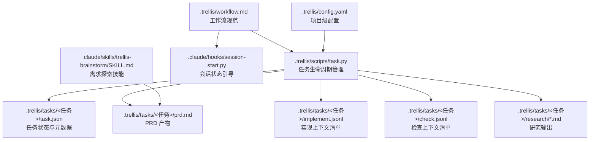
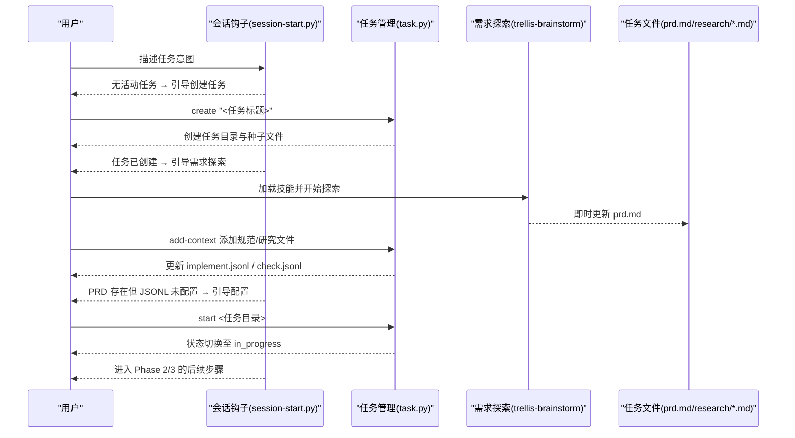
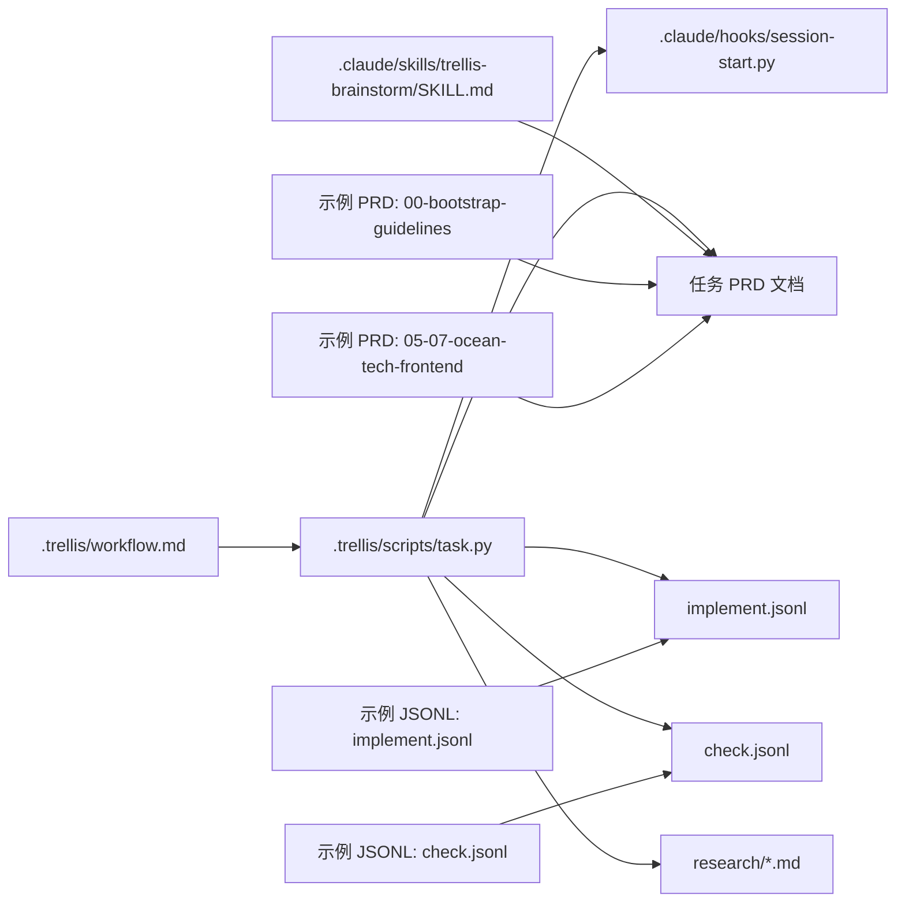

# 阶段一：规划阶段

<cite>
**本文引用的文件**
- [workflow.md](file://.trellis/workflow.md)
- [task.py](file://.trellis/scripts/task.py)
- [session-start.py](file://.claude/hooks/session-start.py)
- [SKILL.md（trellis-brainstorm）](file://.claude/skills/trellis-brainstorm/SKILL.md)
- [prd.md（项目需求）](file://prd.md)
- [prd.md（示例任务：00-bootstrap-guidelines）](file://.trellis/tasks/00-bootstrap-guidelines/prd.md)
- [prd.md（示例任务：05-07-ocean-tech-frontend）](file://.trellis/tasks/05-07-ocean-tech-frontend/prd.md)
- [implement.jsonl（示例任务：05-07-ocean-tech-frontend）](file://.trellis/tasks/05-07-ocean-tech-frontend/implement.jsonl)
- [check.jsonl（示例任务：05-07-ocean-tech-frontend）](file://.trellis/tasks/05-07-ocean-tech-frontend/check.jsonl)
- [.trellis/config.yaml](file://.trellis/config.yaml)
</cite>

## 目录
1. [引言](#引言)
2. [项目结构](#项目结构)
3. [核心组件](#核心组件)
4. [架构总览](#架构总览)
5. [详细组件分析](#详细组件分析)
6. [依赖关系分析](#依赖关系分析)
7. [性能考量](#性能考量)
8. [故障排查指南](#故障排查指南)
9. [结论](#结论)
10. [附录](#附录)

## 引言
本文件面向 VAPT3 项目的规划阶段，系统化梳理从创建任务到激活任务的完整流程，聚焦以下四个关键步骤：
- 1.0 创建任务
- 1.1 需求探索
- 1.2 研究
- 1.3 配置上下文
- 1.4 激活任务

文档将阐明每一步的目的、操作流程、所需工具与输出成果，并重点说明 PRD（产品需求文档）的创建过程、研究输出的文件规范，以及实现/检查 JSONL 文件的配置方法。同时提供命令示例、最佳实践与常见错误处理指引，帮助读者建立从需求探索到任务激活的标准化工作流。

## 项目结构
规划阶段围绕 Trellis 工作流体系展开，核心目录与文件如下：
- 任务目录：.trellis/tasks/<日期-任务名>/（包含 prd.md、implement.jsonl、check.jsonl、task.json、research/ 等）
- 工作流规范：.trellis/workflow.md（定义 Phase 1 的步骤与约束）
- 任务管理脚本：.trellis/scripts/task.py（创建/启动/结束/归档任务，管理状态与钩子）
- 会话钩子：.claude/hooks/session-start.py（根据任务状态与文件存在性输出引导）
- 脑暴技能：.claude/skills/trellis-brainstorm/SKILL.md（需求探索与 PRD 编写）
- 示例任务与 JSONL：.trellis/tasks/*/prd.md、implement.jsonl、check.jsonl
- Trellis 配置：.trellis/config.yaml（会话记录、包与钩子等）

图表来源
- [.trellis/workflow.md](file://.trellis/workflow.md)
- [.trellis/scripts/task.py](file://.trellis/scripts/task.py)
- [.claude/hooks/session-start.py](file://.claude/hooks/session-start.py)
- [.claude/skills/trellis-brainstorm/SKILL.md](file://.claude/skills/trellis-brainstorm/SKILL.md)
- [.trellis/config.yaml](file://.trellis/config.yaml)

章节来源
- [.trellis/workflow.md](file://.trellis/workflow.md)
- [.trellis/scripts/task.py](file://.trellis/scripts/task.py)
- [.claude/hooks/session-start.py](file://.claude/hooks/session-start.py)
- [.claude/skills/trellis-brainstorm/SKILL.md](file://.claude/skills/trellis-brainstorm/SKILL.md)
- [.trellis/config.yaml](file://.trellis/config.yaml)

## 核心组件
- 任务生命周期管理器（task.py）
  - 负责创建任务目录、设置活动任务、切换状态、归档与列表查看、子任务关联、PR 分支与范围设置等。
  - 重要命令：create/start/current/finish/archive/list/list-archive/add-context/validate/list-context/set-branch/set-base-branch/set-scope/add-subtask/remove-subtask。
- 会话状态引导（session-start.py）
  - 根据是否存在活动任务、是否已有 prd.md、implement.jsonl 是否已配置等条件，输出下一步行动提示。
- 需求探索技能（trellis-brainstorm）
  - 引导用户与 AI 逐步澄清需求，产出 PRD；强调“先研究再提问”“选项优于开放式问题”“即时更新 PRD”。
- PRD（产品需求文档）
  - 任务层面的需求与设计说明，是 Phase 2 实现与质量检查的权威依据。
- 研究输出（research/*.md）
  - 外部资料、技术选型、竞品对比、规范引用等，按主题拆分，便于复用与追溯。
- 实现/检查 JSONL（implement.jsonl / check.jsonl）
  - 任务级上下文清单，声明实现与检查阶段需要加载的规范与研究文件，格式为每行一个 JSON 对象，包含 file 与 reason 字段。

章节来源
- [.trellis/scripts/task.py](file://.trellis/scripts/task.py)
- [.claude/hooks/session-start.py](file://.claude/hooks/session-start.py)
- [.claude/skills/trellis-brainstorm/SKILL.md](file://.claude/skills/trellis-brainstorm/SKILL.md)
- [.trellis/tasks/05-07-ocean-tech-frontend/prd.md](file://.trellis/tasks/05-07-ocean-tech-frontend/prd.md)
- [.trellis/tasks/05-07-ocean-tech-frontend/implement.jsonl](file://.trellis/tasks/05-07-ocean-tech-frontend/implement.jsonl)
- [.trellis/tasks/05-07-ocean-tech-frontend/check.jsonl](file://.trellis/tasks/05-07-ocean-tech-frontend/check.jsonl)

## 架构总览
规划阶段的控制流由“工作流规范 + 任务管理 + 会话引导 + 技能驱动”共同构成，形成“任务驱动 + 文件沉淀 + 上下文注入”的闭环。

图表来源
- [.claude/hooks/session-start.py](file://.claude/hooks/session-start.py)
- [.trellis/scripts/task.py](file://.trellis/scripts/task.py)
- [.claude/skills/trellis-brainstorm/SKILL.md](file://.claude/skills/trellis-brainstorm/SKILL.md)

章节来源
- [.claude/hooks/session-start.py](file://.claude/hooks/session-start.py)
- [.trellis/scripts/task.py](file://.trellis/scripts/task.py)
- [.claude/skills/trellis-brainstorm/SKILL.md](file://.claude/skills/trellis-brainstorm/SKILL.md)

## 详细组件分析

### 1.0 创建任务（Phase 1.0）
- 目的
  - 建立任务目录，初始化 prd.md、implement.jsonl、check.jsonl、task.json 等文件骨架，进入“规划”状态。
- 操作流程
  - 使用任务管理脚本创建任务目录，自动设置会话活动任务指针（若具备会话身份）。
  - 创建后 breadcrumb 切换到“规划”状态，引导进入需求探索与 JSONL 配置。
- 所需工具
  - 命令行：python3 ./.trellis/scripts/task.py create "<任务标题>" [--slug <名称>]
  - 会话身份：确保在支持的 AI IDE/会话中运行，或设置会话标识环境变量。
- 输出成果
  - 任务目录（含 prd.md、implement.jsonl、check.jsonl、task.json）
  - 会话活动任务指针指向该任务
- 最佳实践
  - 仅执行 create，不要立即执行 start；start 会在 1.3 JSONL 配置完成后进行。
  - 若已有活动任务，可直接复用 current --source 查看当前任务。
- 常见错误
  - 未设置会话身份导致无法设置活动任务：遵循提示设置 TRELLIS_CONTEXT_ID 或在支持的平台内运行。
  - 重复创建同名任务：使用 --slug 指定人类可读名称，系统自动添加日期前缀。

章节来源
- [.trellis/scripts/task.py](file://.trellis/scripts/task.py)
- [.trellis/workflow.md](file://.trellis/workflow.md)

### 1.1 需求探索（Phase 1.1）
- 目的
  - 通过与用户的多轮对话，澄清需求边界、技术路径与验收标准，产出清晰的 PRD。
- 操作流程
  - 加载 trellis-brainstorm 技能，按“先研究再提问、选项优于开放式问题、即时更新 PRD”的原则推进。
  - 需求变化时，回到该步骤修订 PRD。
- 所需工具
  - 技能：trellis-brainstorm
  - 产物：prd.md（任务级需求与设计）
- 输出成果
  - PRD 文档（结构化、可验证、可追溯）
- 最佳实践
  - 优先研究第三方库/规范/竞品，减少对用户的重复询问。
  - 每次用户回答后立即更新 PRD，保持“记忆固化”。
- 常见错误
  - 直接进入实现而未沉淀 PRD：breadcrumb 会提示“仍处于规划阶段”。

章节来源
- [.claude/skills/trellis-brainstorm/SKILL.md](file://.claude/skills/trellis-brainstorm/SKILL.md)
- [.trellis/workflow.md](file://.trellis/workflow.md)

### 1.2 研究（Phase 1.2）
- 目的
  - 针对复杂技术选型或外部知识，开展有针对性的研究，形成可复用的研究输出。
- 操作流程
  - 在会话中触发研究子任务（或在主会话中直接研究），将研究成果写入 {TASK_DIR}/research/*.md。
  - 研究输出应注明第三方库使用示例、API 参考、版本约束与相关规范路径。
- 所需工具
  - 研究子任务（平台支持时）或主会话直接研究
  - 产物：{TASK_DIR}/research/*.md
- 输出成果
  - 研究文件（按主题拆分，便于后续复用）
- 最佳实践
  - 一个文件一个主题，避免“大杂烩”。
  - 严格区分“研究文件”与“代码文件”，后者不在 JSONL 中预注册。
- 常见错误
  - 将研究结果留在对话中未落盘：会话会被压缩，文件不会丢失。

章节来源
- [.trellis/workflow.md](file://.trellis/workflow.md)

### 1.3 配置上下文（Phase 1.3）
- 目的
  - 为 Phase 2 的实现与检查子智能体提供“规范 + 研究”的上下文清单，确保实现与检查遵循团队约定。
- 操作流程
  - 生成/编辑 implement.jsonl 与 check.jsonl，每行一个对象：{"file": "<相对仓库路径>", "reason": "<原因>"}。
  - implement.jsonl：实现子智能体需要查阅的规范与研究文件。
  - check.jsonl：检查子智能体需要遵循的质量规范与研究文件。
  - 仅包含 .trellis/spec 下的规范文件与 {TASK_DIR}/research/*.md，不包含待修改的代码文件。
- 所需工具
  - 命令行：python3 ./.trellis/scripts/task.py add-context <任务目录> implement|check <路径> "<原因>"
  - 或直接编辑 {TASK_DIR}/implement.jsonl 与 {TASK_DIR}/check.jsonl
- 输出成果
  - 已配置的 implement.jsonl 与 check.jsonl
- 最佳实践
  - 使用 get_context.py --mode packages 列出可用规范包与层级，按领域挑选。
  - 删除种子行（_example）后，确保至少有一条真实条目。
- 常见错误
  - 仅保留种子行：会被视为未配置，breadcrumb 会持续提示配置。
  - 错误地将代码文件加入 JSONL：子智能体不会预读代码，应通过实现流程读取。

章节来源
- [.trellis/workflow.md](file://.trellis/workflow.md)
- [.trellis/scripts/task.py](file://.trellis/scripts/task.py)

### 1.4 激活任务（Phase 1.4）
- 目的
  - 将任务状态从“规划”切换到“进行中”，进入 Phase 2/3 的后续步骤。
- 操作流程
  - 运行 python3 ./.trellis/scripts/task.py start <任务目录>，自动：
    - 设置活动任务（若具备会话身份）
    - 将 task.json 中 status 从 planning 更新为 in_progress
    - 触发 after_start 钩子（如有配置）
- 所需工具
  - 命令行：python3 ./.trellis/scripts/task.py start <任务目录>
- 输出成果
  - 任务状态：in_progress
  - breadcrumb 切换至“进行中”，引导进入实现与检查
- 最佳实践
  - 确保 PRD 已完成、研究输出已沉淀、JSONL 已配置后再执行 start。
- 常见错误
  - 无会话身份：提示设置 TRELLIS_CONTEXT_ID 或在支持的平台内运行。
  - 未配置 JSONL：breadcrumb 会提示先完成 1.3。

章节来源
- [.trellis/scripts/task.py](file://.trellis/scripts/task.py)
- [.claude/hooks/session-start.py](file://.claude/hooks/session-start.py)
- [.trellis/workflow.md](file://.trellis/workflow.md)

## 依赖关系分析
- 任务生命周期与工作流规范强耦合：workflow.md 定义步骤与强制性标记，task.py 提供具体命令与状态机。
- 会话钩子与任务状态联动：session-start.py 根据任务是否存在、PRD 是否存在、JSONL 是否配置，输出不同的引导语。
- 技能与文件产物协同：trellis-brainstorm 产出 PRD，随后通过 add-context 将规范与研究文件注入 JSONL。
- 示例任务与模板：00-bootstrap-guidelines 与 05-07-ocean-tech-frontend 提供 PRD 与 JSONL 的范式，便于复用与校验。

图表来源
- [.trellis/workflow.md](file://.trellis/workflow.md)
- [.trellis/scripts/task.py](file://.trellis/scripts/task.py)
- [.claude/hooks/session-start.py](file://.claude/hooks/session-start.py)
- [.claude/skills/trellis-brainstorm/SKILL.md](file://.claude/skills/trellis-brainstorm/SKILL.md)
- [.trellis/tasks/00-bootstrap-guidelines/prd.md](file://.trellis/tasks/00-bootstrap-guidelines/prd.md)
- [.trellis/tasks/05-07-ocean-tech-frontend/prd.md](file://.trellis/tasks/05-07-ocean-tech-frontend/prd.md)
- [.trellis/tasks/05-07-ocean-tech-frontend/implement.jsonl](file://.trellis/tasks/05-07-ocean-tech-frontend/implement.jsonl)
- [.trellis/tasks/05-07-ocean-tech-frontend/check.jsonl](file://.trellis/tasks/05-07-ocean-tech-frontend/check.jsonl)

章节来源
- [.trellis/workflow.md](file://.trellis/workflow.md)
- [.trellis/scripts/task.py](file://.trellis/scripts/task.py)
- [.claude/hooks/session-start.py](file://.claude/hooks/session-start.py)
- [.claude/skills/trellis-brainstorm/SKILL.md](file://.claude/skills/trellis-brainstorm/SKILL.md)

## 性能考量
- 任务数量与状态管理
  - 使用 list 与 list-archive 快速掌握全局任务状态，避免在大量任务中迷失。
- JSONL 条目数量
  - 仅包含必要规范与研究文件，避免过多条目导致上下文膨胀。
- 会话稳定性
  - 保持会话身份稳定，减少因会话失效导致的状态回退与重复引导。

## 故障排查指南
- 无法设置活动任务
  - 现象：task.py start 报错，提示需要会话身份。
  - 处理：在支持的 AI IDE/会话中运行，或设置环境变量 TRELLIS_CONTEXT_ID 后重试。
- PRD 未生成或为空
  - 现象：breadcrumb 提示仍在规划阶段。
  - 处理：加载 trellis-brainstorm 完成需求探索并保存 prd.md。
- JSONL 未配置或仅剩种子行
  - 现象：breadcrumb 持续提示配置 implement.jsonl 与 check.jsonl。
  - 处理：使用 add-context 添加规范与研究文件，删除种子行。
- 任务状态未切换
  - 现象：执行 start 后 breadcrumb 仍未进入“进行中”。
  - 处理：确认 task.json 中 status 已更新为 in_progress，检查钩子是否正常执行。

章节来源
- [.trellis/scripts/task.py](file://.trellis/scripts/task.py)
- [.claude/hooks/session-start.py](file://.claude/hooks/session-start.py)
- [.trellis/workflow.md](file://.trellis/workflow.md)

## 结论
规划阶段通过“创建任务 → 需求探索 → 研究 → 配置上下文 → 激活任务”的标准化流程，将模糊的用户意图转化为可执行、可验证的 PRD 与上下文清单。借助 trellis-brainstorm 技能与 JSONL 上下文注入，实现“先沉淀、后实现”的高质量交付路径。遵循本文的命令示例、最佳实践与故障排查建议，可显著提升团队在 VAPT3 项目中的规划效率与一致性。

## 附录

### A. 命令速查
- 创建任务：python3 ./.trellis/scripts/task.py create "<任务标题>" [--slug <名称>]
- 查看当前任务：python3 ./.trellis/scripts/task.py current [--source]
- 激活任务：python3 ./.trellis/scripts/task.py start <任务目录>
- 结束任务：python3 ./.trellis/scripts/task.py finish
- 归档任务：python3 ./.trellis/scripts/task.py archive <任务目录>
- 列出任务：python3 ./.trellis/scripts/task.py list [--mine] [--status <状态>]
- 列出归档：python3 ./.trellis/scripts/task.py list-archive [YYYY-MM]
- 添加上下文：python3 ./.trellis/scripts/task.py add-context <任务目录> implement|check <路径> "<原因>"
- 校验上下文：python3 ./.trellis/scripts/task.py validate <任务目录>
- 列出上下文：python3 ./.trellis/scripts/task.py list-context <任务目录>
- 设置分支/基线/范围：set-branch/set-base-branch/set-scope
- 子任务关联：add-subtask/remove-subtask

章节来源
- [.trellis/scripts/task.py](file://.trellis/scripts/task.py)

### B. PRD 创建要点
- 结构化：明确目标、需求、验收、技术路线、风险与范围。
- 可验证：验收标准可量化，便于检查阶段核对。
- 可追溯：引用研究文件与规范文件，避免口头约定。
- 示例参考：00-bootstrap-guidelines 与 05-07-ocean-tech-frontend 的 PRD 模板。

章节来源
- [.trellis/tasks/00-bootstrap-guidelines/prd.md](file://.trellis/tasks/00-bootstrap-guidelines/prd.md)
- [.trellis/tasks/05-07-ocean-tech-frontend/prd.md](file://.trellis/tasks/05-07-ocean-tech-frontend/prd.md)
- [prd.md（项目需求）](file://prd.md)

### C. 研究输出文件规范
- 命名：按主题命名，如 research/auth-library-comparison.md。
- 内容：第三方库使用示例、API 参考、版本约束、相关规范路径。
- 存放：{TASK_DIR}/research/*.md，PRD 仅链接引用，不直接粘贴全文。

章节来源
- [.trellis/workflow.md](file://.trellis/workflow.md)

### D. 实现/检查 JSONL 配置方法
- 格式：每行一个 JSON 对象，包含 file 与 reason。
- 内容：
  - implement.jsonl：实现子智能体需要查阅的规范与研究文件。
  - check.jsonl：检查子智能体需要遵循的质量规范与研究文件。
- 路径：仅包含 .trellis/spec 下的规范文件与 {TASK_DIR}/research/*.md。
- 示例：05-07-ocean-tech-frontend 的 implement.jsonl 与 check.jsonl。

章节来源
- [.trellis/tasks/05-07-ocean-tech-frontend/implement.jsonl](file://.trellis/tasks/05-07-ocean-tech-frontend/implement.jsonl)
- [.trellis/tasks/05-07-ocean-tech-frontend/check.jsonl](file://.trellis/tasks/05-07-ocean-tech-frontend/check.jsonl)
- [.trellis/workflow.md](file://.trellis/workflow.md)