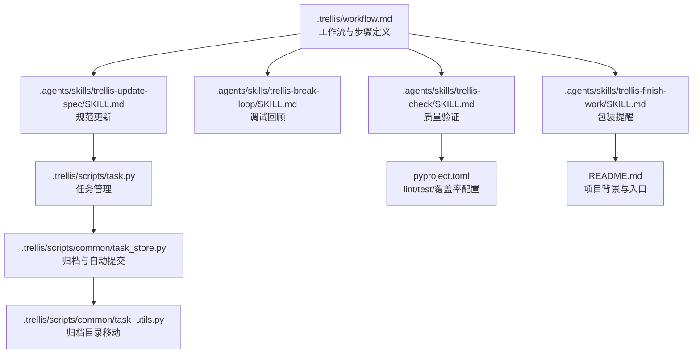
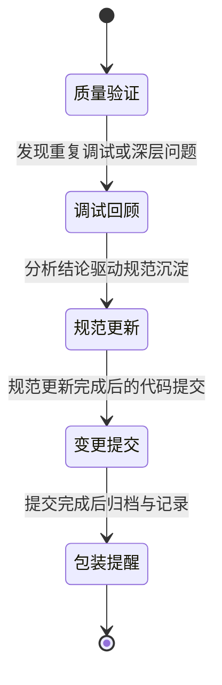
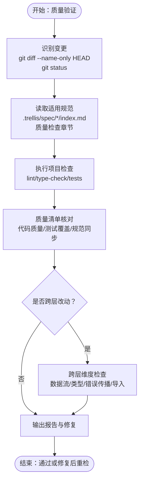
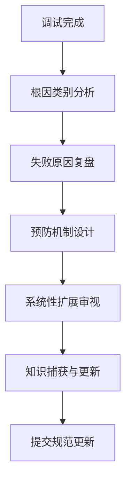
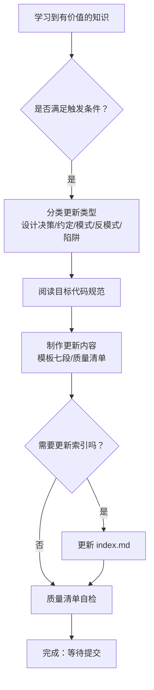
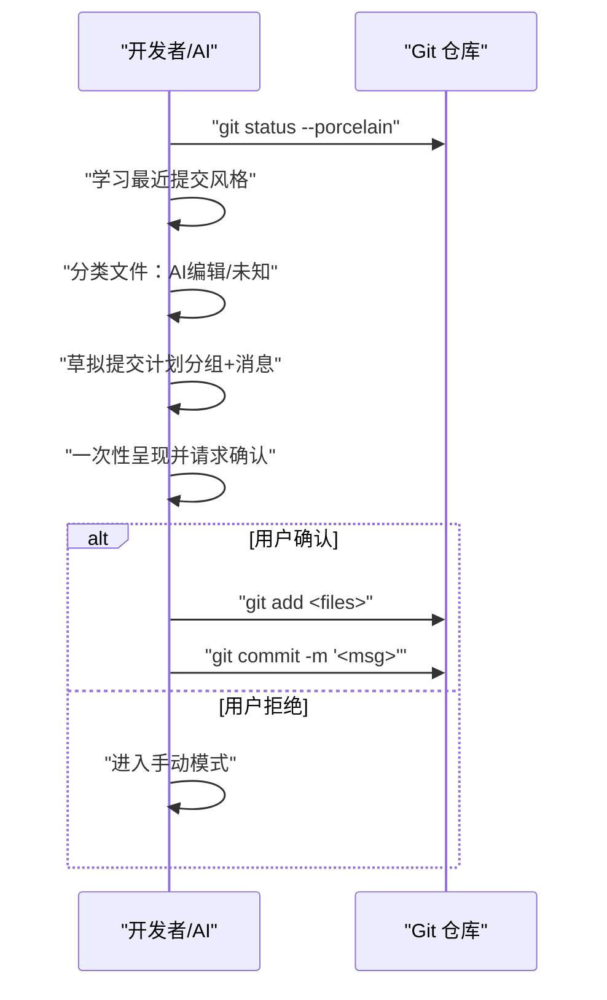
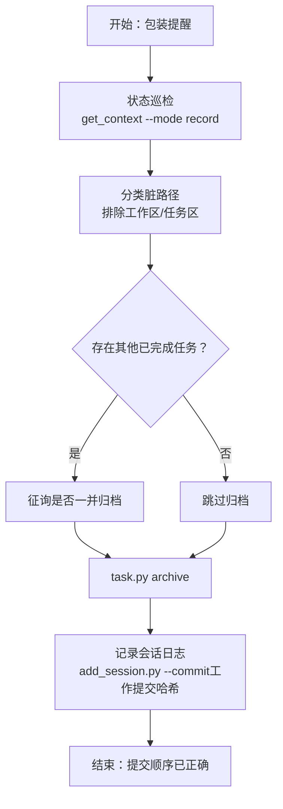
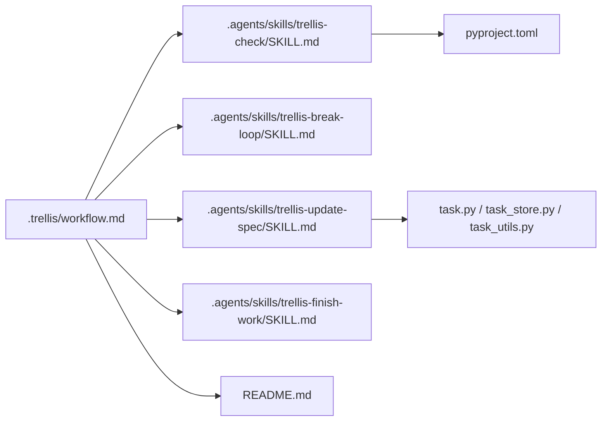

# 阶段三：收尾阶段

<cite>
**本文引用的文件**
- [.trellis/workflow.md](file://.trellis/workflow.md)
- [.agents/skills/trellis-finish-work/SKILL.md](file://.agents/skills/trellis-finish-work/SKILL.md)
- [.agents/skills/trellis-check/SKILL.md](file://.agents/skills/trellis-check/SKILL.md)
- [.agents/skills/trellis-break-loop/SKILL.md](file://.agents/skills/trellis-break-loop/SKILL.md)
- [.agents/skills/trellis-update-spec/SKILL.md](file://.agents/skills/trellis-update-spec/SKILL.md)
- [.trellis/scripts/task.py](file://.trellis/scripts/task.py)
- [.trellis/scripts/common/task_store.py](file://.trellis/scripts/common/task_store.py)
- [.trellis/scripts/common/task_utils.py](file://.trellis/scripts/common/task_utils.py)
- [pyproject.toml](file://pyproject.toml)
- [README.md](file://README.md)
</cite>

## 目录
1. [引言](#引言)
2. [项目结构](#项目结构)
3. [核心组件](#核心组件)
4. [架构总览](#架构总览)
5. [详细组件分析](#详细组件分析)
6. [依赖关系分析](#依赖关系分析)
7. [性能考量](#性能考量)
8. [故障排查指南](#故障排查指南)
9. [结论](#结论)
10. [附录](#附录)

## 引言
本文件面向 VAPT3 项目的“收尾阶段”（Phase 3），系统梳理并实操化以下五步流程：
- 3.1 质量验证
- 3.2 调试回顾
- 3.3 规范更新
- 3.4 变更提交
- 3.5 包装提醒

围绕每个步骤，明确验收标准、执行方法、最佳实践与风险控制点，确保从代码提交到任务归档的完整闭环。

## 项目结构
VAPT3 使用 Trellis 工作流驱动开发与收尾，关键路径如下：
- 工作流与步骤定义：.trellis/workflow.md
- 收尾阶段技能（子代理）：.agents/skills/trellis-*/SKILL.md
- 任务生命周期与归档：.trellis/scripts/task.py、.trellis/scripts/common/task_store.py、.trellis/scripts/common/task_utils.py
- 项目质量工具链（lint/test/覆盖率）：pyproject.toml
- 项目总体说明与背景：README.md

图表来源
- [.trellis/workflow.md:518-602](file://.trellis/workflow.md#L518-L602)
- [.agents/skills/trellis-check/SKILL.md:1-93](file://.agents/skills/trellis-check/SKILL.md#L1-L93)
- [.agents/skills/trellis-break-loop/SKILL.md:1-131](file://.agents/skills/trellis-break-loop/SKILL.md#L1-L131)
- [.agents/skills/trellis-update-spec/SKILL.md:1-357](file://.agents/skills/trellis-update-spec/SKILL.md#L1-L357)
- [.agents/skills/trellis-finish-work/SKILL.md:1-72](file://.agents/skills/trellis-finish-work/SKILL.md#L1-L72)
- [.trellis/scripts/task.py:1-482](file://.trellis/scripts/task.py#L1-L482)
- [.trellis/scripts/common/task_store.py:306-396](file://.trellis/scripts/common/task_store.py#L306-L396)
- [.trellis/scripts/common/task_utils.py:146-172](file://.trellis/scripts/common/task_utils.py#L146-L172)
- [pyproject.toml:145-169](file://pyproject.toml#L145-L169)
- [README.md:13-298](file://README.md#L13-L298)

章节来源
- [.trellis/workflow.md:518-602](file://.trellis/workflow.md#L518-L602)
- [README.md:13-298](file://README.md#L13-L298)

## 核心组件
- 质量验证（trellis-check）：覆盖规范符合性、静态检查、类型检查、单元测试、跨层一致性与测试覆盖率。
- 调试回顾（trellis-break-loop）：深度分析根因类别、失败原因、预防机制、系统性扩展与知识固化。
- 规范更新（trellis-update-spec）：将可执行契约与编码约定沉淀至 .trellis/spec/，包含触发条件、结构模板与质量清单。
- 变更提交（Phase 3.4）：AI 驱动的批量提交，遵循分类、消息格式与文件分组策略，禁止 amend 与推送。
- 包装提醒（trellis-finish-work）：状态巡检、归档任务、记录会话日志，确保提交顺序正确（工作提交 → 归档提交 → 日志提交）。

章节来源
- [.agents/skills/trellis-check/SKILL.md:1-93](file://.agents/skills/trellis-check/SKILL.md#L1-L93)
- [.agents/skills/trellis-break-loop/SKILL.md:1-131](file://.agents/skills/trellis-break-loop/SKILL.md#L1-L131)
- [.agents/skills/trellis-update-spec/SKILL.md:1-357](file://.agents/skills/trellis-update-spec/SKILL.md#L1-L357)
- [.trellis/workflow.md:549-601](file://.trellis/workflow.md#L549-L601)
- [.agents/skills/trellis-finish-work/SKILL.md:1-72](file://.agents/skills/trellis-finish-work/SKILL.md#L1-L72)

## 架构总览
收尾阶段在 Trellis 工作流中处于 Phase 3，其核心状态与步骤如下：

图表来源
- [.trellis/workflow.md:518-602](file://.trellis/workflow.md#L518-L602)

章节来源
- [.trellis/workflow.md:518-602](file://.trellis/workflow.md#L518-L602)

## 详细组件分析

### 3.1 质量验证（trellis-check）
- 目标：确保代码通过规范符合性、静态/类型检查、测试与跨层一致性审查；在长会话中防止上下文漂移。
- 关键流程：
  - 识别变更：对比工作区与暂存区，定位改动文件。
  - 读取适用规范：按包/层读取 .trellis/spec/*/index.md 的“质量检查”部分。
  - 执行项目检查：运行 ruff/lint、类型检查（如适用）、pytest 与覆盖率。
  - 质量清单：逐项核对代码质量、测试覆盖、规范同步。
  - 跨层维度：若改动涉及三层及以上，核查数据流方向、类型传递、错误传播与导入/依赖一致性。
  - 报告与修复：输出违规项并现场修复，必要时重新执行检查。

图表来源
- [.agents/skills/trellis-check/SKILL.md:12-93](file://.agents/skills/trellis-check/SKILL.md#L12-L93)

章节来源
- [.agents/skills/trellis-check/SKILL.md:1-93](file://.agents/skills/trellis-check/SKILL.md#L1-L93)
- [pyproject.toml:145-169](file://pyproject.toml#L145-L169)

### 3.2 调试回顾（trellis-break-loop）
- 目标：打破“修复—遗忘—重复”的循环，系统化沉淀知识，避免同类问题再次发生。
- 分析框架：
  - 根因类别：缺失规范、跨层契约、变更传播失败、测试覆盖缺口、隐含假设。
  - 失败原因：表面修复、范围不全、工具局限、心智模型偏差。
  - 预防机制：文档化、架构约束、编译期保障、运行期监控、测试覆盖、代码评审。
  - 系统性扩展：相似问题、设计缺陷、流程改进、知识缺口。
  - 知识捕获：更新 .trellis/spec/guides/ 思维清单、相关 .trellis/spec/ 文档、创建问题与功能单、更新检查指南。
- 行动要求：分析完成后立即更新规范并提交，确保价值落地。

图表来源
- [.agents/skills/trellis-break-loop/SKILL.md:12-131](file://.agents/skills/trellis-break-loop/SKILL.md#L12-L131)

章节来源
- [.agents/skills/trellis-break-loop/SKILL.md:1-131](file://.agents/skills/trellis-break-loop/SKILL.md#L1-L131)

### 3.3 规范更新（trellis-update-spec）
- 目标：将可执行契约与编码约定固化到 .trellis/spec/，形成“活文档”，降低未来实现成本。
- 触发条件：实现新功能、做出设计决策、修复缺陷、发现模式、遇到陷阱、建立约定、产生思维触发。
- 结构与模板：
  - 代码规范 vs 思维清单：前者具体可执行，后者提供思考清单。
  - 模板七段：范围/触发、签名、契约、验证与错误矩阵、好/基础/坏案例、所需测试、错误与正确对比。
  - 更新流程：识别学习点、分类更新类型、阅读目标规范、制作更新、必要时更新索引。
- 质量清单：内容具体可执行、包含示例、解释原因、展示契约、提供代码、保持简洁、避免重复、便于新人理解。

图表来源
- [.agents/skills/trellis-update-spec/SKILL.md:44-357](file://.agents/skills/trellis-update-spec/SKILL.md#L44-L357)

章节来源
- [.agents/skills/trellis-update-spec/SKILL.md:1-357](file://.agents/skills/trellis-update-spec/SKILL.md#L1-L357)

### 3.4 变更提交（Phase 3.4）
- 目标：AI 驱动的批量提交，确保工作提交优先，随后是归档与日志提交，严禁 amend 与推送。
- 步骤：
  - 检视脏状态：git status --porcelain，快照所有改动路径。
  - 学习提交风格：git log --oneline -5，观察前缀（feat:/fix:/chore:/docs: 等）、语言与长度风格。
  - 分类文件：区分“本次会话 AI 编辑”与“未知改动”（用户手动编辑、遗留 WIP、无关工作）。
  - 草拟计划：按逻辑单元分组（1 单元 1 提交，非 1 文件 1 提交），列出每批消息与文件列表；未知文件单独列示。
  - 一次性呈现并请求确认：明确“ok/行”执行，“我自己来/manual”中止。
  - 执行提交：git add + git commit -m，按顺序执行，不 amend，不推送。
- 规则：
  - 严禁 amend；三阶段提交顺序固定。
  - 若用户拒绝分组，进入手动模式，跳过后续自动提交步骤。

图表来源
- [.trellis/workflow.md:553-591](file://.trellis/workflow.md#L553-L591)

章节来源
- [.trellis/workflow.md:549-598](file://.trellis/workflow.md#L549-L598)

### 3.5 包装提醒（trellis-finish-work）
- 目标：在完成代码提交后，进行状态巡检、归档已完成任务、记录会话日志，确保提交顺序正确。
- 步骤：
  - 状态巡检：使用 get_context --mode record 获取当前活动任务、Git 状态、最近提交哈希。
  - 分类脏路径：排除 .trellis/workspace/ 与 .trellis/tasks/；对其他路径按任务范围与记忆判断归属。
  - 归档任务：task.py archive <task-name>，自动提交 chore(task): archive ...。
  - 记录会话：add_session.py --title --commit（使用 3.4 的工作提交哈希，不含归档与日志提交）。
- 顺序保证：工作提交 → 归档提交 → 日志提交。

图表来源
- [.agents/skills/trellis-finish-work/SKILL.md:10-72](file://.agents/skills/trellis-finish-work/SKILL.md#L10-L72)
- [.trellis/scripts/task.py:425-429](file://.trellis/scripts/task.py#L425-L429)
- [.trellis/scripts/common/task_store.py:385-396](file://.trellis/scripts/common/task_store.py#L385-L396)

章节来源
- [.agents/skills/trellis-finish-work/SKILL.md:1-72](file://.agents/skills/trellis-finish-work/SKILL.md#L1-L72)
- [.trellis/scripts/task.py:1-482](file://.trellis/scripts/task.py#L1-L482)
- [.trellis/scripts/common/task_store.py:306-396](file://.trellis/scripts/common/task_store.py#L306-L396)
- [.trellis/scripts/common/task_utils.py:146-172](file://.trellis/scripts/common/task_utils.py#L146-L172)

## 依赖关系分析
- 工作流与技能：.trellis/workflow.md 明确 Phase 3 的五步与状态约束，各技能提供具体执行步骤与检查清单。
- 任务生命周期：task.py 提供任务创建/启动/完成/归档等命令；task_store.py 实现归档与自动提交；task_utils.py 负责目录移动。
- 质量工具链：pyproject.toml 中配置 ruff、pytest、覆盖率等，为 trellis-check 的项目检查提供支撑。
- 项目背景：README.md 提供系统概览与入口，辅助理解收尾阶段在整体中的位置。

图表来源
- [.trellis/workflow.md:518-602](file://.trellis/workflow.md#L518-L602)
- [.agents/skills/trellis-check/SKILL.md:1-93](file://.agents/skills/trellis-check/SKILL.md#L1-L93)
- [.agents/skills/trellis-break-loop/SKILL.md:1-131](file://.agents/skills/trellis-break-loop/SKILL.md#L1-L131)
- [.agents/skills/trellis-update-spec/SKILL.md:1-357](file://.agents/skills/trellis-update-spec/SKILL.md#L1-L357)
- [.agents/skills/trellis-finish-work/SKILL.md:1-72](file://.agents/skills/trellis-finish-work/SKILL.md#L1-L72)
- [.trellis/scripts/task.py:1-482](file://.trellis/scripts/task.py#L1-L482)
- [.trellis/scripts/common/task_store.py:306-396](file://.trellis/scripts/common/task_store.py#L306-L396)
- [.trellis/scripts/common/task_utils.py:146-172](file://.trellis/scripts/common/task_utils.py#L146-L172)
- [pyproject.toml:145-169](file://pyproject.toml#L145-L169)
- [README.md:13-298](file://README.md#L13-L298)

章节来源
- [.trellis/workflow.md:518-602](file://.trellis/workflow.md#L518-L602)
- [.trellis/scripts/task.py:1-482](file://.trellis/scripts/task.py#L1-L482)
- [pyproject.toml:145-169](file://pyproject.toml#L145-L169)
- [README.md:13-298](file://README.md#L13-L298)

## 性能考量
- 质量验证阶段：
  - 优先选择增量检查，避免全量扫描；针对改动文件运行 lint 与测试，减少等待时间。
  - 跨层检查仅在必要时开启，降低复杂度。
- 规范更新阶段：
  - 使用模板与清单快速产出，避免冗长讨论；更新后立即提交，减少上下文漂移。
- 提交阶段：
  - 合理分组提交，避免单次提交过大导致冲突与审查困难。
  - 严格遵守“工作提交 → 归档提交 → 日志提交”的顺序，确保历史清晰可追溯。

## 故障排查指南
- 提交被拒绝（dirty working tree）：
  - 现象：/trellis:finish-work 拒绝执行。
  - 原因：仍有未提交的工作变更。
  - 处理：返回 Phase 3.4，完成批量提交后再执行包装提醒。
- 未知文件混入提交计划：
  - 现象：用户拒绝分组或要求手动处理。
  - 原因：未区分“本次会话 AI 编辑”与“未知改动”。
  - 处理：重新分类，仅包含本次会话编辑的文件；未知文件单独标注。
- 归档失败或未提交：
  - 现象：归档后无 chore(task): archive 提交。
  - 原因：任务目录不存在或无变更。
  - 处理：确认任务名称与状态；确保任务目录存在且包含变更；必要时禁用 --no-commit 并手动触发。
- 日志记录哈希错误：
  - 现象：add_session.py --commit 使用了错误的提交哈希。
  - 原因：混用了归档提交或日志提交哈希。
  - 处理：仅使用 Phase 3.4 工作提交的哈希，不包含归档与日志提交。

章节来源
- [.agents/skills/trellis-finish-work/SKILL.md:24-72](file://.agents/skills/trellis-finish-work/SKILL.md#L24-L72)
- [.trellis/scripts/common/task_store.py:385-396](file://.trellis/scripts/common/task_store.py#L385-L396)

## 结论
收尾阶段通过“质量验证—调试回顾—规范更新—变更提交—包装提醒”的闭环，确保：
- 代码质量与规范同步；
- 问题根因与预防机制固化；
- 提交有序、可追溯、可审查；
- 任务归档与会话记录完整，形成组织知识资产。

## 附录
- 提交分类与消息格式建议：
  - feat: 新功能
  - fix: 修复缺陷
  - docs: 文档更新
  - chore: 构建、工具、配置类改动
  - style: 格式调整（不影响逻辑）
  - refactor: 重构（不影响行为）
  - test: 测试相关
  - perf: 性能优化
- 文件分组策略：
  - 1 个逻辑单元 1 个提交，避免“1 文件 1 提交”导致提交过多；
  - 同一改动域内的文件尽量放在同一提交中；
  - 严格区分“本次会话 AI 编辑”与“未知改动”。