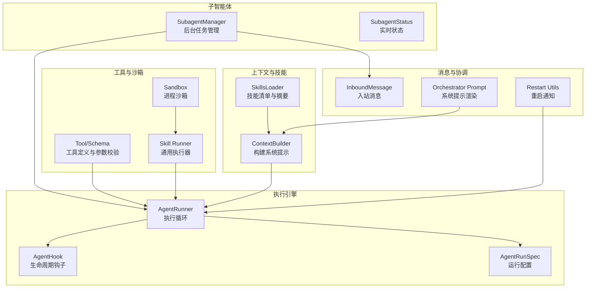
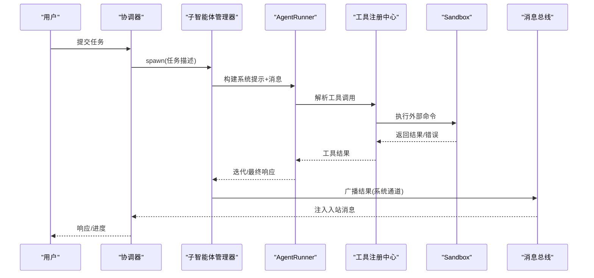
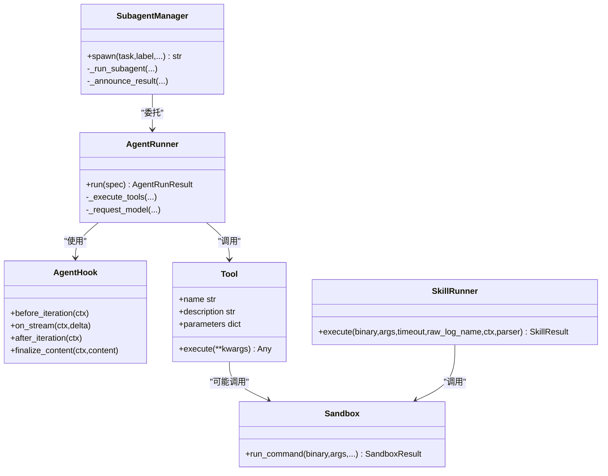
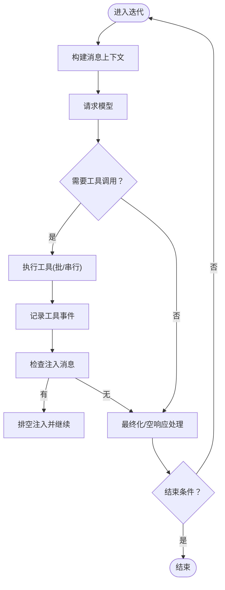
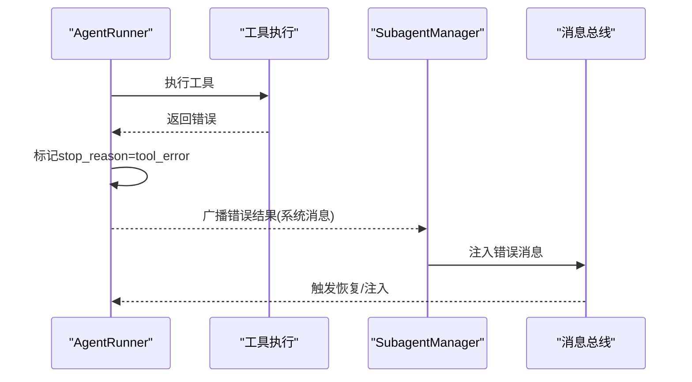
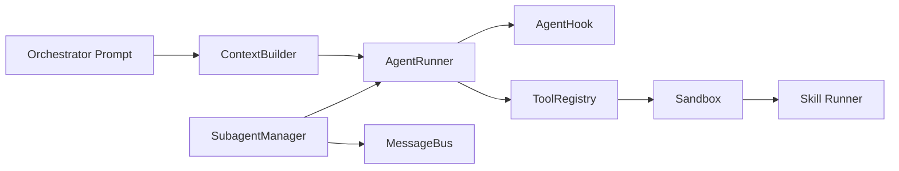

# 阶段二：执行阶段

<cite>
**本文引用的文件**
- [secbot/agent/runner.py](file://secbot/agent/runner.py)
- [secbot/agent/hook.py](file://secbot/agent/hook.py)
- [secbot/agent/context.py](file://secbot/agent/context.py)
- [secbot/agent/skills.py](file://secbot/agent/skills.py)
- [secbot/agent/subagent.py](file://secbot/agent/subagent.py)
- [secbot/agent/tools/base.py](file://secbot/agent/tools/base.py)
- [secbot/bus/events.py](file://secbot/bus/events.py)
- [secbot/skills/_shared/runner.py](file://secbot/skills/_shared/runner.py)
- [secbot/skills/_shared/sandbox.py](file://secbot/skills/_shared/sandbox.py)
- [secbot/skills/types.py](file://secbot/skills/types.py)
- [secbot/skills/fscan-asset-discovery/handler.py](file://secbot/skills/fscan-asset-discovery/handler.py)
- [secbot/skills/nmap-port-scan/handler.py](file://secbot/skills/nmap-port-scan/handler.py)
- [secbot/skills/nuclei-template-scan/handler.py](file://secbot/skills/nuclei-template-scan/handler.py)
- [secbot/agents/orchestrator.py](file://secbot/agents/orchestrator.py)
- [secbot/utils/restart.py](file://secbot/utils/restart.py)
</cite>

## 目录
1. [引言](#引言)
2. [项目结构](#项目结构)
3. [核心组件](#核心组件)
4. [架构总览](#架构总览)
5. [详细组件分析](#详细组件分析)
6. [依赖分析](#依赖分析)
7. [性能考虑](#性能考虑)
8. [故障排查指南](#故障排查指南)
9. [结论](#结论)
10. [附录](#附录)

## 引言
本阶段文档聚焦于 VAPT3 的“执行阶段”，系统性阐述以下三部分：
- 2.1 实现：如何通过子智能体与工具链完成扫描与取证任务
- 2.2 质量检查：如何在执行过程中进行状态监控、结果校验与异常恢复
- 2.3 回滚机制：如何在失败时进行安全回退与通知

文档将结合代码级实现，给出最佳实践、命令使用指南、错误处理策略与性能优化建议，并提供从代码编写到质量验证的完整执行流程。

## 项目结构
执行阶段相关的核心模块分布如下：
- 执行引擎与钩子：AgentRunner、AgentHook、AgentRunSpec
- 上下文与技能加载：ContextBuilder、SkillsLoader
- 子智能体管理：SubagentManager、SubagentStatus
- 工具基类与注册：Tool、Schema、ToolRegistry
- 技能沙箱与通用执行器：sandbox、runner
- 典型技能示例：资产发现、端口扫描、模板扫描
- 协调器提示渲染：orchestrator prompt
- 消息总线事件模型：InboundMessage/OutboundMessage
- 重启通知工具：restart

**图示来源**
- [secbot/agent/runner.py](file://secbot/agent/runner.py)
- [secbot/agent/hook.py](file://secbot/agent/hook.py)
- [secbot/agent/context.py](file://secbot/agent/context.py)
- [secbot/agent/skills.py](file://secbot/agent/skills.py)
- [secbot/agent/subagent.py](file://secbot/agent/subagent.py)
- [secbot/agent/tools/base.py](file://secbot/agent/tools/base.py)
- [secbot/bus/events.py](file://secbot/bus/events.py)
- [secbot/skills/_shared/runner.py](file://secbot/skills/_shared/runner.py)
- [secbot/skills/_shared/sandbox.py](file://secbot/skills/_shared/sandbox.py)
- [secbot/agents/orchestrator.py](file://secbot/agents/orchestrator.py)
- [secbot/utils/restart.py](file://secbot/utils/restart.py)

**章节来源**
- [secbot/agent/runner.py](file://secbot/agent/runner.py)
- [secbot/agent/context.py](file://secbot/agent/context.py)
- [secbot/agent/skills.py](file://secbot/agent/skills.py)
- [secbot/agent/subagent.py](file://secbot/agent/subagent.py)
- [secbot/agent/tools/base.py](file://secbot/agent/tools/base.py)
- [secbot/bus/events.py](file://secbot/bus/events.py)
- [secbot/skills/_shared/runner.py](file://secbot/skills/_shared/runner.py)
- [secbot/skills/_shared/sandbox.py](file://secbot/skills/_shared/sandbox.py)
- [secbot/agents/orchestrator.py](file://secbot/agents/orchestrator.py)
- [secbot/utils/restart.py](file://secbot/utils/restart.py)

## 核心组件
- AgentRunner：统一的工具调用智能体执行循环，负责消息上下文治理、工具批处理、流式输出、注入消息、错误恢复与最终化
- AgentHook：生命周期钩子接口，支持流式回调、迭代前后钩子、工具执行前钩子、内容最终化
- SubagentManager：后台子智能体任务管理器，封装工具集、运行配置、状态上报、结果广播
- SkillsLoader：技能清单与摘要生成，按需加载技能内容，过滤不可用技能
- ContextBuilder：构建系统提示（身份、引导文件、记忆、技能、近期历史），并生成消息列表
- Sandbox：外部命令执行沙箱，白名单控制、参数字符过滤、超时与取消、日志捕获
- Skill Runner：技能执行器，封装超时、取消、解析器、退出码处理
- 典型技能：资产发现、端口扫描、模板扫描，均遵循统一的输入校验与输出结构
- 协调器提示：锁定角色、硬规则、可用专家代理表、工作风格，确保执行顺序与风险控制

**章节来源**
- [secbot/agent/runner.py](file://secbot/agent/runner.py)
- [secbot/agent/hook.py](file://secbot/agent/hook.py)
- [secbot/agent/subagent.py](file://secbot/agent/subagent.py)
- [secbot/agent/skills.py](file://secbot/agent/skills.py)
- [secbot/agent/context.py](file://secbot/agent/context.py)
- [secbot/skills/_shared/sandbox.py](file://secbot/skills/_shared/sandbox.py)
- [secbot/skills/_shared/runner.py](file://secbot/skills/_shared/runner.py)
- [secbot/skills/fscan-asset-discovery/handler.py](file://secbot/skills/fscan-asset-discovery/handler.py)
- [secbot/skills/nmap-port-scan/handler.py](file://secbot/skills/nmap-port-scan/handler.py)
- [secbot/skills/nuclei-template-scan/handler.py](file://secbot/skills/nuclei-template-scan/handler.py)
- [secbot/agents/orchestrator.py](file://secbot/agents/orchestrator.py)

## 架构总览
执行阶段以“协调器-子智能体-工具-沙箱”为主线，配合上下文构建与消息总线，形成闭环的执行、监控与反馈体系。

**图示来源**
- [secbot/agents/orchestrator.py](file://secbot/agents/orchestrator.py)
- [secbot/agent/subagent.py](file://secbot/agent/subagent.py)
- [secbot/agent/runner.py](file://secbot/agent/runner.py)
- [secbot/agent/tools/base.py](file://secbot/agent/tools/base.py)
- [secbot/skills/_shared/sandbox.py](file://secbot/skills/_shared/sandbox.py)
- [secbot/bus/events.py](file://secbot/bus/events.py)

## 详细组件分析

### 2.1 实现：子智能体与工具链
- 子智能体启动与状态管理
  - SubagentManager.spawn 创建任务、初始化状态、异步运行
  - _run_subagent 构建工具集（文件读写、搜索、可选执行与网络工具）、系统提示、AgentRunSpec
  - _announce_result 将结果作为系统消息注入主会话，触发主智能体继续
- 执行循环与工具调用
  - AgentRunner.run 维护消息上下文、工具批处理、流式输出、注入消息、错误恢复
  - _execute_tools 支持并发/串行工具执行，记录工具事件，处理致命错误
- 沙箱与技能执行
  - Sandbox.run_command 白名单二进制、参数字符过滤、超时/取消、日志捕获
  - Skill Runner.execute 封装超时/取消/解析器/退出码，返回标准化 SkillResult
- 典型技能
  - 资产发现：fscan-asset-discovery，目标校验，解析存活主机
  - 端口扫描：nmap-port-scan，目标与端口校验，解析服务信息
  - 模板扫描：nuclei-template-scan，目标/严重级别/标签校验，解析 JSONL 输出并生成 CMDB 写入

**图示来源**
- [secbot/agent/runner.py](file://secbot/agent/runner.py)
- [secbot/agent/hook.py](file://secbot/agent/hook.py)
- [secbot/agent/subagent.py](file://secbot/agent/subagent.py)
- [secbot/agent/tools/base.py](file://secbot/agent/tools/base.py)
- [secbot/skills/_shared/sandbox.py](file://secbot/skills/_shared/sandbox.py)
- [secbot/skills/_shared/runner.py](file://secbot/skills/_shared/runner.py)

**章节来源**
- [secbot/agent/subagent.py](file://secbot/agent/subagent.py)
- [secbot/agent/runner.py](file://secbot/agent/runner.py)
- [secbot/agent/tools/base.py](file://secbot/agent/tools/base.py)
- [secbot/skills/_shared/sandbox.py](file://secbot/skills/_shared/sandbox.py)
- [secbot/skills/_shared/runner.py](file://secbot/skills/_shared/runner.py)
- [secbot/skills/fscan-asset-discovery/handler.py](file://secbot/skills/fscan-asset-discovery/handler.py)
- [secbot/skills/nmap-port-scan/handler.py](file://secbot/skills/nmap-port-scan/handler.py)
- [secbot/skills/nuclei-template-scan/handler.py](file://secbot/skills/nuclei-template-scan/handler.py)

### 2.2 质量检查：状态、校验与恢复
- 实时状态与进度
  - SubagentStatus 记录任务标识、标签、描述、开始时间、阶段、迭代次数、工具事件、用量、停止原因与错误
  - _SubagentHook 在每次迭代后更新状态，便于前端或上层监控
- 执行过程中的质量保障
  - AgentRunner 对空响应重试、长度截断恢复、重复外部查找阻断、工作区违规计数
  - 注入消息上限与周期限制，避免无限注入导致会话膨胀
- 结果校验与解析
  - 技能解析器对原始日志进行结构化解析，设置耗时、错误码等摘要字段
  - 失败时保留 raw_log_path，便于审计与复盘
- 上下文治理
  - ContextBuilder 动态拼接技能摘要与最近历史，控制消息长度与格式一致性

**图示来源**
- [secbot/agent/runner.py](file://secbot/agent/runner.py)
- [secbot/agent/subagent.py](file://secbot/agent/subagent.py)
- [secbot/agent/context.py](file://secbot/agent/context.py)

**章节来源**
- [secbot/agent/subagent.py](file://secbot/agent/subagent.py)
- [secbot/agent/runner.py](file://secbot/agent/runner.py)
- [secbot/agent/context.py](file://secbot/agent/context.py)

### 2.3 回滚机制：触发条件与执行方法
- 触发条件
  - 工具错误：_execute_tools 捕获致命错误，停止原因标记为 tool_error
  - LLM 错误：finish_reason 为 error，记录占位消息并尝试注入恢复
  - 最大迭代：超过最大迭代次数，追加“达到最大迭代”消息
  - 空最终响应：多次空响应后，追加固定占位消息
  - 子智能体失败：_announce_result 发送 error 状态，由上层决定后续动作
- 执行方法
  - AgentRunner 在错误路径中尝试注入恢复消息，排空剩余注入，最终返回 AgentRunResult
  - SubagentManager 在失败时广播错误结果，携带工具事件与错误详情
  - 协调器根据子智能体结果决定下一步（如跳过某阶段、请求用户确认、生成报告）
- 重启通知
  - restart 工具提供环境变量驱动的重启完成通知，便于跨进程传递状态

**图示来源**
- [secbot/agent/runner.py](file://secbot/agent/runner.py)
- [secbot/agent/subagent.py](file://secbot/agent/subagent.py)
- [secbot/bus/events.py](file://secbot/bus/events.py)
- [secbot/utils/restart.py](file://secbot/utils/restart.py)

**章节来源**
- [secbot/agent/runner.py](file://secbot/agent/runner.py)
- [secbot/agent/subagent.py](file://secbot/agent/subagent.py)
- [secbot/bus/events.py](file://secbot/bus/events.py)
- [secbot/utils/restart.py](file://secbot/utils/restart.py)

## 依赖分析
- 组件耦合
  - AgentRunner 依赖 Provider、ToolRegistry、AgentHook；与 SkillsLoader/ContextBuilder 通过系统提示与消息构建间接耦合
  - SubagentManager 依赖 AgentRunner、ToolRegistry、MessageBus，承担任务生命周期与结果广播职责
  - Sandbox/Skill Runner 为技能执行提供统一入口，屏蔽外部命令执行细节
- 外部依赖
  - LLM 提供商接口（聊天/流式/重试）由 Provider 层抽象
  - 文件系统与网络访问受 Sandbox 控制，避免任意命令执行
- 循环依赖
  - 未见直接循环依赖；钩子与运行器通过接口解耦

**图示来源**
- [secbot/agents/orchestrator.py](file://secbot/agents/orchestrator.py)
- [secbot/agent/context.py](file://secbot/agent/context.py)
- [secbot/agent/runner.py](file://secbot/agent/runner.py)
- [secbot/agent/hook.py](file://secbot/agent/hook.py)
- [secbot/agent/tools/base.py](file://secbot/agent/tools/base.py)
- [secbot/skills/_shared/sandbox.py](file://secbot/skills/_shared/sandbox.py)
- [secbot/skills/_shared/runner.py](file://secbot/skills/_shared/runner.py)
- [secbot/agent/subagent.py](file://secbot/agent/subagent.py)
- [secbot/bus/events.py](file://secbot/bus/events.py)

**章节来源**
- [secbot/agents/orchestrator.py](file://secbot/agents/orchestrator.py)
- [secbot/agent/context.py](file://secbot/agent/context.py)
- [secbot/agent/runner.py](file://secbot/agent/runner.py)
- [secbot/agent/hook.py](file://secbot/agent/hook.py)
- [secbot/agent/tools/base.py](file://secbot/agent/tools/base.py)
- [secbot/skills/_shared/sandbox.py](file://secbot/skills/_shared/sandbox.py)
- [secbot/skills/_shared/runner.py](file://secbot/skills/_shared/runner.py)
- [secbot/agent/subagent.py](file://secbot/agent/subagent.py)
- [secbot/bus/events.py](file://secbot/bus/events.py)

## 性能考虑
- 上下文治理
  - 消息微压缩、工具结果预算、历史裁剪，避免上下文膨胀导致延迟与成本上升
- 工具执行
  - 合理设置并发工具批次，避免资源争用；对只读工具启用并发安全
- 流式输出
  - 在支持的 Provider 上启用流式回调，降低首字节延迟
- 超时与取消
  - 为外部命令设置合理超时，及时取消长时间运行的任务
- 日志与解析
  - 使用内存上限捕获与文件捕获相结合，避免大输出占用过多内存

[本节为通用指导，无需列出具体文件来源]

## 故障排查指南
- 常见错误类型
  - 工具错误：工具返回非零退出码或抛出异常，查看工具事件与 raw_log_path
  - LLM 错误：finish_reason 为 error，检查 Provider 配置与重试策略
  - 超时/取消：Sandbox 抛出 SkillTimeout/SkillCancelled，检查 timeout 与 cancel_token
  - 参数非法：InvalidSkillArg，检查输入校验正则与参数类型
- 排查步骤
  - 查看 SubagentStatus 中的 phase、iteration、tool_events、error 字段
  - 审阅 raw_log_path 对应的日志文件，定位失败点
  - 检查 AgentRunResult 的 stop_reason 与 tool_events，判断是否可恢复
  - 若出现“达到最大迭代”或“空最终响应”，评估是否需要放宽限制或调整提示
- 重启通知
  - 使用 restart 工具在重启完成后向指定渠道发送完成通知，便于自动化运维

**章节来源**
- [secbot/skills/types.py](file://secbot/skills/types.py)
- [secbot/skills/_shared/sandbox.py](file://secbot/skills/_shared/sandbox.py)
- [secbot/agent/subagent.py](file://secbot/agent/subagent.py)
- [secbot/agent/runner.py](file://secbot/agent/runner.py)
- [secbot/utils/restart.py](file://secbot/utils/restart.py)

## 结论
执行阶段通过“子智能体 + 工具 + 沙箱”的组合，实现了可控、可观测、可恢复的安全扫描与取证流程。AgentRunner 提供稳健的执行循环与恢复策略，SubagentManager 负责任务生命周期与结果广播，Sandbox 保证外部命令执行的安全边界。配合上下文构建与消息总线，系统能够在多轮迭代中持续推进任务，同时在失败时快速回退并通知用户。

[本节为总结性内容，无需列出具体文件来源]

## 附录

### A. 从代码编写到质量验证的完整执行流程
- 编写技能处理器
  - 参考现有 handler，实现 validate_* 输入校验、run 函数与 _parse 结果解析
  - 使用 Skill Runner 或 Sandbox.run_command 执行外部命令，设置合理 timeout
- 注册与加载
  - 将技能放入 workspace/skills/<name>/SKILL.md，确保 frontmatter metadata 正确
  - SkillsLoader 自动加载并生成技能摘要，供上下文拼接
- 启动子智能体
  - SubagentManager.spawn 传入任务描述，系统自动生成 SubagentStatus
  - AgentRunner.run 在循环中解析工具调用，执行工具并记录事件
- 质量检查
  - 关注 SubagentStatus 的 phase/iteration/tool_events/error
  - 审阅 AgentRunResult 的 stop_reason、tool_events、final_content
- 回滚与通知
  - 出错时由 AgentRunner 标记 stop_reason 并尝试注入恢复
  - SubagentManager 广播错误结果，协调器据此决定下一步
  - 使用 restart 工具在重启完成后发送通知

**章节来源**
- [secbot/skills/fscan-asset-discovery/handler.py](file://secbot/skills/fscan-asset-discovery/handler.py)
- [secbot/skills/nmap-port-scan/handler.py](file://secbot/skills/nmap-port-scan/handler.py)
- [secbot/skills/nuclei-template-scan/handler.py](file://secbot/skills/nuclei-template-scan/handler.py)
- [secbot/agent/skills.py](file://secbot/agent/skills.py)
- [secbot/agent/subagent.py](file://secbot/agent/subagent.py)
- [secbot/agent/runner.py](file://secbot/agent/runner.py)
- [secbot/utils/restart.py](file://secbot/utils/restart.py)