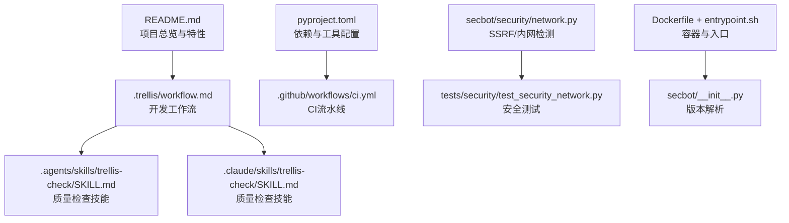
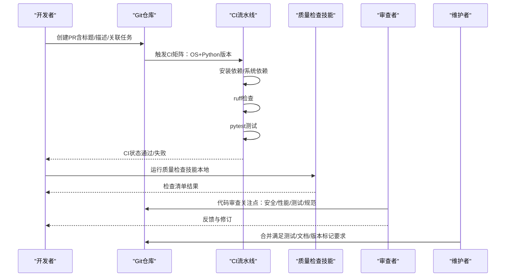
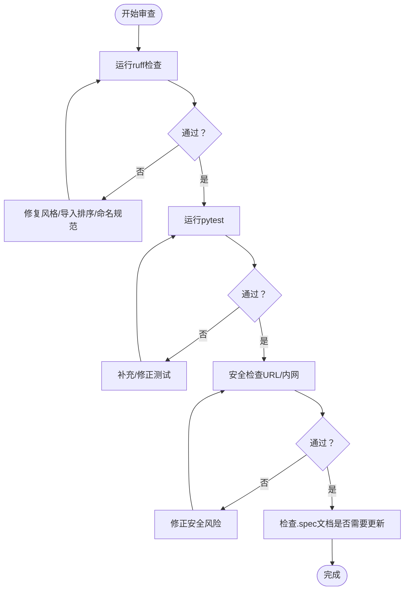
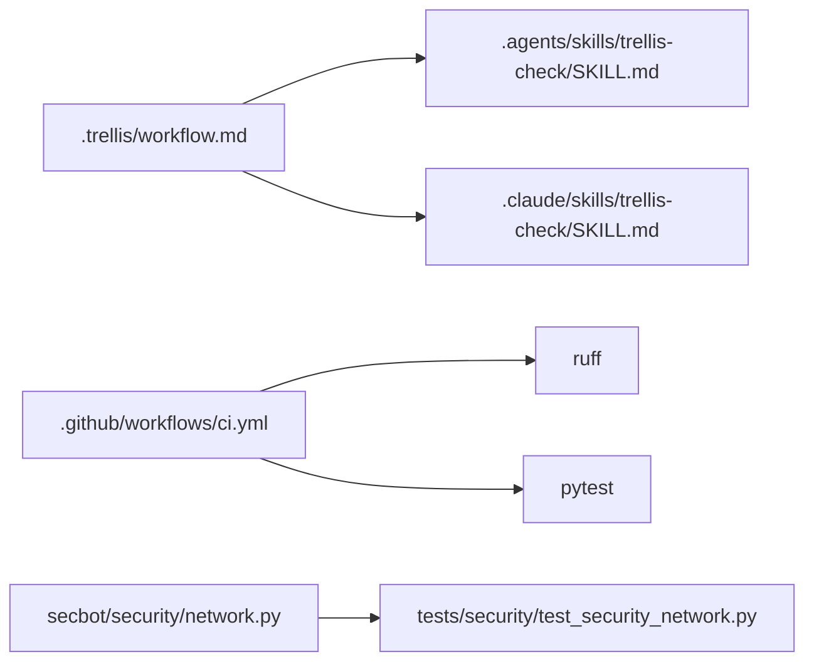

# 代码审查流程

<cite>
**本文引用的文件**   
- [README.md](file://README.md)
- [pyproject.toml](file://pyproject.toml)
- [.github/workflows/ci.yml](file://.github/workflows/ci.yml)
- [.trellis/workflow.md](file://.trellis/workflow.md)
- [.agents/skills/trellis-check/SKILL.md](file://.agents/skills/trellis-check/SKILL.md)
- [.claude/skills/trellis-check/SKILL.md](file://.claude/skills/trellis-check/SKILL.md)
- [secbot/security/network.py](file://secbot/security/network.py)
- [tests/security/test_security_network.py](file://tests/security/test_security_network.py)
- [Dockerfile](file://Dockerfile)
- [entrypoint.sh](file://entrypoint.sh)
- [secbot/__init__.py](file://secbot/__init__.py)
</cite>

## 目录
1. [引言](#引言)
2. [项目结构](#项目结构)
3. [核心组件](#核心组件)
4. [架构总览](#架构总览)
5. [详细组件分析](#详细组件分析)
6. [依赖关系分析](#依赖关系分析)
7. [性能考量](#性能考量)
8. [故障排查指南](#故障排查指南)
9. [结论](#结论)
10. [附录](#附录)

## 引言
本文件面向VAPT3（secbot）项目，提供一套完整的代码审查流程文档，覆盖PR创建规范、审查过程、合并条件、代码质量标准、自动化工具使用、人工审查重点、效率提升与协作实践。内容结合仓库现有的工作流、CI配置、质量检查技能与安全防护模块，确保审查流程既可落地执行，又与项目现状保持一致。

## 项目结构
VAPT3采用分层架构与多智能体协同，后端以Python为主，前端为React+Tailwind，测试覆盖全面，CI在GitHub Actions上执行跨平台测试与静态检查。项目通过Trellis工作流规范任务生命周期，从计划、执行到收尾形成闭环。

**图表来源**
- [README.md:1-298](file://README.md#L1-L298)
- [.trellis/workflow.md:1-663](file://.trellis/workflow.md#L1-L663)
- [.agents/skills/trellis-check/SKILL.md:1-68](file://.agents/skills/trellis-check/SKILL.md#L1-L68)
- [.claude/skills/trellis-check/SKILL.md:1-68](file://.claude/skills/trellis-check/SKILL.md#L1-L68)
- [pyproject.toml:1-169](file://pyproject.toml#L1-L169)
- [.github/workflows/ci.yml:1-40](file://.github/workflows/ci.yml#L1-L40)
- [secbot/security/network.py:1-120](file://secbot/security/network.py#L1-L120)
- [tests/security/test_security_network.py:75-106](file://tests/security/test_security_network.py#L75-L106)
- [Dockerfile:1-51](file://Dockerfile#L1-L51)
- [entrypoint.sh:1-16](file://entrypoint.sh#L1-L16)
- [secbot/__init__.py:1-33](file://secbot/__init__.py#L1-L33)

**章节来源**
- [README.md:1-298](file://README.md#L1-L298)
- [.trellis/workflow.md:1-663](file://.trellis/workflow.md#L1-L663)
- [pyproject.toml:1-169](file://pyproject.toml#L1-L169)
- [.github/workflows/ci.yml:1-40](file://.github/workflows/ci.yml#L1-L40)

## 核心组件
- Trellis工作流：定义“计划—执行—收尾”三阶段，明确任务创建、上下文注入、子智能体检查与提交规范。
- 质量检查技能：提供“变更识别—读取规范—运行检查—对照清单—跨层一致性”的标准化流程。
- CI流水线：在多Python版本与操作系统矩阵上执行ruff检查与pytest测试。
- 安全防护：网络工具提供SSRF与内网地址检测，保障工具调用安全。
- 版本与打包：通过pyproject.toml与入口脚本解析版本，Dockerfile提供容器化部署与非root用户运行。

**章节来源**
- [.trellis/workflow.md:142-213](file://.trellis/workflow.md#L142-L213)
- [.agents/skills/trellis-check/SKILL.md:12-68](file://.agents/skills/trellis-check/SKILL.md#L12-L68)
- [.claude/skills/trellis-check/SKILL.md:12-68](file://.claude/skills/trellis-check/SKILL.md#L12-L68)
- [.github/workflows/ci.yml:35-40](file://.github/workflows/ci.yml#L35-L40)
- [secbot/security/network.py:1-120](file://secbot/security/network.py#L1-L120)
- [pyproject.toml:103-110](file://pyproject.toml#L103-L110)
- [Dockerfile:35-44](file://Dockerfile#L35-L44)

## 架构总览
下图展示从PR创建到CI检查、再到人工审查与合并的关键路径，体现自动化与人工审查的衔接。

**图表来源**
- [.github/workflows/ci.yml:1-40](file://.github/workflows/ci.yml#L1-L40)
- [.agents/skills/trellis-check/SKILL.md:12-68](file://.agents/skills/trellis-check/SKILL.md#L12-L68)
- [.claude/skills/trellis-check/SKILL.md:12-68](file://.claude/skills/trellis-check/SKILL.md#L12-L68)

## 详细组件分析

### PR创建规范
- 标题格式：遵循仓库约定的提交消息风格（如feat/fix/docs/chore等前缀），便于CI与历史检索。
- 描述要求：简述变更动机、影响范围、测试要点与风险提示；复杂变更应附带设计摘要或链接至任务目录。
- 关联任务：通过Trellis任务系统管理需求与上下文，PR描述中应包含任务路径或编号，便于回溯。

**章节来源**
- [.trellis/workflow.md:549-598](file://.trellis/workflow.md#L549-L598)
- [README.md:284-289](file://README.md#L284-L289)

### 审查过程
- 审查清单（建议模板）
  - 代码质量：Linter通过、类型检查通过、无调试日志、无类型安全旁路。
  - 测试覆盖：新增函数→新增单元测试；缺陷修复→回归测试；行为变更→更新既有测试。
  - 规范同步：是否需要更新.spec文档（新模式/约定/经验教训）。
  - 跨层一致性：当变更涉及3+层，核对读写路径、类型/模式传递与错误传播。
- 反馈处理：审查者给出具体修改建议，作者在PR中逐条回复与修订，必要时重新触发CI。
- 批准标准：所有自动化检查通过；审查者确认符合规范与安全要求；关键变更获得至少一名维护者批准。

**章节来源**
- [.agents/skills/trellis-check/SKILL.md:37-68](file://.agents/skills/trellis-check/SKILL.md#L37-L68)
- [.claude/skills/trellis-check/SKILL.md:37-68](file://.claude/skills/trellis-check/SKILL.md#L37-L68)

### 合并条件
- 测试要求：CI通过（ruff检查+pytest），且本地质量检查技能通过。
- 文档更新：若引入新模式/约定/经验教训，需同步更新.spec文档。
- 版本标记：遵循pyproject.toml中的版本策略与发布节奏，避免破坏性变更直接进入主分支。

**章节来源**
- [.github/workflows/ci.yml:35-40](file://.github/workflows/ci.yml#L35-L40)
- [.trellis/workflow.md:549-598](file://.trellis/workflow.md#L549-L598)
- [pyproject.toml:3-4](file://pyproject.toml#L3-L4)

### 代码质量标准
- 代码风格：使用ruff进行静态检查，遵循项目配置（行宽、选择规则等）。
- 性能要求：避免在热路径中执行昂贵的外部调用；对工具调用增加超时与重试策略。
- 安全检查：严格使用网络工具的URL/内网检测能力，禁止执行可能泄露内网信息的命令。
- 测试覆盖率：pytest作为测试框架，覆盖率配置在pyproject.toml中；新增功能需配套单元测试。

**图表来源**
- [.github/workflows/ci.yml:35-40](file://.github/workflows/ci.yml#L35-L40)
- [pyproject.toml:145-169](file://pyproject.toml#L145-L169)
- [secbot/security/network.py:45-120](file://secbot/security/network.py#L45-L120)

**章节来源**
- [pyproject.toml:145-169](file://pyproject.toml#L145-L169)
- [secbot/security/network.py:1-120](file://secbot/security/network.py#L1-L120)
- [tests/security/test_security_network.py:75-106](file://tests/security/test_security_network.py#L75-L106)

### 自动化工具使用
- Lint：ruff检查，CI中执行，本地亦可运行。
- 类型检查：pyproject.toml中定义了类型检查相关依赖，可在本地配合ruff使用。
- 测试：pytest，CI矩阵覆盖多Python版本与操作系统。
- 容器化：Dockerfile提供基础镜像与非root用户运行，entrypoint.sh负责配置目录权限。

**章节来源**
- [.github/workflows/ci.yml:35-40](file://.github/workflows/ci.yml#L35-L40)
- [pyproject.toml:103-110](file://pyproject.toml#L103-L110)
- [Dockerfile:1-51](file://Dockerfile#L1-L51)
- [entrypoint.sh:1-16](file://entrypoint.sh#L1-L16)

### 人工审查重点关注领域
- 安全性：URL合法性、内网地址访问、命令注入风险；参考网络工具的检测逻辑。
- 性能与可靠性：外部工具调用的超时/重试/隔离；避免阻塞主线程。
- 规范与一致性：遵循Trellis工作流与.spec文档；跨层数据流正确性。
- 可测试性：新增逻辑具备可测试性，测试用例清晰可维护。

**章节来源**
- [secbot/security/network.py:1-120](file://secbot/security/network.py#L1-L120)
- [.trellis/workflow.md:186-191](file://.trellis/workflow.md#L186-L191)

### 审查效率提升与协作指南
- 使用质量检查技能：在提交前先运行技能，减少CI失败与往返修改次数。
- 任务驱动：通过Trellis任务组织需求与上下文，避免“无任务”的随意改动。
- 分批提交：将相关改动拆分为逻辑清晰的提交，便于审查与回滚。
- 明确沟通：PR描述中明确变更动机、测试策略与风险控制，减少审查来回。

**章节来源**
- [.agents/skills/trellis-check/SKILL.md:12-36](file://.agents/skills/trellis-check/SKILL.md#L12-L36)
- [.claude/skills/trellis-check/SKILL.md:12-36](file://.claude/skills/trellis-check/SKILL.md#L12-L36)
- [.trellis/workflow.md:186-191](file://.trellis/workflow.md#L186-L191)

## 依赖关系分析
- Trellis工作流与质量检查技能共同构成审查流程的“软约束”，确保每次变更都经过规范化的质量验证。
- CI流水线与本地质量检查技能互补，前者保证跨平台一致性，后者提升反馈速度。
- 安全工具与测试用例共同保障工具调用的安全边界。

**图表来源**
- [.trellis/workflow.md:1-663](file://.trellis/workflow.md#L1-L663)
- [.agents/skills/trellis-check/SKILL.md:1-68](file://.agents/skills/trellis-check/SKILL.md#L1-L68)
- [.claude/skills/trellis-check/SKILL.md:1-68](file://.claude/skills/trellis-check/SKILL.md#L1-L68)
- [.github/workflows/ci.yml:1-40](file://.github/workflows/ci.yml#L1-L40)
- [secbot/security/network.py:1-120](file://secbot/security/network.py#L1-L120)
- [tests/security/test_security_network.py:75-106](file://tests/security/test_security_network.py#L75-L106)

**章节来源**
- [.trellis/workflow.md:1-663](file://.trellis/workflow.md#L1-L663)
- [.github/workflows/ci.yml:1-40](file://.github/workflows/ci.yml#L1-L40)

## 性能考量
- 静态检查与测试在CI中并行执行，缩短反馈周期。
- 通过Dockerfile的分层缓存与非root用户运行，降低部署与运行时开销。
- 安全工具在工具调用前进行URL与内网地址预检，避免无效请求带来的性能浪费。

**章节来源**
- [.github/workflows/ci.yml:10-40](file://.github/workflows/ci.yml#L10-L40)
- [Dockerfile:17-26](file://Dockerfile#L17-L26)
- [secbot/security/network.py:45-120](file://secbot/security/network.py#L45-L120)

## 故障排查指南
- CI失败
  - 检查ruff规则与pytest输出，优先修复风格与测试问题。
  - 在不同Python版本与操作系统矩阵中复现问题，定位兼容性差异。
- 容器运行权限
  - 若出现配置目录不可写，根据entrypoint.sh提示调整宿主机权限或容器用户映射。
- 安全相关
  - 若工具调用被阻断，检查URL合法性与内网地址检测逻辑，必要时配置SSRF白名单。

**章节来源**
- [.github/workflows/ci.yml:35-40](file://.github/workflows/ci.yml#L35-L40)
- [entrypoint.sh:1-16](file://entrypoint.sh#L1-L16)
- [secbot/security/network.py:29-37](file://secbot/security/network.py#L29-L37)

## 结论
本审查流程以Trellis工作流为纲，结合CI自动化与质量检查技能，形成“自动化先行、人工把关”的高效闭环。通过明确的PR规范、审查清单与合并条件，以及对安全与性能的关注，能够持续提升VAPT3代码质量与交付稳定性。

## 附录
- 版本解析：通过包元数据或pyproject.toml解析版本，确保源码与分发一致。
- 提交消息风格：遵循仓库约定的前缀与语言风格，便于历史检索与自动化处理。

**章节来源**
- [secbot/__init__.py:10-27](file://secbot/__init__.py#L10-L27)
- [pyproject.toml:3-4](file://pyproject.toml#L3-L4)