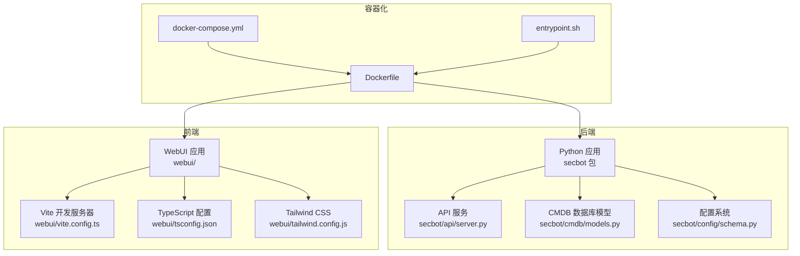
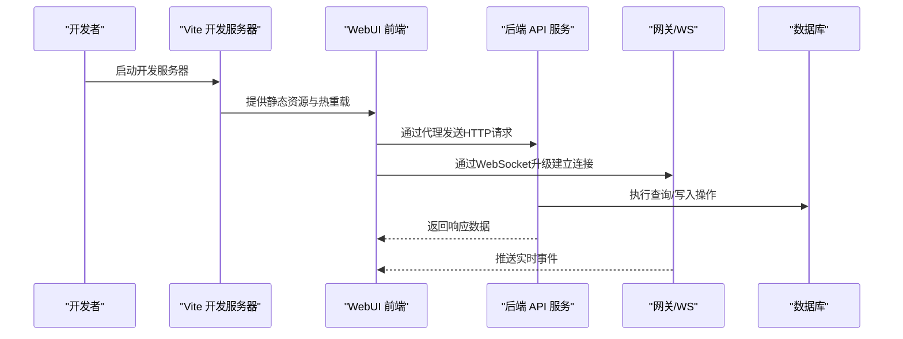
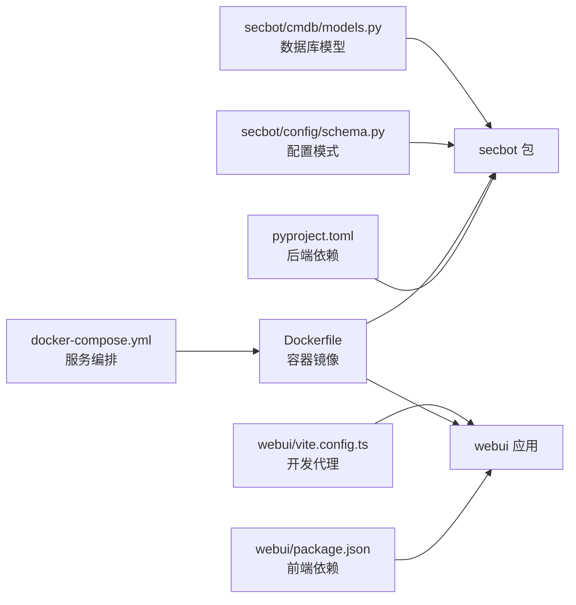

# 开发环境搭建

<cite>
**本文档引用的文件**
- [pyproject.toml](file://pyproject.toml)
- [webui/package.json](file://webui/package.json)
- [Dockerfile](file://Dockerfile)
- [docker-compose.yml](file://docker-compose.yml)
- [entrypoint.sh](file://entrypoint.sh)
- [secbot/config/schema.py](file://secbot/config/schema.py)
- [secbot/config/loader.py](file://secbot/config/loader.py)
- [secbot/cmdb/models.py](file://secbot/cmdb/models.py)
- [webui/vite.config.ts](file://webui/vite.config.ts)
- [webui/tailwind.config.js](file://webui/tailwind.config.js)
- [webui/tsconfig.json](file://webui/tsconfig.json)
- [webui/postcss.config.js](file://webui/postcss.config.js)
- [docs/quick-start.md](file://docs/quick-start.md)
- [docs/configuration.md](file://docs/configuration.md)
</cite>

## 目录
1. [简介](#简介)
2. [项目结构](#项目结构)
3. [核心组件](#核心组件)
4. [架构总览](#架构总览)
5. [详细组件分析](#详细组件分析)
6. [依赖关系分析](#依赖关系分析)
7. [性能考虑](#性能考虑)
8. [故障排除指南](#故障排除指南)
9. [结论](#结论)
10. [附录](#附录)

## 简介
本指南面向VAPT3项目的开发者，提供从零到一的完整开发环境搭建方案。内容覆盖系统要求（Python版本、Node.js版本、数据库要求）、依赖安装步骤（后端依赖、前端依赖、开发工具）、IDE配置建议（VS Code扩展、IntelliJ配置、PyCharm设置）、本地开发服务器启动方法、数据库初始化步骤、API测试方法、Docker开发环境使用指南、热重载配置与调试设置、跨平台开发注意事项、环境变量配置以及开发工具链集成等实用信息。

## 项目结构
VAPT3采用前后端分离架构：后端基于Python（FastAPI风格的API服务），前端基于React + TypeScript，通过Vite进行开发构建；同时提供Docker容器化部署与Compose编排，便于在不同环境中快速复现开发与运行环境。

**图表来源**
- [Dockerfile:1-51](file://Dockerfile#L1-L51)
- [docker-compose.yml:1-56](file://docker-compose.yml#L1-L56)
- [webui/vite.config.ts:1-66](file://webui/vite.config.ts#L1-L66)
- [webui/tailwind.config.js:1-166](file://webui/tailwind.config.js#L1-L166)
- [webui/tsconfig.json:1-33](file://webui/tsconfig.json#L1-L33)
- [secbot/config/schema.py:267-376](file://secbot/config/schema.py#L267-L376)
- [secbot/cmdb/models.py:1-263](file://secbot/cmdb/models.py#L1-L263)

**章节来源**
- [pyproject.toml:1-169](file://pyproject.toml#L1-L169)
- [webui/package.json:1-67](file://webui/package.json#L1-L67)
- [Dockerfile:1-51](file://Dockerfile#L1-L51)
- [docker-compose.yml:1-56](file://docker-compose.yml#L1-L56)

## 核心组件
- 后端Python应用：提供API服务、代理管理、工具执行、消息通道、会话管理、报告生成等能力。核心入口位于主模块，配置系统基于Pydantic，支持环境变量前缀映射。
- 前端WebUI：基于React + TypeScript，使用Vite作为开发服务器与构建工具，Tailwind CSS提供样式基础，Radix UI组件库提供可访问性组件。
- 容器化与编排：Dockerfile基于uv官方镜像，预装Node.js 20用于WhatsApp桥接；docker-compose定义网关、API、CLI三个服务，并挂载用户配置目录。
- 配置系统：支持JSON配置文件与环境变量混合解析，提供默认值与迁移逻辑，确保向后兼容。
- 数据库：使用SQLAlchemy ORM定义CMDB模型，支持SQLite/异步驱动，配合Alembic进行迁移管理。

**章节来源**
- [secbot/config/schema.py:267-376](file://secbot/config/schema.py#L267-L376)
- [secbot/config/loader.py:32-173](file://secbot/config/loader.py#L32-L173)
- [secbot/cmdb/models.py:1-263](file://secbot/cmdb/models.py#L1-L263)
- [webui/vite.config.ts:1-66](file://webui/vite.config.ts#L1-L66)

## 架构总览
下图展示开发环境中的关键交互：前端通过Vite代理访问后端API与WebSocket网关；后端通过配置系统加载运行参数，连接数据库并调用LLM提供商；容器化环境统一打包与运行。

**图表来源**
- [webui/vite.config.ts:41-58](file://webui/vite.config.ts#L41-L58)
- [secbot/config/schema.py:182-196](file://secbot/config/schema.py#L182-L196)
- [secbot/cmdb/models.py:34-174](file://secbot/cmdb/models.py#L34-L174)

## 详细组件分析

### 后端依赖与系统要求
- Python版本：要求Python 3.11及以上，推荐3.12。
- 关键依赖：FastAPI风格的HTTP客户端、WebSocket、LLM提供商SDK、SQLAlchemy异步、Alembic迁移、工具执行沙箱、多渠道适配器等。
- 可选依赖：API服务、企业微信、微信、Teams、Matrix、Discord、LangSmith、PDF处理、OLostep等插件。
- 开发依赖：pytest、pytest-asyncio、覆盖率、Ruff代码规范、TypeScript测试等。

安装建议：
- 使用uv进行快速安装与虚拟环境隔离（推荐）。
- 或使用pip安装可编辑模式以支持源码修改即时生效。

**章节来源**
- [pyproject.toml:6-68](file://pyproject.toml#L6-L68)
- [pyproject.toml:103-110](file://pyproject.toml#L103-L110)

### 前端依赖与开发工具
- Node.js版本：Dockerfile中固定安装Node.js 20，用于WhatsApp桥接。
- 依赖组成：React 18、TypeScript、Tailwind CSS、Radix UI、React Router、React Query、ECharts等。
- 开发脚本：dev、build、preview、test、test:watch、lint。
- 类型检查与严格模式：tsconfig启用严格模式与路径别名，确保类型安全。

**章节来源**
- [webui/package.json:1-67](file://webui/package.json#L1-L67)
- [webui/tsconfig.json:1-33](file://webui/tsconfig.json#L1-L33)

### 配置系统与环境变量
- 配置文件位置：默认位于用户主目录下的配置目录，支持自定义路径。
- 环境变量前缀：配置对象支持环境变量前缀映射，字段名自动驼峰化与蛇形互转。
- 环境变量引用：配置中可使用${VAR}占位符，启动时由加载器解析为实际值。
- 迁移机制：对旧版配置进行字段迁移，保持向后兼容。

**章节来源**
- [secbot/config/loader.py:32-173](file://secbot/config/loader.py#L32-L173)
- [secbot/config/schema.py:375-376](file://secbot/config/schema.py#L375-L376)

### 数据库与迁移
- ORM模型：定义了扫描、资产、服务、漏洞、报告元数据等核心表，含索引与外键约束。
- 异步驱动：使用SQLAlchemy异步SQLite驱动，适合开发与轻量级生产场景。
- 迁移工具：Alembic提供迁移脚本管理，版本化控制数据库结构演进。

**章节来源**
- [secbot/cmdb/models.py:1-263](file://secbot/cmdb/models.py#L1-L263)

### 容器化与编排
- 基础镜像：基于uv官方镜像，内置Python 3.12与Node.js 20。
- 依赖安装：先复制pyproject.toml进行缓存层优化，再安装完整源码依赖。
- 服务编排：定义网关、API、CLI三类服务，暴露必要端口，挂载用户配置目录。
- 权限与安全：非root用户运行，限制capabilities，启用seccomp/apparmor。

**章节来源**
- [Dockerfile:1-51](file://Dockerfile#L1-L51)
- [docker-compose.yml:1-56](file://docker-compose.yml#L1-L56)
- [entrypoint.sh:1-16](file://entrypoint.sh#L1-L16)

### 热重载与代理配置
- Vite开发服务器：默认监听本地回环地址与端口，严格端口绑定避免冲突。
- HMR端口分离：将HMR Socket迁移到独立端口，避免与WebSocket升级冲突。
- 代理规则：将/api、/auth、/webui转发至后端目标，根路径WebSocket升级透传至网关。
- 依赖优化：排除特定包以稳定开发时的依赖重新优化行为。

**章节来源**
- [webui/vite.config.ts:29-58](file://webui/vite.config.ts#L29-L58)

### 调试与测试
- 后端测试：pytest与pytest-asyncio，测试路径指向tests目录。
- 前端测试：Vitest + happy-dom，支持交互式watch模式。
- 代码质量：Ruff代码规范，行长度限制与目标版本配置。

**章节来源**
- [pyproject.toml:153-169](file://pyproject.toml#L153-L169)
- [webui/package.json:10-12](file://webui/package.json#L10-L12)

## 依赖关系分析

**图表来源**
- [pyproject.toml:25-68](file://pyproject.toml#L25-L68)
- [webui/package.json:14-45](file://webui/package.json#L14-L45)
- [Dockerfile:17-26](file://Dockerfile#L17-L26)
- [docker-compose.yml:15-56](file://docker-compose.yml#L15-L56)
- [secbot/config/schema.py:267-376](file://secbot/config/schema.py#L267-L376)
- [secbot/cmdb/models.py:34-174](file://secbot/cmdb/models.py#L34-L174)
- [webui/vite.config.ts:41-58](file://webui/vite.config.ts#L41-L58)

**章节来源**
- [pyproject.toml:1-169](file://pyproject.toml#L1-L169)
- [webui/package.json:1-67](file://webui/package.json#L1-L67)
- [Dockerfile:1-51](file://Dockerfile#L1-L51)
- [docker-compose.yml:1-56](file://docker-compose.yml#L1-L56)

## 性能考虑
- 依赖缓存层：Dockerfile中先复制pyproject.toml并安装依赖，提升重复构建速度。
- 异步数据库：使用SQLAlchemy异步驱动，减少I/O阻塞。
- 代理与HMR分离：避免根路径与HMR端口冲突，降低开发时的握手错误与重连开销。
- 严格类型检查：TypeScript严格模式有助于早期发现潜在性能问题与类型错误。

[本节为通用指导，不直接分析具体文件]

## 故障排除指南
- 容器权限问题：当宿主机配置目录不可写时，entrypoint会提示修复方式（修改属主或以指定UID/GID运行）。
- 端口冲突：确认Vite HMR端口与开发服务器端口未被占用，必要时调整配置。
- 环境变量缺失：配置中引用的环境变量未设置会导致校验失败，需补齐对应变量。
- 数据库迁移：如出现模型与迁移不一致，使用迁移工具生成/应用最新版本。

**章节来源**
- [entrypoint.sh:3-14](file://entrypoint.sh#L3-L14)
- [webui/vite.config.ts:37-40](file://webui/vite.config.ts#L37-L40)
- [secbot/config/loader.py:140-147](file://secbot/config/loader.py#L140-L147)

## 结论
通过本指南，您可以在本地或容器环境中快速搭建VAPT3的开发环境。建议优先使用uv进行Python依赖管理，使用Vite进行前端开发与热重载，结合Docker Compose进行服务编排与持久化配置。遵循环境变量与配置系统的约定，可确保开发与生产的无缝衔接。

[本节为总结性内容，不直接分析具体文件]

## 附录

### 系统要求与安装步骤
- Python 3.11+（推荐3.12）
- Node.js 20（随Docker镜像内置）
- 建议使用uv进行快速安装与虚拟环境管理
- 安装命令参考项目文档中的“安装”部分

**章节来源**
- [docs/quick-start.md:10-28](file://docs/quick-start.md#L10-L28)

### 本地开发服务器启动方法
- 后端API服务：使用后端提供的命令行入口启动API服务（详见后端配置与命令定义）。
- 前端开发服务器：在webui目录执行开发脚本，启动Vite并启用热重载。
- 代理与WebSocket：Vite代理已配置，无需额外设置即可访问后端API与WebSocket网关。

**章节来源**
- [webui/vite.config.ts:6-58](file://webui/vite.config.ts#L6-L58)
- [secbot/config/schema.py:182-196](file://secbot/config/schema.py#L182-L196)

### 数据库初始化步骤
- 使用SQLAlchemy异步驱动连接数据库（默认SQLite）
- 通过Alembic生成并应用迁移，确保表结构与模型一致
- 初始化完成后，可在应用中进行CRUD操作

**章节来源**
- [secbot/cmdb/models.py:1-263](file://secbot/cmdb/models.py#L1-L263)

### API测试方法
- 后端：使用pytest与pytest-asyncio进行单元与集成测试
- 前端：使用Vitest进行组件与功能测试，支持watch模式
- 建议在本地启动API服务后，使用HTTP客户端工具（如curl或Postman）进行接口验证

**章节来源**
- [pyproject.toml:153-169](file://pyproject.toml#L153-L169)
- [webui/package.json:10-12](file://webui/package.json#L10-L12)

### Docker开发环境使用指南
- 构建镜像：基于Dockerfile构建，内置Python 3.12与Node.js 20
- 启动服务：使用docker-compose启动网关、API与CLI服务
- 挂载配置：将宿主机配置目录挂载到容器内，实现持久化
- 权限与安全：以非root用户运行，限制capabilities，启用seccomp/apparmor

**章节来源**
- [Dockerfile:1-51](file://Dockerfile#L1-L51)
- [docker-compose.yml:1-56](file://docker-compose.yml#L1-L56)
- [entrypoint.sh:1-16](file://entrypoint.sh#L1-L16)

### 热重载与调试设置
- Vite热重载：默认启用，HMR端口与开发服务器端口分离
- 代理规则：根路径WebSocket升级透传至网关，HTTP请求转发至后端
- 前端调试：在浏览器开发者工具中设置断点，配合Vite HMR实现快速迭代

**章节来源**
- [webui/vite.config.ts:37-58](file://webui/vite.config.ts#L37-L58)

### 跨平台开发注意事项
- 文件系统差异：注意大小写敏感与路径分隔符差异
- 权限模型：Linux/macOS与Windows的权限模型不同，容器运行时需注意用户与组映射
- 代理与网络：不同平台的代理与防火墙策略可能影响WebSocket与HTTP代理

[本节为通用指导，不直接分析具体文件]

### 环境变量配置
- 配置文件中的${VAR}占位符会在启动时解析为环境变量值
- 支持环境变量前缀映射，字段名自动驼峰化与蛇形互转
- 缺失的环境变量会导致配置校验失败，需补齐对应变量

**章节来源**
- [secbot/config/loader.py:86-147](file://secbot/config/loader.py#L86-L147)
- [secbot/config/schema.py:375-376](file://secbot/config/schema.py#L375-L376)

### 开发工具链集成
- 后端：Ruff代码规范、pytest测试、覆盖率统计
- 前端：TypeScript严格模式、ESLint、Tailwind CSS、Vitest
- 容器化：Docker与Compose，支持多服务编排与持久化

**章节来源**
- [pyproject.toml:145-169](file://pyproject.toml#L145-L169)
- [webui/tsconfig.json:17-30](file://webui/tsconfig.json#L17-L30)
- [webui/postcss.config.js:1-7](file://webui/postcss.config.js#L1-L7)