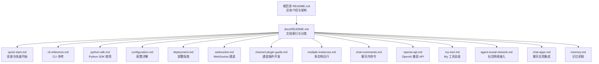
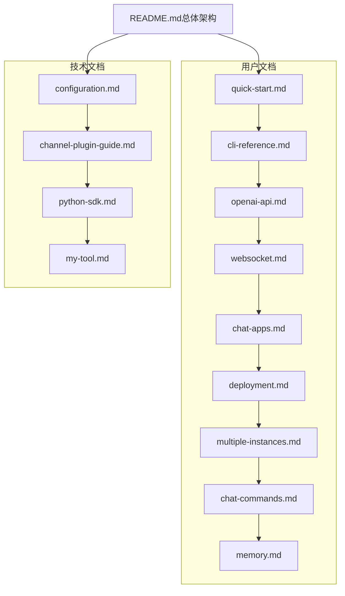
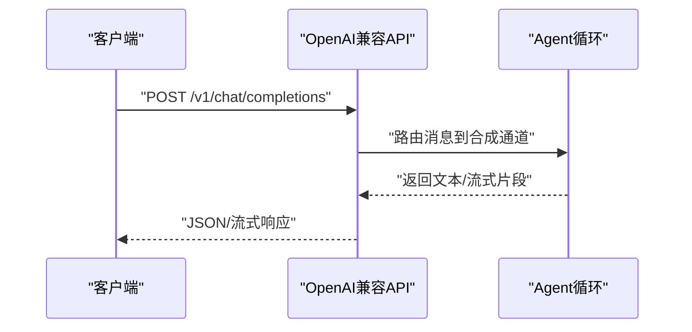
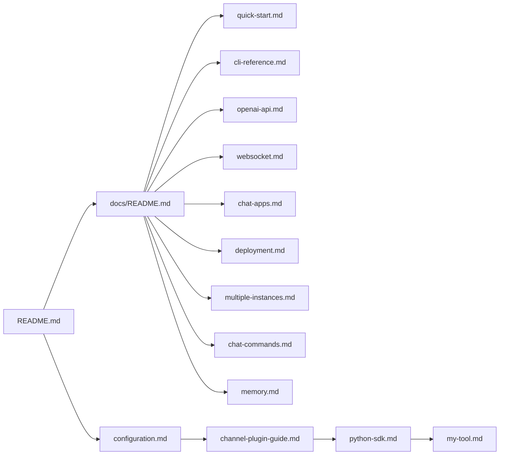

# 文档维护流程

<cite>
**本文引用的文件**
- [README.md](file://README.md)
- [docs/README.md](file://docs/README.md)
- [docs/quick-start.md](file://docs/quick-start.md)
- [docs/cli-reference.md](file://docs/cli-reference.md)
- [docs/python-sdk.md](file://docs/python-sdk.md)
- [docs/configuration.md](file://docs/configuration.md)
- [docs/deployment.md](file://docs/deployment.md)
- [docs/websocket.md](file://docs/websocket.md)
- [docs/channel-plugin-guide.md](file://docs/channel-plugin-guide.md)
- [docs/multiple-instances.md](file://docs/multiple-instances.md)
- [docs/chat-commands.md](file://docs/chat-commands.md)
- [docs/openai-api.md](file://docs/openai-api.md)
- [docs/my-tool.md](file://docs/my-tool.md)
- [docs/agent-social-network.md](file://docs/agent-social-network.md)
- [docs/chat-apps.md](file://docs/chat-apps.md)
- [docs/memory.md](file://docs/memory.md)
</cite>

## 目录
1. [引言](#引言)
2. [项目结构](#项目结构)
3. [核心组件](#核心组件)
4. [架构总览](#架构总览)
5. [详细组件分析](#详细组件分析)
6. [依赖关系分析](#依赖关系分析)
7. [性能考虑](#性能考虑)
8. [故障排查指南](#故障排查指南)
9. [结论](#结论)
10. [附录](#附录)

## 引言
本文件旨在为 VAPT3 项目建立一套系统化的“文档维护流程”，覆盖以下方面：
- 代码注释规范（docstring 格式、类型注解、注释更新要求）
- API 文档维护（接口文档自动生成、参数说明、示例代码）
- 用户文档更新（功能说明、使用指南、FAQ 维护）
- 文档版本管理策略、发布流程、质量检查标准
- 文档模板与写作指南（技术文档结构、图表使用、链接管理）
- 多语言文档支持、文档自动化工具、文档测试方法

本流程以现有仓库中的用户文档为基础，结合项目 README 中的总体架构与组件说明，形成可落地的维护机制。

## 项目结构
VAPT3 的文档主要分布在 docs 目录，包含安装、配置、部署、API、通道插件、内存机制等主题；README 提供总体介绍与架构概览。整体结构如下：

图表来源
- [docs/README.md:1-35](file://docs/README.md#L1-L35)
- [README.md:1-298](file://README.md#L1-L298)

章节来源
- [docs/README.md:1-35](file://docs/README.md#L1-L35)
- [README.md:1-298](file://README.md#L1-L298)

## 核心组件
- 文档索引与导航：docs/README.md 提供文档主题清单与覆盖范围，便于维护者定位与更新。
- 用户文档：quick-start、cli-reference、python-sdk、configuration、deployment、websocket、channel-plugin-guide、multiple-instances、chat-commands、openai-api、my-tool、agent-social-network、chat-apps、memory 等，覆盖从安装到高级集成的完整路径。
- 架构与背景：README.md 提供总体架构、核心特性、内置智能体与工作流说明，是撰写技术文档的重要参考。

章节来源
- [docs/README.md:1-35](file://docs/README.md#L1-L35)
- [docs/quick-start.md:1-105](file://docs/quick-start.md#L1-L105)
- [docs/cli-reference.md:1-22](file://docs/cli-reference.md#L1-L22)
- [docs/python-sdk.md:1-220](file://docs/python-sdk.md#L1-L220)
- [docs/configuration.md:1-800](file://docs/configuration.md#L1-L800)
- [docs/deployment.md:1-171](file://docs/deployment.md#L1-L171)
- [docs/websocket.md:1-397](file://docs/websocket.md#L1-L397)
- [docs/channel-plugin-guide.md:1-442](file://docs/channel-plugin-guide.md#L1-L442)
- [docs/multiple-instances.md:1-127](file://docs/multiple-instances.md#L1-L127)
- [docs/chat-commands.md:1-51](file://docs/chat-commands.md#L1-L51)
- [docs/openai-api.md:1-122](file://docs/openai-api.md#L1-L122)
- [docs/my-tool.md:1-208](file://docs/my-tool.md#L1-L208)
- [docs/agent-social-network.md:1-11](file://docs/agent-social-network.md#L1-L11)
- [docs/chat-apps.md:1-672](file://docs/chat-apps.md#L1-L672)
- [docs/memory.md:1-190](file://docs/memory.md#L1-L190)
- [README.md:1-298](file://README.md#L1-L298)

## 架构总览
文档维护流程围绕“用户文档”与“技术文档”两条主线展开，前者面向使用者，后者面向贡献者与集成者。二者均以 docs 目录为核心承载，README 提供全局视角。

图表来源
- [README.md:1-298](file://README.md#L1-L298)
- [docs/README.md:1-35](file://docs/README.md#L1-L35)
- [docs/quick-start.md:1-105](file://docs/quick-start.md#L1-L105)
- [docs/cli-reference.md:1-22](file://docs/cli-reference.md#L1-L22)
- [docs/openai-api.md:1-122](file://docs/openai-api.md#L1-L122)
- [docs/websocket.md:1-397](file://docs/websocket.md#L1-L397)
- [docs/chat-apps.md:1-672](file://docs/chat-apps.md#L1-L672)
- [docs/deployment.md:1-171](file://docs/deployment.md#L1-L171)
- [docs/multiple-instances.md:1-127](file://docs/multiple-instances.md#L1-L127)
- [docs/chat-commands.md:1-51](file://docs/chat-commands.md#L1-L51)
- [docs/memory.md:1-190](file://docs/memory.md#L1-L190)
- [docs/configuration.md:1-800](file://docs/configuration.md#L1-L800)
- [docs/channel-plugin-guide.md:1-442](file://docs/channel-plugin-guide.md#L1-L442)
- [docs/python-sdk.md:1-220](file://docs/python-sdk.md#L1-L220)
- [docs/my-tool.md:1-208](file://docs/my-tool.md#L1-L208)

## 详细组件分析

### 代码注释规范
- docstring 格式
  - 采用简洁清晰的自然语言描述函数/类用途、行为边界与副作用。
  - 参数与返回值使用“键: 类型 | 描述”的形式列出，保持一致性。
  - 对于异常或错误条件，明确写出触发条件与预期行为。
- 类型注解
  - 函数签名与公共属性应标注类型，优先使用标准库类型与泛型容器。
  - 对复杂结构使用自定义类型别名或 Pydantic 模型，确保可读性与可维护性。
- 注释更新要求
  - 任何影响外部行为（API、配置项、命令）的变更，必须同步更新相关文档与注释。
  - 版本升级或破坏性变更需在注释中标明“自 X 版本起废弃/变更”。

章节来源
- [docs/python-sdk.md:63-122](file://docs/python-sdk.md#L63-L122)
- [docs/channel-plugin-guide.md:191-241](file://docs/channel-plugin-guide.md#L191-L241)

### API 文档维护
- 接口文档自动生成
  - 对于 OpenAI 兼容 API，可基于现有端点定义（/health、/v1/models、/v1/chat/completions）生成接口文档。
  - 使用统一的请求/响应结构与状态码约定，确保与现有文档一致。
- 参数说明
  - 明确每个字段的类型、是否必填、默认值、取值范围与约束。
  - 对于文件上传、多模态内容等特殊场景，给出示例与限制。
- 示例代码
  - 提供 curl 与 Python（requests/openai SDK）示例，覆盖常见场景（单消息、流式、文件上传）。
  - 示例应与当前默认行为一致，避免过时。

图表来源
- [docs/openai-api.md:33-81](file://docs/openai-api.md#L33-L81)

章节来源
- [docs/openai-api.md:1-122](file://docs/openai-api.md#L1-L122)

### 用户文档更新
- 功能说明
  - 以 docs/README.md 的主题清单为纲，逐项核对各主题文档的完整性与时效性。
  - 对新增/变更的功能，先在对应主题文档中补充，再回溯 README 的总体介绍与架构说明。
- 使用指南
  - 快速开始：确保安装步骤、初始化、首次运行与验证步骤正确无误。
  - CLI 参考：与实际命令实现保持一致，避免遗漏或过时选项。
  - 部署与多实例：提供最小可行配置与常见问题处理。
- FAQ 维护
  - 基于常见问题与错误提示，沉淀 FAQ 条目，链接至相关主题文档。
  - 对于跨主题的问题（如 WebSocket 与多实例），提供关联指引。

章节来源
- [docs/README.md:1-35](file://docs/README.md#L1-L35)
- [docs/quick-start.md:1-105](file://docs/quick-start.md#L1-L105)
- [docs/cli-reference.md:1-22](file://docs/cli-reference.md#L1-L22)
- [docs/deployment.md:1-171](file://docs/deployment.md#L1-L171)
- [docs/multiple-instances.md:1-127](file://docs/multiple-instances.md#L1-L127)

### 文档版本管理策略
- 版本与分支
  - 主分支用于稳定迭代，重大变更通过特性分支合并，避免破坏性变更直接进入主干。
  - 文档随代码版本发布，重要变更在变更日志中同步记录。
- 版本标记
  - 使用语义化版本号，文档版本与代码版本保持一致或略滞后。
- 回归与兼容
  - 对破坏性变更，提供迁移指南与兼容性说明，确保用户文档与实现同步更新。

章节来源
- [README.md:284-288](file://README.md#L284-L288)

### 发布流程
- 文档发布前检查
  - 语法与拼写检查，链接有效性验证，示例可运行性测试。
  - 与最新代码实现对比，确保 API、命令、配置项一致。
- 发布渠道
  - 仓库内文档作为“最新源”，网站文档作为“稳定版”。
  - 通过 CI 自动化校验与预览，确保每次提交的质量。

章节来源
- [docs/README.md:3-6](file://docs/README.md#L3-L6)

### 质量检查标准
- 结构性
  - 文档主题完整、层级清晰、命名规范。
- 一致性
  - 术语统一、示例风格一致、链接格式规范。
- 可靠性
  - 示例可复现、命令与配置项准确、错误信息与实际行为一致。
- 可访问性
  - 图表与代码示例配合文字说明，提供必要的背景知识与上下文。

章节来源
- [docs/README.md:1-35](file://docs/README.md#L1-L35)

### 文档模板与写作指南
- 技术文档结构
  - 标题层级：主标题、子标题、小节标题，避免跳级。
  - 内容组织：背景 → 目标 → 步骤 → 注意事项 → 故障排查。
- 图表使用
  - 使用 Mermaid 绘制流程图、序列图与架构图，确保与代码实现一一对应。
  - 图表应有简要说明与来源标注。
- 链接管理
  - 内部链接使用相对路径与锚点，外部链接使用完整 URL 并在文末列出参考。
  - 避免死链，定期巡检与更新。

章节来源
- [docs/README.md:1-35](file://docs/README.md#L1-L35)

### 多语言文档支持
- 当前仓库未提供多语言文档，若未来需要国际化，建议：
  - 以英文为基准语言，其他语言作为翻译版本。
  - 使用统一的命名规范与目录结构，避免内容散落。
  - 通过 CI 自动化检测缺失的翻译条目并提醒维护者。

章节来源
- [docs/README.md:1-35](file://docs/README.md#L1-L35)

### 文档自动化工具
- 自动化校验
  - 使用静态检查工具（语法、拼写、链接有效性）与 CI 集成。
- 文档生成
  - 对于 API 文档，可基于现有端点定义生成 OpenAPI/Swagger 文档。
- 预览与发布
  - 通过 CI 生成预览页面，合并后自动发布到文档站点。

章节来源
- [docs/openai-api.md:1-122](file://docs/openai-api.md#L1-L122)

### 文档测试方法
- 示例测试
  - 对关键示例（curl、Python 脚本）编写自动化测试，确保可运行。
- 回归测试
  - 对变更涉及的主题进行回归测试，确保文档与实现一致。
- 用户反馈
  - 建立反馈渠道，收集用户在使用文档时遇到的问题并持续改进。

章节来源
- [docs/openai-api.md:39-122](file://docs/openai-api.md#L39-L122)

## 依赖关系分析
文档维护流程与项目文档主题之间存在强依赖关系：用户文档依赖技术文档的准确性，技术文档依赖 README 的总体架构与实现细节。

图表来源
- [README.md:1-298](file://README.md#L1-L298)
- [docs/README.md:1-35](file://docs/README.md#L1-L35)
- [docs/quick-start.md:1-105](file://docs/quick-start.md#L1-L105)
- [docs/cli-reference.md:1-22](file://docs/cli-reference.md#L1-L22)
- [docs/openai-api.md:1-122](file://docs/openai-api.md#L1-L122)
- [docs/websocket.md:1-397](file://docs/websocket.md#L1-L397)
- [docs/chat-apps.md:1-672](file://docs/chat-apps.md#L1-L672)
- [docs/deployment.md:1-171](file://docs/deployment.md#L1-L171)
- [docs/multiple-instances.md:1-127](file://docs/multiple-instances.md#L1-L127)
- [docs/chat-commands.md:1-51](file://docs/chat-commands.md#L1-L51)
- [docs/memory.md:1-190](file://docs/memory.md#L1-L190)
- [docs/configuration.md:1-800](file://docs/configuration.md#L1-L800)
- [docs/channel-plugin-guide.md:1-442](file://docs/channel-plugin-guide.md#L1-L442)
- [docs/python-sdk.md:1-220](file://docs/python-sdk.md#L1-L220)
- [docs/my-tool.md:1-208](file://docs/my-tool.md#L1-L208)

章节来源
- [README.md:1-298](file://README.md#L1-L298)
- [docs/README.md:1-35](file://docs/README.md#L1-L35)

## 性能考虑
- 文档体积与加载速度
  - 控制图片与视频大小，使用压缩与懒加载策略。
- 搜索与索引
  - 为文档站点提供全文搜索与侧边栏导航，提升查找效率。
- 更新频率
  - 对高频变更的主题（API、CLI、配置）缩短更新周期，减少文档与实现的偏差。

## 故障排查指南
- 常见问题
  - 安装与初始化：确认依赖安装顺序与配置文件路径。
  - API 与 WebSocket：检查端口占用、认证令牌与 TLS 配置。
  - 多实例与部署：确保端口不冲突、工作空间隔离与健康检查可用。
- 排查步骤
  - 逐步对照文档步骤执行，记录每一步的输出与错误信息。
  - 对照 CLI 参考与配置参考，确认参数与默认值。

章节来源
- [docs/quick-start.md:1-105](file://docs/quick-start.md#L1-L105)
- [docs/openai-api.md:1-122](file://docs/openai-api.md#L1-L122)
- [docs/websocket.md:1-397](file://docs/websocket.md#L1-L397)
- [docs/multiple-instances.md:1-127](file://docs/multiple-instances.md#L1-L127)
- [docs/deployment.md:1-171](file://docs/deployment.md#L1-L171)

## 结论
通过建立完善的文档维护流程，可以确保 VAPT3 的用户文档与技术文档保持高质量、一致性与可维护性。建议将本流程纳入团队日常工作，结合 CI 自动化与定期巡检，持续优化文档体验。

## 附录
- 相关主题文档清单
  - 安装与快速开始：docs/quick-start.md
  - CLI 参考：docs/cli-reference.md
  - Python SDK：docs/python-sdk.md
  - 配置：docs/configuration.md
  - 部署：docs/deployment.md
  - WebSocket：docs/websocket.md
  - 通道插件：docs/channel-plugin-guide.md
  - 多实例：docs/multiple-instances.md
  - 聊天内命令：docs/chat-commands.md
  - OpenAI 兼容 API：docs/openai-api.md
  - My 工具：docs/my-tool.md
  - 社交网络：docs/agent-social-network.md
  - 聊天应用：docs/chat-apps.md
  - 记忆机制：docs/memory.md

章节来源
- [docs/README.md:1-35](file://docs/README.md#L1-L35)
- [docs/quick-start.md:1-105](file://docs/quick-start.md#L1-L105)
- [docs/cli-reference.md:1-22](file://docs/cli-reference.md#L1-L22)
- [docs/python-sdk.md:1-220](file://docs/python-sdk.md#L1-L220)
- [docs/configuration.md:1-800](file://docs/configuration.md#L1-L800)
- [docs/deployment.md:1-171](file://docs/deployment.md#L1-L171)
- [docs/websocket.md:1-397](file://docs/websocket.md#L1-L397)
- [docs/channel-plugin-guide.md:1-442](file://docs/channel-plugin-guide.md#L1-L442)
- [docs/multiple-instances.md:1-127](file://docs/multiple-instances.md#L1-L127)
- [docs/chat-commands.md:1-51](file://docs/chat-commands.md#L1-L51)
- [docs/openai-api.md:1-122](file://docs/openai-api.md#L1-L122)
- [docs/my-tool.md:1-208](file://docs/my-tool.md#L1-L208)
- [docs/agent-social-network.md:1-11](file://docs/agent-social-network.md#L1-L11)
- [docs/chat-apps.md:1-672](file://docs/chat-apps.md#L1-L672)
- [docs/memory.md:1-190](file://docs/memory.md#L1-L190)