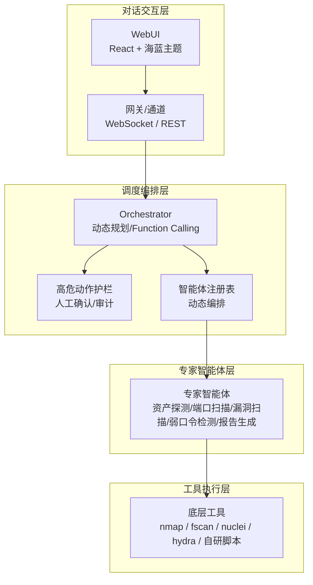
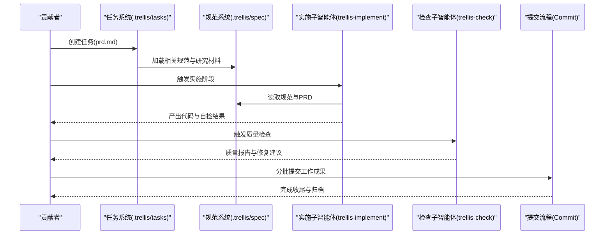
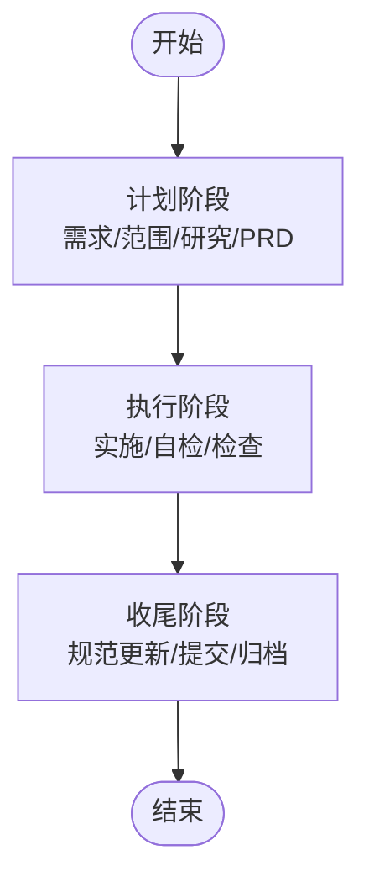
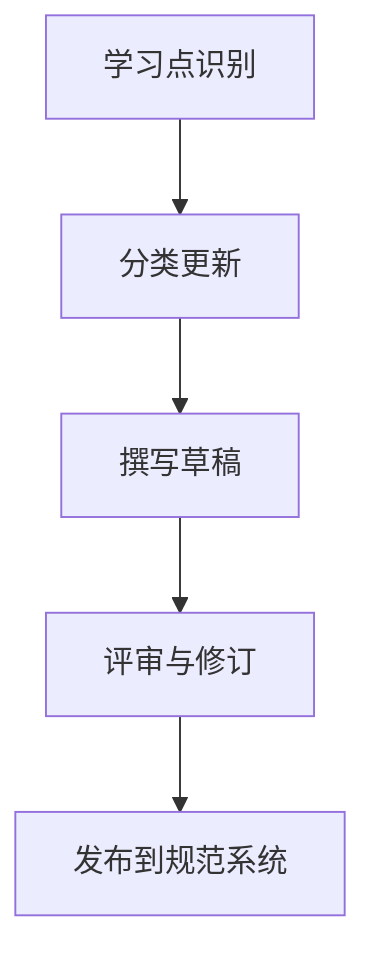
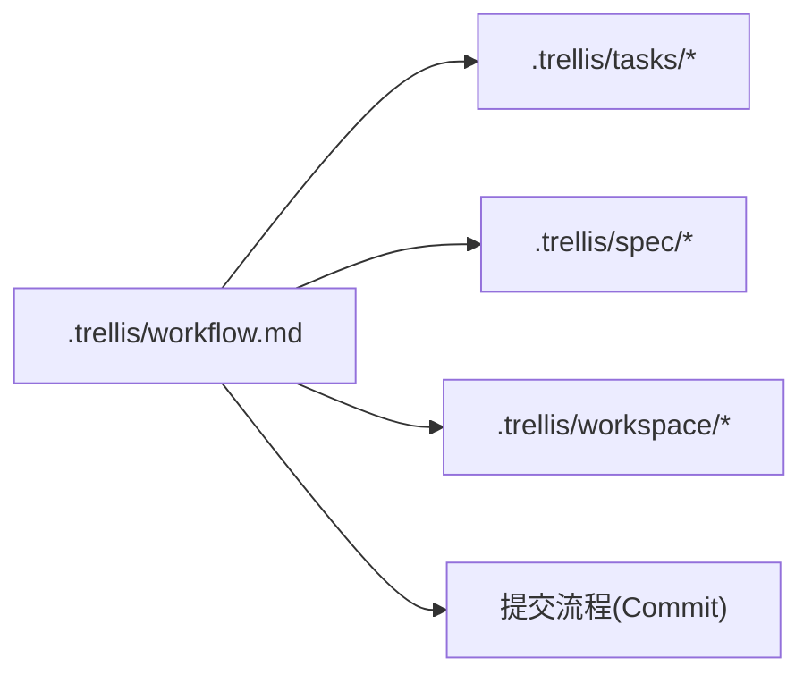

# 社区协作规范

<cite>
**本文引用的文件**   
- [README.md](file://README.md)
- [AGENTS.md](file://AGENTS.md)
- [.trellis/workflow.md](file://.trellis/workflow.md)
- [.trellis/spec/backend/index.md](file://.trellis/spec/backend/index.md)
- [.trellis/tasks/00-bootstrap-guidelines/prd.md](file://.trellis/tasks/00-bootstrap-guidelines/prd.md)
- [.claude/skills/trellis-update-spec/SKILL.md](file://.claude/skills/trellis-update-spec/SKILL.md)
- [.claude/agents/trellis-implement.md](file://.claude/agents/trellis-implement.md)
- [pyproject.toml](file://pyproject.toml)
- [LICENSE](file://LICENSE)
- [docs/README.md](file://docs/README.md)
</cite>

## 目录
1. [引言](#引言)
2. [项目结构](#项目结构)
3. [核心组件](#核心组件)
4. [架构总览](#架构总览)
5. [详细组件分析](#详细组件分析)
6. [依赖关系分析](#依赖关系分析)
7. [性能考虑](#性能考虑)
8. [故障排查指南](#故障排查指南)
9. [结论](#结论)
10. [附录](#附录)

## 引言
本规范旨在为 VAPT3/Secbot 社区提供一套清晰、可执行的协作框架，覆盖行为准则、沟通礼仪、角色职责、决策流程、冲突解决、社区活动参与、知识分享与导师制度、开源协作最佳实践、知识产权与贡献认可机制，以及远程协作工具与跨时区协调等现代协作方法。本规范以项目现有工作流与文档为基础，结合社区治理与开源惯例制定，确保贡献者在统一标准下高效协作。

## 项目结构
VAPT3/Secbot 是一个基于多智能体的网络安全自动化平台，采用分层架构与模块化设计。项目围绕“对话交互层—调度编排层—专家智能体层—工具执行层”展开，同时提供 WebUI、CLI、OpenAI 兼容 API 等多种接入方式。社区协作依托 Trellis 工作流体系，通过任务、规范与工作空间系统实现规范化开发与知识沉淀。

**图表来源**
- [README.md:29-74](file://README.md#L29-L74)

**章节来源**
- [README.md:29-74](file://README.md#L29-L74)

## 核心组件
- 行为准则与沟通礼仪
  - 尊重与包容：尊重不同背景、观点与技能水平的贡献者；禁止骚扰、歧视或攻击性言论。
  - 透明与公开：讨论与决策尽量在公共渠道进行，避免私下屏蔽信息。
  - 积极反馈：建设性地提出意见与建议，聚焦问题而非人身攻击。
  - 遵守法律与伦理：严格遵守适用法律法规，遵循项目安全与合规要求。
- 协作原则
  - 以任务为中心：所有开发与改进均通过任务（Task）驱动，确保可追踪与可复盘。
  - 规范优先：遵循 Trellis 规范与项目既有约定，避免重复造轮子。
  - 质量第一：实施与检查阶段严格执行质量门禁，保证代码与设计一致性。
  - 知识沉淀：每次任务完成后更新规范与知识库，形成“学习—应用—固化”的闭环。

**章节来源**
- [.trellis/workflow.md:5-12](file://.trellis/workflow.md#L5-L12)
- [.trellis/spec/backend/index.md:46-63](file://.trellis/spec/backend/index.md#L46-L63)

## 架构总览
社区协作架构以 Trellis 工作流为核心，贯穿“计划—执行—收尾”三阶段，配套任务系统、规范系统与工作空间系统，形成从需求到落地再到沉淀的完整闭环。同时，项目提供多入口与多通道，便于不同角色在各自场景下协作。

**图表来源**
- [.trellis/workflow.md:158-213](file://.trellis/workflow.md#L158-L213)
- [.claude/agents/trellis-implement.md:1-95](file://.claude/agents/trellis-implement.md#L1-L95)

**章节来源**
- [.trellis/workflow.md:158-213](file://.trellis/workflow.md#L158-L213)
- [.claude/agents/trellis-implement.md:1-95](file://.claude/agents/trellis-implement.md#L1-L95)

## 详细组件分析

### 角色与职责
- 核心开发者
  - 负责整体架构设计、关键模块实现与技术把关。
  - 维护与演进 Trellis 规范，确保规范与实践一致。
  - 协调跨模块集成，推动高质量交付。
- 维护者
  - 负责日常代码审查、问题处理与版本发布准备。
  - 组织社区评审与知识分享，保障社区健康运转。
- 贡献者
  - 通过任务系统认领与完成具体功能或改进项。
  - 遵循规范与流程，提交高质量代码与文档。

上述角色划分与协作边界以任务系统与规范系统为依据，确保职责清晰、流程可追溯。

**章节来源**
- [.trellis/workflow.md:158-213](file://.trellis/workflow.md#L158-L213)

### 决策流程
- 计划阶段
  - 明确需求与范围，产出 PRD 并沉淀研究材料。
  - 通过规范系统梳理相关约定与反模式，避免重复踩坑。
- 执行阶段
  - 使用实施子智能体在规范约束下编写代码，完成自检。
  - 使用检查子智能体进行质量审查与修复，直至达标。
- 收尾阶段
  - 更新规范与知识库，记录经验教训。
  - 分批提交工作成果，完成归档与总结。

**图表来源**
- [.trellis/workflow.md:286-426](file://.trellis/workflow.md#L286-L426)

**章节来源**
- [.trellis/workflow.md:286-426](file://.trellis/workflow.md#L286-L426)

### 冲突解决机制
- 透明沟通：优先在公共渠道讨论分歧，记录关键论点与结论。
- 技术仲裁：由维护者或核心开发者基于规范与 PRD 进行裁决。
- 评审与回退：必要时退回上一阶段重新审视需求或设计，确保共识达成后再推进。
- 归档与沉淀：将冲突与解决方案写入规范或知识库，避免同类问题再次发生。

**章节来源**
- [.trellis/workflow.md:510-515](file://.trellis/workflow.md#L510-L515)

### 社区活动参与指南
- 会议
  - 周会/迭代会：同步进展、识别阻塞、分配任务。
  - 设计评审会：对复杂需求与架构变更进行评审。
  - 回顾会：总结经验教训，更新规范与流程。
- 讨论
  - 使用公共频道（如 Issue/PR/聊天群组）进行讨论，避免私下屏蔽信息。
  - 讨论需附带背景与数据，结论需可追溯。
- 投票
  - 对于重大变更或方向性决策，采用简单多数投票，记录投票结果与理由。
- 知识分享
  - 定期组织技术分享与规范解读，鼓励贡献者分享实践与反思。
- 导师制度
  - 为新贡献者指派导师，协助其熟悉规范、流程与工具链。
  - 导师负责阶段性评审与答疑，帮助新人快速成长。

**章节来源**
- [.trellis/workflow.md:158-213](file://.trellis/workflow.md#L158-L213)

### 开源协作最佳实践
- 以任务为中心：所有改动均通过任务驱动，确保可追踪与可复盘。
- 规范先行：在编写代码前先阅读并遵循相关规范，减少返工。
- 质量门禁：实施与检查阶段严格执行 lint、类型检查与测试。
- 知识沉淀：每次任务完成后更新规范与知识库，形成“学习—应用—固化”的闭环。
- 文档与示例：新增功能需配套文档与示例，便于他人复用与演进。

**章节来源**
- [.trellis/spec/backend/index.md:46-63](file://.trellis/spec/backend/index.md#L46-L63)
- [.trellis/tasks/00-bootstrap-guidelines/prd.md:43-84](file://.trellis/tasks/00-bootstrap-guidelines/prd.md#L43-L84)

### 知识分享方法
- 规范更新流程
  - 识别学习点：明确学到的知识、重要性与归属。
  - 分类更新：根据类型选择相应章节（设计决策、约定、模式、反模式、常见错误、注意事项等）。
  - 示例与链接：提供代码示例与相关规范链接，增强可操作性。
- 规范结构
  - 代码规范层：具体实现约定与示例。
  - 思维清单层：通用思考清单与指引。
- 更新时机
  - 功能实现后、设计决策做出后、问题修复后、模式发现后、约定确立后、思维触发后。

**图表来源**
- [.claude/skills/trellis-update-spec/SKILL.md:44-284](file://.claude/skills/trellis-update-spec/SKILL.md#L44-L284)

**章节来源**
- [.claude/skills/trellis-update-spec/SKILL.md:44-284](file://.claude/skills/trellis-update-spec/SKILL.md#L44-L284)

### 导师制度
- 新人引导：为新贡献者提供入门任务与基础规范讲解。
- 阶段评审：在关键节点（实施、检查、收尾）进行评审与反馈。
- 知识传递：通过 Pair Review、技术分享等方式促进知识流动。
- 成长评估：关注新人在任务中的表现与进步，及时调整指导策略。

**章节来源**
- [.trellis/workflow.md:158-213](file://.trellis/workflow.md#L158-L213)

### 知识库与工作空间
- 任务目录：每个任务拥有独立目录，包含 PRD、研究材料、实现与检查记录等。
- 工作空间：个人会话日志与索引，便于跨会话追踪与复盘。
- 规范系统：按包与层级组织的编码规范，支持快速检索与上下文注入。

**章节来源**
- [.trellis/workflow.md:40-76](file://.trellis/workflow.md#L40-L76)
- [.trellis/workspace/index.md:83-126](file://.trellis/workspace/index.md#L83-L126)

### 远程协作工具与跨时区协调
- 工具使用
  - 任务与规范：通过 Trellis 脚本与 JSONL 上下文进行任务与规范注入。
  - 会话记录：使用工作空间模板记录会话摘要、变更与下一步。
  - 提交风格：参考近期提交风格，保持消息一致性与可读性。
- 跨时区协调
  - 以任务进度为准绳，避免强求实时同步。
  - 通过公共文档与评论记录关键决策，确保信息可追溯。
  - 会议安排兼顾不同时区，尽量采用异步同步与录制回放。

**章节来源**
- [.trellis/workflow.md:550-602](file://.trellis/workflow.md#L550-L602)
- [.trellis/workspace/index.md:83-126](file://.trellis/workspace/index.md#L83-L126)

## 依赖关系分析
社区协作规范与项目开发流程紧密耦合，主要依赖如下：
- Trellis 工作流：提供任务生命周期与状态机，确保流程可控。
- 规范系统：提供各层编码规范与思维清单，作为实施与检查的依据。
- 工作空间：记录会话与学习，支撑持续改进。
- 提交流程：规范化的分批提交与归档，确保可追溯与可审计。

**图表来源**
- [.trellis/workflow.md:1-12](file://.trellis/workflow.md#L1-L12)

**章节来源**
- [.trellis/workflow.md:1-12](file://.trellis/workflow.md#L1-L12)

## 性能考虑
- 流程效率
  - 通过任务与规范系统减少沟通成本，避免重复劳动。
  - 实施与检查阶段并行推进，缩短反馈周期。
- 质量效率
  - 规范先行降低返工率，提高一次性通过率。
  - 知识沉淀减少重复探索，提升团队整体效率。
- 知识密度
  - 将隐性知识显性化，降低新人上手成本，提升团队稳定性。

## 故障排查指南
- 常见问题
  - 任务未激活：确认 PRD 已完成且 JSONL 已配置，再执行启动命令。
  - 规范缺失：通过规范系统检索相关约定，必要时补充并评审。
  - 提交冲突：遵循分批提交与归档流程，避免混杂提交。
- 处理步骤
  - 退回上一阶段：若发现 PRD 缺陷或实现错误，退回相应阶段修正。
  - 重新注入上下文：更新 JSONL 与研究材料，确保子智能体具备最新信息。
  - 评审与修复：通过检查子智能体或人工评审发现问题并修复。

**章节来源**
- [.trellis/workflow.md:510-515](file://.trellis/workflow.md#L510-L515)
- [.trellis/workflow.md:347-409](file://.trellis/workflow.md#L347-L409)

## 结论
本规范以 Trellis 工作流为核心，结合任务、规范与工作空间系统，构建了从需求到落地再到沉淀的完整协作闭环。通过明确的角色分工、标准化的决策流程与冲突解决机制，以及完善的远程协作与知识分享方法，VAPT3/Secbot 社区能够在开放、透明、高效的环境中持续演进，推动项目长期健康发展。

## 附录
- 贡献与许可
  - 项目采用 MIT 许可，鼓励社区贡献与二次开发。
  - 贡献者需遵守行为准则与沟通礼仪，尊重知识产权与合规要求。
- 相关文档
  - 项目总体介绍与架构说明参见项目自述文件。
  - Trellis 工作流与规范系统参见相应文档与脚本。

**章节来源**
- [LICENSE:1-21](file://LICENSE#L1-L21)
- [README.md:277-283](file://README.md#L277-L283)
- [docs/README.md:1-35](file://docs/README.md#L1-L35)