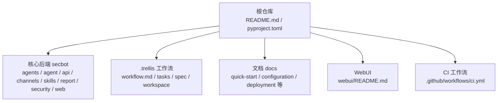
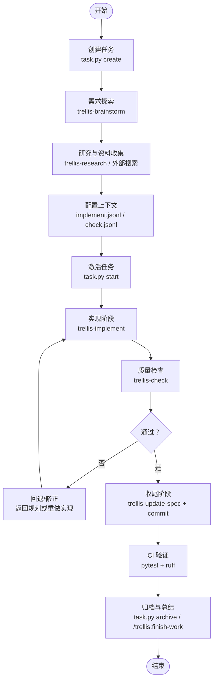
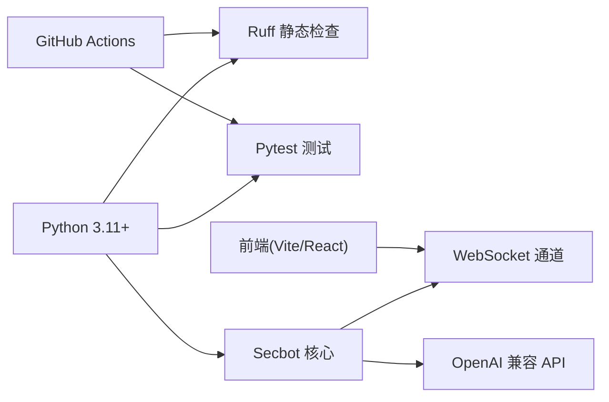

# 贡献流程与协作

<cite>
**本文引用的文件**
- [README.md](file://README.md)
- [pyproject.toml](file://pyproject.toml)
- [.trellis/workflow.md](file://.trellis/workflow.md)
- [AGENTS.md](file://AGENTS.md)
- [.github/workflows/ci.yml](file://.github/workflows/ci.yml)
- [webui/README.md](file://webui/README.md)
- [docs/README.md](file://docs/README.md)
</cite>

## 目录
1. [引言](#引言)
2. [项目结构](#项目结构)
3. [核心组件](#核心组件)
4. [架构总览](#架构总览)
5. [详细组件分析](#详细组件分析)
6. [依赖关系分析](#依赖关系分析)
7. [性能考虑](#性能考虑)
8. [故障排查指南](#故障排查指南)
9. [结论](#结论)
10. [附录](#附录)

## 引言
本文件面向贡献者与协作开发者，系统化梳理 VAPT3/secbot 的贡献流程与协作规范，覆盖以下方面：
- Git 工作流与分支策略、提交规范、合并请求流程
- Trellis 开发生命周期（任务创建、规划、执行、收尾）
- 代码审查流程（PR 创建、审查过程、反馈处理、合并条件）
- 开发环境搭建（依赖安装、IDE/编辑器配置、调试设置）
- 文档更新流程（代码注释、API 文档、用户文档）
- 问题报告与功能请求处理流程
- 社区协作最佳实践与沟通指南

## 项目结构
本项目采用“多模块分层 + 平台化工作流”的组织方式：
- 核心后端 secbot：多智能体编排、工具层、通道与 API、WebUI 静态资源等
- Trellis 工作流：任务系统、规范系统、工作区与上下文注入
- 文档与示例：用户文档、CLI 参考、部署与集成指南
- WebUI：React 前端与开发指南
- CI：跨平台测试矩阵与基础质量门禁

图表来源
- [README.md:259-276](file://README.md#L259-L276)
- [.trellis/workflow.md:15-75](file://.trellis/workflow.md#L15-L75)
- [docs/README.md:7-35](file://docs/README.md#L7-L35)
- [webui/README.md:1-136](file://webui/README.md#L1-L136)
- [.github/workflows/ci.yml:1-40](file://.github/workflows/ci.yml#L1-L40)

章节来源
- [README.md:259-276](file://README.md#L259-L276)
- [.trellis/workflow.md:15-75](file://.trellis/workflow.md#L15-L75)
- [docs/README.md:7-35](file://docs/README.md#L7-L35)
- [webui/README.md:1-136](file://webui/README.md#L1-L136)
- [.github/workflows/ci.yml:1-40](file://.github/workflows/ci.yml#L1-L40)

## 核心组件
- Git 与 CI：通过 GitHub Actions 实现跨操作系统与多 Python 版本的测试矩阵；使用 ruff 进行静态检查；pytest 运行测试套件
- Trellis 工作流：以任务为中心的四阶段工作流（规划、执行、收尾），结合子智能体与上下文注入，确保每次改动可追溯、可复现
- 开发者身份与工作区：每个贡献者拥有独立工作区，记录会话日志与知识沉淀
- 规范系统：按包与层级组织编码规范，作为实现与检查阶段的权威参考
- 文档体系：用户文档、CLI 参考、部署与集成指南，配合仓库内 README 与 docs 目录

章节来源
- [.github/workflows/ci.yml:1-40](file://.github/workflows/ci.yml#L1-L40)
- [.trellis/workflow.md:15-75](file://.trellis/workflow.md#L15-L75)
- [AGENTS.md:1-33](file://AGENTS.md#L1-L33)

## 架构总览
下图展示贡献流程与协作的关键环节：从任务创建到代码实现、质量检查、规范更新与提交归档，再到 CI 验证与文档同步。

图表来源
- [.trellis/workflow.md:158-213](file://.trellis/workflow.md#L158-L213)
- [.trellis/workflow.md:428-516](file://.trellis/workflow.md#L428-L516)
- [.trellis/workflow.md:518-603](file://.trellis/workflow.md#L518-L603)

章节来源
- [.trellis/workflow.md:158-213](file://.trellis/workflow.md#L158-L213)
- [.trellis/workflow.md:428-516](file://.trellis/workflow.md#L428-L516)
- [.trellis/workflow.md:518-603](file://.trellis/workflow.md#L518-L603)

## 详细组件分析

### Git 工作流与分支策略
- 分支策略
  - 主分支：稳定迭代，破坏性变更请使用特性分支
  - 同步上游：定期从上游仓库拉取并 rebase，保持 Agent Loop 的一致性
- 提交规范
  - 参考近期提交风格（前缀、语言、长度），遵循“功能/修复/文档/脚本”等分类
  - 提交粒度：按“一致变更单元”分批提交，避免混杂无关改动
- 合并请求（PR）流程
  - 使用 Trellis 任务驱动 PR：PR 与任务目录关联，便于追踪与归档
  - PR 创建：通过 Trellis 脚本生成，确保上下文与任务状态一致
  - 合并条件：通过 CI、代码审查与规范符合性检查；避免变基冲突

章节来源
- [README.md:284-289](file://README.md#L284-L289)
- [.trellis/workflow.md:70-72](file://.trellis/workflow.md#L70-L72)
- [.trellis/workflow.md:549-603](file://.trellis/workflow.md#L549-L603)

### Trellis 开发生命周期（任务驱动）
- 开发原则
  - 先计划再编码、规范注入而非记忆、持久化一切、增量开发、捕获学习
- 任务系统
  - 每个任务一个目录，包含 PRD、实现/检查上下文清单、研究资料与元数据
  - 生命周期命令：创建、启动、完成、归档、列表与查询
- 工作区与身份
  - 初始化开发者身份，生成个人工作区与会话日志
- 上下文注入
  - 通过 JSONL 文件注入规范与研究资料，保证子智能体具备完整上下文
- 子智能体与路由
  - 按意图加载相应技能：头脑风暴、实现、检查、研究、破局、更新规范
  - 平台差异：部分平台需要显式声明“活动任务”，以确保子智能体正确加载上下文

章节来源
- [.trellis/workflow.md:5-12](file://.trellis/workflow.md#L5-L12)
- [.trellis/workflow.md:40-75](file://.trellis/workflow.md#L40-L75)
- [.trellis/workflow.md:76-88](file://.trellis/workflow.md#L76-L88)
- [.trellis/workflow.md:221-238](file://.trellis/workflow.md#L221-L238)
- [AGENTS.md:19-32](file://AGENTS.md#L19-L32)

### 代码审查流程
- PR 创建
  - 通过 Trellis 任务生成 PR，确保任务状态与上下文一致
- 审查过程
  - 子智能体/人工共同参与：实现阶段侧重规范与设计一致性，检查阶段侧重质量门禁
  - 质量门禁：lint、类型检查、测试覆盖率与回归测试
- 反馈处理
  - 问题闭环：修复后重新检查，直至通过
- 合并条件
  - 无阻塞式问题、CI 通过、规范更新、提交信息规范、无强制变基冲突

章节来源
- [.trellis/workflow.md:432-516](file://.trellis/workflow.md#L432-L516)
- [.github/workflows/ci.yml:35-40](file://.github/workflows/ci.yml#L35-L40)
- [pyproject.toml:153-169](file://pyproject.toml#L153-L169)

### 开发环境搭建
- 后端环境
  - 安装与初始化：克隆仓库、可编辑安装、首次引导
  - 通道与端口：WebSocket 通道、健康检查端点、OpenAI 兼容 API 端口
  - 常见问题：通道未启用、启动入口选择错误导致连接失败
- 前端（WebUI）环境
  - 依赖安装：Bun/NPM 安装、开发服务器启动
  - 代理与端口：默认代理到后端网关端口，支持自定义端口
  - 多设备访问：配置 host 与令牌密钥，支持局域网联调
- IDE/编辑器配置
  - Python：Ruff 作为 linter，pytest 作为测试框架
  - TypeScript/React：Vite 开发体验，Tailwind 样式
- 调试设置
  - 后端：开启详细日志，验证通道与端点
  - 前端：确认代理与跨域，检查 WebSocket 升级

章节来源
- [README.md:76-179](file://README.md#L76-L179)
- [webui/README.md:28-111](file://webui/README.md#L28-L111)
- [pyproject.toml:145-169](file://pyproject.toml#L145-L169)

### 文档更新流程
- 代码注释与 API 文档
  - 保持与实现一致，遵循项目风格与类型标注
  - 通过 CI 的 lint 与类型检查保障一致性
- 用户文档与指南
  - docs 目录与 README 协同维护，发布前同步至网站
  - WebUI 开发文档与部署指南需与后端版本保持一致
- 规范与知识沉淀
  - Trellis 规范系统：将新发现的模式、约定与技术决策固化为规范
  - 任务归档：将经验教训写入规范，形成知识闭环

章节来源
- [.trellis/workflow.md:540-548](file://.trellis/workflow.md#L540-L548)
- [docs/README.md:7-35](file://docs/README.md#L7-L35)
- [webui/README.md:112-131](file://webui/README.md#L112-L131)
- [.github/workflows/ci.yml:35-36](file://.github/workflows/ci.yml#L35-L36)

### 问题报告与功能请求
- 问题报告
  - 提供最小复现步骤、环境信息（操作系统、Python 版本、相关配置）、期望与实际行为
  - 优先使用任务与 PR 追踪问题，便于回溯与验证
- 功能请求
  - 明确动机、影响面与验收标准
  - 建议先行在任务系统中沉淀 PRD 与研究资料，再进入实现阶段

章节来源
- [.trellis/workflow.md:286-425](file://.trellis/workflow.md#L286-L425)

### 社区协作最佳实践与沟通指南
- 严格遵循 Trellis 工作流，避免“绕过流程”的临时方案
- 子智能体等待与超时管理：确保子智能体完成后再继续或派发后续任务
- 平台适配：不同平台的上下文注入与命令可用性存在差异，遵循各平台的路由与加载规则
- 透明沟通：在 PR 与任务中清晰描述背景、变更与风险，便于审查与复核

章节来源
- [AGENTS.md:19-32](file://AGENTS.md#L19-L32)
- [.trellis/workflow.md:221-238](file://.trellis/workflow.md#L221-L238)

## 依赖关系分析
- 语言与工具链
  - Python >= 3.11，依赖管理与打包：pyproject.toml
  - 前端：Vite + React + TypeScript + Tailwind
- 质量与测试
  - Ruff：静态检查
  - Pytest：测试执行
  - CI：跨 OS 与多 Python 版本矩阵
- 通道与接口
  - WebSocket 通道：用于 WebUI 与后端通信
  - OpenAI 兼容 API：用于第三方平台集成

图表来源
- [pyproject.toml:25-68](file://pyproject.toml#L25-L68)
- [pyproject.toml:145-169](file://pyproject.toml#L145-L169)
- [.github/workflows/ci.yml:17-40](file://.github/workflows/ci.yml#L17-L40)
- [README.md:113-179](file://README.md#L113-L179)

章节来源
- [pyproject.toml:25-68](file://pyproject.toml#L25-L68)
- [pyproject.toml:145-169](file://pyproject.toml#L145-L169)
- [.github/workflows/ci.yml:17-40](file://.github/workflows/ci.yml#L17-L40)
- [README.md:113-179](file://README.md#L113-L179)

## 性能考虑
- 代码体积与加载
  - 通过规范与上下文注入减少重复计算，提升子智能体效率
- 测试与构建
  - 利用 CI 的并行矩阵加速多版本验证
- 前端开发体验
  - Vite 热更新与代理机制降低联调成本

## 故障排查指南
- 后端通道问题
  - 确认 WebSocket 通道已启用，端口与主机配置正确
  - 验证健康检查端点与 WebSocket 升级路径
- 前端联调问题
  - 检查代理配置与端口映射，确认跨域与升级成功
  - 多设备访问需配置 host 与令牌密钥
- CI 失败
  - 检查最近提交风格与 lint 规则，确保类型检查与测试通过
- Trellis 任务异常
  - 确认活动任务指针与上下文注入是否正确
  - 子智能体未完成即继续可能引发后续步骤缺失

章节来源
- [README.md:129-179](file://README.md#L129-L179)
- [webui/README.md:55-111](file://webui/README.md#L55-L111)
- [.github/workflows/ci.yml:35-40](file://.github/workflows/ci.yml#L35-L40)
- [.trellis/workflow.md:180-191](file://.trellis/workflow.md#L180-L191)

## 结论
本文件将 Git 工作流、Trellis 开发生命周期、代码审查、开发环境与文档维护整合为一套可执行的协作规范。建议所有贡献者在每次改动前先创建任务、沉淀 PRD 与研究资料，随后按阶段推进实现与检查，最后通过规范更新与提交归档形成闭环。配合 CI 与质量门禁，确保变更的稳定性与可追溯性。

## 附录
- 相关链接
  - 产品需求与开发规范：README 中的“产品需求”与“.trellis/workflow.md”
  - 用户文档与 CLI 参考：docs 目录与 docs/README.md
  - WebUI 开发指南：webui/README.md
  - CI 工作流：.github/workflows/ci.yml