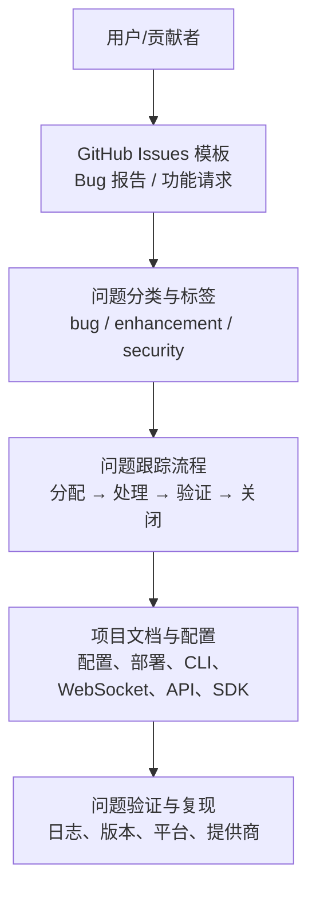
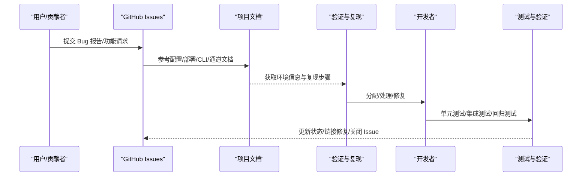
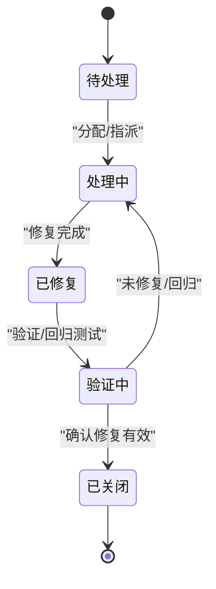
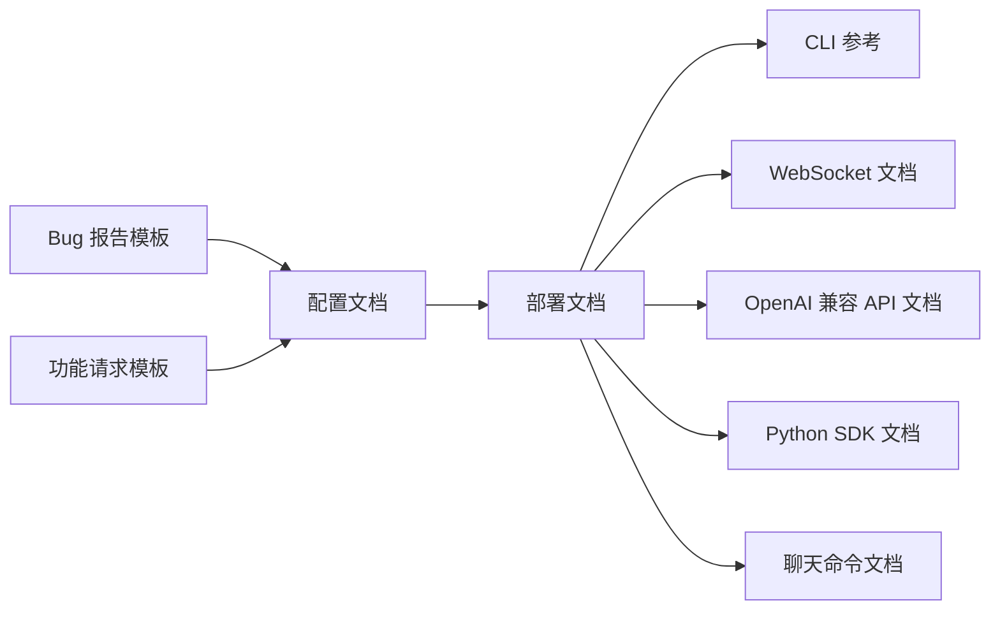

# 问题报告指南

<cite>
**本文引用的文件**
- [README.md](file://README.md)
- [.github/ISSUE_TEMPLATE/bug_report.yml](file://.github/ISSUE_TEMPLATE/bug_report.yml)
- [.github/ISSUE_TEMPLATE/feature_request.yml](file://.github/ISSUE_TEMPLATE/feature_request.yml)
- [docs/configuration.md](file://docs/configuration.md)
- [docs/deployment.md](file://docs/deployment.md)
- [docs/cli-reference.md](file://docs/cli-reference.md)
- [docs/websocket.md](file://docs/websocket.md)
- [docs/openai-api.md](file://docs/openai-api.md)
- [docs/python-sdk.md](file://docs/python-sdk.md)
- [docs/chat-commands.md](file://docs/chat-commands.md)
</cite>

## 目录
1. [简介](#简介)
2. [项目结构](#项目结构)
3. [核心组件](#核心组件)
4. [架构总览](#架构总览)
5. [详细组件分析](#详细组件分析)
6. [依赖关系分析](#依赖关系分析)
7. [性能考虑](#性能考虑)
8. [故障排查指南](#故障排查指南)
9. [结论](#结论)
10. [附录](#附录)

## 简介
本指南面向 VAPT3（secbot）项目的贡献者与用户，提供标准化的问题报告与功能请求流程，涵盖以下内容：
- Bug 报告模板：重现步骤、预期行为、实际行为、环境信息
- 功能请求流程：需求描述、使用场景、优先级评估
- 安全漏洞报告：敏感信息处理、报告渠道、响应时间
- 问题分类与标签规范、优先级评估方法
- 问题跟踪流程（分配、处理、验证、关闭）与状态更新要求
- 最佳实践、常见问题模板、自动化工具使用建议

## 项目结构
VAPT3 是一个基于大模型的对话式多智能体网络安全协作系统，具备 WebUI、WebSocket 通道、OpenAI 兼容 API、CLI 等多种接入方式。问题报告与跟踪应结合项目文档与模板进行。

**图表来源**
- [.github/ISSUE_TEMPLATE/bug_report.yml:1-136](file://.github/ISSUE_TEMPLATE/bug_report.yml#L1-L136)
- [.github/ISSUE_TEMPLATE/feature_request.yml:1-56](file://.github/ISSUE_TEMPLATE/feature_request.yml#L1-L56)
- [docs/configuration.md:1-800](file://docs/configuration.md#L1-L800)
- [docs/deployment.md:1-171](file://docs/deployment.md#L1-L171)
- [docs/cli-reference.md:1-22](file://docs/cli-reference.md#L1-L22)
- [docs/websocket.md:1-397](file://docs/websocket.md#L1-L397)
- [docs/openai-api.md:1-122](file://docs/openai-api.md#L1-L122)
- [docs/python-sdk.md:1-220](file://docs/python-sdk.md#L1-L220)

**章节来源**
- [README.md:1-298](file://README.md#L1-L298)

## 核心组件
- 问题模板：GitHub Issues 中的 Bug 报告与功能请求模板，定义必填字段与引导性问题，便于快速定位与复现。
- 项目文档：配置、部署、CLI、WebSocket、OpenAI 兼容 API、Python SDK、聊天命令等，支撑问题复现与验证。
- 问题跟踪：基于标签（bug、enhancement 等）与流程（分配、处理、验证、关闭）进行闭环管理。

**章节来源**
- [.github/ISSUE_TEMPLATE/bug_report.yml:1-136](file://.github/ISSUE_TEMPLATE/bug_report.yml#L1-L136)
- [.github/ISSUE_TEMPLATE/feature_request.yml:1-56](file://.github/ISSUE_TEMPLATE/feature_request.yml#L1-L56)
- [docs/configuration.md:1-800](file://docs/configuration.md#L1-L800)
- [docs/deployment.md:1-171](file://docs/deployment.md#L1-L171)
- [docs/cli-reference.md:1-22](file://docs/cli-reference.md#L1-L22)
- [docs/websocket.md:1-397](file://docs/websocket.md#L1-L397)
- [docs/openai-api.md:1-122](file://docs/openai-api.md#L1-L122)
- [docs/python-sdk.md:1-220](file://docs/python-sdk.md#L1-L220)
- [docs/chat-commands.md:1-51](file://docs/chat-commands.md#L1-L51)

## 架构总览
问题报告与处理在项目中的流转路径如下：

**图表来源**
- [.github/ISSUE_TEMPLATE/bug_report.yml:1-136](file://.github/ISSUE_TEMPLATE/bug_report.yml#L1-L136)
- [.github/ISSUE_TEMPLATE/feature_request.yml:1-56](file://.github/ISSUE_TEMPLATE/feature_request.yml#L1-L56)
- [docs/configuration.md:1-800](file://docs/configuration.md#L1-L800)
- [docs/deployment.md:1-171](file://docs/deployment.md#L1-L171)
- [docs/cli-reference.md:1-22](file://docs/cli-reference.md#L1-L22)
- [docs/websocket.md:1-397](file://docs/websocket.md#L1-L397)
- [docs/openai-api.md:1-122](file://docs/openai-api.md#L1-L122)
- [docs/python-sdk.md:1-220](file://docs/python-sdk.md#L1-L220)

## 详细组件分析

### Bug 报告模板与最佳实践
- 必填字段
  - 问题描述：清晰描述发生了什么。
  - 重现步骤：如何复现该问题（最小化步骤）。
  - 预期行为：期望发生的结果。
  - 相关日志：附上调试日志（建议开启调试级别），并脱敏敏感信息。
  - 版本信息：项目版本与 Python 版本。
  - 操作系统与平台：Windows/macOS/Linux/Docker/Other。
  - 通道/平台：Weixin/WeCom/Feishu/DingTalk/Telegram/Discord/Slack/QQ/WhatsApp/Email/MS Teams/Matrix/WebSocket/API Server/Other。
  - LLM 提供商：OpenAI、Anthropic、DeepSeek、Google、Ollama、OpenRouter、Azure OpenAI、Other。
  - 配置（可选）：脱敏后的配置片段。
  - 其他上下文：截图、附加信息。
- 最佳实践
  - 使用“最小可行复现”步骤，避免无关细节。
  - 明确区分预期与实际行为，必要时提供对比截图或日志片段。
  - 在日志中包含时间戳与关键事件，便于回溯。
  - 若涉及安全敏感信息，务必脱敏后再提交。

**章节来源**
- [.github/ISSUE_TEMPLATE/bug_report.yml:1-136](file://.github/ISSUE_TEMPLATE/bug_report.yml#L1-L136)

### 功能请求流程与优先级评估
- 需求描述：明确要解决的问题与动机。
- 使用场景：具体场景与用户价值。
- 提案方案：期望的行为与交互方式。
- 替代方案：已考虑的其他实现路径。
- 相关组件：通道、LLM 提供商、Agent/提示词、技能/插件、配置、CLI、API 服务器、文档、其他。
- 优先级评估方法
  - 影响面：影响用户数量与使用频率。
  - 实现复杂度：技术难度与工作量。
  - 依赖关系：是否依赖上游或第三方能力。
  - 安全与合规：是否涉及安全护栏或授权要求。
  - 与项目目标一致性：是否符合 VAPT3 的核心目标（对话即调度、专家智能体池、高危动作护栏、CMDB 资产库、报告生成、海蓝主题 WebUI、沿用 nanobot 通道）。

**章节来源**
- [.github/ISSUE_TEMPLATE/feature_request.yml:1-56](file://.github/ISSUE_TEMPLATE/feature_request.yml#L1-L56)
- [README.md:19-75](file://README.md#L19-L75)

### 安全漏洞报告
- 敏感信息处理
  - 不要在公开渠道（Issues、论坛、邮件）披露漏洞细节。
  - 仅在受控环境下复现，避免扩大影响面。
  - 日志与配置中务必脱敏，包括但不限于 API 密钥、令牌、密码、目标地址等。
- 报告渠道
  - 优先通过私信或受保护的沟通渠道联系维护者。
  - 若无可用渠道，可在 Issues 中以“安全相关”为标签提交，但不要附带细节。
- 响应时间
  - 一般情况下应在 1–3 个工作日内确认收到，7–14 个工作日内给出修复计划或缓解措施。
  - 严重级别（如可能导致数据泄露、远程执行）将优先处理并在 24–48 小时内响应。

**章节来源**
- [README.md:239-246](file://README.md#L239-L246)
- [docs/configuration.md:10-44](file://docs/configuration.md#L10-L44)

### 问题分类与标签使用规范
- 标签
  - bug：功能异常、崩溃、不符合预期行为。
  - enhancement：新功能、改进、优化。
  - documentation：文档错误、缺失、不清晰。
  - security：安全相关问题。
  - question：需要澄清的问题。
  - invalid：无效或重复的 Issue。
  - help wanted：欢迎贡献者协助。
- 使用建议
  - Bug 报告默认打 bug 标签；功能请求默认打 enhancement 标签。
  - 文档类问题打 documentation 标签。
  - 安全问题打 security 标签并私下沟通。

**章节来源**
- [.github/ISSUE_TEMPLATE/bug_report.yml:3](file://.github/ISSUE_TEMPLATE/bug_report.yml#L3)
- [.github/ISSUE_TEMPLATE/feature_request.yml:3](file://.github/ISSUE_TEMPLATE/feature_request.yml#L3)

### 优先级评估方法
- P0（致命）：导致系统不可用、数据丢失、安全风险暴露。
- P1（高）：影响核心功能、大量用户、关键业务流程。
- P2（中）：影响部分功能、个别用户、体验问题。
- P3（低）：界面微小问题、拼写错误、非关键建议。
- 评估维度
  - 影响范围与严重程度
  - 用户规模与使用频率
  - 修复成本与风险
  - 是否存在临时缓解方案

[本节为通用方法论，不直接分析具体文件]

### 问题跟踪流程（分配、处理、验证、关闭）
- 分配：根据标签与组件归属，指派给相应维护者或团队。
- 处理：记录进展、更新状态、必要时请求复现信息。
- 验证：维护者或报告者在一致环境下验证修复效果。
- 关闭：确认问题已解决并关闭 Issue；若未解决则转回处理阶段。

[本图为概念流程图，不直接映射具体源码文件]

### 状态更新要求
- 每次状态变更需附带简要说明与证据（日志、截图、复现步骤）。
- 若长时间无进展，应主动更新“最近状态”以保持透明度。
- 重要里程碑（如修复 PR 链接、测试通过、发布版本）需在评论中标注。

[本节为通用流程规范，不直接分析具体文件]

### 常见问题模板
- Bug 报告模板（路径参考）
  - [Bug 报告模板字段定义:10-136](file://.github/ISSUE_TEMPLATE/bug_report.yml#L10-L136)
- 功能请求模板（路径参考）
  - [功能请求模板字段定义:10-56](file://.github/ISSUE_TEMPLATE/feature_request.yml#L10-L56)

**章节来源**
- [.github/ISSUE_TEMPLATE/bug_report.yml:10-136](file://.github/ISSUE_TEMPLATE/bug_report.yml#L10-L136)
- [.github/ISSUE_TEMPLATE/feature_request.yml:10-56](file://.github/ISSUE_TEMPLATE/feature_request.yml#L10-L56)

### 自动化工具与实用信息
- 配置与密钥管理
  - 使用环境变量引用密钥，避免硬编码在配置文件中。
  - systemd 部署时通过 EnvironmentFile 加载密钥文件。
- 部署与运行
  - Docker 与 systemd 用户服务两种常用方式，注意权限与持久化目录映射。
- 接入方式
  - CLI：交互式聊天、单次命令、查看状态。
  - WebSocket：实时双向通信、流式输出、令牌鉴权、多聊天复用。
  - OpenAI 兼容 API：本地集成、文件上传、会话隔离。
  - Python SDK：作为库使用、会话隔离、钩子观察生命周期。
- 聊天命令
  - /new、/stop、/restart、/status、/dream、/model 等，便于调试与运维。

**章节来源**
- [docs/configuration.md:10-44](file://docs/configuration.md#L10-L44)
- [docs/deployment.md:47-93](file://docs/deployment.md#L47-L93)
- [docs/cli-reference.md:3-22](file://docs/cli-reference.md#L3-L22)
- [docs/websocket.md:15-80](file://docs/websocket.md#L15-L80)
- [docs/openai-api.md:12-38](file://docs/openai-api.md#L12-L38)
- [docs/python-sdk.md:63-93](file://docs/python-sdk.md#L63-L93)
- [docs/chat-commands.md:5-18](file://docs/chat-commands.md#L5-L18)

## 依赖关系分析
问题报告与处理依赖于文档与配置的一致性，以及接入方式的稳定性。

**图表来源**
- [.github/ISSUE_TEMPLATE/bug_report.yml:1-136](file://.github/ISSUE_TEMPLATE/bug_report.yml#L1-L136)
- [.github/ISSUE_TEMPLATE/feature_request.yml:1-56](file://.github/ISSUE_TEMPLATE/feature_request.yml#L1-L56)
- [docs/configuration.md:1-800](file://docs/configuration.md#L1-L800)
- [docs/deployment.md:1-171](file://docs/deployment.md#L1-L171)
- [docs/cli-reference.md:1-22](file://docs/cli-reference.md#L1-L22)
- [docs/websocket.md:1-397](file://docs/websocket.md#L1-L397)
- [docs/openai-api.md:1-122](file://docs/openai-api.md#L1-L122)
- [docs/python-sdk.md:1-220](file://docs/python-sdk.md#L1-L220)
- [docs/chat-commands.md:1-51](file://docs/chat-commands.md#L1-L51)

**章节来源**
- [docs/configuration.md:1-800](file://docs/configuration.md#L1-L800)
- [docs/deployment.md:1-171](file://docs/deployment.md#L1-L171)
- [docs/cli-reference.md:1-22](file://docs/cli-reference.md#L1-L22)
- [docs/websocket.md:1-397](file://docs/websocket.md#L1-L397)
- [docs/openai-api.md:1-122](file://docs/openai-api.md#L1-L122)
- [docs/python-sdk.md:1-220](file://docs/python-sdk.md#L1-L220)
- [docs/chat-commands.md:1-51](file://docs/chat-commands.md#L1-L51)

## 性能考虑
- 日志级别：在复现问题时开启调试日志，有助于快速定位瓶颈与异常。
- 并发与资源：WebSocket 与 API 服务器在高并发场景下需关注连接数、消息大小限制与超时设置。
- 依赖与版本：确保使用的 LLM 提供商、通道与工具版本与项目文档一致，避免因版本差异导致的性能退化。

[本节提供通用指导，不直接分析具体文件]

## 故障排查指南
- 常见问题定位
  - 配置错误：检查配置文件中的提供商、通道、模型设置，确保密钥与基础地址正确。
  - 权限问题：Docker 部署时注意宿主机目录权限与用户 UID/GID；systemd 服务需正确加载密钥文件。
  - 通道不可达：WebSocket 与 API 服务器需确认绑定地址、端口与防火墙策略。
- 验证步骤
  - 使用 CLI 进行最小化复现，逐步增加复杂度。
  - 通过 WebSocket 或 OpenAI 兼容 API 进行端到端验证。
  - 使用 Python SDK 进行程序化验证与回归测试。
- 回归测试
  - 在修复后，使用相同环境与配置进行回归测试，确保问题不再出现。

**章节来源**
- [docs/configuration.md:10-44](file://docs/configuration.md#L10-L44)
- [docs/deployment.md:47-93](file://docs/deployment.md#L47-L93)
- [docs/websocket.md:15-80](file://docs/websocket.md#L15-L80)
- [docs/openai-api.md:12-38](file://docs/openai-api.md#L12-L38)
- [docs/python-sdk.md:63-93](file://docs/python-sdk.md#L63-L93)

## 结论
通过标准化的问题报告模板、清晰的功能请求流程、严格的分类与优先级评估、规范的问题跟踪流程与状态更新要求，以及完善的自动化工具与实用信息，VAPT3 项目可以高效地收集、处理与解决各类问题，持续提升系统的稳定性与用户体验。

[本节为总结性内容，不直接分析具体文件]

## 附录
- 快速参考
  - 配置与密钥：[配置文档:1-800](file://docs/configuration.md#L1-L800)
  - 部署与服务：[部署文档:1-171](file://docs/deployment.md#L1-L171)
  - CLI 命令：[CLI 参考:1-22](file://docs/cli-reference.md#L1-L22)
  - WebSocket 通道：[WebSocket 文档:1-397](file://docs/websocket.md#L1-L397)
  - OpenAI 兼容 API：[OpenAI 兼容 API 文档:1-122](file://docs/openai-api.md#L1-L122)
  - Python SDK：[Python SDK 文档:1-220](file://docs/python-sdk.md#L1-L220)
  - 聊天命令：[聊天命令文档:1-51](file://docs/chat-commands.md#L1-L51)

[本节为索引性内容，不直接分析具体文件]