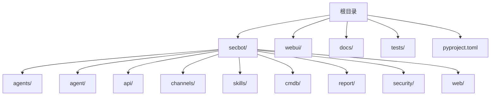
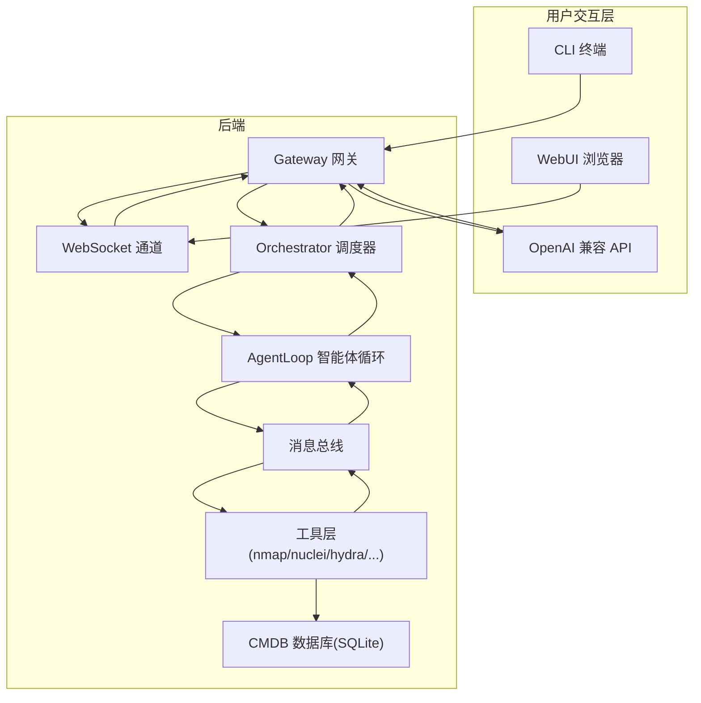
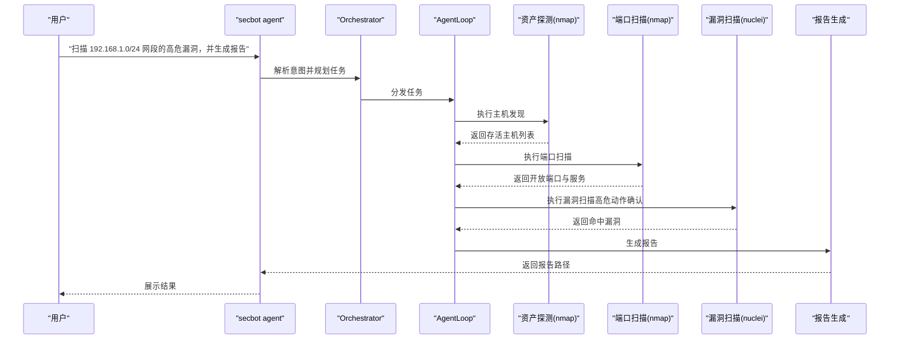
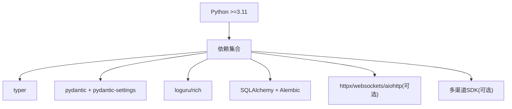

# 快速开始

<cite>
**本文引用的文件**
- [README.md](file://README.md)
- [docs/quick-start.md](file://docs/quick-start.md)
- [docs/configuration.md](file://docs/configuration.md)
- [docs/openai-api.md](file://docs/openai-api.md)
- [docs/cli-reference.md](file://docs/cli-reference.md)
- [webui/README.md](file://webui/README.md)
- [pyproject.toml](file://pyproject.toml)
- [secbot/__main__.py](file://secbot/__main__.py)
- [secbot/cli/commands.py](file://secbot/cli/commands.py)
- [secbot/config/schema.py](file://secbot/config/schema.py)
- [secbot/api/server.py](file://secbot/api/server.py)
- [secbot/channels/websocket.py](file://secbot/channels/websocket.py)
- [secbot/skills/nmap-host-discovery/SKILL.md](file://secbot/skills/nmap-host-discovery/SKILL.md)
- [secbot/skills/nmap-port-scan/SKILL.md](file://secbot/skills/nmap-port-scan/SKILL.md)
- [secbot/skills/nuclei-template-scan/SKILL.md](file://secbot/skills/nuclei-template-scan/SKILL.md)
</cite>

## 目录
1. [简介](#简介)
2. [项目结构](#项目结构)
3. [核心组件](#核心组件)
4. [架构总览](#架构总览)
5. [详细组件分析](#详细组件分析)
6. [依赖分析](#依赖分析)
7. [性能考虑](#性能考虑)
8. [故障排查指南](#故障排查指南)
9. [结论](#结论)
10. [附录](#附录)

## 简介
本指南面向首次使用者，帮助你在约30分钟内完成 VAPT3/secbot 的安装、配置与首次安全评估任务。内容覆盖：
- 环境要求与依赖安装
- 底层安全工具（nmap、nuclei、hydra 等）的准备
- 初始化配置（配置文件、AI 提供商 apiKey、通道设置）
- 三种启动方式：CLI 直连、OpenAI 兼容 API、WebUI 网关
- 端口与验证方法、常见问题排查
- 面向不同场景的命令示例与预期输出

## 项目结构
仓库采用“功能模块化 + 分层架构”的组织方式，核心目录与职责如下：
- secbot/：后端核心（Agent、工具、通道、API、报告、CMDB 等）
- webui/：React 前端（WebUI）
- docs/：官方文档
- tests/：单元与集成测试
- 其他：Dockerfile、docker-compose.yml、entrypoint.sh 等

章节来源
- [README.md:29-53](file://README.md#L29-L53)
- [README.md:259-275](file://README.md#L259-L275)

## 核心组件
- 专家智能体：资产探测、端口扫描、漏洞扫描、弱口令检测、报告生成
- 工具层：nmap、nuclei、hydra、fscan、自研脚本等
- 通道层：WebSocket 通道、OpenAI 兼容 API、WebUI
- 调度编排：Orchestrator 动态规划 + Function Calling
- CMDB：SQLite + SQLAlchemy + Alembic 迁移，统一管理资产、漏洞、任务

章节来源
- [README.md:64-74](file://README.md#L64-L74)
- [README.md:29-53](file://README.md#L29-L53)

## 架构总览
下图展示从用户交互到工具执行的端到端路径，以及 WebUI 与后端的协作关系。

图表来源
- [README.md:29-53](file://README.md#L29-L53)
- [secbot/channels/websocket.py:119-195](file://secbot/channels/websocket.py#L119-L195)
- [secbot/api/server.py:1-200](file://secbot/api/server.py#L1-L200)

## 详细组件分析

### 1. 环境要求与依赖安装
- Python 版本：3.11 及以上
- 安装方式：推荐源码安装以获取最新特性；或使用 uv、PyPI 稳定版本
- 可选依赖：OpenAI 兼容 API 服务需要额外安装 aiohttp

章节来源
- [pyproject.toml:6](file://pyproject.toml#L6)
- [docs/quick-start.md:10-28](file://docs/quick-start.md#L10-L28)

### 2. 底层安全工具准备
- nmap：主机发现与端口扫描
- nuclei：模板化漏洞扫描
- hydra：弱口令爆破
- 其他：fscan、自研脚本
- 工具最小版本与风险等级在各技能元数据中声明

章节来源
- [secbot/skills/nmap-host-discovery/SKILL.md:1-36](file://secbot/skills/nmap-host-discovery/SKILL.md#L1-L36)
- [secbot/skills/nmap-port-scan/SKILL.md:1-16](file://secbot/skills/nmap-port-scan/SKILL.md#L1-L16)
- [secbot/skills/nuclei-template-scan/SKILL.md:1-17](file://secbot/skills/nuclei-template-scan/SKILL.md#L1-L17)

### 3. 初始化配置
- 初始化：运行 onboard 创建默认配置与工作区
- 编辑配置：在用户主目录下的配置文件中设置 providers、agents、channels
- 示例配置要点：
  - providers：填写任一提供商的 apiKey
  - agents.defaults：设置默认 provider 与 model
  - channels.websocket：启用并配置 host/port

章节来源
- [README.md:88-109](file://README.md#L88-L109)
- [docs/configuration.md:45-88](file://docs/configuration.md#L45-L88)
- [docs/configuration.md:667-710](file://docs/configuration.md#L667-L710)

### 4. 三种启动方式与端口

#### 4.1 CLI 直连（终端交互）
- 命令：secbot agent
- 适用：快速冒烟、本地调试
- 注意：无需额外端口，直接在终端交互

章节来源
- [README.md:117-125](file://README.md#L117-L125)
- [docs/cli-reference.md:8-11](file://docs/cli-reference.md#L8-L11)

#### 4.2 OpenAI 兼容 API（可选）
- 命令：secbot serve [-p 端口]
- 默认端口：8000（可在配置中调整）
- 适用：嵌入第三方平台，不为 WebUI 服务
- 要求：默认模型对应的 provider 已配置 apiKey

章节来源
- [README.md:118-178](file://README.md#L118-L178)
- [docs/openai-api.md:1-122](file://docs/openai-api.md#L1-L122)
- [secbot/config/schema.py:182-188](file://secbot/config/schema.py#L182-L188)

#### 4.3 WebUI 网关（推荐）
- 命令：secbot gateway [-v]
- 默认端口：18790（健康检查）+ 8765（WebSocket 通道）
- 适用：WebUI 交互、实时查看执行过程
- 前端：webui 目录下使用 bun/npm 启动开发服务器，代理到后端端口

章节来源
- [README.md:119-170](file://README.md#L119-L170)
- [webui/README.md:63-89](file://webui/README.md#L63-L89)
- [secbot/config/schema.py:190-196](file://secbot/config/schema.py#L190-L196)

### 5. 端口验证与预期输出

#### 5.1 WebUI 网关验证
- 健康检查：访问 http://127.0.0.1:18790/health
- WebSocket 引导：访问 http://127.0.0.1:8765/webui/bootstrap
- 预期返回：包含 token、ws_path、过期时间等字段

章节来源
- [README.md:143-157](file://README.md#L143-L157)

#### 5.2 OpenAI 兼容 API 验证
- 端点：http://127.0.0.1:8000/v1/chat/completions
- 请求：单条用户消息，可选 session_id
- 响应：标准 OpenAI 格式，或 SSE 流式响应

章节来源
- [docs/openai-api.md:33-48](file://docs/openai-api.md#L33-L48)
- [secbot/api/server.py:194-200](file://secbot/api/server.py#L194-L200)

### 6. 首次安全评估任务示例
以下为一次典型对话的预期流程（从资产探测到报告生成）。实际输出以终端显示为准。

图表来源
- [README.md:180-191](file://README.md#L180-L191)
- [secbot/skills/nmap-host-discovery/SKILL.md:14-36](file://secbot/skills/nmap-host-discovery/SKILL.md#L14-L36)
- [secbot/skills/nmap-port-scan/SKILL.md:14-16](file://secbot/skills/nmap-port-scan/SKILL.md#L14-L16)
- [secbot/skills/nuclei-template-scan/SKILL.md:13-17](file://secbot/skills/nuclei-template-scan/SKILL.md#L13-L17)

## 依赖分析
- Python 版本：>=3.11
- 核心依赖：typer、pydantic、anthropic、loguru、rich、SQLAlchemy、Alembic 等
- 可选依赖：aiohttp（OpenAI 兼容 API）、多种聊天渠道 SDK

图表来源
- [pyproject.toml:25-68](file://pyproject.toml#L25-L68)
- [pyproject.toml:70-111](file://pyproject.toml#L70-L111)

章节来源
- [pyproject.toml:6](file://pyproject.toml#L6)
- [pyproject.toml:25-68](file://pyproject.toml#L25-L68)

## 性能考虑
- 工具执行耗时：技能元数据标注了预计运行时间，便于任务规划
- 并发与重试：通道层具备发送重试策略，避免瞬时失败导致的消息丢失
- 会话与历史：支持统一会话与消息上限控制，平衡上下文长度与性能

章节来源
- [secbot/skills/nmap-host-discovery/SKILL.md:10](file://secbot/skills/nmap-host-discovery/SKILL.md#L10)
- [secbot/skills/nmap-port-scan/SKILL.md:10](file://secbot/skills/nmap-port-scan/SKILL.md#L10)
- [secbot/skills/nuclei-template-scan/SKILL.md:9](file://secbot/skills/nuclei-template-scan/SKILL.md#L9)
- [docs/configuration.md:712-731](file://docs/configuration.md#L712-L731)

## 故障排查指南
- WebUI 无法连接
  - 确认已启用 WebSocket 通道且端口正确
  - 确认 gateway 已启动并打印健康检查与 WebSocket 监听信息
  - 前端代理地址与后端端口一致
- OpenAI 兼容 API 启动报错
  - 确保已安装 aiohttp（可选依赖）
  - 确认默认模型对应 provider 已配置 apiKey
- 低权限或网络受限
  - 工具调用受安全限制，需在允许范围内执行
  - 如需本地模型，可配置 Ollama/LM Studio 等本地 provider

章节来源
- [README.md:169-170](file://README.md#L169-L170)
- [docs/openai-api.md:5-8](file://docs/openai-api.md#L5-L8)
- [docs/configuration.md:448-476](file://docs/configuration.md#L448-L476)

## 结论
通过本指南，你可以在半小时内完成 secbot 的安装、配置与首次评估任务。建议优先使用 WebUI 网关体验完整的交互流程，再根据需要接入 OpenAI 兼容 API 或 CLI 直连模式。

## 附录

### A. 常用命令清单
- 安装与更新：参考安装文档
- 初始化：secbot onboard
- CLI 交互：secbot agent
- OpenAI 兼容 API：secbot serve -p 8000
- WebUI 网关：secbot gateway -v
- 健康检查：curl http://127.0.0.1:18790/health
- WebSocket 引导：curl http://127.0.0.1:8765/webui/bootstrap

章节来源
- [docs/cli-reference.md:3-21](file://docs/cli-reference.md#L3-L21)
- [README.md:117-170](file://README.md#L117-L170)

### B. 配置文件关键项
- providers：apiKey、apiBase、extraHeaders/extraBody
- agents.defaults：model、provider、温度、上下文窗口等
- channels.websocket：enabled、host、port、token、token_issue_secret

章节来源
- [docs/configuration.md:45-88](file://docs/configuration.md#L45-L88)
- [docs/configuration.md:667-710](file://docs/configuration.md#L667-L710)
- [secbot/config/schema.py:182-196](file://secbot/config/schema.py#L182-L196)