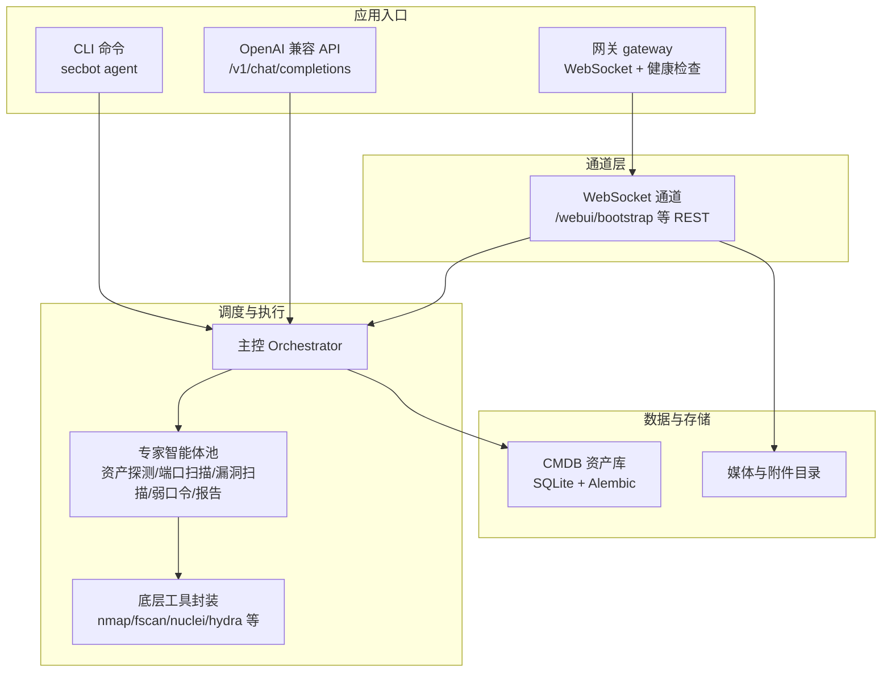
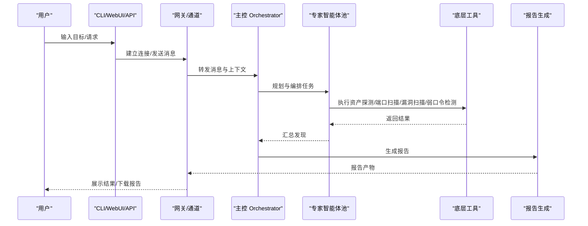
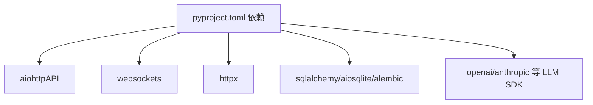

# 快速开始

<cite>
**本文引用的文件**
- [README.md](file://README.md)
- [docs/quick-start.md](file://docs/quick-start.md)
- [docs/configuration.md](file://docs/configuration.md)
- [docs/openai-api.md](file://docs/openai-api.md)
- [docs/websocket.md](file://docs/websocket.md)
- [docs/deployment.md](file://docs/deployment.md)
- [docs/cli-reference.md](file://docs/cli-reference.md)
- [pyproject.toml](file://pyproject.toml)
- [docker-compose.yml](file://docker-compose.yml)
- [Dockerfile](file://Dockerfile)
- [secbot/__main__.py](file://secbot/__main__.py)
- [secbot/cli/commands.py](file://secbot/cli/commands.py)
- [secbot/cli/onboard.py](file://secbot/cli/onboard.py)
- [secbot/api/server.py](file://secbot/api/server.py)
- [secbot/channels/websocket.py](file://secbot/channels/websocket.py)
</cite>

## 目录
1. [简介](#简介)
2. [项目结构](#项目结构)
3. [核心组件](#核心组件)
4. [架构总览](#架构总览)
5. [详细组件分析](#详细组件分析)
6. [依赖分析](#依赖分析)
7. [性能考虑](#性能考虑)
8. [故障排除指南](#故障排除指南)
9. [结论](#结论)
10. [附录](#附录)

## 简介
本指南面向首次接触 nanobot VAPT3 的用户，帮助你在约 30 分钟内完成安装、初始化配置与启动，体验一次完整的 VAPT 扫描对话，并生成报告。内容覆盖：
- 环境准备与依赖安装
- 项目克隆与安装
- 初始化配置（API 密钥、代理、通道）
- 三种启动方式：CLI 直连、OpenAI 兼容 API、WebUI 网关
- 端口与环境变量说明
- 常见问题排查
- 一次典型 VAPT 对话示例与验证步骤

## 项目结构
VAPT3 基于 nanobot 的轻量 Agent Loop，围绕“主控 Orchestrator + 可插拔专家智能体池”构建，支持 CLI、WebSocket 网关与 OpenAI 兼容 API 三种接入方式；WebUI 通过 WebSocket 通道提供前端交互。

图表来源
- [README.md:29-53](file://README.md#L29-L53)
- [docs/websocket.md:15-47](file://docs/websocket.md#L15-L47)
- [docs/openai-api.md:3-8](file://docs/openai-api.md#L3-L8)

章节来源
- [README.md:29-53](file://README.md#L29-L53)
- [docs/websocket.md:15-47](file://docs/websocket.md#L15-L47)
- [docs/openai-api.md:3-8](file://docs/openai-api.md#L3-L8)

## 核心组件
- CLI 命令入口：提供 onboard 初始化、agent 交互、serve API、gateway 网关等命令。
- 配置系统：集中于 ~/.secbot/config.json，支持 Provider、Channel、Tools、Agents 等配置项。
- 通道系统：WebSocket 通道负责网关与 WebUI 的双向通信；OpenAI 兼容 API 提供 HTTP 接口。
- 专家智能体：资产探测、端口扫描、漏洞扫描、弱口令检测、报告生成等。
- 底层工具：通过技能封装调用 nmap、fscan、nuclei、hydra 等外部工具。
- CMDB：SQLite + SQLAlchemy + Alembic，统一管理资产、端口、漏洞与任务。

章节来源
- [docs/cli-reference.md:3-21](file://docs/cli-reference.md#L3-L21)
- [docs/configuration.md:3-27](file://docs/configuration.md#L3-L27)
- [README.md:64-74](file://README.md#L64-L74)

## 架构总览
下图展示了从用户输入到最终报告生成的端到端流程，涵盖 CLI、WebSocket 网关与 OpenAI 兼容 API 三种入口。

图表来源
- [README.md:180-191](file://README.md#L180-L191)
- [docs/websocket.md:84-142](file://docs/websocket.md#L84-L142)
- [docs/openai-api.md:12-31](file://docs/openai-api.md#L12-L31)

## 详细组件分析

### 安装与环境准备
- Python 版本要求：≥ 3.11
- 推荐使用 uv 或 pip 安装项目（开发建议从源码安装，生产建议使用稳定版本）
- 安装完成后，可通过 secbot 命令查看版本与帮助

章节来源
- [pyproject.toml:6](file://pyproject.toml#L6)
- [docs/quick-start.md:10-28](file://docs/quick-start.md#L10-L28)
- [docs/cli-reference.md:283-286](file://docs/cli-reference.md#L283-L286)

### 项目克隆与安装
- 使用 pip 安装可编辑模式或从 PyPI 安装
- Docker 与 docker-compose 提供容器化部署选项

章节来源
- [README.md:80-86](file://README.md#L80-L86)
- [docker-compose.yml:15-56](file://docker-compose.yml#L15-L56)
- [Dockerfile:1-51](file://Dockerfile#L1-51)

### 初始化配置
- 使用 onboard 初始化配置与工作区
- 交互式向导可选择 Provider、模型、通道等
- 常用配置项：
  - providers：配置 LLM Provider（如 openrouter）与 apiKey
  - agents.defaults：默认模型与 Provider
  - channels.websocket：启用 WebSocket 并设置 host/port/path 等
  - tools.web：可选的 Web 搜索与抓取配置

章节来源
- [README.md:88-109](file://README.md#L88-L109)
- [docs/quick-start.md:63-104](file://docs/quick-start.md#L63-L104)
- [docs/configuration.md:45-89](file://docs/configuration.md#L45-L89)
- [docs/configuration.md:667-710](file://docs/configuration.md#L667-L710)

### 三种启动方式

#### 1) CLI 直连（终端交互）
- 命令：secbot agent
- 适合快速冒烟与本地调试
- 可通过参数控制 Markdown 输出、日志级别等

章节来源
- [README.md:117-125](file://README.md#L117-L125)
- [docs/cli-reference.md:8-13](file://docs/cli-reference.md#L8-L13)

#### 2) OpenAI 兼容 API（HTTP）
- 命令：secbot serve
- 默认绑定 127.0.0.1:8900，支持 /v1/chat/completions、/v1/models、/health
- 支持 JSON 与 multipart/form-data 两种请求体
- 支持流式返回（SSE）

章节来源
- [docs/openai-api.md:3-8](file://docs/openai-api.md#L3-L8)
- [docs/openai-api.md:33-37](file://docs/openai-api.md#L33-L37)
- [docs/openai-api.md:12-18](file://docs/openai-api.md#L12-L18)
- [secbot/api/server.py:381-401](file://secbot/api/server.py#L381-L401)

#### 3) WebUI 网关（WebSocket + 前端）
- 命令：secbot gateway
- 默认健康检查端口 18790；WebSocket 通道默认 8765
- WebUI 通过 /webui/bootstrap 获取 token 与 ws_path
- 前端默认使用 Vite 开发代理，将 /webui、/api、/auth、/ 转发到 8765

章节来源
- [README.md:119-150](file://README.md#L119-L150)
- [docs/websocket.md:15-47](file://docs/websocket.md#L15-L47)
- [docs/websocket.md:567-683](file://docs/websocket.md#L567-L683)
- [README.md:159-167](file://README.md#L159-L167)

### 端口与环境变量
- 网关健康检查：18790（默认）
- WebSocket 通道：8765（默认），路径 /，支持 token 与 TLS
- OpenAI 兼容 API：127.0.0.1:8900（默认），支持 host/port/timeout 参数
- 前端开发代理：默认 5173，可通过 NANOBOT_API_URL 指定后端地址

章节来源
- [README.md:115-167](file://README.md#L115-L167)
- [docs/websocket.md:171-216](file://docs/websocket.md#L171-L216)
- [docs/openai-api.md:10](file://docs/openai-api.md#L10)

### 一次典型 VAPT 对话示例
以下为从用户输入到最终报告生成的完整流程示例（文字描述，便于快速上手）：

- 用户输入：扫描 192.168.1.0/24 网段的高危漏洞，并生成报告
- 主控 Orchestrator 规划：资产探测 → 端口扫描 → 漏洞扫描 → 报告生成
- 资产探测：发现 12 台存活主机
- 端口扫描：识别出 HTTP/SSH/MySQL 等开放端口
- 漏洞扫描：命中 5 个高危漏洞（需要人工确认）
- 报告生成：生成 PDF 报告并提供下载链接

章节来源
- [README.md:180-191](file://README.md#L180-L191)

## 依赖分析
- Python 依赖集中在 pyproject.toml，包含 LLM SDK、WebSocket、HTTP、SQLAlchemy、Alembic 等
- 可选依赖：aiohttp（API）、pdf 渲染、Matrix、Discord、Teams 等通道
- Dockerfile 使用 uv 与非 root 用户，暴露网关端口 18790

图表来源
- [pyproject.toml:25-67](file://pyproject.toml#L25-L67)
- [pyproject.toml:70-110](file://pyproject.toml#L70-L110)

章节来源
- [pyproject.toml:25-110](file://pyproject.toml#L25-L110)
- [Dockerfile:17-26](file://Dockerfile#L17-L26)

## 性能考虑
- 流式响应：OpenAI 兼容 API 与 WebSocket 均支持流式传输，降低首字节延迟
- 会话隔离：API 与 WebSocket 支持按 session_id 隔离对话，避免并发冲突
- 超时控制：OpenAI 兼容 API 支持请求超时配置
- 媒体处理：上传图片/文档限制单文件大小与数量，防止内存压力

章节来源
- [docs/openai-api.md:12-18](file://docs/openai-api.md#L12-L18)
- [docs/websocket.md:263-317](file://docs/websocket.md#L263-L317)
- [secbot/api/server.py:171-186](file://secbot/api/server.py#L171-L186)

## 故障排除指南
- 启动后无法访问 WebUI
  - 确认 channels.websocket.enabled=true，且 host/port/path 正确
  - 确认已通过 secbot gateway 启动网关
  - 验证 /webui/bootstrap 能返回 token 与 ws_path
- WebSocket 连接失败
  - 检查 token 是否正确、是否过期
  - 若未配置静态 token，确认已通过 token_issue_path 获取一次性 token
- OpenAI 兼容 API 报错
  - 确认已配置默认 Provider 的 apiKey
  - 检查 /v1/models 返回的模型名与请求一致
- Docker 部署
  - 确保 ~/.secbot 挂载到容器内，避免配置丢失
  - 注意非 root 用户 UID 与宿主机映射

章节来源
- [README.md:129-170](file://README.md#L129-L170)
- [docs/websocket.md:217-261](file://docs/websocket.md#L217-L261)
- [docs/openai-api.md:12-31](file://docs/openai-api.md#L12-L31)
- [docs/deployment.md:3-11](file://docs/deployment.md#L3-L11)

## 结论
通过本快速开始指南，你已完成环境准备、项目安装、配置初始化与三种启动方式的验证，并体验了一次完整的 VAPT 扫描与报告生成流程。建议后续：
- 在受控网络环境中进行真实扫描
- 配置高危动作护栏与审计日志
- 使用 CMDB 管理资产与任务
- 根据团队需求扩展专家智能体与通道

## 附录

### A. 安装与初始化步骤清单
- 安装 Python ≥ 3.11，推荐使用 uv
- 克隆仓库并安装：pip install -e .
- 初始化配置：secbot onboard
- 编辑 ~/.secbot/config.json，添加 Provider apiKey 与默认模型
- 启动任一入口：CLI、OpenAI 兼容 API、WebUI 网关

章节来源
- [pyproject.toml:6](file://pyproject.toml#L6)
- [README.md:80-109](file://README.md#L80-L109)
- [docs/quick-start.md:63-104](file://docs/quick-start.md#L63-L104)

### B. 三种启动方式对比
- CLI：适合本地快速验证，命令简单
- OpenAI 兼容 API：适合集成第三方平台，支持流式与文件上传
- WebUI 网关：提供可视化界面，依赖 WebSocket 通道

章节来源
- [README.md:115-167](file://README.md#L115-L167)
- [docs/openai-api.md:3-8](file://docs/openai-api.md#L3-L8)
- [docs/websocket.md:15-47](file://docs/websocket.md#L15-L47)

### C. 验证步骤
- CLI：secbot agent -m "你好"
- OpenAI 兼容 API：curl /v1/models 与 /v1/chat/completions
- WebUI：访问 http://127.0.0.1:8765/webui/bootstrap，获取 token 并连接 WebSocket

章节来源
- [docs/openai-api.md:35-48](file://docs/openai-api.md#L35-L48)
- [docs/websocket.md:567-683](file://docs/websocket.md#L567-L683)