# 内置技能实现

<cite>
**本文引用的文件**
- [SKILL.md](file://secbot/skills/fscan-asset-discovery/SKILL.md)
- [handler.py](file://secbot/skills/fscan-asset-discovery/handler.py)
- [SKILL.md](file://secbot/skills/fscan-port-scan/SKILL.md)
- [handler.py](file://secbot/skills/fscan-port-scan/handler.py)
- [SKILL.md](file://secbot/skills/fscan-vuln-scan/SKILL.md)
- [handler.py](file://secbot/skills/fscan-vuln-scan/handler.py)
- [SKILL.md](file://secbot/skills/nmap-host-discovery/SKILL.md)
- [handler.py](file://secbot/skills/nmap-host-discovery/handler.py)
- [SKILL.md](file://secbot/skills/nmap-port-scan/SKILL.md)
- [handler.py](file://secbot/skills/nmap-port-scan/handler.py)
- [SKILL.md](file://secbot/skills/nuclei-template-scan/SKILL.md)
- [handler.py](file://secbot/skills/nuclei-template-scan/handler.py)
- [SKILL.md](file://secbot/skills/report-markdown/SKILL.md)
- [handler.py](file://secbot/skills/report-markdown/handler.py)
- [SKILL.md](file://secbot/skills/report-pdf/SKILL.md)
- [handler.py](file://secbot/skills/report-pdf/handler.py)
- [runner.py](file://secbot/skills/_shared/runner.py)
- [types.py](file://secbot/skills/types.py)
- [builder.py](file://secbot/report/builder.py)
- [render.py](file://secbot/report/render.py)
- [models.py](file://secbot/cmdb/models.py)
- [db.py](file://secbot/cmdb/db.py)
</cite>

## 目录
1. [简介](#简介)
2. [项目结构](#项目结构)
3. [核心组件](#核心组件)
4. [架构总览](#架构总览)
5. [详细组件分析](#详细组件分析)
6. [依赖分析](#依赖分析)
7. [性能考虑](#性能考虑)
8. [故障排除指南](#故障排除指南)
9. [结论](#结论)
10. [附录](#附录)

## 简介
本文件面向VAPT3的内置技能实现，系统性梳理资产发现、端口扫描、漏洞扫描与报告生成等核心技能的实现原理、输入参数、输出格式、错误处理与协作流程。文档同时提供性能优化建议、故障排除方法以及使用示例与最佳实践，帮助用户高效完成各类安全任务。

## 项目结构
VAPT3的技能以“技能目录/技能名”组织，每个技能包含：
- SKILL.md：技能元数据（名称、显示名、版本、风险等级、类别、外部二进制、网络出站要求、预期运行时长、摘要大小提示等）
- handler.py：技能执行逻辑（参数校验、命令调用、日志解析、结果汇总、CMDB写入等）
- 输入/输出模式：部分技能提供 input.schema.json 与 output.schema.json（本仓库中部分技能未包含schema文件）

下图给出技能模块在代码库中的位置与职责概览：

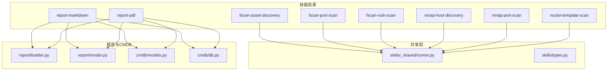

图表来源
- [handler.py:1-36](file://secbot/skills/fscan-asset-discovery/handler.py#L1-L36)
- [handler.py:1-45](file://secbot/skills/fscan-port-scan/handler.py#L1-L45)
- [handler.py:1-116](file://secbot/skills/fscan-vuln-scan/handler.py#L1-L116)
- [handler.py:1-81](file://secbot/skills/nmap-host-discovery/handler.py#L1-L81)
- [handler.py:1-48](file://secbot/skills/nmap-port-scan/handler.py#L1-L48)
- [handler.py:1-154](file://secbot/skills/nuclei-template-scan/handler.py#L1-L154)
- [handler.py:1-63](file://secbot/skills/report-markdown/handler.py#L1-L63)
- [handler.py:1-69](file://secbot/skills/report-pdf/handler.py#L1-L69)
- [runner.py](file://secbot/skills/_shared/runner.py)
- [types.py](file://secbot/skills/types.py)
- [builder.py](file://secbot/report/builder.py)
- [render.py](file://secbot/report/render.py)
- [models.py](file://secbot/cmdb/models.py)
- [db.py](file://secbot/cmdb/db.py)

章节来源
- [SKILL.md:1-15](file://secbot/skills/fscan-asset-discovery/SKILL.md#L1-L15)
- [SKILL.md:1-15](file://secbot/skills/fscan-port-scan/SKILL.md#L1-L15)
- [SKILL.md:1-16](file://secbot/skills/fscan-vuln-scan/SKILL.md#L1-L16)
- [SKILL.md:1-36](file://secbot/skills/nmap-host-discovery/SKILL.md#L1-L36)
- [SKILL.md:1-16](file://secbot/skills/nmap-port-scan/SKILL.md#L1-L16)
- [SKILL.md:1-17](file://secbot/skills/nuclei-template-scan/SKILL.md#L1-L17)
- [SKILL.md:1-15](file://secbot/skills/report-markdown/SKILL.md#L1-L15)
- [SKILL.md:1-16](file://secbot/skills/report-pdf/SKILL.md#L1-L16)

## 核心组件
- 技能执行器（Shared Runner）：封装外部二进制调用、超时控制、取消令牌、网络策略、原始日志落盘与解析回调等通用能力，供各技能复用。
- 报告构建器与渲染器：从CMDB读取扫描结果，构建报告模型，并渲染为Markdown或PDF。
- CMDB写入：将漏洞扫描结果结构化写入 vulnerabilities 表，支持upsert操作。
- 技能类型与上下文：统一的 SkillContext、SkillResult、错误类型（如超时、取消、二进制缺失）定义，确保跨技能一致的行为与可观测性。

章节来源
- [runner.py](file://secbot/skills/_shared/runner.py)
- [types.py](file://secbot/skills/types.py)
- [builder.py](file://secbot/report/builder.py)
- [render.py](file://secbot/report/render.py)
- [models.py](file://secbot/cmdb/models.py)
- [db.py](file://secbot/cmdb/db.py)

## 架构总览
下图展示典型扫描工作流：先进行资产发现与端口扫描，再进行漏洞扫描，最后生成报告。技能间通过CMDB共享数据，报告阶段仅读取本地数据库。

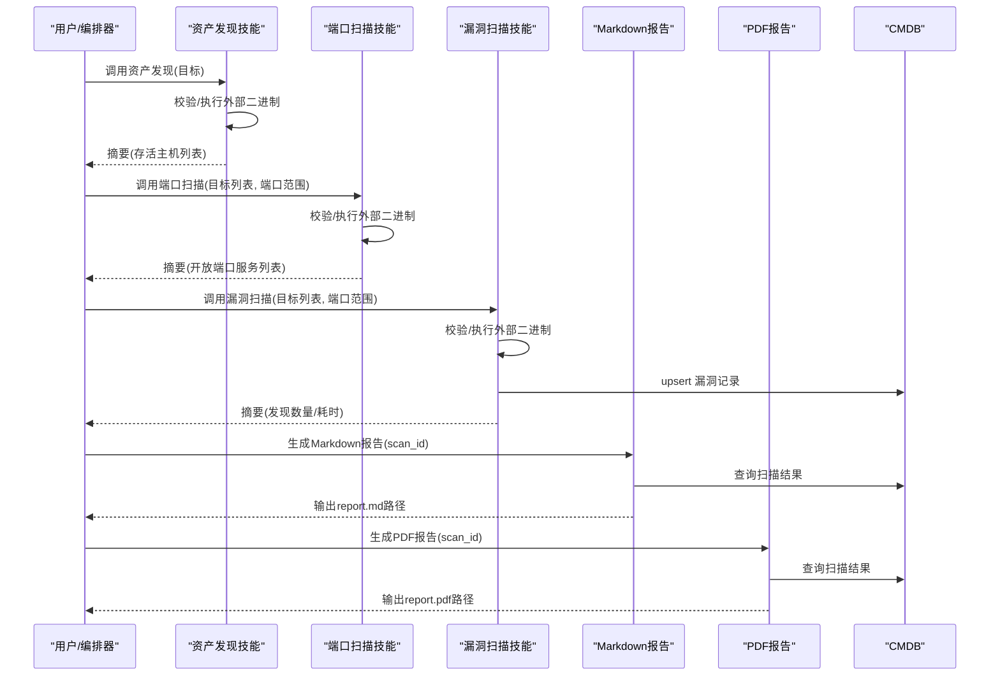

图表来源
- [handler.py:24-36](file://secbot/skills/fscan-asset-discovery/handler.py#L24-L36)
- [handler.py:31-45](file://secbot/skills/fscan-port-scan/handler.py#L31-L45)
- [handler.py:75-116](file://secbot/skills/fscan-vuln-scan/handler.py#L75-L116)
- [handler.py:35-81](file://secbot/skills/nmap-host-discovery/handler.py#L35-L81)
- [handler.py:32-48](file://secbot/skills/nmap-port-scan/handler.py#L32-L48)
- [handler.py:98-154](file://secbot/skills/nuclei-template-scan/handler.py#L98-L154)
- [handler.py:17-63](file://secbot/skills/report-markdown/handler.py#L17-L63)
- [handler.py:18-69](file://secbot/skills/report-pdf/handler.py#L18-L69)
- [db.py](file://secbot/cmdb/db.py)

## 详细组件分析

### 资产发现技能
- 技能名称与类别：fscan-asset-discovery（资产发现）
- 外部二进制：fscan
- 预期运行时长：约120秒
- 功能要点
  - 快速多协议存活探测（ICMP + 生存主机清单），适合 /16-/24 网段
  - 解析二进制输出，提取“存活主机”列表，限制最大返回条目
- 输入参数
  - target（必填）：单个IP、CIDR或域名
- 输出摘要
  - hosts_up：存活主机数组
  - elapsed_sec：执行耗时（若可用）
- 错误处理
  - 原始日志不存在：返回空列表
  - 超时/取消：由共享执行器捕获并返回摘要字段
- 典型调用流程
  - 参数校验 → 执行外部二进制 → 日志解析 → 返回摘要

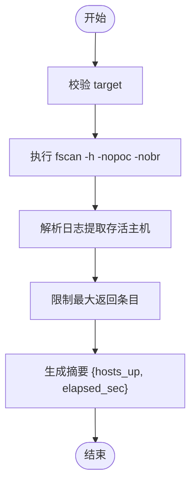

图表来源
- [handler.py:16-36](file://secbot/skills/fscan-asset-discovery/handler.py#L16-L36)
- [SKILL.md:1-15](file://secbot/skills/fscan-asset-discovery/SKILL.md#L1-L15)

章节来源
- [SKILL.md:1-15](file://secbot/skills/fscan-asset-discovery/SKILL.md#L1-L15)
- [handler.py:16-36](file://secbot/skills/fscan-asset-discovery/handler.py#L16-L36)

### 端口扫描技能（fscan）
- 技能名称与类别：fscan-port-scan（端口扫描）
- 外部二进制：fscan
- 预期运行时长：约240秒
- 功能要点
  - 多主机端口与服务扫描，基于并发提升 /16+ 网段扫描效率
  - 提取开放端口与协议，服务名可选
- 输入参数
  - target（必填）：单个IP、CIDR或域名
  - ports（可选，默认全端口）：端口范围/列表
- 输出摘要
  - services：每项包含 host、port、protocol、service
- 错误处理
  - 原始日志不存在：返回空列表
  - 超时/取消：由共享执行器捕获并返回摘要字段

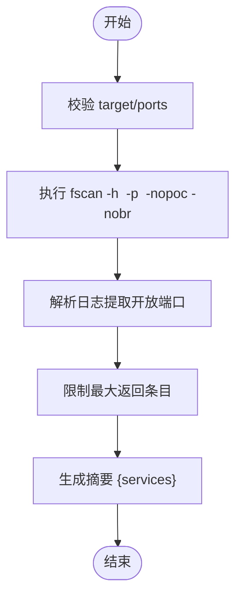

图表来源
- [handler.py:17-45](file://secbot/skills/fscan-port-scan/handler.py#L17-L45)
- [SKILL.md:1-15](file://secbot/skills/fscan-port-scan/SKILL.md#L1-L15)

章节来源
- [SKILL.md:1-15](file://secbot/skills/fscan-port-scan/SKILL.md#L1-L15)
- [handler.py:17-45](file://secbot/skills/fscan-port-scan/handler.py#L17-L45)

### 端口扫描技能（nmap）
- 技能名称与类别：nmap-port-scan（端口扫描）
- 外部二进制：nmap
- 预期运行时长：约180秒
- 功能要点
  - 使用 nmap -sS 对指定主机列表进行SYN扫描，输出开放端口与协议/服务
- 输入参数
  - targets（必填）：主机列表
  - ports（可选，默认1-1024）：端口范围
- 输出摘要
  - services：每项包含 host、port、protocol、service
- 错误处理
  - 原始日志不存在：返回空列表
  - 超时/取消：由共享执行器捕获并返回摘要字段

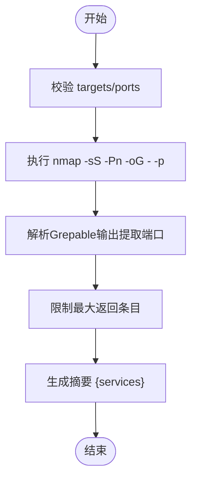

图表来源
- [handler.py:17-48](file://secbot/skills/nmap-port-scan/handler.py#L17-L48)
- [SKILL.md:1-16](file://secbot/skills/nmap-port-scan/SKILL.md#L1-L16)

章节来源
- [SKILL.md:1-16](file://secbot/skills/nmap-port-scan/SKILL.md#L1-L16)
- [handler.py:17-48](file://secbot/skills/nmap-port-scan/handler.py#L17-L48)

### 主机发现技能（nmap）
- 技能名称与类别：nmap-host-discovery（资产发现）
- 外部二进制：nmap（≥7.80）
- 预期运行时长：约60秒
- 功能要点
  - 使用 -sn 进行主机发现（ICMP/ARP/Timestamp等），支持速率级别
- 输入参数
  - target（必填）：IP/CIDR/IPv6/域名
  - rate（可选，默认normal）：slow|normal|fast → -T2|-T3|-T4
- 输出摘要
  - hosts_up：存活主机数组
  - elapsed_sec：执行耗时
- 错误处理
  - target/rate 校验失败：抛出无效参数异常
  - 超时/取消：返回摘要字段
  - 退出码非0：附加 error 字段

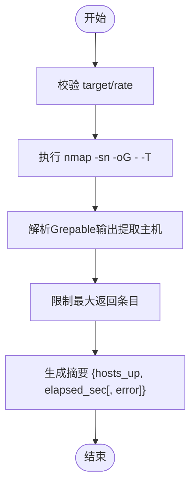

图表来源
- [handler.py:35-81](file://secbot/skills/nmap-host-discovery/handler.py#L35-L81)
- [SKILL.md:1-36](file://secbot/skills/nmap-host-discovery/SKILL.md#L1-L36)

章节来源
- [SKILL.md:1-36](file://secbot/skills/nmap-host-discovery/SKILL.md#L1-L36)
- [handler.py:35-81](file://secbot/skills/nmap-host-discovery/handler.py#L35-L81)

### 漏洞扫描技能（fscan）
- 技能名称与类别：fscan-vuln-scan（漏洞扫描）
- 外部二进制：fscan
- 预期运行时长：约600秒
- 功能要点
  - 启用内置POC检查，逐条解析文本日志，提取漏洞标题与URL，写入CMDB vulnerabilities
  - 支持端口过滤与默认端口集
- 输入参数
  - target（必填）：单个IP、CIDR或域名
  - ports（可选，默认常用高危端口集合）
- 输出摘要
  - findings_count：发现数量
  - elapsed_sec：执行耗时
  - error（可选）：当退出码非0且无发现时携带
- CMDB写入
  - table=vulnerabilities，op=upsert，字段包含 template_id、severity、target、evidence、title
- 错误处理
  - 超时/取消：返回摘要字段
  - 二进制缺失：向上抛出
  - 日志不存在：返回空发现

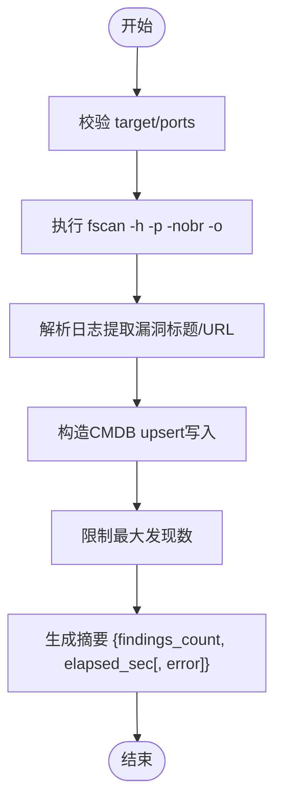

图表来源
- [handler.py:35-116](file://secbot/skills/fscan-vuln-scan/handler.py#L35-L116)
- [SKILL.md:1-16](file://secbot/skills/fscan-vuln-scan/SKILL.md#L1-L16)

章节来源
- [SKILL.md:1-16](file://secbot/skills/fscan-vuln-scan/SKILL.md#L1-L16)
- [handler.py:35-116](file://secbot/skills/fscan-vuln-scan/handler.py#L35-L116)

### 漏洞扫描技能（nuclei）
- 技能名称与类别：nuclei-template-scan（漏洞扫描）
- 外部二进制：nuclei
- 预期运行时长：约600秒
- 功能要点
  - 使用JSONL输出，按模板ID/严重级别/匹配信息构建结构化发现，并写入CMDB
  - 严格的目标与标签校验，支持严重级别过滤
- 输入参数
  - targets（必填，列表）：最多256个目标
  - severity（可选，默认medium,high,critical）
  - tags（可选，默认cve,exposure,misconfig）
- 输出摘要
  - findings_count：发现数量
  - elapsed_sec：执行耗时
  - error（可选）：当退出码非0且无发现时携带
- CMDB写入
  - table=vulnerabilities，op=upsert，字段包含 template_id、severity、target、evidence、title
- 错误处理
  - 超时/取消：返回摘要字段
  - 二进制缺失：向上抛出
  - 日志不存在：返回空发现

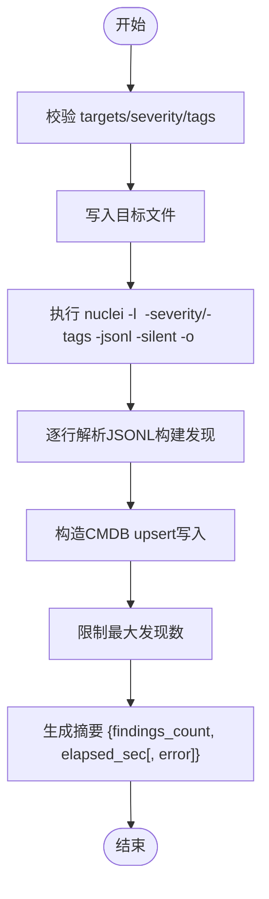

图表来源
- [handler.py:36-154](file://secbot/skills/nuclei-template-scan/handler.py#L36-L154)
- [SKILL.md:1-17](file://secbot/skills/nuclei-template-scan/SKILL.md#L1-L17)

章节来源
- [SKILL.md:1-17](file://secbot/skills/nuclei-template-scan/SKILL.md#L1-L17)
- [handler.py:36-154](file://secbot/skills/nuclei-template-scan/handler.py#L36-L154)

### 报告生成技能（Markdown）
- 技能名称与类别：report-markdown（报告）
- 外部二进制：无
- 预期运行时长：约10秒
- 功能要点
  - 从CMDB构建报告模型，渲染为Markdown文件，记录报告元信息
- 输入参数
  - scan_id（必填）：扫描会话ID
  - actor_id（可选，默认系统默认演员）
  - title（可选，默认“Scan {scan_id} report”）
  - type（可选，默认custom）
- 输出摘要
  - status：ok/empty
  - report_path：报告文件绝对路径
  - asset_count/finding_count：统计
  - report_id：报告元信息ID（若成功记录）
- 错误处理
  - 空模型：返回empty状态
  - 记录元信息失败：不影响已生成的报告文件

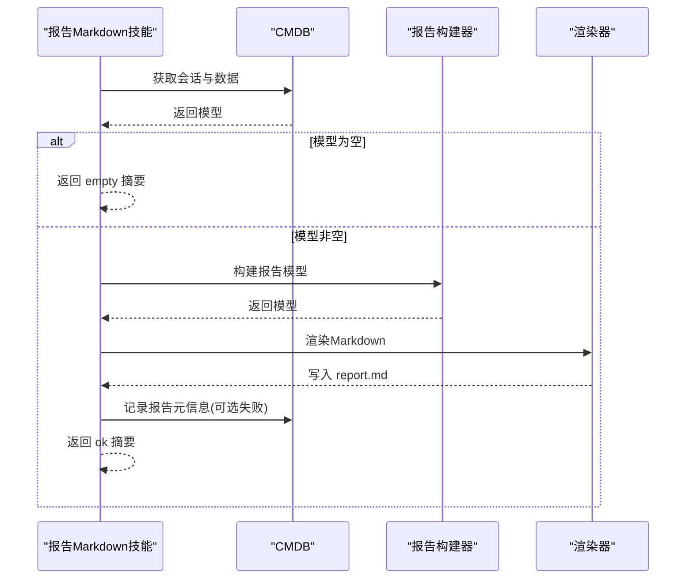

图表来源
- [handler.py:17-63](file://secbot/skills/report-markdown/handler.py#L17-L63)
- [SKILL.md:1-15](file://secbot/skills/report-markdown/SKILL.md#L1-L15)

章节来源
- [SKILL.md:1-15](file://secbot/skills/report-markdown/SKILL.md#L1-L15)
- [handler.py:17-63](file://secbot/skills/report-markdown/handler.py#L17-L63)

### 报告生成技能（PDF）
- 技能名称与类别：report-pdf（报告）
- 外部二进制：weasyprint
- 预期运行时长：约30秒
- 功能要点
  - 从CMDB构建报告模型，渲染为PDF文件，记录报告元信息
- 输入参数
  - scan_id（必填）：扫描会话ID
  - actor_id（可选，默认系统默认演员）
  - title（可选，默认“Scan {scan_id} report”）
  - type（可选，默认custom）
- 输出摘要
  - status：ok/empty/error
  - report_path：报告文件绝对路径
  - asset_count/finding_count：统计
  - report_id：报告元信息ID（若成功记录）
- 错误处理
  - 渲染异常：返回error状态与简短错误描述
  - 空模型：返回empty状态
  - 记录元信息失败：不影响已生成的报告文件

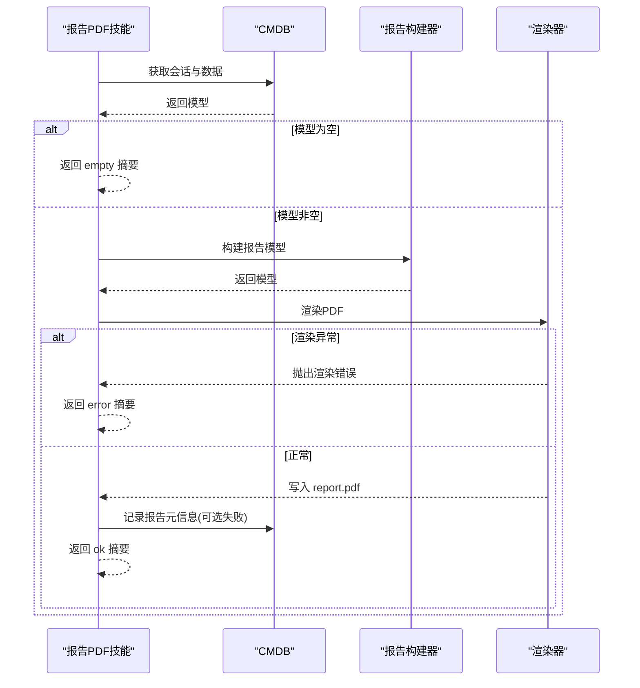

图表来源
- [handler.py:18-69](file://secbot/skills/report-pdf/handler.py#L18-L69)
- [SKILL.md:1-16](file://secbot/skills/report-pdf/SKILL.md#L1-L16)

章节来源
- [SKILL.md:1-16](file://secbot/skills/report-pdf/SKILL.md#L1-L16)
- [handler.py:18-69](file://secbot/skills/report-pdf/handler.py#L18-L69)

## 依赖分析
- 技能到共享层
  - 大多数技能依赖 _shared/runner.py 的 execute 或 run_command，统一处理外部二进制调用、超时、取消、网络策略与日志解析
  - 类型与上下文来自 skills/types.py
- 报告与CMDB
  - 报告技能依赖 report/builder.py 与 report/render.py
  - CMDB访问通过 cmdb/db.py 与 cmdb/models.py
- 技能间耦合
  - 通过CMDB共享数据；报告技能仅读取，不直接依赖具体扫描技能
  - 漏洞扫描技能在摘要之外，还向CMDB写入结构化数据，供报告阶段消费

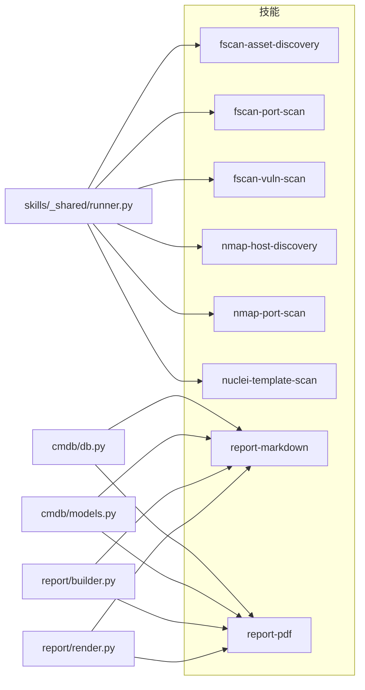

图表来源
- [runner.py](file://secbot/skills/_shared/runner.py)
- [types.py](file://secbot/skills/types.py)
- [builder.py](file://secbot/report/builder.py)
- [render.py](file://secbot/report/render.py)
- [models.py](file://secbot/cmdb/models.py)
- [db.py](file://secbot/cmdb/db.py)

章节来源
- [runner.py](file://secbot/skills/_shared/runner.py)
- [types.py](file://secbot/skills/types.py)
- [builder.py](file://secbot/report/builder.py)
- [render.py](file://secbot/report/render.py)
- [models.py](file://secbot/cmdb/models.py)
- [db.py](file://secbot/cmdb/db.py)

## 性能考虑
- 并发与超时
  - fscan 在端口/漏洞扫描中具备内置并发，适合大网段快速覆盖
  - 合理设置超时（秒级）避免长时间占用资源
- 结果截断
  - 多处对返回条目进行上限限制（如500/1000），防止内存与传输压力
- 日志与IO
  - 将原始日志落盘，便于重放与审计；报告阶段仅读取本地数据库
- 网络策略
  - 明确声明网络出站需求，避免不必要的阻塞或权限问题

## 故障排除指南
- 外部二进制缺失
  - 症状：抛出“二进制缺失”异常
  - 处理：安装对应工具（如 fscan、nmap、nuclei、weasyprint），或在平台层面预装
- 超时/取消
  - 症状：摘要包含 error 或 cancelled 字段
  - 处理：增大超时、缩小目标范围、降低并发或分批执行
- 参数校验失败
  - 症状：InvalidSkillArg 异常
  - 处理：核对 target/rate/ports/tags/targets 等参数格式与取值范围
- 退出码非0但无发现
  - 症状：摘要包含 error 字段
  - 处理：查看原始日志定位原因（网络、权限、目标不可达等）
- 渲染PDF失败
  - 症状：报告PDF技能返回 error 状态
  - 处理：确认系统字体/渲染库（cairo/pango）是否齐全，查看日志异常详情

章节来源
- [handler.py:93-98](file://secbot/skills/fscan-vuln-scan/handler.py#L93-L98)
- [handler.py:57-62](file://secbot/skills/nmap-host-discovery/handler.py#L57-L62)
- [handler.py:131-136](file://secbot/skills/nuclei-template-scan/handler.py#L131-L136)
- [handler.py:40-47](file://secbot/skills/report-pdf/handler.py#L40-L47)

## 结论
VAPT3的内置技能围绕“外部二进制 + 共享执行器 + CMDB”的架构设计，实现了从资产发现、端口扫描、漏洞扫描到报告生成的完整链路。通过统一的错误处理、超时控制与结果截断机制，既保证了稳定性，也兼顾了性能与可观测性。建议在实际使用中结合目标规模与环境条件，合理选择技能组合与参数，以获得最佳效果。

## 附录
- 技能组合使用建议
  - 小规模/快速验证：nmap-host-discovery → nmap-port-scan → report-markdown
  - 大规模/深度评估：fscan-asset-discovery → fscan-port-scan → fscan-vuln-scan → report-pdf
  - 模板驱动高精度：nuclei-template-scan → report-markdown
- 参数调整与定制化
  - 端口范围：根据业务场景调整 ports
  - 速率级别：nmap-host-discovery 的 rate 可在 slow/normal/fast 之间权衡速度与探测强度
  - 严重级别与标签：nuclei-template-scan 的 severity 与 tags 可按风险阈值与关注面定制
- 扩展开发
  - 新增技能：遵循 SKILL.md 元数据规范与 handler.py 的执行模式，优先复用 _shared/runner.py 与 types.py
  - 自定义解析：在 handler 中实现 parser 回调，将原始输出映射为标准摘要与CMDB写入