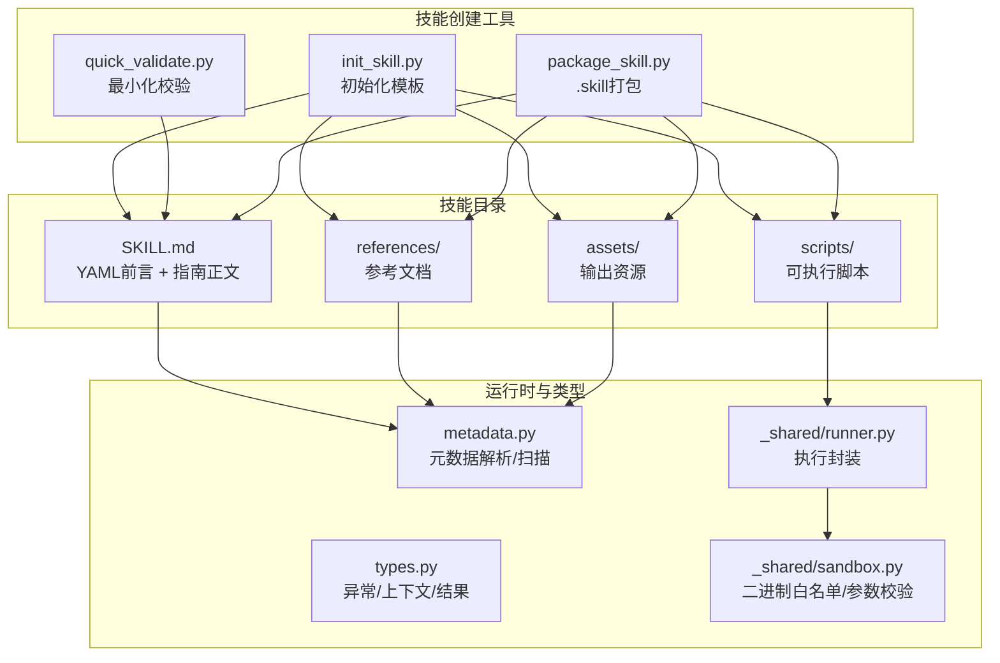
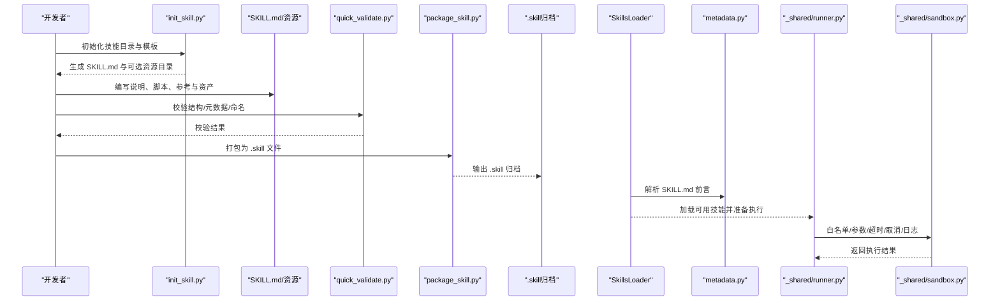
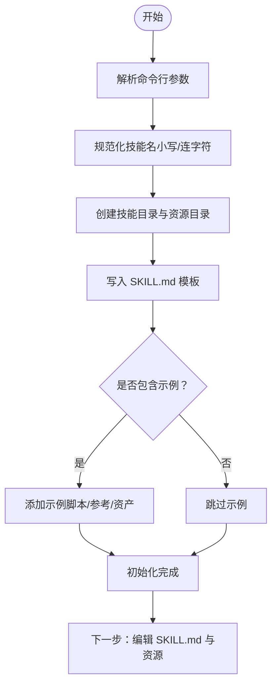
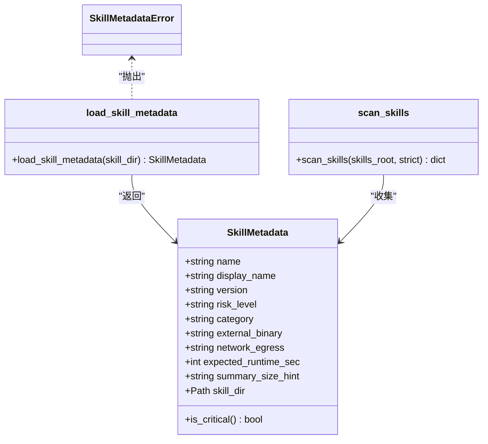
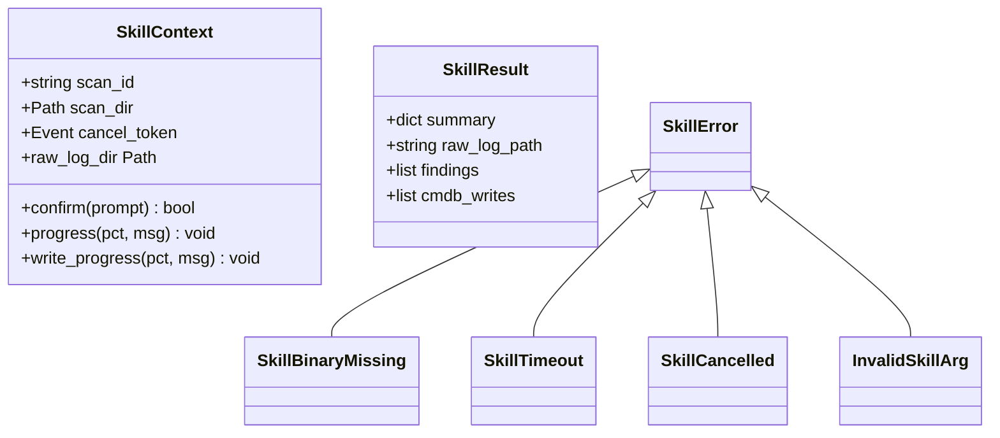
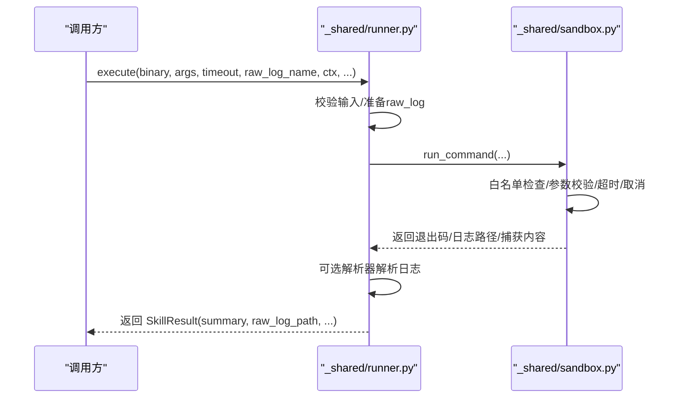
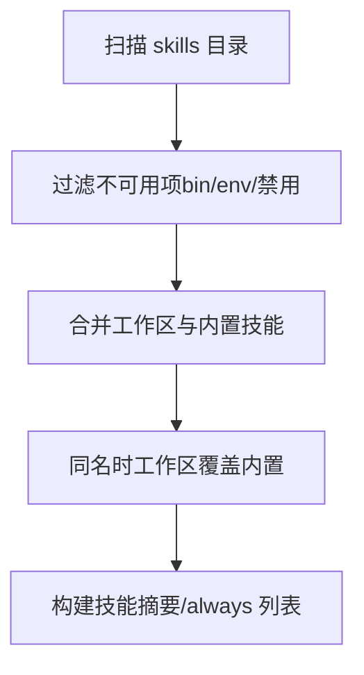
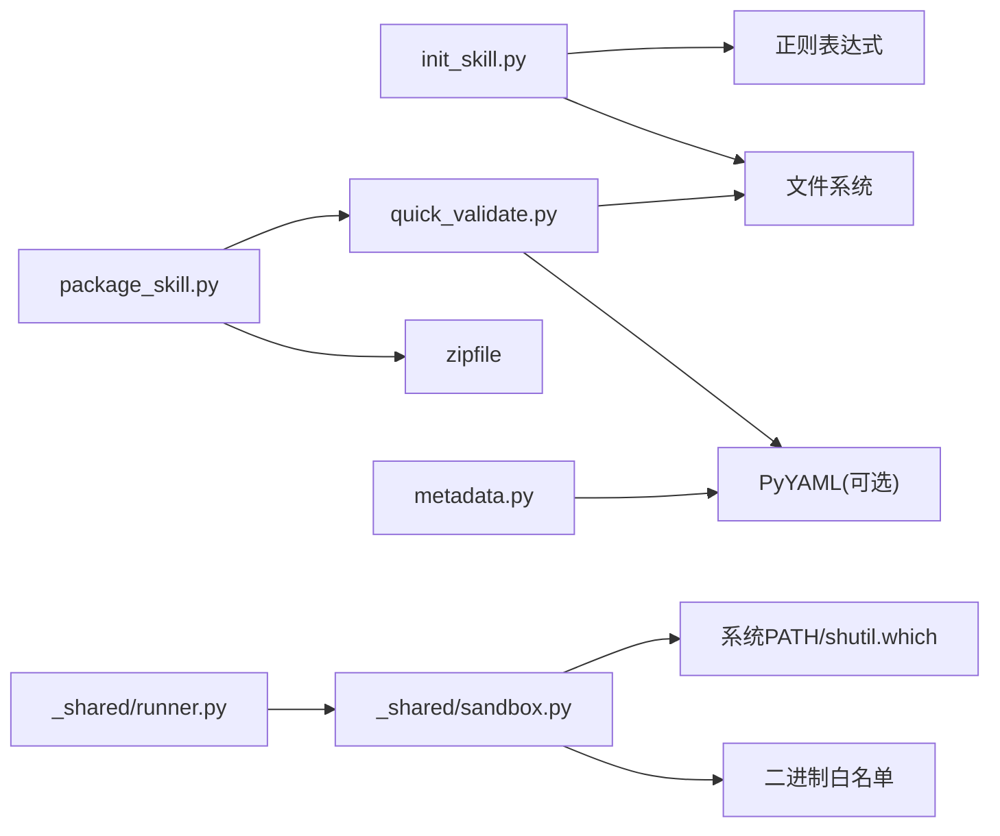

# 技能开发指南

<cite>
**本文引用的文件**
- [secbot/skills/skill-creator/SKILL.md](file://secbot/skills/skill-creator/SKILL.md)
- [secbot/skills/skill-creator/scripts/init_skill.py](file://secbot/skills/skill-creator/scripts/init_skill.py)
- [secbot/skills/skill-creator/scripts/package_skill.py](file://secbot/skills/skill-creator/scripts/package_skill.py)
- [secbot/skills/skill-creator/scripts/quick_validate.py](file://secbot/skills/skill-creator/scripts/quick_validate.py)
- [secbot/skills/metadata.py](file://secbot/skills/metadata.py)
- [secbot/skills/types.py](file://secbot/skills/types.py)
- [secbot/skills/_shared/runner.py](file://secbot/skills/_shared/runner.py)
- [secbot/skills/_shared/sandbox.py](file://secbot/skills/_shared/sandbox.py)
- [secbot/skills/README.md](file://secbot/skills/README.md)
- [tests/agent/test_skills_loader.py](file://tests/agent/test_skills_loader.py)
- [tests/skills/test_metadata.py](file://tests/skills/test_metadata.py)
</cite>

## 目录
1. [简介](#简介)
2. [项目结构](#项目结构)
3. [核心组件](#核心组件)
4. [架构总览](#架构总览)
5. [详细组件分析](#详细组件分析)
6. [依赖分析](#依赖分析)
7. [性能考虑](#性能考虑)
8. [故障排查指南](#故障排查指南)
9. [结论](#结论)
10. [附录](#附录)

## 简介
本指南面向VAPT3平台的技能开发者，系统性地介绍从“技能创建模板”到“最终发布”的全流程，涵盖技能开发工具链（skill-creator）、标准规范（文件结构、命名约定、元数据与触发条件）、测试与验证方法（单元测试、集成测试、安全沙箱）、打包与分发（.skill归档、依赖与权限控制），并提供可复用的最佳实践与示例路径，帮助开发者高效构建高质量、可维护、可分发的Agent技能。

## 项目结构
VAPT3的技能体系由“内置技能目录”“技能创建工具”“运行时加载器与类型定义”“共享执行与沙箱”等模块组成。技能以“目录+SKILL.md”的形式存在，支持scripts/、references/、assets/三类资源目录，配合元数据与触发描述实现按需加载与安全执行。

图示来源
- [secbot/skills/skill-creator/SKILL.md:1-375](file://secbot/skills/skill-creator/SKILL.md#L1-L375)
- [secbot/skills/skill-creator/scripts/init_skill.py:1-379](file://secbot/skills/skill-creator/scripts/init_skill.py#L1-L379)
- [secbot/skills/skill-creator/scripts/quick_validate.py:1-214](file://secbot/skills/skill-creator/scripts/quick_validate.py#L1-L214)
- [secbot/skills/skill-creator/scripts/package_skill.py:1-153](file://secbot/skills/skill-creator/scripts/package_skill.py#L1-L153)
- [secbot/skills/metadata.py:1-147](file://secbot/skills/metadata.py#L1-L147)
- [secbot/skills/types.py:1-87](file://secbot/skills/types.py#L1-L87)
- [secbot/skills/_shared/runner.py:1-83](file://secbot/skills/_shared/runner.py#L1-L83)
- [secbot/skills/_shared/sandbox.py:1-192](file://secbot/skills/_shared/sandbox.py#L1-L192)

章节来源
- [secbot/skills/README.md:1-31](file://secbot/skills/README.md#L1-L31)

## 核心组件
- 技能创建工具链：提供初始化模板、最小化校验与打包归档能力，确保技能结构与元数据符合平台要求。
- 元数据与触发：通过SKILL.md的YAML前言字段（name、description、metadata等）决定技能的触发与可用性。
- 运行时类型与异常：统一的上下文、结果、异常类型，便于单元测试与集成测试。
- 执行与沙箱：对子进程调用进行白名单与参数校验，保障安全与可控的超时/取消/日志捕获。

章节来源
- [secbot/skills/skill-creator/SKILL.md:1-375](file://secbot/skills/skill-creator/SKILL.md#L1-L375)
- [secbot/skills/skill-creator/scripts/init_skill.py:1-379](file://secbot/skills/skill-creator/scripts/init_skill.py#L1-L379)
- [secbot/skills/skill-creator/scripts/quick_validate.py:1-214](file://secbot/skills/skill-creator/scripts/quick_validate.py#L1-L214)
- [secbot/skills/skill-creator/scripts/package_skill.py:1-153](file://secbot/skills/skill-creator/scripts/package_skill.py#L1-L153)
- [secbot/skills/metadata.py:1-147](file://secbot/skills/metadata.py#L1-L147)
- [secbot/skills/types.py:1-87](file://secbot/skills/types.py#L1-L87)
- [secbot/skills/_shared/runner.py:1-83](file://secbot/skills/_shared/runner.py#L1-L83)
- [secbot/skills/_shared/sandbox.py:1-192](file://secbot/skills/_shared/sandbox.py#L1-L192)

## 架构总览
技能开发与运行的关键流程如下：先用init_skill.py生成模板，再编辑SKILL.md与资源；用quick_validate.py进行最小化校验；最后用package_skill.py打包为.skill归档。运行时由SkillsLoader扫描技能目录，解析metadata，结合白名单与沙箱策略执行外部命令。

图示来源
- [secbot/skills/skill-creator/scripts/init_skill.py:1-379](file://secbot/skills/skill-creator/scripts/init_skill.py#L1-L379)
- [secbot/skills/skill-creator/scripts/quick_validate.py:1-214](file://secbot/skills/skill-creator/scripts/quick_validate.py#L1-L214)
- [secbot/skills/skill-creator/scripts/package_skill.py:1-153](file://secbot/skills/skill-creator/scripts/package_skill.py#L1-L153)
- [secbot/skills/metadata.py:1-147](file://secbot/skills/metadata.py#L1-L147)
- [secbot/skills/_shared/runner.py:1-83](file://secbot/skills/_shared/runner.py#L1-L83)
- [secbot/skills/_shared/sandbox.py:1-192](file://secbot/skills/_shared/sandbox.py#L1-L192)

## 详细组件分析

### 组件A：技能创建工具链（skill-creator）
- init_skill.py：生成技能目录、模板SKILL.md与可选资源目录；支持示例文件注入；规范化名称与目录名一致。
- quick_validate.py：最小化校验规则（前言键、名称/描述格式、目录结构、不允许符号链接等）。
- package_skill.py：将技能目录打包为.zip格式的.skill文件，内部保持相对路径结构，排除隐藏目录与符号链接。

图示来源
- [secbot/skills/skill-creator/scripts/init_skill.py:194-317](file://secbot/skills/skill-creator/scripts/init_skill.py#L194-L317)

章节来源
- [secbot/skills/skill-creator/SKILL.md:201-375](file://secbot/skills/skill-creator/SKILL.md#L201-L375)
- [secbot/skills/skill-creator/scripts/init_skill.py:1-379](file://secbot/skills/skill-creator/scripts/init_skill.py#L1-L379)
- [secbot/skills/skill-creator/scripts/quick_validate.py:1-214](file://secbot/skills/skill-creator/scripts/quick_validate.py#L1-L214)
- [secbot/skills/skill-creator/scripts/package_skill.py:1-153](file://secbot/skills/skill-creator/scripts/package_skill.py#L1-L153)

### 组件B：元数据与触发（metadata.py）
- 负责解析SKILL.md的YAML前言，校验必需字段与取值范围，并暴露给运行时（如SkillsLoader）用于技能发现与过滤。
- 支持扩展字段（metadata、always等）在特定场景下使用，但需遵循平台约定。

图示来源
- [secbot/skills/metadata.py:23-114](file://secbot/skills/metadata.py#L23-L114)

章节来源
- [secbot/skills/metadata.py:1-147](file://secbot/skills/metadata.py#L1-L147)
- [tests/skills/test_metadata.py:1-103](file://tests/skills/test_metadata.py#L1-L103)

### 组件C：运行时类型与异常（types.py）
- 定义技能执行上下文（SkillContext）、结果（SkillResult）与常见异常（二进制缺失、超时、取消、参数非法等），便于单元测试构造与断言。

图示来源
- [secbot/skills/types.py:19-86](file://secbot/skills/types.py#L19-L86)

章节来源
- [secbot/skills/types.py:1-87](file://secbot/skills/types.py#L1-L87)

### 组件D：执行封装与沙箱（runner.py、sandbox.py）
- runner.py：封装execute流程，负责日志记录、超时/取消处理、解析器回调与结果汇总。
- sandbox.py：二进制白名单、参数字符集检查、超时/取消/日志捕获、网络策略声明与执行。

图示来源
- [secbot/skills/_shared/runner.py:38-82](file://secbot/skills/_shared/runner.py#L38-L82)
- [secbot/skills/_shared/sandbox.py:70-191](file://secbot/skills/_shared/sandbox.py#L70-L191)

章节来源
- [secbot/skills/_shared/runner.py:1-83](file://secbot/skills/_shared/runner.py#L1-L83)
- [secbot/skills/_shared/sandbox.py:1-192](file://secbot/skills/_shared/sandbox.py#L1-L192)

### 组件E：技能加载与可用性过滤（测试用例参考）
- 测试覆盖了技能列表、工作区优先级、禁用技能、bin/env依赖要求、多行描述解析等场景，体现运行时加载器的行为边界。

图示来源
- [tests/agent/test_skills_loader.py:33-201](file://tests/agent/test_skills_loader.py#L33-L201)

章节来源
- [tests/agent/test_skills_loader.py:1-400](file://tests/agent/test_skills_loader.py#L1-L400)

## 依赖分析
- 工具链内部依赖：init_skill.py依赖文件系统与正则；quick_validate.py依赖yaml（可降级）；package_skill.py依赖zipfile与quick_validate。
- 运行时依赖：metadata.py依赖yaml；runner.py依赖sandbox；sandbox依赖白名单集合与系统PATH查询。
- 测试依赖：单元测试覆盖元数据解析、加载器行为、异常路径与类型断言。

图示来源
- [secbot/skills/skill-creator/scripts/init_skill.py:1-379](file://secbot/skills/skill-creator/scripts/init_skill.py#L1-L379)
- [secbot/skills/skill-creator/scripts/quick_validate.py:1-214](file://secbot/skills/skill-creator/scripts/quick_validate.py#L1-L214)
- [secbot/skills/skill-creator/scripts/package_skill.py:1-153](file://secbot/skills/skill-creator/scripts/package_skill.py#L1-L153)
- [secbot/skills/metadata.py:1-147](file://secbot/skills/metadata.py#L1-L147)
- [secbot/skills/_shared/runner.py:1-83](file://secbot/skills/_shared/runner.py#L1-L83)
- [secbot/skills/_shared/sandbox.py:1-192](file://secbot/skills/_shared/sandbox.py#L1-L192)

章节来源
- [secbot/skills/skill-creator/scripts/init_skill.py:1-379](file://secbot/skills/skill-creator/scripts/init_skill.py#L1-L379)
- [secbot/skills/skill-creator/scripts/quick_validate.py:1-214](file://secbot/skills/skill-creator/scripts/quick_validate.py#L1-L214)
- [secbot/skills/skill-creator/scripts/package_skill.py:1-153](file://secbot/skills/skill-creator/scripts/package_skill.py#L1-L153)
- [secbot/skills/metadata.py:1-147](file://secbot/skills/metadata.py#L1-L147)
- [secbot/skills/_shared/runner.py:1-83](file://secbot/skills/_shared/runner.py#L1-L83)
- [secbot/skills/_shared/sandbox.py:1-192](file://secbot/skills/_shared/sandbox.py#L1-L192)

## 性能考虑
- 上下文窗口与加载策略：SKILL.md主体建议精简，长文档拆分为references/并按需加载；避免在body中重复已在name/description中表达的触发条件。
- 资源组织：scripts/可直接执行且无需加载到上下文；references/仅在需要时加载；assets/不进入上下文，减少token占用。
- 执行性能：合理设置expected_runtime_sec，避免过短导致误判超时；使用日志文件与解析器分离耗时步骤。
- 打包体积：排除.git、__pycache__、node_modules等无关目录；禁止符号链接，确保归档确定性。

章节来源
- [secbot/skills/skill-creator/SKILL.md:113-200](file://secbot/skills/skill-creator/SKILL.md#L113-L200)
- [secbot/skills/skill-creator/scripts/package_skill.py:81-108](file://secbot/skills/skill-creator/scripts/package_skill.py#L81-L108)

## 故障排查指南
- 初始化失败
  - 名称不合法或过长：检查是否为小写连字符，长度不超过限制。
  - 资源目录参数错误：--resources必须为scripts、references、assets的组合。
  - 示例注入需指定资源类型。
- 校验失败
  - 前言格式/键名不合法：确保name/description存在且格式正确；仅允许受控键。
  - 描述含占位符或非法字符：移除[Todo]/todo:等标记，避免尖括号。
  - 目录结构异常：根目录仅允许SKILL.md与scripts/references/assets。
- 打包失败
  - 包含符号链接：删除或替换为普通文件。
  - 输出目录与归档冲突：避免输出到技能根目录内。
- 运行时异常
  - 二进制不在白名单：确认binary在白名单集合中，或调整为受支持的工具。
  - 参数包含非法字符：检查argv元素，避免危险字符。
  - 超时/取消：适当提高timeout_sec，或在上层逻辑中设置cancel_token。
  - 元数据错误：检查SKILL.md前言字段类型与取值范围。

章节来源
- [secbot/skills/skill-creator/scripts/init_skill.py:194-379](file://secbot/skills/skill-creator/scripts/init_skill.py#L194-L379)
- [secbot/skills/skill-creator/scripts/quick_validate.py:102-203](file://secbot/skills/skill-creator/scripts/quick_validate.py#L102-L203)
- [secbot/skills/skill-creator/scripts/package_skill.py:87-124](file://secbot/skills/skill-creator/scripts/package_skill.py#L87-L124)
- [secbot/skills/_shared/sandbox.py:59-104](file://secbot/skills/_shared/sandbox.py#L59-L104)
- [secbot/skills/metadata.py:56-114](file://secbot/skills/metadata.py#L56-L114)

## 结论
通过skill-creator工具链与平台提供的元数据、类型与沙箱机制，开发者可以高效、安全地完成技能的创建、验证、打包与分发。遵循本文的命名与结构规范、触发描述设计原则、资源组织策略以及安全执行约束，能够显著提升技能的可维护性与可复用性。

## 附录

### 开发流程清单
- 明确技能目标与触发场景，规划可复用的scripts/references/assets。
- 使用init_skill.py生成模板并完善SKILL.md与资源。
- 使用quick_validate.py进行本地自检，修复提示问题。
- 使用package_skill.py生成.skill归档，准备分发。
- 在真实任务中迭代优化，关注上下文窗口与执行性能。

章节来源
- [secbot/skills/skill-creator/SKILL.md:201-375](file://secbot/skills/skill-creator/SKILL.md#L201-L375)
- [secbot/skills/skill-creator/scripts/init_skill.py:255-317](file://secbot/skills/skill-creator/scripts/init_skill.py#L255-L317)
- [secbot/skills/skill-creator/scripts/quick_validate.py:132-203](file://secbot/skills/skill-creator/scripts/quick_validate.py#L132-L203)
- [secbot/skills/skill-creator/scripts/package_skill.py:34-124](file://secbot/skills/skill-creator/scripts/package_skill.py#L34-L124)

### 最佳实践速查
- 命名：小写连字符，不超过64字符，目录名与name一致。
- 触发描述：在description中明确“何时使用”，避免冗余解释。
- 结构：SKILL.md主体精炼，长文档放入references；assets不进入上下文。
- 脚本：可直接执行、可被沙箱安全调用；必要时提供解析器。
- 安全：仅使用白名单二进制；严格校验argv字符集；设置合理超时与日志捕获。

章节来源
- [secbot/skills/skill-creator/SKILL.md:214-221](file://secbot/skills/skill-creator/SKILL.md#L214-L221)
- [secbot/skills/skill-creator/SKILL.md:317-331](file://secbot/skills/skill-creator/SKILL.md#L317-L331)
- [secbot/skills/_shared/sandbox.py:23-36](file://secbot/skills/_shared/sandbox.py#L23-L36)
- [secbot/skills/_shared/runner.py:38-82](file://secbot/skills/_shared/runner.py#L38-L82)