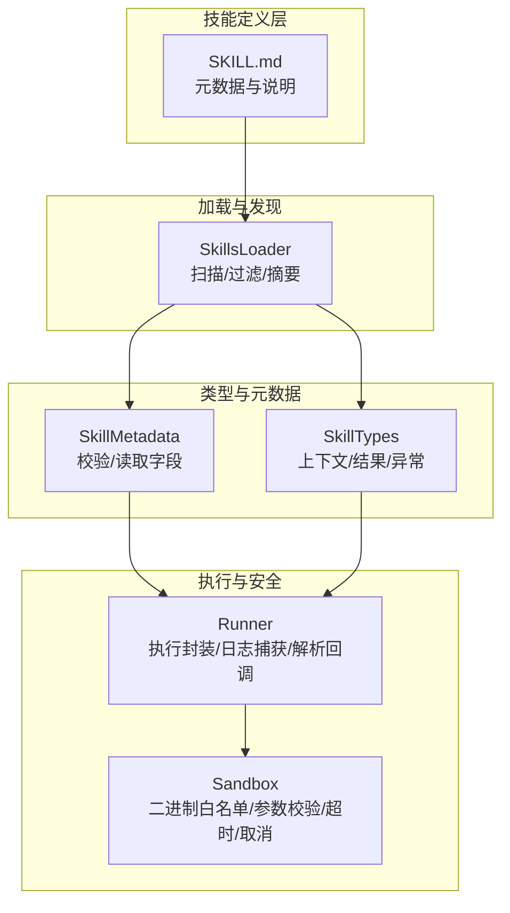
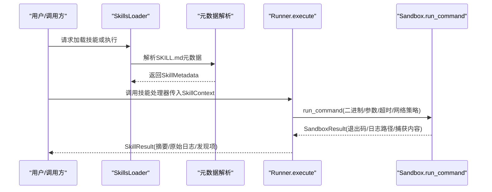
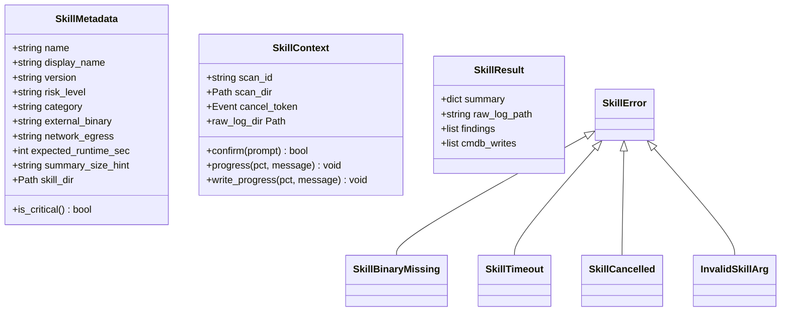
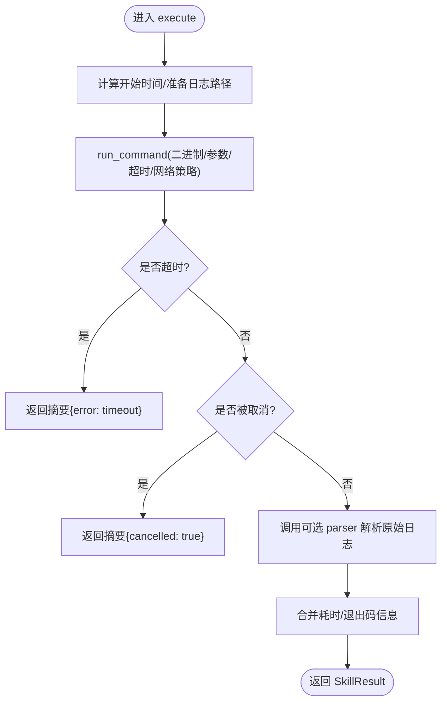
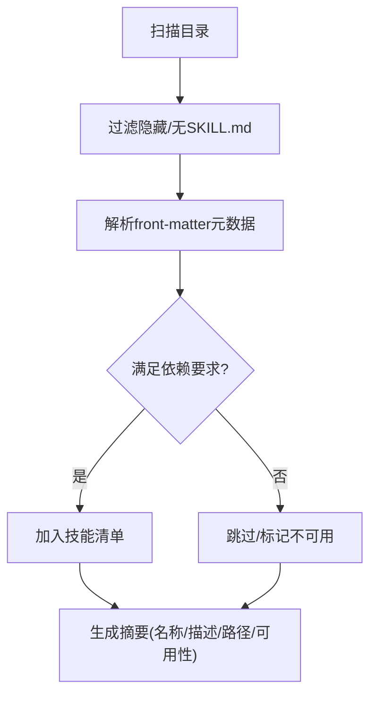
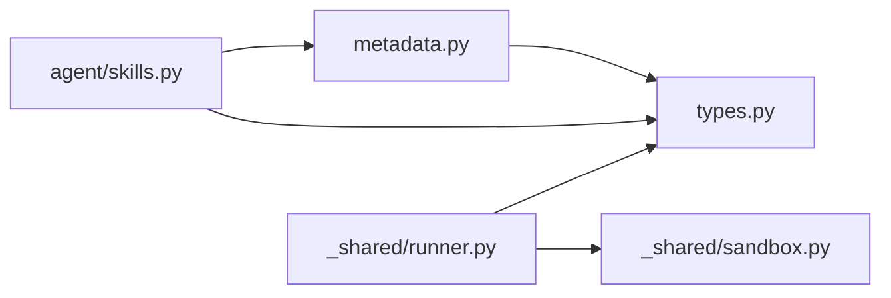

# 技能架构设计

<cite>
**本文引用的文件**
- [secbot/skills/metadata.py](file://secbot/skills/metadata.py)
- [secbot/skills/types.py](file://secbot/skills/types.py)
- [secbot/skills/README.md](file://secbot/skills/README.md)
- [secbot/skills/_shared/sandbox.py](file://secbot/skills/_shared/sandbox.py)
- [secbot/skills/_shared/runner.py](file://secbot/skills/_shared/runner.py)
- [secbot/skills/_shared/__init__.py](file://secbot/skills/_shared/__init__.py)
- [secbot/agent/skills.py](file://secbot/agent/skills.py)
- [secbot/command/router.py](file://secbot/command/router.py)
- [secbot/skills/fscan-asset-discovery/SKILL.md](file://secbot/skills/fscan-asset-discovery/SKILL.md)
- [secbot/skills/nmap-port-scan/SKILL.md](file://secbot/skills/nmap-port-scan/SKILL.md)
- [secbot/skills/github/SKILL.md](file://secbot/skills/github/SKILL.md)
- [secbot/skills/weather/SKILL.md](file://secbot/skills/weather/SKILL.md)
- [secbot/skills/skill-creator/SKILL.md](file://secbot/skills/skill-creator/SKILL.md)
</cite>

## 目录
1. [引言](#引言)
2. [项目结构](#项目结构)
3. [核心组件](#核心组件)
4. [架构总览](#架构总览)
5. [详细组件分析](#详细组件分析)
6. [依赖分析](#依赖分析)
7. [性能考虑](#性能考虑)
8. [故障排查指南](#故障排查指南)
9. [结论](#结论)
10. [附录](#附录)

## 引言
本文件面向VAPT3的技能系统，系统化阐述其架构设计与实现要点，覆盖技能元数据结构、标准化接口、生命周期管理、注册与发现机制、输入输出Schema规范、依赖声明机制、以及可扩展性与最佳实践。通过多幅图示帮助开发者快速理解从“技能定义”到“执行与结果”的全链路。

## 项目结构
技能系统主要由以下部分组成：
- 元数据与类型：负责解析SKILL.md、校验字段、定义运行时上下文与结果结构
- 执行沙箱：统一约束外部二进制调用、参数安全、网络策略与超时控制
- 技能加载器：扫描工作区与内置技能目录，构建技能清单、摘要与按需加载
- 示例技能：提供多种真实技能的SKILL.md样例，展示元数据与使用说明
- 命令路由：为技能相关的命令分发提供基础能力（如优先级命令、前缀匹配等）

图表来源
- [secbot/agent/skills.py:21-243](file://secbot/agent/skills.py#L21-L243)
- [secbot/skills/metadata.py:56-147](file://secbot/skills/metadata.py#L56-L147)
- [secbot/skills/types.py:44-87](file://secbot/skills/types.py#L44-L87)
- [secbot/skills/_shared/sandbox.py:70-192](file://secbot/skills/_shared/sandbox.py#L70-L192)
- [secbot/skills/_shared/runner.py:38-83](file://secbot/skills/_shared/runner.py#L38-L83)

章节来源
- [secbot/skills/README.md:1-31](file://secbot/skills/README.md#L1-L31)
- [secbot/agent/skills.py:21-243](file://secbot/agent/skills.py#L21-L243)

## 核心组件
- 元数据解析与校验：从SKILL.md提取并验证必需字段，生成标准化的SkillMetadata对象
- 类型与异常：定义SkillContext、SkillResult及各类运行期异常，确保调用方一致处理
- 沙箱执行：统一的外部进程调用入口，限制二进制白名单、禁止字符、超时与取消信号
- 执行封装：对沙箱调用进行包装，支持日志落盘、解析回调、错误归一化
- 加载器：扫描工作区与内置技能目录，构建技能清单、摘要与按需加载

章节来源
- [secbot/skills/metadata.py:19-147](file://secbot/skills/metadata.py#L19-L147)
- [secbot/skills/types.py:19-87](file://secbot/skills/types.py#L19-L87)
- [secbot/skills/_shared/sandbox.py:23-192](file://secbot/skills/_shared/sandbox.py#L23-L192)
- [secbot/skills/_shared/runner.py:38-83](file://secbot/skills/_shared/runner.py#L38-L83)
- [secbot/agent/skills.py:21-243](file://secbot/agent/skills.py#L21-L243)

## 架构总览
技能系统采用“声明式定义 + 统一执行沙箱 + 可插拔加载器”的三层架构：
- 定义层：每个技能以SKILL.md描述元数据与使用说明
- 执行层：通过Sandbox与Runner保证安全、可控、可观测的外部调用
- 发现层：SkillsLoader扫描目录、过滤不可用技能、生成摘要并按需加载

图表来源
- [secbot/agent/skills.py:51-110](file://secbot/agent/skills.py#L51-L110)
- [secbot/skills/metadata.py:56-114](file://secbot/skills/metadata.py#L56-L114)
- [secbot/skills/_shared/runner.py:38-83](file://secbot/skills/_shared/runner.py#L38-L83)
- [secbot/skills/_shared/sandbox.py:70-192](file://secbot/skills/_shared/sandbox.py#L70-L192)

## 详细组件分析

### 元数据与类型系统
- SkillMetadata：标准化技能元数据，包含名称、显示名、版本、风险等级、类别、外部二进制、网络策略、预期运行时、摘要大小提示等，并提供is_critical判断
- SkillTypes：定义SkillContext（扫描ID、扫描目录、取消事件、进度回调、确认回调等）与SkillResult（摘要、原始日志路径、发现项、CMDB写入项），并提供一系列运行期异常类型
- 元数据校验：严格校验front-matter字段类型、取值范围与一致性；不满足条件抛出SkillMetadataError

图表来源
- [secbot/skills/metadata.py:23-114](file://secbot/skills/metadata.py#L23-L114)
- [secbot/skills/types.py:19-87](file://secbot/skills/types.py#L19-L87)

章节来源
- [secbot/skills/metadata.py:19-147](file://secbot/skills/metadata.py#L19-L147)
- [secbot/skills/types.py:19-87](file://secbot/skills/types.py#L19-L87)

### 执行沙箱与执行封装
- 沙箱约束：
  - 二进制白名单：仅允许预置的受信任二进制
  - 参数安全：禁止危险字符集合，逐元素校验
  - 超时与取消：基于事件与超时触发终止子进程
  - 日志捕获：支持文件落盘与内存上限捕获
- 执行封装：
  - 统一调用run_command，自动记录耗时、处理非零退出码、调用解析器产出摘要
  - 支持可选parser函数，将原始日志解析为结构化摘要

图表来源
- [secbot/skills/_shared/runner.py:38-83](file://secbot/skills/_shared/runner.py#L38-L83)
- [secbot/skills/_shared/sandbox.py:70-192](file://secbot/skills/_shared/sandbox.py#L70-L192)

章节来源
- [secbot/skills/_shared/sandbox.py:23-192](file://secbot/skills/_shared/sandbox.py#L23-L192)
- [secbot/skills/_shared/runner.py:28-83](file://secbot/skills/_shared/runner.py#L28-L83)

### 技能加载与发现机制
- 目录扫描：同时扫描工作区skills与内置skills目录，跳过隐藏目录与不含SKILL.md的目录
- 元数据抽取：从front-matter解析技能元数据，支持兼容旧格式的nanobot/openclaw字段
- 可用性过滤：检查外部二进制与环境变量要求，支持禁用列表
- 摘要生成：构建技能简要列表，标注可用性与路径
- 按需加载：支持仅加载SKILL.md正文（去除front-matter）用于上下文

图表来源
- [secbot/agent/skills.py:35-143](file://secbot/agent/skills.py#L35-L143)

章节来源
- [secbot/agent/skills.py:21-243](file://secbot/agent/skills.py#L21-L243)

### 标准化结构定义与Schema规范
- SKILL.md格式：
  - 必须包含以三行线分隔的YAML front-matter，包含name、display_name、version、risk_level、category、external_binary（可选）、network_egress、expected_runtime_sec、summary_size_hint等字段
  - 正文为Markdown说明，按需加载
- 元数据校验规则：
  - name必须与目录名一致
  - risk_level限定在低/中/高/严重之一
  - network_egress限定为必需/可选/无
  - expected_runtime_sec必须为正整数
  - summary_size_hint限定为small/medium/large
- 兼容字段：
  - metadata.secbot.requires用于声明外部二进制与环境变量依赖
  - metadata.secbot.always用于标记始终加载的技能
  - description用于技能描述与触发语义

章节来源
- [secbot/skills/metadata.py:40-114](file://secbot/skills/metadata.py#L40-L114)
- [secbot/skills/github/SKILL.md:1-6](file://secbot/skills/github/SKILL.md#L1-L6)
- [secbot/skills/fscan-asset-discovery/SKILL.md:1-11](file://secbot/skills/fscan-asset-discovery/SKILL.md#L1-L11)
- [secbot/skills/nmap-port-scan/SKILL.md:1-12](file://secbot/skills/nmap-port-scan/SKILL.md#L1-L12)

### 输入输出Schema与依赖声明
- 输入Schema：技能通常通过handler.py接收输入参数，建议结合input.schema.json进行结构化约束（示例见多个技能目录）
- 输出Schema：统一返回SkillResult.summary作为结构化摘要，可选raw_log_path、findings、cmdb_writes
- 依赖声明：通过SKILL.md front-matter的external_binary与metadata.secbot.requires声明外部二进制与环境变量

章节来源
- [secbot/skills/types.py:44-55](file://secbot/skills/types.py#L44-L55)
- [secbot/skills/_shared/runner.py:48-83](file://secbot/skills/_shared/runner.py#L48-L83)
- [secbot/skills/nmap-port-scan/input.schema.json](file://secbot/skills/nmap-port-scan/input.schema.json)
- [secbot/skills/nmap-port-scan/output.schema.json](file://secbot/skills/nmap-port-scan/output.schema.json)

### 技能注册与发现流程
- 注册：以目录为单位，目录名即技能名；目录内包含有效的SKILL.md
- 发现：SkillsLoader扫描工作区与内置目录，构建{name: path}映射
- 过滤：根据metadata.secbot.requires与环境变量过滤不可用技能
- 加载：按需读取SKILL.md正文，或仅加载摘要用于上下文

章节来源
- [secbot/agent/skills.py:51-110](file://secbot/agent/skills.py#L51-L110)
- [secbot/skills/README.md:7-15](file://secbot/skills/README.md#L7-L15)

### 设计原则与最佳实践
- 可扩展性：通过目录结构与白名单机制扩展新技能与外部工具
- 模块化：每个技能自包含元数据与资源，避免全局耦合
- 接口一致性：统一的元数据字段、上下文与结果结构，便于自动化处理
- 安全性：强制沙箱执行、参数校验与网络策略，防止任意命令注入
- 渐进披露：先加载元数据，再按需加载正文与资源，控制上下文占用

章节来源
- [secbot/skills/README.md:17-31](file://secbot/skills/README.md#L17-L31)
- [secbot/skills/_shared/sandbox.py:23-50](file://secbot/skills/_shared/sandbox.py#L23-L50)

## 依赖分析
- 组件内聚：元数据解析、类型定义、沙箱与执行封装分别职责清晰
- 组件耦合：执行封装依赖沙箱；加载器依赖元数据解析；类型定义为两者提供契约
- 外部依赖：仅依赖标准库与yaml/json解析，降低外部耦合

图表来源
- [secbot/skills/metadata.py:1-147](file://secbot/skills/metadata.py#L1-L147)
- [secbot/skills/types.py:1-87](file://secbot/skills/types.py#L1-L87)
- [secbot/agent/skills.py:1-243](file://secbot/agent/skills.py#L1-L243)
- [secbot/skills/_shared/runner.py:1-83](file://secbot/skills/_shared/runner.py#L1-L83)
- [secbot/skills/_shared/sandbox.py:1-192](file://secbot/skills/_shared/sandbox.py#L1-L192)

## 性能考虑
- 上下文窗口优化：通过摘要与渐进披露减少SKILL.md正文与资源加载量
- 执行超时与取消：沙箱层统一超时与取消，避免长时间阻塞
- 日志捕获策略：大体量输出可选择文件落盘或内存上限捕获，平衡性能与可观测性
- 二进制白名单：减少不必要的外部调用，提升稳定性与可预测性

## 故障排查指南
- 元数据错误：front-matter缺失、未闭合、字段类型不符、取值不在允许集合、name与目录不一致
- 执行失败：二进制不存在、参数包含非法字符、超时、被取消、解析器异常
- 可用性问题：外部二进制或环境变量缺失导致技能不可用

章节来源
- [secbot/skills/metadata.py:40-114](file://secbot/skills/metadata.py#L40-L114)
- [secbot/skills/_shared/sandbox.py:59-104](file://secbot/skills/_shared/sandbox.py#L59-L104)
- [secbot/skills/_shared/runner.py:62-77](file://secbot/skills/_shared/runner.py#L62-L77)

## 结论
VAPT3的技能架构以“声明式元数据 + 统一执行沙箱 + 可插拔加载器”为核心，实现了安全、可扩展、可维护的技能系统。通过严格的Schema与校验、统一的上下文与结果契约、以及按需加载与摘要机制，既保障了安全性与性能，又提升了开发与运维效率。

## 附录
- 示例技能参考：
  - fscan资产发现：展示基础元数据字段与外部二进制声明
  - nmap端口扫描：展示最小版本声明与运行时估计
  - GitHub技能：展示metadata.secbot.requires与安装指引
  - 天气查询：展示描述与主页链接
  - 技能创建指南：提供完整的技能设计与打包流程

章节来源
- [secbot/skills/fscan-asset-discovery/SKILL.md:1-15](file://secbot/skills/fscan-asset-discovery/SKILL.md#L1-L15)
- [secbot/skills/nmap-port-scan/SKILL.md:1-16](file://secbot/skills/nmap-port-scan/SKILL.md#L1-L16)
- [secbot/skills/github/SKILL.md:1-6](file://secbot/skills/github/SKILL.md#L1-L6)
- [secbot/skills/weather/SKILL.md:1-6](file://secbot/skills/weather/SKILL.md#L1-L6)
- [secbot/skills/skill-creator/SKILL.md:1-375](file://secbot/skills/skill-creator/SKILL.md#L1-L375)