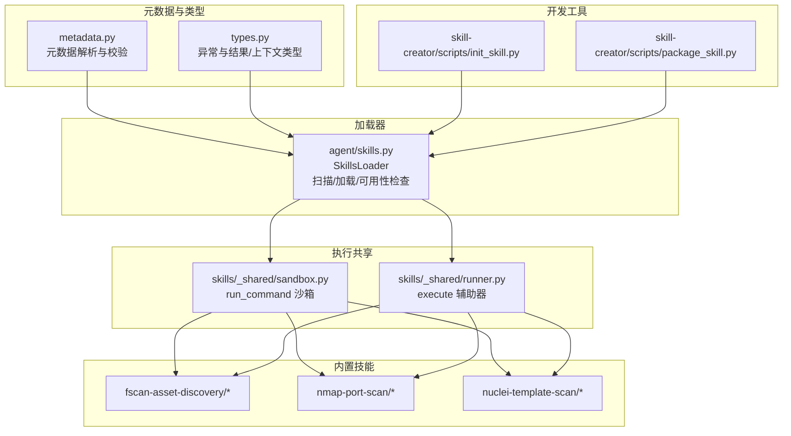
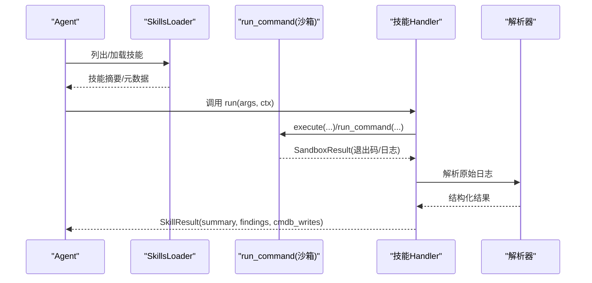
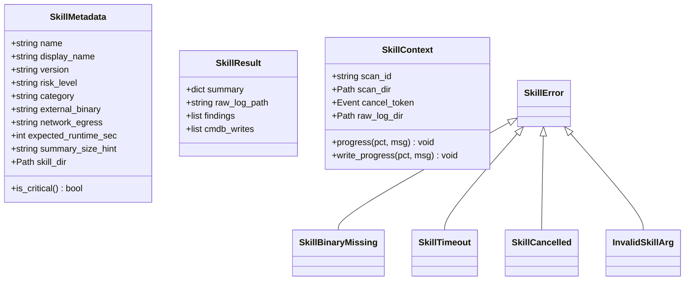
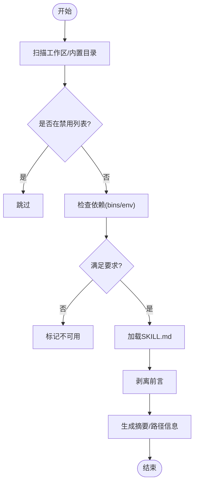
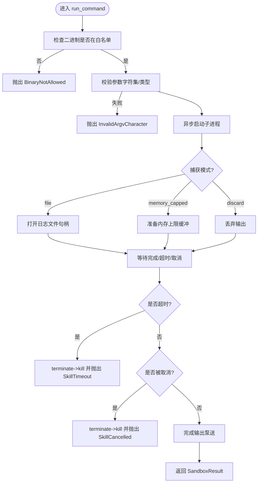
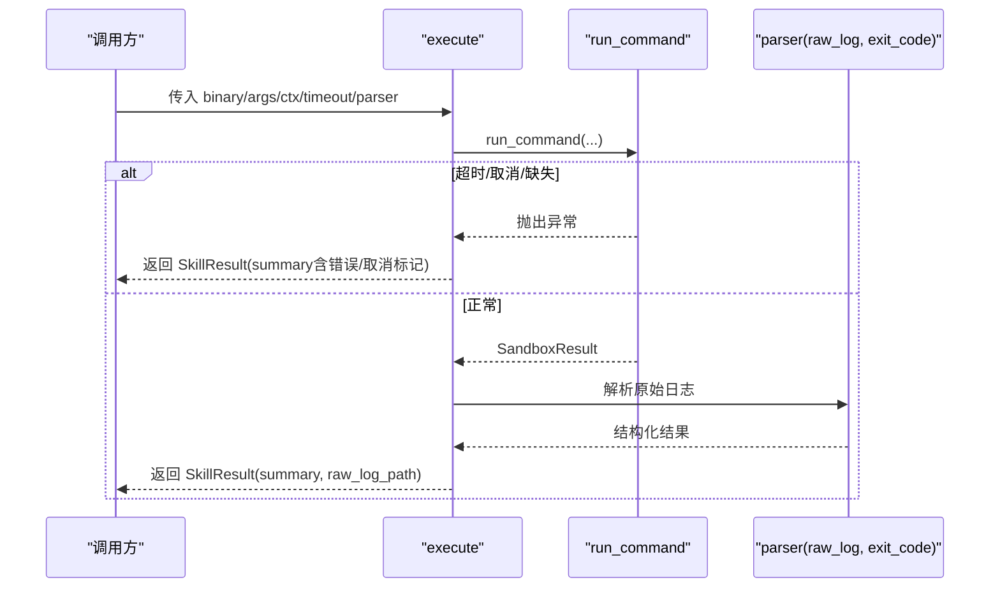
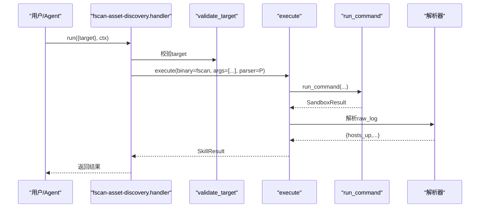
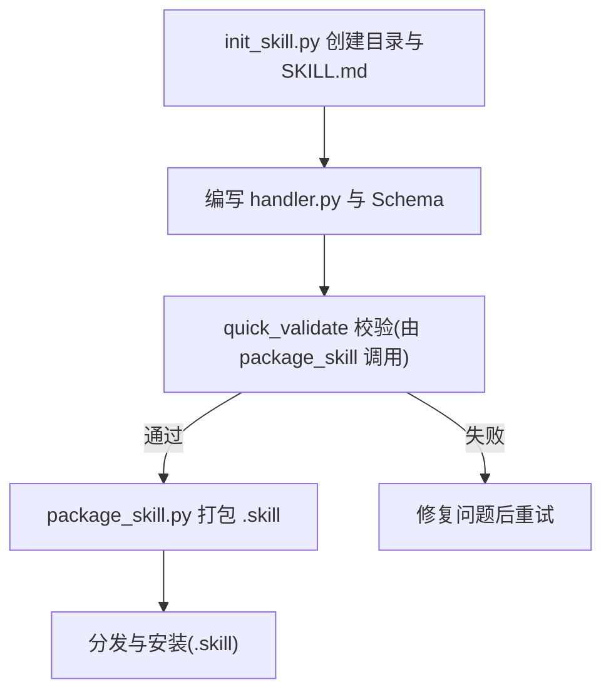
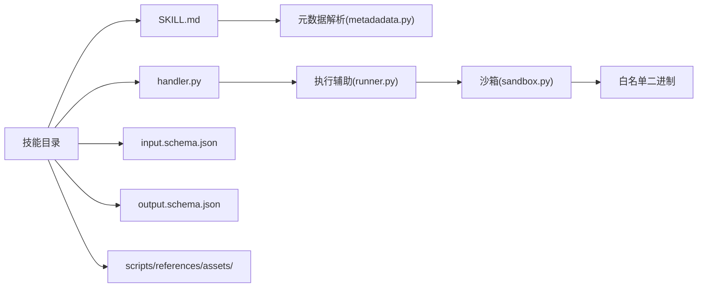

# 技能系统设计

<cite>
**本文引用的文件**
- [secbot/skills/metadata.py](file://secbot/skills/metadata.py)
- [secbot/skills/types.py](file://secbot/skills/types.py)
- [secbot/agent/skills.py](file://secbot/agent/skills.py)
- [secbot/skills/_shared/sandbox.py](file://secbot/skills/_shared/sandbox.py)
- [secbot/skills/_shared/runner.py](file://secbot/skills/_shared/runner.py)
- [secbot/skills/fscan-asset-discovery/handler.py](file://secbot/skills/fscan-asset-discovery/handler.py)
- [secbot/skills/fscan-asset-discovery/input.schema.json](file://secbot/skills/fscan-asset-discovery/input.schema.json)
- [secbot/skills/fscan-asset-discovery/output.schema.json](file://secbot/skills/fscan-asset-discovery/output.schema.json)
- [secbot/skills/nmap-port-scan/handler.py](file://secbot/skills/nmap-port-scan/handler.py)
- [secbot/skills/nuclei-template-scan/handler.py](file://secbot/skills/nuclei-template-scan/handler.py)
- [secbot/skills/nuclei-template-scan/input.schema.json](file://secbot/skills/nuclei-template-scan/input.schema.json)
- [secbot/skills/nuclei-template-scan/output.schema.json](file://secbot/skills/nuclei-template-scan/output.schema.json)
- [secbot/skills/skill-creator/scripts/init_skill.py](file://secbot/skills/skill-creator/scripts/init_skill.py)
- [secbot/skills/skill-creator/scripts/package_skill.py](file://secbot/skills/skill-creator/scripts/package_skill.py)
</cite>

## 目录
1. [引言](#引言)
2. [项目结构](#项目结构)
3. [核心组件](#核心组件)
4. [架构总览](#架构总览)
5. [详细组件分析](#详细组件分析)
6. [依赖分析](#依赖分析)
7. [性能考虑](#性能考虑)
8. [故障排查指南](#故障排查指南)
9. [结论](#结论)
10. [附录](#附录)

## 引言
本文件面向VAPT3/secbot的“技能系统”，提供从架构设计到实现细节、从安全沙箱到标准化Schema的全栈技术文档。内容覆盖技能注册机制、参数验证体系、执行沙箱保护、标准化输入输出Schema、Handler函数实现、错误处理机制、内置技能实现分析（资产发现、端口扫描、漏洞扫描、弱口令检测）、与工具系统的集成关系、版本与依赖管理、技能开发全流程（模板、打包、验证），以及最佳实践与性能优化建议。

## 项目结构
技能系统主要由以下层次构成：
- 元数据与类型层：负责技能元数据解析、异常类型与运行时上下文定义
- 加载器层：负责在工作区与内置目录中扫描、加载、过滤技能
- 执行共享层：提供统一的命令执行沙箱与执行辅助器
- 内置技能层：以标准化方式实现具体扫描/检测任务
- 开发工具层：提供技能初始化与打包脚本

图表来源
- [secbot/skills/metadata.py:1-147](file://secbot/skills/metadata.py#L1-L147)
- [secbot/skills/types.py:1-87](file://secbot/skills/types.py#L1-L87)
- [secbot/agent/skills.py:1-243](file://secbot/agent/skills.py#L1-L243)
- [secbot/skills/_shared/sandbox.py:1-192](file://secbot/skills/_shared/sandbox.py#L1-L192)
- [secbot/skills/_shared/runner.py:1-83](file://secbot/skills/_shared/runner.py#L1-L83)
- [secbot/skills/fscan-asset-discovery/handler.py:1-36](file://secbot/skills/fscan-asset-discovery/handler.py#L1-L36)
- [secbot/skills/nmap-port-scan/handler.py:1-48](file://secbot/skills/nmap-port-scan/handler.py#L1-L48)
- [secbot/skills/nuclei-template-scan/handler.py:1-154](file://secbot/skills/nuclei-template-scan/handler.py#L1-L154)
- [secbot/skills/skill-creator/scripts/init_skill.py:1-379](file://secbot/skills/skill-creator/scripts/init_skill.py#L1-L379)
- [secbot/skills/skill-creator/scripts/package_skill.py:1-153](file://secbot/skills/skill-creator/scripts/package_skill.py#L1-L153)

章节来源
- [secbot/skills/metadata.py:1-147](file://secbot/skills/metadata.py#L1-L147)
- [secbot/skills/types.py:1-87](file://secbot/skills/types.py#L1-L87)
- [secbot/agent/skills.py:1-243](file://secbot/agent/skills.py#L1-L243)
- [secbot/skills/_shared/sandbox.py:1-192](file://secbot/skills/_shared/sandbox.py#L1-L192)
- [secbot/skills/_shared/runner.py:1-83](file://secbot/skills/_shared/runner.py#L1-L83)

## 核心组件
- 元数据解析与校验：从SKILL.md提取并校验字段，保证技能名称、风险等级、网络策略、运行时预估等符合规范
- 类型与异常：定义SkillResult/SkillContext与各类运行期异常，确保错误可传播且可控
- 技能加载器：扫描工作区与内置技能目录，按要求过滤不可用技能，支持前端展示摘要与按需加载
- 执行沙箱：统一的二进制白名单、参数字符集校验、超时/取消/内存限制、日志捕获策略
- 执行辅助器：封装execute流程，统一调用沙箱、解析器、错误归一化
- 内置技能：资产发现、端口扫描、漏洞扫描等，遵循输入/输出Schema与Handler约定
- 开发工具：初始化模板、打包分发

章节来源
- [secbot/skills/metadata.py:56-147](file://secbot/skills/metadata.py#L56-L147)
- [secbot/skills/types.py:44-87](file://secbot/skills/types.py#L44-L87)
- [secbot/agent/skills.py:21-243](file://secbot/agent/skills.py#L21-L243)
- [secbot/skills/_shared/sandbox.py:70-192](file://secbot/skills/_shared/sandbox.py#L70-L192)
- [secbot/skills/_shared/runner.py:38-83](file://secbot/skills/_shared/runner.py#L38-L83)

## 架构总览
技能系统围绕“标准化技能包”展开：每个技能以目录形式存在，包含SKILL.md（含YAML前言）、可选的handler.py、输入/输出Schema、以及可选的资源目录（scripts/references/assets）。加载器负责发现与校验；执行阶段通过沙箱统一约束外部进程；内置技能提供典型扫描/检测能力；开发工具链提供模板与打包。

图表来源
- [secbot/agent/skills.py:51-110](file://secbot/agent/skills.py#L51-L110)
- [secbot/skills/_shared/runner.py:38-83](file://secbot/skills/_shared/runner.py#L38-L83)
- [secbot/skills/_shared/sandbox.py:70-192](file://secbot/skills/_shared/sandbox.py#L70-L192)
- [secbot/skills/fscan-asset-discovery/handler.py:24-36](file://secbot/skills/fscan-asset-discovery/handler.py#L24-L36)
- [secbot/skills/nmap-port-scan/handler.py:32-48](file://secbot/skills/nmap-port-scan/handler.py#L32-L48)
- [secbot/skills/nuclei-template-scan/handler.py:98-154](file://secbot/skills/nuclei-template-scan/handler.py#L98-L154)

## 详细组件分析

### 元数据与类型系统
- 元数据解析：从SKILL.md读取YAML前言，校验必需字段、枚举值、类型一致性，并返回SkillMetadata对象
- 类型与异常：SkillResult用于统一返回结构；SkillContext承载扫描上下文、取消令牌、进度回调；定义多种运行期异常便于上层感知

图表来源
- [secbot/skills/metadata.py:23-114](file://secbot/skills/metadata.py#L23-L114)
- [secbot/skills/types.py:44-87](file://secbot/skills/types.py#L44-L87)

章节来源
- [secbot/skills/metadata.py:56-147](file://secbot/skills/metadata.py#L56-L147)
- [secbot/skills/types.py:19-87](file://secbot/skills/types.py#L19-L87)

### 技能加载器（SkillsLoader）
- 扫描策略：优先工作区skills目录，再合并内置skills目录；支持禁用列表、可用性过滤（依赖二进制/环境变量）
- 前言剥离：去除SKILL.md中的YAML前言，便于上下文拼接
- 元数据解析：支持secbot/openclaw风格的嵌套metadata字段
- 上下文构建：按需加载指定技能内容，生成Markdown摘要

图表来源
- [secbot/agent/skills.py:51-142](file://secbot/agent/skills.py#L51-L142)
- [secbot/agent/skills.py:189-243](file://secbot/agent/skills.py#L189-L243)

章节来源
- [secbot/agent/skills.py:21-243](file://secbot/agent/skills.py#L21-L243)

### 执行沙箱（run_command）
- 白名单机制：仅允许预置二进制（如nmap、fscan、nuclei、hydra、masscan、weasyprint、python3、git）执行
- 参数安全：禁止危险字符集合，逐元素校验类型
- 超时与取消：基于事件等待与asyncio.wait，超时或取消时优雅终止子进程
- 日志捕获：支持文件落盘、内存上限捕获、丢弃三种模式
- 返回结果：SandboxResult包含退出码、日志路径、可选捕获字节

图表来源
- [secbot/skills/_shared/sandbox.py:70-192](file://secbot/skills/_shared/sandbox.py#L70-L192)

章节来源
- [secbot/skills/_shared/sandbox.py:23-50](file://secbot/skills/_shared/sandbox.py#L23-L50)
- [secbot/skills/_shared/sandbox.py:59-94](file://secbot/skills/_shared/sandbox.py#L59-L94)
- [secbot/skills/_shared/sandbox.py:109-192](file://secbot/skills/_shared/sandbox.py#L109-L192)

### 执行辅助器（execute）
- 统一入口：封装run_command调用，记录耗时，委托解析器
- 错误归一化：超时/取消/二进制缺失等异常转换为可识别的summary字段
- 解析器接口：可选解析器将原始日志转为结构化summary/findings/cmdb_writes

图表来源
- [secbot/skills/_shared/runner.py:38-83](file://secbot/skills/_shared/runner.py#L38-L83)
- [secbot/skills/_shared/sandbox.py:70-192](file://secbot/skills/_shared/sandbox.py#L70-L192)

章节来源
- [secbot/skills/_shared/runner.py:28-36](file://secbot/skills/_shared/runner.py#L28-L36)
- [secbot/skills/_shared/runner.py:38-83](file://secbot/skills/_shared/runner.py#L38-L83)

### 内置技能实现分析

#### 资产发现（fscan-asset-discovery）
- 输入Schema：target字符串，长度限制
- Handler：校验目标格式，调用execute，解析“存活主机”正则，限制最多返回数量
- 输出Schema：hosts_up数组、耗时、错误字段

图表来源
- [secbot/skills/fscan-asset-discovery/handler.py:24-36](file://secbot/skills/fscan-asset-discovery/handler.py#L24-L36)
- [secbot/skills/fscan-asset-discovery/input.schema.json:1-10](file://secbot/skills/fscan-asset-discovery/input.schema.json#L1-L10)
- [secbot/skills/fscan-asset-discovery/output.schema.json:1-11](file://secbot/skills/fscan-asset-discovery/output.schema.json#L1-L11)

章节来源
- [secbot/skills/fscan-asset-discovery/handler.py:16-36](file://secbot/skills/fscan-asset-discovery/handler.py#L16-L36)
- [secbot/skills/fscan-asset-discovery/input.schema.json:1-10](file://secbot/skills/fscan-asset-discovery/input.schema.json#L1-L10)
- [secbot/skills/fscan-asset-discovery/output.schema.json:1-11](file://secbot/skills/fscan-asset-discovery/output.schema.json#L1-L11)

#### 端口扫描（nmap-port-scan）
- 输入Schema：targets数组、ports字符串（支持范围/逗号）
- Handler：对每个目标校验，校验端口规格，调用execute，解析nmap-Grep输出
- 输出Schema：services数组（host/port/proto/service）、耗时、错误

章节来源
- [secbot/skills/nmap-port-scan/handler.py:32-48](file://secbot/skills/nmap-port-scan/handler.py#L32-L48)

#### 漏洞扫描（nuclei-template-scan）
- 输入Schema：targets数组（限制数量与格式）、severity枚举、tags字符串
- Handler：校验参数，写入targets文件，调用run_command（jsonl输出），解析JSONL为findings与cmdb_writes
- 输出Schema：summary（计数/耗时/错误/取消）、raw_log_path、findings数组

章节来源
- [secbot/skills/nuclei-template-scan/handler.py:36-96](file://secbot/skills/nuclei-template-scan/handler.py#L36-L96)
- [secbot/skills/nuclei-template-scan/handler.py:98-154](file://secbot/skills/nuclei-template-scan/handler.py#L98-L154)
- [secbot/skills/nuclei-template-scan/input.schema.json:1-31](file://secbot/skills/nuclei-template-scan/input.schema.json#L1-L31)
- [secbot/skills/nuclei-template-scan/output.schema.json:1-34](file://secbot/skills/nuclei-template-scan/output.schema.json#L1-L34)

### 技能开发全流程指南
- 初始化模板：使用init_skill.py生成技能骨架，支持选择scripts/references/assets资源目录，可选示例文件
- 编写Handler与Schema：遵循输入/输出Schema，实现run(args, ctx)与必要解析器
- 验证与打包：使用package_skill.py进行合法性检查与打包，输出.zip格式的.skill文件

图表来源
- [secbot/skills/skill-creator/scripts/init_skill.py:255-318](file://secbot/skills/skill-creator/scripts/init_skill.py#L255-L318)
- [secbot/skills/skill-creator/scripts/package_skill.py:34-125](file://secbot/skills/skill-creator/scripts/package_skill.py#L34-L125)

章节来源
- [secbot/skills/skill-creator/scripts/init_skill.py:194-318](file://secbot/skills/skill-creator/scripts/init_skill.py#L194-L318)
- [secbot/skills/skill-creator/scripts/package_skill.py:34-153](file://secbot/skills/skill-creator/scripts/package_skill.py#L34-L153)

## 依赖分析
- 技能目录组织：每个技能目录包含SKILL.md与可选的handler.py、input.schema.json、output.schema.json、资源目录
- 运行时依赖：SkillsLoader根据requires.bins与环境变量判断可用性
- 执行依赖：所有外部命令必须在二进制白名单内，参数必须通过字符集与类型校验
- 解析依赖：各技能自行实现解析器，统一输出到SkillResult

图表来源
- [secbot/skills/metadata.py:56-147](file://secbot/skills/metadata.py#L56-L147)
- [secbot/agent/skills.py:189-243](file://secbot/agent/skills.py#L189-L243)
- [secbot/skills/_shared/sandbox.py:23-50](file://secbot/skills/_shared/sandbox.py#L23-L50)
- [secbot/skills/_shared/runner.py:38-83](file://secbot/skills/_shared/runner.py#L38-L83)

章节来源
- [secbot/agent/skills.py:189-243](file://secbot/agent/skills.py#L189-L243)
- [secbot/skills/_shared/sandbox.py:23-50](file://secbot/skills/_shared/sandbox.py#L23-L50)

## 性能考虑
- 超时与取消：沙箱强制超时，避免长时间阻塞；取消令牌支持快速中断
- 内存捕获上限：内存捕获模式限制最大字节数，防止大输出导致内存溢出
- 日志落盘：默认文件捕获，减少内存压力；解析器仅在需要时读取
- 限流与截断：输出数组设置最大项数，避免结果过大
- 并发与I/O：异步泵送与等待，降低阻塞风险

章节来源
- [secbot/skills/_shared/sandbox.py:82-192](file://secbot/skills/_shared/sandbox.py#L82-L192)
- [secbot/skills/_shared/runner.py:71-83](file://secbot/skills/_shared/runner.py#L71-L83)
- [secbot/skills/fscan-asset-discovery/handler.py:16-22](file://secbot/skills/fscan-asset-discovery/handler.py#L16-L22)
- [secbot/skills/nuclei-template-scan/handler.py:98-154](file://secbot/skills/nuclei-template-scan/handler.py#L98-L154)

## 故障排查指南
- 元数据错误：检查SKILL.md前言格式、必需字段、枚举值与类型
- 二进制缺失：确认PATH中存在白名单二进制；或在requires.bins中补齐
- 参数非法：检查输入Schema与Handler中的参数校验逻辑
- 超时/取消：调整timeout_sec或检查cancel_token触发原因
- 解析失败：查看raw_log并定位解析器逻辑，必要时增加容错

章节来源
- [secbot/skills/metadata.py:19-53](file://secbot/skills/metadata.py#L19-L53)
- [secbot/skills/_shared/sandbox.py:87-98](file://secbot/skills/_shared/sandbox.py#L87-L98)
- [secbot/skills/_shared/runner.py:62-67](file://secbot/skills/_shared/runner.py#L62-L67)

## 结论
VAPT3/secbot的技能系统通过“标准化技能包 + 统一沙箱 + 可插拔解析器”的设计，实现了高安全性、强一致性的扫描/检测能力。元数据与类型系统确保了技能的可发现性与可验证性；加载器提供了灵活的发现与可用性控制；沙箱在二进制白名单、参数校验、超时/取消、内存限制等方面提供了完备的安全边界；内置技能展示了输入/输出Schema与Handler的规范实现。开发工具链进一步降低了技能创建与分发的成本。建议在实际部署中结合业务场景合理配置超时、网络策略与白名单，持续完善Schema与解析器，保障稳定性与可观测性。

## 附录
- 安全白名单（二进制）：nmap、fscan、nuclei、hydra、masscan、weasyprint、python3、git
- 禁止字符集：&;|$`<>\n\r\\\"'
- 网络策略：required/optional/none（由平台侧配合实现）
- 最佳实践：
  - 严格遵守输入/输出Schema，保持向后兼容
  - 在Handler中显式校验输入，避免越界与注入
  - 使用execute/run_command统一发起外部调用，避免绕过沙箱
  - 合理设置timeout_sec与memory_cap_mb，平衡性能与安全
  - 对大输出采用文件捕获，小输出可使用memory_capped并设置上限
  - 将解析器与错误处理逻辑模块化，便于测试与维护