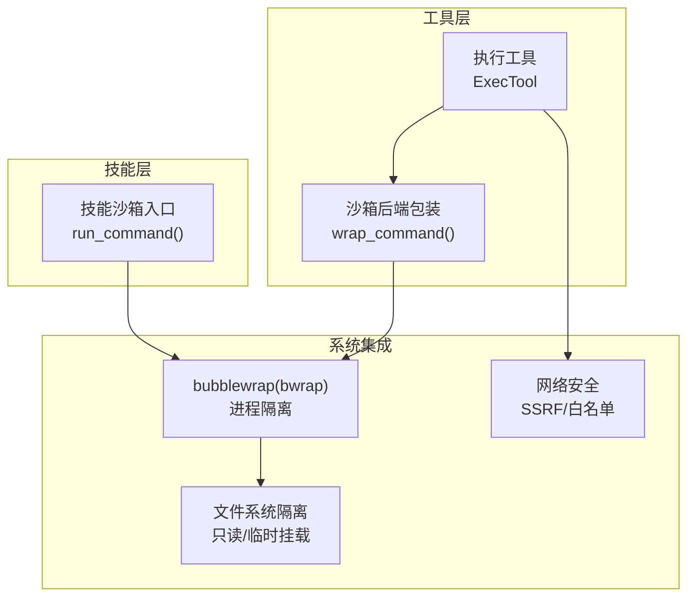
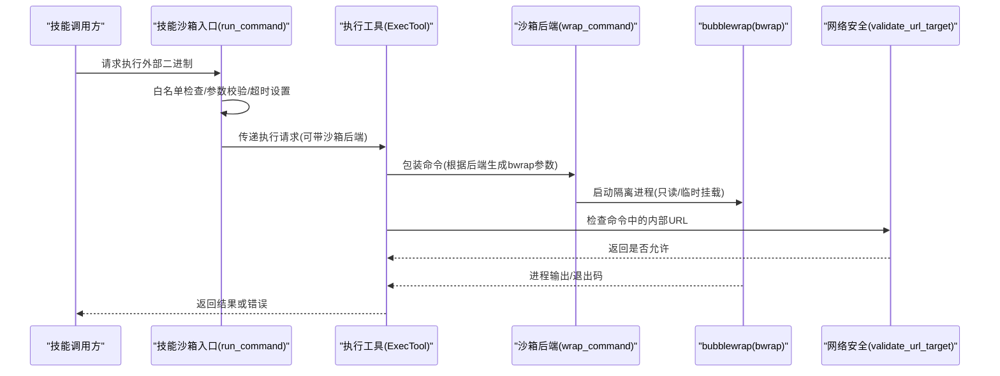
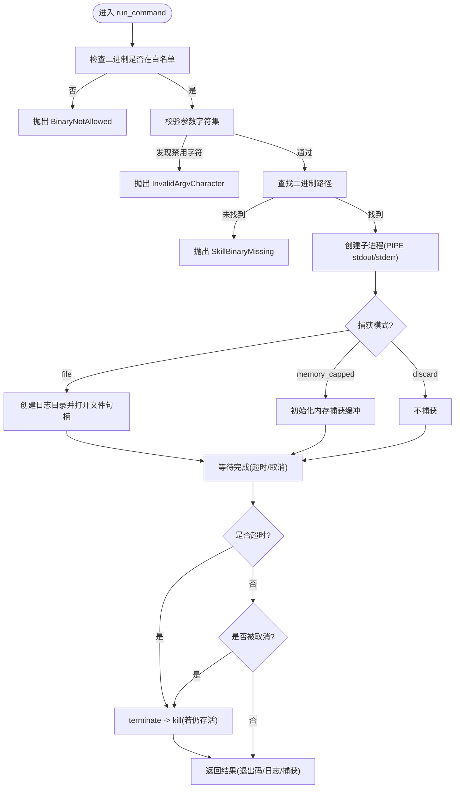
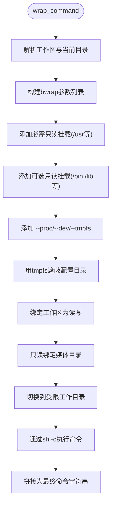
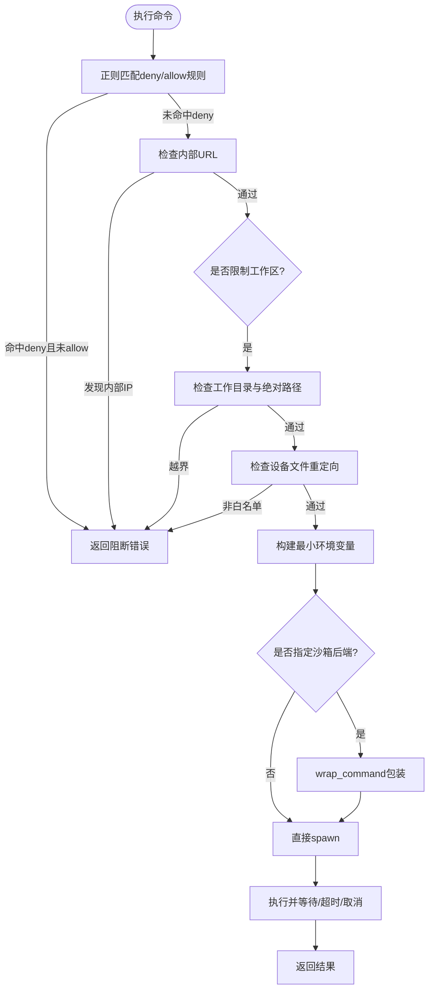
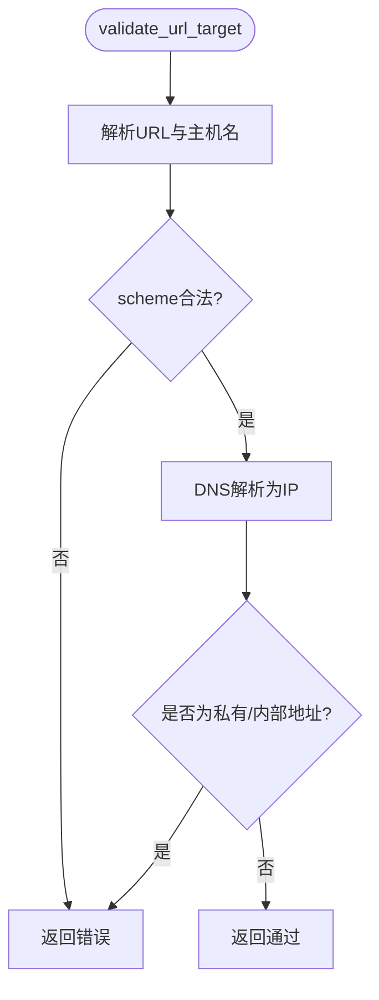
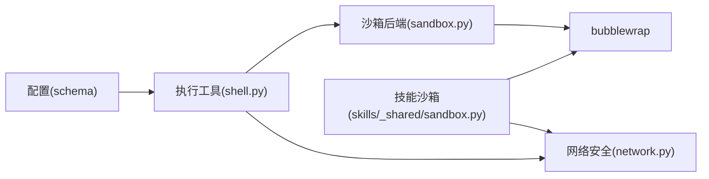

# 沙箱安全机制

<cite>
**本文档引用的文件**
- [secbot/skills/_shared/sandbox.py](file://secbot/skills/_shared/sandbox.py)
- [secbot/agent/tools/sandbox.py](file://secbot/agent/tools/sandbox.py)
- [secbot/agent/tools/shell.py](file://secbot/agent/tools/shell.py)
- [secbot/security/network.py](file://secbot/security/network.py)
- [secbot/config/schema.py](file://secbot/config/schema.py)
- [tests/security/test_sandbox.py](file://tests/security/test_sandbox.py)
- [tests/tools/test_sandbox.py](file://tests/tools/test_sandbox.py)
- [tests/tools/test_exec_security.py](file://tests/tools/test_exec_security.py)
- [webui/src/gap/whitelists.md](file://webui/src/gap/whitelists.md)
- [webui/src/gap/audit-log.md](file://webui/src/gap/audit-log.md)
</cite>

## 目录
1. [简介](#简介)
2. [项目结构](#项目结构)
3. [核心组件](#核心组件)
4. [架构总览](#架构总览)
5. [详细组件分析](#详细组件分析)
6. [依赖关系分析](#依赖关系分析)
7. [性能考虑](#性能考虑)
8. [故障排除指南](#故障排除指南)
9. [结论](#结论)
10. [附录](#附录)

## 简介
本文件面向VAPT3的沙箱安全机制，系统性阐述其安全设计理念与实现细节，覆盖进程隔离、资源限制、网络访问控制、文件系统访问控制、环境变量管理、进程树管理、网络安全防护、配置与管理、安全审计与监控等方面。目标是帮助安全与运维人员理解并正确部署、配置与审计沙箱，确保在执行外部工具与命令时保持最小权限与最大隔离。

## 项目结构
围绕沙箱安全的关键代码分布在以下模块：
- 技能层沙箱入口：统一的命令执行与安全约束
- 工具层沙箱后端：基于bubblewrap的容器化封装
- 执行工具：命令执行工具的边界保护与路径/网络/设备文件安全
- 网络安全：SSRF防护与内部地址检测
- 配置模式：工具与沙箱的可配置参数
- 测试用例：验证沙箱行为与安全策略

**图表来源**
- [secbot/skills/_shared/sandbox.py:70-192](file://secbot/skills/_shared/sandbox.py#L70-L192)
- [secbot/agent/tools/sandbox.py:14-56](file://secbot/agent/tools/sandbox.py#L14-L56)
- [secbot/agent/tools/shell.py:123-216](file://secbot/agent/tools/shell.py#L123-L216)
- [secbot/security/network.py:45-120](file://secbot/security/network.py#L45-L120)

**章节来源**
- [secbot/skills/_shared/sandbox.py:1-192](file://secbot/skills/_shared/sandbox.py#L1-L192)
- [secbot/agent/tools/sandbox.py:1-56](file://secbot/agent/tools/sandbox.py#L1-L56)
- [secbot/agent/tools/shell.py:1-380](file://secbot/agent/tools/shell.py#L1-L380)
- [secbot/security/network.py:1-120](file://secbot/security/network.py#L1-L120)

## 核心组件
- 技能沙箱入口：对二进制白名单、参数注入防护、超时与取消、输出捕获、内存上限进行统一约束
- 沙箱后端包装：将命令通过bubblewrap进行进程隔离，挂载工作区为读写，隐藏配置目录，只读挂载媒体目录
- 执行工具：在平台壳中执行命令，内置路径越界、内部URL、敏感路径重定向等安全守卫
- 网络安全：对私有/内部地址进行阻断，支持CIDR白名单豁免
- 配置模式：工具与沙箱的可配置参数，如超时、沙箱后端、允许的环境变量键、路径追加、SSRF白名单等

**章节来源**
- [secbot/skills/_shared/sandbox.py:23-104](file://secbot/skills/_shared/sandbox.py#L23-L104)
- [secbot/agent/tools/sandbox.py:14-45](file://secbot/agent/tools/sandbox.py#L14-L45)
- [secbot/agent/tools/shell.py:303-363](file://secbot/agent/tools/shell.py#L303-L363)
- [secbot/security/network.py:29-78](file://secbot/security/network.py#L29-L78)
- [secbot/config/schema.py:226-265](file://secbot/config/schema.py#L226-L265)

## 架构总览
VAPT3的沙箱安全由“技能层沙箱入口 + 工具层沙箱后端 + 执行工具 + 网络安全”构成的多层防护体系：

**图表来源**
- [secbot/skills/_shared/sandbox.py:70-192](file://secbot/skills/_shared/sandbox.py#L70-L192)
- [secbot/agent/tools/sandbox.py:51-56](file://secbot/agent/tools/sandbox.py#L51-L56)
- [secbot/agent/tools/shell.py:123-216](file://secbot/agent/tools/shell.py#L123-L216)
- [secbot/security/network.py:45-120](file://secbot/security/network.py#L45-L120)

## 详细组件分析

### 技能沙箱入口（run_command）
- 二进制白名单：仅允许预定义列表中的外部二进制执行
- 参数注入防护：禁止特定字符集，避免命令注入
- 超时与取消：统一的超时与取消令牌机制，防止长时间运行与僵尸进程
- 输出捕获：支持文件落盘、内存上限捕获、丢弃三种模式
- 进程生命周期：统一等待、终止、杀掉与资源回收

**图表来源**
- [secbot/skills/_shared/sandbox.py:70-192](file://secbot/skills/_shared/sandbox.py#L70-L192)

**章节来源**
- [secbot/skills/_shared/sandbox.py:23-104](file://secbot/skills/_shared/sandbox.py#L23-L104)
- [secbot/skills/_shared/sandbox.py:105-192](file://secbot/skills/_shared/sandbox.py#L105-L192)
- [tests/security/test_sandbox.py:26-153](file://tests/security/test_sandbox.py#L26-L153)

### 沙箱后端包装（wrap_command + bwrap）
- bubblewrap参数生成：会话隔离、父进程退出即死亡、只读挂载关键系统目录、临时挂载工作区父目录以隐藏配置、工作区读写挂载、媒体目录只读挂载、切换到受限工作目录
- 命令包装：通过shell -c执行原始命令，保证特殊字符处理与环境一致性

**图表来源**
- [secbot/agent/tools/sandbox.py:14-45](file://secbot/agent/tools/sandbox.py#L14-L45)

**章节来源**
- [secbot/agent/tools/sandbox.py:14-56](file://secbot/agent/tools/sandbox.py#L14-L56)
- [tests/tools/test_sandbox.py:15-122](file://tests/tools/test_sandbox.py#L15-L122)

### 执行工具（ExecTool）安全守卫
- 路径越界保护：当启用工作区限制时，拒绝工作目录越界与绝对路径指向工作区外
- 内部URL阻断：扫描命令中的HTTP/HTTPS URL，解析IP并阻断私有/内部地址
- 敏感路径重定向阻断：针对历史文件与游标文件的写入/移动/复制等高风险操作
- 设备文件白名单：允许/dev/null等内核设备作为重定向目标
- 环境变量最小化：按平台传递必要环境变量，避免泄露敏感信息
- 沙箱后端应用：在Unix平台对命令进行bwrap包装；Windows提示不支持

**图表来源**
- [secbot/agent/tools/shell.py:303-363](file://secbot/agent/tools/shell.py#L303-L363)
- [secbot/agent/tools/shell.py:123-216](file://secbot/agent/tools/shell.py#L123-L216)
- [secbot/security/network.py:112-120](file://secbot/security/network.py#L112-L120)

**章节来源**
- [secbot/agent/tools/shell.py:303-363](file://secbot/agent/tools/shell.py#L303-L363)
- [secbot/agent/tools/shell.py:257-301](file://secbot/agent/tools/shell.py#L257-L301)
- [tests/tools/test_exec_security.py:26-246](file://tests/tools/test_exec_security.py#L26-L246)

### 网络安全（SSRF防护）
- 私有/内部网段阻断：0.0.0.0/8、10.0.0.0/8、100.64.0.0/10、127.0.0.0/8、169.254.0.0/16、172.16.0.0/12、192.168.0.0/16、IPv6 ::1/128、fc00::/7、fe80::/10
- CIDR白名单：支持配置允许的CIDR范围以放行特定内部网络（如CGNAT/Tailscale）
- URL验证：仅允许http/https，校验scheme/host/port，解析IP并阻断私有地址
- 已解析URL验证：对重定向后的目标再次检查IP

**图表来源**
- [secbot/security/network.py:45-120](file://secbot/security/network.py#L45-L120)

**章节来源**
- [secbot/security/network.py:11-78](file://secbot/security/network.py#L11-L78)
- [tests/security/test_security_network.py:41-145](file://tests/security/test_security_network.py#L41-L145)

### 配置与管理
- 工具配置（ToolsConfig.ExecToolConfig）：启用/禁用、超时、沙箱后端、允许的环境变量键、允许/拒绝正则模式
- 全局配置（ToolsConfig）：是否限制所有工具访问工作区、SSRF白名单
- 配置加载：从环境变量与配置文件解析，支持工具层传参覆盖

**章节来源**
- [secbot/config/schema.py:226-265](file://secbot/config/schema.py#L226-L265)

## 依赖关系分析
- 技能沙箱入口依赖工具层沙箱后端生成bwrap命令
- 执行工具在Unix平台使用wrap_command进行进程隔离
- 执行工具在命令执行前进行网络安全检查
- 配置模式贯穿工具与沙箱层，决定行为边界

**图表来源**
- [secbot/config/schema.py:226-265](file://secbot/config/schema.py#L226-L265)
- [secbot/agent/tools/shell.py:123-216](file://secbot/agent/tools/shell.py#L123-L216)
- [secbot/agent/tools/sandbox.py:51-56](file://secbot/agent/tools/sandbox.py#L51-L56)
- [secbot/security/network.py:45-120](file://secbot/security/network.py#L45-L120)
- [secbot/skills/_shared/sandbox.py:70-192](file://secbot/skills/_shared/sandbox.py#L70-L192)

**章节来源**
- [secbot/config/schema.py:226-265](file://secbot/config/schema.py#L226-L265)
- [secbot/agent/tools/shell.py:123-216](file://secbot/agent/tools/shell.py#L123-L216)
- [secbot/agent/tools/sandbox.py:51-56](file://secbot/agent/tools/sandbox.py#L51-L56)
- [secbot/security/network.py:45-120](file://secbot/security/network.py#L45-L120)
- [secbot/skills/_shared/sandbox.py:70-192](file://secbot/skills/_shared/sandbox.py#L70-L192)

## 性能考虑
- I/O泵：异步读取子进程stdout，分块写入文件或内存，避免阻塞
- 内存捕获上限：按MB限制捕获大小，防止内存膨胀
- 超时与取消：统一的等待与终止逻辑，避免僵尸进程与资源泄漏
- bubblewrap最小化：仅挂载必要系统目录，减少I/O与开销
- 网络解析缓存：建议在上层复用DNS解析结果，减少重复解析

[本节为通用指导，无需具体文件分析]

## 故障排除指南
- 二进制不在白名单：检查工具配置与技能声明的external_binary字段
- 参数包含禁用字符：修正命令中的特殊字符或改用安全参数传递方式
- 超时/取消：调整工具超时配置或取消令牌触发原因
- 沙箱后端不可用：确认容器内已安装bubblewrap，或在Windows平台避免使用沙箱
- 内部URL被阻断：将目标加入SSRF白名单或改为公网可达地址
- 工作区越界：关闭工作区限制或确保工作目录与绝对路径位于工作区内

**章节来源**
- [tests/security/test_sandbox.py:26-153](file://tests/security/test_sandbox.py#L26-L153)
- [tests/tools/test_sandbox.py:15-122](file://tests/tools/test_sandbox.py#L15-L122)
- [tests/tools/test_exec_security.py:123-246](file://tests/tools/test_exec_security.py#L123-L246)
- [secbot/security/network.py:29-78](file://secbot/security/network.py#L29-L78)

## 结论
VAPT3的沙箱安全机制通过“白名单+参数校验+超时/取消+bubblewrap隔离+网络安全+路径/设备文件守卫”的多层设计，在保障功能可用的同时最大化安全性。建议在生产环境中启用工作区限制、合理设置超时、配置SSRF白名单，并结合审计与监控持续优化安全策略。

[本节为总结，无需具体文件分析]

## 附录

### 安全配置清单
- 工具层
  - enable：启用/禁用执行工具
  - timeout：默认超时秒数
  - sandbox：空串或bwrap
  - allowed_env_keys：允许透传的环境变量键
  - allow_patterns/deny_patterns：允许/拒绝正则模式
- 全局层
  - restrict_to_workspace：是否限制所有工具访问工作区
  - ssrf_whitelist：CIDR白名单数组

**章节来源**
- [secbot/config/schema.py:226-265](file://secbot/config/schema.py#L226-L265)

### 审计与监控
- 前端缺口：白名单与审计日志页面的后端接口与数据模型
- 建议：后端中间件自动记录高风险动作与扫描启动事件，前端提供分页查询与筛选

**章节来源**
- [webui/src/gap/whitelists.md:1-28](file://webui/src/gap/whitelists.md#L1-L28)
- [webui/src/gap/audit-log.md:1-29](file://webui/src/gap/audit-log.md#L1-L29)