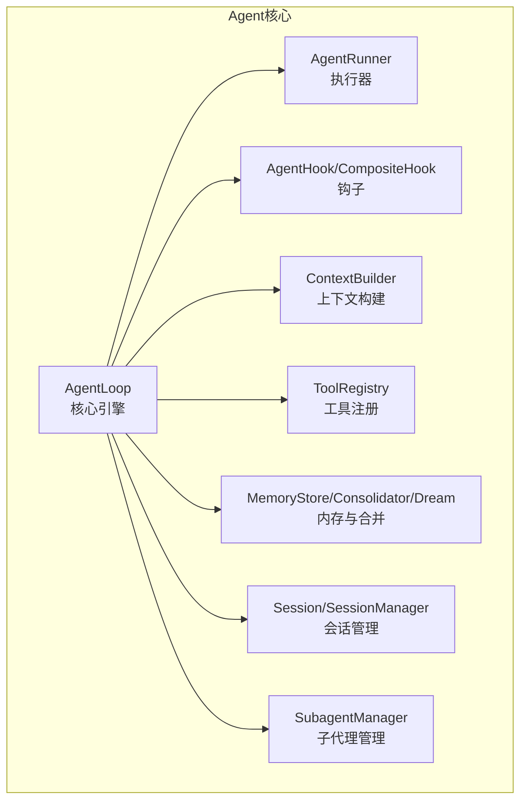
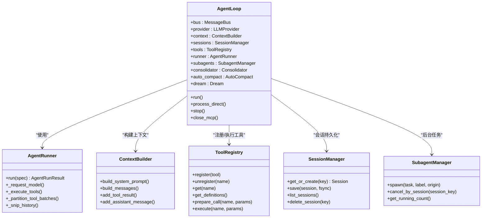
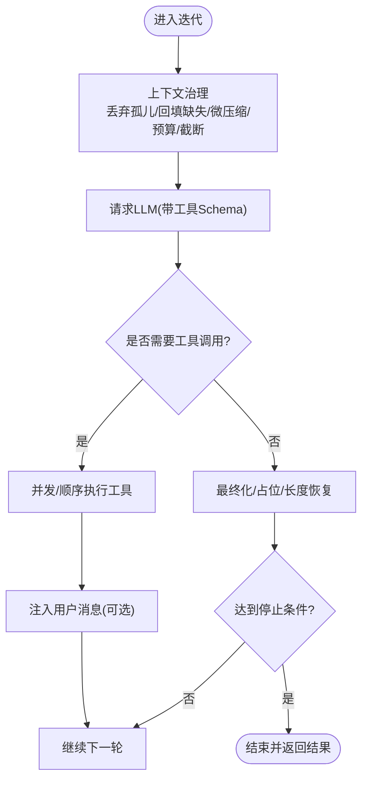
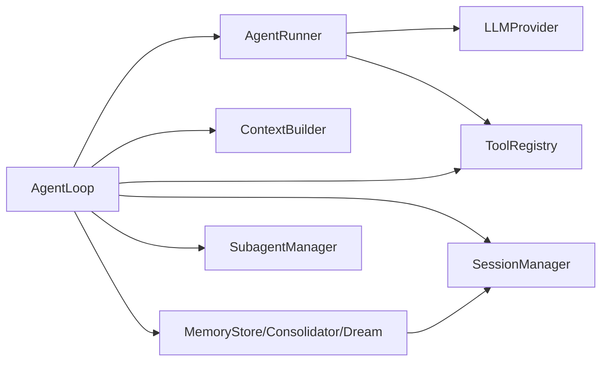

# AgentLoop核心引擎

<cite>
**本文档引用的文件**
- [secbot/agent/loop.py](file://secbot/agent/loop.py)
- [secbot/agent/context.py](file://secbot/agent/context.py)
- [secbot/agent/runner.py](file://secbot/agent/runner.py)
- [secbot/agent/tools/registry.py](file://secbot/agent/tools/registry.py)
- [secbot/agent/hook.py](file://secbot/agent/hook.py)
- [secbot/agent/memory.py](file://secbot/agent/memory.py)
- [secbot/agent/subagent.py](file://secbot/agent/subagent.py)
- [secbot/session/manager.py](file://secbot/session/manager.py)
</cite>

## 目录
1. [简介](#简介)
2. [项目结构](#项目结构)
3. [核心组件](#核心组件)
4. [架构总览](#架构总览)
5. [详细组件分析](#详细组件分析)
6. [依赖关系分析](#依赖关系分析)
7. [性能考虑](#性能考虑)
8. [故障排除指南](#故障排除指南)
9. [结论](#结论)

## 简介
本文件为VAPT3的AgentLoop核心引擎提供深入技术文档。AgentLoop是系统的核心处理引擎，负责接收消息、构建上下文、调用LLM、执行工具调用、发送响应的完整闭环。本文将从架构设计、生命周期管理、工具调用机制、上下文构建系统等方面进行系统化解析，并提供可操作的扩展与定制建议。

## 项目结构
AgentLoop相关代码主要分布在以下模块中：
- 核心引擎：secbot/agent/loop.py（包含AgentLoop类及内部钩子）
- 上下文构建：secbot/agent/context.py（系统提示词、消息拼接、运行时上下文）
- 执行器：secbot/agent/runner.py（共享的AgentRunner循环逻辑）
- 工具系统：secbot/agent/tools/registry.py（工具注册、参数校验、执行）
- 钩子系统：secbot/agent/hook.py（生命周期钩子与组合钩子）
- 内存与会话：secbot/agent/memory.py（记忆存储、合并器、梦处理器）、secbot/session/manager.py（会话持久化与历史管理）
- 子代理：secbot/agent/subagent.py（后台子任务管理）



**图表来源**
- [secbot/agent/loop.py:276-425](file://secbot/agent/loop.py#L276-L425)
- [secbot/agent/runner.py:100-120](file://secbot/agent/runner.py#L100-L120)
- [secbot/agent/context.py:17-31](file://secbot/agent/context.py#L17-L31)
- [secbot/agent/tools/registry.py:8-22](file://secbot/agent/tools/registry.py#L8-L22)
- [secbot/agent/memory.py:39-65](file://secbot/agent/memory.py#L39-L65)
- [secbot/session/manager.py:26-36](file://secbot/session/manager.py#L26-L36)
- [secbot/agent/subagent.py:70-106](file://secbot/agent/subagent.py#L70-L106)

**章节来源**
- [secbot/agent/loop.py:1-120](file://secbot/agent/loop.py#L1-L120)
- [secbot/agent/context.py:1-40](file://secbot/agent/context.py#L1-L40)
- [secbot/agent/runner.py:1-60](file://secbot/agent/runner.py#L1-L60)
- [secbot/agent/tools/registry.py:1-40](file://secbot/agent/tools/registry.py#L1-L40)
- [secbot/agent/memory.py:1-40](file://secbot/agent/memory.py#L1-L40)
- [secbot/session/manager.py:1-40](file://secbot/session/manager.py#L1-L40)
- [secbot/agent/subagent.py:1-40](file://secbot/agent/subagent.py#L1-L40)

## 核心组件
- AgentLoop：核心引擎，负责消息分发、会话路由、并发控制、任务调度、生命周期钩子集成、工具上下文设置、运行时检查点与恢复、流式输出与进度回调。
- AgentRunner：共享的执行循环，封装LLM请求、工具批处理、上下文治理（截断、孤儿工具结果清理、微压缩）、注入消息、错误分类与恢复、最大迭代次数控制。
- ContextBuilder：构建系统提示词与消息列表，整合长期记忆、技能、最近历史、运行时元数据，支持多模态用户内容（图片）。
- ToolRegistry：动态工具注册与执行，参数类型转换与校验、工具Schema缓存、批量并发策略。
- MemoryStore/Consolidator/Dream：纯文件IO的记忆层、基于令牌预算的轻量合并器、基于计划任务的深度记忆处理。
- Session/SessionManager：会话持久化（JSONL）、历史切片与令牌预算、文件容量限制与归档。
- SubagentManager：后台子任务管理，隔离工具集与状态，通过系统消息注入主回路。

**章节来源**
- [secbot/agent/loop.py:276-425](file://secbot/agent/loop.py#L276-L425)
- [secbot/agent/runner.py:100-234](file://secbot/agent/runner.py#L100-L234)
- [secbot/agent/context.py:17-165](file://secbot/agent/context.py#L17-L165)
- [secbot/agent/tools/registry.py:8-126](file://secbot/agent/tools/registry.py#L8-L126)
- [secbot/agent/memory.py:39-120](file://secbot/agent/memory.py#L39-L120)
- [secbot/session/manager.py:26-158](file://secbot/session/manager.py#L26-L158)
- [secbot/agent/subagent.py:70-153](file://secbot/agent/subagent.py#L70-L153)

## 架构总览
AgentLoop采用“消息驱动 + 生命周期钩子 + 执行器”的分层架构：
- 消息层：MessageBus消费入站消息，AgentLoop按会话键串行化处理，跨会话并发。
- 上下文层：ContextBuilder组装系统提示词与消息列表，注入运行时元信息与媒体内容。
- 执行层：AgentRunner循环调用LLM，根据返回的工具调用批量执行工具，处理空响应与长度截断，支持注入消息与检查点。
- 工具层：ToolRegistry统一管理工具注册、参数校验与执行，支持并发批处理与安全边界检测。
- 记忆层：MemoryStore与Consolidator在会话与全局层面进行历史归档与摘要，Dream进行周期性深度整理。
- 会话层：SessionManager负责历史切片、令牌预算、文件容量限制与持久化。
- 子代理层：SubagentManager独立运行后台任务并通过系统消息注入主回路。

```mermaid
sequenceDiagram
participant Bus as "消息总线"
participant Loop as "AgentLoop"
participant Runner as "AgentRunner"
participant Provider as "LLMProvider"
participant Tools as "ToolRegistry"
participant Store as "MemoryStore/Consolidator"
Bus->>Loop : 入站消息(InboundMessage)
Loop->>Loop : 会话路由/并发控制
Loop->>Loop : 构建上下文(ContextBuilder)
Loop->>Runner : 运行AgentRunSpec
Runner->>Provider : 请求LLM(带工具Schema)
Provider-->>Runner : 返回响应(含工具调用/内容)
alt 需要工具调用
Runner->>Tools : 并发/顺序执行工具
Tools-->>Runner : 工具结果
Runner->>Store : 合并/归档历史
Runner-->>Loop : 迭代继续或结束
else 无需工具调用
Runner-->>Loop : 最终响应
end
Loop-->>Bus : 出站消息(OutboundMessage)
```

**图表来源**
- [secbot/agent/loop.py:644-786](file://secbot/agent/loop.py#L644-L786)
- [secbot/agent/runner.py:234-567](file://secbot/agent/runner.py#L234-L567)
- [secbot/agent/context.py:133-165](file://secbot/agent/context.py#L133-L165)
- [secbot/agent/tools/registry.py:100-114](file://secbot/agent/tools/registry.py#L100-L114)
- [secbot/agent/memory.py:442-692](file://secbot/agent/memory.py#L442-L692)

**章节来源**
- [secbot/agent/loop.py:788-1002](file://secbot/agent/loop.py#L788-L1002)
- [secbot/agent/runner.py:234-567](file://secbot/agent/runner.py#L234-L567)

## 详细组件分析

### AgentLoop类详解
AgentLoop是核心处理引擎，承担以下职责：
- 接收消息：从MessageBus消费入站消息，优先处理高优命令（如/stop），支持统一会话模式与线程会话覆盖。
- 构建上下文：调用ContextBuilder生成系统提示词与消息列表，注入运行时元信息与媒体内容。
- 调用LLM：通过AgentRunner执行AgentRunSpec，支持流式增量输出、进度回调、重试等待回调。
- 执行工具调用：将工具调用结果注入消息列表，支持并发批处理与安全边界检测。
- 发送响应：根据停止原因生成最终内容，处理AskUser中断、空响应占位符、按钮选项等。

生命周期管理机制：
- 初始化参数配置：模型、上下文窗口、工具结果字符上限、重试模式、工具提示长度、Web/Exec配置、MCP服务器、会话TTL、合并比例、最大消息数、钩子、统一会话开关、禁用技能、工具配置、Provider快照加载器与签名。
- 会话管理：SessionManager负责会话持久化、历史切片、令牌预算、文件容量限制与归档；支持统一会话键与线程会话覆盖。
- 并发控制：每会话串行，跨会话并发；全局并发门限由环境变量SECBOT_MAX_CONCURRENT_REQUESTS控制；每个会话有独立锁与挂起队列，支持中途中断注入。
- 任务调度：使用asyncio.create_task创建任务，维护活跃任务列表与完成回调；支持后台任务收集与MCP连接延迟建立。

工具调用机制：
- 工具注册：默认注册AskUser、文件读写、搜索、笔记本编辑、Exec、WebSearch/WebFetch、Message、Spawn、Cron等工具；MyTool可按配置启用。
- 参数验证：ToolRegistry对参数进行类型转换与校验，返回标准化错误信息；支持工具Schema缓存与稳定排序。
- 执行沙箱：ExecTool支持工作目录限制、沙箱、路径追加、环境变量白名单、允许/禁止模式匹配；Web工具支持代理与UA配置。
- 结果处理：工具结果进行非空化、持久化、截断与格式化；支持孤儿工具结果清理与微压缩。

上下文构建系统：
- 历史记录管理：Session.get_history按消息数量与令牌预算切片，避免从中间开始导致的非法消息边界；支持时间戳注解与媒体面包屑。
- 内存整合：ContextBuilder整合长期记忆(MEMORY.md)、技能摘要、最近历史、平台策略与身份信息；支持模板渲染与Bootstrap文件注入。
- 技能注入：SkillsLoader加载Always技能与用户自定义技能，构建技能摘要用于系统提示词。



**图表来源**
- [secbot/agent/loop.py:276-425](file://secbot/agent/loop.py#L276-L425)
- [secbot/agent/runner.py:100-120](file://secbot/agent/runner.py#L100-L120)
- [secbot/agent/context.py:17-165](file://secbot/agent/context.py#L17-L165)
- [secbot/agent/tools/registry.py:8-126](file://secbot/agent/tools/registry.py#L8-L126)
- [secbot/session/manager.py:239-467](file://secbot/session/manager.py#L239-L467)
- [secbot/agent/subagent.py:70-153](file://secbot/agent/subagent.py#L70-L153)

**章节来源**
- [secbot/agent/loop.py:291-425](file://secbot/agent/loop.py#L291-L425)
- [secbot/agent/context.py:32-165](file://secbot/agent/context.py#L32-L165)
- [secbot/agent/tools/registry.py:19-114](file://secbot/agent/tools/registry.py#L19-L114)
- [secbot/session/manager.py:265-467](file://secbot/session/manager.py#L265-L467)
- [secbot/agent/subagent.py:112-153](file://secbot/agent/subagent.py#L112-L153)

### AgentRunner执行循环详解
AgentRunner是共享的执行循环，关键流程如下：
- 上下文治理：丢弃孤儿工具结果、回填缺失结果、微压缩、应用工具结果预算、按令牌预算截断历史，确保合法的消息边界。
- LLM请求：支持流式增量输出与进度流式输出；可配置超时（SECBOT_LLM_TIMEOUT_S），默认300秒。
- 工具执行：按并发策略分区批处理，支持并发与顺序执行；对重复外部查找与工作区越界进行分类与降级处理。
- 注入消息：支持中途中断注入用户消息，限制每轮注入数量与轮次，保持对话连贯性。
- 错误恢复：空响应重试、长度截断恢复、模型错误占位、最大迭代次数处理、最终化重试。



**图表来源**
- [secbot/agent/runner.py:234-567](file://secbot/agent/runner.py#L234-L567)
- [secbot/agent/runner.py:145-187](file://secbot/agent/runner.py#L145-L187)
- [secbot/agent/runner.py:591-665](file://secbot/agent/runner.py#L591-L665)

**章节来源**
- [secbot/agent/runner.py:234-567](file://secbot/agent/runner.py#L234-L567)
- [secbot/agent/runner.py:591-665](file://secbot/agent/runner.py#L591-L665)

### 工具注册与执行机制
- 注册与发现：ToolRegistry以名称映射Tool实例，支持动态注册/注销；get_definitions返回稳定排序的Schema列表，内置工具前缀与MCP工具后缀。
- 参数准备：prepare_call执行类型转换与参数校验，返回工具实例、规范化参数与错误信息；execute统一捕获异常并附加重试提示。
- 并发批处理：_partition_tool_batches根据工具并发安全性分区，支持并发与顺序混合执行。
- 安全边界：对SSRF与工作区越界进行严格拦截与分类，必要时返回不可重试错误或降级提示。

**章节来源**
- [secbot/agent/tools/registry.py:19-114](file://secbot/agent/tools/registry.py#L19-L114)
- [secbot/agent/runner.py:1179-1202](file://secbot/agent/runner.py#L1179-L1202)
- [secbot/agent/runner.py:890-928](file://secbot/agent/runner.py#L890-L928)

### 上下文构建系统
- 系统提示词：整合身份信息、Bootstrap文件、长期记忆、Always技能、技能摘要、最近历史，形成完整的系统提示词。
- 消息拼接：将运行时上下文与用户内容合并到单个用户消息中，避免同角色连续消息；支持多模态内容（图片）。
- 历史切片：Session.get_history按消息数量与令牌预算切片，保留合法边界与时间戳注解；媒体内容生成面包屑以便LLM回放。

**章节来源**
- [secbot/agent/context.py:32-165](file://secbot/agent/context.py#L32-L165)
- [secbot/session/manager.py:74-158](file://secbot/session/manager.py#L74-L158)

### 会话管理与并发控制
- 会话持久化：SessionManager以JSONL格式存储会话，支持元数据、消息、最后归档索引；提供缓存与修复机制。
- 历史切片与令牌预算：按消息数量与令牌预算切片，避免非法工具结果前缀；支持时间戳注解与媒体面包屑。
- 文件容量限制：超过阈值时归档旧消息并保留最近合法窗口，防止无限增长。
- 并发与注入：每会话锁保证串行，全局并发门限控制整体吞吐；挂起队列支持中途中断注入，避免竞争任务。

**章节来源**
- [secbot/session/manager.py:239-467](file://secbot/session/manager.py#L239-L467)
- [secbot/agent/loop.py:863-1002](file://secbot/agent/loop.py#L863-L1002)

### 子代理管理
- 后台任务：SubagentManager独立运行AgentRunner，隔离工具集与状态，支持取消与状态追踪。
- 结果注入：通过系统消息注入主回路，使用session_key_override确保正确路由到挂起队列。
- 限制与配额：受最大并发子代理限制，按会话维度跟踪运行中的子代理任务。

**章节来源**
- [secbot/agent/subagent.py:112-300](file://secbot/agent/subagent.py#L112-L300)
- [secbot/agent/subagent.py:339-360](file://secbot/agent/subagent.py#L339-L360)

## 依赖关系分析
AgentLoop核心依赖关系如下：
- AgentLoop依赖AgentRunner执行LLM与工具调用，依赖ContextBuilder构建上下文，依赖ToolRegistry管理工具，依赖SessionManager持久化会话，依赖SubagentManager管理后台任务。
- AgentRunner依赖LLMProvider进行模型调用，依赖ToolRegistry执行工具，内部使用上下文治理与注入机制。
- MemoryStore/Consolidator/Dream与SessionManager协作进行历史归档与摘要，Dream通过AgentRunner委托工具编辑文件。
- Hook系统贯穿AgentLoop与AgentRunner，提供生命周期事件与流式输出支持。



**图表来源**
- [secbot/agent/loop.py:359-425](file://secbot/agent/loop.py#L359-L425)
- [secbot/agent/runner.py:100-120](file://secbot/agent/runner.py#L100-L120)
- [secbot/agent/memory.py:442-484](file://secbot/agent/memory.py#L442-L484)
- [secbot/session/manager.py:239-284](file://secbot/session/manager.py#L239-L284)

**章节来源**
- [secbot/agent/loop.py:359-425](file://secbot/agent/loop.py#L359-L425)
- [secbot/agent/runner.py:100-120](file://secbot/agent/runner.py#L100-L120)
- [secbot/agent/memory.py:442-484](file://secbot/agent/memory.py#L442-L484)

## 性能考虑
- 令牌预算与截断：通过_replay_token_budget与_snip_history控制输入规模，避免超出上下文窗口；合理设置context_window_tokens与max_tokens。
- 并发控制：SECBOT_MAX_CONCURRENT_REQUESTS限制全局并发，避免资源争用；每会话锁保证一致性。
- 微压缩与结果预算：_microcompact与_apply_tool_result_budget减少历史负担，提升推理效率。
- 缓存与稳定性：ToolRegistry缓存工具Schema，避免重复序列化；AgentHook链式调用提供稳定的生命周期接口。
- I/O优化：SessionManager使用原子写入与目录fsync保障持久化可靠性；MemoryStore归档与raw-archive降级路径降低LLM失败影响。

## 故障排除指南
常见问题与定位方法：
- LLM超时：检查SECBOT_LLM_TIMEOUT_S环境变量；确认网络与服务可用性。
- 工具执行错误：查看工具返回的错误信息与事件详情；关注SSRF与工作区越界拦截。
- 空响应与长度截断：AgentRunner会自动重试与最终化重试；必要时调整模型参数与上下文窗口。
- 会话丢失或损坏：SessionManager具备修复能力；检查JSONL文件完整性与权限。
- 中途中断未恢复：检查_runtime_checkpoint与_pending_user_turn的保存与恢复逻辑。

**章节来源**
- [secbot/agent/runner.py:591-665](file://secbot/agent/runner.py#L591-L665)
- [secbot/agent/runner.py:890-928](file://secbot/agent/runner.py#L890-L928)
- [secbot/session/manager.py:338-391](file://secbot/session/manager.py#L338-L391)
- [secbot/agent/loop.py:1403-1502](file://secbot/agent/loop.py#L1403-L1502)

## 结论
AgentLoop通过清晰的分层架构与完善的生命周期钩子，实现了从消息接收、上下文构建、LLM调用、工具执行到响应发送的完整闭环。结合会话管理、工具注册与执行、内存合并与子代理管理，形成了高可靠、可扩展、可定制的核心引擎。开发者可通过扩展工具、自定义钩子、调整上下文与会话策略来满足不同场景需求。