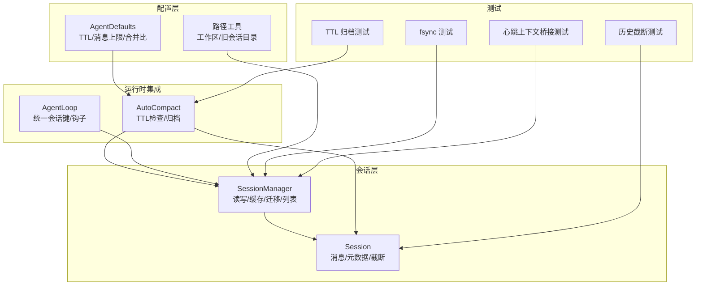
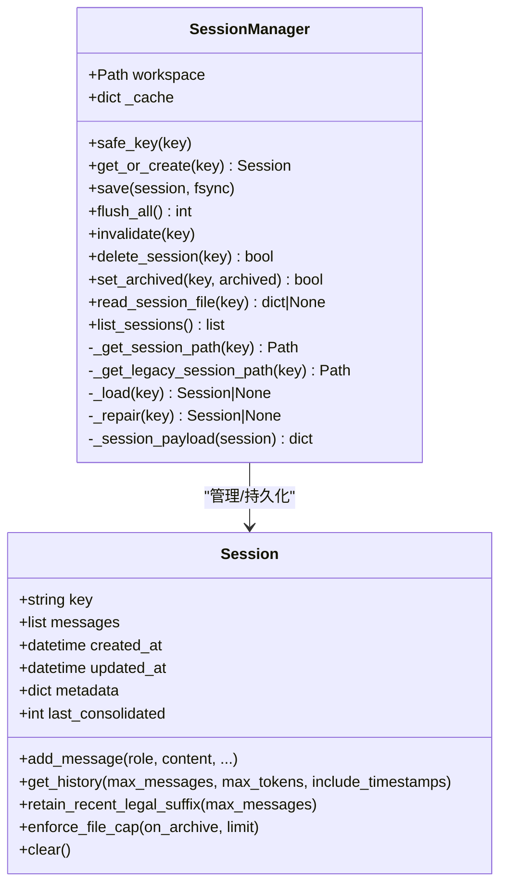
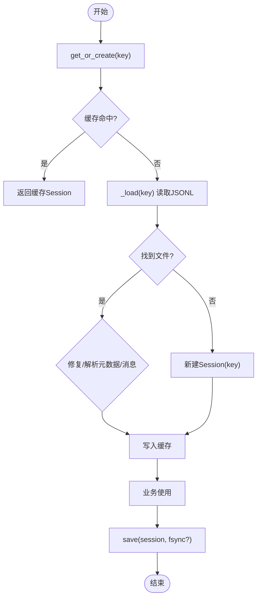
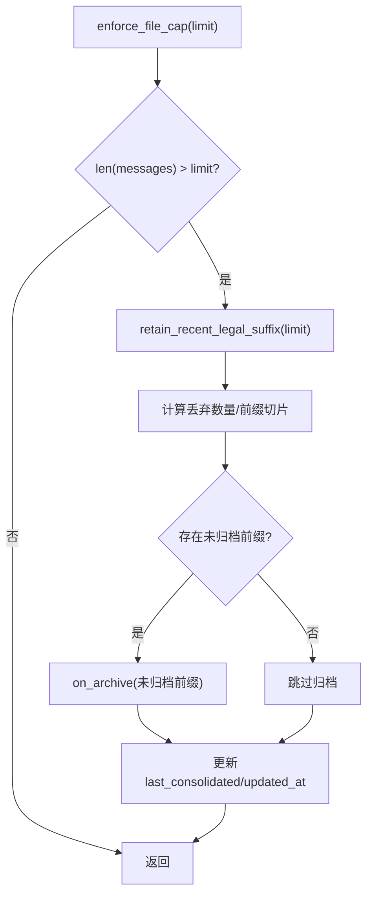
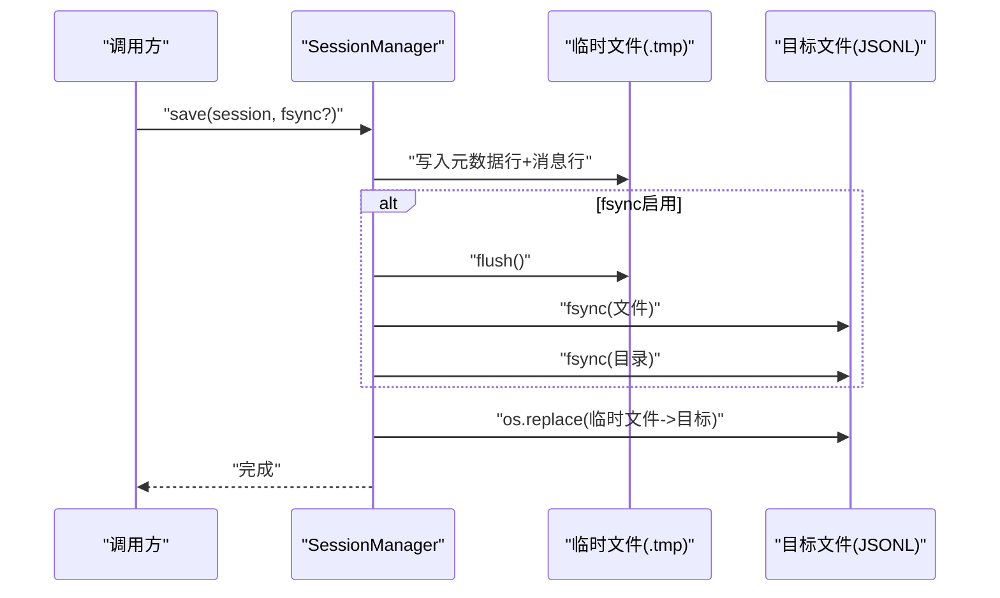
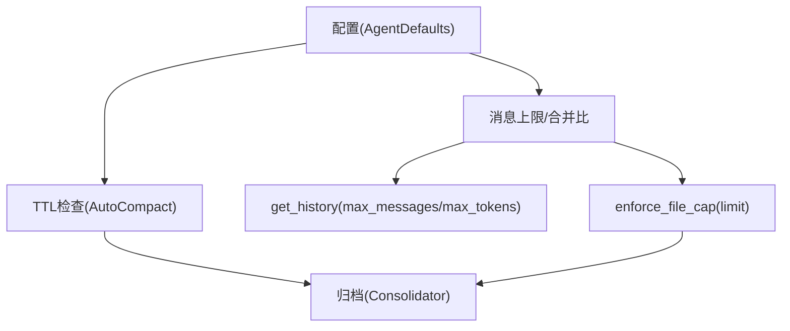
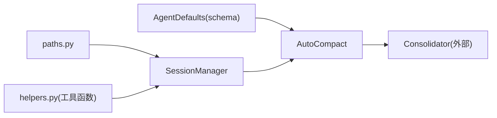

# 会话管理系统

<cite>
**本文引用的文件**
- [secbot/session/manager.py](file://secbot/session/manager.py)
- [secbot/session/__init__.py](file://secbot/session/__init__.py)
- [secbot/config/paths.py](file://secbot/config/paths.py)
- [secbot/config/schema.py](file://secbot/config/schema.py)
- [secbot/agent/autocompact.py](file://secbot/agent/autocompact.py)
- [secbot/agent/loop.py](file://secbot/agent/loop.py)
- [tests/session/test_session_fsync.py](file://tests/session/test_session_fsync.py)
- [tests/agent/test_auto_compact.py](file://tests/agent/test_auto_compact.py)
- [tests/agent/test_consolidate_offset.py](file://tests/agent/test_consolidate_offset.py)
- [tests/heartbeat/test_heartbeat_context_bridge.py](file://tests/heartbeat/test_heartbeat_context_bridge.py)
</cite>

## 目录
1. [简介](#简介)
2. [项目结构](#项目结构)
3. [核心组件](#核心组件)
4. [架构总览](#架构总览)
5. [详细组件分析](#详细组件分析)
6. [依赖分析](#依赖分析)
7. [性能考量](#性能考量)
8. [故障排查指南](#故障排查指南)
9. [结论](#结论)
10. [附录](#附录)

## 简介
本文件系统性阐述 VAPT3 的会话管理系统，覆盖会话生命周期（创建、激活、维护、销毁）、状态持久化（JSONL 文件存储与迁移）、并发与一致性保障（原子写入与 fsync）、上下文管理（历史截断、时间戳注解、工具调用边界）、以及配置与性能优化（TTL 自动归档、消息上限、清理策略）。文档同时提供关键流程的时序图与类图，帮助读者快速理解实现细节。

## 项目结构
会话管理位于 secbot/session 子模块，核心由 Session 与 SessionManager 组成；配合配置层（schema）与自动压缩（autocompact）在 Agent 循环中执行周期性清理；路径与兼容性通过 paths 提供旧版会话目录迁移支持；测试覆盖 fsync 原子落盘、TTL 归档、历史截断等关键行为。



**图表来源**
- [secbot/session/manager.py](file://secbot/session/manager.py)
- [secbot/agent/autocompact.py](file://secbot/agent/autocompact.py)
- [secbot/agent/loop.py](file://secbot/agent/loop.py)
- [secbot/config/schema.py](file://secbot/config/schema.py)
- [secbot/config/paths.py](file://secbot/config/paths.py)
- [tests/session/test_session_fsync.py](file://tests/session/test_session_fsync.py)
- [tests/agent/test_auto_compact.py](file://tests/agent/test_auto_compact.py)
- [tests/agent/test_consolidate_offset.py](file://tests/agent/test_consolidate_offset.py)
- [tests/heartbeat/test_heartbeat_context_bridge.py](file://tests/heartbeat/test_heartbeat_context_bridge.py)

**章节来源**
- [secbot/session/manager.py](file://secbot/session/manager.py)
- [secbot/session/__init__.py](file://secbot/session/__init__.py)
- [secbot/config/paths.py](file://secbot/config/paths.py)
- [secbot/config/schema.py](file://secbot/config/schema.py)
- [secbot/agent/autocompact.py](file://secbot/agent/autocompact.py)
- [secbot/agent/loop.py](file://secbot/agent/loop.py)

## 核心组件
- Session：表示一次对话会话，包含消息数组、创建/更新时间、元数据与 last_consolidated 指针。提供添加消息、获取历史（按条数与 token 预算）、保留最近合法后缀、强制文件上限截断等能力。
- SessionManager：负责会话的磁盘读写、缓存、迁移、列表与只读读取。采用 JSONL 文件存储，元数据行以 _type="metadata" 标识；提供原子写入（临时文件+rename）与可选 fsync 刷盘；支持删除、归档标记、失效缓存等操作。

关键职责与接口：
- 会话创建与激活：get_or_create(key) 从缓存或磁盘加载；若不存在则新建。
- 历史读取：get_history 支持 max_messages 与 max_tokens 双重约束，并保证工具调用边界合法。
- 历史截断：retain_recent_legal_suffix 与 enforce_file_cap 结合 last_consolidated 实现“已归档前缀”的安全截断。
- 持久化：save 使用临时文件写入并原子替换，支持 fsync；flush_all 在关机时对缓存会话批量刷盘。
- 兼容性：_load 自动迁移旧版全局 sessions 目录到工作区 sessions。

**章节来源**
- [secbot/session/manager.py](file://secbot/session/manager.py)

## 架构总览
会话管理贯穿配置、运行时循环与自动压缩三部分：
- 配置层（AgentDefaults）定义会话 TTL、最大消息数、合并比例等参数；
- 运行时循环（AgentLoop）通过 SessionManager 访问会话，结合 AutoCompact 执行周期性归档；
- SessionManager 负责与磁盘交互，确保数据一致与耐久。

```mermaid
sequenceDiagram
participant Cfg as "配置(AgentDefaults)"
participant Loop as "AgentLoop"
participant Ac as "AutoCompact"
participant Sm as "SessionManager"
participant Fs as "文件系统(JSONL)"
Cfg-->>Ac : "session_ttl_minutes / max_messages / consolidation_ratio"
Loop->>Sm : "get_or_create(key)"
Sm->>Fs : "读取/迁移(旧目录)"
Fs-->>Sm : "返回消息与元数据"
Sm-->>Loop : "Session 对象"
Loop->>Sm : "save(session, fsync?)"
Sm->>Fs : "原子写入(临时文件+rename)"
Ac->>Sm : "list_sessions()/check_expired()"
Sm-->>Ac : "会话信息(updated_at/key)"
Ac->>Sm : "invalidate/get_or_create/archive/retain"
Sm->>Fs : "保存归档后的会话"
```

**图表来源**
- [secbot/config/schema.py](file://secbot/config/schema.py)
- [secbot/agent/autocompact.py](file://secbot/agent/autocompact.py)
- [secbot/agent/loop.py](file://secbot/agent/loop.py)
- [secbot/session/manager.py](file://secbot/session/manager.py)

## 详细组件分析

### 类关系与职责（代码级）


**图表来源**
- [secbot/session/manager.py](file://secbot/session/manager.py)

**章节来源**
- [secbot/session/manager.py](file://secbot/session/manager.py)

### 会话生命周期与状态管理
- 创建：get_or_create(key) 若缓存命中直接返回，否则尝试从工作区 sessions 目录加载；若不存在则新建 Session。
- 激活：首次访问时进行旧版 sessions 目录迁移（移动文件），失败则记录警告但不中断。
- 维护：运行时通过 save(fsnc?) 写入磁盘；flush_all 在关机时对所有缓存会话进行强制刷盘。
- 销毁：delete_session(key) 删除磁盘文件并从缓存移除；set_archived(key, archived) 修改元数据标志位并保存。



**图表来源**
- [secbot/session/manager.py](file://secbot/session/manager.py)

**章节来源**
- [secbot/session/manager.py](file://secbot/session/manager.py)

### 历史截断与归档策略
- retain_recent_legal_suffix：在硬上限内保留最近合法后缀，避免破坏工具调用边界与用户起始点。
- enforce_file_cap：当消息总数超过上限时，先裁剪前缀至合法后缀，再将被丢弃的“未归档前缀”回调 on_archive 处理（例如交给 Consolidator 归档），并更新 last_consolidated。
- last_consolidated：指向“已持久化/归档”的消息边界，确保后续截断不会重复归档同一段。



**图表来源**
- [secbot/session/manager.py](file://secbot/session/manager.py)

**章节来源**
- [secbot/session/manager.py](file://secbot/session/manager.py)
- [tests/agent/test_consolidate_offset.py](file://tests/agent/test_consolidate_offset.py)

### 并发控制与一致性保障
- 原子写入：save 使用临时文件写入，完成后 rename 替换原文件，避免部分写入导致的损坏。
- 耐久性：fsync 参数控制是否对文件与父目录进行刷新，适用于带写回缓存的挂载（如 rclone VFS、NFS、FUSE）。
- 缓存一致性：flush_all 对缓存中的所有会话重新保存并 fsync，保证进程退出时数据不丢失；错误会记录但不影响其他会话。
- 读写分离：read_session_file 提供只读视图，避免修改缓存状态；list_sessions 仅扫描元数据行与首个用户消息生成预览。



**图表来源**
- [secbot/session/manager.py](file://secbot/session/manager.py)
- [tests/session/test_session_fsync.py](file://tests/session/test_session_fsync.py)

**章节来源**
- [secbot/session/manager.py](file://secbot/session/manager.py)
- [tests/session/test_session_fsync.py](file://tests/session/test_session_fsync.py)

### 上下文管理与时间戳注解
- 时间戳注解：_annotate_message_time 在用户消息与主动推送（_channel_delivery=True）的消息内容前注入时间戳，便于模型进行相对时间推理；避免对助手回复重复注解以防止元数据泄露。
- 工具调用边界：find_legal_message_start 保证历史片段以合法的工具调用边界开头，避免孤立工具结果或半段调用。
- 历史预览：list_sessions 读取元数据行后扫描首个用户消息作为侧边栏标题预览；read_session_file 也提供相同能力用于只读端点。

**章节来源**
- [secbot/session/manager.py](file://secbot/session/manager.py)

### 配置项与性能优化策略
- TTL 自动归档（session_ttl_minutes）：AgentDefaults 中配置空闲超时（分钟），0 表示禁用；AutoCompact 周期性检查并归档过期会话，保留最近若干条消息作为“近期后缀”，其余归档。
- 最大消息数（max_messages）：get_history 默认保留最近 N 条消息，也可结合 token 预算进一步裁剪。
- 合并比例（consolidation_ratio）：影响归档后保留的比例，降低 token 占用与检索成本。
- 文件上限（FILE_MAX_MESSAGES）：默认 2000，超过后触发 enforce_file_cap 截断与归档。
- 统一会话（unified_session）：AgentDefaults.unified_session=true 时，多通道共享同一会话键，提升跨设备一致性体验。



**图表来源**
- [secbot/config/schema.py](file://secbot/config/schema.py)
- [secbot/agent/autocompact.py](file://secbot/agent/autocompact.py)
- [secbot/session/manager.py](file://secbot/session/manager.py)

**章节来源**
- [secbot/config/schema.py](file://secbot/config/schema.py)
- [secbot/agent/autocompact.py](file://secbot/agent/autocompact.py)
- [tests/agent/test_auto_compact.py](file://tests/agent/test_auto_compact.py)

### 与运行时循环的集成
- 统一会话键：AgentLoop 定义 UNIFIED_SESSION_KEY，当 unified_session 开启时，多通道共享同一会话键，确保跨渠道上下文一致。
- 主动推送与时间戳：心跳等主动推送消息带有 _channel_delivery 标记，历史读取时会注入时间戳，保持上下文连贯。
- 自动归档调度：AutoCompact.check_expired 周期扫描会话列表，跳过活跃会话，对过期会话异步归档，避免阻塞主循环。

**章节来源**
- [secbot/agent/loop.py](file://secbot/agent/loop.py)
- [secbot/agent/autocompact.py](file://secbot/agent/autocompact.py)
- [tests/heartbeat/test_heartbeat_context_bridge.py](file://tests/heartbeat/test_heartbeat_context_bridge.py)

## 依赖分析
- SessionManager 依赖：
  - 路径工具：工作区 sessions 目录与旧版 sessions 目录（迁移）。
  - 辅助函数：安全文件名、消息边界查找、token 估算等。
- AutoCompact 依赖：
  - SessionManager：枚举会话、读写元数据、截断与保存。
  - Consolidator：归档未归档前缀为摘要文本。
- 配置依赖：
  - AgentDefaults：TTL、消息上限、合并比例等参数驱动 AutoCompact 与 get_history 的行为。



**图表来源**
- [secbot/config/schema.py](file://secbot/config/schema.py)
- [secbot/agent/autocompact.py](file://secbot/agent/autocompact.py)
- [secbot/config/paths.py](file://secbot/config/paths.py)
- [secbot/session/manager.py](file://secbot/session/manager.py)

**章节来源**
- [secbot/config/schema.py](file://secbot/config/schema.py)
- [secbot/agent/autocompact.py](file://secbot/agent/autocompact.py)
- [secbot/config/paths.py](file://secbot/config/paths.py)
- [secbot/session/manager.py](file://secbot/session/manager.py)

## 性能考量
- 历史截断与归档：通过 enforce_file_cap 与 AutoCompact 将长历史压缩为摘要，显著降低 token 消耗与加载时间。
- 原子写入与 fsync：默认不 fsync 以兼顾性能；在关机或高可靠场景启用 fsync，确保数据耐久。
- 缓存命中：get_or_create 优先缓存，减少磁盘 IO；flush_all 在关闭时批量刷盘。
- 读写分离：只读端点 read_session_file 不修改缓存，降低竞争风险。
- 合理设置 TTL：避免过短导致频繁归档，过长导致历史膨胀；结合合并比例平衡存储与检索成本。

[本节为通用指导，无需特定文件引用]

## 故障排查指南
- 会话读取失败或损坏：
  - _load 会尝试迁移旧版 sessions 目录；若仍失败则 _repair 逐行解析，跳过损坏行并恢复可用消息与元数据。
  - read_session_file 提供只读视图，失败时同样尝试修复并返回可读 payload。
- fsync 未生效：
  - 默认 save() 不 fsync；若需要在非本地文件系统上保证落盘，显式传入 fsync=True；或在关机时调用 flush_all。
- 归档未发生：
  - 检查 session_ttl_minutes 是否为 0（禁用）；确认会话确实超过 TTL 且非活跃；查看 AutoCompact 的日志输出。
- 历史截断异常：
  - 确认 last_consolidated 与消息长度关系；确保 on_archive 回调正确处理未归档前缀；验证工具调用边界查找逻辑。

**章节来源**
- [secbot/session/manager.py](file://secbot/session/manager.py)
- [tests/session/test_session_fsync.py](file://tests/session/test_session_fsync.py)
- [tests/agent/test_auto_compact.py](file://tests/agent/test_auto_compact.py)
- [tests/agent/test_consolidate_offset.py](file://tests/agent/test_consolidate_offset.py)

## 结论
VAPT3 的会话管理系统以 JSONL 文件为核心持久化介质，结合原子写入、可选 fsync 与缓存策略，实现了高可靠与高性能的会话生命周期管理。通过 TTL 自动归档、历史截断与工具调用边界保护，系统在长对话场景下仍能保持良好的响应与一致性。配置层提供的 TTL、消息上限与合并比例为不同部署环境提供了灵活的优化手段。

[本节为总结，无需特定文件引用]

## 附录
- 关键 API 速览
  - SessionManager.get_or_create(key)：获取或创建会话
  - SessionManager.save(session, fsync=False)：保存会话
  - SessionManager.flush_all()：批量刷盘
  - SessionManager.delete_session(key)：删除会话
  - SessionManager.set_archived(key, archived)：标记归档
  - SessionManager.read_session_file(key)：只读读取
  - SessionManager.list_sessions()：列出会话
  - Session.get_history(max_messages, max_tokens, include_timestamps)：获取历史
  - Session.retain_recent_legal_suffix(max_messages)：保留最近合法后缀
  - Session.enforce_file_cap(on_archive, limit)：强制文件上限并归档

[本节为概览，无需特定文件引用]