# 工作流系统

<cite>
**本文档引用的文件**
- [secbot/workflow/__init__.py](file://secbot/workflow/__init__.py)
- [secbot/workflow/service.py](file://secbot/workflow/service.py)
- [secbot/workflow/runner.py](file://secbot/workflow/runner.py)
- [secbot/workflow/types.py](file://secbot/workflow/types.py)
- [secbot/workflow/store.py](file://secbot/workflow/store.py)
- [secbot/workflow/executors/__init__.py](file://secbot/workflow/executors/__init__.py)
- [secbot/workflow/executors/base.py](file://secbot/workflow/executors/base.py)
- [secbot/workflow/executors/tool.py](file://secbot/workflow/executors/tool.py)
- [secbot/workflow/executors/script.py](file://secbot/workflow/executors/script.py)
- [secbot/workflow/executors/agent.py](file://secbot/workflow/executors/agent.py)
- [secbot/workflow/expr.py](file://secbot/workflow/expr.py)
- [secbot/workflow/templates.py](file://secbot/workflow/templates.py)
- [secbot/workflow/scripts.py](file://secbot/workflow/scripts.py)
- [secbot/workflow/skill_adapter.py](file://secbot/workflow/skill_adapter.py)
- [tests/workflow/test_runner.py](file://tests/workflow/test_runner.py)
- [tests/workflow/test_service.py](file://tests/workflow/test_service.py)
- [tests/workflow/test_store.py](file://tests/workflow/test_store.py)
</cite>

## 目录
1. [简介](#简介)
2. [项目结构](#项目结构)
3. [核心组件](#核心组件)
4. [架构概览](#架构概览)
5. [详细组件分析](#详细组件分析)
6. [依赖关系分析](#依赖关系分析)
7. [性能考虑](#性能考虑)
8. [故障排除指南](#故障排除指南)
9. [结论](#结论)

## 简介

工作流系统是VAPT3平台的核心执行引擎，负责编排和管理各种安全扫描、分析和报告任务。该系统采用模块化设计，支持多种执行器类型（工具、脚本、代理、LLM），提供条件执行、重试机制、进度回调等高级功能。

系统主要特性包括：
- 多种执行器支持：工具调用、Python/Shell脚本执行、专家代理、大语言模型
- 条件执行和模板插值
- 智能重试和错误处理
- 基于文件的持久化存储
- 与技能系统的无缝集成
- 内置钓鱼邮件检测工作流模板

## 项目结构

工作流系统位于`secbot/workflow/`目录下，采用清晰的分层架构：

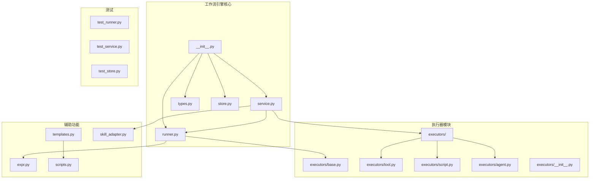

**图表来源**
- [secbot/workflow/__init__.py:1-55](file://secbot/workflow/__init__.py#L1-L55)
- [secbot/workflow/service.py:1-290](file://secbot/workflow/service.py#L1-L290)
- [secbot/workflow/runner.py:1-313](file://secbot/workflow/runner.py#L1-L313)

**章节来源**
- [secbot/workflow/__init__.py:1-55](file://secbot/workflow/__init__.py#L1-L55)
- [secbot/workflow/service.py:1-290](file://secbot/workflow/service.py#L1-L290)
- [secbot/workflow/runner.py:1-313](file://secbot/workflow/runner.py#L1-L313)

## 核心组件

### 数据模型层

工作流系统使用强类型的数据模型来确保数据完整性：

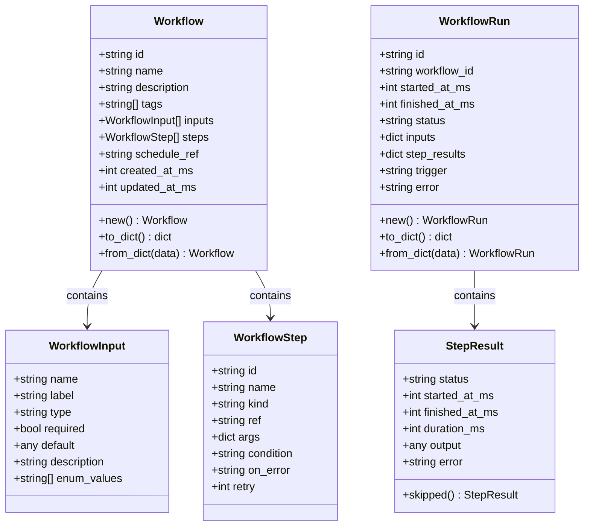

**图表来源**
- [secbot/workflow/types.py:78-275](file://secbot/workflow/types.py#L78-L275)

### 执行器抽象层

所有执行器都继承自统一的抽象基类，提供一致的接口：

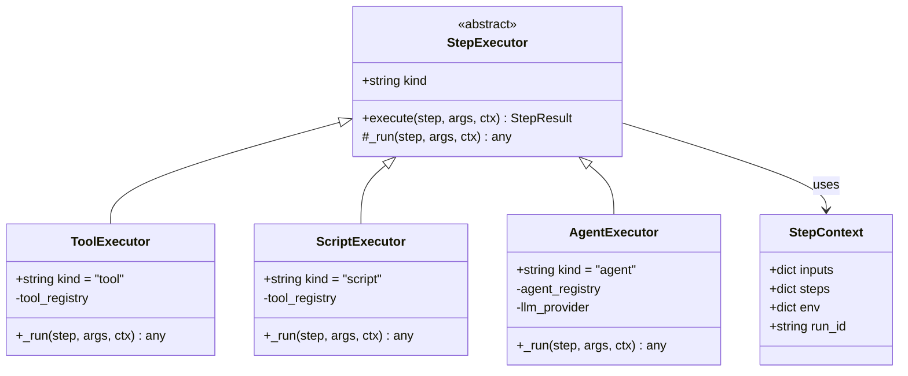

**图表来源**
- [secbot/workflow/executors/base.py:59-116](file://secbot/workflow/executors/base.py#L59-L116)
- [secbot/workflow/executors/tool.py:23-56](file://secbot/workflow/executors/tool.py#L23-L56)
- [secbot/workflow/executors/script.py:46-152](file://secbot/workflow/executors/script.py#L46-L152)
- [secbot/workflow/executors/agent.py:44-161](file://secbot/workflow/executors/agent.py#L44-L161)

**章节来源**
- [secbot/workflow/types.py:1-275](file://secbot/workflow/types.py#L1-L275)
- [secbot/workflow/executors/base.py:1-116](file://secbot/workflow/executors/base.py#L1-L116)

## 架构概览

工作流系统采用分层架构，从上到下分别为服务层、运行时层、执行器层和存储层：

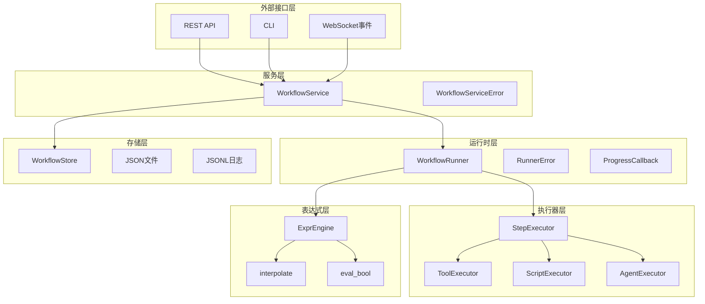

**图表来源**
- [secbot/workflow/service.py:57-227](file://secbot/workflow/service.py#L57-L227)
- [secbot/workflow/runner.py:71-159](file://secbot/workflow/runner.py#L71-L159)
- [secbot/workflow/store.py:33-159](file://secbot/workflow/store.py#L33-L159)

系统的关键流程如下：

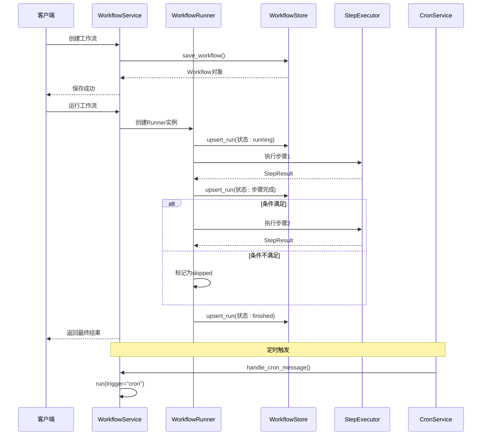

**图表来源**
- [secbot/workflow/service.py:171-184](file://secbot/workflow/service.py#L171-L184)
- [secbot/workflow/runner.py:96-159](file://secbot/workflow/runner.py#L96-L159)

## 详细组件分析

### WorkflowService - 服务协调器

WorkflowService是系统的核心协调器，负责工作流的CRUD操作、调度同步和运行分发：

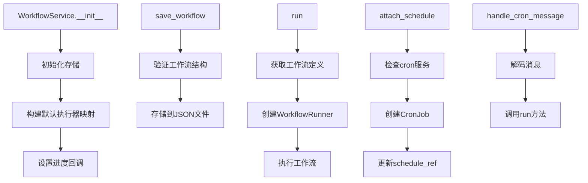

**图表来源**
- [secbot/workflow/service.py:60-108](file://secbot/workflow/service.py#L60-L108)
- [secbot/workflow/service.py:171-184](file://secbot/workflow/service.py#L171-L184)
- [secbot/workflow/service.py:113-143](file://secbot/workflow/service.py#L113-L143)

### WorkflowRunner - 执行编排器

WorkflowRunner负责实际的工作流执行，包括输入解析、条件评估、执行器调用和结果收集：

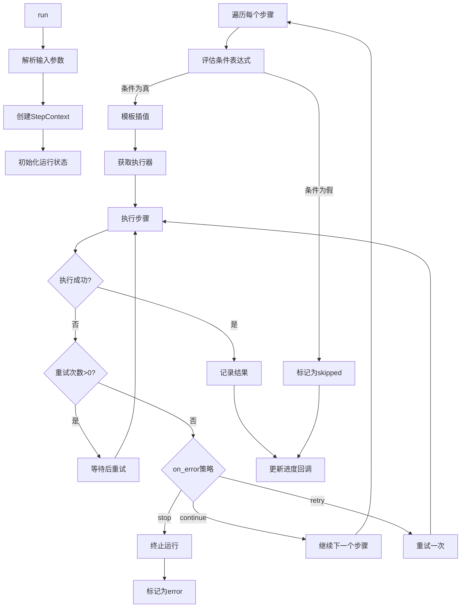

**图表来源**
- [secbot/workflow/runner.py:96-159](file://secbot/workflow/runner.py#L96-L159)
- [secbot/workflow/runner.py:183-233](file://secbot/workflow/runner.py#L183-L233)

### 表达式引擎 - 条件和模板处理

表达式引擎提供了安全的条件评估和模板插值功能：

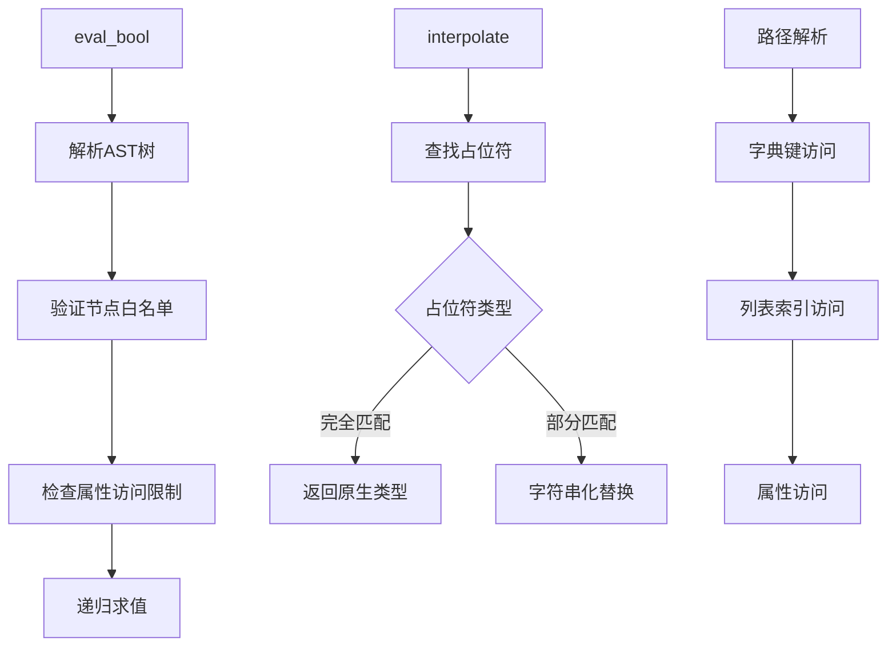

**图表来源**
- [secbot/workflow/expr.py:258-275](file://secbot/workflow/expr.py#L258-L275)
- [secbot/workflow/expr.py:69-98](file://secbot/workflow/expr.py#L69-L98)
- [secbot/workflow/expr.py:46-66](file://secbot/workflow/expr.py#L46-L66)

### 存储系统 - 文件持久化

存储系统采用简单的文件格式实现持久化：

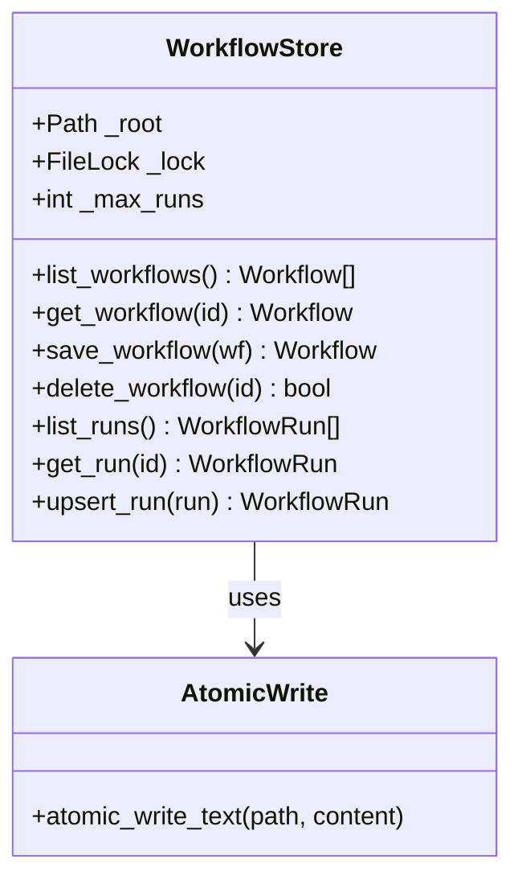

**图表来源**
- [secbot/workflow/store.py:33-159](file://secbot/workflow/store.py#L33-L159)

**章节来源**
- [secbot/workflow/service.py:1-290](file://secbot/workflow/service.py#L1-L290)
- [secbot/workflow/runner.py:1-313](file://secbot/workflow/runner.py#L1-L313)
- [secbot/workflow/expr.py:1-275](file://secbot/workflow/expr.py#L1-L275)
- [secbot/workflow/store.py:1-159](file://secbot/workflow/store.py#L1-L159)

## 依赖关系分析

工作流系统具有清晰的依赖层次结构：

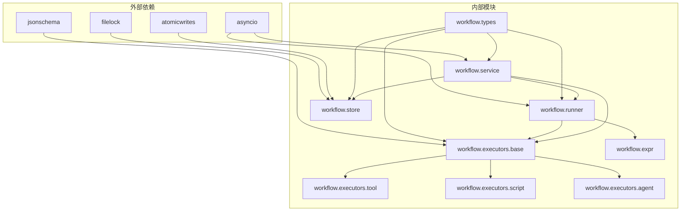

**图表来源**
- [secbot/workflow/executors/agent.py:37-41](file://secbot/workflow/executors/agent.py#L37-L41)
- [secbot/workflow/store.py:23-26](file://secbot/workflow/store.py#L23-L26)

### 关键依赖点

1. **jsonschema**: 用于代理执行器的输入输出模式验证
2. **filelock**: 确保多进程环境下的文件操作安全
3. **atomicwrites**: 提供原子文件写入能力
4. **asyncio**: 支持异步执行模式

**章节来源**
- [secbot/workflow/executors/agent.py:37-41](file://secbot/workflow/executors/agent.py#L37-L41)
- [secbot/workflow/store.py:23-26](file://secbot/workflow/store.py#L23-L26)

## 性能考虑

### 存储性能优化

系统采用以下策略优化存储性能：

1. **文件锁定**: 使用`filelock`确保并发安全
2. **原子写入**: 通过`atomic_write_text`避免部分写入
3. **批量操作**: JSONL格式支持高效的批量读取
4. **内存映射**: 运行时状态在内存中维护，减少磁盘I/O

### 执行性能优化

1. **异步执行**: 所有执行器支持异步调用
2. **进度回调**: 非阻塞的进度通知机制
3. **缓存策略**: 环境变量快照避免重复读取
4. **超时控制**: 脚本执行器内置超时保护

### 内存管理

系统通过以下方式管理内存使用：
- 分步执行避免一次性加载大量数据
- 及时清理临时文件和中间结果
- 控制运行历史的最大条目数

## 故障排除指南

### 常见错误类型

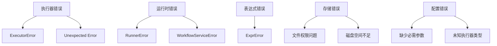

### 调试技巧

1. **启用详细日志**: 检查`workflow`命名空间的日志输出
2. **验证工作流定义**: 使用`WorkflowService._validate_workflow`进行结构验证
3. **测试表达式**: 单独测试条件表达式的语法正确性
4. **检查执行器**: 确认执行器注册和可用性

**章节来源**
- [tests/workflow/test_runner.py:1-381](file://tests/workflow/test_runner.py#L1-L381)
- [tests/workflow/test_service.py:1-292](file://tests/workflow/test_service.py#L1-L292)
- [tests/workflow/test_store.py:1-210](file://tests/workflow/test_store.py#L1-L210)

## 结论

VAPT3工作流系统是一个设计精良的执行引擎，具有以下特点：

**优势**:
- 清晰的分层架构便于维护和扩展
- 强类型的数据模型确保数据完整性
- 安全的表达式引擎防止代码注入
- 灵活的执行器系统支持多种任务类型
- 完善的测试覆盖保证系统稳定性

**适用场景**:
- 安全扫描和分析任务编排
- 自动化报告生成
- 多步骤复杂工作流执行
- 与技能系统的深度集成

**未来改进方向**:
- 支持数据库后端以提高性能
- 增加工作流版本管理和回滚功能
- 实现更精细的错误恢复机制
- 添加工作流监控和告警功能

该系统为VAPT3平台提供了强大的工作流执行能力，是整个安全自动化体系的核心基础设施。